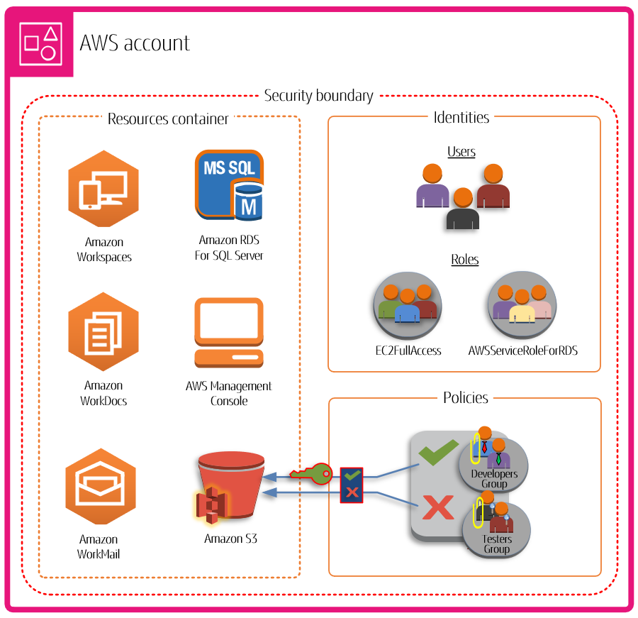

## 什么是 AWS 账户？
AWS 账户代表您与 AWS 建立的正式业务关系。  
您可以在 AWS 账户中创建和管理您的 AWS 资源，并且您的账户提供用于访问和计费的身份管理功能。  
每个 AWS 账户都有一个唯一的 ID，用于区别于其他 AWS 账户。  
您的云资源和数据包含在 AWS 账户中。  
账户充当身份和访问管理隔离边界。  
当您需要在两个账户之间共享资源和数据时，您必须明确允许此访问。  
默认情况下，账户之间不允许访问。  
例如，如果您指定不同的账户来包含您的生产和非生产资源和数据，则默认情况下这些环境之间不允许访问。  

AWS 账户也是访问 AWS 服务的基本组成部分。  
如下图所示，AWS 账户有两个主要功能：  
* 资源容器 – AWS 账户是您作为 AWS 客户创建的所有 AWS 资源的基本容器。  
例如，Amazon Simple Storage Service (Amazon S3) 存储桶、Amazon Relational Database Service (Amazon RDS) 数据库和 Amazon Elastic Compute Cloud (Amazon EC2) 实例都是资源。  
每个资源都由 Amazon 资源名称 (ARN) 唯一标识，其中包含包含或拥有该资源的账户的账户 ID。  
* 安全边界 – AWS 账户也是您的 AWS 资源的基本安全边界。  
您在账户中创建的资源可供拥有您账户凭证的用户使用。  
您可以在账户中创建的关键资源包括身份，例如用户和角色。  
身份具有凭证，某人可以使用这些凭证登录（身份验证）AWS。  
身份还具有权限策略，指定用户可以对账户中的资源执行哪些操作（授权）。  

使用多个 AWS 账户是扩展环境的最佳实践，因为它为成本提供了自然的计费边界，隔离了资源以确保安全，为个人和团队提供了灵活性，此外还能够适应新的业务流程。有关更多信息，请参阅使用多个 AWS 账户的好处。

### AWS 账户的功能
AWS 账户包含以下核心功能：
* 监控和控制成本 – 账户是分配 AWS 成本的默认方式。  
因此，对不同的业务部门和工作负载组使用不同的账户可以帮助您更轻松地跟踪、控制、预测、预算和报告云支出。  
除了账户级别的成本报告外，如果您选择在某个时候使用 AWS Organizations，AWS 还具有内置支持，可以整合和报告整个账户集的成本。  
您还可以使用 AWS 服务配额来帮助保护您免受意外过度配置 AWS 资源和恶意操作的影响，这些可能会严重影响您的 AWS 成本。  
* 隔离单元 – AWS 账户为您的 AWS 资源提供安全性、访问和计费边界，可帮助您实现资源自主性和隔离性。  
根据设计，一个账户内配置的所有资源在逻辑上都与其他账户中配置的资源隔离，即使在您自己的 AWS 环境中也是如此。  
此隔离边界为您提供了一种限制与应用程序相关的问题、配置错误或恶意操作的风险的方法。  
如果一个账户内发生问题，则可以减少或消除对其他账户中包含的工作负载的影响。  
* 镜像您的业务工作负载 – 使用多个账户将具有共同业务目的的工作负载分组到不同的账户中。  
因此，您可以将所有权和决策与这些账户保持一致，并避免与其他账户中工作负载的保护和管理方式产生依赖和冲突。  
根据您的整体业务模式，您可以选择将不同的业务部门或子公司隔离在不同的账户中。  
这种方法也可能随着时间的推移简化对这些部门的剥离。  