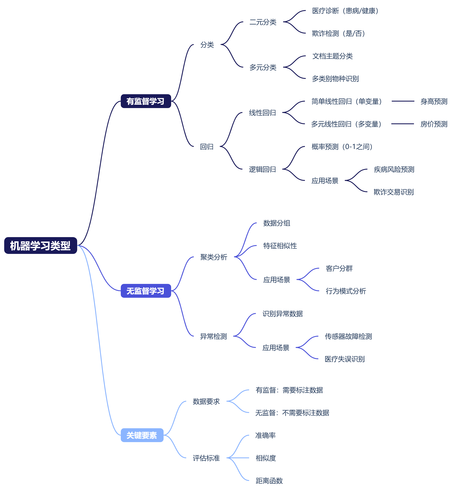
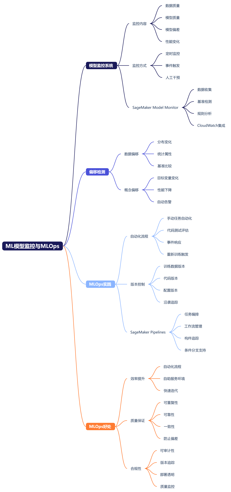
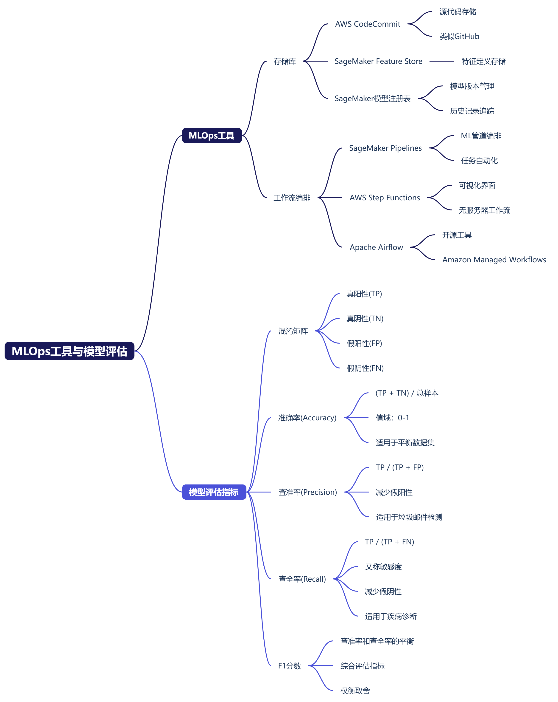
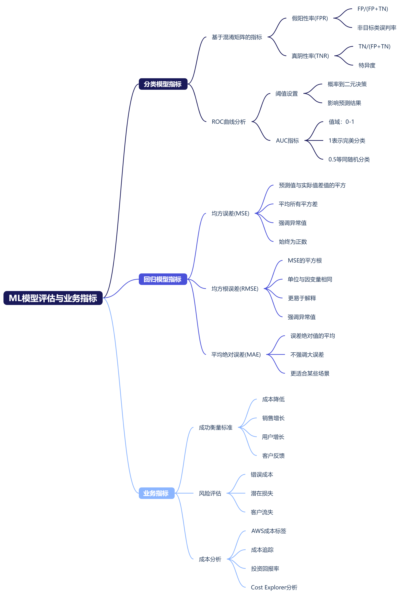

## 模块 3：复习和练习
### 领域 1：AI 和 ML 的基础知识
* 简介

我们开始探讨领域 1，其中介绍了人工智能 (AI) 和机器学习 (ML) 的基础知识。  
领域 1 分为三个主题，我们将在接下来的几个课次中讨论这些主题。任务陈述 1.1：解释基本的 AI 概念和术语。任务陈述 1.2：确定 AI 的实际使用案例。任务陈述 1.3：描述 ML 开发生命周期。  
在第一个任务陈述中，您必须了解人工智能及其子组件的基本概念和术语：机器学习和深度学习。您需要能够概述机器学习模型的工作和开发原理，这包括了解推理选项、训练模型中使用的不同数据类型以及学习算法的主要类别。  
在第二个任务陈述中，您必须熟悉一些常见的 AI 使用案例。这些使用案例包括何时适合使用 AI，何时可能不适合。在本任务陈述中，还需要知道哪些 ML 技术适用于特定的使用案例。您还需要了解 Amazon Web Services (AWS) 提供的完全托管式式且预先训练的人工智能和机器学习服务。  
在第三个任务陈述中，您将描述 ML 开发生命周期，其中包括从数据收集到模型托管和监控的 ML 管道的组件。您将确定每个管道阶段可使用的 AWS 服务。  
最后，您需要了解如何根据绩效和业务指标评估 ML 模型。在接下来的几个视频中，我将分别介绍每项任务陈述，并详细说明每个目标。  

%20和机器学习%20(ML)%20基础知识.png)

* 任务陈述 1.1：解释基本的 AI 概念和术语

下面我们开始探讨领域 1 的第一个任务陈述：解释基本的 AI 概念和术语。这个任务陈述分为五节课。  
首先，我们来说明什么是人工智能。我们还将举一些例子。人工智能 (AI) 属于计算机科学领域，致力于解决通常与人类智能相关的认知问题，例如学习、创造和图像识别。AI 的目标是创建可从数据中找出意义的自主学习系统。  
您可能已体验过 Alexa 和 ChatGPT，当您提问时，AI 技术可以提供有意义的回复。AI 甚至可以创建原始内容，例如文本和图像。  
由于 AI 系统能够快速处理大量数据，因此可用于解决复杂的问题，例如实时欺诈侦测。  
人工智能还可以执行重复和单调的任务，让员工能够腾出时间去做更具创造性的工作，从而提高业务效率。  
在发现数据模式和预测趋势方面，AI 异常强大。这可以帮助企业做出更明智的决策，更快地对问题做出反应。  
机器学习是 AI 和计算机科学的一个分支，专注于使用数据和算法来模仿人类的学习方式。它可以逐渐提高构建从数据中学习的计算机系统的准确性。  
机器学习模型的训练方法是使用大型数据集来识别模式和进行预测。例如，为线上购物的买家推荐商品。  
深度学习是一种受人脑启发的机器学习模型，它使用神经网络层来处理信息。深度学习模型可以识别人类语音和图像中的对象。  
AI 系统可为许多行业及其客户带来益处。AI 系统用于医疗行业，可以帮助读取 X 光片和扫描以及进行诊断。疾病防控中心 (CDC) 等机构使用 AI 来预测全球流行病和疫情，并派出所需的医务人员和资源。  
Koch Industries 等制造商使用 AI 和计算机视觉来监控装配线并保证产品质量。他们还监控传感器数据，预测设备何时需要维护，以免出现故障。  
客户可以通过聊天和搜索系统更轻松地访问产品和支持信息，这些系统可以识别他们的语言并引导他们找到解决方案。  
AI 系统使用购物活动历史记录来推荐商品并帮助买家购买他们所需的商品。  
Discovery 使用 AI 根据观看者的观看历史记录为他们提供个性化的内容推荐。企业能够更准确地预测需求，从而提高效率并更好地为客户提供服务。  
例如，出租车公司使用 AI 在乘客可能需要的时间将汽车停在乘客可能需要的位置。  
MasterCard 等金融机构可以使用 AI 检测异常活动，从而检测欺诈性交易。  
人力资源部门可以使用 AI 处理简历并将候选人与空缺职位相匹配，帮助招聘经理提高工作效率。  
公司利用 AI 对他们客户的了解，向客户发送他们可能最需要的促销活动，避免大量发送无效邮件。  
TickeTek 借助 AI 向客户发送根据其独特兴趣量身定制的节目和活动推荐。  
AI 模型使用一种称为回归分析的技术，可以处理历史数据（也称为时间序列数据）并预测未来值。  
例如，某商店需要知道在某天可能需要多少名销售人员来为顾客提供服务。AI 模型可以分析过去的模式，并预测未来某一天会有多少顾客进入商店。AI 做出的预测称为推理。请注意，推理基本上是一种有根据的猜测，因此模型给出的是概率性结果。  
由于 AI 可以识别数据中的模式，因此它还可以检测何时与预期模式存在偏差，即异常。  
在此示例中，客户服务团队全天接听的电话数量可能会以可预测的方式变化。当发生意外情况时，例如呼叫中心的应用程序离线，AI 可以检测到电话掉线并通知 IT 部门。  
计算机视觉应用程序使用 AI 来处理图像和视频，以进行对象识别、面部识别、分类、推荐、监控和检测。  
在此示例中，计算机视觉模型检测到表面上有划痕，并在图像上用红框标出划痕位置。  
在更高级的应用中，模型能够发现电路板上缺少电容器。  
无需人工参与，AI 即可将文本从一种语言翻译成另一种语言。它不再是逐字翻译，而是会分析所有文本元素并识别单词之间如何相互影响，从而能够在目标语言中准确地传达短语的含义。  
下面以一个客户支持聊天应用程序为例。客户用西班牙语，而支持代表用英语。该应用程序正在英语和西班牙语之间实时翻译。自然语言处理 (NLP) 使机器能够理解、诠释和生成听起来很自然的人类语言。  
这正是为 Alexa 设备和允许您预订酒店的聊天机器人提供支持的技术。  在此示例中，聊天机器人正提示客户提供预订所需的信息。  
生成式 AI 是人工智能的下一步发展趋势。生成式 AI 可以进行看似智能的对话，生成故事、图像、视频甚至音乐等原创内容。  
以下是使用 Amazon Bedrock 的示例。在使用生成式 AI 时，通常会从提示词开始。我的提示词是：Generate a song from these lyrics。哇，还不错。根据我的简单提示词，我收到了完整的歌词，包括两段主歌、一段副歌、一个过渡段和结尾部分。  
这节课到此结束，在下一节课中，我们将继续讨论任务陈述 1.1。

我们继续探讨任务陈述 1.1：解释基本的 AI 概念和术语。这里我们重点介绍一种特定类型的人工智能：机器学习。  
机器学习是一门开发算法和统计模型的科学，计算机系统使用这些算法和统计模型在没有明确指令的情况下执行复杂任务。计算机系统使用 ML 算法来处理大量历史数据并识别数据模式。  
机器学习从数学算法开始，算法将数据作为输入并生成输出。为了训练算法产生预期的输出，我们向其提供包含特征的已知数据。  
您可以将特征视为表格中的列或图像中的像素。我们继续训练算法，为其提供更多已知数据进行分析。算法的任务是找出输入数据特征与已知预期输出（如果有）之间的相关性。  
通过更改内部参数值对模型进行调整，直到模型可靠地产生预期的输出。然后，经过训练的模型能够做出准确的预测，并根据训练期间未见过的新数据生成输出。这个过程叫作推理。  
可以使用不同来源的不同类型的数据对 ML 模型进行训练。一种是结构化数据，这种数据最容易理解和处理。这种类型的数据以行形式存储在包含列的表中，这些列可以用作 ML 模型的特征。  
例如，结构化数据可以是 CSV 等文本文件，也可以存储在 Amazon Relational Database Service (Amazon RDS)、Amazon Redshift 等关系数据库中。可以使用结构化查询语言 (SQL) 查询此类数据。  
要训练模型，可以将数据导出到 Amazon Simple Storage Service (Amazon S3)。Amazon S3 是训练数据的主要来源，因为它可以存储任何类型的数据，成本更低，而且存储容量几乎是无限的。  
另一种是半结构化数据。半结构化数据并不完全遵循结构化表格数据的规则。与表中的数据不同，半结构化数据元素可以具有不同的属性或缺少属性。  
例如，包含 JSON 的文本文件就是半结构化数据，JSON 是 JavaScript 对象表示法 (JavaScript Object Notation) 的缩写。  
在此类文档中，特征以键值对的形式表示。Amazon DynamoDB 和 Amazon DocumentDB （兼容 MongoDB）是专门为半结构化数据构建的事务数据库的两个示例。  
要训练 ML 模型，可以将数据导出到 Amazon S3 中。非结构化数据是不符合任何特定数据模型且不能以表格格式存储的数据。  
一些示例包括图像、视频和文本文件或社交媒体帖子。非结构化数据通常作为对象存储在 Amazon S3 等对象存储系统中。  
使用分词化 (Tokenization) 之类的处理技术将文本分成单个单词或短语单元，从对象中派生用于机器学习的特征。  
时间序列数据对于训练需要预测未来趋势的模型非常重要。每条数据记录都标有时间戳并按顺序存储。  
此示例显示了微服务的性能指标，包括已用内存、CPU 百分比和每秒事务数。机器学习模型可以发现这些数据中的模式。然后，在预计负载增加之前，它可以利用所发现的趋势，主动横向扩展该服务的基础设施。  
根据采样率，长期捕获的时间序列数据可能会变得非常大，可以存储在 Amazon S3 中用于模型训练。  
要创建机器学习模型，我们需要从算法开始，算法定义了输出和输入之间的数学关系。在这个简单的线性回归示例中，我们想找到与输入数据相匹配的最佳拟合线。  
此示例提供了几个人的身高和体重，让我们用于训练数据。简单的线性方程 y = mx + b，或者在本例中为 h = mw + b，定义了自变量 w 和因变量 h 之间的线性关系。斜率 m 和截距 b 是模型参数，在训练过程中迭代调整这些参数以找到最佳拟合模型。  
为了确定最佳拟合，我们会寻找能够最大限度地减少误差的参数值。在这种情况下，误差就是数据点与线之间的距离。模型训练完成后，就可以开始推理了。  
在此示例中，我们的模型将根据一个人的体重推理出该人的身高。  
这节课到此结束，在下一节课中，我们将继续讨论任务陈述 1.1。

我们继续探讨任务陈述 1.1：解释基本的 AI 概念和术语。最后一课介绍模型训练。  
训练过程生成的模型构件通常由经过训练的参数、描述如何计算推理的模型定义以及其他元数据组成。模型构件通常存储在 Amazon S3 中，与推理代码打包在一起，形成可部署的模型。  
推理代码是通过读取构件来实现模型的软件。模型托管有两个常用选项。第一个选项是终端节点随时可用于实时接受推理请求。第二个选项是由批处理任务执行推理。实时推理非常适合具有低延迟和高吞吐量要求的线上推理。  
对于实时推理，您的模型部署在持久性终端节点上，以处理持续的请求流。客户端向模型发送输入数据，并很快收到推理。  
另一个选项是批处理。批处理适用于预先有大量数据可用且不需要持久性终端节点时的离线处理。当您需要大量推理并且接受要等一段时间才能获得结果时，批处理可能更具成本效益。  
例如，您拥有历史销售数据，并且想要预测目录中每种产品下个月所需的库存。您的模型输入数据可以每月处理一次，结果可用于生成报告。  
实时推理与批处理之间的主要区别在于，使用批处理时，计算资源仅在处理批次时运行，之后关闭。使用实时推理时，一些计算资源始终处于运行状态，并且可用于处理请求。  
根据预期的输出和输入类型，可以使用几种不同的机器学习方式。  
第一种是有监督学习。通过有监督学习，您可以使用预先标注的数据训练模型。  
在此示例中，我们显示了鱼的模型图片，并将这些图片标注为“鱼”。在同一个数据集中，我们包括了其他动物的照片，例如海牛，并将这些动物标注为“不是鱼”。因此，我们的训练数据同时指定了算法的输入和所需输出。  
对于这种图像分类问题，模型将查看图像的像素并识别聚类和模式。训练过程中会调整算法的内部参数。一直持续到模型成功将标注为“鱼”的图像识别为鱼，将其他标注为“不是鱼”的图像识别为不是鱼。  
请注意，机器学习推理并不总是准确的，因此模型实际生成的是将一张图像识别为鱼类的概率。  
有监督学习的挑战在于标注数据。可能需要使用数千张鱼类图片训练模型，然后模型才能做出可靠的预测。这需要相关人员查看图像并标注图像。  
为了应对这一挑战，Amazon 提供了一项标注服务，即 Amazon SageMaker Ground Truth。SageMaker Ground Truth 可以利用一项名为 Amazon Mechanical Turk 的众包服务，该服务可帮助您在全球找到大量费用合理的劳动力。  
无监督学习算法基于具有特征但未标注的数据进行训练。它们可以发现模式，将数据分组到集群中，或者将数据分成一定数量的组。  
无监督学习可用于模式识别、异常检测和自动将数据分为不同类别等使用案例。由于训练数据不需要标注，因此设置非常简单。无监督学习算法还可用于清理和处理数据，以便自动继续建模。  
聚类的一个示例是识别不同类型的网络流量以预测潜在的安全事件。由于无监督学习可以检测异常情况，因此通常用于异常检测。  
例如，ML 模型会检查从传感器收集的数据。如果报告的数据远远超出正常范围，模型会检测到油井的温度传感器可能出现故障。  
强化学习是一种侧重于让代理自主决策的机器学习方法。代理在环境中采取操作以实现指定的目标。模型通过试错进行学习，训练不需要标注输入。如果代理采取的操作使其更接近目标，会得到奖励。  
为了鼓励学习代理在训练期间学习，必须允许它有时执行可能不会得到奖励的操作。  
为了教开发人员开发强化学习模型，Amazon 提供了一款名为 AWS DeepRacer 的模型赛车，您可以训练它在赛道上行驶。在 AWS DeepRacer 中，赛车就是代理，赛道就是环境。操作就是赛车在赛道上向前行驶，目标是留在赛道上并尽可能高效地跑完全程。  
无监督学习和强化学习都可以在没有标注数据的情况下运行。无监督学习算法会在训练过程中接收无指定输出的输入。但是，强化学习已预先确定最终目标。  
虽然强化学习采用探索性方法，但探索不断得到验证和改进，以增加实现最终目标的可能性。  
这节课到此结束，在下一节课中，我们将继续讨论任务陈述 1.1。

我们继续探讨任务陈述 1.1：解释基本的 AI 概念和术语。  
我们已知道，机器学习模型的输出是推理。在我们的鱼示例中，我们通过使用鱼在水中游的图像来训练模型，使其能够识别鱼图像。  
但是，我们部署的模型可能会看到略有不同的鱼图像，比如一条离开水的鱼，因而无法将其识别为鱼。如果模型使用训练数据比使用新数据的训练效果好，这种情况称为过拟合，也就是说模型的识别能力不佳。  
模型对训练数据的拟合度太高，因此，当它看到略有不同的对象时，将其视为鱼的概率就很低。通常，纠正模型过拟合的最佳方法是使用更加多样化的数据对其进行训练。  
有时，如果模型训练时间过长，它会开始过分强调不重要的特征（即噪声），这是另一种方式的过拟合。欠拟合是另一种类型的错误，当模型无法确定输入和输出数据之间存在有意义的关系时，就会发生这种错误。  
欠拟合的模型为训练数据集和新数据提供的结果都不准确。如果训练模型的时间不够长或者没有足够大的数据集，就会发生这种情况。训练时间过长可能会导致过拟合，因此数据科学家尝试找到最佳训练时间，使模型不会欠拟合或过拟合。  
偏差是指在不同群体之间模型的性能存在差异。结果会倾向于或背离特定类别的结果。  
以自动批准贷款申请的机器学习模型为例。训练数据包含应获得批准和不应获得批准的贷款申请的示例。如果训练数据未涵盖足够多的来自不同人群的申请，则模型学习的可能是对特定群体有偏见的模式。  
例如，贷款申请包含客户的收入、工作经历、年龄、性别和地点等特征。假设训练数据中没有任何居住在威斯康星州的 25 岁女性的获批申请，那么模型会认为，尽管根据收入和工作经历等其他特征判断，她们符合资格，但不应获得批准。  
模型的质量取决于基础数据的质量和数量。此外，如果模型表现出偏差，则数据科学家可以直接调整引入噪声的特征的权重。  
例如，它可以完全排除模型对性别的考虑。在创建模型之前，应从一开始就确定公平性约束条件，例如年龄和性别歧视。应检查和评估训练数据是否存在潜在偏差，并且需要通过检查结果的公平性来持续评估模型。  
这节课到此结束。在下一课中，我们将继续学习任务陈述 1.1。

我们继续探讨任务陈述 1.1：解释基本的 AI 概念和术语。这里我们重点介绍一种特定类型的机器学习：深度学习。  
深度学习是一种机器学习，它使用称为“神经网络”的算法结构。这种算法结构基于人脑的结构。在我们的大脑中，由称为“神经元”的脑细胞形成了一个复杂的网络，它们相互发送电信号以帮助我们处理信息。  
在深度学习模型中，我们使用被称为“节点”的软件模块来模拟神经元的行为。深度神经网络由节点层组成，包括一个输入层、几个隐藏层和一个输出节点层。  
神经网络中的每个节点自主为每个特征分配权重。信息在网络中从输入向前流到输出。然后在训练期间，计算预测输出与实际输出之间的差异。反复调整神经元的权重以最大限度地减少误差。  
深度学习在图像分类和自然语言处理等任务中表现出色，在这些任务中，需要识别数据对象之间的复杂关系。在之前的鱼示例中，我们看到我们可以训练机器模型识别图像中的对象，但是训练这种模型需要耗费大量的人力来标注数千张图像。  
图像分类、对象检测和其他形式的计算机视觉过去就是这样运作的。在深度学习中引入神经网络的概念已经存在了一段时间。但是，在低成本云计算问世之前，大多数企业无法获得所需的计算能力。  
由于现在任何人都可以轻松地在云端使用强大的计算资源，神经网络已成为计算机视觉的标准算法。深度学习模型给计算机视觉带来的一大优势是无需为它们提供相关特征。它们可以自行识别图像中的模式并提取重要特征。  
但是，我们可能需要为深度学习模型提供数百万张鱼图像，然后它才能准确地检测和标注图中的鱼类。而且，要使用如此庞大的数据集反复训练深度学习模型，所需的计算基础设施的成本将高于传统方法。  
使用传统机器学习还是深度学习取决于您需要处理的数据类型。在从结构化数据和标注数据中识别模式时，传统的机器学习算法通常表现良好，且很高效。  
示例包括分类和推荐系统。例如，手机公司可以使用 ML 根据先前的客户流失数据预测客户何时会更换运营商。  
另一方面，深度学习解决方案更适用于非结构化数据，例如图像、视频和文本。深度学习的任务包括图像分类和自然语言处理，需要识别像素和单词之间的复杂关系。  
例如，深度学习解决方案可以分析社交媒体提及次数或产品反馈以确定用户情绪。这两种机器学习都使用统计算法，但只有深度学习使用神经网络来模拟人类智能。  
据我们所知，深度学习模型会自主学习模式，因此它们在选择和提取特征方面不需要做太多工作。但是，深度学习模型的基础设施成本明显更高。  
最后，我们来深入讨论生成式 AI。生成式 AI 是通过使用深度学习模型来实现的，这些模型已使用包含文本字符串（用 AI 术语来说是“序列”）的超大数据集进行了预训练。它们使用 Transformer 神经网络，将生成式 AI 中的输入序列（称为“提示词”）更改为输出序列（即对提示词的响应）。  
神经网络按顺序处理序列的元素，一次处理一个单词。Transformer 并行处理序列，这加快了训练速度并允许使用更大的数据集。大型语言模型包含数十亿个特征，可以获取广泛的人类知识。通过所有这些训练，大型语言模型可以非常灵活地执行任务。  
它们在自然语言处理方面的表现优于其他 ML 方法。大型语言模型擅长理解人类语言，因此可以阅读长篇文章并对其进行总结。它们还擅长以和人类相似的方式生成文本。因此，大型语言模型擅长语言翻译，甚至能撰写原创故事、信件、文章和诗歌。  
它们甚至通晓计算机编程语言，可以为软件开发人员编写代码。这里我要求 Amazon Bedrock 解释一下大型语言模型。如果您想自己免费试用 Amazon Bedrock，不妨访问 partyrock.aws 开发自己的 AI 应用程序。好了，我们将在下一课中开始学习任务陈述 1.2。

* 任务陈述 1.2：确定 AI 的实际使用案例

现在我们来讨论领域 1 中的第二个任务陈述：确定 AI 的实际使用案例。这个任务陈述分为五节课。  
首先，我们了解几个考虑应用 AI/ML 的使用案例和场景。与人类不同，AI 技术可以每天都全天候工作，而不会降低性能。  
因此，我们可以让 AI 专注于员工难以完成或觉得无聊的重复且乏味的任务。AI 可以减少员工的工作量，同时简化所有与业务相关的操作。  
AI 技术可以使用 ML 和深度学习网络通过类人智能来解决复杂的问题。AI 是解决复杂问题的绝佳选择，这些问题涉及高速分析海量数据，远超人类能力范畴。  
由于 AI 在识别模式方面表现出色，因此非常擅长检测模式偏差和揭露欺诈行为。AI 可以通过预测对产品或资源的需求来帮助减少浪费。公司可以做出更明智的决策，提高效率，更好地满足客户需求。  
据我们所知，有很多有用的应用程序引入了人工智能。但是，AI 并不能解决所有问题。我们来看看一些 AI 并非最佳选择的使用案例。  
使用机器学习训练 AI 会消耗大量资源。处理能力可能耗资很高，可能还需要经常对模型进行重新训练。在启动耗资巨大的 AI 项目之前，应该先确定给企业带来的收益将超过 AI 解决方案的成本。  
例如，设定欺诈和浪费减少所带来的目标节省金额，然后估算为实现这些目标而构建模型所需的成本。如果成本超过节省的费用，那么您可能不应该继续启动项目。  
AI 模型可用于做出对客户有影响的决策。例如，当有人申请贷款时，务必确保模型值得信赖且易于理解。  
但是，复杂的神经网络会对人脑进行建模。人们不完全理解内部机制如何以及为何能影响预测结果（称为模型的可诠释性）。复杂模型通常在兼容性与可诠释性之间进行权衡。  
如果业务或合规性要求完全透明，则需要使用不太复杂的模型，这通常会导致性能降低。  
另一种选择是使用不需要 AI 的基于规则的系统。例如，根据规则，信用评分约达到 750 的人员在申请 10,000 美元或以下的贷款时应自动获得批准。  
如果软件应用程序始终为相同的输入生成相同的输出，则可以说它是确定性的。除非有人更改规则，否则基于规则的应用程序是确定性的。  
但是，机器学习模型是概率性的。也就是说，模型决定了某件事的可能性。机器学习模型会随着时间的推移不断学习和适应，并将随机性融入其方法中。  
因此，相同的输入值集将产生各种不一致的结果。如果需要确定性，那么基于规则的系统是更好的选择。

我们继续学习“任务陈述 1.2：识别 AI 的实际使用案例”，讨论不同的 ML 问题类型以及如何识别它们。  
如果您的数据集包含作为输入的特征或属性，并将目标值标注为输出，则存在有监督学习问题。在这类问题中，您可以使用包含已知输入和输出的数据训练模型。  
如果您的目标值是分类的，例如一个或多个离散值，则存在分类问题。如果您尝试预测的目标值在数学上是连续的，则存在回归问题。  
如果您的数据集包含作为输入的特征或属性，但不包含标签或目标值，则存在无监督学习问题。  
在这类问题中，必须根据在输入数据中发现的模式来预测输出。  
无监督学习问题的目标是发现数据中的模式，例如分组。当需要将数据分成离散组时，会遇到聚类问题。如果您希望发现数据中的异常值，则存在异常检测问题。  
分类问题通常分为二元分类或多元分类。  
二元分类根据其属性将输入分配给两个预定义且互斥的分类中的一个。  
根据诊断测试结果对一个人是否患病进行医学诊断就是二元分类的一个例子。上文中分辨鱼类的示例就是一例二元分类。  
多元分类根据输入属性将输入分配给多个分类中的一个。预测与文本文档最相关的主题就是多元分类的一个示例。  
文档可能会被归为宗教、政治、金融或其他几个预定义主题分类。如果我们将鱼示例扩展到识别多个海洋生物类别，那么这就变成了一个多元分类问题。  
如果您的目标值在数学上是连续的，那么您就是在解决回归问题。回归是指根据一个或多个与因变量/目标变量相关的其他变量或属性来估算该因变量/目标变量的值。  
线性回归是指输入与输出之间存在直接的线性关系。简单线性回归使用体重之类的单个自变量来预测某人的身高。如果我们有多个自变量，例如体重和年龄，那么这就是一个多元线性回归问题。  
另一个例子是根据浴室和卧室数量以及房屋和花园的面积等特征来预测房价。回归分析可以创建一个模型，该模型将其中的一个或多个特征作为输入来预测房价。  
逻辑回归用于衡量事件发生的概率。预测值介于 0 和 1 之间，其中 0 表示不太可能发生的事件，1 表示最有可能发生的事件。  
逻辑方程使用对数函数来计算回归线。它可以使用一个或多个自变量。  
一个例子是根据体重指数 (BMI)、吸烟状况和遗传倾向来预测一个人是否会患心脏病。  
另一个例子是预测金融交易是否为欺诈交易，其中用于训练的交易有些标注为欺诈，有些标注为非欺诈。  
逻辑回归和线性回归都需要大量的标注数据才能确保模型预测的准确率。聚类分析是一种分类技术，用于将数据对象分为称为“聚类”的组。它会尝试找到数据中的离散分组。  
一个组的成员尽可能彼此相似，而与其他组的成员尽可能不同。您需要定义希望算法用来确定相似性的特征或属性。然后，选择距离函数来衡量相似性，并指定要进行分析的聚类或组的数量。  
聚类的一个例子是按购买历史记录或点击流活动将客户分组。异常检测是指识别数据中会引起怀疑的小概率项目、事件或观测结果，因为它们与其余数据存在显著差异。  
例如，可以使用异常项识别来检测传感器故障或医疗失误。

我们继续探讨任务陈述 1.2：确定 AI 的实际使用案例。对于许多常见使用案例，无需构建和训练自己的自定义模型。AWS 提供了多项可通过 API 访问的预先训练的 AI 服务。  
在投入精力和成本构建自定义模型之前，您应该先调查是否有现成的服务适用于您的使用案例。  
Amazon Rekognition 是一项预先训练的面向计算机视觉的深度学习服务。它可以满足几种常见的计算机视觉使用案例的需求，而无需客户训练自己的模型。  
Amazon Rekognition 适用于图像和视频，包括流媒体视频。它提供的其中一项功能是人脸识别。该功能可以将人脸图像与员工证或驾驶执照等参考图像进行比较，以此验证其身份。  
使用 Amazon Rekognition 时，您可以向其提供一系列已标注的人脸图像，例如公司员工的人脸图像。它将自动从图像、存储的视频或流媒体视频中识别并找到已标记的人脸图像。  
Amazon Rekognition 可以检测和标注对象，然后使用已标注的对象使图像或视频库变得可搜索。它还可以在安全系统中用于检测和识别实时流媒体视频中的对象并发出提醒。  
您可以向 Amazon Rekognition 提供一些已标注的图像供其学习，从而识别自定义或专有对象。  
Amazon Rekognition 还可以为查看的任何文本（例如路牌）添加标签。通常，允许用户将内容上传到其应用程序的公司需要雇佣人员来筛选内容，然后才能发布。  
Amazon Rekognition 可以检测和筛选图像和视频中的露骨、不当和暴力内容，还可以标记应由人工审查的内容。  
在这里，我们可以看到 Amazon Rekognition 面部识别功能的实际运作情况。我们为它提供一张人脸参考图片，它可以从其他图像和视频中识别这个人。  
在这里，它找到了置信度为 99.8% 的匹配项。它还检测了照片中的其他人脸，并显示结果不匹配。  
Amazon Textract 不仅具有光符识别功能，还可以从扫描的文档中提取文本、手写内容、表单和表格数据。  
Amazon Comprehend 是一项自然语言处理服务，可帮助发现文本中的见解和关系。一个常见的使用案例是对客户反馈的情绪进行分类。  
例如，AWS 使用 Amazon Comprehend 分析人们针对认证考试发表的评论。  
我们通常将 Amazon Textract 和 Amazon Comprehend 结合使用。可以将 Amazon Textract 提取的内容提供给 Amazon Comprehend 进行情绪分析。  
机器学习的一个常见使用案例是检测文本中的个人身份信息 (PII)。如果您正在收集训练 ML 模型所用的数据以检测垃圾邮件，您可能希望能够找到 PII 并将其从训练数据中移除。Amazon Comprehend 经过预先训练，可以查找 PII。  
在本例中，Amazon Comprehend 从电子邮件中找到了某人的姓名、地址、电子邮件、电话和信用卡号。请注意，它还返回了置信度分数。  
假设您正在创建一个从数据中移除 PII 的任务。您可以为最低置信水平设置一个阈值，超过该阈值后，您将自动移除关联实体。  
Amazon Lex 可帮助构建语音和文本界面以与客户互动。它使用为 Amazon Alexa 设备提供支持的技术。  
一些常见的使用案例有客户服务聊天机器人和交互式语音应答系统，它们将呼叫转给呼叫中心的相应座席。  
Amazon Transcribe 是一项自动语音识别服务，支持 100 多种语言。Transcribe 旨在处理实时和录制的音频或视频输入，为搜索和分析提供高质量的转录。一个常见的使用案例是实时为流式音频添加字幕。

我们继续探讨任务陈述 1.2：确定 AI 的实际使用案例。我们接着上次的内容继续讨论。  
Amazon Polly 可使用数十种语言将文本转换为听起来很自然的语音。它使用深度学习技术来合成人类语音。  
常见使用案例包括将文章转换为语音以及在交互式语音应答系统中提示来电者。AI 生成自然声音的能力使公司能够提高客户对其产品的参与度，为视障客户提供更多的便利。  
例如，《华盛顿邮报》和《今日美国》等媒体公司使用 Amazon Polly 根据突发新闻和头条新闻制作音频。  
Amazon Kendra 使用机器学习对企业系统进行智能搜索，以快速查找内容。Amazon Kendra 利用自然语言处理技术来理解“How do I connect my Echo Plus to my network?”等问题。它能够根据对问题的智能理解来回复相关的结果。  
Amazon Personalize 允许企业自动为零售、媒体和娱乐等行业的客户生成个性化推荐。  
例如，电子商务应用程序可以包含标题为“您可能还会喜欢”的部分，其中提供客户可能会感兴趣的个性化产品推荐。  
企业还可以使用 Amazon Personalize 根据客户的喜好对客户进行细分，从而开展更有效的营销活动。  
Amazon Translate 可以在 75 种不同语言之间流畅地翻译文本。该服务以神经网络为基础，考虑源语言句子的整个上下文及其至今生成的翻译，然后使用这些信息生成更准确、更流畅的翻译。一个使用案例是在线聊天应用程序中的实时翻译。  
Amazon Forecast 是一项提供时间序列预测的 AI 服务。通过向 Amazon Forecast 提供历史时间序列数据，您可以预测序列中未来的时间点。  
时间序列预测可用于包含零售、财务规划、供应链和医疗保健在内的多个领域。  
例如，您可以使用时间序列预测来预测销售额和管理库存水平。Amazon Fraud Detector 有助于识别潜在的欺诈性线上活动，例如线上支付欺诈和创建虚假账户。  
它具有预训练的数据模型，可检测线上交易、产品评论、结账和付款、新账户和账户接管中的欺诈行为。  
Amazon Bedrock 是一项完全托管式服务，用于在 AWS 上构建生成式 AI 应用程序。使用 Amazon Bedrock，您可以从 Amazon、Meta 和领先的 AI 初创企业训练的高性能基础模型中进行选择。  
您可以通过提供自己的训练数据或创建供模型查询的知识库来自定义基础模型。  
生成式 AI 模型调用外部知识系统来检索训练数据以外的信息的过程，称为“检索增强生成”，简称 RAG。  
此示例使用 Amazon Titan 图像生成器基础模型生成图像以响应提示词。如果您需要比核心 AI 服务提供的预构建功能更具个性化的机器学习模型或工作流，请选用 Amazon SageMaker 系列服务。  
Amazon SageMaker 为数据科学家和开发人员提供机器学习功能，使他们能够高效地准备、构建、训练和部署高质量的 ML 模型。  
它包含多项针对构建和训练自定义机器学习模型进行了优化的服务，其中包括数据准备和标注、在多个实例或 GPU 集群上进行大规模并行训练、模型部署和实时推理终端节点。  
为了加速开发过程，SageMaker 提供了可用作起点的预先训练的模型，减少了数据准备和模型训练所需的资源。

我们继续探讨任务陈述 1.2：确定 AI 的实际使用案例，接下来介绍 AI 的实际应用。  
MasterCard International Inc. 是购买量排名第二的信用卡网络公司。利用 AI 立即为通过其网络进行的每笔交易提供评分，以此确定发生欺诈的概率。  
通过使用 SageMaker 训练欺诈侦测模型，MasterCard 能够将检测到的欺诈交易数量增加两倍，同时将误报数量减少了 10 倍。  
2024 年，MasterCard 宣布现已采用生成式 AI，帮助将欺诈侦测效率平均提升 20%。大型语言模型可以将客户的交易历史记录作为提示词。该模型可预测客户是否可能选择交易所涉及的企业，并将此因素计入评分。  
DoorDash 需要更换过时的交互式语音应答 (IVR) 系统，该系统要求客户使用按键收听并确定提示词。客户很不满，通常直接按 0 与实时座席通话，而座席又将通话转给其他人。  
DoorDash 实施了一种采用 Amazon Lex 自然语言处理技术的新系统，支持客户直接对话而无需使用按键。这极大地改善了客户体验，缩短了等待时间，提高了自助服务采用率。  
Laredo Petroleum 在德克萨斯州西部经营着 1,300 多口油气井。这些油气井使用压力、温度和流量传感器来测量一些重要的运行参数。  
Laredo 实施了基于 AWS 的数据流式处理解决方案，并使用 Amazon SageMaker 构建了机器学习模型来实时监控数据。  
这样，他们的运营团队就能够知道维护工作的重点所在，并避免潜在问题。基于 AWS 的主动监控可帮助他们快速识别和修复可能导致天然气燃烧或泄漏的问题。  
这是一种减少环境影响的重要方法。他们还部署了模型来检测储罐和走廊管线中的泄漏情况。  
Booking.com 是一个旅游服务平台，可帮您预订酒店、航班、租车和旅游景点。Booking.com 拥有 2,800 万以上的注册房源，可帮您预订超过 54 个国家/地区的航班，管理超过 150PB 的数据。  
他们使用 Amazon SageMaker 构建机器学习模型，用于提供预订建议。  
为了获得最佳客户体验，他们创建了一个名为 AI Trip Planner 的应用程序，该应用程序使用生成式 AI 通过自然语言与客户互动。  
AI Trip Planner 一旦了解客户在查找什么，就会调用预订推荐 API 并检索客户评论，然后再向客户作出推荐。  
这是检索增强生成 (RAG) 的一个示例。凭借 RAG，生成式 AI 模型的响应更加准确且保持最新状态。  
Pinterest 是一个视觉发现引擎，可托管数十亿张图片，供超过 4.5 亿用户浏览、保存并作为 Pin 分享到个性化数字灵感板上。  
Pinterest 应用程序提供了一项名为 Pinterest Lens 的功能，该功能允许用户为对象拍照。然后，Pinterest 立即向用户展示类似的可售商品，并直接将他们链接到在线目录中的商品。  
Pinterest 在 Amazon S3 中维护着大量带有标签的产品图片，并经常重新训练机器学习模型以学习新对象。他们使用 Amazon Mechanical Turk 和 SageMaker Ground Truth 为图片添加标签。  
AffordableTours.com 是美国最大的旅游服务销售商之一，提供陪同旅游、游轮、河上巡游和活动度假等服务。  
他们通过电话提供实时咨询服务，同时提供价格实惠的旅游套餐，因此从旅游业中脱颖而出。在采用机器学习之前，该公司处理客户呼叫的客服座席经常不是太多就是太少。这可能会导致客户体验不一致、未接电话率增加和运营成本浪费。  
Affordable Tours 现在使用 Amazon Forecast 来生成时间序列预测。这使他们可以更准确地预测呼叫量，并确保有相应数量的坐席处理来电。自使用 Amazon Forecast 以来，该公司的未接电话率下降了 20%。Amazon Forecast 支持多种内置预测算法，包括神经网络和更传统的统计算法。

* 任务陈述 1.3：描述 ML 开发生命周期

下面我们开始探讨领域 1 中的第三个任务陈述：描述 ML 开发生命周期。此任务陈述分为七节课。  

首先需要了解 ML 管道和管道阶段使用的一些 AWS 服务。机器学习管道是一系列相互关联的步骤，从业务目标开始，以运行已部署的机器学习模型结束。  

首先是确定问题，然后收集和准备训练数据，训练模型、部署模型，最后是监控模型。我们可以看到，其中一些步骤是迭代过程，需要重复进行，直到实现特定目标。机器学习模型在设计之初就融入了动态性。利用新数据重新训练模型，根据性能和业务指标开展持续评估，监控偏移和偏差，并在必要时做出调整或重新构建。因此，许多人倾向于将 ML 管道视为生命周期，其中部分步骤，甚至是全部步骤都可能会在模型部署后重复进行。我们来详细了解机器学习管道中的各个阶段。我们将讨论各个阶段中可用来获取对象的一些 AWS 服务。  

在开发机器学习模型时始终需要确定业务目标。考虑使用 ML 的组织应该对要解决的问题以及要获得的商业价值有清晰的认识。不仅仅是停留在想法层面，您必须能够根据特定的业务目标和成功标准来衡量商业价值。如果没有明确的成功标准，您将无法评估模型，甚至无法确定 ML 是否为最佳解决方案。  

您需要协调利益攸关方，以便就项目目标达成共识。确定成功标准后，需要评估您的组织是否具备实现该目标的能力。设定可实现的目标，并规划出一条明确的生产路径。  

确定 ML 是否是实现业务目标的适当方法。评估可用于实现目标的所有方法。确定结果的准确率，同时考虑每种方法的成本和可扩展性。确保为算法提供足够相关的高质量训练数据。仔细评估数据，确保正确的数据源可用且可访问。  

根据输入、所需输出和要优化的性能指标来设计 ML 问题。思考 ML 问题，研究所有可用的选项。先从最简单的解决方案开始，再确定更复杂的选项，以满足业务目标。记得要进行成本效益分析，以确定项目是否应该进入下一阶段。  

AWS 目前推出了多种 AI 服务，旨在普及 ML，让任何人都能接触 ML。AWS 已确定许多常见使用案例，并开发了易于使用且经过全面训练的 ML 模型，这些模型完全由他们托管。鉴于这些服务采用随用随付的定价模式，因此，评估这些服务能否满足业务目标是明智之举。  

其中许多服务支持您对输出进行自定义。例如，您可以使用 Amazon Comprehend 创建自定义分类器，通过向分类器提供训练数据来让它使用您自己的类别。  

如果托管服务未能达成目标，那么接下来应考虑从现有模型入手，开始构建自己的模型。例如，对于生成式 AI 使用案例，可将 Amazon Bedrock 提供的经过全面训练的基础模型作为起点。您可以通过迁移学习使用自己的数据对该模型进行微调。  

对于其他使用案例，Amazon SageMaker 提供了许多开源的预训练模型，可以帮助您快速启动模型开发工作。从头开始训练自己的模型难度极大且成本高昂。我们将在后面的部分中介绍这点，从头开始训练不仅是在技术上极具挑战性，而且还需要承担极高的安全与合规责任。  

SageMaker JumpStart 为计算机视觉和自然语言处理问题类型提供经过预训练的 AI 基础模型和特定于任务的模型。这些模型是基于大型公用数据集进行预训练的。您可以选择使用自己的数据集通过增量训练进行模型微调。这是一个被称为"迁移学习"的过程。  

与从头开始创建自定义模型相比，使用预训练模型可以大幅减少成本和开发时间。这节课到此结束。在下一课中，我们将继续学习任务陈述 1.3。

我们接着学习领域 1 中的第三个任务陈述：描述 ML 开发生命周期。我们来看管道的下一阶段，即收集和处理训练数据。  

首先识别所需的数据并确定用于收集数据的选项。您需要知道开发模型需要哪些训练数据，以及这些数据是在哪里生成和存储的。  

若要收集数据，就需要知道数据是不是流数据或能否批量加载。您需要配置一个称为"提取、转换和加载"(ETL) 的流程，用于从可能的多个来源收集数据并将其存储在集中式存储库中。  

请记住，应经常使用新数据对模型进行重新训练，因此需要确保相关流程是可重复的。您需要了解数据是否已标注或如何为其标注。这可能是该流程中最耗时的部分之一，因为准确标注的数据很可能并不存在。  

数据准备包括数据预处理和特征工程。可视化工具的探索性数据分析 (EDA) 可帮助您快速而深入地了解数据。  

您可以使用数据整理工具进行交互式数据分析，并准备模型构建所需的数据。对于缺失值或存在异常值的数据，可能需要进行筛选或修复。应屏蔽或删除 PII 数据。  

对数据进行预处理之后，就差不多可以开始训练了。不过，首先，您需要确定拆分数据的最佳方式。  

通常，您需要根据可用数据创建三个数据集。通常建议将大约 80% 数据的用于模型训练，留出 10% 的数据用于模型评估，还有 10% 用于在将模型部署到生产环境之前进行最终测试。  

最后，您需要确定应使用数据集的哪些特性作为特征来训练模型。这是相关的子集，有助于最大限度地降低训练模型的错误率。  

您应该精简训练数据中的特征，仅保留推理所需的特征。可以组合特征以进一步减少特征的数量。减少特征数量可以减少训练所需的内存量和计算能力。  

现在，我们来了解一些 AWS 提供的数据摄取和准备服务。AWS Glue 是一项完全托管式 ETL 服务。  

您只需在 AWS 管理控制台中单击几次，即可创建并运行 ETL 任务。您只需将 AWS Glue 指向存储在 AWS 上的数据。  

然后，AWS Glue 会发现数据并将相关的元数据（表定义和架构）存储在 AWS Glue 数据目录中。存入目录后，您的数据立即可供搜索、查询以及 ETL 之用。  

AWS Glue 可以生成代码来执行数据转换和数据加载流程。除了定义您自己的数据转换外，AWS Glue 还内置了用于删除重复记录、填写缺失值和拆分数据集之类的转换功能。  

AWS Glue 可以从各种数据存储中提取、转换和加载数据。其中包括关系数据库、数据仓库、其他云，甚至是流服务，例如 Amazon Managed Streaming for Apache Kafka (Amazon MSK) 和 Amazon Kinesis。  

对于在 AWS Glue 中用作 ETL 任务的源和目标的数据，AWS Glue 数据目录包含对其的引用。AWS Glue 数据目录表包括数据的位置、架构和运行时指标的索引。  

您可以使用数据目录中的信息创建和监控 ETL 任务。通常，您可以运行爬网程序来清点数据存储中的数据，但也可以手动将信息输入表中。  

AWS Glue 可以抓取您的数据来源并使用分类器自动确定数据架构。它将架构写入数据目录中的表。  

一定要知道一点，源数据本身并不写入数据。仅在数据目录中存储元数据（例如位置和架构）。AWS Glue ETL 任务使用这些信息来收集、转换数据并将其存储在目标数据存储（通常是 S3 存储桶）中。  

AWS Glue DataBrew 是一种可视化数据准备工具，支持用户清理和规范化数据，而无需编写任何代码。您能以交互方式发现、可视化、清理和转换原始数据。  

DataBrew 会提出明智的建议，帮助您识别难以发现且修复起来十分耗时的数据质量问题。您可以将转换步骤保存在配方中，之后可以更新这些步骤，重复用于其他数据集并持续部署。  

DataBrew 提供 250 多种内置转换，以及用于创建和管理数据转换任务的可视化点击式界面。这包括删除空值、替换缺失值、修复架构不一致的问题、创建基于列的函数等等。  

您还可以使用 DataBrew 定义规则集和运行分析任务，从而评估数据质量。如果要训练有监督的机器学习模型，您就需要一个大型、高质量的已标注数据集。  

SageMaker Ground Truth 可帮助您为机器学习模型构建高质量的训练数据集。SageMaker Ground Truth 主动学习使用机器学习模型来标注您的训练数据。  

该服务会自动标注它可以标注的数据，其余数据则由人工标注。您可以使用 Amazon Mechanical Turk 提供的人工服务，涵盖超过 50 万个独立承包商。  

也可以选择使用您自己的员工或承包商的内部专属人工团队。您可以使用 Amazon SageMaker Canvas 来准备、特征化和分析您的数据。  

借助 Amazon SageMaker Canvas，您可以使用单一的可视化界面来简化特征工程流程。使用数据选择工具 SageMaker Data Wrangler，您可以从各种数据来源中选择所需的原始数据，然后单击一下即可导入数据。  

SageMaker Canvas 包含 300 多种内置转换，因此您无需编写任何代码即可快速规范化、转换和组合特征。  

Amazon SageMaker Feature Store 是特征和相关元数据的集中存放区，因此可以轻松发现和重复使用特征。使用 Feature Store，可以轻松创建、共享和管理特征以进行 ML 开发。  

Feature Store 可减少将原始数据转换为特征以训练 ML 算法所需的重复数据处理和策管工作，从而加速这一过程。您可以创建工作流管道，将原始数据转换为特征并将其添加到特征组中。  

我们接着学习领域 1 中的第三个任务陈述：描述 ML 开发生命周期。  

管道的下一阶段是训练、优化和评估模型阶段。  

在此阶段，我们将通过训练、优化和评估的迭代过程来教授模型。  

在训练过程中，机器学习算法会更新一组称为"参数"或"权重"的数字。  

目标是更新模型中的参数，使推理与预期输出相匹配。  

这不是一次迭代就可以完成的，因为模型尚未学习算法。  

它不知道如何调整权重才能使输出更接近预期值。  

因此，模型会观察之前迭代中的权重和输出，将权重移至可降低生成输出误差的方向。  

运行指定的迭代次数后或当误差变化低于目标值时，此迭代过程将会停止。  

模型通常需要考虑多种算法。  

最佳实践是使用不同的算法和设置并行运行多个训练任务。  

这被称为"运行实验"，它可以帮助您找到性能最佳的解决方案。  

每种算法都有一组影响其性能的外部参数，称为"超参数"。  

这些参数由数据科学家在训练模型之前进行设置。  

其中包括调整深度学习模型中的神经层和节点数量等要素。  

超参数的最佳值只能通过在不同的设置下运行多个实验来确定。  

要使用 SageMaker 训练模型，您需要创建训练任务，该任务负责在 SageMaker 管理的一组 ML 计算实例上运行您的训练代码。  

要创建训练任务，需要指定包含训练数据的 S3 存储桶的 URL。  

您还可以指定要用于训练的计算资源以及模型构件的输出存储桶。  

您可以通过向 SageMaker 提供包含训练算法的 Docker 容器映像的路径来指定算法。  

在 Amazon Elastic Container Registry (Amazon ECR) 中，您可以指定 SageMaker 提供的算法和深度学习容器的位置或包含自定义算法的自定义容器的位置。  

您还需要设置算法所需的超参数。  

创建训练任务后，SageMaker 将启动 ML 计算实例，并使用训练代码和训练数据集来训练模型。  

它将生成的模型构件和其他输出保存在为此目的指定的 S3 存储桶中。  

我们都知道，机器学习是一个迭代过程。  

您需要尝试不同的数据、算法和参数组合，同时观察增量变化对模型准确率的影响。  

此迭代实验可能会运行成千上万次模型训练，产生成千上万个模型版本。  

Amazon SageMaker Experiments 是 Amazon SageMaker 的一项功能，可让您创建、管理、分析和比较机器学习实验。  

实验是一组训练运行，每次训练运行都具有不同的输入、参数和配置。  

Amazon SageMaker Experiments 提供了可视化界面来供您浏览有效和过去的实验，比较关键性能指标的运行，以及确定性能最佳的模型。  

Amazon SageMaker 自动模型优化（AMT，也称作"超参数优化"）通过在数据集上运行多个训练任务来发现模型的最佳版本。  

为此，AMT 会使用您指定的算法和超参数范围。  

然后，它将选择超参数值，用于创建按您选择的指标衡量的性能最佳的模型。  

例如，假设您要优化二元分类模型。  

您可以使用自动模型优化来查找可最大化"曲线下面积"指标的超参数组合。  

要使用自动模型优化，您需要配置优化任务，用于在一个循环内运行多个训练任务。  

您可以指定完成标准，例如不再改善指标的任务数量。  

该任务将一直运行，直至满足完成标准。  

我们接着学习领域 1 中的第三个任务陈述：描述 ML 开发生命周期。接下来我们讨论如何部署模型，以便用于推理。我们已经拥有经过全面训练、优化和评估的模型，现在要做的就是使其可供使用。  

首先需要决定您需要批量推理还是实时推理，或者是介于两者之间的某种推理。回想一下，批量推理适用于需要大量推理并且接受要等一段时间才能获得结果的情况。可能会在夜间对收集的前一天的销售数据运行批处理。这是最具成本效益的方法，因为云计算资源每天仅运行一次。  

通过实时推理，您部署模型以使其能够立即响应请求，例如在使用生成式 AI 时。客户端使用 REST 应用程序编程接口 (API) 与您的模型进行交互。API 是通过 HTTP 连接提供的一组操作。例如，Web 应用程序可以发送包含输入数据和您的终端节点的 POST 请求，这会将请求传递给正在运行该模型的计算资源。然后将生成的模型输出作为对请求的响应发送回客户端。  

在此示例中，Amazon API Gateway 可用作与客户端交互的接口，并将请求转发到正在运行该模型的 AWS Lambda 函数。在这两种情况下，推理代码和模型构件通常作为 Docker 容器部署。Docker 容器用途非常广泛，可以在安装了容器运行时的任何计算资源上运行。在 AWS 上，可能包括 AWS Batch、Amazon Elastic Container Service (Amazon ECS)、Amazon Elastic Kubernetes Service (Amazon EKS)、AWS Lambda、Amazon Elastic Compute Cloud (Amazon EC2) 等资源。  

根据服务的不同，这些选项将要求您配置和管理推理终端节点，其中可能还包括管理更新、补丁、可扩展性、网络路由和安全性。为了减少运营开销，您可以选择使用 Amazon SageMaker 托管模型。Amazon SageMaker 可以自动将您的模型部署到它完全代表您管理的托管终端节点上。  

要使用 SageMaker 推理，您只需将 SageMaker 指向 S3 存储桶中的模型构件和 Amazon ECR 中的 Docker 容器映像即可。您可以选择推理选项，例如批量推理、异步推理、无服务器推理或实时推理，SageMaker 会创建终端节点并安装您的模型代码。  

对于实时、异步和批量推理，SageMaker 在 EC2 ML 实例上运行模型，这些实例可以位于自动扩缩组内。您可以选择希望模型使用的 ML 实例数量和实例类型。SageMaker 中还有一个推理推荐器工具，用于测试模型的不同配置选项，让您可以从中选择最佳的配置选项。  

对于无服务器推理选项，SageMaker 基于 Lambda 函数运行代码。在创建终端节点或终端节点配置时，您必须选择推理选项。Amazon SageMaker 支持四种选项类型。最佳选择取决于您的 ML 推理工作负载的业务要求。这些终端节点为完全托管式终端节点，并且支持弹性伸缩。  

批量转换可为大型数据集提供离线推理。如果要在无需持久性终端节点并且接受要等一段时间才能获得结果时运行推理，则批量转换很有用。它可以支持大小为千兆字节的大型数据集。  

如果需要对请求排队、处理大型负载而且处理时间较长，则异步推理是理想之选。SageMaker 会将您的终端节点缩减到零个，这样在没有请求的时段，您就无需付费。  

无服务器推理可用于实时为模型推理请求提供服务，无需直接预置计算实例或配置扩展策略来处理流量变化。由于它使用 Lambda，因此您仅需在运行或预置函数时付费，如果您的模型在某些时段没有请求，则无服务器推理是一个不错的选择。  

实时推理非常适合那些需要模型提供实时、交互式响应的推理工作负载。对可以处理持续性流量的持久且完全托管式终端节点 REST API 使用实时推理，并由您选择的实例类型提供支持。ML 实例仍然可以接收请求并近乎实时地返回响应。  

我们接着学习领域 1 中的第三个任务陈述：描述 ML 开发生命周期。  

无论您的模型最初表现得多么出色，由于数据质量、模型质量和模型偏差等原因，模型性能都可能会随着时间的推移而下降。ML 管道的最后阶段是监控您的模型。  

模型监控系统必须捕获数据，将这些数据与训练集进行比较，定义用于检测问题的规则，并发送提醒。这一过程将按定义的时间表、在被事件触发后或由人工干预启动后重复进行。  

对于大多数 ML 模型，采用简单的时间表方法通常就足够了，如每天、每周或每月重新训练一次。  

监控系统应检测数据和概念偏移，触发提醒，并将其发送到警报管理系统，该系统可以自动启动重新训练周期。  

数据偏移是指与用于训练的数据相比，数据分布发生显著变化。概念偏移是指目标变量的属性发生变化的情况。任何类型的偏移都会导致模型性能下降。  

Amazon SageMaker Model Monitor 是 Amazon SageMaker 的一项功能，用于监控生产环境中的模型并检测错误，以便您可以采取补救措施。  

您可以定义一个监控时间表，从终端节点收集数据并根据基准检测变化。它将根据内置规则或您定义的规则分析数据。  

您可以在 Amazon SageMaker Studio 中查看结果，了解违反了哪些规则。结果还会被发送到 Amazon CloudWatch，您可以在这里配置警报以采取补救措施，例如启动重新训练流程。  

自动化是实施和运行可重复的、可靠的业务流程的重要组成部分。那么，让我们来看看自动化是如何在机器学习管道中发挥作用的。  

MLOps 是指采用软件工程的既定最佳实践，并将其应用于机器学习模型开发。它涉及自动执行手动任务，在发布之前测试和评估代码，以及自动响应事件。  

MLOps 可以简化机器学习开发生命周期中的模型交付。  

由于云使用基于 API 的服务，因此所有资源都被视为软件。这包括 ML 管道中使用的基础设施。  

可以用软件描述整个基础设施，并以可重复的方式进行部署和重新部署。这使数据科学家可以快速启动构建和测试模型所需的基础设施，这样他们就可以运行实验并进行持续改进。  

与 DevOps 一样，版本控制对于跟踪沿袭和能够检查过去的配置至关重要。使用 MLOps，可以对包括训练数据在内的所有内容进行版本控制。  

MLOps 的其他关键原则包括：监控部署以发现潜在问题，以及由于问题或数据和代码更改而自动进行重新训练。  

MLOps 的好处之一是能够提高工作效率。通过自动化以及提供自助服务环境和基础设施，数据工程师和数据科学家能够进展更快。  

另一个好处是可重复性。自动执行 ML 生命周期中的所有步骤有助于确保流程的可重复性，包括如何对模型进行训练、评估、版本控制和部署。  

MLOps 还可以提高可靠性，因为它所具备的部署能力不仅快速，而且质量和一致性更高。  

在合规性方面，MLOps 可以通过对所有输入和输出（从数据科学实验、源数据到经过训练的模型）进行版本控制来提高可审计性。这意味着我们可以准确地演示模型的构建方式和部署位置。  

最后一个好处是提高数据和模型质量。使用 MLOps，我们可以执行防止模型偏差的策略，并跟踪数据统计属性和模型质量随时间推移而发生的变化。  

Amazon SageMaker Pipelines 可以编排 SageMaker 任务和创建可复制的 ML 管道。  

SageMaker Pipelines 可以部署定制模型，以低延迟进行实时推理，使用批量转换运行离线推理，并跟踪构件的沿袭。  

在部署和监控生产工作流、部署模型构件以及通过简单的界面跟踪构件沿袭方面，SageMaker Pipelines 制定了健全的运营实践。  

您可以使用适用于 Python 的 SageMaker SDK 创建管道，也可以使用 JSON 定义管道。该管道可以包含构建和部署模型的所有步骤，也可以包括基于上一步输出的条件分支。  

可以在 SageMaker Studio 中查看管道。此示例管道适用于根据鲍鱼的大小推断鲍鱼年龄的模型。  

我们接着学习领域 1 中的第三个任务陈述：描述 ML 开发生命周期。  

关于 MLOps，不得不提到其他几项服务。存储库是您保存代码和模型版本的地方。  

AWS CodeCommit 是一个源代码存储库，可用于存储推理代码。它可与第三方源代码存储库 GitHub 相媲美。  

SageMaker Feature Store 是训练数据特征定义的存储库，而 SageMaker 模型注册表是训练模型和历史记录的集中式存储库。  

我们已了解了 SageMaker Pipelines 是如何编排 ML 管道的，但还有其他一些编排选项。  

一种是 AWS Step Functions，它允许您使用可视化拖放界面定义工作流。使用 AWS Step Functions，您可以构建集成了各种 AWS 服务和自定义应用程序逻辑的无服务器工作流。  

Apache Airflow 是一种开源工具，用于以编程方式编写、计划和监控流程顺序以及称为"工作流"的任务。  

借助 Amazon Managed Workflows for Apache Airflow，您可以使用 Apache Airflow 和 Python 创建工作流，无需管理底层基础设施即可实现可扩展性、可用性和安全性。  

我们之前提到过需要根据目标指标评估模型。接下来让我们更详细地介绍其中一些指标。  

混淆矩阵用于在根据任务数据评估分类模型时总结该模型的性能。  

最简单的示例是二元分类模型，其输出是一个简单的二进制结果：是或否，阳性或阴性。  

混淆矩阵是一个表格，实际数据通常位于表格顶部，预测值在左边。  

我们继续使用我们的鱼分类模型进行说明。如果模型看到鱼的照片并准确预测它是鱼，则称为"真阳性"。  

如果模型看到的不是鱼的照片并准确预测它不是鱼，则称为"真阴性"。  

如果模型看到的是鱼的照片并错误地预测它不是鱼，则称为"假阴性"。  

如果模型看到的不是鱼的照片并错误地预测它是鱼，则称为"假阳性"。  

举一个例子，假设我们通过模型运行了 100 张已标注的测试图像。混淆矩阵可以显示真假阳性和阴性的数量。  

有时可以用准确率这一指标来判断模型性能，准确率是预测正确的结果占总样本的百分比。  

准确率可衡量预测的分类值与实际值之间的接近程度。  

准确率指标的值介于 0 和 1 之间。值为 1 表示完全准确，值为 0 表示完全错误。  

准确率的计算公式是真阳性数量加上真阴性数量除以预测总数量。  

使用我们的混淆矩阵，用 25 加 40，得到 65，然后用 65 除以 100，可得准确率为 0.65，即 65%。  

尽管准确率很容易理解，但当数据集不平衡时，它就不再是一个有效的指标。  

例如，假设 100 张测试图像中有 90 张是鱼，然后，模型只需要预测我们所有的图像都是鱼，就会得出准确率为 0.9 或 90%。  

查准率衡量的是算法从其识别的所有阳性中预测出真阳性的能力如何。  

计算公式是，用真阳性数量除以真阳性数量与假阳性数量之和。  

当您的目标是最大限度地减少假阳性数量时，这是一个有效的质量指标。  

例如，我们不想错将合法的电子邮件标注为垃圾邮件。  

使用我们的混淆矩阵，可以得出鱼模型的查准率为 0.55 或 55%。  

如果我们想最大限度地减少假阴性，那么我们可以使用一种称为"查全率"的指标。  

例如，我们要确保不会遗漏某人实际上患病但却被误判为未患病的情况。  

计算公式是，用真阳性数量除以真阳性数量与假阴性数量之和。  

使用我们的混淆矩阵，可以得出该模型的查全率为 0.625。  

需要在查准率和查全率之间进行权衡，因为通常无法同时为模型优化这两个指标。  

例如，假设我们要确保诊断出所有患病的人且没有遗漏，那么就会增加将未患病的人误诊为患病的可能性。  

查全率也称为"敏感度"或"真阳性率"。  

然而查全率和查准率对我们而言都很重要，这时可以使用 F1 分数，它通过将查准率和查全率合并为一个指标在两者间实现平衡。  

我们的鱼模型的查全率高于查准率，这意味着模型在检测真阳性方面表现更佳，但也会出现一些假阴性。  

在这种情况下，优化 F1 分数是最佳折衷方案。  

这节课到此结束，在下一节课中，我们将对任务陈述 1.3 的内容进行总结。  

我们接着学习领域 1 中的第三个任务陈述：描述 ML 开发生命周期，现在我们回到模型评估指标这个话题。  

我们可以根据混淆矩阵计算出的另一个指标是假阳性率，即假阳性数量除以假阳性数量与真阴性数量之和。  

在我们的示例中，该指标向我们展示了模型如何处理非鱼图像。假阳性率衡量了在非鱼图像中，模型错误预测为鱼的图像占比。  

与假阳性率密切相关的是真阴性率，即该比率：真阴性数量除以假阳性数量与真阴性数量之和。  

真阴性率衡量了在非鱼图像中，模型正确预测为非鱼的图像占比。  

曲线下面积 (AUC) 指标用于通过返回概率的算法（例如逻辑回归）比较和评估二元分类。  

要将概率映射到离散预测值（例如真或假），需要将这些概率与阈值进行比较。  

阈值是模型用来在两个可能的类别之间做出决策的值。它可以将样本成为某类别一部分的概率转换为二元决策。  

例如，当阈值设置为 0.6 时，只要模型对是鱼图像的置信度达到 60%，该图像就会被归为鱼图像。  

在图中绘制真阳性率与假阳性率，标出不断增加的阈值。图中阈值用红色虚线表示。  

相关曲线称为"受试者操作特征曲线"。可以看出，随着阈值的增加，假阳性率降低，但假阴性率会增加。  

AUC 是该受试者操作特征曲线下的面积。AUC 提供了模型在整个阈值范围内的性能的汇总衡量标准。  

AUC 分数介于 0 和 1 之间。分数为 1 表示完全准确，分数为 0.5 表示其预测能力几乎与随机分类器无异。  

回想一下，在线性回归中，我们想找到一条与数据集各点拟合的线。这条线和实际值之间的距离表示误差。  

我们可以用来评估线性回归模型的指标称为"均方误差 (MSE)"。  

若要计算这一数值，我们可以先计算出预测值与实际值之间的差值，然后取这个差值的平方数，最后计算所有平方差的平均值。  

MSE 值始终为正数。模型预测实际值的能力越强，MSE 值就越小。  

另一个常用的指标是均方根误差 (RMSE)，它是均方误差的平方根。  

使用 MSE 的平方根的一大好处是，其单位与因变量的单位相匹配。  

在我们的示例中，如果身高以英寸计，则 MSE 将以平方英寸为单位，但 RMSE 的单位是英寸，因此 RMSE 对我们来说更易于诠释。  

由于这些误差是平方值，因此均方误差和均方根误差指标会强调异常值的影响。  

以上都是很有效的指标，但是错误的预测可能会带来巨大的损失。  

如果不需要强调影响，可以使用另一种指标，即平均绝对误差，对误差的绝对值求平均值，因此不会强调较大的误差。  

大家可以看出，ML 解决方案必须能够解决业务问题，因此，在本领域的最后部分，我们讨论一下业务指标。  

回想一下，ML 管道的第一步是确定业务目标。我们由此确定了衡量是否成功达成目标的标准。  

业务指标帮助我们量化机器学习模型带来的业务价值。  

良好的指标可以是成本降低、用户或销售额增长百分比、基于客户反馈的可衡量改善，或是对业务很重要的任何可衡量指标。  

估算使用 AI 和 ML 的风险以及错误产生的潜在成本同样至关重要。例如，销售额或客户减少可能是一种潜在的成本。  

模型投入生产后，您需要能够收集数据以支持指标，并将实际结果与最初的业务目标进行比较。  

此外，还要考虑构建和运营模型的实际成本，并将此成本与初始成本效益模型进行比较。这样就能计算出投资回报率。  

借助 AWS，您可以定义为所创建的资源分配的成本分配标签。例如，您可以定义一个 ML 项目名称标签，并将项目名称作为值。  

您可以将该标签添加到管道使用的所有资源中。然后，您可以在 AWS Cost Explorer 中筛选成本报告，以确定该项目产生的实际 AWS 费用。  

好了，下面我们开始学习演练问题。  

* 演练问题

* 其他资源

### 领域 2：生成式 AI 的基础知识
* 简介
* 任务陈述 2.1：解释生成式 AI 的基本概念
* 任务陈述 2.2：了解生成式 AI 在解决业务问题方面的能力和局限性
* 任务陈述 2.3：描述用于构建生成式 AI 应用程序的 AWS 基础设施和技术
* 演练问题
* 其他资源

### 领域 3：基础模型的应用
* 简介
* 任务陈述 3.1：说明使用基础模型的应用程序的设计注意事项
* 任务陈述 3.2：选择有效的提示词工程技术
* 任务陈述 3.3：描述基础模型的训练和微调过程
* 任务陈述 3.4：描述评估基础模型性能的方法
* 演练问题
* 其他资源

### 领域 4：响应式 AI 指南
* 简介
* 任务陈述 4.1：说明如何开发响应式 AI 系统
* 任务陈述 4.2：认识到透明和可解释模型的重要性
* 演练问题
* 其他资源

### 领域 5：AI 解决方案的安全性、合规性与监管
* 简介
* 任务陈述 5.1：解释保护 AI 系统的方法
* 任务陈述 5.2：重视 AI 系统的监管与合规性法规
* 演练问题
* 其他资源
