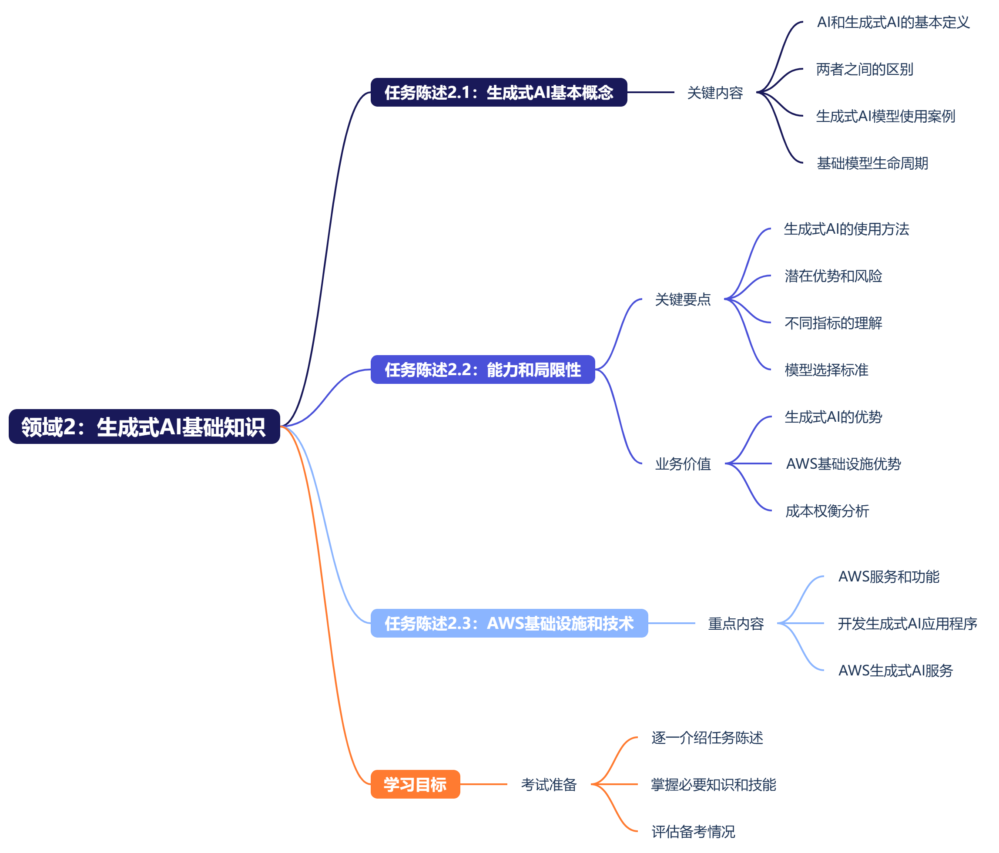
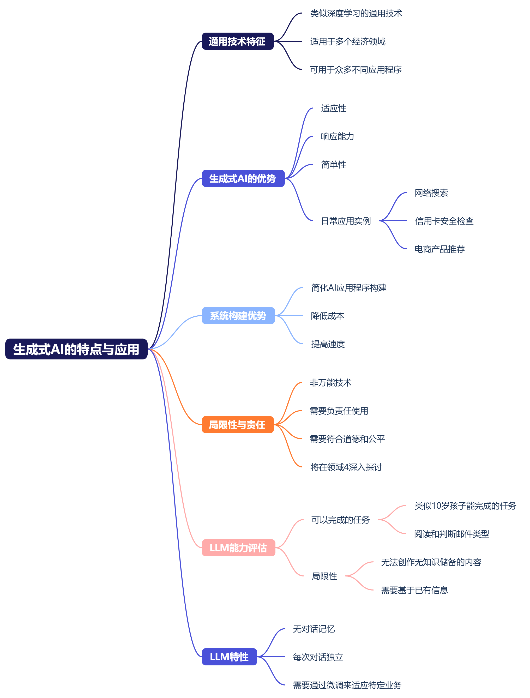
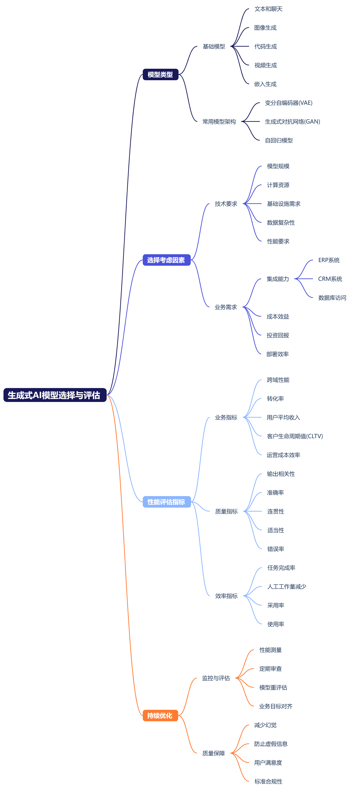

# 领域 2：生成式 AI 的基础知识
## 简介
### 领域 2 简介
我们开始探讨领域 2，其中介绍了生成式 AI 的基础知识。在这个领域，我们将继续讨论人工智能并定义生成式 AI。  

领域 2 分为三个任务陈述，我们将在接下来的几节课中逐一讨论。任务陈述 2.1：解释生成式 AI 的基本概念。任务陈述 2.2：说明生成式 AI 在解决业务问题方面的能力和局限性。任务陈述 2.3：描述用于构建生成式 AI 应用程序的 AWS 基础设施和技术。  

对于第一个任务陈述（解释生成式 AI 的基本概念），您必须了解 AI 和生成式 AI 的基本定义以及两者之间的区别。此外，请确保您了解生成式 AI 模型的不同使用案例和基础模型生命周期。  

第二个任务陈述是"说明生成式 AI 在解决业务问题方面的能力和局限性"。您需要确保您了解如何使用生成式 AI 以及潜在的优势和风险。此外，请确保您了解不同的指标以及如何选择模型来满足您的要求。  

第三个任务陈述是"描述用于构建生成式 AI 应用程序的 AWS 基础设施和技术"。对于此任务陈述，请确保您了解可用于开发生成式 AI 应用程序的 AWS 服务和功能。  

根据任务陈述 2.2，您需要确保了解生成式 AI 的优势。对于此任务陈述，请确保您了解使用 AWS 基础设施和 AWS 生成式 AI 服务的优势，以及构建应用程序的成本权衡。  

在接下来的几个视频中，我将逐一介绍每个任务陈述，并详细介绍成功通过考试所需的知识和技能。我们将在下一节课中开始评估您的备考情况，并介绍领域 2 的第一个任务陈述。任务陈述 2.1：解释生成式 AI 的基本概念。

## 任务陈述 2.1：解释生成式 AI 的基本概念
### 任务陈述 2.1 第 1 课
我们先从领域 2 的第一个任务陈述开始：解释生成式 AI 的基本概念。这个任务陈述分为五节课。我们先从任务陈述 1.1 开始，谈谈生成式 AI 的概念。  

什么是生成式 AI？生成式 AI 是深度学习的一个子集。与深度学习类似，生成式 AI 是一种多用途技术，用于生成新的原创内容，而不是对现有内容进行查找或分类。生成式 AI 专注于创建新内容，例如文本、图像、音频、视频甚至代码。请记住，AI 专注于根据您为进行预测而输入的数据进行分类或做出预测。  

生成式 AI 模型从大量训练数据中学习模式和表示方式。然后，利用这些知识生成与训练数据相似的输出。在领域 1 中，我们讨论了生成式 AI 如何使用基于大量数据进行了训练的基础模型。它们在自然语言和图像等形式中寻找统计模式。  

这些基础模型是非常庞大而复杂的神经网络模型，具有在训练阶段或预训练阶段学习的数十亿个参数。通过增加可训练参数的数量，模型规模也有所增加。而且，模型的参数越多，其内存就越大，模型就可以执行更高级的任务。您可以原样使用这些模型，也可以应用微调技术按照您的特定使用案例调整模型。  

模型是生成式 AI 的核心，同样，模型是使用神经网络、系统资源、数据和提示词构建的，所有这些组件协同工作。当您构建模型时，您需要使用模型所需的知识来训练它，从而根据它所学的知识生成独特的输出。模型获取您输入的数据或文本，然后提供输出。此输出是对下一个单词或分词应该是什么的猜测。  

下面我们更深入地了解模型的工作原理。生成式 AI 的当前核心元素是 Transformer 网络。2017 年一篇名为"Attention Is All You Need"（您所需的只是注意力）的论文提出了 Transformer 模型。诸如 ChatGPT 之类的 LLM 基于 Transformer 架构而构建。利用互联网上的海量文本数据对这些 LLM 进行了预训练。它们可以使用这种预训练过程来建立广泛的知识库。只需相对较少的额外数据，即可针对特定任务对它们进行微调。  

生成式 AI 可用于多个内容任务和使用案例，几分钟后我们将对此介绍。生成式 AI 大型语言模型可以采用自然语言或人工编写的指令，并像人类一样执行这些任务。就本考试而言，请确保您理解生成式 AI 概念，例如提示词、推理、补全、上下文窗口、分词、LLM 词汇表、分词器、提示词工程等。  

大多数 ML 模型、AI 模型和生成式 AI 模型都依赖于统计学和线性代数进行计算，包括概率建模、损失函数和矩阵乘法。这些计算用于深度学习操作，因为机器学习更适合处理数字，而不是原始文本、图像或视频。  

记得在领域 1 中，我们使用提示词生成歌曲，并提供了包含提示词的歌词。您可能会遇到这样的情况：模型在第一次尝试时没有产生您想要的结果，而您可以使用提示词工程来了解生成式模型并将其应用于您的任务和使用案例。要让模型生成更好的补全内容，您可以使用的一种策略是包括您希望模型执行的任务的示例。可以将这些示例包含到提示词中。  

在上下文窗口内提供示例称为"上下文学习"。借助上下文学习，您可以在提示词中加入示例或其他数据，从而帮助 LLM 了解要求执行的任务的更多信息。您发送到生成式模型的输入称为"提示词"。文本提示词用于 LLM 和图像、视频等其他形式。在推理期间将提示词传递到模型中以生成输出或补全内容。推理配置参数会影响模型对提示词的补全情况。因此，提示词由指令和内容组成，但您可以在上下文学习中添加少量样本推理、零样本推理和单样本推理。  

这节课到此结束。在下一课中，我们将继续学习任务陈述 2.1。

### 任务陈述 2.1 第 2 课
我们继续探讨任务陈述 2.1：解释生成式 AI 的基本概念。我们来回顾一下 AI 项目的起点，即数据选择阶段。有诸如 SageMaker JumpStart 之类的公开可用的预训练基础模型。我们将在任务陈述 2.3 中更详细地讨论此类模型。请记住，每个基于语言的生成式 AI 模型都有一个分词器，可以将人类文本转换为包含分词 ID 或输入 ID 的向量。每个输入 ID 代表模型词汇表中的一个分词。

我们稍作停顿，来看一个问题。什么是向量？向量是一个有序的数字列表，表示某些实体或概念的特征或属性。在生成式 AI 的上下文中，向量可表示单词、短语、句子或其他单位。向量表示方法的强大之处在于其能够对项目之间的相关关系进行编码，并捕获有意义的关联、类比和层次结构。例如，海牛和儒艮之间的向量差异可能类似于无沟双髻鲨和双髻鲨之间的差异。

下面我们来更深入地了解向量。我们说向量是一个数字列表，但它也表示该数字列表在空间中的位置。我喜欢将向量视为 Excel 电子表格，因此，数字列表或向量将表示特定空间或向量数据库中的特定位置。同样，Excel 电子表格中的列号和行号表示该电子表格中的某个单元格。

模型使用分词器将输入文本转换为向量。嵌入向量是获取每个分词高维表示形式所必需的一组输入 ID。嵌入向量也称为"嵌入"。嵌入是任何实体的数字向量化表示形式。嵌入可捕获文本、图像、视频或音频等分词的语义含义。例如，向量对分词在大型文本正文中的含义和上下文进行编码。通过这种方式，模型可以从统计上表示和理解人类语言。向量空间中分词彼此越接近，它们的语义含义越相似。通过这种方式，模型可以根据这些向量之间的关系生成文本。

嵌入将传递到自注意力层，这是 Transformer 的另一个关键组件。在本课开始时，我说过"生成式 AI 的当前核心元素是 Transformer 网络"。生成式 AI 的核心是一种机器学习技术，用于创建模仿人类行为的内容。

Transformer 的一个创新之处在于自注意力机制。这种机制有助于模型在生成每个输出分词时权衡输入不同部分的重要性。因此，模型可以捕获循环神经网络 (RNN) 等先前架构难以学习的长距离依赖关系和上下文关系。

自注意力机制的工作原理是，为每个输入分词计算一组查询、键和值向量。然后，它使用这些向量之间的点积来确定注意力权重。每个分词的输出是值向量的加权和，其中权重来自注意力分数。此过程在多个层中重复，因此模型可以构建复杂的输入表示形式。

Transformer 还引入了位置嵌入的概念，它对序列中每个分词的相对位置进行编码。位置嵌入可协助模型区分出现在不同位置的相同分词，这对于理解句子结构和词序非常重要。

在模型推理过程中，Transformer 旨在帮助模型生成对输入提示词的补全内容。Transformer 模型使用自注意力来计算输入序列的表示形式，这有助于模型捕获长期依赖关系和并行化计算。

我添加了文章"Attention is All You Need"（您所需的只是注意力）的链接。作者表明，他们的模型在多项机器翻译任务中表现出色，并且优于以前依赖于 RNN 或卷积神经网络 (CNN) 的模型。本文讨论了 Transformer 架构如何由编码器和解码器组成，而编码器和解码器各自都由多层组成。每层包含两个子层。

Transformer 模型使用残差连接和层规范化来促进训练并防止过拟合。此外，作者还介绍了一种位置编码方案，可对输入序列中每个分词的位置进行编码。通过这种方式，它可以帮助模型捕获序列的顺序，而无需进行循环或卷积运算。

在模型预训练和微调期间，Transformer 可帮助模型从输入训练或调优中获得对语言的上下文理解。您无需知晓 Transformer 架构的低层细节，但要了解后台复杂的实现过程会有所帮助。同样，我添加了抽认卡来涵盖更多概念，例如输入、上下文窗口、嵌入层、编码器、自注意力、解码器、softmax 输出等。

这节课到此结束，在下一课中，我们将继续学习任务陈述 2.1。

### 任务陈述 2.1 第 3 课
研究人员发现，模型越大，无需额外的上下文学习或进一步训练即可工作的可能性就越大。由于模型能力随其规模的增加而增加，因此现已支持开发规模日益增大的模型。结果是引入了高度可扩展的 Transformer 架构，可以访问大量数据进行训练，并开发更强大的计算资源。您可能会问，我们能否继续添加参数来提高性能并使模型更智能？训练这些大型模型既困难又耗资巨大，因此可能很难持续训练越来越大的模型。另一个有趣的问题是，这种模型增长可能会带来什么？

我们稍作停顿，再强调几个关键点。LLM 对语言的深度统计表示进行编码。这种理解是在预训练阶段逐渐形成的，在该阶段模型会从大量的非结构化数据中进行学习。这些数据可能是千兆字节、太字节甚至拍字节的文本。这些数据提取自许多来源，包括从互联网上抓取的内容以及专门为训练语言模型而汇编的大型文本。在这个自监督学习步骤中，模型内化语言中的模式和结构。然后，这些模式可以帮助模型完成其训练目标，具体取决于模型的架构。在预训练期间，模型权重会更新，以最大限度地减少训练目标的损失。编码器为每个分词生成嵌入式或向量表示。预训练还需要大量的计算和使用图形处理单元 (GPU)。

请注意，当您从互联网等公共站点收集训练数据时，您需要处理这些数据。进行这种处理是为了提高质量、消除偏差或删除其他有害内容。据我所知，1% 至 3% 的分词用于数据质量策管步骤之后的预训练。当您尝试确定需要收集多少数据来预训练自己的模型时，务必包括这个估算值。

生成式 AI 可以是单模态或多模态的。单模态模型专注于处理一种数据模态。LLM 是单模生成式 AI 的一个示例，因为输入和输出或补全都是文本。多模态模型是添加其他模态，例如图像、视频或音频。多模态模型可以理解不同的数据来源，可以提供更可靠的预测。多模态生成式 AI 使用案例包括营销、图像字幕、产品设计、客户服务、聊天机器人和虚拟化身。

多模态模型和扩散模型是生成式 AI 的两个重要类别，它们不仅限于纯文本应用程序。多模态模型可以处理和生成多种类型的数据，它们也可以结合使用来执行此类操作。这种协作能力融入了跨模型推理、翻译、搜索和创作的能力，从而更接近人类智能。多模态任务有哪些示例？示例包括图像字幕，其中模型会生成图像的文本描述和可视化问答（即模型可以回答关于图像内容的问题）。另一个示例是文本到图像的合成，它根据文本描述生成图像。诸如 DALL-E、Stable Diffusion 和 Midjourney 之类的任何模型都可以根据自然语言提示词创建逼真而多样化的图像。

还有扩散模型，它们支持多模态模型的各种任务，例如图像生成、分辨率提升和局部重绘。扩散模型是一种生成模型类别，它们学习如何反转一个渐进产生噪声的过程。基于扩散的架构可对生成图像的质量和多样性提供更高程度的控制。对于本考试，请确保您了解三个主要组成部分：正向扩散、反向扩散和稳定扩散。其想法是从随机噪声开始，通过迭代降噪过程来生成连贯的输出，例如高质量的图像或音频片段。扩散模型尝试根据上一步的部分降噪输出预测每一步添加的噪声。

Stable Diffusion 不同于许多其他图像生成模型。原则上，扩散模型使用高斯噪声对图像进行编码。然后，它们使用噪声预测器和反向扩散过程来重现图像。Stable Diffusion 不使用图像的像素空间，而是使用简化定义的隐空间。您可以通过 Amazon SageMaker JumpStart 使用 Stable Diffusion 模型基于文本轻松生成图像。

与生成式对抗网络和变分自编码器等其他生成式方法相比，扩散模型有哪些优势？扩散模型往往会产生更高质量的输出，提高多样性和一致性，而且它们更稳定，更易于训练。扩散模型的一些示例有：用于图像生成的 Stable Diffusion、用于语音识别和翻译的 Whisper 和用于音频生成的 AudioLM。

AWS 为构建和部署多模态和扩散模型提供了一系列服务和工具。例如，SageMaker 支持 TensorFlow、PyTorch 等深度学习框架，这些框架具有用于处理多模态数据的预构建模块。AWS 还提供 Stable Diffusion 等预训练模型，只需几行代码即可微调和部署这些模型。好了，这节课到此结束，在下一节课中，我们将继续讨论任务陈述 2.1。

### 任务陈述 2.1 第 4 课
我们继续学习任务陈述 2.1，并探讨生成任务和使用案例。大型语言模型 (LLM) 是一种生成式 AI，无需微调即可应用于许多不同的问题领域或任务。生成式 AI 模型主要有哪些使用案例？

首先，生成式 AI 可以生成文本，或许还能用于编写或重写文本片段以迎合不同的受众。例如，您可以改编或转换有关水肺潜水浮力设备设计和规格的技术文档。更具体地说，对刚开始获得水肺潜水认证的用户，您可以让模型使用较少的技术性术语。

生成式 AI 也适用于文本摘要。您可以为模型提供一段相对较长的信息，让它在保留主要思想的同时生成一个简短的输出。示例可包括总结技术文档、财务报告、法律文档、新闻文章等。

AWS 提供了一系列服务和工具，可构建用于内容创建的生成式 AI 应用程序。例如，Amazon Bedrock 和 Amazon Titan 提供用于文本、图像和音频生成的预训练模型，可以针对特定使用案例微调这些模型。SageMaker 和 Amazon Q Developer（以前称为 Amazon CodeWhisperer）支持代码生成和补全。Amazon Nimble Studio 和 Amazon Sumerian 提供虚拟制作和 3D 内容创作。

还有更多其他使用案例的示例，例如信息提取、问答、分类、识别有害内容、翻译、推荐引擎、个性化营销和广告、聊天机器人、客服座席和搜索等。

另一个使用案例是使用生成式 AI 作为生成源代码的开发工具。代码生成是生成式 AI 的应用，用于加速软件开发。模型可以根据自然语言描述或示例生成函数代码片段甚至整个程序，以帮助自动执行例行编程任务，建议代码补全，甚至在不同语言之间翻译代码。Amazon Q Developer 会根据您的评论和现有代码生成从代码片段到完整函数的实时代码建议。

AWS 负责底层基础设施、数据管理、模型训练和推理。您可以专注于您的特定使用案例和应用程序。

对于本考试，请确保您了解现有的各种架构，例如生成式对抗网络 (GAN)、变分自编码器 (VAE) 和 Transformer。每种架构都有独特的优势和局限性，因此在选择合适的架构之前，请先评估目标和数据集。这节课到此结束，在下一节课中，我们将继续讨论任务陈述 2.1。

### 任务陈述 2.1 第 5 课
我们来对该任务陈述的内容做个总结，然后逐一介绍生成式 AI 项目生命周期的各个阶段。该框架列出了项目从构思到启动所需的任务。这些阶段分别是：确定使用案例，实验并选择，适应、调整和增强，评估、部署和迭代以及监控。

AI 周期的第一阶段是确定目标、收集数据、处理数据、选择模型以及训练和开发模型。下一阶段是使用特征工程、构建、测试、验证、优化和扩展来开发模型。最后是部署和维护阶段，其中包括模型评估、部署、反馈、更新、安全性和可扩展性。

考试指南中列出了基础模型生命周期，其中包括数据选择、模型选择、预训练、微调、评估、部署和反馈。

任何项目中最重要的步骤都是尽可能准确和狭义地定义范围。您应该思考 LLM 在您的特定应用中将发挥什么作用。您是需要模型具备执行多项不同任务的能力（包括长格式文本生成）？还是任务更具体，如命名实体识别，这样您的模型就只需要擅长一件事？具体说明模型需要做什么才能节省时间，更重要的是，可以节省计算成本。

只要您感到满意，并且确定了足够的模型需求范围以着手开发，您就可以开始了。您首先要决定是从头开始训练自己的模型还是使用现有的基础模型。下一步是评估模型的性能，并在应用程序需要时完成任何额外的训练。

有时，提示词工程足以确保您的模型表现良好。因此，您可能会首先尝试上下文学习，使用适合您的任务和使用案例的示例。但是，在某些情况下，即使进行单样本推理或少量样本推理，模型可能也达不到您所需的性能。在这种情况下，您可以尝试微调模型。这是一个有监督学习过程。

随着模型能力的增强，确保其运行良好并符合人类的部署偏好变得越来越重要。因此引入另一种根据人类反馈进行学习，称之为"强化学习"的微调技术，有助于确保您的模型表现良好。所有这些技术的一个重要功能是评估。还可以尝试不同的指标和基准，它们可以确定您的模型表现如何，以及模型与您的偏好的一致程度。

这个适应并调整的开发阶段通常是高度迭代的。我更喜欢先尝试提示词工程和评估输出，然后使用微调来提升性能。当然，始终都要重新审视和评估提示词工程，以获得所需的性能。

最后，当模型满足您的性能需求并经过良好调整后，您就可以部署它了。可以将您的模型部署到您的基础设施并与您的应用程序集成。确保您也会优化待部署的模型和计算资源，并确保应用程序向用户提供出色的体验。

最后但非常重要的步骤是考虑应用程序运行所需的任何其他基础设施。请记住，仅通过这类训练可能很难克服 LLM 的一些基本局限性。这些问题可能包括幻觉、在答案未知时编造信息，以及在复杂推理和数学方面的能力有限。好了，我们将在下一课中继续学习任务陈述 2.2。

## 任务陈述 2.2：了解生成式 AI 在解决业务问题方面的能力和局限性
### 任务陈述 2.2 第 1 课
我们开始学习领域 2 的第二个任务陈述，其中介绍了生成式 AI 在解决业务问题方面的能力和局限性。此任务陈述分为三节课。

到目前为止，在本课程中，我们已经了解到生成式 AI 和 LLM 都是通用技术。因此，与深度学习等其他通用技术类似，生成式 AI 也有许多用途。它不仅可用于单个应用程序，而且对跨越多个经济领域的众多不同应用程序都有用。

我们先来谈谈生成式 AI 的优势，例如适应性、响应能力和简单性。我们在领域 1 中讨论过，我们几乎每天都在使用人工智能。每次进行网络搜索时要用到 AI。每次您使用信用卡时，可能会有 AI 检查是不是您在使用您的信用卡。还有，每当您访问 Amazon.com 时，AI 都会向您推荐产品。

许多 AI 系统的构建过程既复杂又费用高昂。但是，生成式 AI 简化了许多 AI 应用程序的构建过程。生成式 AI 也可以帮助您的企业构建有价值的 AI 应用程序，而且成本更低、速度更快。

我添加了抽认卡来回顾使用生成式 AI 的最佳实践。生成式 AI 是一项了不起的技术，但它并不是万能的。了解生成式 AI 的局限性对于确保您建立负责任、合乎道德和公平的模型非常重要。我们必须确保负责任地使用 AI 并造福人们，我们将在"领域 4"更深入地探讨响应式 AI。

如果您想弄清楚提示 LLM 能做什么，我发现有个问题很有帮助。我 10 岁时，我能否按照提示词中的说明完成任务？例如，我能否在 10 岁时按照说明阅读一封电子邮件，并判断这封邮件是否为投诉邮件？我认为大多数人都能做到，LLM 也能做到。

但是，您或孩子能否在没有任何新 AWS 服务相关信息的情况下写一篇关于该服务的文章？可能不行。我们可以撰写一份通用文档，但其中不包括有关新 AWS 服务的细节。但是，如果您阅读了一篇关于该主题的博客文章或新闻稿，那么您可以撰写一份包含更多细节的文档，大型语言模型也能做到这一点。

每次您提示您的 LLM 时，LLM 实际上并不记得之前的对话。这类似于向不同的孩子指派同一项任务。因此，您无法长时间地训练模型，让它们了解您业务的具体内容或您希望它们采用的写作风格，但是您可以通过微调做到这一点。

这节课到此结束，在下一节课中，我们将继续讨论任务陈述 2.2。

### 任务陈述 2.2 第 2 课
我们继续学习任务陈述 2.2 ，讨论人们如何使用 LLM 应用程序，并重温生成式 AI 项目生命周期。使用指令微调模型的目标是，进一步训练模型，使其更好地理解人性化的提示词并生成更多类似人类的响应。与基于预训练的原始版本相比，这种方法可以提高模型性能的可持续性，从而生成听起来更自然的语言。

听起来自然的人类语言可能是一个挑战，甚至有多篇文章提到一些 LLM 表现不佳。问题包括模型在完成时使用有毒语言、用好斗和攻击性的声音回复以及提供有关危险主题的详细信息。之所以存在这些问题，是因为大型模型是基于互联网上的大量文本数据训练的，而互联网上经常出现此类语言。

因此，LLM 可能会给出误导性或错误的回答。假设您向 LLM 询问证实是错误的糖尿病患者健康建议，即以碳水化合物为主的饮食是保持健康的关键。模型应该反驳这个说法。但模型可能会给出自信但完全错误的响应，肯定不是某人正在寻求的真实坦诚的答案。这个操作称为"幻觉"。为了得到正确的答案，您应该先向权威人士核实答案，然后再以此为依据。

此外，LLM 不应创建有害的补全内容，例如攻击性、歧视性或诱发犯罪行为的内容。同样，我们将在"领域 4"中讨论这些重要的人类价值观：有用性、诚实性和无害性。这些价值观是一组指导开发人员负责任地使用 AI 的原则。我们可以添加根据人工反馈进行微调的功能，以更好地使模型与人类偏好保持一致，并提高补全的有用性、诚实性和无害性。这种进一步的训练还可以降低毒性，并减少错误信息的生成。

选择模型或算法时，应考虑可诠释性。机器学习模型的可诠释性越高，模型的预测就越容易理解，但是您需要权衡取舍。这是在模型预测的结果（即模型性能）和模型做出这种预测的原因（即模型的可诠释性）之间所做的取舍。

而用于模型可诠释性的方法可分为内在分析和事后分析。内在分析可用于诠释复杂度低或输入变量与预测之间关系简单的模型。模型可诠释性高的输入、输入变量、输出结果和预测之间的简单关系可能会导致性能降低。原因是算法无法捕获复杂的非线性相互作用。事后分析可用于诠释关系简单的模型和比较复杂的模型，例如，比较复杂的模型有神经网络，它们能够捕获非线性相互作用。这些方法通常与模型无关，但提供的机制可以根据输入和输出预测来诠释经过训练的模型。事后分析可以在本地级别执行，放大单个数据点；也可以在全局级别执行，缩小并查看模型的整体行为。

下面我们来谈谈如何确定微调模型相对于最初使用的预训练模型的性能改进。大型语言模型的开发人员使用具体指标。您可以使用这些指标来评估自己模型的性能，并与世界上其他模型进行比较。在传统机器学习中，您可以评估模型在输出已知的训练和验证数据集方面的表现情况。您可以计算准确率等基本指标，准确率是指由于模型的确定性而正确预测的次数占所有预测次数的比例。但是对于大型语言模型，输出是不确定的，因此基于语言的评估更具挑战性。例如，考虑这两句话：我喝咖啡，我不喝咖啡。我们人类也可以看出并理解这两句话的差异和相似之处，但是，当您基于数百万个句子对模型进行训练时，您需要一种自动化、结构化的方法来进行评估。

ROUGE 和 BLEU 是两种广泛用于不同任务的评估指标。用于摘要评估的查全率导向型候补 (ROUGE) 主要用于评估自动生成的摘要的质量，方法就是将自动生成的摘要与人工生成的参考摘要进行比较。另一方面，双语评估候补 (BLEU) 作为一种算法，旨在通过将机器翻译文本与人工生成的翻译进行比较来评估机器翻译文本的质量。我们将在任务陈述 3.4 中继续探讨 ROUGE 和 BLEU。

好了，这节课到此结束，我们将继续学习任务陈述 2.2。

.png)

### 任务陈述 2.2 第 3 课
我们继续学习任务陈述 2.2。在本课中，我们将探讨选择合适的生成式 AI 模型的各种因素，例如模型类型、性能要求、能力、限制及合规性。如何选择合适的模型架构来确保生成式 AI 项目的成功？我们在任务陈述 2.1 中介绍了不同的架构，还提供了抽认卡供您查看。但是对于这个任务陈述，我们将进行更深入的讨论。

生成式 AI 基础模型旨在生成不同类型的内容，例如文本和聊天、图像、代码、视频和嵌入。您可以通过调整算法或模型结构来修改这些模型，以适应特定的领域和任务。在数据生成方面，选择最合适的模型很重要，因为这会显著影响数据质量。最常用的模型是变分自编码器 (VAE)、生成式对抗网络 (GAN) 和自回归模型。这些模型都有各自的优缺点，具体取决于数据的复杂性和质量。这些只是生成式 AI 模型的部分类型，今后不断开展的研发将会发现更多新的先进生成模型。

市场上基础模型的数量和规模迅速增长。现在已有数十种模型可供选择。据 AWS 称，该列表包含自 2018 年以来发布的重要基础模型。我们来对该任务陈述的内容做个总结，然后讨论如何确定生成式 AI 应用程序的业务指标。这些指标示例包括跨域性能、效率、转化率、每位用户的平均收入、准确率、客户生命周期值等。

基础模型基于庞大、未标注、广泛的数据集进行训练，它们为生成式 AI 的能力奠定了基础。因此，它们比传统的机器学习模型要大得多，后者通常用于更具体的功能。基础模型用作开发和创建模型的基准起点。这些模型可用于诠释和理解语言、进行对话消息收发以及创建和生成图像。不同的基础模型专注于不同的领域。例如，Stability AI 提供的稳定扩散模型非常适合图像生成，而 ChatGPT 使用 GPT-4 模型进行自然语言生成。

基础模型能够根据提示词生成一系列高度准确的输出。但是我们需要确保我们了解要使用的指标或关键绩效指标 (KPI)。这些指标可评估我们的生成式 AI 应用程序的性能、影响和成功。我们在本节课前面的部分提到了准确率。通过跟踪、监控和分析正确的业务指标，您能够总结过去、把握现在并规划未来。

分析大量业务数据以预测其未来价值，或者检测异常值并了解根本原因，这些过程既复杂又耗时，而且并不总是准确的。AWS 提供了 Amazon 的业务指标分析 ML 解决方案，该解决方案使用 Amazon Lookout for Metrics 和 Amazon Forecast 来解决上述问题。它利用机器学习来分析大量数据，同时动态适应不断变化的业务需求。

基础模型为组织创造机遇和挑战，其中包括确保提供符合业务需求的高质量输出，并最大限度地减少幻觉或虚假信息。为了使基础模型在企业环境中真正发挥作用，它们需要与现有业务系统和工作流进行集成和互操作。例如，基础模型必须访问数据库中的数据，并使用企业资源规划 (ERP) 和客户关系管理 (CRM)。

为了获得真正的商业价值，组织需要具有强大技术技能的员工来实施、自定义和维护基础模型。他们还需要计算资源和基础设施来经济高效地部署模型，并确保客户获得价值。

基础模型的输出质量将决定采用率和使用率，尤其是在聊天机器人等面向客户的应用程序中。输出质量指标包含相关性、准确率、连贯性和适当性，所有这些都有助于提高整体用户满意度。应使用预定义的标准来衡量您的输出质量，以确保 AI 系统满足效率要求。

效率会影响生成式 AI 工作流。可以使用任务完成率和减少人工工作量等指标对其进行跟踪，从而直接提高运营效率。此外，低错误率有助于保持 AI 应用程序的准确率和可信度。考虑其应用的组织需要评估潜在的投资回报并权衡基础模型成本和收益。此外，了解指标以比较所获得的运营成本和效率也非常重要。

下面看一个问题。有哪些策略可最大程度地提高客户生命周期值 (CLTV)？CLTV，这是扩展业务的关键指标。忠诚度计划、创建品牌忠诚度、收集反馈、交叉销售、个性化体验等。还需要跨域绩效指标，用于评估知识和技能在不同领域的转移和应用，从而生成或预测跨域数据和内容。

请记住，AI 也在发展，因此请务必对模型进行测量、监控、审查和重新评估，以确保满足业务要求和目标。好了，我们将在下一课中继续学习任务陈述 2.3。

## 任务陈述 2.3：描述用于构建生成式 AI 应用程序的 AWS 基础设施和技术
### 任务陈述 2.3 第 1 课
### 任务陈述 2.3 第 2 课
## 领域 2 复习和练习
### 演练问题 3
### 演练问题 4
### 其他资源