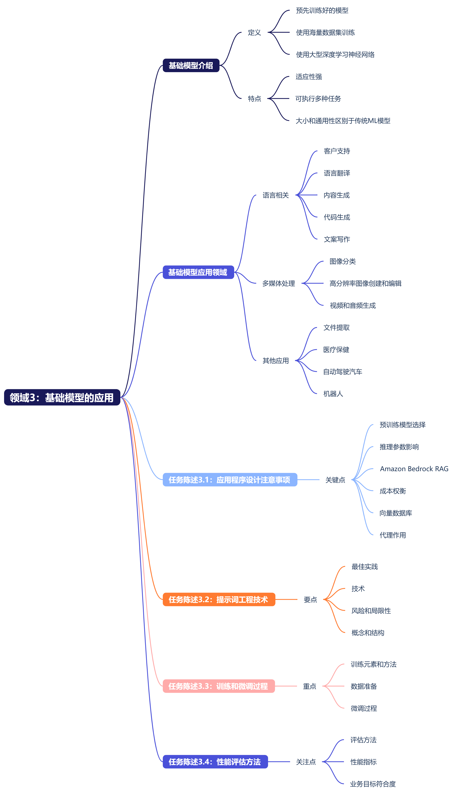

# 领域 3：基础模型的应用
## 简介
我们开始探讨领域3，其中介绍了基础模型的应用。对于这个领域，我们将继续讨论基础模型。在领域2中，我们讨论了基础模型及其生命周期。请记住，基础模型是预先训练好的模型，可以随时使用。它们是使用海量数据集训练的。基础模型使用大型深度学习神经网络，为开发机器学习模型提供了一个起点，可以更快、更经济高效地为新应用程序提供支持。

我们提出几个问题。基础模型有什么独特之处？我首先想到的是适应性，因为这些模型可以根据输入提示词高度准确地执行各种任务。一些任务包括自然语言处理(NLP)、问答和图像分类，但是基础模型的大小和通用性使其不同于传统的机器学习模型。传统ML模型执行特定任务，例如分析文本情绪、对图像进行分类和预测趋势。

再来看另一个问题。基础模型的应用有哪些？答案：客户支持、语言翻译、内容生成、代码生成、文案写作、图像分类、高分辨率图像创建和编辑、视频和音频生成、文件提取、医疗保健、自动驾驶汽车和机器人。

领域3分为四个任务陈述，我们将在接下来的几节课中进行讨论。任务陈述3.1：说明设计使用基础模型的应用程序时的注意事项。任务陈述3.2：选择有效的提示词工程技术。任务陈述3.3：描述基础模型的训练和微调过程。任务陈述3.4：描述评估基础模型性能的方法。

第一个任务陈述是"说明设计使用基础模型的应用程序时的注意事项"。对于此任务陈述，您需要了解如何选择预训练模型以及推理参数对模型响应的影响。此外，请确保您可以使用Amazon Bedrock定义检索增强生成(RAG)并描述其业务应用程序。本任务陈述还涵盖了基础模型自定义（例如RAG、预训练、微调等）的成本权衡。我们还将讨论在向量数据库中存储嵌入的AWS服务以及代理在多步骤任务中的作用。

第二个任务陈述是"选择有效的提示词工程技术"。对于此任务陈述，请确保您了解提示词工程最佳实践、技术、风险和局限性，并能够描述提示词工程的概念和结构。

第三个任务陈述是"描述基础模型的训练和微调过程"。对于此任务陈述，您必须了解训练基础模型的元素和方法，以及如何准备数据以微调基础模型。

第四个任务陈述是"描述评估基础模型性能的方法"。对于此任务陈述，您必须了解评估基础模型性能的方法和指标，以及如何确定基础模型是否符合您的业务目标。

在接下来的几个视频中，我将逐一介绍每个任务陈述，并详细介绍成功通过考试所需的知识和技能。我们将在下节课中开始评估您的备考情况，其中我们会介绍领域3的第一个任务陈述。

## 任务陈述 3.1：说明使用基础模型的应用程序的设计注意事项
## 任务陈述 3.2：选择有效的提示词工程技术
## 任务陈述 3.3：描述基础模型的训练和微调过程
## 任务陈述 3.4：描述评估基础模型性能的方法
## 演练问题
## 其他资源
