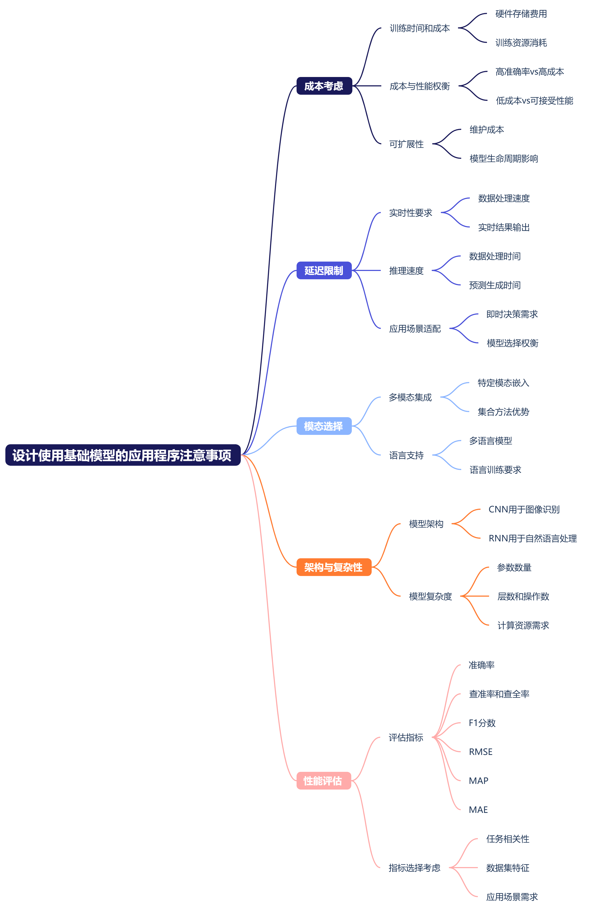
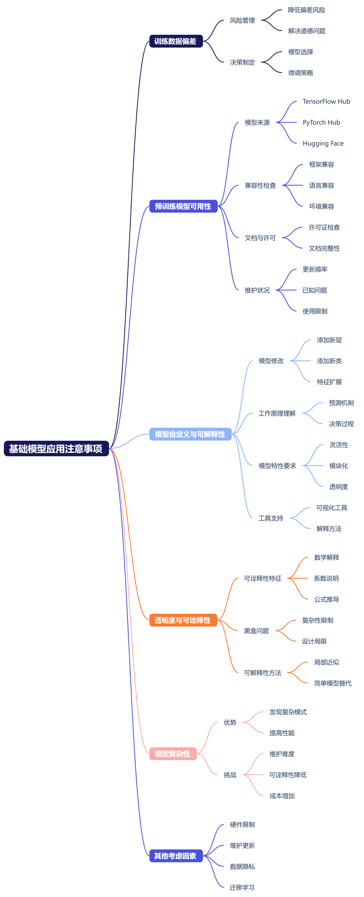
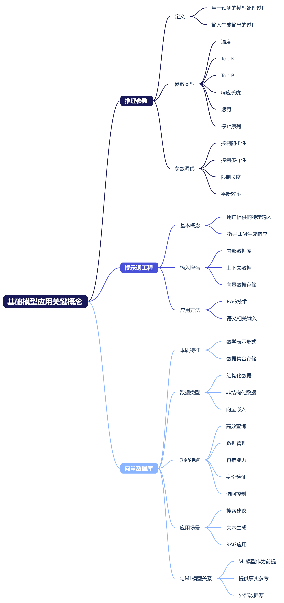
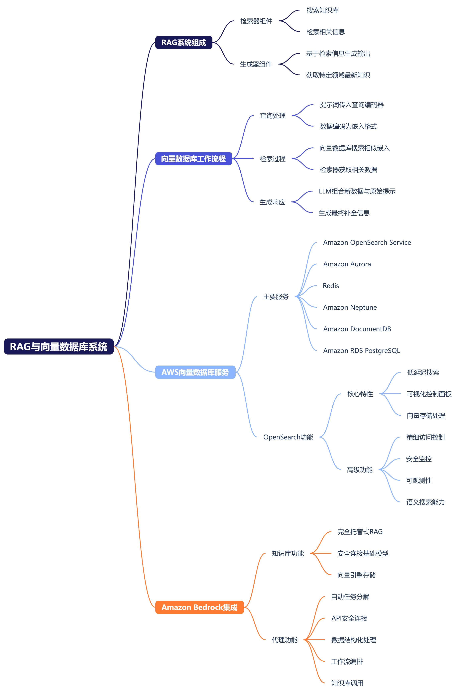
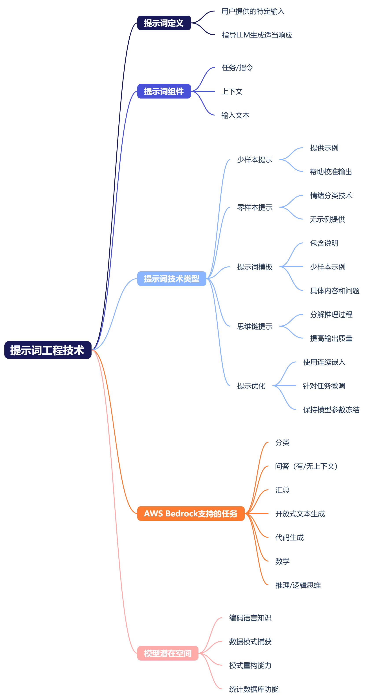
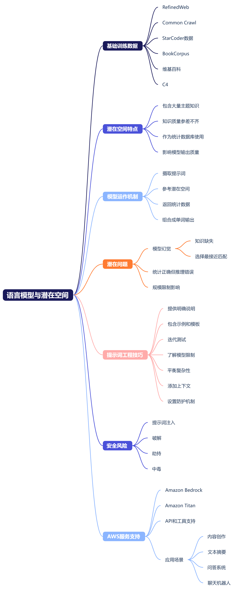
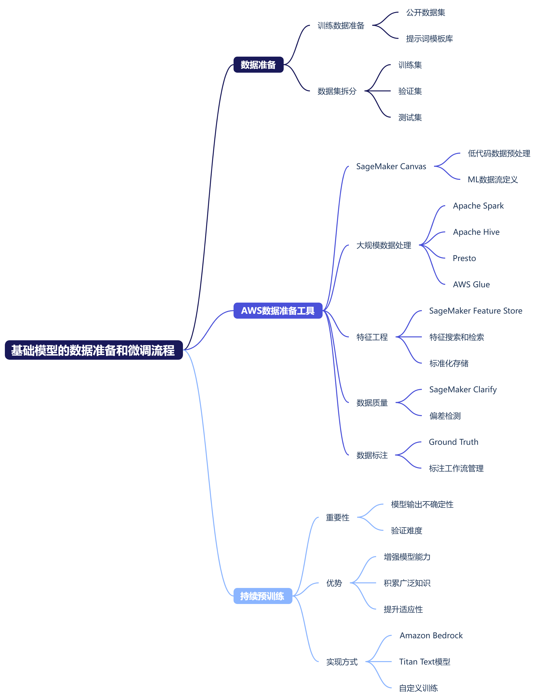
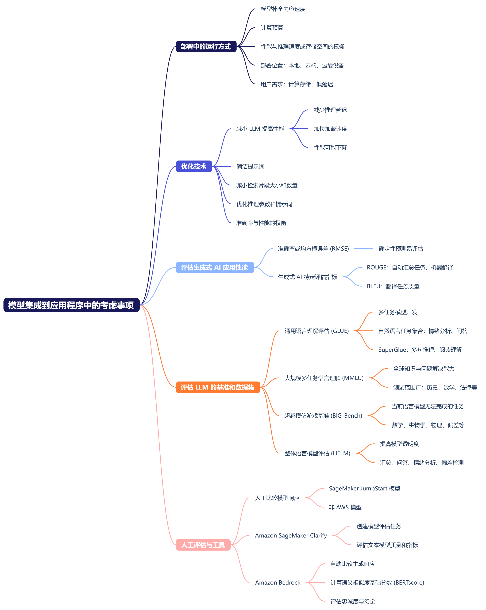
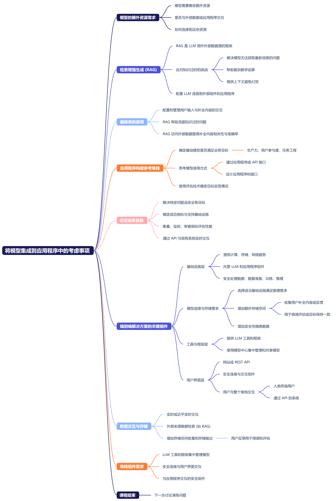

# 领域 3：基础模型的应用
## 简介
我们开始探讨领域3，其中介绍了基础模型的应用。对于这个领域，我们将继续讨论基础模型。在领域2中，我们讨论了基础模型及其生命周期。请记住，基础模型是预先训练好的模型，可以随时使用。它们是使用海量数据集训练的。基础模型使用大型深度学习神经网络，为开发机器学习模型提供了一个起点，可以更快、更经济高效地为新应用程序提供支持。

我们提出几个问题。基础模型有什么独特之处？我首先想到的是适应性，因为这些模型可以根据输入提示词高度准确地执行各种任务。一些任务包括自然语言处理(NLP)、问答和图像分类，但是基础模型的大小和通用性使其不同于传统的机器学习模型。传统ML模型执行特定任务，例如分析文本情绪、对图像进行分类和预测趋势。

再来看另一个问题。基础模型的应用有哪些？答案：客户支持、语言翻译、内容生成、代码生成、文案写作、图像分类、高分辨率图像创建和编辑、视频和音频生成、文件提取、医疗保健、自动驾驶汽车和机器人。

领域3分为四个任务陈述，我们将在接下来的几节课中进行讨论。任务陈述3.1：说明设计使用基础模型的应用程序时的注意事项。任务陈述3.2：选择有效的提示词工程技术。任务陈述3.3：描述基础模型的训练和微调过程。任务陈述3.4：描述评估基础模型性能的方法。

第一个任务陈述是"说明设计使用基础模型的应用程序时的注意事项"。对于此任务陈述，您需要了解如何选择预训练模型以及推理参数对模型响应的影响。此外，请确保您可以使用Amazon Bedrock定义检索增强生成(RAG)并描述其业务应用程序。本任务陈述还涵盖了基础模型自定义（例如RAG、预训练、微调等）的成本权衡。我们还将讨论在向量数据库中存储嵌入的AWS服务以及代理在多步骤任务中的作用。

第二个任务陈述是"选择有效的提示词工程技术"。对于此任务陈述，请确保您了解提示词工程最佳实践、技术、风险和局限性，并能够描述提示词工程的概念和结构。

第三个任务陈述是"描述基础模型的训练和微调过程"。对于此任务陈述，您必须了解训练基础模型的元素和方法，以及如何准备数据以微调基础模型。

第四个任务陈述是"描述评估基础模型性能的方法"。对于此任务陈述，您必须了解评估基础模型性能的方法和指标，以及如何确定基础模型是否符合您的业务目标。

在接下来的几个视频中，我将逐一介绍每个任务陈述，并详细介绍成功通过考试所需的知识和技能。我们将在下节课中开始评估您的备考情况，其中我们会介绍领域3的第一个任务陈述。

## 任务陈述 3.1：说明使用基础模型的应用程序的设计注意事项
### 任务陈述 3.1 第1课
我们从领域 3 的第一个任务陈述开始，即“说明设计使用基础模型的应用程序时的注意事项”。这个任务陈述分为四节课。本任务陈述侧重于了解设计使用基础模型的应用程序时的注意事项。对于此任务陈述，我们的任务是确定选择标准，选择预训练模型，例如成本、模态、延迟、多语言、模型大小、模型复杂性、自定义、输入和输出长度。在领域 2 中，我们讨论了预训练模型在机器学习和人工智能方面的优势，但它们也有一些注意事项。预训练模型体积庞大，需要大量计算资源进行训练和推理。对于计算能力有限的个人和组织来说，这些要求可能是一项挑战。我们还讨论了在选择预训练模型之前确保与您的要求保持一致的注意事项。

在本任务陈述中，我们将重点介绍成本、延迟限制和所需模态的要求。我们来深入了解一下成本注意事项。训练模型的持续时间和成本是重要的注意事项，因为在硬件存储等费用可能会很高。这里有一个问题，您是选择一个准确率高达 98% 但训练成本高达数十万美元的模型，还是选择一个准确率只有 97% 的准确率较低但成本只需几千美元的模型？答案将视您的要求而定。您需要在训练时间、成本和模型性能之间找到平衡。您的目标是设计一个可扩展的解决方案，既高效又不会降低模型的性能。建立和维护模型的成本是项目成功与否的一个重要注意事项。模型越复杂，对整个模型生命周期的影响就越大。

让我们深入探讨延迟限制、推理速度和实时性要求方面的注意事项。如果 AI 应用程序需要处理数据并实时提供结果，那么在选择模型时就需要考虑到这一点。例如，某些复杂模型可能需要较长的推理时间，无法满足您的延迟要求。推理速度或模型处理数据和生成预测所需的持续时间是另一个注意事项。再来看另一个问题。假设您的自动驾驶汽车系统需要即时做出决策，而推理时间较慢的模型将无法满足此要求。您应该选择哪种模型？您可以使用 k 最近邻模型 (KNN)，该模型在推理阶段执行其大部分计算工作。但是，此模型生成预测的速度可能较慢。这种自动驾驶汽车系统是一个维度极高的问题，KNN 模型并不是最佳选择。因此，在决定 AI 模型时，了解使用案例对推理速度的要求非常重要。

另外，我们来深入研究一下模态。这里需要牢记几个注意事项。在大多数 AI 系统中，每种模态都有特定的嵌入，但集合方法将多个模型结合起来，可实现比单一模型更好的性能。另一个注意事项可能是需要选择经过相关语言训练的多语言模型。

选择预训练模型还有哪些其他注意事项？我想到了架构和复杂性。我们谈到了不同的架构有不同的优缺点，可能更适合不同类型的任务。例如，您可以选择卷积神经网络 (CNN) 进行图像识别，也可以选择循环神经网络 (RNN) 进行自然语言处理。可以通过参数、层和操作的数量来衡量模型的复杂性。所有这些因素都会影响其速度、内存和准确率，请记住，更复杂的模型具有更高的准确率，但也需要更多的计算资源和数据。

架构和复杂性的一个子集是预训练模型在原始数据集和新数据集上的性能和指标。您可以使用标准指标来评估和比较不同的模型。此类指标可能包括准确率、查准率、查全率、F1 分数、均方根误差 (RMSE)、平均查准率 (MAP) 以及平均绝对误差 (MAE)。但是，您还应该考虑这些指标之间的权衡，并选择与您的任务最相关的指标。例如，假设您正在进行对象检测。您可能更关心的是 MAP 而不是准确率，因为它可以衡量模型在图像中定位和分类多个对象的能力。对于分布不均匀或不平衡的数据集，不建议使用准确率。在选择模型之前，选择适当的指标或一组指标来评估模型的性能非常重要。

这节课到此结束，在下一节课中，我们将继续讨论任务陈述 3.1。

### 任务陈述 3.1 第2课
我们继续学习任务陈述 3.1，讨论另一个注意事项，即训练数据中可能存在的偏差。了解如何降低风险、解决道德问题并就模型选择和微调做出明智决策非常重要。

另一个注意事项是预训练模型的可用性和兼容性。您可以从线上找到许多预训练模型，例如 TensorFlow Hub、PyTorch Hub、Hugging Face 或其他存储库上的模型。但是，您应该检查模型是否与您的框架、语言和环境兼容，并检查模型以确保其具有许可证和文档。您还应检查模型是否已定期更新和维护，以及是否存在任何已知问题或限制。

另一个注意事项是预训练模型的自定义和可解释性。您可能需要修改或扩展预训练模型以适应您的任务，例如添加新层、类或特征。您可能还想了解预训练模型的工作原理以及它是如何做出预测或决策的。出于这些目的，您应该寻找灵活、模块化、透明的模型，并提供可视化或解释其内部工作原理所需的工具或方法。

解释和说明模型结果的能力非常重要。透明涉及可诠释性。例如，这意味着能够通过系数和公式用数学方式解释模型做出特定预测的原因。如果模型足够简单，这种可诠释性是可能实现的，但是基础模型由于极其复杂，无法通过设计做出解释。此类模型完全不透明，通常称为黑盒。可解释性尝试用一个更简单、可解释的模型为黑盒实现局部近似，从而解释这个黑盒。

可解释性与可诠释性不同，预训练模型在设计上不能采用透明方式。如果可诠释性是一项要求，那么预训练的基础模型可能不是最佳选择。例如，线性回归和决策树等某些模型在可解释性方面可能会更出色。

模型的复杂性很重要，可以帮助您发现数据中错综复杂的模式，但会增加维护和可诠释性的难度。这方面有以下几项关键的注意事项。更高的复杂性可能会提高性能，但也会增加成本。模型越复杂，就越难解释模型的输出。

还有更多注意事项，例如硬件限制、维护更新、数据隐私、迁移学习等。这节课到此结束，在下一节课中，我们将继续讨论任务陈述 3.1。

### 任务陈述 3.1 第3课
我们继续学习任务陈述 3.1，并讨论推理参数对模型响应的影响，例如随机性、多样性和长度。推理参数有助于控制基础模型的行为和输出特征。我们这里稍作停顿，先来了解推理的定义。推理是指利用模型对新数据进行处理以进行预测的过程。这是根据您提供给模型的输入生成输出的过程。Amazon Bedrock 使您能够在自己选择的基础模型中进行推理。

下面看一个问题，当您进行推理时，您会提供什么输入？向模型提供一个提示词作为输入，以供其生成响应。推理参数是一组可以调整以限制或影响模型响应的值。您可以使用基础模型、自定义模型或预置模型运行推理，以测试具有不同提示词和推理参数的基础模型响应。在充分探索了这些方法之后，您可以通过调用这些 API 来设置应用程序以运行模型推理。

Amazon Bedrock 基础模型支持温度、Top K、Top P 等推理参数，以控制响应的随机性和多样性。Amazon Bedrock 还支持响应长度、惩罚和停止序列等参数，以限制响应长度。务必考虑这些不同的参数设置并进行实验，以找到多样性、一致性和资源效率之间的最佳平衡。然后，在生产环境中持续监控和调整这些参数，以保持最佳性能并适应不断变化的需求。

我添加了有关推理参数的抽认卡，并在其他资源下添加了链接。我们将在下一课中详细讨论提示词工程，但对于这个任务陈述，我们此处稍作停顿，先来学习基础知识并讨论提示词工程。AWS 将提示词定义为由您（也就是用户）提供的一组特定输入。这些输入指导 LLM 为给定的任务或指令生成适当的响应或输出。

您还可以添加来自内部数据库的上下文数据以丰富提示词。您可以整合来自这些数据存储或向量数据存储的其他特定领域数据，以添加到提示词中作为语义相关的输入。这种方法称为检索增强生成 (RAG)，我们稍后将介绍这个主题。

请记住，最适合您的 AI 模型取决于您的需求、资源和限制。这一切都是为了找到适当的平衡点，以满足项目的目标和要求。对于此考试，请确保您了解各种基础模型自定义方法（例如预训练、微调、上下文学习和 RAG）之间的成本权衡。

我们暂停一下，思考一个问题。向量数据库和机器学习模型有哪些区别？向量数据库是以数学表示形式存储的数据集合。请记住，我们将其称为 Excel 电子表格。向量数据库存储结构化和非结构化数据，例如带有向量嵌入的文本或图像。向量嵌入是一种将单词和句子以及其他数据转换为数字的方法。嵌入是表示含义和关系的数据的数值化表示。

向量数据库通过处理输入数据（通常是文本数据）和使用 ML 模型（通常是嵌入模型）来填充密集向量。因此，我们必须明白，机器学习模型是创建向量数据库和索引技术本身的先决条件。向量数据库是对基于基础模型的应用程序的事实参考，可帮助模型检索可信数据。基础模型使用向量数据库作为外部数据源，通过改善搜索建议和文本生成使用案例来提高其功能。

向量数据库增加了其他功能，可实现高效快速的查询，并提供数据管理、容错能力、身份验证、访问控制和查询引擎。例如，Amazon Bedrock 知识库使您能够将数据源收集到信息存储库中。这样，您可以构建一个利用检索增强生成 (RAG) 的应用程序。RAG 增强了语言模型, 使其在生成过程中检索和使用外部知识。这是一种从数据来源中检索信息的技术，可增强模型响应的生成。这节课到此结束，在下一节课中，我们将继续学习任务陈述 3.1 并详细讨论 RAG。

### 任务陈述 3.1 第4课
我们接着上一课的内容，继续学习任务陈述 3.1。RAG 结合了两个组件：一个是检索器组件，用于搜索知识库；另一个是生成器组件，用于根据检索到的信息生成输出。这种组合有助于模型获取训练数据之外的特定领域的最新知识。

现在我们回顾一下向量数据库。在实际环境中使用向量数据库的示例是什么？当我想查询模型时，提示词会传递到查询编码器，该编码器会将数据编码或嵌入到与外部数据相同的格式中。然后可以将嵌入内容传递到向量数据库，以搜索并返回通过该模型的类似嵌入。然后，这些嵌入将附加到我的新查询中，也可以映射回其原始位置。如果向量数据库找到相似的数据，则检索器会检索这些数据，LLM 会将新数据或文本与原始提示词进行组合或扩增，然后将提示发送到 LLM 以返回补全信息。

我们之前提到过，生成式 LLM 可能容易产生幻觉，在这种情况下，模型会生成看似可信、但实际上并不正确的响应。RAG 为解决这个问题，它使用外部知识库对生成式 LLM 进行补充，该知识库通常是使用向量数据库构建的，包含大量的向量编码知识文章。Amazon Bedrock 提供与自定义知识库集成的 RAG 模型。RAG 应用于不同领域，例如问答系统、方言系统和使用外部知识生成内容，以提供准确且与上下文相关的响应。

我们还要谈谈有助于将嵌入存储在向量数据库中的 AWS 服务。示例包括 Amazon OpenSearch Service、Amazon Aurora、Redis、Amazon Neptune、兼容 MongoDB 的 Amazon DocumentDB 以及 Amazon RDS for PostgreSQL。OpenSearch 搜索引擎提供低延迟的搜索和聚合、OpenSearch 控制面板、可视化和控制面板工具。它还有能提供多项高级功能的插件，例如提醒、精细访问控制、可观测性、安全监控以及向量存储和处理。

借助 OpenSearch Service 的向量数据库功能，您可以实现语义搜索、检索增强生成、使用 LLM 的 RAG、推荐引擎和搜索媒体。使用语义搜索，您可以通过在搜索文档上使用基于语言的嵌入来改善检索结果。我添加了一个研习会示例的链接，其中介绍了如何在 Amazon OpenSearch Service 中通过机器学习提高搜索相关性。它基于一个名为"基于转换器的双向编码器表示" (BERT, Bidirectional Encoder Representations from Transformers) 的模型，探讨了关键词搜索和语义搜索之间的区别。它由 Amazon SageMaker 托管，用于生成向量并将其存储在 OpenSearch 中。

来自 Amazon OpenSearch 无服务器的向量引擎提供了向量存储和搜索功能。通过这种方式，它可以帮助构建机器学习 (ML)、增强搜索体验、生成式人工智能、AI 和应用程序，而无需管理向量数据库基础设施。借助 Amazon Bedrock 知识库提供的完全托管式 RAG，您可以将基础模型 (FM) 安全地连接到贵公司的数据。作为嵌入存储在向量引擎中，无需持续重新训练 FM，即可获得更相关、特定于上下文和更准确的响应。

Amazon RDS for PostgreSQL 还支持 pgvector 扩展，用于存储嵌入和执行高效搜索。我们添加了更多选项的链接，这些选项可用于更高级的向量。在领域 2 和任务陈述 2.1 的课程中，我说过还有一点要牢记，那就是任何架构的大型模型通常都更有能力出色地完成任务。研究人员发现，模型越大，它起作用的可能性就越高，因为您需要它，而且无需额外的上下文学习或进一步训练。

对于此任务陈述，请确保您了解代理在多步骤任务中的作用。基础模型可以根据其预先训练的知识来理解和响应查询。但是，它们无法完成任何现实世界中的任务，例如预订航班或处理采购订单。这是为什么呢？这些任务需要组织特定的数据和通常要求自定义编程的工作流。

Amazon Bedrock 代理是 AWS 提供的完全托管式 AI 功能，可帮助您构建应用程序的基础模型。代理可以自动分解任务并生成所需的编排逻辑或编写自定义代码，代理可以通过 API 安全地连接到您的数据库，它们可以摄取和结构化数据以供计算机使用，并通过上下文详细信息对其进行扩增，以生成更准确的响应并满足请求。代理是一款附加软件，用于编排提示词补全工作流以及用户请求、基础模型和外部数据源或应用程序之间的交互。此外，代理会自动调用 API 以执行操作，并调用知识库来补充这些操作的相关信息。例如，您可以创建一个代理，帮助客户处理您下一次水肺潜水度假的预订。

好了，我们将在下一课中开始学习任务陈述 3.2。

## 任务陈述 3.2：选择有效的提示词工程技术
### 任务陈述 3.2 第1课
我们开始探讨领域 3 中的第二个任务陈述，即"选择有效的提示词工程技术"。这个任务陈述分为两节课。我们已经多次讨论过提示词工程，尤其是在任务陈述 2.1 中，但现在我们再次回到这个主题，思考一个问题。

什么是提示词？提示词是由您（也就是用户）提供的一组特定输入。它们指导 LLM 为给定的任务或指令生成适当的响应或输出。

我们现在更深入地了解提示词并讨论提示词的组件。提示词包含您希望 LLM 执行的组件，例如任务或指令。您可能还需要任务或指令的上下文以及响应或输出所需的输入文本。根据您的使用案例、数据的可用性和任务，您的提示词应包含其中一个或多个组件。

再来看另一个问题。什么是少样本提示？您可以提供一些示例来帮助 LLM 模型更好地执行并校准其输出以满足您的期望。

什么是零样本提示？这是一种情绪分类提示技术，不会为提示词提供任何示例。

您也可以使用提示词模板。模板可能包括说明、少样本示例以及针对不同使用案例的具体内容和问题。

而且，如果您有更复杂的任务，那么您可以使用思维链提示将推理过程分解为多个中间步骤。这种提示技术可以提高最终输出的质量和连贯性。

还有一种更高级的技术是提示优化，即，用在训练期间优化的连续嵌入 backer 取代实际的提示文本。这项技术有助于针对特定任务微调提示词。同时，它可以将其余模型参数保持为冻结状态，这比完全微调更高效。

我们可以将提示词工程看作我们与 LLM 交谈和沟通的途径。AWS 将提示词工程定义为编写和优化输入提示词的实践。它会选用适当的单词、短语、句子、标点符号和分隔符，以便有效地将 LLM 用于各种应用。

您提供给 LLM 的提示词的质量会影响其响应的质量。就本考试而言，请确保了解为您提供的指南，其中包含了所有必要的信息和工具。这些工具将帮助您在 Amazon Bedrock 上使用 LLM 时为您的使用案例找到最佳的提示词格式。

可以说，您的使用案例的提示词工程策略取决于您的任务和数据。Amazon Bedrock 上的 LLM 支持哪些常见任务？支持分类、有或没有上下文的问答、汇总、开放式文本生成、代码生成、数学以及推理或逻辑思维等。

我们回到提示词工程，谈谈模型潜在空间。有许多不同的提示策略可供您使用。潜在空间是大型语言模型中的编码语言知识。存储的数据模式可以捕获关系，并在出现提示时根据这些模式重构语言。

例如，假设您想建立一个潜水度假模型，这样 AI 就可以向您的客户推荐不同的潜水度假。您可以输入有关水肺潜水度假目的地和特定潜水的数据，以获取水肺潜水目的地数据库。因此，您的模型可能会根据目的地、潜水深度、能见度、平均水温、平均天气、温度等进行训练，最终得到一个潜水度假数据库。

如果有人输入想要在浮潜时邂逅海牛的提示词，那么您的模型将能够参考统计数据目录。他们可以查询该目录来获得建议。这个统计数据库就是潜在空间。它能够了解模型可用于生成新输出的模式，是一个统计数据库。

这节课到此结束，在下一节课中，我们将继续讨论任务陈述 3.2。

### 任务陈述 3.2 第2课
潜在空间与提示语言模型有什么关系？所有语言模型都基于大型文本数据库进行训练，例如 RefinedWeb、Common Crawl、StarCoder 数据、BookCorpus、维基百科、C4 等。这些大型数据库包含有关大量主题的不同程度的知识，知识的质量也参差不齐。不能仅仅因为出现在维基百科中，就认为它是正确的或错误的。当您为语言模型编写提示词时，提示词会被模型摄取，并参考其用作统计数据库的潜在空间。模型会返回一堆统计数据，然后组合成单词。

如果您提示语言模型但得到的是不满意或负面的响应，这表明您的提示可能不足以满足模型的需求。但是，也有可能是因为模型的潜在空间没有足够的有关提示词主题的信息，尤其是在您的模型规模较小时。这种情况可能会导致模型产生幻觉，如果模型由于其潜在空间没有相关知识而不知道提示词的确切细节，则会选择最接近的匹配项。这个结果可能会被解释为错误，但模型实际上在运行正常。以上就是模型的运作过程。

例如，过去 LLM 使用少量数据进行训练，而且没有根据数百万个示例进行微调以遵循指令。您可以问问模型，在恐龙还生活在地球上时，第一个下潜到 25 英尺以下的人是谁？根据历史和我们自己的推理可以得知，那个时候可能没有人在潜水。但是模型不会推理。模型一次一个单词地生成一个句子，在给出了相关上下文的情况下，基于条件概率从库中选择单词。

而高级提示词工程的关键部分是了解语言模型潜在空间的局限性。在开始构建提示词之前，必须评估给定主题的潜在空间，以了解它对该主题知道多少。否则，您会为模型提供它知之甚少的提示词，而您得到的答案很有可能是模型产生的幻觉。这些答案在统计学上是正确的，但从推理的角度来看，实际上是错误的。

提示词工程是充分利用生成式 AI 模型的一项重要技能。它涉及设计和完善输入提示词，将这些提示词输入到模型中，以指导其生成所需的输出。有效的提示词工程可以区分一般的结果和出色的结果，具有广泛知识但需要指导才能应用的大型语言模型尤其如此。

使用提示词工程有几个重要的技巧。首先，要为手头的任务提供具体而明确的说明或规范。例如，包括所需的格式、示例、对比、样式、语气、输出长度和详细上下文。其次，包括所需行为和指示的示例，例如示例文本、数据格式、模板、代码、图形、图表等。第三，尝试并使用迭代过程，测试提示词，并了解修改提示词会如何改变响应。第四，了解模型的优缺点。第五，平衡提示词的简单性和复杂性，避免生产模糊、无关或意想不到的答案。第六，对您的提示词工程师的明确要求，应使用多个注释来提供更多上下文，让提示词更相关。第七，添加防护机制。

接下来是本任务陈述的最后一个主题，即确定提示词工程的潜在风险和局限性。例如，考虑暴露、中毒、劫持和破解风险。防护机制可提供安全和隐私控制，以管理生成式 AI 应用程序中的交互。您可以在应用程序的上下文中定义不可取的主题。您可以设置要屏蔽的单词。您可以配置阈值来筛选可能有害的类别和提示词攻击，例如破解和提示词注入。您还可以筛选可能包含敏感数据的输入。

再来看个问题，什么是提示词注入？它是指提示词操纵攻击。例如，有一个可信提示词，通常是由 LLM 的开发人员创建的。在本例中，可信提示词与由用户创建的不可信输入同时存在，后者会生成恶意、不需要的或引诱性的响应。当攻击者试图绕过您建立的防护机制时，称为破解。这种情况有所不同，因为破解针对的是您采取的安全措施，例如防护机制。劫持是企图使用新指令更改或操纵原始提示词。中毒是提示词工程的另一种风险，即在消息、电子邮件、网页等中嵌入有害指令。

Amazon Bedrock 和 Amazon Titan 等 AWS 服务提供经过预训练的语言模型，可通过提示词工程自定义和控制这些模型。这些服务提供用于构建和完善提示词以及监控和分析所生成输出的 API 和工具。您可以使用这些服务来构建应用程序，为内容创作、摘要、问答和聊天机器人等使用案例生成高质量文本。好了，我们将在下一课中开始学习任务陈述 3.3。

## 任务陈述 3.3：描述基础模型的训练和微调过程
### 任务陈述 3.3 第1课
我们开始学习领域 3 的第三个任务陈述，即"描述基础模型的训练和微调过程"。这个任务陈述分为两节课。训练基础模型的关键要素有哪些？有预训练、微调和持续预训练。

我们先从预训练开始，这是一个复杂的过程。预训练需要数百万个图形处理单元 (GPU)、很多计算时间、TB 和 PB 级数据、数万亿个分词、试错和时间。在预训练期间，生成式 AI 模型会学习其功能。

预训练和微调有什么区别？通过预训练，您可以使用大量的非结构化数据和自监督学习来训练 LLM。尽管基础模型已基于数百万个文档、视频、图像、文件、音频文件等进行了训练，并且已经学习了人类语言的基础知识，但它们可能需要针对您的领域和数据集进行额外的训练或指导，也可能需要学习如何执行人工任务和推理。

微调是一个扩展模型训练的过程，旨在针对特定任务改善补全内容生成。这是一个有监督学习过程，您可以使用标注的示例数据集来更新 LLM 的权重。微调有助于根据您的自定义数据集和使用案例调整基础模型。基于指令的微调使用标注示例来改进特定任务的性能。

LLM 可以在单个模型中执行许多不同的任务。但是，如果您的应用程序需要执行单个任务怎么办？您可以对预训练模型进行微调，以提高其性能来处理特定于您的使用案例的任务。但是，针对单个任务微调模型可能存在局限性，即发生灾难性遗忘。当整个微调过程修改了原始 LLM 的权重时，就会发生灾难性遗忘。这可以提高单个任务微调的性能，但会降低模型执行其他任务的性能。

另一个注意事项是确定灾难性遗忘是否会影响您的使用案例。如果您需要模型在执行单个任务时具备可靠的性能，那么您可能不会担心模型是否能应用于其他任务。

在全面微调期间，模型中的每个参数都将通过有监督学习进行更新，但也有一些参数高效方法可用于调整模型。在训练和优化基础模型时，您要加载模型参数，并为优化器、梯度、正向激活和时间记忆添加内存。这些组件可以为每个模型参数增加额外字节的 GPU 内存，还会增加微调过程的计算成本。

参数高效微调 (PEFT) 是一个过程和一组技术，用于冻结或保留原始 LLM 的参数和权重，并微调或训练少量任务特定的适配层和参数。PEFT 减少了所需的计算量和内存，因为它对一小部分模型参数进行了微调。

低秩自适应 (LoRA) 是一种流行的 PEFT 技术，它还可以保留或冻结基础模型的原始权重，并在 Transformer 架构的每一层中创建新的可训练的低秩矩阵。PEFT 和 LoRA 都会修改模型的权重，但不会修改模型的表征。表征对语义信息进行编码，类似于嵌入。

表征微调 (ReFT) 是一个微调过程，用于冻结基础模型并学习针对隐藏表征的任务特定干预措施。线性表征假说认为，概念是在神经网络的线性表征子空间中编码的。

多任务微调是对单个任务微调的扩展。多任务微调需要大量数据。在这个过程中，训练数据集包含多个任务的输入和输出示例。例如，数据集可能包含指示模型完成多项任务的示例，例如评论或评分、汇总、翻译代码等。这会生成一个指令优化模型，该模型已经学会了如何同时完成多项不同的任务。此外，您可以计算示例中的损失，以更新模型的权重。这有助于缓解和避免灾难性遗忘。

下面看一个问题。哪种微调过程可修改模型的权重以适应领域特定的数据？通过领域自适应微调，您可以使用预训练的基础模型，并通过使用有限的领域特定数据调整这些模型来处理特定任务。您可以使用领域自适应微调来帮助您的模型使用领域特定的语言，例如行话、技术术语或其他专业数据。

Amazon SageMaker JumpStart 提供了微调大型语言模型的功能，尤其是领域特定数据集的文本生成模型。您可以使用模型的自定义数据集对模型进行微调，以提高特定领域的性能。

您还可以微调基于人类反馈的强化学习 (RLHF)。通过这种方式，您可以提高模型的性能，帮助它更好地理解类人提示词，从而生成类人响应。RLHF 使用强化学习，利用人类反馈数据对 LLM 进行微调，以更好地使模型与人类偏好保持一致。

这节课到此结束，在下一节课中，我们将继续讨论任务陈述 3.3。

### 任务陈述 3.3 第2课
我们继续讨学习务陈述 3.3，讨论预训练、微调和持续预训练，但重点是准备好数据以微调基础模型。

第一步是准备训练数据。许多公开的数据集和提示词模板库已用于训练大型语言模型。提示词模板库包括许多用于不同任务和数据集的模板。

在您的指令数据集准备就绪后，就可以将数据集分为训练验证和测试拆分。在微调期间，您可以从训练数据集中选择提示词并传递给 LLM 以生成补全内容。然后，将补全内容的分布与训练标签进行比较，以计算两种分词分布之间的损失。您可以使用计算出的损失来更新模型的权重。

在多批提示词补全对之后，更新权重以使模型处理该任务的性能得到提高。与标准有监督学习一样，您可以定义单独的评估步骤，以使用留出验证数据集来衡量 LLM 的性能。您将获得验证准确率，在完成微调后，您可以使用留出测试数据集进行最终性能评估。最后的结果将为您提供测试准确率。

如何为 AWS 中的微调过程准备数据？我这里我们稍作停顿，先来看看基础知识和谈谈数据准备。在机器学习中，数据准备是指收集、预处理和整理原始数据，以用于您的模型。为了加深了解，我添加了抽认卡，但现在，我们先快速回顾一下 AWS 的几个数据准备选项。

如果您要进行低代码数据准备，则可以使用 Amazon SageMaker Canvas 创建用来定义 ML 数据预处理的数据流。这些数据流的工程工作流几乎不使用编码。

如果您的数据准备需要扩展，则可以使用开源框架，例如 Apache Spark、Apache Hive 或 Presto。Amazon SageMaker Studio Classic 提供了与 Amazon EMR 的内置集成。此外，如果您需要无服务器，则可以在 AWS Glue 交互式会话中使用基于 Apache Spark 的无服务器引擎。它们将在 SageMaker Studio Classic 中汇总、转换和准备多个来源的数据。

如果您需要在 SageMaker Studio 中使用结构化查询语言 (SQL) 进行数据准备，可以使用 Jupyter Lab。

如果您要为特征发现和存储进行数据准备，则可以使用 Amazon SageMaker Feature Store 来搜索、发现和检索用于模型训练的特征。您还可以使用该存放区提供一个集中存储库，以标准化格式存储特征数据。

假设您的数据准备需要检测数据中的偏差。您可以使用Amazon SageMaker Clarify 来分析您的数据并检测多个方面的潜在偏差。例如，SageMaker Clarify 可以帮助您检测您的训练数据是否包含不平衡的表征或标注组之间的偏差，例如性别、种族或年龄。

如果您需要标注数据，则可以使用 SageMaker Ground Truth 来管理训练数据集的数据标注工作流。

出于一些原因，持续预训练对于生成式 AI 也很重要。生成式 AI 模型的输出是不确定的，这增加了验证的难度。选择有助于评估模型能力并确保其不会产生有害输出的指标、基准和数据集非常重要。当您不断根据不同主题、类型和背景的数据预训练模型时，随着时间的推移，模型会变得越来越强大。模型通过积累更广泛的知识和适应性来学习如何更好地使用域外数据。这种能力能够为您的组织创造价值。例如，在 Amazon Bedrock中持续进行预训练，可以帮助您训练 Amazon Titan Text 快捷版和 Amazon Titan Text 简捷版 FM。您可以在安全和托管的环境中使用自己的未标注数据对模型进行自定义。

好了，我们将在下一课中开始学习任务陈述 3.4。

## 任务陈述 3.4：描述评估基础模型性能的方法
### 任务陈述 3.4 第1课
在本任务陈述中，我们讨论将模型集成到应用程序中时需要考虑的事项。在这个阶段应提出几个重要问题。第一组问题与您的模型在部署中的运行方式有关。您希望模型生成补全内容的速度有多快？您有多少计算预算？您是否愿意牺牲模型性能来提高推理速度或减少存储空间？当您在本地、云端或边缘设备上部署 LLM 时，可能会面临推理方面的挑战。这些挑战可能包括对使用您的应用程序的用户有计算存储和低延迟要求。

一种优化技术是通过减小 LLM 来提高应用程序性能。此操作可以减少推理延迟，因为模型越小，加载速度越快。但是，请记住，减小模型可能会降低其性能。其他优化技术包括创建更简洁的提示词，减小检索到的片段的大小及其数量，以及通过推理参数和提示词减少生成。对于生成模型，有些技术比其他技术更有效，但您可能需要在准确率和性能之间进行权衡。

我们已经提到过许多不同的指标可以用来评估生成式 AI 应用程序的性能。我们还讨论了准确率或均方根误差 (RMSE) 等评估指标如何更易于计算。这是因为预测是确定性的，可以与标签进行比较。而生成式 AI 模型的输出是不确定的，这使得评估更加难以确定。生成式 AI 模型的评估指标更特定于任务。例如，Recall Oriented Understudy for Gisting Evaluation (ROUGE) 是一组指标和一个软件包。它用于评估自然语言处理中的自动汇总任务和机器翻译软件。ROUGE 评估输入与生成的输出相比有多好。Bilingual Evaluation Understudy (BLEU) 是一种用于翻译任务的算法。它评估从一种自然语言机器翻译成另一种自然语言的文本的质量。

要评估和比较没有特定任务重点的 LLM，您可以使用 LLM 研究人员专门为此目的建立的现有基准和数据集。示例包括：通用语言理解评估 (GLUE)、整体语言模型评估 (HELM)、大规模多任务语言理解 (MMLU) 以及超越模仿游戏基准 (BIG-Bench)。GLUE 的创建是为了帮助开发可以广泛用于多个任务的模型。它是自然语言任务的集合，例如情绪分析和问答。您可以使用这些任务来评估和比较一组语言任务的模型性能。然后，您可以使用基准来衡量和比较模型的性能。SuperGlue 于 2019 年推出，增加了额外的任务，例如多句推理和阅读理解。GLUE 和 SuperGlue 基准都有排行榜，可用于比较和对比评估模型。

大规模多任务语言理解 (MMLU) 用于评估模型的知识和问题解决能力。要想具有良好的性能，模型必须具备广泛的全球知识和解决问题的能力。这些模型的测试不仅限于基本的语言理解，例如历史、数学、法律、计算机科学等。超越模仿游戏基准 (BIG-Bench) 侧重于当前语言模型无法完成的任务。它包含数学、生物学、物理、偏差、语言学、推理、儿童发展、软件开发等任务。

另一个基准是整体语言模型评估 (HELM)，这是一个可帮助提高模型透明度的基准。它为用户提供有关哪种模型擅长处理给定任务的指导。HELM 是汇总、问答、情绪析和偏差检测等任务指标的组合。

您还可以使用人工来手动评估模型响应。例如，您可以使用人工来比较 SageMaker JumpStart 模型的响应，也可以指定非 AWS 模型的响应。此外，您可以使用 Amazon SageMaker Clarify 来评估大型语言模型 (LLM)，并创建模型评估任务。模型评估任务有助于评估和比较来自 SageMaker JumpStart 的基于文本的基础模型的模型质量和指标。Amazon Bedrock 提供了一个评估模块，该模块可以自动比较生成的响应，并根据人类参考来计算语义相似度基础分数 (BERTscore)。它适用于评估文本生成任务中的忠诚度和幻觉。

这节课到此结束，在下一节课中，我们将继续讨论任务陈述 3.4。

### 任务陈述 3.4 第2课
在本任务陈述中，我们讨论将模型集成到应用程序中时需要考虑的事项。在上一课中，我们讨论了第一组与您的 LLM 在部署中的运作方式相关的问题。下面我们来看第二组问题，这些问题侧重于如何将模型集成到应用程序中。您的模型可能需要哪些额外资源？您是否打算让您的模型与外部数据或其他应用程序进行交互？如果是的话，您将如何连接到这些资源？

我们已经讨论过几次检索增强生成 (RAG)。请记住，它是 LLM 系统用作外部数据源的一个框架。RAG 可帮助应对模型内部知识过时的挑战。如果您的模型已经过时，那么它就不知道较新的信息。此外，模型在复杂的数学运算中可能会遇到困难。模型可能会返回一个接近正确答案的数字，但不是正确答案。RAG 还通过提供上下文来提供帮助，这有助于避免幻觉，并通过建立响应来提高真实性。但是，您需要更多配置才能将 LLM 连接到外部组件并将部署集成到应用程序中。

您可以使用一个编排库来配置和管理用户输入向大型语言模型的传入和补全内容的返回。如果您的模型使用较早的信息，RAG 有助于克服知识过时问题。使用新数据重新训练模型会增加额外的成本，并且需要反复重新训练才能使用新知识实时更新模型。但是 RAG 可以帮助您的模型在推理时访问其他外部数据。而其他外部数据可以帮助提高补全内容的相关性和准确率。

我们简要介绍一个您在构建生成式 AI 应用程序时可以参考的堆栈。您可以使用该堆栈来确定基础模型是否能有效地满足生产力、用户参与度、任务工程等业务目标。请思考以下几个问题。将如何使用您的模型？通过预期的应用程序或 API 接口使用您的模型，如何设计这些应用程序或 API 接口？大家都知道，我们可以使用基础模型和 LLM 来实现各种业务目标并增强用户体验。而且，通过使用我们已经讨论过的评估技术，您可以确定您的目标是否已实现。

首先，必须通过您正在解决的特定问题设定您的业务目标。您必须确定成功的指标以及支持模型和应用程序的基础设施。记得衡量、监控和审查您的指标以评估性能。集成生成式 AI 模型还需要能够通过 API 和接口与现有系统、软件应用程序或服务进行实时交互。

以下是为您的应用程序构建端到端解决方案的一些关键组件。基础设施层提供计算、存储和网络来服务和托管您的 LLM 以及托管您的应用程序组件。对于这一层，请考虑采纳安全建议。您必须确保在整个 AI 生命周期中安全地处理您的数据，以进行数据准备、训练和推理。

接下来，您可以选择用于应用程序的大型语言模型以及满足推理需求的适当基础设施。记得增加任何额外的存储空间，并考虑是需要与模型进行实时交互还是近乎实时的交互。下面提一个小问题。您为什么需要额外的存储空间？您可能需要收集和存储用户补全内容或反馈，以用于更多的微调评估或与目标保持一致。记得增加安全性以隔离您的数据。

对于下一层，您可能还需要为大型语言模型提供额外的工具和框架，也可能需要使用模型中心来集中管理和共享用于应用程序的模型。对于最后一层，您需要有使用应用程序时用到的用户界面，例如网站或 REST API。为了确保安全连接，安全性是这一层的重点。此外，您可能需要各种堆栈组件才能与应用程序进行交互。

请考虑多种需求，例如与模型进行实时或近乎实时的交互、从外部来源（例如 RAG）检索数据。此外，根据您的目标，您可能需要增加存储空间来收集和存储输出。或者，您可以存储用户的反馈，这些反馈可能有助于随着应用程序的成熟进行更多微调、调整和评估。

下一层可能需要额外的 LLM 工具和框架，例如模型中心，以集中管理和共享用于应用程序的模型。在最后一层，您通常会有一个使用应用程序所需的用户界面，例如网站或 REST API。在这一层中，您还包括与应用程序交互所需的安全组件。您的用户，无论是人类终端用户还是其他可以通过其 API 访问您的应用程序的系统，都将与整个堆栈进行交互。

这节课到此结束，接下来我们将开始讨论演练问题。

## 演练问题
略

## 其他资源
1. [什么是基础模型？](https://aws.amazon.com/what-is/foundation-models/)
2. [推理参数](https://docs.aws.amazon.com/bedrock/latest/userguide/inference-parameters.html)
3. [Amazon Bedrock 知识库](https://docs.aws.amazon.com/bedrock/latest/userguide/knowledge-base.html)
4. [Amazon Bedrock 代理](https://docs.aws.amazon.com/bedrock/latest/userguide/agents.html)
5. [Amazon OpenSearch Service 的向量数据库功能详解](https://aws.amazon.com/cn/blogs/big-data/amazon-opensearch-services-vector-database-capabilities-explained/)
6. [向量数据存储在生成式 AI 应用程序中的作用](https://aws.amazon.com/cn/blogs/database/the-role-of-vector-datastores-in-generative-ai-applications/)
7. [Amazon OpenSearch 无服务器的向量引擎](https://aws.amazon.com/cn/opensearch-service/serverless-vector-database/)
8. [什么是提示词工程？](https://aws.amazon.com/what-is/prompt-engineering/)
9. [针对金融数据，对 Amazon SageMaker JumpStart 基础模型进行的域适应微调](https://aws.amazon.com/cn/blogs/machine-learning/domain-adaptation-fine-tuning-of-foundation-models-in-amazon-sagemaker-jumpstart-on-financial-data/)
10. [指标：bleu](https://huggingface.co/spaces/evaluate-metric/bleu)
11. [指标：rouge](https://huggingface.co/spaces/evaluate-metric/rouge)
12. [ReFT：语言模型的表示微调](https://huggingface.co/papers/2404.03592)
