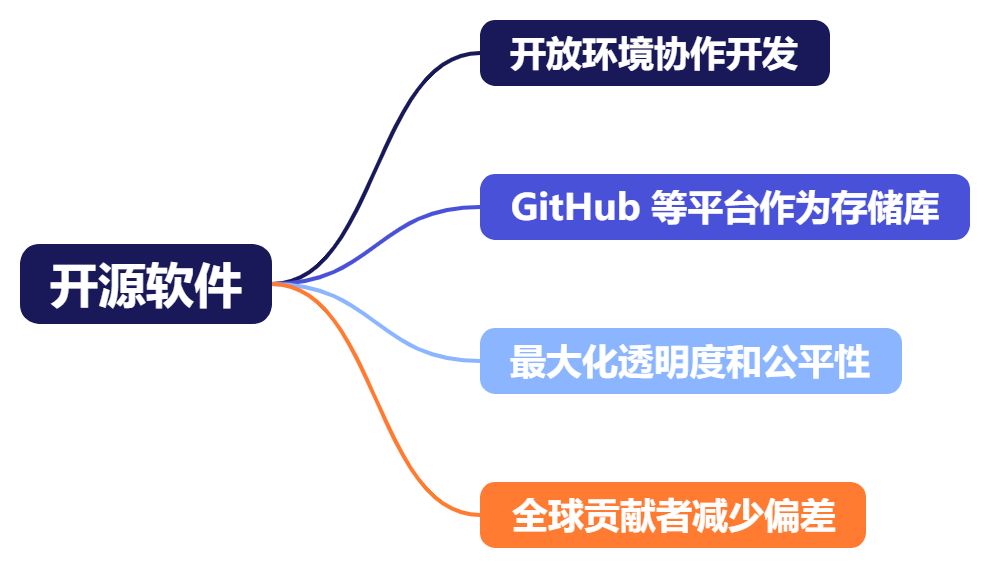

## 简介
### 领域 4 简介
我们开始探讨领域 4，其中介绍了响应式 AI 指南。领域 4 分为两个任务陈述，我们将在接下来的几节课中逐一讨论。

任务陈述 4.1：说明如何开发负责任的 AI 系统。  

任务陈述 4.2：认识到透明和可解释模型的重要性。  

对于第一个任务陈述，您需要了解响应式AI 的概念。您还必须能够识别响应式 AI 系统的特征和特点，以及如何使用可以提供帮助的工具。您需要了解响应式 AI 原则如何影响模型选择、风险评估和数据集特点。最后，您必须了解响应式 AI 上下文中偏差和差异的概念。您需要了解可用于监控和检测偏差以及评估模型的可信度和真实性的工具。  

对于第二个任务陈述，您需要了解响应式 AI 面临的一个巨大挑战，即模型推理的透明度和可解释性。您需要了解使模型透明或可解释的因素有哪些，还要了解可用来帮助解释模型输出的工具。您必须能够确定模型安全性与透明度之间的权衡取舍。最后，您将了解以人为本的设计如何帮助创建更易于解释的 AI。  

在接下来的几节课中，我将分别介绍每项任务陈述，并详细说明每个目标。在下节课中，我们将介绍领域 4 中的第一项任务陈述，并开始评估您的备考情况。

## 任务陈述 4.1：说明如何开发响应式 AI 系统
### 任务陈述 4.1 第 1 课
负责任的 AI 是一套指南方针和原则，旨在确保 AI 系统以安全、可信和负责任的方式运行。响应式 AI 的核心维度之一是公平性。公平性的重点是确保模型公平和公正地对待每个人，而与他们的年龄、居住地、性别或种族无关。能够用人类的语言解释模型做出特定决定的原因很重要，这就是我们所说的可解释性。例如，贷款申请被拒绝的主要原因是什么？当用户信任和依赖 AI 时，稳健性确保 AI 系统能够承受故障发生并最大限度地减少错误。隐私和安全主要是为了保护用户隐私，而不会泄露个人身份信息 (PII)。监管是指满足行业标准和最佳实践并审计对行业标准和最佳实践的遵守情况，包括正确估算和降低风险。透明度是指向利益攸关方提供有关模型能力、局限性和潜在风险的明确信息。透明度包括确保用户知道他们何时与 AI 互动。

公平性可避免通过 AI 系统延续或放大社会偏见和歧视。模型的公平性是通过不同群体结果的偏差和差异来衡量的。人口差异可能导致基于年龄、种族、性别等的不同群体产生不公平的结果或待遇。而模型的准确率还可能显示出偏差，对某些群体的准确率较高，而对其他群体的准确率较低。当训练数据集不能代表现实世界时，过度拟合就会成为问题。因此，模型仅在与训练数据相似的输入上表现良好。训练数据中未正确代表的群体可能会出现更多消极结果。当没有足够的训练数据来匹配某些群体的特征时，就可能会出现欠拟合，因此模型对他们来说效果不好。偏差或不一致的输出可能会降低用户信任度，而当 AI 系统违反公平性、非歧视和平等待遇原则时，就会出现伦理问题。了解并解决 AI 模型中偏差和差异的影响至关重要。这样做之后，我们可以确保我们的系统准确、公平和值得信赖。

出现模型偏差的主要原因之一是类别不平衡。当特征值的训练样本少于数据集中的其他值时，就会出现类别不平衡。在这个例子中，性别特征表明，女性占训练数据的 32.4%，而男性占 67.6%。因此，模型在训练期间了解到的男性数据记录比女性的数据记录多，因此它在进行与男性相关的推理时表现更好。而且该模型可能会过度拟合女性记录，因为它可能对女性数据记录采样不足。因此，该模型对女性预测的错误率可能更高。如果这是为了预测某人是否患有疾病，则可能导致更高的女性误诊率。

负责任的数据集是负责任的 AI 的基础，因为训练数据集中的偏差将变成输出中的偏差。负责任的数据集需要避免类别不平衡并表现其他重要特征。包容性意味着我们的训练数据会呈现不同的人群、观点和经验。多样性意味着整合各种属性、特征和变量以避免偏差。经策管的数据来源是精选并受到严格审查的，可确保质量和完整性。平衡的数据集可确保不同群体的平等代表性，避免偏态分布。必须保护隐私，保护敏感信息并遵守数据保护法规。同意和透明度包括获得数据主体的知情同意，并提供有关数据使用的明确信息。定期审计对于定期审查数据集以识别和解决潜在问题或偏差至关重要。作为 AI 专家，我们有责任确保用于训练模型的数据集具有这些伦理特征。通过这样做，我们可以构建公平、公正、尊重个人隐私和获得个人同意的 AI 系统。

在选择 AI 模型时，必须考虑一些伦理规范和其他因素。环境影响很重要，因为训练大型复杂模型要使用非常多的计算资源。因此，我们需要评估模型的碳足迹和能耗。考虑从经过训练的模型开始，以减少模型所需的训练量。可持续性是指优先考虑对环境影响最小且具有长期可行性的模型。重复利用现有工作是可持续性的关键原则。透明度是指提供有关模型能力、局限性和潜在风险的明确信息。这还意味着确保用户知道他们何时使用 AI。问责制意味着需要针对 AI 模型的结果和决策明确各方责任。利益攸关方的参与就是支持模型选择和部署过程中的不同观点。在选择 AI 模型时，您有责任考虑这些伦理规范，以确保系统不仅在技术上健全，而且具有社会责任感。这节课到此结束，在下一节课中，我们将继续讨论任务陈述 4.1。

### 任务陈述 4.1 第 2 课
我们继续探讨任务陈述 4.1：说明如何开发负责任的 AI 系统。下面我们来谈谈 AWS 提供的服务和功能，您可以使用这些服务和功能来衡量和监控模型的偏差、可信度和真实性。偏差是数据的不平衡或不同群体之间模型性能的差异。  

SageMaker Clarify 通过检查特定属性来检测数据准备期间、模型训练后和已部署模型中的潜在偏差，从而帮助您缓解偏差。模型的可解释性对于确保其做出无偏差的决策很重要。SageMaker Clarify 可以通过查看模型的输入和输出并将模型本身视为黑盒子来提高可解释性。通过进行这些观察，SageMaker Clarify 可以确定每个特征的相对重要性。例如，它可以说贷款申请被拒绝是因为两个最重要的特征（收入和未偿债务）未达到阈值。  

由于 SageMaker Clarify 将模型视为黑盒子，因此它无需知道深度学习模型的内部工作原理即可理解其进行预测的依据。它甚至可以解释使用非结构化数据的计算机视觉和自然语言处理模型。SageMaker Clarify 使用处理任务来检查您的数据集和模型。SageMaker Clarify 处理任务使用此 SageMaker Clarify 处理容器与 Amazon S3 存储桶进行交互，S3 存储桶包含您的输入数据集和部署到 SageMaker 推理终端节点的模型。  

SageMaker Clarify 处理容器从 S3 存储桶中获取待分析的输入数据集和配置。对于特征分析，SageMaker Clarify 处理容器向模型容器发送请求，并从模型容器的响应中检索模型预测。完成该步骤后，处理容器计算分析结果并将其保存到 S3 存储桶。这些结果包括有偏差指标和全局特征归因的 JSON 文件、可视化报告以及用于局部特征归因的其他文件。您可以从输出位置下载并查看这些结果。  

以下是一些 SageMaker Clarify 在分析训练数据集时衡量的指标示例。我们已知道，平衡的数据集对于避免特定类别发生错误非常重要。例如，主要基于中年人数据训练的 ML 模型在做出涉及年轻人和老人的预测时，其准确率可能会降低。当标签偏向于一个类别的积极结果时，就会出现另一种类型的不平衡。在我们的示例中，训练数据可能会显示出一种不必要的模式，表明中年人的贷款批准率更高。  

人口差异指标表明特定类别在数据集内被拒绝结果的比例是否大于接受结果的比例。例如，以大学录取为例。女性申请人占被拒绝申请人的 46%，但仅占获批准的申请人的 32%。我们认为这一结果表明了人口差异，因为女性被拒绝的比率超过了她们被录取的比率。  

以下是 SageMaker Clarify 使用已训练模型时会考虑的一些指标。预测指标中的正比例差异表明模型是否以不同的方式为每个类别做出积极结果预测。该指标可以与训练数据中的标签不平衡进行比较。目标是查看训练后正比例差异是否发生变化，或者数据中是否也存在偏差。  

请记住，特异性衡量的是模型正确预测消极结果的频率。如果中年男性的特异性低于其他年龄组，则该模型显示出对其他年龄组的偏差。查全率差异指标是两个类别之间模型查全率的差异。这些查全率中的任何差异都是一种潜在的偏差。查全率是真阳性率 (TPR)，它衡量的是模型正确预测应获得积极结果的情况的频率。如果一个类别的查全率很高，但另一个类别的查全率很低，则差异可用于衡量这种偏差。  

类别之间的模型准确率也可能不同，这种差异也是一种偏差。准确率差异指标是不同类别的预测准确率之间的差异。当数据包含类别不平衡时，可能会出现此结果。待遇平等是假阴性与假阳性之比的差异。即使两个类别的模型准确率相同，该比率也可能存在差异。不同类别发生的错误的类型差异可能会构成偏差。以贷款审批为例，一个类别的错误拒绝贷款的次数越多，另一个类别的错误批准贷款的次数就越多，这是两种截然不同的结果，显示出不同类别之间的偏差。  

这节课到此结束，在下一节课中，我们将对任务陈述 4.1 的内容进行总结。

### 任务陈述 4.1 第 3 课
我们继续探讨任务陈述 4.1：说明如何开发合乎道德且公平的 AI 系统。现在，我们来谈谈使用生成式 AI 模型带来的挑战和风险。尽管所有 AI 模型的可靠性都取决于训练所依据的数据，但生成式 AI 存在幻觉风险。如果模型做出的预测可能看似真实，但实际上是虚构的，就会出现幻觉。幻觉是 AI 模型在其训练数据中缺少某些内容时试图填补空白而产生的结果。根据使用所生成内容的方式，幻觉可能是灾难性的。2023 年，律师向纽约法院提交了一份简报，其中包含他们从生成式 AI 中获得的摘录和案件引用。但是，这些案件和摘录是假的。法院驳回了其委托人的案件，制裁了律师，并对律师及其事务所处以罚款。

有趣的是，AI 生成的作品不能受版权保护，因为它们不是人类的作品。但是，生成式 AI 模型可以使用受版权、专利或商标保护的数据进行训练，然后可以将这些数据包含在输出中。此外，用户可以提交受版权保护的作品作为输入，生成式 AI 可以创建未经许可的衍生作品。2023 年，Getty Images 对 Stable Diffusion 的创作者提起诉讼，Stable Diffusion 是一种文本到图像的生成式 AI 模型。据称，该诉讼涉及侵权使用超过 1,200 万张照片及相关图片说明和元数据来构建模型。

有偏差的模型输出可能导致对个人或群体有歧视或不公平待遇，进而成为重大的法律风险。平等就业机会委员会起诉了三家公司，理由是他们使用了歧视老年申请人的 AI 招聘程序。该程序会自动拒绝 55 岁以上的女性申请人或 60 岁以上的男性申请人。

生成式 AI 模型能够生成令人反感、令人不安甚至淫秽的内容（如果训练数据中包含此类内容）。有毒内容可能会对用户造成现实伤害，例如心理和情感健康问题。它甚至可能导致针对特定个人或边缘化群体的暴力倾向增加。

数据隐私是一种风险，因为大型语言模型使用的敏感数据可能会泄露并纳入其输出中。该输出可能包括个人身份信息、知识产权、商业秘密和医疗记录等。这些信息可能会出现在训练数据中或作为用户提示词出现在输入中，从而最终出现在模型中。由此引发的一个问题是，一旦基础模型接受过训练或看到一些数据，您就无法通过删除数据来让它忘记。

其中的任何一种风险都可能导致失去客户信任，由于不响应式 AI 行为或意想不到的后果而导致声誉受损。幸运的是，对于 Amazon Bedrock 中的基础模型，您可以配置防护机制来筛选并屏蔽不当内容。您可以使用防护机制定义内容筛选条件的阈值，以筛选并屏蔽仇恨、侮辱、色情或暴力类别的内容。您也可以完全屏蔽主题。对于这些主题，您可以使用纯文本来描述应拒绝的主题。当用户提交提示词时，它必须先通过防护机制。如果防护机制不允许使用这个提示词，则用户会收到您配置的违规响应。这个提示词永远不会出现在模型中。可以对提示词和模型响应设置防护机制，因此，如果提示词通过防护机制，响应仍然可以被屏蔽。否则，它将按原样通过。

SageMaker Clarify 的另一个功能是运行大型语言模型的评估任务，这样您就可以比较模型。它可以运行四种不同类型的任务，包括文本生成、文本分类、问答和文本摘要。然后，它可以评估五个不同维度的性能。提示词模式化衡量模型在其响应中包括偏见的概率。它包括种族、性别、性取向、宗教、年龄、国籍、残疾、外貌和社会经济地位的偏见。

毒性测试是检查您的模型是否包含性暗示、粗鲁、不合理、仇恨性或攻击性的评论，是否包含亵渎性语言、侮辱性语言、调情、对身份的攻击和威胁。

事实知识检查模型响应的真实性。

语义稳健性检查您的模型输出是否由于关键词拼写错误、随机更改为大写字母以及随机添加或删除空格而发生变化。

准确率将模型输出与预期响应进行比较，例如正确分类和汇总数据。您可以使用内置的提示词数据集或提供自己的提示词数据集。您还可以让员工或主题专家等人员提供反馈。如果您使用的是 Amazon Bedrock，Bedrock 控制台中也有同样的功能来帮助评估 Amazon Bedrock 中经过预先训练的 LLM。

这节课到此结束，在下一节课中，我们将开始学习任务陈述 4.2。

## 任务陈述 4.2：认识到透明和可解释模型的重要性
### 任务陈述 4.2 第 1 课
AI 及其可信度面临的最大挑战之一是理解 AI 模型如何以及为何做出决策。那么，让我们来看看这意味着什么，以及在设计模型时需要做哪些权衡。

模型的透明度衡量 ML 拥有者和利益攸关方对模型的工作原理及其产生输出的原因了解多少。所需的透明度通常取决于监管要求，因此可以保护消费者免受偏差和不公平的影响。

透明度有两个衡量标准：可诠释性和可解释性。高度透明的模型使用易于诠释的算法，例如线性回归。在最基本的模型中，我们可以看到直线的斜率和截距以及模型是如何使用的。稍微复杂一点的算法，例如决策树，也会生成易于理解的基本规则。另一端是神经网络，它模拟人脑的工作方式。我们可能知道，人脑是通过由近 1,000 亿个神经元组成的网络传播电信号来工作的，但是我们无法真正理解这个过程是如何转化为具体想法的。但是，仍然可以通过观察模型相对于某些输入的输出来解释不太容易诠释的模型。

可解释性是指能够在不知道模型确切工作原理的情况下描述模型在做什么。它将模型视为黑盒子，因此可以观察和解释每个模型。您可以使用与模型无关的方法来回答现实世界中的问题。例如，您可能想知道为什么一封电子邮件被标记为垃圾邮件，或者为什么一个人的贷款申请被拒绝。这种程度的可解释性通常足以实现业务目标。

在启动新的 AI 或 ML 项目时，我们需要知道可诠释性是否是一项硬性的业务要求。如果有关于完全模型透明度的法规或业务要求，则需要选择可诠释的模型。借助可诠释性，您可以记录模型的内部机制如何影响输出，但可解释性不考虑内部机制。

但是，在选择高透明度的模型时，您应该考虑一些权衡取舍。这些权衡涉及性能和安全性。复杂性较低的模型将更易于诠释。但是，简单模型的功能和性能有限。例如，假设有一种语言翻译模型，该模型可以查找句子中的每个单词，将其替换为另一种语言的单词。它也可能遵循一些基本的语法规则，不过，不太可能产生流畅的翻译。但是，能够理解整句话上下文的神经网络可以做到这点。

尽管可以通过选择不太复杂的算法来提高模型透明度，但它通常会影响模型性能，如图中所示。从模型安全的角度来看，缺乏透明度是有好处的。透明的 AI 模型更容易受到攻击，因为黑客了解到有关其内部机制的更多信息，并且可以发现模型漏洞。更不透明的模型限制攻击者只能通过研究模型输出了解信息。正确保护模型构件对于透明模型至关重要。

AI 透明度的另一个问题是专有算法暴露。黑客可以访问的 AI 模型行为解释越多，他们就越容易对 AI 模型进行反向工程。在保持透明度的同时确保客户数据隐私也可能具有挑战性。透明度可能需要共享有关用于训练模型的数据的详细信息，这会引发对数据隐私的担忧。

这节课到此结束，在下一节课中，我们将继续讨论任务陈述 4.2。

### 任务陈述 4.2 第 2 课
开源软件是在开放环境下以协作方式开发的软件。像 GitHub 这样的平台可用作这些开源 AI 项目的存储库。由于所有内容都是共享的，因此用户可以了解模型的结构和内部工作原理，从而最大限度地提高其透明度。由于 AI 模型的内部工作原理是公开可供审查的，因此它对自己的公平性很有信心。全球有很多用户为开源项目做出了贡献，这增加了开发人员的多样性，减少了偏差。此外，由于越来越多的人参与开发，更容易发现偏差或编码问题。

但是，由于通过开源项目实现了最大的透明度，一些公司担心模型的安全问题。他们阻止员工使用开源代码进行开发，甚至禁止他们使用通过开源代码开发的模型。有些公司更喜欢专有开发，因此出于安全原因限制了模型的透明度。

使用由 AWS 托管的经过全面训练的模型时，您只能与 API 进行交互，无法直接访问模型。因此，AWS 需要对如何解决响应式 AI 的核心维度问题保持透明。AI 服务卡是一种有关响应式 AI 的文档形式。它们将预期使用案例、限制、响应式 AI 设计选择以及部署和性能优化最佳实践集中到一处，方便客户查看。目前，AWS 的多个 AI 服务 API 都有 AI 服务卡。其中包括 Amazon Rekognition 的人脸匹配、Amazon Textract 的 ID 分析、Amazon Comprehend 的 PII 检测等 API。Amazon Bedrock 还为 Amazon 的基础模型 Amazon Titan Text 提供了 AI 服务卡。

对于您创建的模型，您可以使用 SageMaker Model Cards 帮助记录从设计、构建、训练到评估的模型生命周期。当您创建模型卡时，SageMaker 会在卡片中自动填充有关已训练的 SageMaker 模型的详细信息。例如，这些详细信息包括模型的训练方式以及使用的数据集和容器。

除了报告偏差外，SageMaker Clarify 模型处理任务还会报告可解释性。SageMaker Clarify 根据夏普里值的概念提供特征归因。您可以使用夏普里值来确定每个特征对模型预测所做的贡献。此条形图显示了模型使用的前四个最具影响力的特征。SageMaker Clarify 中提供的另一种分析类型是部分依赖图。此图显示了模型的预测如何因不同的特征值而变化。在本例中，模型的预测视年龄而变化。

现在，我们重点讨论如何让更多人参与到 AI 的开发和设计中。以人为本的 AI 是指设计优先考虑人类需求和价值观的 AI 系统。在以人为本的 AI 中，设计师和开发人员进行跨领域合作，并且经常邀请心理学家、伦理学家和领域专家参与，以收集不同的观点和专业知识。用户也会参与开发过程，以确保 AI 真正有用且对用户友好。以人为本的 AI 旨在增强人类的能力，而不是取代人类。以人为本的 AI 符合我们已经讨论过的伦理 AI 原则。它将人类需求纳入了各个开发阶段，以确保 AI 透明、可解释、公平、公正并维护隐私。

Amazon Augmented AI (Amazon A2I) 服务提供人工审查，让工作人员审查由 AWS AI 服务或自定义模型创建的推理样本。您可以配置 Amazon A2I，让其将置信分数低的推理发送给人工审查者，然后再发送给客户端。然后将他们的反馈添加到训练数据中，以重新训练模型。除了审查低置信度的推理外，您还可以让人工审查者审查随机预测，将其作为审计模型的一种方式。借助 Amazon A2I，您可以在自己的组织中使用许多审查者，也可以使用 Mechanical Turk。您可以配置审查每个预测需要多少审查者。以一个使用案例为例，假设您正在使用 Amazon Rekognition 检测包含露骨或攻击性内容的图片。可以人工审查 Amazon Rekognition 做出的置信度低的预测，确保某些露骨内容不会通过审查。

根据人类反馈进行强化学习 (RLHF) 是一项行业标准技术，用于确保大型语言模型生成真实、无害且有用的内容。回想一下，强化学习技术会训练模型做出能够获得最多奖励的决策，从而提高输出的准确性。RLHF 将人类反馈纳入奖励函数，因此 ML 模型可以执行更符合人类目标、愿望和需求的任务。

要使用这种技术，您需要单独训练一个模型用作奖励模型。奖励模型由人工训练，他们会查看大型语言模型中针对相同提示词的多个响应，并注明他们的首选响应。他们的偏好成为奖励模型的训练数据，奖励模型经过训练后，可以预测一个人对提示词响应的评分有多高。然后，大型语言模型使用奖励模型来完善其响应，以获得最大奖励。

使用 SageMaker Ground Truth 可以轻而易举地收集人类对 RLHF 的偏好，我们在介绍标注训练数据时已经讨论过这一点。在此屏幕截图中，您可以看到工作人员会收到多个响应，为了清晰起见，要求他们对所有响应进行排名。

在下一个课次中，我们将开始学习下一个演练问题。

## 领域 4 复习和练习
### 演练问题 7
略

### 演练问题 8
略

### 其他资源
1. [生成式时代下的响应式 AI](https://www.amazon.science/blog/responsible-ai-in-the-generative-era)
2. [将响应式 AI 从理论转化为实践](https://aws.amazon.com/cn/ai/responsible-ai/)
3. [用于负责任地构建 AI 的工具和资源](https://aws.amazon.com/cn/ai/responsible-ai/resources/)
4. [什么是 RLHF？](https://aws.amazon.com/what-is/reinforcement-learning-from-human-feedback/)
5. [响应式 AI 最佳实践：推广响应式和值得信赖的 AI 系统](https://aws.amazon.com/cn/blogs/enterprise-strategy/responsible-ai-best-practices-promoting-responsible-and-trustworthy-ai-systems/)