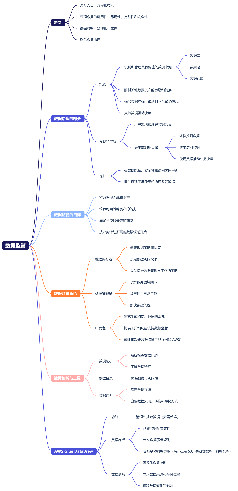
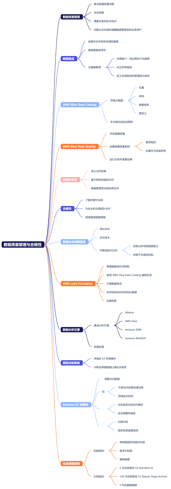

## 简介
### 领域 5 简介
我们开始探讨领域 5，其中介绍了 AI 解决方案的安全性、合规性与监管。领域 5 分为两个任务陈述，我们将在接下来的几节课中逐一讨论。

任务陈述 5.1：“解释保护 AI 系统的方法。”

任务陈述 5.2：“重视 AI 系统的监管与合规性法规。”

对于第一个任务陈述，您必须了解有关身份和访问管理如何在 AWS 上运行的一些基础知识。此外，还要了解如何确保 AI 应用程序和数据安全是 AWS 和客户的共同责任。您需要了解 AI 系统易受攻击和窃取的一些方式，并能够描述减少这些风险的最佳实践。

对于第二个任务陈述，您需要了解 AI 系统的一些监管与合规性标准，并能够确定用于满足这些标准的 AWS 服务、策略和流程。

在接下来的几个视频中，我将分别介绍每项任务陈述，并详细说明每个目标。我们将在下一课中开始评估您的备考情况，并介绍领域 5 中的第一个任务陈述。

## 任务陈述 5.1：解释保护 AI 系统的方法
### 任务陈述 5.1 第 1 课
下面我们开始探讨领域 5 的第一个任务陈述：解释保护 AI 系统的方法。本任务陈述分为六节课。

在 AWS 上，安全性与合规性是 AWS 和客户的共同责任。为了明确责任分工，AWS 创建了责任共担模式。责任共担模式划分了客户和 AWS 的责任。责任划分后通常分为客户责任（即云内部的安全性）和 AWS 责任（即云本身的安全性）。

云本身（数据中心、网络和物理硬件）的安全由 AWS 负责。AWS 将这些资源作为基于云的 Web 服务提供给客户。客户有责任通过限制访问权限、使用加密和遵循推荐的最佳实践来安全地使用这些服务。

AWS 负责保护全球基础设施，包括 AWS 区域、可用区、数据中心直至建筑物的物理安全。AWS 负责管理运行 AWS 服务的硬件、软件和联网组件，例如物理服务器、主机操作系统、虚拟化层和 AWS 联网组件。

当您使用任何 AWS 服务时，除了确保数据的安全之外，您还负责正确配置服务和应用程序。您的责任级别取决于服务。例如，您可以选择在 Amazon EC2 上部署 AI 模型，但是，随后您将负责实例操作系统、安全补丁、扩展以及在操作系统上运行的应用程序的安全性。但是，您也可以使用 SageMaker 无服务器推理来托管您的模型。这种完全托管式服务几乎不需要客户进行管理。AWS 负责管理所有底层基础设施，因此您无需管理实例或扩展策略。

正如我们所见，客户有责任以安全的方式使用 AWS。AWS Identity and Access Management 可让客户管理其账户中的权限。AWS Identity and Access Management (IAM) 是一项 Web 服务，可帮助您管理 AWS 账户和资源并确保对它们的安全访问。

使用 IAM，您可以创建和管理 AWS 用户，并授予他们使用您账户中的服务的权限。您可以通过分配 IAM 权限策略来控制用户的操作，这些策略决定了用户可以对资源执行哪些操作。

IAM 是一种全球资源，并不局限于任何一个区域。但是，可以使用 IAM 来限制用户对特定区域的权限。IAM 可以与 AWS 服务集成。IAM 用于管理用户可以对您账户中的资源执行的操作。

您可以向其他人授予管理和使用您的 AWS 账户中的资源的权限，而无需共享您的密码和访问密钥。IAM 支持多重身份验证 (MFA)。可以为您的账户和各个用户添加 MFA，以提高安全性。

IAM 支持身份联合验证。您可以允许已在其他位置（例如在您的企业网络中或通过互联网身份提供程序）获得密码的用户临时访问您的 AWS 账户。IAM 是您的 AWS 账户提供的一项功能，因此您无需支付额外费用。仅当您使用 IAM 用户访问其他 AWS 服务时才需要付费。

当您首次创建 AWS 账户时，您最初会拥有一个单一身份，该身份对账户中的所有 AWS 服务和资源具有完全访问权限。该身份称为 AWS 根用户。要访问根用户，请使用您创建账户时所用的电子邮件地址和密码登录。

由于无法限制根用户的权限，因此需要确保其凭证的安全。为确保根用户的安全，在创建账户时应选择一个强密码，并为根用户启用多重身份验证。切勿与任何人共享您的根用户密码和访问密钥。禁用或删除与根用户关联的访问密钥，因为在创建其他用户之后就不再需要这些密钥了。

最佳实践是不使用根用户，除了极少数需要使用根用户的情况，如计费账户管理。而是应该创建一个 IAM 用户，并使用该用户执行日常任务。您可以为该用户分配管理访问权限策略，以便为您提供所需的所有权限。

使用用户名和密码登录 AWS 账户是单因素身份验证。单因素身份验证是最简单和最常见的身份验证形式。即使您为根账户选择了强密码，您的账户仍被视为存在风险。例如，如果恶意攻击者通过社交工程、机器人或脚本找出您的密码，他们就可以访问您的账户并删除有价值的数据。他们还可能启动费用昂贵的加密货币挖矿业务并让您买单。

为了帮助保护您的账户免受恶意行为的侵害，您可以使用多重身份验证 (MFA)。使用 MFA 后，即使有人猜到或找出您的用户名和密码，他们也无法访问您的账户。他们需要您拥有的物理或虚拟 MFA 设备生成的编号。AWS 建议您在创建 AWS 账户后立即启用 MFA。

IAM 用户是您在 AWS 中创建的一个身份。IAM 用户代表与 AWS 服务和资源交互的人员，包含名称和凭证。作为最佳实践，请为必须访问 AWS 的每个用户创建单独的 IAM 用户，即使有多个用户需要相同级别的访问权限也应如此。为每位用户提供其唯一的安全证书。

用户不应共享其凭证。如果共享，您将无法看到哪个用户正在您的账户中执行操作。默认情况下，当您在 AWS 中创建新的 IAM 用户时，该用户没有与之关联的权限。要允许 IAM 用户在 AWS 中执行特定操作（例如配置资源），您必须向 IAM 用户授予必要的权限。

这节课到此结束，在下一节课中，我们将继续讨论任务陈述 5.1。

### 任务陈述 5.1 第 2 课
IAM 策略是一个 JSON 文档，用于允许或拒绝用户对 AWS 服务和资源的权限。IAM 策略允许您自定义用户对资源的访问级别。最佳实践是遵循最低权限安全原则，即仅授予完成任务所需的权限。下面是一个 JSON 文档示例，展示了允许用户在 AWS 账户中启动和停止 EC2 实例的 IAM 策略。

通过在用户级别分配策略来授予权限是一个很好的想法，但是如果您的 AWS 账户中有 3,000 名用户，那该怎么办？管理访问权限可能会成为一项挑战。为了缓解这一挑战，AWS 创建了 IAM 组。IAM 组是 IAM 用户的集合。当您将一个 IAM 策略分配给一个组时，该组中的所有用户都将获得该策略指定的权限。

要管理组，您可能需要按工作职能整理 IAM 组。例如，假设您的公司正在构建软件应用程序，并且您想控制该构建过程。您可以将开发人员组成一个 IAM 开发人员组，将测试人员组成一个 IAM QA 组，将管理员组成一个 IAM 管理员组，然后，您可以创建唯一的 IAM 策略并将其分配给组，而不是单个用户。

IAM 组可以有多个用户，用户可以属于多个组。IAM 组不能属于其他组。最佳实践是将策略附加到组中，并且仅向用户授予他们本应拥有的任何独有权限。

附加到用户和组的权限策略使用长期凭证来访问 AWS 资源。如果这些凭证被泄露，其他人就可以使用它们。例如，软件开发人员可能会在自己编写的软件中包含 AWS 凭证，但在共享代码之前却忘记删除这些凭证。更好的方法是使用 IAM 角色。

IAM 角色是个人或 AWS 服务可以代入的身份，以获得对其他 AWS 资源或服务的临时访问权限。当您代入 IAM 角色时，您将获得会话的临时安全凭证，该凭证将自动过期。IAM 用户、AWS 服务或通过外部身份提供商验证的用户都可以使用 IAM 角色。每个 IAM 角色都有一个关联的信任策略，用于确定哪些实体可以代入该角色。

与 IAM 用户、组和角色关联的权限策略称为基于身份的策略。权限策略也可以在资源级别上应用。例如，可以将 AWS 策略应用于 S3 存储桶，用于控制哪些用户或服务可以访问该存储桶及其对象。该策略称为基于资源的策略。

由此生成的权限是这两种类型的权限总和。如果基于身份的策略、基于资源的策略或两者都允许某项操作，则 AWS 也允许该操作。任一种策略中的显式拒绝都将覆盖允许。

这节课到此结束，在下一节课中，我们将继续讨论任务陈述 5.1。

### 任务陈述 5.1 第 3 课
在账户中创建和管理 IAM 用户的另一种方法是使用身份联合验证。身份联合验证是指用户通过 Active Directory 等身份提供商进行身份验证。进行身份验证后，他们将获得 AWS 的临时凭证。AWS IAM Identity Center 允许您使用外部身份提供商（如 Active Directory）对用户进行身份验证，您也可以在 IAM Identity Center 中创建一个目录并使用该目录进行身份验证。IAM Identity Center 将用户称为员工用户或员工身份。经过身份验证后，员工用户将被定向到门户，他们可以在那里选择访问 AWS 控制台。或者，也可以获取他们有权访问的任何 AWS 账户的临时访问密钥。对于使用多个 AWS 账户的企业来说，这是一大优势。他们无需管理每个账户中的 IAM 用户，而是可以将用户添加到 AWS Identity Center，并在一个中央存储库中管理所有账户的权限。

您还可以使用 AWS Identity Center 将用户分组，并在组级别分配权限集。AWS Identity Center 使用角色授予临时权限，这种做法比长期凭证更好。因此，AWS 建议使用 IAM Identity Center 来管理用户，而不是使用 IAM。

为了能够审计和验证您的安全配置，您必须可以记录和查看用户正在采取的操作。AWS CloudTrail 可捕获由您的 AWS 账户或代表您的 AWS 账户发起的 API 调用和相关事件。CloudTrail 将日志文件传输到您指定的 Amazon S3 存储桶。Amazon SageMaker 与 CloudTrail 集成。CloudTrail 可捕获 SageMaker 的所有 API 调用，但调用终端节点除外。例如，当用户创建训练任务或 Notebook 实例时，此操作会记录在跟踪记录中。使用 CloudTrail 收集的信息，您可以确定向 SageMaker 发出的请求。您还可以查看发出请求的 IP 地址、请求发出者、请求发出时间以及其他详细信息。

在 AWS 共担责任模式下，客户负责管理其数据的访问权限，这意味着要确保训练数据和构件的私密性和安全性。Amazon S3 阻止公共访问是一项可用于阻止对所有对象的公共访问的功能。无论现在还是将来，您都可以在存储桶或账户级别阻止公共访问。如果在存储桶级别启用，则您账户中的某些存储桶可能会向公众开放。在账户级别启用后，则任何现有或新的存储桶都不能授予公共访问权限。S3 阻止公共访问启用后，它将覆盖存储桶策略或访问控制列表授予的所有公共权限。

Amazon SageMaker Role Manager 大大简化了 IAM 角色的创建，由 IAM 角色授予执行 ML 活动的权限，而无需自己创建 IAM 权限策略。SageMaker Role Manager 为 12 项 ML 活动提供了三种预配置角色和预定义权限。它们包括访问其他服务的权限，例如 Amazon S3、AWS Glue、Amazon Athena 和 Amazon CloudWatch。IAM 角色还可以授予管理和监控 SageMaker 模型、终端节点、训练任务、管道和实验的权限。

数据科学家角色适用于需要使用 SageMaker 进行一般机器学习开发和实验的用户。MLOps 角色适用于管理模型、管道、实验和终端节点，但无需访问 Amazon S3 中数据的用户。SageMaker 计算角色用于创建 SageMaker 计算资源可用来执行训练和推理等任务的角色。

当您使用 SageMaker Role Manager 创建角色时，您选择的角色将为其预选适当的活动。如果愿意，您可以自定义启用哪些活动。通过这种方式，SageMaker Role Manager 可以为角色创建权限策略。您还可以选择添加其他 IAM 策略。

这节课到此结束，在下一节课中，我们将继续讨论任务陈述 5.1。

### 任务陈述 5.1 第 4 课
客户保护数据安全的另一项责任是确保数据经过加密。此要求在合规标准中也很常见。所有 AWS 服务都可以加密静态数据和传输中数据。通过加密静态数据，即使有人可以在存储卷上访问您的数据，他们也无法读取这些数据。AWS 提供了多种功能，可供客户轻松加密数据和管理加密密钥。加密密钥与加密算法一起使用，在数据写入存储器之前对其进行加密。要解密数据，您仍需要访问加密密钥，因此仅获得数据访问权限并不足以让您读取数据。

加密可以在客户端完成，即客户在将数据发送到 AWS 服务之前对其进行加密。或者可以在服务器端完成加密，即由 AWS 服务对数据进行加密。服务器端加密是客户确保正确实施和一致应用加密的最简单方法。它通常是您在配置资源时启用的选项。但是，某些 AWS 服务（例如 Amazon S3、Amazon DynamoDB 和 Amazon SageMaker）会默认加密数据，无需您启用该选项。例如，SageMaker 将加密 ML 存储卷上的所有数据，包括 Notebook 实例、SageMaker 任务和终端节点使用的数据。具有默认加密功能的服务使用的密钥归该服务所有，而不是归客户所有。

如果您需要更多控制权，可以通过 AWS Key Management Service (AWS KMS) 来使用属于您账户的加密密钥。您可以使用 AWS KMS 在您的 AWS 账户中创建、管理和使用加密密钥。使用 IAM 策略，您可以控制密钥的使用。通过使用策略来控制哪些用户或服务可以访问密钥，可以为数据多增加一层保护。例如，假设某用户意外获得了对您的 S3 存储桶的读取权限，除非该用户也有权使用解密数据所需的 AWS KMS 密钥，否则他/她将无法读取数据。除非您指定要使用的 AWS KMS 密钥，否则具有默认加密的服务（如 Amazon S3 和 SageMaker）将使用自己的密钥。

AWS KMS 允许您使用由 AWS 管理的密钥或由您控制的密钥。使用客户管理的密钥来控制密钥策略、密钥的 IAM 策略、密钥轮换策略以及启用或禁用密钥。所有 AWS 服务终端节点都支持 TLS，可以创建安全的 HTTPS 连接来发出 API 请求。因此，通过 API 和控制台向 Amazon S3 和 SageMaker 发出的所有请求都是通过安全的加密连接发出的。

SageMaker 分布式训练使用集群中的多个节点。默认情况下，节点间流量未加密，但提供了启用此类加密的选项。尽管非常敏感的数据可能需要这种加密，但启用节点间加密会延长某些算法的训练时间，尤其是深度学习算法。

Amazon Macie 会持续评估您的 S3 存储桶并自动生成其大小和状态的清单。它包括私有或公共访问权限、与其他 AWS 账户共享的访问权限以及加密状态。Macie 还使用 ML 和模式匹配来识别并提醒您注意敏感数据（例如个人身份信息 (PII)）。这些提醒可以集成到您的 ML 工作流中，以采取自动补救措施。通常，应在摄取和转换时从训练数据中删除 PII。例如，没有理由用信用卡号、姓名、地址或社会保险号来训练模型。如果 Macie 在您的 S3 存储桶中发现敏感数据，它会向您发出提醒； 如果您的训练数据中包含敏感数据，则必须将其删除。

客户还负责管理其云基础设施的安全配置。AWS 提供 Virtual Private Cloud (VPC)，让客户能够在 AWS 上配置自己的专用网络。Amazon SageMaker Studio 和 SageMaker Notebook 实例在 SageMaker 管理的 VPC 中启动。默认情况下，允许这些实例直接访问互联网，这意味着您可以从互联网上下载常见的软件包。但是，您可能会下载通过互联网将您的数据发送出去的恶意代码。最佳实践建议是在账户中创建一个 VPC，并在启动 SageMaker Studio 和 Notebook 时指定您的 VPC。这样做会在您的 VPC 中创建一个弹性网络接口，并将其附加到 Notebook 实例。

如果使用自己的 VPC，您可以通过配置安全组、网络访问列表和网络防火墙来控制哪些流量可以访问互联网。通过仅为网络访问类型指定 VPC，您可以阻止 SageMaker 向您的 Notebook 实例提供互联网访问权限。SageMaker Studio 通常使用公共网络访问所需的服务，如 Amazon S3、Amazon CloudWatch、SageMaker 运行时和 SageMaker API。但是，当您使用仅限 VPC 模式时，将无法再访问这些服务的公有终端节点。

要让所有网络流量只通过专用网络传输，可以使用 VPC 接口终端节点。VPC 接口终端节点使用 AWS PrivateLink 将您的 VPC 直接连接到 AWS 服务。由于 SageMaker Studio 在您的 VPC 中运行，因此它可以使用 VPC 接口终端节点访问外部服务。

这节课到此结束。在下一课中，我们将继续讨论任务陈述 5.1。

### 任务陈述 5.1 第 5 课
AI 系统可能存在特定的漏洞，您应该关注这些漏洞，以便检测和缓解潜在的安全威胁。AI 模型从训练数据中学习其行为。如果恶意行为者获得了训练数据的访问权限，他们就会引入将改变模型预测的数据。例如，假设欺诈侦测模型已根据标注为欺诈和非欺诈的金融交易进行了训练，那么，攻击者可能会将某些欺诈交易添加到标注为非欺诈交易的数据中。这样，模型就会对这些交易进行错误分类，从而允许攻击者实施欺诈而不被发现。

即使没有获得训练数据的访问权限，攻击者也能导致模型出错。攻击者可以对输入数据稍作篡改，使模型对其进行错误分类。例如，某公司使用人脸识别模型来识别员工。攻击者可以对其图像进行细微但精心设计的修改，使模型将他们识别为其他人。这种攻击被称为对抗性输入。

老练的攻击者可以使用模型的输出来推断训练数据。攻击者不断向模型馈送数据并研究输出，我们称之为模型反演。例如，人脸识别模型是根据员工图像进行训练的，其输出是员工姓名和置信度分数。攻击者可以反复向模型馈送面部图像，进行更改，直到输出为员工姓名和高置信度分数。这样，攻击者就获得了合格的员工图像，可以用来冒充该员工。

此外，有了足够的输入和输出对，攻击者就可以创建一个反向工作的新模型。也就是说，他们可以基于原始模型的输出训练一个新模型，并使用它来推断训练输入数据。同样，攻击者也可以对模型进行反向工程，自己构建与原始模型非常相似的模型。攻击者掌握的模型信息越多，他们复制的模型就越准确。

大型语言模型很容易受到一种称为“提示词注入”的攻击。在这种攻击中，攻击者会在提示词中向模型发出恶意指令，目的是影响模型的输出。例如，攻击者可以提示 LLM 忽略或更改其提示词模板，这将允许攻击者获取敏感信息。

部署 AI 系统的客户必须通过保护和限制对数据和模型的访问来主动防范潜在攻击。他们还需要监控生产环境中的模型是否发生偏移和异常。访问应始终遵循最低权限原则。在 AWS，这意味着需要配置合适的权限策略并阻止公共访问。为了提供额外的保护层，应对数据和构件进行加密。

您应该限制和控制对模型的访问，以阻止反向工程。用户输入的数据必须经过检查和验证。模型的输入应寻找异常模式。例如，您可以教 LLM 使用关键攻击模式检测提示词注入，并返回响应“prompt attack detected”。另外，请勿在模型输出中提供任何不必要的信息。否则，攻击者可能会使用这些信息来推断出有关模型的信息。

为了帮助模型免受欺骗，您应该使用对抗性输入训练模型。此外，您可以经常使用新数据训练模型，以便弥补损坏的训练数据所造成的任何损失。您应保留一组单独的数据用于验证，并在每次重新训练后验证模型，然后再进行部署。在使用数据进行训练之前，您还应定期扫描和监控数据的质量并检测异常。

最后，您的模型预测可能会与其历史模式有所不同。应对这种情况进行调查，以确定根本原因是数据质量低下还是受到攻击。Amazon SageMaker Model Monitor 可以监控生产环境中 Amazon SageMaker 机器学习模型的质量。将模型部署到生产环境后，请使用 Amazon SageMaker Model Monitor 持续实时监控模型的质量。您可以使用 Amazon SageMaker Model Monitor 设置自动提醒系统，在检测到模型质量偏差（例如数据偏移或异常）时自动发送提醒。

Amazon SageMaker Model Monitor 还可用于监控数据质量。SageMaker Model Monitor 可以将数据和模型与基准进行比较。它生成的统计数据和指标可在 SageMaker Studio 上显示，也可以发送到 Amazon CloudWatch。Amazon CloudWatch Logs 可收集监控模型状态的文件。当模型质量达到预设阈值时，它会通知您。CloudWatch 将日志文件存储到您指定的 Amazon S3 存储桶中。

通过 AWS 模型监控器产品及早主动检测模型偏差，您可以及时采取行动。通过这种方式，您可以维护并提高已部署模型的质量。要使用 SageMaker Model Monitor 监控数据质量，必须启用数据捕获。该功能可捕获来自推理终端节点或批量转换任务的推理输入和输出，并将这些数据存储在 S3 中。

要创建基准，通常可以使用训练数据集。然后，您可以安排数据质量监控任务，为基准数据集和正在分析的当前数据集生成统计数据。您可以在 SageMaker Studio 中查看结果。类似的过程会使用 SageMaker Model Monitor 来监控模型性能。您可以使用标注数据来创建基准。模型质量任务运行后，模型会将推理与 SageMaker Ground Truth 中相同输入的标注数据进行比较，然后评估性能。您可以在 SageMaker Studio 中查看结果。

### 任务陈述 5.1 第 6 课
跟踪用于模型生产的所有构件，这是重现模型以满足监管和控制要求的基本要求。为了能够重新创建模型，必须对参与模型开发的所有不同构件进行版本控制和跟踪。GitHub 和 AWS CodeCommit 等代码存储库会自动保留源代码的版本。此代码可能包括训练代码、推理代码、实验和 Notebook。数据集应存储在 Amazon S3 中，并使用前缀进行分区，以唯一地标识训练数据集。使用唯一 ID 对存储在 Amazon Elastic Container Registry (Amazon ECR) 中的容器映像进行唯一标识，也可以使用其他信息进行标记。

SageMaker 会自动唯一地标识每个训练任务，并存储其他元数据，例如超参数以及容器、数据集和模型输出的唯一标识符。可以使用 SageMaker 模型注册表将模型版本存储在模型目录中。SageMaker 终端节点都有唯一的标识符和元数据。例如，自动跟踪作为终端节点配置一部分的所用模型。使用 SageMaker 模型注册表，您可以将模型编入包含不同模型版本的模型组中。模型组中的每个模型包对应一个经过训练的模型。您可以关联和查看包括训练指标的模型元数据。可以直接从模型注册表部署模型。模型注册表还允许您维护模型的状态，例如待处理、已批准或已拒绝。

可以使用 Amazon SageMaker Model Cards 记录、检索和共享从构思到部署的基本模型信息。风险经理、数据科学家和 ML 工程师可以使用 Model Cards 创建不可变的预期模型用途、风险评级、训练详细信息和评估结果记录。Model Cards 可以导出为 PDF 并与利益攸关方共享。

Amazon SageMaker ML Lineage Tracking 会自动为端到端机器学习工作流的所有元素创建图形表示。您可以使用此表示来建立模型监管、重现工作流并保留工作历史记录。Lineage Tracking 会自动为试用组件及其相关的试用和实验创建跟踪实体。在创建 SageMaker 任务时，例如处理任务、训练任务和批量转换任务，可以使用 Lineage Tracking。您可以对谱系数据运行查询，以发现实体之间的关系。例如，查询谱系以检索使用特定数据集的所有模型，或检索使用容器映像构件的数据集。

我们来回顾一下，特征是一种数据属性，可用作使用模型进行训练或预测的一种输入。例如，特征可以描述数据表中的列。Amazon SageMaker Feature Store 是特征和相关元数据的集中存放区，因此可以轻松发现和重复使用特征。使用 Feature Store，创建、共享和管理特征以进行 ML 开发变得不那么复杂。Feature Store 可减少将原始数据转换为特征以训练 ML 算法所需的重复数据处理和策管工作，从而加速这一过程。

您可以创建工作流管道，将原始数据转换为特征并将其添加到特征组中。您还可以查看特征组的谱系。谱系包含有关特征处理工作流执行代码的信息。它还包括使用了哪些数据来源以及如何将它们摄取到特征组或特征中。Feature Store 还支持时间点查询，以检索每个特征在相关历史时间的状态。

Amazon SageMaker 模型控制面板是一个集中式门户，您可以从 SageMaker 控制台访问该门户，并在这里查看、搜索和浏览账户中的所有模型。它汇总了多个功能（包括 Model Monitor 和 Model Cards）的模型相关信息。您可以可视化工作流谱系并跟踪终端节点性能。您可以跟踪部署了哪些模型进行推理，以及它们是用在批量转换任务中还是托管在终端节点上。如果您使用 Model Monitor 设置监视器，还可以在模型使用实时数据进行实时预测时跟踪模型的性能。

您可以使用控制面板查找违反您为数据质量、模型质量、偏差和可解释性设置的阈值的模型。控制面板可全面显示所有监控结果，帮助您快速识别未配置这些指标的模型。在下一课中，我们将开始学习任务陈述 5.2。

## 任务陈述 5.2：重视 AI 系统的监管与合规性法规
### 任务陈述 5.2 第 1 课
现在，我们来看看领域 5 的第二个任务陈述，即“重视 AI 系统的监管与合规性法规”。本任务陈述分为六节课。出于对 AI 风险的担忧，为 AI 工作负载制定了几项合规性标准。遵循这些标准将有助于保护您的业务和客户，并确保决策的公平性。根据贵公司所处的行业，您可能还需要遵守行业特定的标准。定期审计或检查将确保公司符合这些标准。

我们前面说过，在 AWS，安全性与合规性是 AWS 和客户的共同责任。为了明确责任分工，AWS 创建了 AWS 责任共担模式。AWS 责任共担模式适用于安全性与合规性。AWS 负责通过保护底层物理数据中心和基础设施来满足云本身的合规性要求。客户负责保护云内部的工作负载以满足合规性要求。

为了保证数据中心运营、技术和安全性，AWS 遵循严格的安全性与合规性认证。合规标准通常包括必须由外部审计员测试和验证的安全和运营控制措施列表。通过责任共担模式，AWS 客户可以沿用 AWS 的一些控制措施。AWS 将这些控制措施交由第三方审计，并将审计师的报告提供给客户。

AWS Artifact 是一项向客户提供第三方审计员的合规性报告的服务。尽管您无法将自己的审计员派到 AWS 数据中心，但您可以向他们提供这些报告。这种做法缩小了他们的审计范围，因为客户可以沿用报告中的合规性控制措施。当您在云中部署和运行工作负载时，您的审计员只需要关注您的流程和程序。

经过审计员的测试和验证，AWS 符合各种全球性、区域性和行业特定的安全标准和法规。您可以在 AWS Artifact 中找到这些合规性报告和法规。每个报告均包含有关其内容的描述以及文档的有效报告期限。

作为全球性云服务提供商，AWS 必须始终遵守世界各地的标准。通过这样做，它赢得了在 AWS 上部署潜在敏感工作负载的客户的信任。例如，Service Organization Controls (SOC) 报告是一种验证第三方是否遵循某些特定最佳实践的方法。在将业务职能外包给该企业之前，这些信息对客户很重要。

SOC 2 会报告与安全性、可用性、处理、完整性、机密性和隐私相关的控制措施。如果某公司想为其客户实现 SOC 2，他们会使用 AWS SOC 2 报告作为起点。然后，由审计员验证该公司是否正确配置了他们负责的安全控制措施。

再举一个例子，ISO 27001 是一项国际安全管理标准，它规定了安全管理最佳实践和全面的安全控制措施。由于 AWS 已获得该标准的合规性认证，因此它可以帮助客户的组织获得该认证。

Customer Compliance Center 是一组资源，可帮助您了解 AWS 合规性。在 Customer Compliance Center，您可以阅读客户合规性案例，了解受监管行业的公司如何解决各种合规性、监管和审计挑战。您可以访问有关各种主题的合规性白皮书和文档。这些主题包括 AWS 对关键合规性问题的解答、AWS 风险与合规性概述以及审计安全清单。

此外，Customer Compliance Center 还包括审计员学习路径。担任审计、合规性及法律职务的人员可能想要详细了解他们的内部运营人员如何使用 AWS 云证明其合规性。

这节课到此结束，在下一节课中，我们将继续讨论任务陈述 5.1 与合规性。

### 任务陈述 5.2 第 2 课
AI 领域的合规标准仍然层出不穷，有的才刚刚开始被采用。ISO 42001 和 ISO 23894 均于 2023 年发布，建立了评估和管理 AI 系统风险的机制。这些标准制定了一个框架，让组织可以系统地应对和控制与 AI 开发和部署相关的风险。它们重视对响应式 AI 实践的承诺，鼓励组织采用特定于其 AI 系统的控制措施。它们还致力于促进全球互操作性，为响应式 AI 的开发和部署奠定基础。

请记住，尽管强烈建议遵守合规标准，但它们不属于法律规定。但是，《欧盟人工智能法案》是一项拟议的欧洲人工智能 (AI) 法规，是世界上首个由主要监管机构提出的全面 AI 法规。该法案将 AI 的应用分为三个风险类别。首先，彻底禁止会带来不可接受的风险的应用程序和系统。例如，被禁止的应用程序有根据社交行为对个人或群体进行分类的社交评分应用程序，还有从互联网上抓取面部图像的面部识别数据库，以及推断工作场所或教育机构情绪的应用程序。

其次，高风险应用程序（例如对求职者进行排名的简历扫描工具）需要遵守特定的法律要求。最后，未明确禁止或列为高风险的应用程序基本上不受监管。大多数 AI 系统属于高风险类别。对这些应用程序的要求包括建立风险管理系统、进行数据监管和记录合规性。即使您不向欧盟公民提供 AI 系统，《通用数据保护条例 (GDPR)》等欧盟法规通常也用作全球性标准。因此，您应该关注并尽量满足这些标准。

美国国家标准与技术研究院 (NIST) 发布的 AI 风险管理框架 (RMF) 为促进可靠、负责任地开发和使用 AI 系统提供了指导。AI RMF 的目标是为设计、开发、部署或使用 AI 系统的组织提供资源，以帮助管理 AI 风险。它促进了可靠、负责任地开发和使用 AI 系统的进程。该框架是自愿性质的。它描述了四种特定功能：监管、映射、测量和管理，以帮助组织在实践中应对 AI 系统的风险。

正如我们刚才所看到的，AI 合规标准主要用于衡量和管理 AI 系统的风险。根据 NIST RMF 的规定，可以通过将事件发生的可能性乘以事件所引发后果的严重程度来估算风险。使用此风险矩阵，我们可以将严重程度低且发生可能性很小的事件视为风险非常低。

要估算 AI 系统的风险，首先应确定 AI 使用案例和使用案例的相关利益攸关方。例如，考虑某些用户将如何使用该系统来实现特定目标。接下来，确定与使用案例相关的潜在有害事件，并使用风险矩阵来确定每个事件的风险。然后，您可以解决固有风险，可以通过适当的安全控制措施和监控来缓解此类风险。例如，通过增加安全控制措施，可以降低事件发生的可能性，从而降低其总体风险。

缓解固有风险之后，其余的就是剩余风险，也就是缓解后剩下的风险。最后，汇总各个风险等级，得出系统的总体风险评级，该评级是通过关注最高的剩余风险评级来确定的。

《算法问责法案》已多次提交给美国国会进行审议。该法案如果颁布，将要求各公司评估他们使用和销售的 AI 系统的影响。该法案将为何时和如何使用此类系统确定新的透明度，并支持消费者在与 AI 系统互动时做出明智的选择。它的目标是努力保护美国人，使他们免受可能导致结果不公平和无法解释的 AI 系统的侵害。

例如，该法案希望消费者有权知道贷款申请被拒绝的原因。他们有权知道是否存在某种固有和不公平的偏见。由于生成式 AI 模型比较复杂，因此很难从深层次上了解模型是如何得出输出的。根据最低透明度原则，应考虑何时向用户披露他们是在使用生成式 AI，而不是在与人类互动。

但是，对于许多应用程序，您可能需要更深入地了解并能够解释模型是如何得出推理的。我们将了解 AI 系统如何得出输出的过程称为可解释性。一种可行的可解释性方法是观察模型在输出和输入方面的行为。通过这种与模型无关的方法，从业者可以确定对哪些特征的关注最多，并将模型视为黑盒子。

但是，通过使用更易于诠释的算法和技术（例如决策树或基于规则的系统），您可以观察模型权重并了解内部工作原理。在 AI 和 ML 开发的初始阶段，您应该考虑可诠释性与性能之间的权衡，同时考虑到监管要求。

制定《算法问责法案》的第二个主要原因是消除决策中的偏差。目标是确保结果不受不当使用某个人的各种个人属性的影响。这些属性可能包括种族、性别、性别认同、宗教信仰、政治派别以及他们是生活在城市还是农村社区。

消除偏差的目标要求您测试和监控模型结果及其训练数据中的偏差。Amazon SageMaker Clarify 可以帮助您了解不同变量如何影响模型的行为，并监控是否存在偏差和特征归因偏移。

这节课到此结束。在下一课中，我们将继续讨论任务陈述 5.2 和 AWS AI 服务的合规性。

### 任务陈述 5.2 第 3 课
为了帮助客户实现合规性，AWS 提供了各种服务和功能，旨在帮助客户审计、监控、控制和报告他们必须正确配置的相关安全控制措施。AWS Audit Manager 可将您的合规性要求映射到您的 AWS 使用数据。它会收集合规或不合规的证据，并生成可以提供给审计员的评估报告。Audit Manager 将根据选定的框架创建评估，该框架是一组与您的审计相关的控制措施。它具有内置框架，包括用于生成式 AI 最佳实践和 SOC 2 的框架。您还可以量身定制自己的框架，用于评估您关注的具体控制措施。当您创建评估时，Audit Manager 会根据框架中定义的控制措施自动评估您的 AWS 账户和服务中的资源。然后，它会收集相关证据，并将其转换为易于审计的格式。接下来，它将证据附加到您评估的控制措施中。准备进行审计时，您可以审查收集的证据，然后将其添加到评估报告中。此报告可帮助证明您的控制措施正在按预期运行。

Guardrails 是 Amazon Bedrock 的一项功能，可用于根据使用案例和响应式 AI 策略来实施特定于应用程序的防护机制。Guardrails for Amazon Bedrock 提供具有可配置阈值的内容筛选条件，用于筛除仇恨、侮辱、色情和暴力类别的有害内容。Guardrails for Amazon Bedrock 采用简短的自然语言描述，使您能够在应用程序的上下文中定义一组要避免的主题。您可以选择提供一些示例短语来帮助 Guardrails 识别这些主题。Guardrails 可检测并屏蔽属于受限主题的用户输入和基础模型响应。Guardrails for Amazon Bedrock 还允许您在用户输入和基础模型响应中检测个人身份信息 (PII)。根据使用案例，您可以有选择地拒绝包含 PII 的输入，或者编辑基础模型响应中的 PII。您可以使用 Guardrails 来配置不同类别的阈值，以筛除有害的交互。Guardrails 会自动评估用户查询和基础模型响应，以检测和帮助阻止属于受限类别的内容。例如，电子商务网站可以设计线上助手，避免使用仇恨言论或侮辱性措辞等不当语言。此外，您可以轻松屏蔽特定主题。例如，如果您想阻止您的模型提供投资建议，则可以添加拒绝的主题并用简单的语言来描述它。您还可以指定两条消息作为响应：一条是在提示词被屏蔽时使用，另一条是在模型的响应被屏蔽时使用。例如，响应可能是：“We are sorry, but that topic is outside our area of expertise.”

虽然目标是实现合规性，但要注意资源配置是否发生了变化，例如导致其不合规的配置错误。AWS Config 可以提供 AWS 资源当前配置的详细清单。每当资源配置发生更改时，AWS Config 都会捕获此更改并将其记录在配置历史记录快照中。更改由配置规则进行评估。如果更改不符合规则，可以使用 AWS Systems Manager Automation 文档自动进行补救。您可以选择使用预构建的规则，也可以使用 Lambda 函数创建自定义规则。一致性包将 AWS Config 规则和补救措施打包在一起，帮助部署规则和补救措施，从而满足您的合规性需求。您可以自己创建一致性包，也可以从一致性包模板库中进行选择。两个有用的一致性包是 AI 和 ML 的运营最佳实践，以及 Amazon SageMaker 的安全最佳实践。

AWS Config 在资源级别监控配置，而 Amazon Inspector 在应用程序级别工作。Amazon Inspector 会检查应用程序和容器是否存在安全漏洞以及与安全最佳实践的偏差，例如对 EC2 实例的开放访问权限和安装易受攻击的软件版本。Amazon Inspector 通过自动运行安全评估，帮助提高应用程序的安全性与合规性。Amazon Inspector 执行评估后，会为您提供一个安全调查结果列表。该列表按严重性级别进行优先排序，包括每个安全问题的详细描述以及有关如何修复问题的建议。

AWS Trusted Advisor 可帮助您优化成本、提高性能、提升安全性和弹性，并在云中大规模运营。通过使用成本优化、性能、弹性、安全性、卓越运营和服务限制类别的最佳实践检查，Trusted Advisor 可以持续评估您的 AWS 环境。它会建议采取措施来纠正与最佳实践的任何偏差。

这节课到此结束，在下一节课中，我们将继续讨论任务陈述 5.2。

### 任务陈述 5.2 第 4 课
数据监管涉及人员、流程和技术，用于管理企业系统数据的可用性、易用性、完整性和安全性。有效的数据监管可确保数据的一致性和可靠性，同时避免数据被滥用。

数据治理可以分为三个主要部分。策管、发现和了解、保护。大规模数据策管意味着需要识别和管理最有价值的数据来源，包括数据库、数据湖和数据仓库。通过数据策管，您可以限制关键数据资产的激增和转换。

大规模数据策管意味着需要识别和管理最有价值的数据来源，包括数据库、数据湖和数据仓库。通过数据策管，您可以限制关键数据资产的激增和转换。数据策管还要确保数据准确、最新且不含敏感信息，这样用户就可以放心地做出数据驱动的决策。

在上下文中了解您的数据意味着用户可以发现和了解其数据的含义，从而自信地使用这些数据来推动业务价值。借助集中式数据目录，可以轻松找到数据。可以请求访问数据，还可以使用数据来做出业务决策。

保护您的数据意味着能够在数据隐私、安全性和访问之间取得适当的平衡。能够使用对业务和工程用户都非常直观的工具跨组织边界监管数据至关重要。

数据监管的重点是确保将数据视为战略资产，培养有效利用该战略资产的能力，监管和控制数据以满足利益攸关方的期望。从成功实施有针对性的业务计划所需的数据领域开始。

定义关键的数据监管角色和职责，例如数据拥有者、管理员和 IT。在考虑职责分离的同时，将关键角色分配给组织中的相应人员。数据拥有者应在组织层面获得认可，包括技术和业务代表。数据管理应该是所有面向数据的业务人员的责任。

数据管理员是企业中对支持有针对性的业务计划所需的数据有详细了解的人员。数据管理员每天都参与项目的具体工作。他们可帮助了解可能给业务计划带来挑战的数据问题。

数据拥有者是制定数据策略（包括监管和合规性策略）决策的高管。例如，他们决定谁有权访问索赔数据，谁有权访问客户数据。数据拥有者与数据管理员有着直接关系。数据管理员负责完成项目的日常任务，数据拥有者负责提供指导数据管理员工作的数据相关策略。

IT 领域的角色可帮助浏览生成和使用数据的系统，并为数据管理员提供适合的工具和功能。例如，IT 可能负责在 AWS 中管理和部署数据监管工具。

通过数据剖析，系统地检查数据，以确定数据是否存在任何问题，并出于各种目的了解数据特征。数据目录确保数据可供需要访问的人使用。

数据谱系可确定特定数据元素的来源以及数据的移动、转换和存储方式。当数据消费者在报告中看到数据时，他们通常会质疑数据的来源，以及在此过程中进行的任何计算。

AWS Glue DataBrew 是一种可视化数据准备工具，用户可使用它来清理和规范数据，而无需编写任何代码。它提供了两个有助于数据监管的功能。第一个是数据剖析。您可以使用 AWS Glue DataBrew 对您的数据集运行剖析任务，以创建数据配置文件。

此配置文件会告诉您数据的现有形状，包括内容的上下文、数据的结构及其关系。您可以定义数据质量规则，系统将在剖析期间验证这些规则，以检测数据存在的问题。AWS Glue DataBrew 可以分析多种类型的数据集，包括存储在 Amazon S3、关系数据库和数据仓库中的数据。

除了创建数据配置文件外，AWS Glue DataBrew 还会在可视化界面中跟踪您的数据，以确定其来源，即数据谱系。此视图向您展示了数据如何从最初来源开始流经不同实体。您可以看到数据的来源、影响数据的其他实体、数据在一段时间内发生了什么，以及数据的存储位置。

这节课到此结束。在下一课中，我们将继续讨论任务陈述 5.2。

### 任务陈述 5.2 第 5 课
数据质量管理可解决通过数据剖析或其他方式发现的数据质量问题。只要有可能，我们需要找出导致数据质量问题的根源。为此，我们需要有关数据及其在针对性计划中的作用的业务和技术知识。如果问题涉及来源，我们必须提醒数据管理员和业务用户并将问题报告给他们，让他们可以纠正问题。

数据集成是指收集并合并各种来源的数据。我们需要确保不同来源的数据连贯地联系在一起，方便将它们组合在一起以获得更全面的信息。需要特别考虑有关客户、供应商和产品的主数据。例如，有关同一客户的信息可能分别存储在与不同业务领域相关的系统中。主数据管理旨在协调此类数据，以使来自不同系统的通用数据保持一致。例如，必须纠正电子邮件地址或姓名的拼写错误。数据管理员可帮助定义协调规则和管理层次结构。

AWS Glue Data Catalog 存储有关数据来源的元数据。这些元数据包括有关位置和架构的信息，还包括数据类型和表定义。您可以手动填充数据目录，也可以定义一个 AWS Glue 爬网程序任务来扫描数据源并自动填充目录。

AWS Glue Data Quality 可评估存储在 AWS Glue Data Catalog 中的对象。它为非编码人员提供了一种设置数据质量规则的简单方法，包括推荐质量规则和自动使用机器学习来检测数据异常。定义规则集后，您可以运行 AWS Glue Data Quality 任务。然后，您可以在控制台中查看结果，其中显示了哪些规则已通过，哪些未通过。

数据安全性定义谁可以访问数据以及他们应该在何时访问数据。例如，某些客户数据需要自动供某些角色访问，例如客户服务或销售人员。通常，数据管理员会在数据拥有者制定的策略决策的指导下，帮助启用基于角色的临时访问。

合规性是指了解政府法规并确保我们遵守这些法规。为确保合规性，数据拥有者必须与安全和法律团队合作，就敏感数据领域的策略做出决策。这些规则经常需要对数据在业务中的使用方式进行诠释、判断和了解。

数据生命周期管理关注数据存储，以简化访问和优化成本。数据监管是指在适当的人员和应用程序需要时向他们提供数据，同时通过实施合适的控制措施来确保数据的安全性。因此，这是控制与访问之间的平衡。控制过多，您的数据就会陷入孤立状态，很难用于提供对业务有帮助的见解和创新。控制不足，您的数据和业务就会面临风险。

借助 AWS Lake Formation，您可以管理对在 Amazon S3 中构建的数据湖的精细访问控制，并使用 AWS Glue Data Catalog 为数据编制目录。使用精细控制在 AWS 分析和机器学习服务中从列、行和单元格级别强制执行 Lake Formation 权限。Lake Formation 可帮助您打破数据孤岛，将不同类型的结构化和非结构化数据合并到一个集中式存储库中。您可以识别 Amazon S3 或关系数据库和 NoSQL 数据库中的现有数据存储，并将数据移入您的数据湖。然后，对数据进行编目并设置权限。

用户可能会尝试使用集成的分析引擎（例如 Athena、AWS Glue、Amazon EMR 或 Amazon Redshift）来访问数据。在这种情况下，AWS Glue Data Catalog 会在授予访问权限之前检查 Lake Formation 的权限。

模型的训练数据通常存储在 S3 存储桶中。使用这些数据训练模型后，您可能不需要再次访问，但出于合规性考虑，仍然需要保留这些数据。Amazon S3 根据访问频率提供不同的存储类，这些类已针对成本进行了优化。Amazon S3 Standard 是您用于存储频繁访问的数据的存储类。S3 Standard IA 和 S3 One Zone IA 用于存储不常访问但在需要时必须可快速检索的数据。与 S3 Standard 相比，这些类的存储成本较低，但检索成本更高。

S3 Intelligent-Tiering 类用于存储访问模式未知或不断变化的数据。它会自动将不常访问的对象移至成本较低的不频繁访问层。S3 Glacier 存储类用于存储很少访问的数据，主要是出于数据留存或合规性原因将数据保留在长期归档中。不同的 S3 Glacier 类都为您提供了在需要时能以多快的速度从归档中检索数据的选项。

当您知道数据的访问模式后，应在存储桶上创建生命周期规则。当规则条件得到满足时，这些规则会将您的数据移至不频繁访问层和归档层。对于每个生命周期规则，您可以指定目标存储类以及应在创建多少天后转移数据。您也可以选择创建在无需保留数据时将其删除的规则。

例如，您可以创建生命周期规则，以便在创建 5 天后将您的数据从 S3 Standard 转移到 S3 Standard IA。然后，该规则将在数据创建 120 天后将其移至 S3 Glacier Deep Archive 中，并在 5 年后删除这些数据。

这节课到此结束。在下一课中，我们将继续讨论任务陈述 5.2。

### 任务陈述 5.2 第 6 课
实施 AI 监管策略的步骤：

AI 监管策略首先要确定您的责任范围。责任可能包括监管与合规性、法律和隐私性、风险管理、实施安全控制措施以及模型弹性。

生成式 AI 安全范围矩阵显示范围在不断扩大，具体取决于使用或实施 AI 的方式。范围 1 和范围 2 承担的责任最小，因为您使用的是第三方消费者或企业应用程序。至于范围 3、4 和 5，您正在构建自己的 AI 解决方案。您的数据可用于模型的训练、微调或输出。您负责对数据和模型进行风险分类，实施威胁建模，限制访问，实施安全控制措施并确保模型终端节点的弹性。

这里提供了监管与合规性责任如何随着范围的扩大而发生变化的示例。如果第三方模型具有您需要的所有数据和功能，则范围 1 和范围 2 中的应用程序可能符合您的要求。在本课程中，我们发现 AWS 在每个范围内都能提供有用的服务。

主要任务是从左到右寻找解决方案，首先是经过全面训练的 AI 服务，例如 Amazon Comprehend 或 Amazon Translate。如果这些服务无法满足您的需求，接着寻找经过预先训练的模型，例如 Amazon Bedrock，这种模型可以通过检索增强生成得到增强。或者考虑经过预先训练但可以用自己的数据进行微调的模型，例如 SageMaker 中作为 JumpStarts 提供的模型。

最大限度地缩小范围，以便尽可能减少您在监管与合规性、法律和隐私性、风险管理、实施安全控制措施以及模型弹性方面的责任。一旦确定了您的范围，下一步就是记录您的 AI 监管策略，并对员工进行责任培训。

员工的责任取决于他们的工作角色和访问权限级别。策略包括制定数据监管、访问请求和模型透明度标准。使用企业所需的合规性和认证来提供策略和最佳实践的相关指导。

定义监控 AI 系统性能、合规性和偏差的机制，并根据预定义的阈值确定行动。最后，经常审查结果并根据需要修改现有策略，以确保与业务目标和 AI 安全性保持一致。

下面我们开始学习第 9 个演练问题。

## 领域 5 复习和练习
### 演练问题 9
### 演练问题 10
### 其他资源