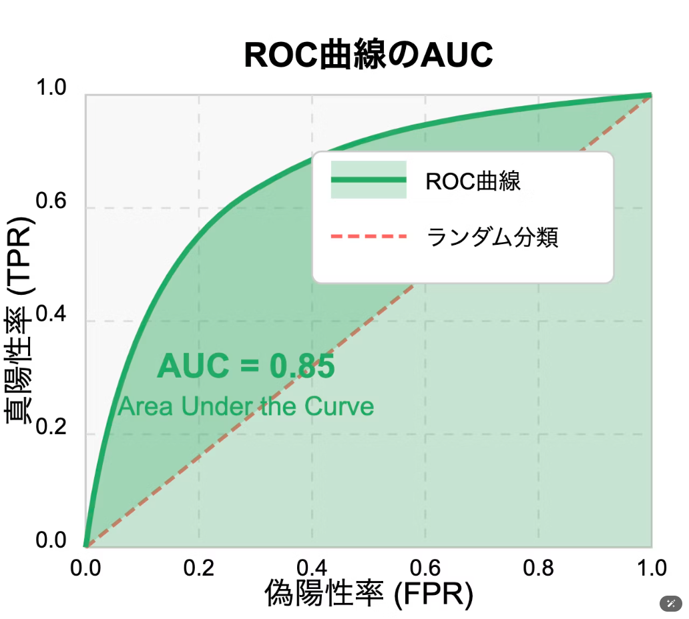

## 什么是数据正则化？
数据正则化（Data Regularization） 是机器学习中一种用于防止模型过拟合（Overfitting）的技术。过拟合是指模型在训练数据上表现很好，但在测试数据或生产环境中的泛化能力较差。正则化通过对模型的复杂度施加约束，避免模型过于依赖训练数据中的噪声或细节，从而提升模型的泛化能力。

### 为什么需要正则化？
---
模型过拟合的风险

过于复杂的模型（如高次多项式、深度神经网络）容易完美地拟合训练数据，但却无法很好地适应新数据。这会导致模型在测试数据上的误差增大，即泛化性能下降。

---
数据噪声的影响

训练数据中往往存在噪声或异常值，模型可能会过度学习这些噪声，从而影响预测效果。

---
模型复杂度与性能的权衡

简单模型可能欠拟合（Underfitting），复杂模型可能过拟合，正则化的目标是找到一个适当的平衡点。

### 正则化的主要方法

---
L1 正则化（Lasso Regularization）

特点：倾向于将一些权重缩小到 0，从而实现特征选择（Feature Selection）。

---
L2 正则化（Ridge Regularization）

特点：将权重的值缩小，但不会完全归零，更适合处理多共线性问题。

---
弹性网络（Elastic Net）

结合了 L1 和 L2 正则化的优点

---
Dropout 正则化

在深度学习中，随机丢弃一部分神经元及其连接，防止模型过度依赖某些特定神经元。

---
早停（Early Stopping）

在训练过程中监控验证集的误差，当验证集误差开始增加时停止训练。

---
数据正则化

通过数据预处理（如归一化、标准化）减少特征的量纲差异，降低模型复杂度。

### 生活中的实例类比
类比：健身与营养搭配

背景：一个人为了保持健康，既要锻炼身体，也要合理饮食。
类比解释：

如果一个人每天只吃高热量的食物而不运动，就可能导致肥胖（类似于模型过拟合，过度依赖某些特定特征）。  
正则化就像制定一个健康的饮食和运动计划，确保营养摄入均衡，同时避免体重增长过快。  
正则化的作用：通过平衡不同特征的权重，避免模型过度依赖某些特定特征。

### 正则化的实际意义

---
提升泛化性能

正则化能有效减少模型对训练数据噪声的依赖，提高模型在测试数据上的表现。

---
防止过拟合

正则化通过限制模型复杂度，避免模型过度拟合训练数据。

---
特征选择

L1 正则化能将不重要的特征权重缩小到 0，从而实现特征选择。

---
提高模型稳定性

正则化能让模型在面对动态数据分布时更加稳健。

### 总结
正则化是机器学习中防止过拟合的关键技术，能够提升模型的泛化能力。通过生活中的类比（如考试备考、装修预算、健身计划等），我们可以更直观地理解正则化的作用：它通过对模型复杂度施加约束，帮助模型专注于学习数据的核心模式，而不是无意义的细节或噪声。这种平衡能力是构建高效、稳定的机器学习模型的基础。

## One-Hot编码（One-Hot Encoding）
One-Hot编码是一种将类别型数据转换为数值型数据的方法，常用于机器学习和深度学习中。它将每个类别转换为一个二进制向量，其中只有一个元素为 1，其余元素为 0。这种编码方式有助于模型理解类别之间的关系，避免了类别之间的顺序或数值大小的影响。

在机器学习中，特征工程是提升模型性能的重要步骤之一。当我们处理**类别型数据（Categorical Data）**时，通常需要将其转换为模型可以理解的数值形式，因为大多数机器学习算法（如线性回归、支持向量机等）无法直接处理非数值型数据。

## ROC and AUC

这道题目考察的是**机器学习中的偏差-方差权衡（Bias-Variance Tradeoff）**，以及它在模型性能优化中的作用。以下是对题目选项的详细解析及中文解释：

---

## 偏差-方差
在机器学习中，模型的预测误差可以分为三部分：
1. **偏差（Bias）（バイアス）**：
   - 偏差是指模型假设与真实数据分布之间的误差。
   - 高偏差通常意味着模型过于简单，无法捕捉数据的复杂模式，导致**欠拟合（Underfitting）**。

2. **方差（Variance）（バリアンス）**：
   - 方差是指模型对训练数据的敏感程度。
   - 高方差意味着模型过于复杂，过度拟合了训练数据中的噪声，导致**过拟合（Overfitting）**。

3. **噪声（Noise）**：
   - 噪声是数据中不可预测的随机误差，与模型无关。

偏差和方差之间存在权衡关系：
- 增加模型复杂度可以降低偏差，但可能会增加方差。
- 简化模型可以降低方差，但可能会增加偏差。

因此，目标是找到一个最佳的平衡点，使模型在训练数据上的表现和在测试数据上的**泛化能力**达到最佳。

---
* **高偏差**对应的是**简单模型**，容易忽略重要的模式，导致欠拟合。
* **高方差**对应的是**复杂模型**，容易过拟合数据中的噪声。

---
* **高偏差**导致的是**欠拟合（Underfitting）**，因为模型过于简单，无法捕捉数据的复杂模式。
* **高方差**导致的是**过拟合（Overfitting）**，因为模型过于复杂，过度拟合训练数据中的噪声。

## 学习率
### **什么是学习率（Learning Rate）？**

学习率（Learning Rate）是机器学习和深度学习模型训练中一个非常重要的超参数，它决定了模型在每次迭代中更新参数（如权重和偏置）时的步伐大小。简单来说，学习率控制了模型“学习”的速度。

---

### **学习率的作用**
学习率的大小直接影响模型的训练过程和最终效果：
1. **学习率过大**：
   - 模型每次更新的步伐太大，可能跳过最佳解（最优点），导致训练不稳定甚至发散。
2. **学习率过小**：
   - 模型每次更新的步伐太小，训练过程会非常慢，可能需要很长时间才能接近最佳解，甚至陷入局部最优解。

---

### **生活中的类比：爬山找山顶**
可以将学习率类比为“爬山时的步伐大小”，目标是找到山顶（最优解）：

1. **学习率过大：步伐太大**
   - 假设你要爬一座山，步伐太大时，每次迈步可能会直接从山的一侧跳到另一侧，甚至跳出山的范围。这样不仅找不到山顶，还可能导致你迷失方向（训练发散）。
   
   **例子**：
   - 你想走到房间的门口，但每次迈步都超过了门的位置，结果不断来回穿过门，却始终无法停在门口。

2. **学习率过小：步伐太小**
   - 如果你的步伐太小，每次只能向前移动一点点，即使方向是正确的，也需要很长时间才能到达山顶（最优解）。有时甚至可能因为太慢而卡在某个位置（局部最优解），错过真正的山顶。

   **例子**：
   - 你想从家走到超市，但每次只迈一小步，虽然方向对了，但可能需要几个小时才能到达。

---

### **学习率调整的重要性**
在实际的机器学习训练中，选择合适的学习率非常关键。如果学习率设置不当，会导致以下问题：
- 学习率太大：模型无法收敛，训练失败。
- 学习率太小：训练效率低下，浪费时间和资源。

---

### **总结**
学习率是模型训练中至关重要的参数，它像“步伐大小”一样，决定了训练的速度和稳定性。合理选择学习率，或者设计动态学习率调整策略，可以帮助模型更快、更稳定地找到最佳解。

## 批量大小（Batch Size）
**批量大小（Batch Size）**是指在训练模型时，每次迭代所使用的样本数量。
### 批量大小的类型
1. **全批量梯度下降（Batch Gradient Descent）**
   - **描述**：每次更新模型参数时使用整个训练数据集。
   - **优点**：收敛稳定，适合小数据集。
   - **缺点**：计算开销大，内存需求高。

2. **小批量梯度下降（Mini-batch Gradient Descent）**
   - **描述**：每次使用一部分数据（小批量）进行参数更新。
   - **优点**：结合了全批量和随机梯度下降的优点，计算效率高，收敛较稳定。
   - **缺点**：需要选择合适的批量大小。

3. **随机梯度下降（Stochastic Gradient Descent, SGD）**
   - **描述**：每次使用一个样本进行参数更新。
   - **优点**：计算速度快，适合大数据集。
   - **缺点**：收敛不稳定，可能导致震荡。

### 批量大小的影响
- **训练速度**：较小的批量大小通常会增加训练时间，因为需要更多的迭代次数，但每次迭代计算量较小。
- **模型性能**：合适的批量大小可以帮助模型更好地泛化，避免过拟合或欠拟合。
- **硬件限制**：批量大小受限于GPU或CPU的内存容量，过大可能导致内存溢出。

## 迷你批量
### **迷你批量梯度下降**
- 在深度学习中，模型训练通常使用**迷你批量梯度下降法（Mini-batch Gradient Descent）**。
- 每次迭代中，模型会使用一个小批量的训练样本来计算梯度并更新参数。
- 迷你批量大小（Batch Size）是一个重要的超参数，决定了每次迭代中使用的样本数量。

### **迷你批量大小的影响**
1. **小批量（Batch Size 较小）**：
   - 优点：更新频率更高，模型训练更加灵活，可能更容易跳出局部最优解。
   - 缺点：计算效率低，梯度更新波动较大。
2. **大批量（Batch Size 较大）**：
   - 优点：计算效率高，梯度更新更加稳定。
   - 缺点：可能导致模型泛化能力下降，内存消耗增加。

### **迷你批量大小过大可能带来的问题**
- **泛化能力下降**：过大的批量会导致模型的梯度更新过于平滑，难以捕捉到训练数据中的细微变化，从而降低模型的泛化能力。
- **内存不足**：批量大小过大会占用大量内存（尤其是 GPU 内存），可能导致训练无法进行。
- **训练效率**：虽然大批量训练每次迭代的计算效率更高，但更新频率降低，可能导致模型的收敛速度变慢。

## 精度 和 再现率
### **精度（Accuracy）和再现率（Recall）介绍**

在机器学习模型的评估中，**精度（Accuracy）**和**再现率（Recall）**是两个常用的性能指标。它们都基于**混同行列（Confusion Matrix）**，但侧重点不同，适用于不同的场景。以下是对这两个指标的详细介绍。

---

### **1. 混同行列（Confusion Matrix）**

混同行列用于表示分类模型的预测结果与真实值的比较，通常由以下四个部分组成：

|                | **预测为正例**      | **预测为负例**      |
| -------------- | ------------------- | ------------------- |
| **真实为正例** | True Positive (TP)  | False Negative (FN) |
| **真实为负例** | False Positive (FP) | True Negative (TN)  |

- **True Positive (TP)**：模型正确预测为正例的数量。
- **True Negative (TN)**：模型正确预测为负例的数量。
- **False Positive (FP)**：模型错误地将负例预测为正例的数量（假阳性）。
- **False Negative (FN)**：模型错误地将正例预测为负例的数量（假阴性）。

---

### **2. 精度（Accuracy）**

#### **定义**
精度是衡量模型整体正确率的指标，表示模型所有预测中有多少是正确的。其公式为：
\[
\text{Accuracy} = \frac{\text{TP} + \text{TN}}{\text{TP} + \text{TN} + \text{FP} + \text{FN}}
\]

#### **解释**
- 精度关注的是模型在所有样本上的整体表现。
- 如果模型的预测结果中，绝大多数都正确，那么精度会很高。

#### **优点**
- 简单直观，适用于类别分布均衡的场景（即正例和负例的数量相近）。

#### **缺点**
- 当类别分布不均衡时，精度可能会掩盖模型的真实表现。例如：
  - 如果正例占99%，模型只需始终预测为正例，就能达到99%的精度，但完全忽略了负例的预测能力。

#### **适用场景**
- 类别分布均衡，且正例和负例的错误预测同等重要时。

---

### **3. 再现率（Recall）**

#### **定义**
再现率是衡量模型捕捉正例的能力，表示在所有真实正例中，模型正确预测出的比例。其公式为：
\[
\text{Recall} = \frac{\text{TP}}{\text{TP} + \text{FN}}
\]

#### **解释**
- 再现率关注的是模型对正例的覆盖率。
- 再现率高，意味着模型漏掉的正例（False Negative, FN）少。

#### **优点**
- 对于正例的遗漏（False Negative, FN）敏感，适用于正例的遗漏会造成严重后果的场景。

#### **缺点**
- 再现率的提升可能会导致假阳性（False Positive, FP）增加，从而降低模型的精确率（Precision）。

#### **适用场景**
- 正例的遗漏不可接受的场景，例如：
  1. **医疗诊断**：漏诊一个病人可能危及生命。
  2. **欺诈检测**：漏掉欺诈行为可能造成经济损失。
  3. **安全威胁检测**：漏掉安全威胁可能导致严重后果。

---

### **4. 精度与再现率的比较**

| 指标       | **公式**                                          | **关注点**   | **适用场景**                                         |
| ---------- | ------------------------------------------------- | ------------ | ---------------------------------------------------- |
| **精度**   | \(\frac{\text{TP} + \text{TN}}{\text{总样本数}}\) | 整体正确率   | 类别分布均衡，正负例的错误预测同等重要               |
| **再现率** | \(\frac{\text{TP}}{\text{TP} + \text{FN}}\)       | 正例的覆盖率 | 正例的遗漏会导致严重后果的场景（如医疗、欺诈检测等） |

---

### **5. 示例分析**

#### **场景 1：医疗诊断**
- **问题**：在癌症检测中，漏诊一个癌症患者（False Negative, FN）可能导致病情恶化甚至死亡。
- **优先指标**：再现率（Recall）。
- **原因**：确保尽可能多的癌症患者被检测出来，即使可能增加一些误诊（False Positive, FP）。

#### **场景 2：垃圾邮件检测**
- **问题**：错误地将正常邮件标记为垃圾邮件（False Positive, FP）可能会影响用户体验。
- **优先指标**：精确率（Precision）。
- **原因**：尽量减少误报，即使漏掉一些垃圾邮件（False Negative, FN）也可以接受。

#### **场景 3：图像分类**
- **问题**：在图像分类任务中，正负例的分布较为均衡，且错误分类的代价相同。
- **优先指标**：精度（Accuracy）。
- **原因**：整体正确率是最重要的。

---

### **6. 总结**

#### **精度（Accuracy）**
- **定义**：衡量模型整体预测的正确性。
- **关注点**：整体表现。
- **适用场景**：类别分布均衡，正负例错误代价相同时。

#### **再现率（Recall）**
- **定义**：衡量模型对正例的覆盖率。
- **关注点**：减少漏掉的正例（False Negative, FN）。
- **适用场景**：正例的遗漏会造成严重后果的场景（如医疗诊断、欺诈检测、安全威胁检测）。

在实际应用中，精度和再现率往往需要结合其他指标（如F1分数）来综合评估模型的性能。

### 表格
以下是基于 **混同行列（Confusion Matrix）** 的各项指标及其计算公式的总结：

| **考点 (中文)** | **考点 (日文)**                | **考点 (英文)**           | **描述**                                                                   | **计算式（基于混同行列）**                                           |
| --------------- | ------------------------------ | ------------------------- | -------------------------------------------------------------------------- | -------------------------------------------------------------------- |
| **精度**        | 精度 (Accuracy)                | Accuracy                  | 衡量模型预测正确的样本占总样本的比例，反映整体预测的正确性。               | \[Accuracy = \frac{TP + TN}{TP + TN + FP + FN}\]                     |
| **再现率**      | 再現率 (Recall)                | Recall (Sensitivity)      | 衡量模型正确预测出的正样本占真实正样本的比例，评估对正样本的识别能力。     | \[Recall = \frac{TP}{TP + FN}\]                                      |
| **适合率**      | 適合率 (Precision)             | Precision                 | 衡量模型正确预测出的正样本占所有预测为正样本的比例，评估预测结果的准确性。 | \[Precision = \frac{TP}{TP + FP}\]                                   |
| **特异性**      | 特異度 (Specificity)           | Specificity               | 衡量模型正确预测出的负样本占真实负样本的比例，评估对负样本的识别能力。     | \[Specificity = \frac{TN}{TN + FP}\]                                 |
| **F1 分数**     | F1スコア (F1 Score)            | F1 Score                  | 再现率和适合率的调和平均值，用于平衡模型对正样本的识别能力和预测准确性。   | \[F1 = 2 \times \frac{Precision \times Recall}{Precision + Recall}\] |
| **假阳率**      | 偽陽性率 (False Positive Rate) | False Positive Rate (FPR) | 衡量模型错误预测为正样本的负样本占真实负样本的比例。                       | \[FPR = \frac{FP}{FP + TN}\]                                         |
| **假阴率**      | 偽陰性率 (False Negative Rate) | False Negative Rate (FNR) | 衡量模型错误预测为负样本的正样本占真实正样本的比例。                       | \[FNR = \frac{FN}{TP + FN}\]                                         |

## 相关矩阵（Correlation Matrix）相関行列
相关矩阵（Correlation Matrix）是用来衡量多个变量之间相关性的工具，通常用于统计分析或特征选择。它显示的是变量之间的线性相关性（如 Pearson 相关系数）。

## TF-IDF（Term Frequency-Inverse Document Frequency）
### **什么是TF-IDF？**

**TF-IDF（Term Frequency-Inverse Document Frequency）**是一种用于评估文本中单词重要性的统计方法，广泛应用于**信息检索**、**文本挖掘**和**自然语言处理（NLP）**领域。它的主要目标是衡量某个单词在一篇文档中的重要性，同时结合该单词在整个文档集合中的出现情况。

---

### **TF-IDF的原理**

TF-IDF通过两个部分的计算来确定单词的重要性：**词频（TF）**和**逆文档频率（IDF）**。

#### **1. 词频（TF, Term Frequency）**
- **定义**：单词在某篇文档中出现的频率，用于衡量该单词在当前文档中的重要性。
- **公式**：
  \[
  TF = \frac{\text{单词在文档中出现的次数}}{\text{文档中的总单词数}}
  \]
- **解释**：
  - 如果某个单词在一篇文档中频繁出现，那么它可能是该文档的重要特征词。
  - 但仅使用词频会导致某些常见单词（如“the”、“is”）被赋予过高的权重，因此需要结合IDF来修正。

#### **2. 逆文档频率（IDF, Inverse Document Frequency）**
- **定义**：衡量单词在整个文档集合中的稀有程度。
- **公式**：
  \[
  IDF = \log\left(\frac{\text{文档总数}}{\text{包含该单词的文档数} + 1}\right)
  \]
- **解释**：
  - 如果一个单词在许多文档中都出现（如“the”、“and”），其区分能力较低，IDF值会很小。
  - 如果一个单词只在少数文档中出现（如专业术语），其区分能力较强，IDF值会较大。

#### **3. TF-IDF的计算**
- **公式**：
  \[
  TF\text{-}IDF = TF \times IDF
  \]
- **解释**：
  - TF反映单词在当前文档中的出现频率；
  - IDF降低那些在整个文档集合中普遍出现的单词的权重；
  - TF-IDF综合两者，突出那些在某篇文档中频繁出现，但在其他文档中较少出现的单词。

## 代理人（エージェント）（Agent）
### **人工智能领域中的エージェント**
在人工智能（AI）中，エージェント通常指的是**一种能够感知环境、决策并采取行动的智能系统**。它可以是一个软件程序、一个机器人，甚至是一个虚拟助手。

#### **特点**
1. **自主性（Autonomy）**：
   - 能够独立运行，无需人类干预。
2. **感知能力（Perception）**：
   - 能够感知外部环境（通过传感器或输入数据）。
3. **决策能力（Decision-Making）**：
   - 根据感知到的信息，制定适当的策略或行动。
4. **行动能力（Action）**：
   - 执行特定任务或行为。

#### **分类**
- **简单エージェント**：
  - 只执行预定义的任务，例如温控器根据温度变化调整空调。
- **智能エージェント**：
  - 具备学习能力，可以根据环境变化优化行为，例如聊天机器人、推荐系统。
- **多エージェント系统（Multi-Agent System, MAS）**：
  - 由多个エージェント组成的系统，它们相互协作以完成复杂任务，例如无人机群体协作。

#### **应用场景**
1. **虚拟助手**：如Siri、Alexa，用于语音交互。
2. **自动驾驶**：车辆通过感知环境自主驾驶。
3. **推荐系统**：根据用户偏好推荐商品或内容。
4. **游戏AI**：在游戏中控制角色的行为。

## 几种学习模式
### **1. 自己监督学习（Self-Supervised Learning）**

#### **定义**
自己监督学习是一种介于监督学习和无监督学习之间的学习方法。它利用未标注数据，通过从数据本身生成伪标签（Pseudo-labels），在没有人工标注的情况下进行训练。

#### **特点**
1. **无需人工标注数据**：
   - 通过数据本身生成训练目标，例如预测数据的某部分（如下一词、遮盖的词）或数据的结构关系。
2. **常用于预训练**：
   - 自己监督学习通常用于构建通用模型（如语言模型、图像模型）的预训练阶段，随后通过微调适配特定任务。
3. **广泛应用于自然语言处理（NLP）和计算机视觉（CV）**：
   - NLP中典型例子：BERT、GPT（语言模型）。
   - CV中典型例子：SimCLR、MAE（图像模型）。

#### **优缺点**
- **优点**：
  - 不需要人工标注，适合大规模数据。
  - 可生成通用特征，适用于多种下游任务。
- **缺点**：
  - 生成的伪标签可能不够精确。
  - 需要大量计算资源，特别是在预训练阶段。

#### **应用场景**
- 自然语言处理（如语言模型预训练）。
- 计算机视觉（如图像特征提取）。
- 生物信息学（如蛋白质结构预测）。

---

### **2. 监督学习（Supervised Learning）**

#### **定义**
监督学习是一种通过使用标注数据（输入-输出对）来训练模型的方法，模型学习输入数据与目标输出之间的映射关系。

#### **特点**
1. **需要标注数据**：
   - 每个训练样本都包含输入特征和对应的目标输出（标签）。
2. **目标明确**：
   - 模型的目标是最小化预测结果与真实标签之间的误差。
3. **适用于分类和回归任务**：
   - 分类：预测离散类别（如垃圾邮件检测）。
   - 回归：预测连续值（如房价预测）。

#### **优缺点**
- **优点**：
  - 精确性高，适用于目标明确的任务。
  - 训练过程清晰，易于解释。
- **缺点**：
  - 依赖高质量的标注数据，数据标注成本高。
  - 模型可能过拟合（特别是在数据不足时）。

#### **应用场景**
- 图像分类（如手写数字识别）。
- 语音识别（如语音转文本）。
- 推荐系统（如个性化推荐）。

---

### **3. 无监督学习（Unsupervised Learning）**

#### **定义**
无监督学习是一种无需标注数据的学习方法，模型通过分析数据的内在结构（如模式、分布）来发现隐藏的特征或规律。

#### **特点**
1. **无需目标输出**：
   - 数据中没有标签，模型通过数据本身的特性进行学习。
2. **目标是发现数据结构**：
   - 如数据的聚类、降维、异常检测等。
3. **适用于探索性分析**：
   - 例如发现数据中的潜在分组或模式。

#### **优缺点**
- **优点**：
  - 无需标注数据，适合大规模数据。
  - 可用于数据探索和结构分析。
- **缺点**：
  - 无法直接解决明确的预测问题。
  - 结果解释性较差，难以评估模型性能。

#### **应用场景**
- 聚类分析（如用户分群）。
- 降维（如PCA，用于数据可视化）。
- 异常检测（如信用卡欺诈检测）。

---

### **4. 强化学习（Reinforcement Learning）**

#### **定义**
强化学习是一种通过与环境交互、基于奖励和惩罚机制来优化行为策略的学习方法。

#### **特点**
1. **基于试错学习**：
   - 模型通过不断尝试不同的动作，从环境中获得反馈（奖励或惩罚），从而优化策略。
2. **学习目标是最大化累计奖励**：
   - 模型的目标是找到一套策略，使得在长期内获得的总奖励最大。
3. **适用于动态决策问题**：
   - 如游戏AI、机器人控制等。

#### **优缺点**
- **优点**：
  - 适合动态、连续决策场景。
  - 能够处理复杂的非线性问题。
- **缺点**：
  - 训练过程需要大量交互，计算资源消耗大。
  - 收敛速度慢，可能陷入次优解。

#### **应用场景**
- 游戏AI（如AlphaGo）。
- 自动驾驶（如车辆路径规划）。
- 机器人控制（如机械臂操作）。

---

### **对比总结**

| **学习方法** | **定义**                             | **数据依赖** | **目标**                           | **优点**                         | **缺点**                         | **应用场景**                    |
| ------------ | ------------------------------------ | ------------ | ---------------------------------- | -------------------------------- | -------------------------------- | ------------------------------- |
| 自己监督学习 | 从数据本身生成伪标签进行训练         | 未标注数据   | 生成通用特征，用于多任务适配       | 无需标注，适合大规模数据         | 伪标签可能不精确，计算资源需求高 | NLP预训练（BERT），图像特征提取 |
| 监督学习     | 使用标注数据学习输入与输出的映射关系 | 标注数据     | 最小化预测误差，完成分类或回归任务 | 精确性高，目标明确               | 标注成本高，易过拟合             | 图像分类、语音识别、推荐系统    |
| 无监督学习   | 分析数据内在结构，无需标注数据       | 未标注数据   | 发现数据模式或结构                 | 无需标注，适合探索性分析         | 结果解释性差，无法直接预测目标   | 聚类分析、降维、异常检测        |
| 强化学习     | 基于奖励和惩罚机制优化行为策略       | 环境交互数据 | 最大化长期累计奖励                 | 适合动态决策场景，能处理复杂问题 | 训练成本高，可能陷入次优解       | 游戏AI、自动驾驶、机器人控制    |

---

### **总结**
- **自己监督学习**：适用于预训练大规模模型，重点在于生成通用特征。
- **监督学习**：适用于有明确目标的任务，需要高质量标注数据。
- **无监督学习**：适用于探索性任务，发现数据的潜在结构。
- **强化学习**：适用于动态交互和连续决策场景，通过试错学习优化策略。

不同的学习方法适用于不同的任务，选择时需根据数据特点和业务需求进行权衡。

## 数据治理
数据治理是指对数据进行有效管理和控制的框架和实践，以确保数据的质量、安全性和合规性。

## Q-Learning
Q-Learning 是一种基于强化学习的算法，用于解决具有离散状态和动作空间的决策问题。它通过不断地与环境交互，学习一个称为 Q值函数 的策略，从而帮助智能体在长期内获得最大化的奖励。

## 意图设置
意图设置（Intent Setting） 是自然语言处理（NLP）和对话系统（如聊天机器人、语音助手）中的一个关键概念。它主要用于理解用户输入的目的或意图，从而触发相应的操作或响应。在构建基于语言模型的系统时，意图设置是确保模型能够准确理解和响应用户需求的重要步骤。

## Intelligent Prompt Routing（インテリジェントプロンプトルーティング）
智能提示路由（Intelligent Prompt Routing）是一种基于提示（Prompt）的动态路由技术，用于在多个基础模型之间智能分配请求。它能够预测不同模型对特定请求的响应质量，并将请求路由到最适合处理该请求的模型，从而优化响应效果并降低成本。

## 特征工程
特征工程（Feature Engineering）是机器学习中非常重要的一步，指的是从原始数据中提取、转换和创建对模型训练有用的特征，以提升模型的性能和预测能力。简单来说，特征工程的目标是将原始数据转化为更能帮助模型“理解”的形式。

## 部分依存图（Partial Dependence Plots，PDPs） 部分依存プロット（PDPs）
部分依存图（Partial Dependence Plots，简称 PDPs）是一种可视化技术，用于解释机器学习模型中某个或某些特定特征对模型预测结果的影响。PDP 能够帮助我们理解模型的行为，尤其是在复杂的非线性模型（如随机森林、梯度提升树）中，它是解释性机器学习的重要工具之一。

## BERT（双向编码器表示的变换模型）
BERT（Bidirectional Encoder Representations from Transformers）是由Google提出的一种用于**自然语言处理（NLP）的预训练模型**。它在多个NLP任务中取得了显著的效果提升。BERT 是一种预训练的双向语言模型，能够理解上下文并进行文本补全。它的双向特性使其能够根据上下文预测缺失的单词或短语，非常适合处理需要补全缺失文本的任务。

## BERTScore BERTスコア
BERTScore 是一种基于深度学习模型 BERT（Bidirectional Encoder Representations from Transformers）的**文本评估指标**，主要应用于自然语言处理（NLP）任务中，用于 **评估生成文本与参考文本之间的语义相似性**。与传统的基于词匹配的评估方法（如 BLEU、ROUGE 等）不同，BERTScore 利用 BERT 的上下文嵌入（contextual embeddings）来捕捉文本的深层语义信息，从而更精确地衡量文本之间的语义相似性。

## ROUGE （Recall-Oriented Understudy for Gisting Evaluation）以回忆为导向的概要评估研究
ROUGE（Recall-Oriented Understudy for Gisting Evaluation）是一组专门用于评估自动文本摘要和生成文本质量的指标，主要通过 **比较生成文本与参考文本之间的词或短语的重叠程度** 来衡量生成文本的质量。ROUGE 指标广泛用于自然语言处理（NLP）领域，尤其是在文本摘要、机器翻译和文本生成任务中。

## BLEU（Bilingual Evaluation Understudy, 双语评估替补）
BLEU 是一种用于评估机器翻译质量的指标，主要通过 **计算生成翻译与参考翻译在词汇和短语上的重叠程度来衡量翻译的准确性**。它是机器翻译领域最早且最广泛使用的自动化评价指标之一。

## Real World Knowledge Score（RWK Score）
Real World Knowledge Score（RWK Score）是一个用于衡量模型在现实世界知识表现的指标。它主要评估模型是否能够有效地捕捉和编码与现实世界相关的事实性知识。具体来说，RWK Score越高，表明模型在相关领域内的表现越准确，意味着该模型能够更好地理解和处理实际情境中的信息。

## RMSE（Root Mean Square Error，均方根误差）
RMSE 是一种常用的误差评估指标，主要用于 **衡量预测值（模型输出）与真实值（观测值）之间的差距**。它通过计算预测误差的平方平均值再开平方，得出一个可以直接反映误差大小的数值。

## ARIMA（Auto-Regressive Integrated Moving Average, 自回归积分滑动平均模型）
ARIMA 是一种经典的 **时间序列分析和预测模型**，广泛应用于经济学、金融、气象、市场趋势等领域。它通过**结合自回归（AR）、差分（I）和移动平均（MA）**三种机制，能够对时间序列数据进行建模和预测。

## K-means 聚类算法
K-means 是一种经典的无监督学习算法，用于将数据划分为 K 个簇（clusters）。它通过最小化各数据点到其所属簇中心的距离平方和，来实现数据的聚类。K-means 广泛应用于数据挖掘、图像分割、客户分群等领域。

## WaveNet 音声認識と音声合成
WaveNet 是由 Google DeepMind 于 2016 年提出的一种生成模型，专门用于生成高质量的音频波形。它通过深度神经网络直接对音频波形进行建模，能够生成自然且逼真的语音、音乐以及其他音频信号。WaveNet 的问世在语音合成（TTS）和音频生成领域引发了巨大的技术突破。

## GPT（生成式预训练变换器）
GPT（生成式预训练变换器）是一种基于深度学习的自然语言处理（NLP）模型，由 OpenAI 开发。它通过生成式预训练和自回归结构，在文本生成、理解和处理方面表现出色，成为当前人工智能领域的核心技术之一。

## LDA（潜在狄利克雷分配，Latent Dirichlet Allocation）
LDA（Latent Dirichlet Allocation，潜在狄利克雷分配）是一种生成式概率模型，主要用于 **从非结构化文本数据中提取隐藏的主题**。它是一种常见的主题模型（Topic Model），被广泛应用于自然语言处理（NLP）领域，用于分析文档集合中的主题分布。

LDA 由 David Blei 等人在 2003 年提出，其核心思想是认为文档是由多个主题混合生成的，而每个主题又由一组单词组成。通过 LDA，可以自动发现文档中的潜在主题，并对文档进行主题建模和分类。

## 准确率，精确率，召回率，F1 分数
| **指标**    | **定义**                                   | **适用场景**                                             |
| ----------- | ------------------------------------------ | -------------------------------------------------------- |
| **准确率**  | 正确预测的样本占总样本的比例               | 样本类别均衡时，适合作为整体性能的评估指标               |
| **精确率**  | 预测为正类的样本中，实际为正类的比例       | 假正例（FP）代价较高时，如垃圾邮件检测、医疗诊断         |
| **召回率**  | 实际为正类的样本中，被正确预测为正类的比例 | 假负例（FN）代价较高时，如疾病筛查、安全系统             |
| **F1 分数** | 精确率和召回率的调和平均                   | 精确率和召回率同等重要时，尤其适用于类别不均衡的分类任务 |

## 相关矩阵
**相关矩阵**是一种矩阵表示方法，用于显示多个变量之间的两两相关性。它是统计学和数据分析中常用的工具，能够帮助我们快速了解变量之间的线性关系。

相关矩阵中的每个元素表示两个变量之间的相关系数（通常是皮尔逊相关系数），其值范围为 \[-1, 1\]：
- **1** 表示完全正相关（两个变量完全同步变化）。
- **0** 表示没有线性相关性。
- **-1** 表示完全负相关（一个变量增加时，另一个变量减少）。

## **温度（Temperature）**、**Top-k**、**Top-p** 和 **最大生成长度（Max Tokens）**
### **1. 温度（Temperature）**
#### **定义**
- 温度是一个控制生成文本**随机性**的参数。
- 它的取值范围通常在 \[0, 1\] 之间，但也可以大于 1。
- 数值越低，生成的文本越**确定性**；数值越高，生成的文本越**随机性**。

#### **工作原理**
- 温度会影响模型对概率分布的采样：
  - 当温度较低时，模型倾向于选择概率最高的词（更确定）。
  - 当温度较高时，模型会更倾向于探索概率较低的词（更随机）。

---

### **2. Top-k 采样**
#### **定义**
- Top-k 是一种限制采样范围的方法，它控制模型在生成下一个词时，只从**概率最高的 k 个词**中进行选择。
- 这里的 **k** 是一个整数，表示候选词的数量。

#### **工作原理**
- 模型会对所有候选词按概率排序，并只保留前 **k 个词**，然后从中随机采样。
- **k 的大小**决定了生成结果的多样性：
  - 较小的 k：生成结果更集中于高概率词（更确定）。
  - 较大的 k：生成结果更随机。

---

### **3. Top-p 采样（Nucleus Sampling）**
#### **定义**
- Top-p 是另一种限制采样范围的方法，它根据候选词的累计概率来决定采样范围。
- **p** 是一个介于 \[0, 1\] 的阈值，表示累计概率的总和。

#### **工作原理**
- 模型会从所有候选词中按概率排序，并从中选择累计概率达到 **p** 的最小集合（通常称为“核”）。
- 然后，模型只从这个集合中随机采样。

---

### **4. 最大生成长度（Max Tokens）**
#### **定义**
- 最大生成长度限制了模型生成的**最大词（Token）数量**。
- 一个 Token 可以是一个单词、子词或字符（具体取决于模型的分词方式）。

#### **工作原理**
- 模型在生成结果时，最多生成 **Max Tokens** 个词，超过限制时会强制停止。
- 这个参数主要用于控制生成结果的篇幅。

---

### **总结对比**

| 参数             | 定义                   | 控制目标               | 适用场景           |
| ---------------- | ---------------------- | ---------------------- | ------------------ |
| **温度**         | 控制生成的随机性       | 确定性 vs 随机性       | 创意 vs 精确任务   |
| **Top-k**        | 限制候选词的数量       | 高概率词 vs 更多选择   | 确定性 vs 多样性   |
| **Top-p**        | 限制候选词的累计概率   | 动态范围采样 vs 灵活性 | 灵活性 vs 输出质量 |
| **最大生成长度** | 限制生成文本的最大长度 | 控制篇幅               | 短文 vs 长文生成   |

---

## 基准数据集 ベンチマークデータセット benchmark
基准数据集是用于评估和比较机器学习（ML）模型性能的标准化数据集合。

## epoch（训练轮数）（エポック）
在机器学习中，epoch（训练轮数）是指对整个训练数据集进行一次完整的学习过程。

## プロンプトの構成要素

## Moderation API モデレーションAPI 
モデレーションAPI是用于自动检测和管理不当内容的工具，广泛应用于多个平台。

## 梯度
可以通过一个生活中的例子来类比梯度的概念：

### 山坡与梯度
想象你站在一个雾气弥漫的山坡上，目标是找到山谷的最低点。由于雾气很浓，你看不到远处，只能通过脚下的坡度来判断方向。

1. **梯度的方向**
   - 梯度就像坡度的方向。如果你想快速下山，就要沿着坡度最陡的方向走。这个方向就是梯度的方向。

2. **梯度的大小**
   - 梯度的大小表示坡度的陡峭程度。坡度越陡，梯度越大，意味着你可以更快地向下移动。

3. **梯度下降**
   - 每次你走一小步，沿着梯度的方向前进，就像在进行梯度下降。你会逐渐接近山谷的最低点。

4. **调整步伐**
   - 走得太快（步长太大）可能会错过最低点；走得太慢（步长太小）可能会让你花费太多时间。因此，选择合适的步伐很重要，这类似于选择合适的学习率。

通过这个例子，梯度可以被理解为一种指引方向和速度的工具，帮助我们在复杂的地形中找到最优路径。

## 回归分析（Regression Analysis） 回帰分析
回归分析（Regression Analysis）是一种统计方法，用于研究变量之间的关系，尤其是一个或多个自变量（输入变量）与因变量（目标变量）之间的依赖关系。它是机器学习中监督学习的一个重要分支，主要用于预测连续型数据。

## 决定系数（R²）決定係数 R²
决定系数（R²）是统计学和数据分析中用于**评估回归模型性能的重要指标**。它反映了模型对数据的拟合程度，或者说模型解释因变量变化的能力。  
* R² = 1：模型完全拟合数据，预测值与实际值完全一致。
* R² = 0：模型的预测能力与简单使用均值预测的效果相同（即模型无法解释目标变量的变异）。
* R² < 0：模型的预测效果甚至比简单使用均值预测还差，通常表示模型不适合当前数据。

## 均方误差（Mean Squared Error, MSE）
衡量模型预测值与实际值之间差异的一种方法。它计算的是每个预测值与实际值之间的差的平方的平均值。  
均方误差（MSE） 是一种用于衡量模型预测值与实际值之间差异的指标，**广泛应用于回归分析中**。它通过计算预测误差的平方均值来评估模型的性能，误差越小，MSE 值越接近于零，模型的预测效果越好。

## 残差网络（ResNet, Residual Network）
残差网络（ResNet）通过引入残差连接解决了深度网络训练中的梯度消失和退化问题，使得训练非常深的网络成为可能。它的设计简单而高效，推动了深度学习的发展，在图像分类、目标检测、语义分割等任务中取得了卓越的表现。

## 检索增强生成（RAG, Retrieval-Augmented Generation）
检索增强生成（RAG）是一种结合信息检索和生成模型的技术，旨在提高生成式任务（如文本生成、问答系统）的性能。RAG 将传统的检索方法与现代生成模型相结合，使得生成的内容更加丰富和准确。

## Few-Shot Prompting フューショットプロンプティング
Few-Shot Prompting 的核心思想是在给大型语言模型的输入文本（Prompt）中，包含少量（"Few-Shot"）针对特定任务的输入-输出示例对。通过这些示例，模型能够理解你想要它完成的任务的模式、格式或要求，然后根据你最终提供的输入，生成符合该模式的输出。

### 总结表格
| **提示技术**   | **英文名称**               | **日文名称**                   | **定义**                                         | **特点**                                                       | **适用场景**                         |
| -------------- | -------------------------- | ------------------------------ | ------------------------------------------------ | -------------------------------------------------------------- | ------------------------------------ |
| **思考链提示** | Chain of Thought Prompting | 思考の連鎖プロンプティング     | 通过逐步推理引导模型解决复杂问题。               | 包含逻辑链条或多步推导过程，适合复杂推理任务。                 | 数学推理、逻辑分析等复杂任务         |
| **负面提示**   | Negative Prompting         | ネガティブプロンプティング     | 提供明确的约束，告诉模型哪些内容不应生成。       | 明确限制不需要的输出内容，常用于图像生成或避免误导性文本生成。 | 图像生成、避免生成不需要的内容       |
| **零样本提示** | Zero-shot Prompting        | ゼロショットプロンプティング   | 无需提供示例，直接通过任务描述引导模型生成结果。 | 无示例，完全依赖任务描述，适合简单任务。                       | 文本总结、翻译等简单任务             |
| **少样本提示** | Few-shot Prompting         | フューショットプロンプティング | 提供少量示例，帮助模型理解任务模式。             | 提供 1-5 个示例，适合复杂任务或需要特定格式的任务。            | 复杂任务（如代码生成、复杂文本处理） |

---

## TensorFlow
一个由 Google 开发的流行的开源机器学习框架，用于构建和训练各种机器学习模型。

## PyTorch
一个由 Facebook 开发的开源机器学习框架，以其灵活性和动态计算图而闻名。

## Hugging Face
Hugging Face 本身是一个公司和社区，以其在自然语言处理 (NLP) 领域的贡献而闻名，特别是其流行的 transformers 库和 Hugging Face Hub。

transformers 库： 提供了大量预训练的、最先进的模型（如 BERT, GPT-2/3, T5, LLaMA 等），以及用于处理文本、音频、图像等的工具。这个库支持 PyTorch、TensorFlow 和 JAX 等多种深度学习框架。  
Hugging Face Hub： 是一个集中的平台，用户可以发现、分享和使用模型、数据集、演示空间 (Spaces) 等资源。  
Hugging Face on AWS 指的是在 Amazon Web Services (AWS) 云平台上使用和部署 Hugging Face 的工具、库和模型。结合 Hugging Face 的强大模型和易用性，以及 AWS 的可扩展、高性能的基础设施和托管服务，可以更高效地进行机器学习的开发、训练和部署。

## CFG Scale
CFG Scale 是生成式 AI 模型（如扩散模型和 Stable Diffusion）中的一个重要超参数，全称为 Classifier-Free Guidance Scale，它用于控制生成模型对提示词（Prompt）的依赖程度，从而影响生成内容的特异性和质量。

### **CFG Scale 的作用**
1. **控制提示词的影响力**
   - CFG Scale 决定了模型在生成过程中对提示词的权重。
   - 较高的 CFG Scale 会让生成结果更加贴合提示词，生成的内容更符合用户的描述。
   - 较低的 CFG Scale 会让生成结果更加自由，生成的内容可能更具随机性，但与提示词的相关性较弱。

2. **平衡创意性与特异性**
   - **高 CFG Scale**：生成内容更精确，特异性（Specificity）更高，但可能导致生成结果缺乏创意或出现不自然的细节。
   - **低 CFG Scale**：生成结果更加多样化和自由，但可能偏离提示词的意图。

## **Top-K 和 Top-P 的主要区别**
### **1. Top-K 的概念**

- **定义**：Top-K 表示从所有候选词中，选择概率最高的前 K 个词作为采样范围。
- **特点**：
  - 固定数量：无论候选词的概率分布如何，总是选取固定的 K 个词。
  - 候选范围可能包含低概率的词（如果这些词恰好在前 K 名以内）。
  - 适合候选词概率分布较均匀的场景。

### **2. Top-P 的概念**

- **定义**：Top-P（又称 Nucleus Sampling）表示从候选词中，选择累计概率达到 P（如 0.9 或 0.95）的词集合进行采样。
- **特点**：
  - 动态范围：候选词的数量不固定，取决于概率分布。
  - 如果概率分布集中（头部概率高），候选词范围会很小；如果分布分散（尾部概率高），候选词范围会更大。
  - 更加灵活，适合候选词概率分布不均匀的场景。

---

### **两者的主要区别**

| **参数**     | **Top-K**                      | **Top-P**                                  |
| ------------ | ------------------------------ | ------------------------------------------ |
| **候选范围** | 固定数量（前 K 个）            | 动态范围（累计概率达到 P 的集合）          |
| **灵活性**   | 固定，可能包含低概率词         | 动态，自动排除低概率词                     |
| **适用场景** | 候选词概率分布均匀时效果较好   | 候选词概率分布不均匀时效果较好             |
| **采样结果** | 可能包含一些不太合理的低概率词 | 更倾向于高概率词，避免不合理的低概率词     |
| **控制力度** | 更直接，简单调整 K 值即可      | 更精细，适合需要动态调整候选范围的复杂场景 |

---

### **生活实例的类比**

#### **Top-K 类比：固定数量的选择**
- **场景**：你去餐厅点菜，菜单上有 100 道菜，你只考虑最受欢迎的前 K 道菜（如前 5 名）。
  - **特点**：
    - 无论这些菜的受欢迎程度差距有多大，你都只看前 5 名。
    - 如果第 5 名的菜受欢迎程度远低于第 1 名，你仍然会把它纳入考虑范围。
  - **现实中**：适合你只关注固定数量的热门选项，不关心它们的具体受欢迎程度。

#### **Top-P 类比：动态累计概率的选择**
- **场景**：你去餐厅点菜，菜单上有 100 道菜，你只考虑受欢迎程度加起来达到 90% 的菜。
  - **特点**：
    - 如果前几道菜的受欢迎程度很高（如前 3 道菜就占了 90% 的受欢迎程度），你只考虑这 3 道菜。
    - 如果受欢迎程度分布较均匀，你可能需要考虑更多的菜（如前 10 道菜才能累计到 90%）。
  - **现实中**：适合你更关注整体受欢迎程度，而不是固定数量的热门选项。

---

### **总结**

- **Top-K**：像是固定数量的选择，适合简单、直接的场景。
- **Top-P**：像是动态受欢迎程度的选择，适合更加灵活、复杂的场景。

通过这两种方法，你可以根据实际需求，在生成内容的 **多样性** 和 **确定性** 之间找到平衡。

## Chain-of-Thought (CoT) 思考連鎖プロンプト
Chain-of-Thought (CoT) 是一种用于生成式人工智能（如大规模语言模型，LLM）的高级提示（prompting）技术。它通过引导模型逐步推理和分解复杂问题，使生成的回答更加准确、逻辑性更强。

传统的提示方式通常让模型直接给出答案，而 Chain-of-Thought 通过鼓励模型逐步思考，像人类一样分解问题，逐步得出最终答案。这种方法特别适用于需要多步骤推理、逻辑分析或复杂决策的任务。

## 图像分类
| **考点 (中文)** | **考点 (日文)**                  | **考点 (英文)**              | **描述**                                                                     | **适用场景**                                                                     |
| --------------- | -------------------------------- | ---------------------------- | ---------------------------------------------------------------------------- | -------------------------------------------------------------------------------- |
| 语义分割        | セマンティックセグメンテーション | Semantic Segmentation        | 将图像中的每个像素分配到一个类别，不区分同类别的不同实例。                   | 需要对图像进行像素级别的类别标注时使用。                                         |
| 实例分割        | インスタンスセグメンテーション   | Instance Segmentation        | 不仅对图像中的每个像素进行分类，还区分同类别的不同实例。                     | 需要识别并区分同类别不同对象时使用。                                             |
| 全景分割        | パノプティックセグメンテーション | Panoptic Segmentation        | 结合语义分割和实例分割，将每个像素分配给一个类别，同时区分同类别的不同实例。 | 适用于需要全局理解图像（包括背景和前景）的任务，例如同时标记“人”、“车”和“背景”。 |
| 图像分类        | 画像分類                         | Image Classification         | 对整张图像进行分类，输出图像属于某个类别的概率。                             | 适用于简单的整体分类任务，例如判断一张图片是“猫”还是“狗”。                       |
| 目标检测        | オブジェクト検出                 | Object Detection             | 在图像中检测并标记出所有对象的边界框，识别出对象的类别。                     | 需要快速识别和定位图像中对象时使用。                                             |
| 特定实例的提取  | 特定インスタンスの抽出           | Specific Instance Extraction | 从图像中提取特定的实例，而不是所有实例。                                     | 需要聚焦于特定对象或实例时使用。                                                 |

---

## 超参数优化方法
| **方法（中文）** | **方法（英文）**      | **方法（日文）** | **描述**                                                                             | **生活实例类比**                                                                         |
| ---------------- | --------------------- | ---------------- | ------------------------------------------------------------------------------------ | ---------------------------------------------------------------------------------------- |
| 贝叶斯优化       | Bayesian Optimization | ベイズ最適化     | 基于概率模型（如高斯过程）预测参数空间中最优区域，平衡探索与利用，效率高。           | **寻找餐厅时**：先查看评分和评价，结合位置预测哪家餐厅可能最好，再去尝试，既高效又智能。 |
| 网格搜索         | Grid Search           | グリッド検索     | 穷举所有可能的参数组合，通过遍历找到最佳超参数配置，计算成本高，效率低。             | **寻找餐厅时**：把所有餐厅逐一尝试一遍，直到找到最喜欢的那家，耗时耗力。                 |
| 随机搜索         | Random Search         | ランダム検索     | 随机采样参数空间，通过尝试部分参数组合寻找最佳配置，比网格搜索更高效，但缺乏智能化。 | **寻找餐厅时**：随机选择几家餐厅去尝试，可能找到好的，但也可能错过最佳选择。             |
| 决策树           | Decision Tree         | 決定木           | 一种机器学习模型，用于分类或回归任务，不能用于超参数优化。                           | **做决策时**：根据明确的规则一步步判断，比如根据天气决定是否带伞。                       |

---

### **详细说明**
1. **贝叶斯优化**：  
   - 通过智能预测减少计算成本，是解决高维参数空间优化问题的首选方法。  
   - 类比生活中“有根据地选择”，比如结合评分和评价选择餐厅，而不是盲目尝试。

2. **网格搜索**：  
   - 适合小型参数空间的优化问题，但在参数空间较大时效率低下。  
   - 类比生活中“逐一尝试所有可能性”，虽然最终能找到答案，但非常耗时。

3. **随机搜索**：  
   - 比网格搜索更高效，但可能错过最佳解。  
   - 类比生活中“随机尝试”，虽然快，但可能错过一些好选择。

4. **决策树**：  
   - 它本身是一个机器学习模型，不是用来优化超参数的工具。  
   - 类比生活中“按规则决策”，比如根据天气决定是否带伞，但这与优化无关。

---

## 表格
| **方法（中文）** | **方法（英文）**        | **方法（日文）**                | **描述**                                                         | **适用场景**                                 | **生活实例类比**                                                 |
| ---------------- | ----------------------- | ------------------------------- | ---------------------------------------------------------------- | -------------------------------------------- | ---------------------------------------------------------------- |
| 随机切割森林     | Random Cut Forest (RCF) | ランダムカットフォレスト（RCF） | 专为异常检测设计的无监督学习算法，适合时间序列和高维数据。       | 异常检测（如金融欺诈检测、设备故障检测等）。 | **如同在一片森林中识别出突然出现的奇怪树木，快速发现异常情况。** |
| 序列到序列       | Sequence to Sequence    | シーケンス・トゥ・シーケンス    | 用于处理序列数据的深度学习架构，常用于机器翻译或时间序列预测。   | 机器翻译、时间序列预测（如天气预测）。       | **如同将一段文字从一种语言翻译成另一种语言，保持信息的连贯性。** |
| WaveNet          | WaveNet                 | WaveNet                         | 用于生成高质量音频的深度学习模型，主要应用于语音合成和音频生成。 | 语音生成、音频合成。                         | **如同通过乐器演奏出逼真的音乐旋律，生成自然的声音。**           |
| MXNet            | MXNet                   | MXNet                           | 一种深度学习框架，用于构建和训练机器学习模型，本身不是算法。     | 构建各种机器学习模型（如分类、回归等）。     | **如同提供一个工具箱，可以用来搭建各种类型的机器学习模型。**     |
| BlazingText      | BlazingText             | ブレージングテキスト            | 高效的文本分类与词向量学习算法，支持 Word2vec。                  | 大规模文本数据处理及情感分析任务。           | 高速列车，快速且高效地运送乘客。                                 |
| Object2Vec       | Object2Vec              | オブジェクト2ベック             | 通用嵌入算法，用于多种对象的表示学习。                           | 嵌入学习任务。                               | 万能适配器，适用于多种设备连接。                                 |

---

## XGBoost
XGBoost 是一种机器学习算法，代表 eXtreme Gradient Boosting，即极端梯度提升。它是一种基于梯度提升框架的集成学习方法，主要用于分类和回归任务。

XGBoost 使用多个弱学习器（通常是决策树）进行建模，每个模型都试图修正前一个模型的误差。

## 表格
| **考点 (中文)**  | **考点 (日文)**                            | **考点 (英文)**                 | **描述**                                                                         | **适用场景**                                                                   |
| ---------------- | ------------------------------------------ | ------------------------------- | -------------------------------------------------------------------------------- | ------------------------------------------------------------------------------ |
| 词汇过滤的设置   | ワードフィルターの設定                     | Word Filter Setting             | 用于检测和屏蔽特定的词汇或短语，防止模型输出包含这些词汇的内容。                 | 需要直接屏蔽特定冒犯性词汇的场景，例如防止输出不当语言。                       |
| 拒绝主题的设置   | 拒否トピックの設定                         | Rejected Topics Setting         | 用于限制模型生成与某些特定主题相关的内容，而不是具体的词汇。                     | 需要屏蔽与某些敏感主题（如暴力、仇恨言论等）相关内容的场景。                   |
| 内容过滤的设置   | コンテンツフィルターの設定                 | Content Filter Setting          | 用于检测和过滤生成内容中可能包含的有害、不适当或敏感的信息。                     | 需要对生成内容进行整体审查，防止输出包含冒犯性语言、暴力或其他不当内容的场景。 |
| 上下文校验的设置 | コンテキストグラウンディングチェックの設定 | Context Grounding Check Setting | 用于确保生成的内容与上下文或输入提示保持一致，防止生成与上下文无关或错误的信息。 | 需要校验生成内容是否符合上下文逻辑的场景，例如生成内容的准确性和一致性检查。   |

## AWS 如何支持您的其他向量数据库需求？
Amazon Web Services（AWS）提供许多其他服务来满足您的向量数据库需求，尤其是在您需要向量搜索其他地方（Amazon Aurora、Amazon S3、Amazon MemoryDB）的现有数据时：
* Amazon Aurora PostgreSQL-Compatible Edition 和 Amazon Relational Database Service（Amazon RDS）for PostgreSQL 支持 pgvector 扩展，用于将机器学习（ML）模型生成的嵌入内容存储在您的数据库中，并执行高效的相似性搜索。
* Amazon Neptune ML 是一项 Neptune 新功能。它采用的图形神经网络（GNN）是一种专为图形而构建的机器学习技术，能够通过使用图形数据，轻松、快速和更准确地进行预测。
* Amazon MemoryDB 的向量搜索支持存储数百万个向量，查询和更新响应时间为几毫秒，每秒数万次查询（QPS），召回率超过 99%。
* Amazon DocumentDB（兼容 MongoDB）支持向量搜索，通过这项新功能，您能够以毫秒级响应时间存储、索引和搜索数百万个向量。借助 Amazon DocumentDB 的向量搜索，您只需为机器学习应用程序设置、运行和扩展数据库。

## 表格
| **考点 (中文)** | **考点 (日文)** | **考点 (英文)** | **描述**                                                                     | **适用场景**                       |
| --------------- | --------------- | --------------- | ---------------------------------------------------------------------------- | ---------------------------------- |
| 文本化          | テキスト化      | Text Conversion | 将非文本数据（如语音、图像等）转换为文本形式。                               | 语音转文字、PDF 提取文本等。       |
| 分词            | トークン化      | Tokenization    | 将文本数据按单词、子词或句子级别进行分割，生成语言模型可以处理的基本单位。   | 语言模型处理文本的基础步骤。       |
| 向量化          | ベクトル化      | Vectorization   | 将文本转换为数值向量，通常通过嵌入技术实现，用于机器学习或深度学习模型输入。 | 模型训练或推理阶段的数值表示转换。 |
| 提示语          | プロンプト      | Prompt          | 与语言模型交互时输入的文本，用于引导模型生成特定的输出。                     | 设计输入文本以获得期望的生成结果。 |

## 表格
| **知识点（中文）** | **知识点（日文）**         | **知识点（英文）**         | **概要说明**                                                                             | **应用场景**                                                                                 |
| ------------------ | -------------------------- | -------------------------- | ---------------------------------------------------------------------------------------- | -------------------------------------------------------------------------------------------- |
| **提示工程**       | プロンプトエンジニアリング | Prompt Engineering         | 通过设计和优化提示（Prompt）来提高生成式AI模型的性能，是一种广义的提示优化技术。         | 适用于各种任务的提示优化，如提升模型对任务描述的理解能力，但不特指复杂推理任务的分阶段处理。 |
| **思维链提示**     | 思考の連鎖プロンプティング | Chain of Thought Prompting | 将复杂推理任务分解为多个步骤，逐步引导模型完成推理，从而提高推理的准确性和逻辑性。       | 适用于需要多步推理的任务，例如数学问题、逻辑推理、复杂决策等场景。                           |
| **少样本提示**     | Few-Shotプロンプティング   | Few-Shot Prompting         | 在提示中提供少量示例，帮助模型理解任务模式并生成符合预期的结果。                         | 适用于需要通过示例指导模型完成任务的场景，但不涉及多步推理或任务分解。                       |
| **零样本提示**     | Zero-Shotプロンプティング  | Zero-Shot Prompting        | 不提供任何示例，直接向模型提供任务描述，用于测试模型在没有示例指导情况下完成任务的能力。 | 适用于简单任务或测试模型的泛化能力，但不适合复杂推理任务的分阶段处理。                       |

## 表格
| **参数名称（中文）**            | **参数名称（日文）** | **功能说明**                                                                     | **适用场景**                           |
| ------------------------------- | -------------------- | -------------------------------------------------------------------------------- | -------------------------------------- |
| **惩罚（Penalty）**             | ペナルティ           | 控制生成内容的重复性，减少重复句子或词语，提升输出多样性。                       | 需要减少重复内容时使用。               |
| **温度（Temperature）**         | 温度                 | 控制生成内容的随机性。高温度值生成多样化内容，低温度值生成更保守和确定性的内容。 | 需要调整回答风格（随机或保守）时使用。 |
| **停止序列（Stop Sequence）**   | 停止シーケンス       | 指定生成内容的终止条件，让模型在生成到特定的词或短语时停止输出。                 | 需要明确结束对话或生成内容时使用。     |
| **响应长度（Response Length）** | レスポンスの長さ     | 控制生成内容的长度（字数或段落）。                                               | 需要限制回答长度（简短或详细）时使用。 |

---

## 生成对抗网络（GAN）介绍 敵対的生成ネットワーク（GAN）
**生成对抗网络（GAN）** 主要用于生成与真实数据相似的合成数据。GAN 在计算机视觉、图像生成、数据增强等领域有广泛应用。

### **基本原理**
GAN 由两个神经网络组成：生成器（Generator）和判别器（Discriminator）。这两个网络通过对抗过程进行训练：
1. **生成器（Generator）**：
   - 生成器接受随机噪声作为输入，并试图生成看似真实的数据。
   - 目标是欺骗判别器，使其认为生成的数据是真实的。
2. **判别器（Discriminator）**：
   - 判别器的任务是区分真实数据和生成器生成的数据。
   - 目标是尽可能准确地识别出假数据。

这两个网络通过一种零和博弈的方式进行训练：生成器不断改进以生成更逼真的数据，而判别器不断提高以更好地区分真假数据。

---

## 卷积神经网络（Convolutional Neural Network, CNN）
* [卷积神经网络](https://easyai.tech/ai-definition/cnn/)
* 畳み込みニューラルネットワーク

卷积神经网络（CNN）是一种专为处理图像数据设计的深度学习模型，能够自动提取数据中的空间特征。它通过卷积层、池化层和全连接层的协同作用，实现高效的特征提取和分类。CNN 在图像处理领域表现卓越，是现代计算机视觉的核心技术之一。

## 循环神经网络（Recurrent Neural Network, RNN）
* [循环神经网络](https://easyai.tech/ai-definition/rnn/)
* 再帰型ニューラルネットワーク

循环神经网络（Recurrent Neural Network, RNN） 是一种专门用于处理序列数据的神经网络模型。RNN 能够通过其循环结构捕捉序列中的时间依赖关系，因此广泛应用于自然语言处理、时间序列分析、语音识别等领域。

## LSTM（Long Short Term Memory，长短期记忆网络）
LSTM 是一种特殊的 循环神经网络（RNN, Recurrent Neural Network），旨在解决 RNN 在处理长序列数据时的 长期依赖问题。普通的 RNN 在处理长序列时，会遇到 梯度消失（vanishing gradient） 和 梯度爆炸（exploding gradient） 的问题。由于这些问题，普通 RNN 难以捕捉到序列中较远时间步的信息。而 LSTM 通过引入一种特殊的 记忆单元（memory cell） 和 门机制（gates），能够更好地捕捉长期依赖信息。

## Transformer
Transformer 是一种基于注意力机制（Attention Mechanism）的深度学习模型架构，它彻底改变了自然语言处理（NLP）领域，成为现代语言模型（如 GPT、BERT 等）的基础。Transformer 以其高效的并行计算能力和强大的上下文建模能力，广泛应用于机器翻译、文本生成、语义理解等任务。

## 数据增强 データオーグメンテーション（Data Augmentation）
データオーグメンテーション是深度学习和机器学习中的一种技术，用于通过对现有数据进行加工和变换，生成新的数据样本，从而扩充数据集的规模和多样性。其主要目的是缓解过拟合问题，提高模型的泛化能力，尤其是在数据量不足的情况下。

## 自动编码器（Autoencoder）オートエンコーダ
自动编码器是一种用于无监督学习的神经网络模型，主要用于数据的特征学习和降维。它通过将输入数据压缩为低维表示（编码），再从中重构出原始数据（解码），以此学习数据的有效表示。

