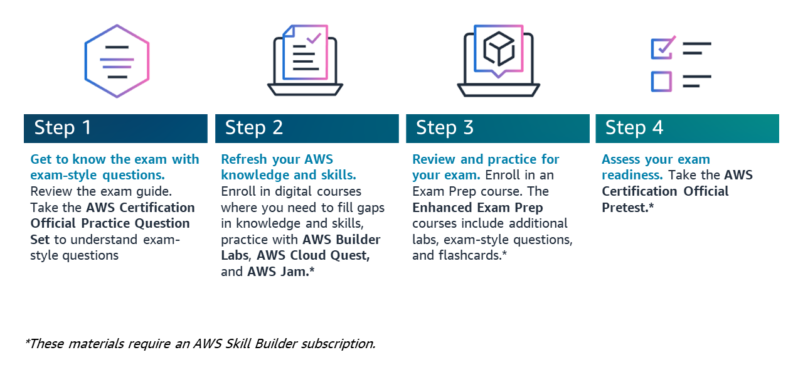

# [标准备考计划：AWS Certified AI Practitioner (AIF-C01)](https://explore.skillbuilder.aws/learn/learning-plans/2193/standard-exam-prep-plan-aws-certified-ai-practitioner-aif-c01)
## 学习计划描述
从开始到获得认证：按照以下 4 步计划，自信地准备考试。  

## Overview  概述
### 本学习计划适用于符合以下条件的个人：
1. 在 AWS 上接触人工智能/ML 技术长达 6 个月。
2. 使用但不一定在 AWS 上构建 AI/ML 解决方案。
3. 正在准备 AWS Certified AI Practitioner (AIF-C01) 考试。

如果您是 IT 和 AWS Cloud 的新手，请从 [AWS Cloud Practitioner Essentials](https://explore.skillbuilder.aws/learn/course/external/view/elearning/134/aws-cloud-practitioner-essentials) 或 [AWS Technical Essentials](https://explore.skillbuilder.aws/learn/courses/1851/aws-technical-essentials/lessons) 开始您的旅程。您还可以考虑标准备考计划：[AWS Certified Cloud Practitioner (CLF-C02)](https://explore.skillbuilder.aws/learn/learning-plans/2170/standard-exam-prep-plan-aws-certified-cloud-practitioner-clf-c02)。一旦您对 AWS 云有了一定的了解，请返回本计划。

### 使用本计划的重要信息
1. 本计划中的标准考试准备课程包括第 1、3 和 4 步所需的所有内容。该课程还包括步骤 2 中推荐的所有课程和文件的链接。
2. 标准考试准备计划不包括完整的 4 步计划中推荐的所有资源和课程。订阅 AWS Skill Builder 可访问 "增强型考试准备计划"，其中包括实验室、闪存卡、额外的考试类型问题和完整的评估。

## 第 1 步：通过考试题型了解考试。
我们建议在第 1 周学习这些材料，以便有时间复习考试题目，并找出可能需要进一步学习的知识缺口。

1. 查看[考试详情页面](https://aws.amazon.com/certification/certified-ai-practitioner)。
2. 查看[考试指南](https://d1.awsstatic.com/zh_CN/training-and-certification/docs-ai-practitioner/AWS-Certified-AI-Practitioner_Exam-Guide.pdf)（可在考试详情页查看）。
3. 通过 AWS Certified AI Practitioner 官方练习题集了解考试类型的问题。这套试题出现在备考标准课程的模块 1 中。

## 步骤 2：更新 AWS 知识和技能。
我们建议在第 1 至第 2 周学习这些内容。

### 更新知识和技能：
* 查看所列资源。它们也出现在标准考试准备课程的模块 2 中。
* 参加推荐的 AWS Skill Builder 数字课程。这些课程附在本考试准备计划之后。

1. [什么是人工智能（AI）？](https://aws.amazon.com/what-is/artificial-intelligence/)
2. [AWS 人工智能、机器学习和生成式人工智能云采用框架](https://docs.aws.amazon.com/whitepapers/latest/aws-caf-for-ai/aws-caf-for-ai.html)

### 数字课程
请查看[学习计划中的课程](#标准备考计划aws-certified-ai-practitioner-aif-c01)

## 第 3 步：复习和练习考试。
我们建议在第 3 至第 6 周学习这些内容。学习模块 3 内容的一个简单方法是每周重点学习一到两个领域。

1. 参加[考试准备标准课程：AWS 认证 AI 从业人员 (AIF-C01)](https://explore.skillbuilder.aws/learn/learning-plans/2193/standard-exam-prep-plan-aws-certified-ai-practitioner-aif-c01)
2. 查看模块 3 中每个考试领域末尾提供的其他资源。
3. AWS Skill Builder 用户可以访问增强课程，其中包括额外的考试题型、闪存卡和实验室。

### [模块 1：通过考试题型了解考试](./AIF-C01_ExamPrepStandardCourse001.md)

### [模块 2：更新您的 AWS 知识和技能](./AIF-C01_ExamPrepStandardCourse002.md)

### [模块 3：复习和练习](./AIF-C01_ExamPrepStandardCourse003.md)

## 模块 4：[报名参加考试](https://aws.amazon.com/cn/certification/certification-prep/testing/?ch=tile&tile=getstarted)

### 模块 5：课程结束
略

### 模块 6：课程调查
略

## 步骤 4：评估考试准备情况。
此步骤仅适用于 AWS Skill Builder "增强型考试准备计划 "的用户。