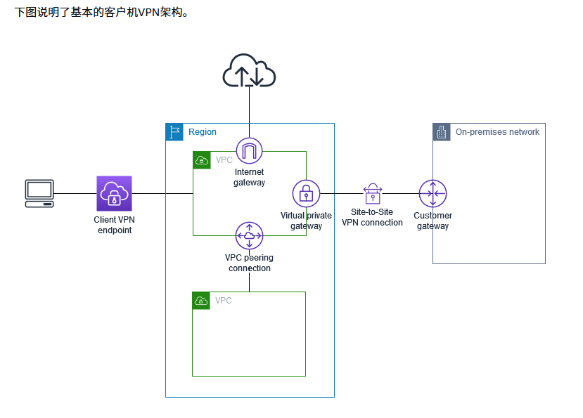

## AWS Systems Manager OpsCenter
OpsCenter 是一个专注于 **运维问题管理的工具** ，帮助团队快速识别、分析和解决问题，从而提升系统的可靠性和运维效率。

## AWS Cloud Map
AWS Cloud Map 是一项 **服务发现（Service Discovery）服务** ，专门用来帮助开发者在分布式系统或微服务架构中，轻松找到和连接动态变化的应用程序资源。

AWS Cloud Map 就像是一个动态的“资源目录”或“地址簿”，可以为你的应用程序提供资源的注册、命名和实时发现功能。

## Amazon Inspector
Amazon Inspector 是 AWS 提供的一项 **自动化的安全评估服务** ，用于帮助客户发现 AWS 环境中的安全漏洞和配置问题。它能够扫描运行在 AWS 上的资源（如 EC2 实例、容器镜像等），识别潜在的漏洞、暴露的网络访问权限以及不符合安全最佳实践的配置，并提供修复建议。

在 Amazon Inspector 中，单词 "Inspector" 的意思是 检查员 或 审查员，表示这个服务的主要功能是对 AWS 环境中的资源进行 检查、审查和评估。它的职责类似于一个安全检查员，负责扫描和发现潜在的安全漏洞或配置问题。

## Amazon Macie
Amazon Macie 是 AWS 提供的一项 **数据安全和隐私保护服务** ，通过机器学习（ML）和模式匹配技术，帮助用户自动发现、分类和保护存储在 Amazon S3 中的敏感数据（如个人身份信息 PII、财务数据或知识产权）。它可以识别数据泄露风险并提供详细的可操作建议，从而帮助企业满足数据隐私法规（如 GDPR、CCPA）的要求。

## Amazon GuardDuty
Amazon GuardDuty 是一项 **威胁检测服务** ，可持续监控、分析和处理您 AWS 环境中的 AWS 数据源和日志。 GuardDuty 使用威胁情报源（例如恶意 IP 地址和域名列表、文件哈希和机器学习 (ML) 模型）来识别 AWS 环境中的可疑活动和潜在的恶意活动。

## AWS Client VPN
AWS Client VPN 是一项 **完全托管的远程访问 VPN 服务** ，允许用户安全地连接到 AWS 和本地网络。它基于 OpenVPN 协议，使用户能够通过互联网从任何地方安全地访问 AWS 资源或本地资源。

这项服务主要用于为远程员工、分布式团队或需要安全访问 AWS 环境的用户提供便捷、可靠的 VPN 解决方案，而无需自行部署和管理 VPN 基础设施。

## Amazon Connect
Amazon Connect 是 AWS 提供的一项 **云端联络中心服务** ，旨在帮助企业轻松建立和管理客户服务中心。它是一种高度可扩展、经济高效且易于使用的解决方案，允许企业通过语音、聊天和其他渠道与客户进行互动。

Amazon Connect 的核心理念是简化联络中心的部署和运营，同时通过 AWS 的云服务提供高可用性、灵活性和智能化功能（如 AI 驱动的客户交互和分析）。它无需复杂的硬件或软件安装，用户可以快速启动并根据需求扩展。

## Amazon Transcribe
Amazon Transcribe 是 AWS 提供的一项 **自动语音识别（ASR）服务** ，能够将语音转换为文本。它利用先进的机器学习技术，支持多种语言的语音转录，帮助用户快速、高效地将音频或视频内容转换为可用的文本数据。

该服务被广泛应用于各种场景，如客户服务记录转录、字幕生成、会议记录自动化等，为企业和开发者提供了一种经济高效且易于集成的语音转文本解决方案。

## Amazon Polly
Amazon Polly 是 AWS 提供的一项 **文本转语音（Text-to-Speech, TTS）服务** ，能够将文本转换为自然流畅的语音。它使用先进的深度学习技术，支持多种语言和语音风格，帮助用户轻松构建语音驱动的应用程序。

Amazon Polly 的目标是通过生成高质量、自然的语音输出，为用户提供沉浸式的交互体验。它广泛应用于语音助手、语音播报、教育内容、无障碍技术等场景。

## Amazon Translate
Amazon Translate 是 AWS 提供的一项 **基于神经网络机器翻译（Neural Machine Translation, NMT）技术的云端翻译服务** ，能够以高质量和高速度将文本从一种语言翻译为另一种语言。它支持多种语言和语言对，帮助企业和开发者快速实现多语言内容的翻译和本地化。

## Amazon Textract
Amazon Textract 是 AWS 提供的一项 **基于机器学习的文档分析服务** ，能够自动从扫描的文档、图像或 PDF 文件中提取文本、表格、表单数据和其他结构化信息。与传统的光学字符识别（OCR）技术不同，Amazon Textract 不仅能够识别文本，还能理解文档的布局和内容结构，从而提取有意义的数据。

## Amazon Comprehend
Amazon Comprehend 是 AWS 提供的一项 **自然语言处理（Natural Language Processing, NLP）服务**，能够从非结构化文本中提取有意义的信息。它使用机器学习技术分析文本，识别情感、关键短语、实体、语言以及文本之间的主题关系，帮助用户将非结构化数据转化为可操作的洞察。

## CloudFront
CloudFront 是一种 **内容分发网络（CDN）服务** ，可以低延迟和高传输速度向全球客户安全地分发数据、视频、应用程序和 API。

## AWS Migration Hub
AWS Migration Hub 是 AWS 提供的一项集中式服务，旨在帮助用户规划、跟踪和管理应用程序迁移到 AWS 云的过程。通过 Migration Hub，用户可以在一个统一的界面中查看迁移进度，无论是使用 AWS 原生迁移工具还是第三方迁移工具，都能集中管理和监控。

Migration Hub 的主要目标是简化迁移流程，为用户提供全面的可见性，帮助企业更高效地将本地数据中心迁移到 AWS 云。