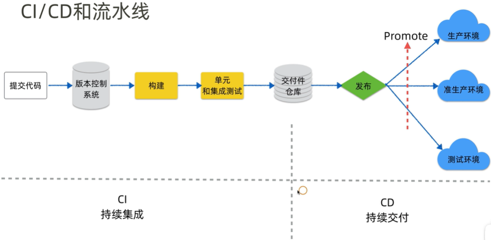
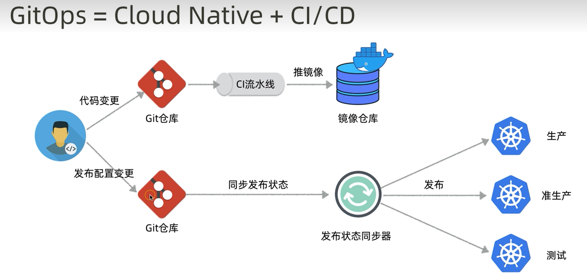
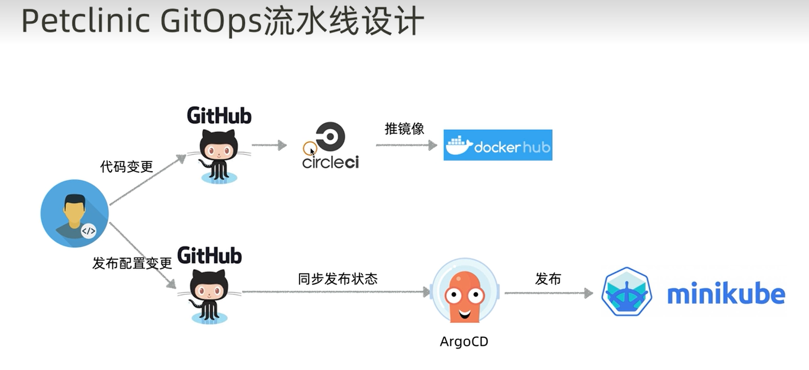

# CIDI 持续集成持续交付

## CI/CD Pipeline
* CI 持续集成～代码提交，自动化构建／单元测试／集成测试，生成交付件（jar or image）。
* CD 持续交付～将交付件自动发布到 Dev／Test／Prod 等环境。
* Pipeline 流水线～也称 Paved Road（铺好的路）＝ CI／CD 工具链 ＋ 配套治理流程。

目标：将软件快速高质量交付的线上环境＝快速高质量给客户交付价值

## GitOps
* CI／CD 都由 git 提交自动触发，包括代码提交和发布配置提交。
* 面向云原生（Cloud Native）的 CI／CD。

# [Jenkins](./Jenkins/Jenkins.md)

# [CircleCI](./CircleCI/CircleCI.md)

# other 其他一些非系统的学习