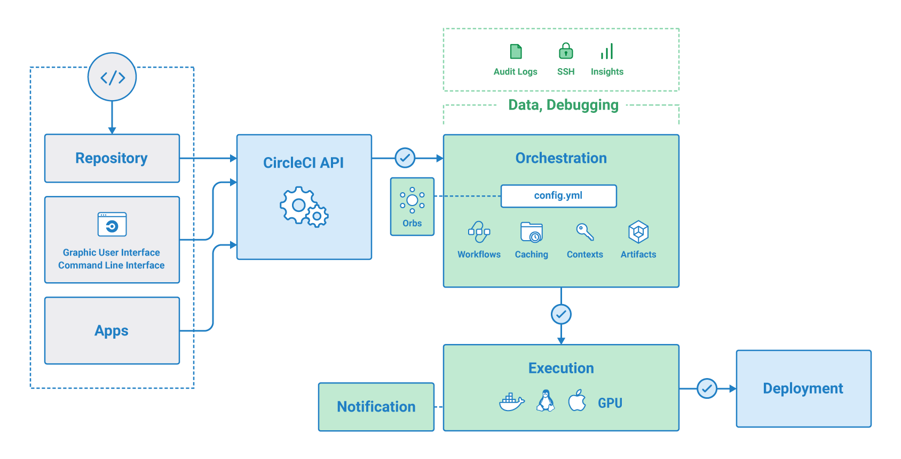

# CircleCI 概述
## 介绍

## 什么是 CI/CD？
CI/CD代表持续集成（Continuous Integration）与持续交付/持续部署（Continuous Delivery/Continuous Deployment）。它们是现代软件开发流程中的关键概念，有助于提高开发团队的效率、软件质量和交付速度。

## 您工作流程中的 CircleCI
受支持的版本控制系统 (VCS) 上的软件存储库需要获得授权并作为项目添加到 Circleci.com 上。每次代码更改都会在干净的容器或虚拟机中触发自动化测试。 CircleCI 在单独的容器或虚拟机中运行每个作业。  
测试完成后，CircleCI 会发送成功或失败的电子邮件通知。 CircleCI 还包括集成的 Slack 和 IRC 通知。对于添加了报告库的任何项目，都可以从详细信息页面获取代码测试覆盖率结果。

# CircleCI 的好处

# 概念
# 词汇表
# 网络应用程序介绍