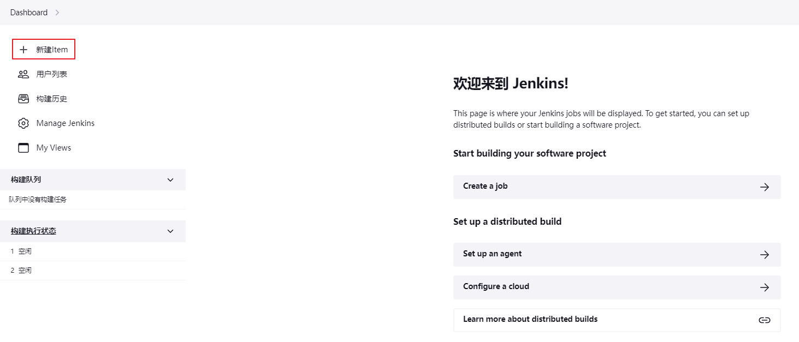
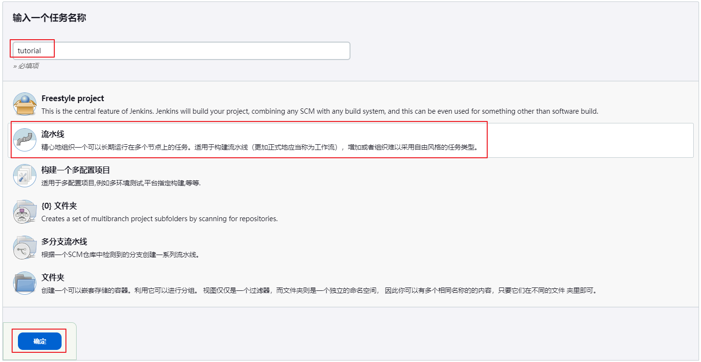
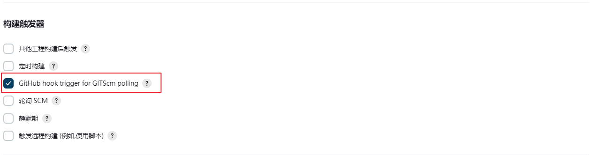
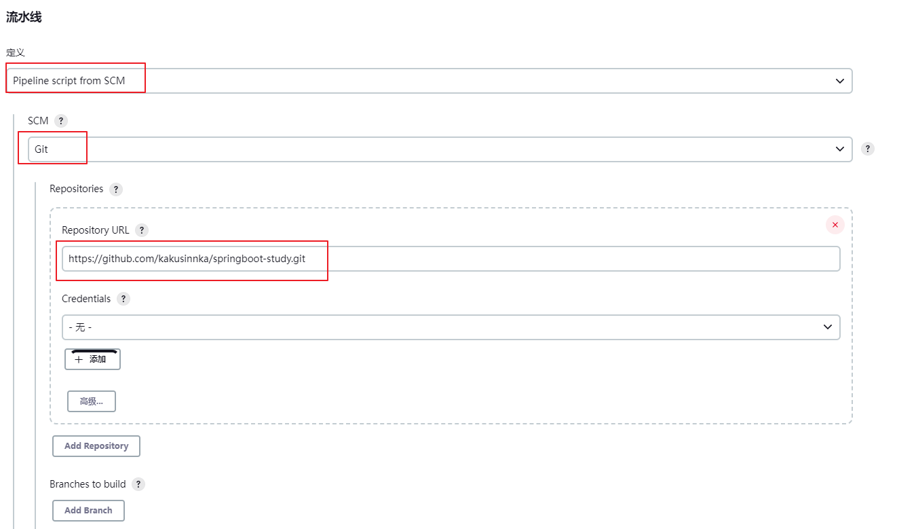
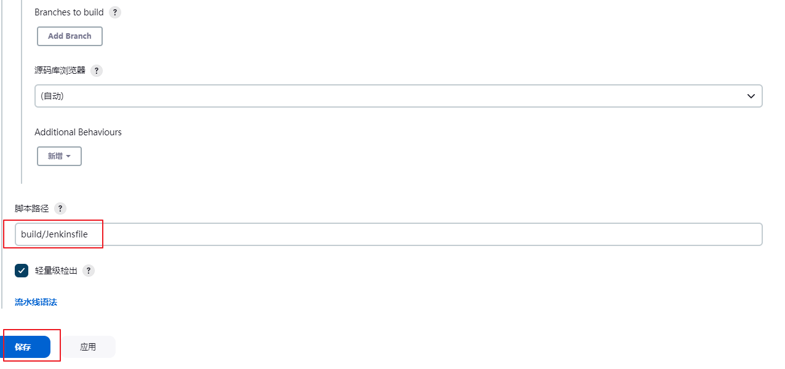
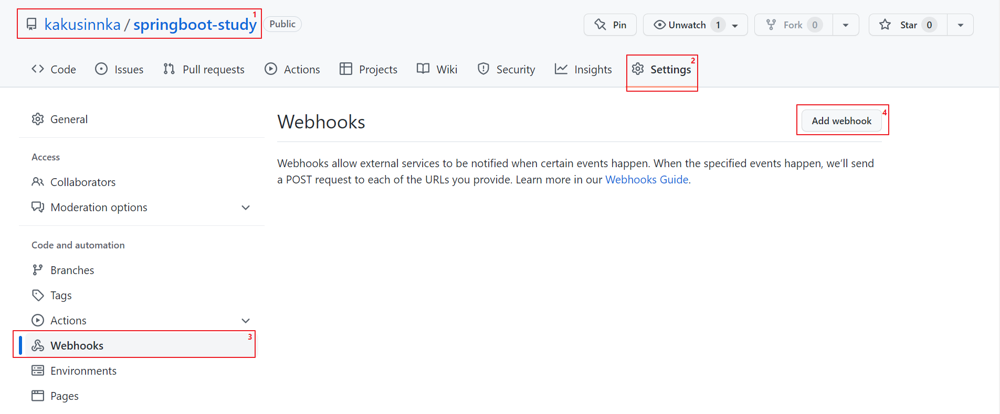
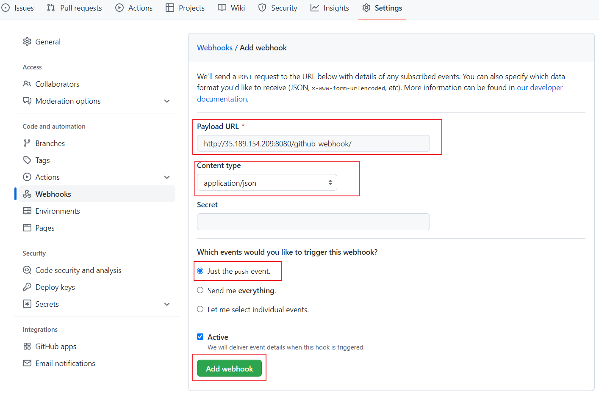

# 如何将 Jenkins 与 GitHub 集成 [How to Integrate Jenkins with GitHub](https://www.cprime.com/resources/blog/how-to-integrate-jenkins-github/)

## Prerequisites
一个必要的先决条件是拥有一个装有 Jenkins 的服务器，并使用 GitHub 插件运行。
选用 GCE 搭建一个 Jenkins 的服务器. -> ../Jenkins/Installing_Jenkins.md

## Create a Jenkins Job


## 配置 GitHub 挂钩触发器 Configure the GitHub Hook Trigger

## Use a GitHub Repository
* 需要在 Jenkins 服务器上安装 Git。
```
sudo apt-get install git
dpkg -l git
```


## Add a Webhook in GitHub


## 手动构建 Jenkins 作业 Build the Jenkins Job Manually
## 在 GitHub 存储库中更改某些内容 Change Something in the GitHub Repo