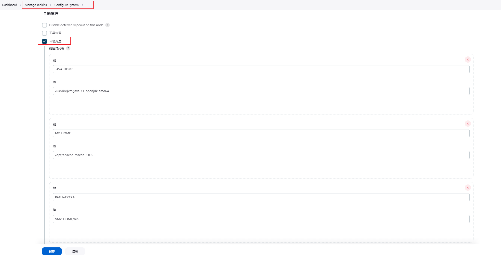

# [如何将 Jenkins 与 Maven 集成](https://www.alibabacloud.com/blog/cicd-with-jenkins---part-2-use-jenkins-for-continuous-integration_593720)

## 安装 Maven
* 首先需要安装JDK
```
sudo apt update
sudo apt install openjdk-11-jre
java -version
```
* 其次安装Maven
  - [下载Maven](https://maven.apache.org/download.cgi?spm=a2c65.11461447.0.0.7a4c481c9NVzfl&file=download.cgi)
  - 安装Maven
```
sudo tar -xf apache-maven-3.8.6-bin.tar.gz
sudo mv apache-maven-3.8.6 /opt

-- 可选
MAVEN_HOME='/opt/apache-maven-3.8.6'
PATH="$MAVEN_HOME/bin:$PATH"
export PATH
source .profile
```
## 配置全局环境变量


## 关于 GCE 上使用 jib-maven-plugin
* 如果您使用的是 Compute Engine 上的实例，则 gcloud CLI 是默认安装的。
* 服务帐号: Compute Engine 默认服务帐号。 $PROJECT_NUMBER-compute@developer.gserviceaccount.com
* Cloud API 访问权限范围: 授予对所有 Cloud API 的完整访问权限。