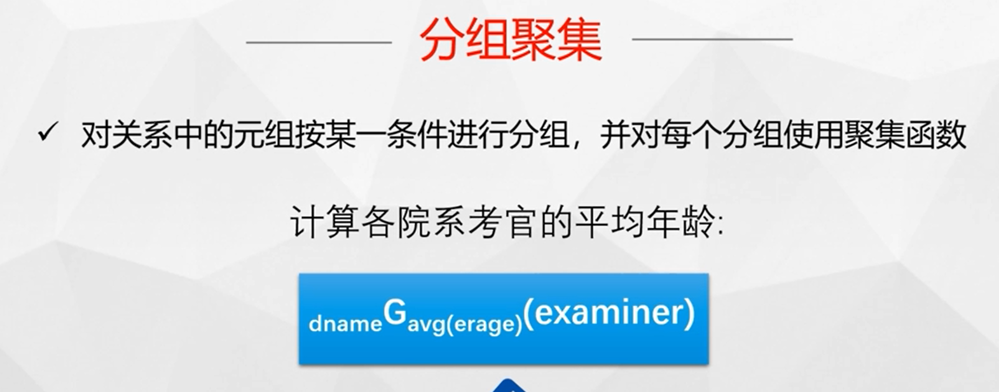
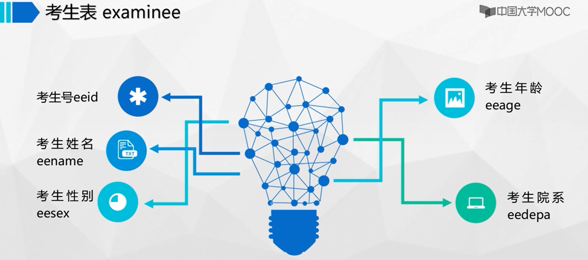

# 课件
## 课程学习指南
### 导学视频
### 社会对大数据数据库人才的需求
### 课程特色之新认识（数据保护）
### 课程特色之新认识（大数据数据库）

## 第一章 绪论 (上)
### 第一节 数据库
### 第二节 数据库系统

## 第一章 绪论 (下)
### 第三节 数据库管理系统
  
  
  
### 第四节 数据管理技术发展趋势
  
  

## 第二章 关系模型（上）
### 第一节 关系结构和约束
* 关系表：关系数据库使用一个或多个表来存储数据。数学上把一系列域上的笛卡尔积的子集称为关系。
* 超键：关系中的一个属性或属性组，其值能唯一地标识关系中的一个元组。
* 候选键：关系中的一个属性或属性组，其值能唯一地标识关系中的一个元组，且不能再分解，即它的任何子集都不能唯一标识一张表中的每一行记录。
* 主键：一个关系中可能有多个候选键，通常指定其中一个，并且只能是一个，用来唯一标识元组，该候选键成为主键。
* 外键：如果关系表S1的一个属性子集A，必须匹配另外一个关系表S2中出现的数值，则称A是关系表S1的外键。其中，S1称为引用关系，S2称为被引用关系。外键的值，或与被引用关系中出现的数值对应，或为空值。
### 第二节 基本关系代数运算
  
  
  
  
  
  
  

## 第二章 关系模型（下）
### 第三节 附加关系代数运算
  
  
  
  
自然联结与属性联结的区别：当参与联结运算的两个表有多个同名列时，自然联结的匹配条件是所有同名列全部取值相等；而属性联结的匹配条件是指定其中若干同名列取值相等。  
  

### 第四节 扩展关系代数运算
  
  
聚集函数：COUNT、SUM、AVG、MAX、MIN.  
  
  
  
  

## 第三章 PG数据定义与操作（上）
  
  
  
  
  
  
### 第一节 SQL概述
SQL（Structured Query Language，结构化查询语言）是一种用于管理关系型数据库的标准化语言。它支持各种操作，例如查询、插入、更新和删除数据，以及创建、修改和删除表、索引、视图和存储过程等数据库对象。  
  
### 第二节 数据定义与修改

## 第三章 PG数据定义与操作（中）
### 第三节 简单查询
* 升序时排序列为空值的行最后显示，降序时排序列为空值的行最先显示。

## 第三章 PG数据定义与操作（下）
### 第四节 联接查询
联接类型是按照对悬浮行的不同处理方式来分的，分为内联接和（左/右/全）外联接。  
  
  
  
### 第五节 嵌套查询
一个SELECT-FROM-WHERE语句称为一个查询块，将一个查询块嵌套在另一个查询块的SELECT、FROM、WHERE、GROUP BY、HAVING、ORDER BY、LIMIT、OFFSET或WITH子句中的查询称为嵌套查询。  
在写嵌套查询语句时，如果能确定查询块只返回单行单列的单个值，查询块可以出现在单个属性名、单个表达式、单个常量，即单值表达式能够出现的任何地方。  
* 查询块可以出现在另外一个查询中表名可以出现的任何地方。
* 如果内层子查询不依赖于外层查询称为不相关嵌套查询，可由内向外逐层处理。
* 如果能确定查询块只返回单行单列的单个值，查询块可以出现在单值表达式能够出现的任何地方。

## 第四章 PG应用（上）
### 第一节 数据库应用体系结构
  
### 第二节 嵌入式pgSQL
把pgSQL嵌入到宿主语言中使用还必须要解决以下四个方面的问题：连接数据库、嵌入识别问题、宿主语言与pgSQL语言的数据交互问题、宿主语言的单记录与pgSQL的多元组的协调问题。
  

## 第四章 PG应用（下）
### 第三节 JDBC编程
JDBC（Java Database Connectivity）是一种Java API（应用程序编程接口），它提供了一种标准化的方式，使Java应用程序能够连接和操作各种类型的关系型数据库。JDBC允许开发人员使用Java语言编写数据库应用程序，而不必了解特定数据库厂商的API。
* Java Database Connectivity
* 用来执行 SQL 语句
* Java API
* 标准 Java 类库

---

JDBC（Java Database Connectivity）是Java平台提供的一套标准API，用于连接和操作各种类型的关系型数据库。而数据库驱动程序是实现JDBC API的软件组件，用于连接特定类型的数据库。

JDBC API提供了一套标准的接口，使得Java应用程序可以通过统一的方式与不同类型的数据库进行通信。它定义了一些接口和类，如Connection、Statement、ResultSet等，用于连接数据库、执行SQL语句、处理查询结果等操作。

JDBC驱动程序则实现了这些接口和类，提供了特定数据库的实现。当Java应用程序需要连接数据库时，它会使用特定类型的驱动程序来建立连接，然后使用JDBC API执行各种操作。驱动程序负责将JDBC调用转换为特定数据库的原生协议，以实现与数据库的通信。

需要注意的是，JDBC API是一种标准化的接口，不同类型的数据库可能有不同的实现方式和特性，因此需要使用特定类型的驱动程序来与数据库进行交互。例如，如果要连接MySQL数据库，则需要使用MySQL官方提供的JDBC驱动程序。同时，不同版本的驱动程序也可能有不同的特性和性能表现，开发人员需要根据具体应用场景选择合适的驱动程序。

---

  
### 第四节 PG中的函数
存储函数（Stored Function）是一种在数据库中定义的可重用的程序单元，可以接收参数并返回一个值。它类似于程序中的函数或方法，但是存储在数据库中，可以通过SQL语句调用。  
存储过程（Stored Procedure）是一种在数据库中定义的可重用的程序单元，可以接收参数并执行一系列SQL语句。它类似于程序中的子程序或函数，但是存储在数据库中，可以通过SQL语句调用。  

存储函数和存储过程都是在数据库中定义的可重用的程序单元，但它们有些不同：
1. 返回值：存储函数必须返回一个值，而存储过程则不需要返回值。
2. 调用方式：存储函数可以像SQL函数一样通过SELECT语句进行调用，而存储过程通常通过CALL语句进行调用。
3. 参数传递：存储函数和存储过程都可以接收参数，但是存储函数的参数可以作为表达式的一部分传递，而存储过程的参数必须作为变量或参数传递给它。
4. 事务：存储过程可以控制事务的边界，而存储函数不能控制事务。
5. 执行时间：存储函数通常比存储过程更快，因为它们不需要启动新的事务。

PL/pgSQL是PostgreSQL数据库系统提供的一种存储过程语言，它基于PL/SQL（Oracle数据库的存储过程语言）而开发，但又增加了一些自己的特性。PL/pgSQL支持面向过程的编程，可以定义函数、触发器、存储过程等对象。

## 第五章 PG数据保护（上）
### 第一节 数据保护
数据安全包括数据保密性、数据完整性、数据可用性。
  
* 保密性: 数据库保密性是指确保数据库中存储的敏感信息不被未授权的人员访问和泄露的能力。
* 完整性：数据库数据完整性是确保数据库中数据符合规则和约束条件的能力。实施数据完整性措施可以保证数据库中数据的正确性、一致性和可靠性。
* 可用性：数据库数据可用性是确保数据库在需要时始终可用的能力。实施数据可用性措施可以保证用户可以在任何时候访问其数据，并且可以快速恢复数据库，以确保数据的完整性和可靠性。
### 第二节 视图
数据库视图是一种虚拟表，它是由一个或多个表的数据以特定的方式组合而成。视图并不存储实际的数据，而是仅仅是对原始表数据的一种逻辑上的展示。通过使用视图，可以隐藏实际表结构的复杂性，简化用户对数据的访问，提高数据的安全性和保密性。
### 第三节 访问控制
  
  
  
  
GRANT和REVOKE是SQL中用于授权和撤销权限的命令，它们可以在数据库中控制用户对数据库对象的访问权限。  
1. GRANT命令：GRANT命令用于向用户或用户组授予对指定数据库对象的访问权限。GRANT命令的基本语法为：
```
GRANT [权限列表] ON [对象名] TO [用户或用户组名];
```
权限列表可以是一组权限，例如SELECT、INSERT、UPDATE、DELETE等，也可以是ALL PRIVILEGES，表示授予所有权限。对象名可以是表、视图、存储过程等数据库对象的名称。用户或用户组名可以是已经定义的数据库用户或用户组。  
2. REVOKE命令：REVOKE命令用于撤销用户或用户组对数据库对象的访问权限。REVOKE命令的基本语法为：
```
REVOKE [权限列表] ON [对象名] FROM [用户或用户组名];
```
权限列表、对象名和用户或用户组名的含义与GRANT命令相同。执行REVOKE命令将取消之前授予的权限。

## 第五章 PG数据保护（下）
### 第四节 完整性约束
数据库完整性约束是一种用于保证数据库数据完整性的规则或条件。它们可以被定义在表的列上，也可以被定义在整个表上，以确保数据库中的数据始终处于一种一致的、合法的状态。以下是一些常见的数据库完整性约束：
* 主键约束：主键是一列或一组列，用于唯一标识表中的每一行数据。主键约束要求该列或列组的值必须是唯一的且不能为空。
* 唯一约束：唯一约束要求该列或列组的值必须是唯一的，但可以为空值。与主键约束不同，表可以有多个唯一约束。
* 非空约束：非空约束要求该列的值不能为NULL。这可以确保数据库中没有任何缺失的数据。
* 外键约束：外键约束用于确保表中的数据引用了其他表中的有效数据。它通常由一个表的列定义为另一个表的主键，以确保引用的数据始终存在。
* 检查约束：检查约束要求该列的值必须符合指定的条件或表达式。例如，可以使用检查约束来确保日期列中的日期不晚于当前日期。  

这些完整性约束可以在表的创建过程中定义，也可以在表已经存在的情况下使用ALTER TABLE语句添加。数据库管理系统将在插入或更新数据时自动检查这些约束，并确保数据的完整性。如果数据违反任何约束，将会发生错误并拒绝数据的插入或更新操作。

### 第五节 触发器
数据库触发器是一种用于监控数据库中的数据变化并自动执行响应操作的特殊类型的存储过程。当某个特定的事件发生时，如插入、更新或删除表中的数据，触发器将被自动触发，并执行定义的操作。触发器可以在数据库内部自动运行，而无需手动干预。  
触发器通常被用于执行以下操作：
1. 数据验证：触发器可以确保插入、更新或删除操作的数据满足特定的条件或规则，如强制某些列不能为空、确保外键约束被满足等。
2. 日志记录：触发器可以自动记录数据库中的数据变化，如记录更新操作前后的值、记录删除的行等。
3. 数据补全：触发器可以自动填充某些列的值，如在插入数据时自动填充创建日期和时间。
触发器是通过定义在表上的事件来触发的。当定义的事件发生时，触发器会被调用并执行定义的操作。例如，在一个更新操作之前定义一个触发器，可以让触发器在更新操作发生之前检查数据的完整性，并进行相应的操作。  

数据库触发器可以定义在表的创建语句中，也可以在表已经存在的情况下使用ALTER TABLE语句添加。触发器的定义包括名称、定义在哪张表上、何时触发、要执行的操作等信息。

### 第六节 事务
数据库事务是指一组数据库操作（如插入、更新、删除等）的逻辑单元，这些操作要么全部成功执行，要么全部回滚到事务开始前的状态，以保证数据库的一致性和完整性。事务具有以下特点：
* 原子性（Atomicity）：事务中的操作被视为一个不可分割的原子单元，要么全部执行成功，要么全部回滚。如果任何操作失败，事务会被回滚，回到事务开始前的状态。
* 一致性（Consistency）：事务执行前和执行后，数据库必须保持一致的状态。事务开始前数据库的约束和规则必须有效，事务结束后数据库的完整性约束必须满足。
* 隔离性（Isolation）：事务的执行应该与其他事务相互隔离，每个事务的操作应该看作是在独立的环境中执行。并发执行的多个事务之间不应该相互干扰，每个事务应该感知不到其他事务的存在。
* 持久性（Durability）：一旦事务提交，其所做的修改应该永久保存在数据库中，即使在系统故障的情况下也应该保持。  

事务的执行由以下四个关键操作组成：
* 开始事务（BEGIN）：事务的开始标记，确定一组操作为一个事务单元。
* 执行操作（SQL语句）：执行数据库操作，如插入、更新、删除等。
* 提交事务（COMMIT）：确认事务的操作成功执行，并将结果永久保存在数据库中。
* 回滚事务（ROLLBACK）：取消事务的操作，并将数据库恢复到事务开始前的状态。

通过使用数据库事务，可以确保数据库操作的一致性和完整性，防止数据丢失和不一致的情况发生。

### 第七节 加密
