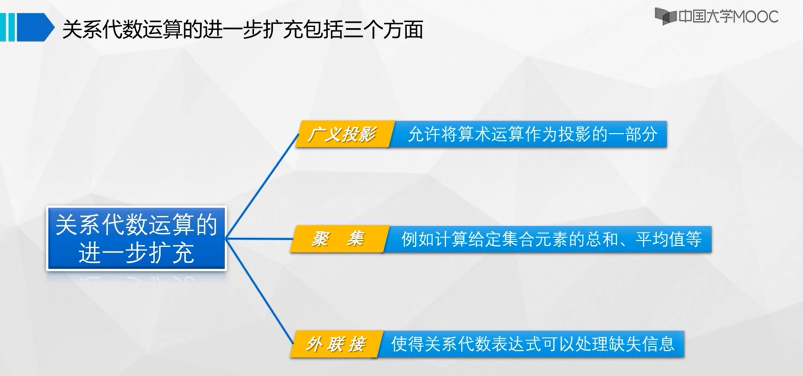

# 课件
## 课程学习指南
### 导学视频
### 社会对大数据数据库人才的需求
### 课程特色之新认识（数据保护）
### 课程特色之新认识（大数据数据库）

## 第一章 绪论 (上)
### 第一节 数据库
### 第二节 数据库系统

## 第一章 绪论 (下)
### 第三节 数据库管理系统
  
  
  
### 第四节 数据管理技术发展趋势
  
  

## 第二章 关系模型（上）
### 第一节 关系结构和约束
* 关系表：关系数据库使用一个或多个表来存储数据。数学上把一系列域上的笛卡尔积的子集称为关系。
* 超键：关系中的一个属性或属性组，其值能唯一地标识关系中的一个元组。
* 候选键：关系中的一个属性或属性组，其值能唯一地标识关系中的一个元组，且不能再分解，即它的任何子集都不能唯一标识一张表中的每一行记录。
* 主键：一个关系中可能有多个候选键，通常指定其中一个，并且只能是一个，用来唯一标识元组，该候选键成为主键。
* 外键：如果关系表S1的一个属性子集A，必须匹配另外一个关系表S2中出现的数值，则称A是关系表S1的外键。其中，S1称为引用关系，S2称为被引用关系。外键的值，或与被引用关系中出现的数值对应，或为空值。
### 第二节 基本关系代数运算
  
  
  
  
  
  
  

## 第二章 关系模型（下）
### 第三节 附加关系代数运算
  
  
  
  
自然联结与属性联结的区别：当参与联结运算的两个表有多个同名列时，自然联结的匹配条件是所有同名列全部取值相等；而属性联结的匹配条件是指定其中若干同名列取值相等。  
  

### 第四节 扩展关系代数运算
  
  
聚集函数：COUNT、SUM、AVG、MAX、MIN.  
  
  
  
  

## 第三章 PG数据定义与操作（上）
  
  
  
  
  
  
### 第一节 SQL概述
SQL（Structured Query Language，结构化查询语言）是一种用于管理关系型数据库的标准化语言。它支持各种操作，例如查询、插入、更新和删除数据，以及创建、修改和删除表、索引、视图和存储过程等数据库对象。  
  
### 第二节 数据定义与修改

## 第三章 PG数据定义与操作（中）
### 第三节 简单查询
* 升序时排序列为空值的行最后显示，降序时排序列为空值的行最先显示。

## 第三章 PG数据定义与操作（下）
### 第四节 联接查询
联接类型是按照对悬浮行的不同处理方式来分的，分为内联接和（左/右/全）外联接。  
  
  
  
### 第五节 嵌套查询
一个SELECT-FROM-WHERE语句称为一个查询块，将一个查询块嵌套在另一个查询块的SELECT、FROM、WHERE、GROUP BY、HAVING、ORDER BY、LIMIT、OFFSET或WITH子句中的查询称为嵌套查询。  
在写嵌套查询语句时，如果能确定查询块只返回单行单列的单个值，查询块可以出现在单个属性名、单个表达式、单个常量，即单值表达式能够出现的任何地方。  
* 查询块可以出现在另外一个查询中表名可以出现的任何地方。
* 如果内层子查询不依赖于外层查询称为不相关嵌套查询，可由内向外逐层处理。
* 如果能确定查询块只返回单行单列的单个值，查询块可以出现在单值表达式能够出现的任何地方。

## 第四章 PG应用（上）
### 第一节 数据库应用体系结构
  
### 第二节 嵌入式pgSQL
把pgSQL嵌入到宿主语言中使用还必须要解决以下四个方面的问题：连接数据库、嵌入识别问题、宿主语言与pgSQL语言的数据交互问题、宿主语言的单记录与pgSQL的多元组的协调问题。
  

## 第四章 PG应用（下）
### 第三节 JDBC编程
JDBC（Java Database Connectivity）是一种Java API（应用程序编程接口），它提供了一种标准化的方式，使Java应用程序能够连接和操作各种类型的关系型数据库。JDBC允许开发人员使用Java语言编写数据库应用程序，而不必了解特定数据库厂商的API。
* Java Database Connectivity
* 用来执行 SQL 语句
* Java API
* 标准 Java 类库

---

JDBC（Java Database Connectivity）是Java平台提供的一套标准API，用于连接和操作各种类型的关系型数据库。而数据库驱动程序是实现JDBC API的软件组件，用于连接特定类型的数据库。

JDBC API提供了一套标准的接口，使得Java应用程序可以通过统一的方式与不同类型的数据库进行通信。它定义了一些接口和类，如Connection、Statement、ResultSet等，用于连接数据库、执行SQL语句、处理查询结果等操作。

JDBC驱动程序则实现了这些接口和类，提供了特定数据库的实现。当Java应用程序需要连接数据库时，它会使用特定类型的驱动程序来建立连接，然后使用JDBC API执行各种操作。驱动程序负责将JDBC调用转换为特定数据库的原生协议，以实现与数据库的通信。

需要注意的是，JDBC API是一种标准化的接口，不同类型的数据库可能有不同的实现方式和特性，因此需要使用特定类型的驱动程序来与数据库进行交互。例如，如果要连接MySQL数据库，则需要使用MySQL官方提供的JDBC驱动程序。同时，不同版本的驱动程序也可能有不同的特性和性能表现，开发人员需要根据具体应用场景选择合适的驱动程序。

---

  
### 第四节 PG中的函数
存储函数（Stored Function）是一种在数据库中定义的可重用的程序单元，可以接收参数并返回一个值。它类似于程序中的函数或方法，但是存储在数据库中，可以通过SQL语句调用。  
存储过程（Stored Procedure）是一种在数据库中定义的可重用的程序单元，可以接收参数并执行一系列SQL语句。它类似于程序中的子程序或函数，但是存储在数据库中，可以通过SQL语句调用。  

存储函数和存储过程都是在数据库中定义的可重用的程序单元，但它们有些不同：
1. 返回值：存储函数必须返回一个值，而存储过程则不需要返回值。
2. 调用方式：存储函数可以像SQL函数一样通过SELECT语句进行调用，而存储过程通常通过CALL语句进行调用。
3. 参数传递：存储函数和存储过程都可以接收参数，但是存储函数的参数可以作为表达式的一部分传递，而存储过程的参数必须作为变量或参数传递给它。
4. 事务：存储过程可以控制事务的边界，而存储函数不能控制事务。
5. 执行时间：存储函数通常比存储过程更快，因为它们不需要启动新的事务。

PL/pgSQL是PostgreSQL数据库系统提供的一种存储过程语言，它基于PL/SQL（Oracle数据库的存储过程语言）而开发，但又增加了一些自己的特性。PL/pgSQL支持面向过程的编程，可以定义函数、触发器、存储过程等对象。

## 第五章 PG数据保护（上）
### 第一节 数据保护
数据安全包括数据保密性、数据完整性、数据可用性。
  
* 保密性: 数据库保密性是指确保数据库中存储的敏感信息不被未授权的人员访问和泄露的能力。
* 完整性：数据库数据完整性是确保数据库中数据符合规则和约束条件的能力。实施数据完整性措施可以保证数据库中数据的正确性、一致性和可靠性。
* 可用性：数据库数据可用性是确保数据库在需要时始终可用的能力。实施数据可用性措施可以保证用户可以在任何时候访问其数据，并且可以快速恢复数据库，以确保数据的完整性和可靠性。
### 第二节 视图
数据库视图是一种虚拟表，它是由一个或多个表的数据以特定的方式组合而成。视图并不存储实际的数据，而是仅仅是对原始表数据的一种逻辑上的展示。通过使用视图，可以隐藏实际表结构的复杂性，简化用户对数据的访问，提高数据的安全性和保密性。
### 第三节 访问控制
  
  
  
  
GRANT和REVOKE是SQL中用于授权和撤销权限的命令，它们可以在数据库中控制用户对数据库对象的访问权限。  
1. GRANT命令：GRANT命令用于向用户或用户组授予对指定数据库对象的访问权限。GRANT命令的基本语法为：
```
GRANT [权限列表] ON [对象名] TO [用户或用户组名];
```
权限列表可以是一组权限，例如SELECT、INSERT、UPDATE、DELETE等，也可以是ALL PRIVILEGES，表示授予所有权限。对象名可以是表、视图、存储过程等数据库对象的名称。用户或用户组名可以是已经定义的数据库用户或用户组。  
2. REVOKE命令：REVOKE命令用于撤销用户或用户组对数据库对象的访问权限。REVOKE命令的基本语法为：
```
REVOKE [权限列表] ON [对象名] FROM [用户或用户组名];
```
权限列表、对象名和用户或用户组名的含义与GRANT命令相同。执行REVOKE命令将取消之前授予的权限。

## 第五章 PG数据保护（下）
### 第四节 完整性约束
数据库完整性约束是一种用于保证数据库数据完整性的规则或条件。它们可以被定义在表的列上，也可以被定义在整个表上，以确保数据库中的数据始终处于一种一致的、合法的状态。以下是一些常见的数据库完整性约束：
* 主键约束：主键是一列或一组列，用于唯一标识表中的每一行数据。主键约束要求该列或列组的值必须是唯一的且不能为空。
* 唯一约束：唯一约束要求该列或列组的值必须是唯一的，但可以为空值。与主键约束不同，表可以有多个唯一约束。
* 非空约束：非空约束要求该列的值不能为NULL。这可以确保数据库中没有任何缺失的数据。
* 外键约束：外键约束用于确保表中的数据引用了其他表中的有效数据。它通常由一个表的列定义为另一个表的主键，以确保引用的数据始终存在。
* 检查约束：检查约束要求该列的值必须符合指定的条件或表达式。例如，可以使用检查约束来确保日期列中的日期不晚于当前日期。  

这些完整性约束可以在表的创建过程中定义，也可以在表已经存在的情况下使用ALTER TABLE语句添加。数据库管理系统将在插入或更新数据时自动检查这些约束，并确保数据的完整性。如果数据违反任何约束，将会发生错误并拒绝数据的插入或更新操作。

### 第五节 触发器
数据库触发器是一种用于监控数据库中的数据变化并自动执行响应操作的特殊类型的存储过程。当某个特定的事件发生时，如插入、更新或删除表中的数据，触发器将被自动触发，并执行定义的操作。触发器可以在数据库内部自动运行，而无需手动干预。  
触发器通常被用于执行以下操作：
1. 数据验证：触发器可以确保插入、更新或删除操作的数据满足特定的条件或规则，如强制某些列不能为空、确保外键约束被满足等。
2. 日志记录：触发器可以自动记录数据库中的数据变化，如记录更新操作前后的值、记录删除的行等。
3. 数据补全：触发器可以自动填充某些列的值，如在插入数据时自动填充创建日期和时间。
触发器是通过定义在表上的事件来触发的。当定义的事件发生时，触发器会被调用并执行定义的操作。例如，在一个更新操作之前定义一个触发器，可以让触发器在更新操作发生之前检查数据的完整性，并进行相应的操作。  

数据库触发器可以定义在表的创建语句中，也可以在表已经存在的情况下使用ALTER TABLE语句添加。触发器的定义包括名称、定义在哪张表上、何时触发、要执行的操作等信息。

### 第六节 事务
数据库事务是指一组数据库操作（如插入、更新、删除等）的逻辑单元，这些操作要么全部成功执行，要么全部回滚到事务开始前的状态，以保证数据库的一致性和完整性。事务具有以下特点：
* 原子性（Atomicity）：事务中的操作被视为一个不可分割的原子单元，要么全部执行成功，要么全部回滚。如果任何操作失败，事务会被回滚，回到事务开始前的状态。
* 一致性（Consistency）：事务执行前和执行后，数据库必须保持一致的状态。事务开始前数据库的约束和规则必须有效，事务结束后数据库的完整性约束必须满足。
* 隔离性（Isolation）：事务的执行应该与其他事务相互隔离，每个事务的操作应该看作是在独立的环境中执行。并发执行的多个事务之间不应该相互干扰，每个事务应该感知不到其他事务的存在。
* 持久性（Durability）：一旦事务提交，其所做的修改应该永久保存在数据库中，即使在系统故障的情况下也应该保持。  

事务的执行由以下四个关键操作组成：
* 开始事务（BEGIN）：事务的开始标记，确定一组操作为一个事务单元。
* 执行操作（SQL语句）：执行数据库操作，如插入、更新、删除等。
* 提交事务（COMMIT）：确认事务的操作成功执行，并将结果永久保存在数据库中。
* 回滚事务（ROLLBACK）：取消事务的操作，并将数据库恢复到事务开始前的状态。

通过使用数据库事务，可以确保数据库操作的一致性和完整性，防止数据丢失和不一致的情况发生。

### 第七节 加密

## 第六章 数据库设计：实体-联系方法（上）
### 第一节 数据库设计方法和生命周期

了解客户数据需求，就可以进行概念设计，即设计概念模式，概念模式与具体DBMS无关，通常使用实体—联系图表示，也叫E—R图。  
在概念模式的基础上，进行逻辑设计，即将概念模式转换成相应的逻辑模式，获得符合选定DBMS数据模型的逻辑结构，比如关系模式。  
对于关系数据库来说，物理设计就很简单了，对数据库的系统参数进行设置。  
数据库实现：
* 用DDL定义数据库结构
* 把数据入库
* 编制与调试应用程序
* 进行数据库试运行

数据库维护：
1. 定期对数据库和事务日志进行备份，保证发生故障时，能利用这些备份，尽快将数据库恢复到一个一致性状态
2. 当应用环境、用户、完整性约束等出现变化时往往需要根据实际情况调整原有安全策略、完善原有安全机制
3. 利用DBMS提供的系统性能监测工具监督系统运行，必要时调整某些参数，改进系统性能
4. 针对数据库性能随着数据库运行逐渐下降问题，必要时重组数据库，回收垃圾，减少指针链，提高系统性能
5. 针对应用需求的变化，适当调整数据库模式也叫重构数据库

>实体—联系方法以实体为中心，着重于一个关系模式基本对应一个实体或联系，即关系模式与实体或联系之间基本是一一对应的  
属性—联系方法以属性为中心，着重于属性之间的依赖关系。  

>总的来说，数据库设计有两种方法：实体—联系方法和属性—联系方法；它们的区别在于实体—联系方法是先建立概念模式再转换为关系模式，属性—联系方法是把需要数据库保存的所有属性放在一张关系表中，进而通过属性之间的联系来优化这个关系模式。
### 第二节 第一小节 E-R模型元素
* 概念模式：概念模式与具体DBMS无关，通常使用实体—联系图表示，也叫E-R图。
* E-R图：E—R图主要包括实体和联系以及它们各自的属性。
* 联系：联系就是一个或多个实体之间的关联关系。同类联系组成的集合称为联系集。习惯上，把联系和联系集统称为联系。
* 实体用方框表示，联系用菱形框表示，属性用椭圆表示，多值属性用双椭圆表示。
* 主键：能够并且用以区分一个实体集中不同实体的最小属性集称为标识符或主键，组成主键的属性称为标识属性。
* 联系也可能有属性。
### 第二节 第二小节 基本E-R图设计
* 单值属性：指的是同一个实体在该属性上只能取一个值。
* 多值属性：指同一个实体的某些属性可能取多个值。
* 派生属性：能从其它属性值推导出的属性。
* 联系的元数：联系关联的实体集个数。
* 同类实体集内部实体与实体之间的联系，称为一元联系。
* 两个不同实体集中实体之间的联系，称为二元联系。
* 联系关联的实体个数称为该联系的元数或度数。
* 映射基数：如果实体集 E1 和 E2 之间有二元联系，则参与该联系的实体数目称为映射基数。

### 第三节 基本E-R图转换为关系模式
  
模式合并：
* 一个1：1联系转换的表可与任一端实体对应的表合并
* 一个1：n联系转换的表可与n端对应的表合并

## 第六章 数据库设计：实体-联系方法（中）
### 第四节 扩展E-R图及其转换
* 弱实体：如果一个实体对于另一个实体（称为强实体）具有很强的依赖性，而且该实体主键的一部分或全部从其所依赖的强实体中获得，则称该实体为弱实体。
* 弱实体E—R图向关系模式的转换
  * 一个关联弱实体的联系和弱实体一起转换为一个关系表
  * 弱实体属性集、关联弱实体的联系的属性集、依赖的强实体主键，并集就是表的属性集
  * 如果弱实体在联系的基数约束上处于多端，主键是参与联系的强实体主键并上弱实体标识属性
  * 如果弱实体在联系的基数约束上处于1端，主键是参与联系的强实体的主键
* 一般化：将多个实体集综合成一个较高实体集的过程称为一般化。
* 特殊化：根据实体间的区别在实体集合内部进行分组的过程称为特殊化。
* 父子实体的继承关系
  * 高层实体集的属性被低层实体集继承
  * 低层实体集继承其高层实体集所参与的那些联系
  * 低层实体集所特有的属性和联系仅仅适用于它自己
* 用表表示父子实体集
  * 为高层实体集创建一个表；为每个低层实体集创建一个表，并加入高层实体集主键属性。
  * 如果每个高层实体肯定于一个低层实体，则只对应于某个低层实体，并且只会对应为每个低层实体集创建表。

## 第六章 数据库设计：实体-联系方法（下）
### 第五节 大数据E-R图及其转换
略

## 第七章 数据库设计：属性-联系方法（上）
### 第一节 函数依赖
数据依赖数据库中所保存的数据值是对现实世界状态的反映，无论现实世界的状态如何变化，一个关系模式中不同属性在取值上总会存在相互依赖又相互制约，这种属性与属性之间的联系，称为数据依赖。
* 数据依赖是属性-联系数据库设计方法的基础。

* Armstrong公理是关系数据库设计中的基本原则之一，用于推导和验证函数依赖关系。Armstrong公理包括以下三条基本规则：反射律，增强律，传递律。

* Armstrong公理三条非常实用的推论：合并规则，分解规则，伪传递规则。


### 第二节 模式分解
模式分解：关系数据库设计的属性一联系方法，就是把需要数据库保存的所有属性放在一张关系表中，进而基于数据依赖来优化这个模式，得到期望的结果，这一过程的基本操作就是模式分解。  
* 模式分解需要关注的特性是：是否无损联接、是否保持依赖。
* 无损联接是指在进行模式分解时，能够通过连接操作重新构建原始关系模式，而不会丢失原始关系模式中的任何信息。
* 保持依赖：如果某个分解能保持函数依赖，那么就可以在分解后的模式上定义等价的完整性约束，在数据输入或更新时，要求每个函数依赖被满足，就可保证数据库中数据的语义完整性，显然这是一种良好的特性。  

## 第七章 数据库设计：属性-联系方法（下）
### 第三节 范式
数据库范式是一种用于设计和规范化关系型数据库的概念。它通过将数据结构分解为多个逻辑表，并通过消除冗余数据来减少数据冗余和提高数据一致性。数据库范式分为多个级别，常见的包括第一范式（1NF）、第二范式（2NF）、第三范式（3NF）、BC范式（BCNF）等。  
下面是各个范式的简要介绍：
1. 第一范式（1NF）：确保每个表中的每个列都是原子的，不可再分。它要求每个单元格只能包含一个值，不允许多值属性或重复的属性。
2. 第二范式（2NF）：在满足1NF的基础上，要求表中的每个非主键列完全依赖于主键。换句话说，不存在部分依赖，每个非主键列都要完全依赖于主键。
3. 第三范式（3NF）：在满足2NF的基础上，要求表中的每个非主键列之间没有传递依赖关系。换句话说，非主键列之间不能有通过其他非主键列进行传递的依赖关系。
4. BC范式（BCNF）：在满足3NF的基础上，要求表中的每个非主键列都不依赖于候选键之外的其他列。换句话说，没有非主键列对候选键的冗余依赖。

范式设计的目标是消除数据冗余，减少数据更新异常，并提高数据的一致性和完整性。通过将数据分解为多个表，每个表只包含相关的数据，可以避免数据的重复存储和更新异常。然而，范式化设计有时可能导致查询性能下降和复杂的联接操作。在实际设计中，需要根据具体需求和应用场景来权衡范式化和反范式化的设计选择。

### 第四节 规范化
一个较低范式的关系模式，依据其中的数据依赖、通过模式分解可以转换为高范式关系模式的集合，这个过程称为规范化。  
* 如果要求分解既具有无损联接性，又具有保持依赖性，则一定能够达到3NF，但不一定能够达到BCNF。
* 把较低范式的关系模式分解为若干较高范式的关系模式的方法不是唯一的，只有能够保证分解后的关系模式与原关系模式等价，分解才有意义。
* 关系模式规范化实际上就是一个模式分解过程：把逻辑上相对独立的信息放在独立的关系模式中。

### 第五节 大数据与反规范化
规范化程度越高  
- 数据元余、插入异常、删除异常、修改复杂等问题越少  
- 查询效率越低  

规范化程度越低  
- 减少查询所要联接表的个数，减少I/O和CPU时间，提高查询效率
- 插入异常、删除异常、修改复杂

> 高范式化适合频繁写的数据库系统，低范式化适合频繁读的数据库系统。

## 第八章 大数据技术
### 第一节 大数据及其特征
大数据具有以下几个主要特征：
* 量大（Volume）：大数据的最显著特征是数据量巨大。传统数据库往往难以处理如此大规模的数据集，大数据涉及的数据量通常以TB（十亿亿字节）或PB（千亿亿字节）为单位。
* 速度快（Velocity）：大数据的产生和传输速度非常快。数据以极快的速度不断生成、流动和传输，例如社交媒体上的实时更新、传感器数据的实时采集等。
* 多样性（Variety）：大数据包括多种不同类型的数据，如结构化数据（如关系数据库中的数据）、半结构化数据（如XML、JSON）和非结构化数据（如文本、图像、视频等）。这些数据类型可能具有不同的格式、结构和来源。
* 真实性（Veracity）：大数据的真实性是指数据的准确性、完整性和可靠性。由于大数据的来源多样且庞大，其中可能存在错误、噪声和不准确的数据。确保数据的真实性是大数据分析的一个重要挑战。
* 多变性（Variability）：大数据的特征可能随着时间和环境的变化而变化。数据的特征和结构可能会随着时间推移和数据源的变化而发生变化，因此需要灵活的处理和分析方法。  

除了以上特征外，大数据还具有数据价值密度低、存储成本高、隐私和安全问题等挑战。为了从大数据中获得有意义的见解和价值，需要使用适当的技术和工具来处理、存储和分析大数据，如分布式存储和处理框架（如Hadoop、Spark）、机器学习和人工智能技术等。

---

大数据关键技术
* 利用分布式技术实现对结构化、半结构化和非结构化海量数据的可扩展、容错、高可用地存储。
* 利用分布式并行编程模型和计算框架，实现对海量数据的处理和分析。
* 大数据存储: 计算机集群, 分布式文件系统, NoSQL数据模型
* 大数据处理和分析: MapReduce批理, Storm流计算

### 第二节 大数据存储技术
大数据存储: 由于大数据的数据规模远远超过单节点存储能力，通常在计算机集群中使用分布式文件系统来存储。

* 为了应对可能随时发生的故障，文件的每个块都存有不同节点上的多个副本。

---
NoSQL（Not Only SQL）数据库是一种非关系型数据库，与传统的关系型数据库相比，它采用了不同的数据存储模型和查询机制。NoSQL数据库存储系统旨在应对大规模数据和高并发访问的需求，具有以下几个主要特点：
* 非结构化数据模型：NoSQL数据库使用各种非结构化的数据模型来存储数据，例如键值对（Key-Value）、文档型（Document）、列族型（Column-Family）、图形型（Graph）等。这种灵活的数据模型使得NoSQL数据库适用于不同类型和形式的数据。
* 分布式架构：NoSQL数据库具有分布式架构，可以水平扩展以处理大量数据和高并发访问。数据通常被分散存储在多台机器上，每台机器上负责一部分数据的存储和处理。
* 高性能和可伸缩性：NoSQL数据库的设计目标之一是提供高性能和可伸缩性。由于数据分布在多个节点上，并行处理查询请求，NoSQL数据库能够处理大规模的数据和高并发访问。
* 弱一致性模型：与关系型数据库的强一致性模型不同，NoSQL数据库通常采用弱一致性模型。它们更注重可用性和分区容错性，对于在分布式环境中的数据更新和复制可能会有一定的延迟和不一致性。
* 灵活的数据模式：NoSQL数据库允许在存储数据时更加灵活，不需要提前定义固定的数据模式。这使得数据模型可以根据应用需求进行动态调整和变更。
* 适用于大数据和实时数据处理：NoSQL数据库广泛应用于大数据和实时数据处理场景，如Web应用、社交媒体分析、日志处理、物联网等领域。

一些常见的NoSQL数据库包括MongoDB、Cassandra、Redis、HBase、Neo4j等。选择适合的NoSQL数据库存储系统需要根据具体的数据需求、性能要求和应用场景进行评估和比较。

---
非结构化数据模型是NoSQL数据库中的一种存储模型，它与传统的关系型数据库采用的表格和行列结构不同。非结构化数据模型不要求数据具有固定的结构，可以存储各种类型和形式的数据，如文本、图像、音频、视频等。  

以下是几种常见的非结构化数据模型：
* 键值对（Key-Value）模型：
键值对模型是最简单和最基本的非结构化数据模型。数据以键值对的形式存储，其中键是唯一的标识符，值可以是任意类型的数据。这种模型适合于快速的读写操作，并且具有良好的可伸缩性。一些流行的键值对数据库包括Redis、DynamoDB等。

* 文档型（Document）模型：
文档型模型以类似于JSON或XML的文档格式存储数据。每个文档可以具有不同的结构，但是一个文档内的字段通常是自包含的。文档数据库提供了丰富的查询能力，支持嵌套文档、索引和复杂的查询操作。MongoDB是一种常见的文档型数据库。

* 列族型（Column-Family）模型：
列族型模型将数据组织成列的集合，每个列都与一个标识符相关联。每个列族可以有不同的列集合，适合存储具有变化的数据结构。列族型数据库提供高效的读取操作和扩展性。Apache Cassandra是一个流行的列族型数据库。

* 图形型（Graph）模型：
图形型模型用于存储和处理具有复杂关系和连接的数据。数据以节点（表示实体）和边（表示节点之间的关系）的形式组织。图形数据库提供了高效的图遍历和复杂关系查询功能，适用于社交网络分析、推荐系统等场景。Neo4j是一种常见的图形数据库。

这些非结构化数据模型提供了更大的灵活性和可伸缩性，使得应用程序可以更好地处理各种类型和形式的数据。选择合适的非结构化数据模型需要根据应用需求、数据特点和查询要求进行评估和比较。

### 第三节 大数据计算
大数据技术模式是指用于处理和分析大规模数据的技术和方法。这些技术模式涵盖了数据采集、存储、处理和分析等方面，旨在帮助组织有效地管理和利用大数据。

* 批处理模式：
批处理模式是一种传统的大数据处理模式，适用于处理离线数据。数据会按批次进行处理，通常在固定的时间间隔内进行，例如每天或每周。批处理模式适合于处理大量的历史数据，如数据清洗、数据仓库构建和报表生成等任务。Hadoop的MapReduce和Apache Spark的批处理模块是常见的批处理技术。

* 流处理模式：
流处理模式是一种实时处理大数据的模式，适用于需要实时响应和分析数据的场景。数据以流的形式进入系统，并在流中进行实时处理和分析。流处理模式适用于监控、实时分析、欺诈检测等场景。Apache Kafka和Apache Flink是常见的流处理技术。

### 第四节 大数据应用
略

