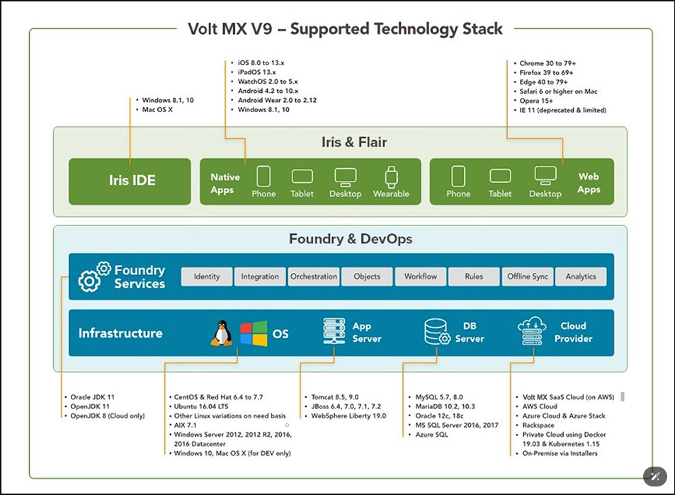

# 概述
这些主题为您提供有关 Volt MX Iris 支持的设备、操作系统和浏览器的信息，并使您能够在 Macintosh 和 Windows 上安装 Volt Iris。

# Volt MX Iris - 支持的操作系统、设备和浏览器指南
Volt MX Iris 是一款功能强大且易于使用的集成开发环境 (IDE)，用于为多个平台开发、构建、测试、调试和部署全渠道数字应用程序 (app)，所有这些都来自单个代码库。 Volt MX Iris 使您能够快速开发数字应用程序，同时让您能够在需要时灵活地与后端服务集成。此外，您可以将最好的本机、Web 和混合环境集成到您的应用程序中。

## VoltMX Overview

## 本机应用程序支持的操作系统
Volt MX Iris 企业版 V9 支持以下操作系统：
* Apple iOS
* Apple Watch OS 苹果手表操作系统
* Google Android 谷歌安卓
* Google Android Wear 谷歌安卓穿戴设备
* Windows

## Volt MX AppPlatform 支持的设备
以下部分提供了 Volt MX Iris 支持本机应用程序的设备列表。
* iOS Platform  iOS平台
* Android Platform  安卓平台
* Windows Platform  Windows平台

## 支持的开发语言
JavaScript 是在所有其他平台上构建新应用程序所需的开发语言。

## Volt MX Iris 支持的桌面 Web 浏览器
* Microsoft Edge
* Mozilla Firefox
* Safari
* Chrome
* Opera

## Volt MX Iris 支持的 HTML5 单页应用程序 (SPA) 版本
略

# 在 Macintosh 上安装 Volt Iris

# 在 Windows 上安装 Volt Iris

## 先决条件

## 安装 Volt MX Iris 
### 配置 Iris 以使用代理服务器

## 安装后任务

## 更新 Volt MX Iris 