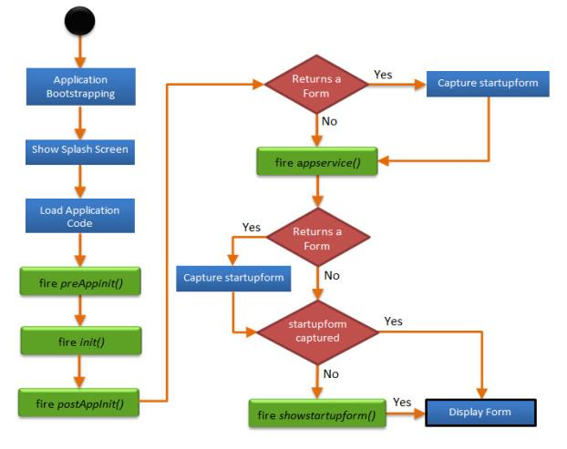

# 应用程序初始化事件
在应用程序的生命周期中，移动设备通常会触发多个事件。本章中的 API 允许您侦听这些事件，并使用应用程序特定的功能覆盖它们。

您应该在项目的 application load 事件或启动表单的 masterdataload 事件期间注册应用程序事件。本章由命名空间为 voltmx.application 的 API 组成。

开发人员使用此 API 来调用所有初始化事件，例如 preappinit、postappinit、init、appservice、showstartupform 等。

* preappinit[params]：这是开发人员在 IDE 中为每个应用程序注册的现有事件。此事件包含在表单、皮肤和任何其他应用程序初始化活动初始化之前需要执行的任何逻辑。例如，动态加载 i18n 资源包等。
* init[params]：init 由代码生成，由表单和皮肤初始化数据组成。
* postappinit[params]：是开发人员在 IDE 中按应用程序注册的现有事件。开发人员使用此函数来定义在显示第一个表单之前和初始化应用程序之后需要执行的逻辑。postAppinit 可以返回表单句柄。如果 postappinit 返回表单句柄，则平台会显示从 postappinit 回调返回的表单，否则平台将调用 showstartupform 函数。
* appservice[params]：针对 appservice 提供的 closure 会被平台按顺序调用。此函数还返回表单句柄。AppService 可以返回表单句柄。如果 appservice 返回表单句柄，则平台会显示从 appservice 回调返回的表单。如果 appservice 未返回表单句柄，则平台将调用 showstartupform 函数。如果 postappinit 和 appservice 都返回表单句柄，则平台将优先使用应用服务返回的表单。
* showstartupform[params]：这是平台调用的用于显示启动表单的方法，如 IDE 中所示。仅当 postappinit 返回 nil 时，才会调用此事件。如果 appservice 返回表单句柄，则不会调用 showstartupform。

