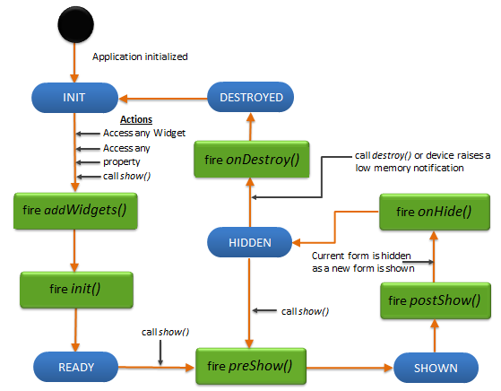

# FlexForm 小部件
FlexForm 是最顶部的容器小部件，通常是您添加到应用程序的第一个小部件。它充当屏幕上所有其他小部件的容器。通过支持多个 FlexForms 并允许用户在这些屏幕之间导航，您的应用可以支持多个屏幕。

## Layout 布局
略

## Animations 动画
略

## Form Lifecycle 表单生命周期
* init 初始化：在表单生命周期中仅调用一次，即当表单准备好其小组件层次结构时。
* onDestroy on销毁：指定在 FlexForm 被销毁时触发的事件。
* onHide on隐藏：指定一个事件，当窗体完全脱离视图时触发该事件。
* postShow post显示：postShow在显示表单后调用。
* preShow 预展：每次显示表单时，都会执行 preShow。

## Drawer Features 抽屉特点
略

## 滚动功能
略

## Data Management 数据管理
略

## 3D Touch 3D 触控
略

## User Input Handling 用户输入处理
略

## UI Appearance UI 外观
略

## Enabling RTL 启用 RTL
略

## Miscellaneous 杂项
略

## 所有小部件通用的配置
略

## FlexForms 编程
在早期版本的 Volt MX Iris 中，您使用 BoxForm、水平 （HBox） 和垂直 （VBox） 框作为容器来对齐小部件。这些小组件现已过时。

* FlexForm 允许您在任何地方放置和调整小部件的大小，并且可以在其上放置任意数量的小部件。它为您提供了小部件的绝对位置和尺寸。
* FlexForm 有两种布局类型：自由格式布局和流垂直布局。在自由格式布局中，小组件可以与其他小组件重叠。在 Flow Vertical Layout 中，小组件一个接一个地放置在另一个下方。
* FlexForm 会填充整个设备屏幕，但操作系统页眉和页脚除外。FlexForm 还可以显示标题栏（或在 iOS 中称为应用程序栏）。此栏将显示在表单的顶部。
* FlexContainer 通常用于在 FlexForm 中添加另一个组织级别。

### Form stacking 表单堆叠
通常，一个表单是为了响应用户在另一个表单上的操作而显示的。这意味着表单之间的导航是通过另一个表单上的事件发生的。所有导航操作都应推送到堆栈中以跟踪导航路径，以便用户可以按照与其向前导航完全相反的顺序导航回前面的表单。当导航到堆栈中已有的表单时，通过将上述所有表单从堆栈中弹出，将目标表单带回堆栈的顶部。

### FlexForm 生命周期
表单被定义为具有在适当事件时被调用的生命周期方法。通过这些事件，您可以管理应用程序以更好地处理资源。

以下是表单的生命周期方法：
* addWidgets - 首次使用表单时调用: 用于访问其小部件，访问其属性，用于通过 show 方法显示表单，对于调用表单的任何其他方法。
* init - 在 addWidgets 事件后立即调用表单所需的任何初始化。Init 初始化表单和任何 widget。
* preShow - 在屏幕上显示表单之前调用。可以通过显式调用表单的 show 方法来使表单可见。
* postShow - 在屏幕上显示表单后立即调用。通过显式调用表单的 show 方法，表单是可见的。
* onHide - 当表单离开屏幕时调用。当要显示另一个表单时，一个表单可以离开屏幕。
* onDestroy - 销毁表单时调用。当开发人员显式调用 destroy 时，表单将被销毁，并且此事件在销毁表单之前被调用。

> [应用程序初始化事件](./ApplicationInitializationEvents.md)



### 使用构造函数创建表单
```
var form1 = new voltmx.ui.Form2(basicConf, layoutConf, pspConf);
```

* basicConf 是具有基本属性的对象。
* layoutConf 是具有布局属性的对象。
* pspConf 是具有平台特定属性的对象。

### 使用导航抽屉
Navigation Drawer 或 “Hamburger menu” 是 Android 平台的原生功能，在 Iris 中使用 FlexForm 的 Navigation Drawer 属性受支持。此功能仅适用于 Android，因此，如果您打算支持其他平台，最好使用跨平台功能实现您自己的此控件版本。

Navigation Drawer 在 Iris 中使用模板进行选择。无法以编程方式添加它。