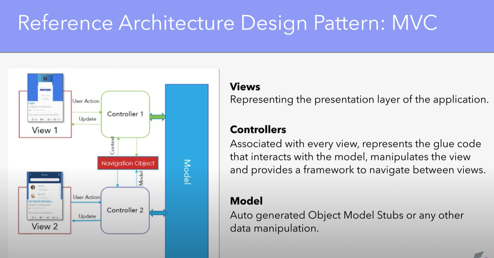
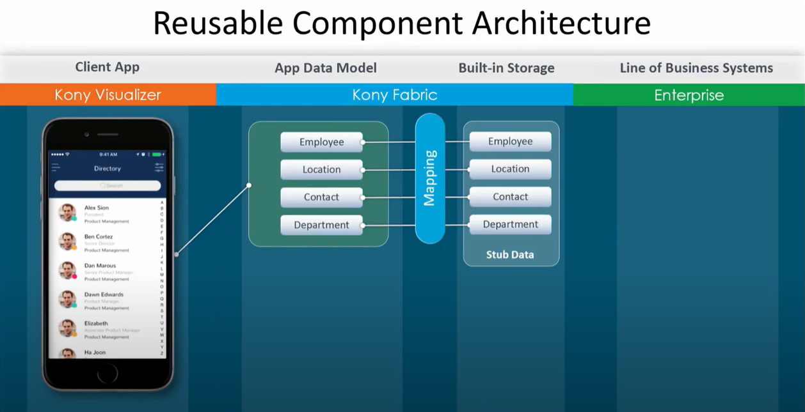
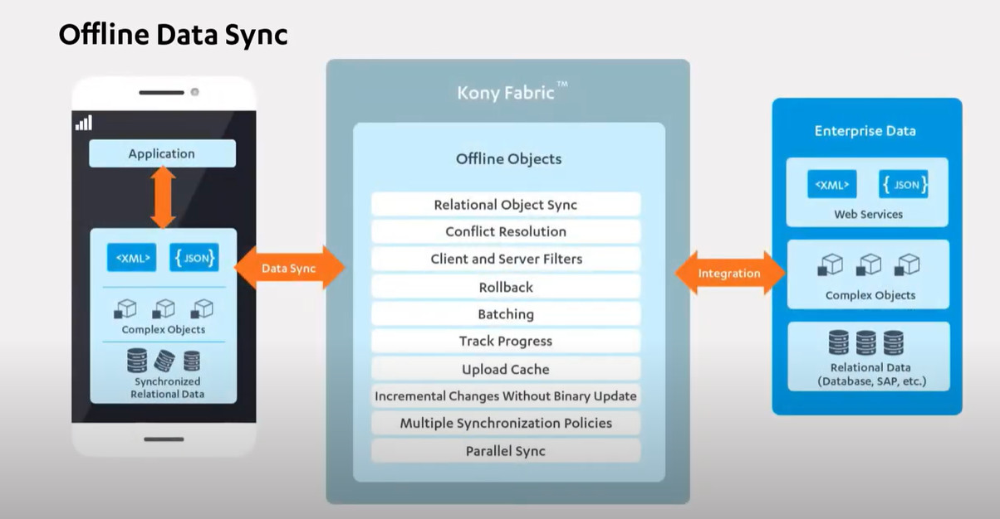
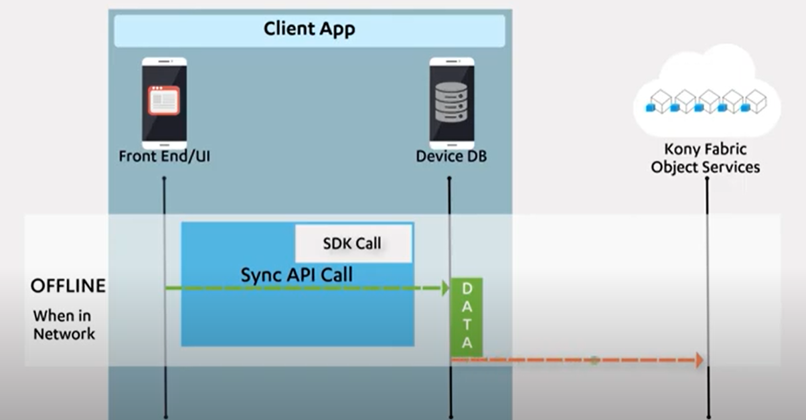
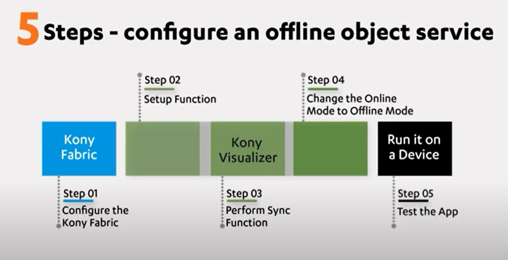

## [官方视频来一个](https://www.youtube.com/playlist?list=PLO1FhEmDMTzYqO4ZVBLXYBOpXMHZ2EFVK)
### 网络支持教程
本教程介绍了使用Volt MX Iris创建响应式Web应用程序的概念，可以在不同设备或屏幕尺寸上良好展示，并通过可视化画布进行设计和布局，同时支持运行时的自定义及响应性反馈。

### 参考架构介绍
参考架构基于MVC范例，可以帮助创建模块化应用程序，提高资源利用率，并在不同平台复用代码。  

参考架构基于MVC模式，包括三层：视图、模型和控制器。
* 视图层提供用户与应用程序交互的界面。
* 模型层是后端实体和操作。
* 控制器充当模型和视图之间的联络人。
* 在Volt MX上下文中，视图由一个表单表示，只能由相应的控制器访问。
* 每个表单有两个控制器，即表单控制器和动作控制器。
* 如果一个控制器需要将上下文传递给另一个控制器，则可以使用导航对象。

### 了解皮肤
这个视频介绍了如何使用皮肤在Iris中创建原生的多通道应用程序设计，以及如何创建、管理和组织皮肤，以及一些有用的工具和技巧。  

* Skins 用于定义 Volt MX 应用程序中的小部件外观。
* Skins 可以根据小部件的状态应用，例如在静止、获取焦点或按下时。
* Skins 是通道独立的，可以为 iOS、Android、Windows 和 Web 以及手机、平板和桌面定义不同的属性。

### 使用 Named Actions
本教程介绍了在 Volt MX Iris 中使用命名动作来构建可在应用程序中重用的动作序列。  
命名动作是一种功能，允许用户构建可以在项目中的小部件之间重用的动作序列。  
可以通过将命名动作与小部件的事件关联来实现重用。  

### Iris JavaScript 简介
这个视频介绍了如何在 Volt MX Iris 中使用 JavaScript 开发语言来创建多通道移动应用程序。

### 介绍 Action Editor
本教程介绍了 Action Editor ，可以通过将动作序列与事件关联来实现交互体验，无需编写任何代码，包括表单导航、条件操作和动画效果。

* 用户可以通过右键单击按钮并关联动作序列来为应用程序添加交互性。
* Action Editor 提供了一组预定义的动作，可以根据需要选择。
* 用户可以使用 Action Editor 创建导航动作，实现页面之间的跳转。
* Action Editor 还支持复杂的条件逻辑。

### 提交组件到市场
本视频将帮助您了解将可视化组件提交到Koni市场的过程，包括所需的资产和信息以及提交后的审核流程。  
该视频介绍了在发布组件之前需要准备的元信息，如简要说明、唯一特点、动态图像和视频等。  
最后，视频演示了成功提交组件后的审核和发布流程。  

### 介绍 V8.0
本视频介绍了Koni App平台V8的概述、应用市场、和组件模型，展示了通过导入样例应用和组件来构建应用的过程，并演示了可配置的组件和中间件服务的使用。

### iPad Popover FV
iPad Popover FV 是一种特别设计用于 iPad 的视图，用于以弹出窗口的方式显示信息，并且不会覆盖整个屏幕，通过轻触窗口外部可以关闭弹出窗口，可以帮助开发人员将设备特定功能集成到移动应用程序中。

### Visualizer Enterprise
在本教程中，我们将介绍Visualizer企业版的变化，包括能够将应用程序集成到移动平台和为各种平台生成应用程序二进制文件的额外工具。  
Visualizer企业版还允许用户使用xcode、android和windows sdk的模拟器构建和预览应用程序。

### Device Calendar FV
这是一个关于安全银行交易和日历特殊功能的设备的视频。

### Private Marketplace
私人市场是一个视频订购平台，提供私人和公共视频内容，并有订阅和上传选项。  
视频介绍了私人市场的功能和特点，包括地址收藏、企业特性和私人限制等。  
观看视频可以了解私人市场如何操作以及上传和订阅选项。

### Introduction to Marketplace
这个视频介绍了如何从Koni Visualizer访问市场，浏览、下载和使用不同类型的资产以及添加组件到应用程序中。  
市场提供了各种组件、代码模块和数据适配器，方便用户快速定制和定位所需功能。  
通过简单的操作，用户可快速将组件添加到应用中并自定义每个组件以满足需求。

Marketplace提供了有用的代码模块，可以快速将常用代码添加到您的应用程序中。
* 数据适配器允许您快速将后端服务从移动织物暴露给可视化器应用程序。
* Kony提供示例数据模型，帮助将您的应用程序与后端系统连接，例如银行解决方案和商业后端。
* 可以从市场库中下载组件并将其添加到应用程序中，类似于常规小部件。
* 您可以更改和使用每个组件的属性和操作，以满足您的需求。

### Network API HT
这个教程介绍了Koni网络API的使用方法，包括发送HTTP请求、初始化请求对象、取消网络操作等。  
使用Koni API构建的示例应用程序可以通过API密钥从pipl.com获取数据，并显示在应用程序中。  
用户可以在应用中输入姓名，调用pipl.com的API，获取搜索结果并展示。

### SFPipelineAppV2
略

### 使用 Marketplace 中的数据适配器
略

### Getting Started with Volt MX Iris
这个视频教程将帮助你快速上手Visualizer 2.0，涵盖注册云帐户、安装软件、登录Visualizer以及介绍几个基本功能的内容。  
从Koni网站注册云帐户并请求试用后，可下载Visualizer软件开始使用。  
Visualizer具有项目面板、控件拖放和屏幕布局等功能，可进行UI设计和原型建设，适用于移动设备和web。

### Configuration of an Offline Object
在这个视频中，你将学习到离线对象的定义、离线对象服务的架构和配置以及离线对象的同步功能。离线对象是解决应用在离线工作时同步问题的解决方案，它通过在移动设备上下载对象的数据来实现数据的同步，并在设备重新连接网络时与后端进行同步。离线对象通过仅同步变化的数据而不是整个应用数据来优化数据传输，并提供本地数据库与后端数据库一致性的维护。

### Photoshop 转换扩展
本教程介绍了如何使用Photoshop CC的iris扩展将现有的Photoshop设计转换为iris表单，并将所有图层和图层集转换为iris小部件和样式。  
通过下载和安装Volt MX iris扩展，你可以在Photoshop中使用这一功能。  
导出后的项目可以在iris中打开，并根据配置将Photoshop图层转换为容器或小部件。

### Segment Widget – Introduction
该视频介绍了Segment Widget，它是一个常用的UI组件，用于显示列表或数据页面，并提供容器和模板来定义每行的样式和数据。

### 