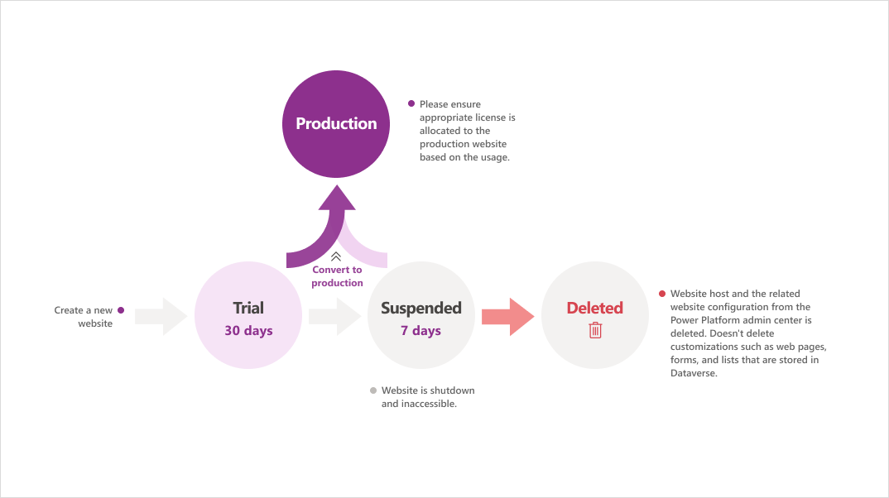

# 概述
## 什么是 Power Pages
略

## Power Pages 功能
* 简化制作者的创作体验
* 设计工作室
* 响应式渲染
* 为专业开发人员提供高级开发功能
* 安全与治理
* 与其他 Microsoft Power Platform 组件集成

## Power Pages 架构
### Power Pages 架构
* 内容分发网络（CDN）
* 网络应用防火墙（WAF）
* Power Pages 网站部署
  * Azure 流量管理器
  * 应用服务器
  * Dataverse  数据集

### Power Pages 生命周期
* 理解网站生命周期阶段
* 试用网站
* 网站暂停服务
* 已删除的网站

以下是内容以表格形式呈现：

| **类型**     | **环境** | **过期时间**                        |
| ------------ | -------- | ----------------------------------- |
| **试用形式** | 生产环境 | 90 天后过期                         |
|              | 沙盒环境 | 90 天后过期                         |
|              | 试用环境 | 30 天后过期（或试用环境过期时过期） |
| **生产形式** | 生产环境 | 无过期时间                          |
|              | 沙盒环境 | 无过期时间                          |

注释：
1. 过期后，网站将被暂停并关闭。暂停后 7 天，试用网站主机将被删除。

### 了解 Power Pages 如何与 Microsoft Dataverse 连接
* 服务器到服务器连接
* 与 Dataverse 的集成
* 迁移到应用程序用户

### 立即并清除服务器端缓存
