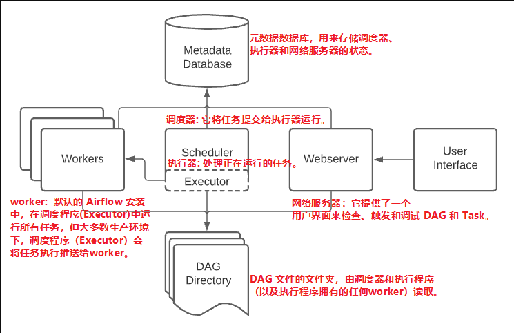

# 架构
## 架构概述
* Airflow 是一个可让您构建和运行工作流程的平台。工作流表示为 DAG（有向无环图），并包含称为任务的各个工作片段，并根据依赖关系和数据流进行排列。
* DAG 指定任务之间的依赖关系，以及执行它们和运行重试的顺序； 任务本身描述了要做什么，无论是获取数据、运行分析、触发其他系统，还是更多。

* 大多数执行器通常还会引入其他组件，让它们与它们的工作人员交谈——比如任务队列——但你仍然可以将执行器及其工作人员视为整个 Airflow 中的单个逻辑组件，处理实际的任务执行。
* Airflow 不关心运行的实际内容, 它主要负责编排运行。

## 工作负载
一个 DAG 贯穿一系列任务，您将看到三种常见的任务类型：

* Operator，预定义的任务，您可以将它们快速串在一起以构建 DAG 的大部分。
* Sensors 是 Operator 的一个特殊子类，它等待外部事件发生的。
* @task 修饰的 TaskFlow，它是一个打包为任务的自定义 Python 函数。

在内部，这些实际上都是 Airflow 的 BaseOperator 的子类，Task 和 Operator 的概念在某种程度上可以互换，但将它们视为单独的概念很有用 - 本质上，Operators 和 Sensors 是模板，当您在 DAG 文件中调用它们时 ，它作为一个任务。

## 控制流
DAG被设计为可以多次运行，并且它们的多次运行可以并行发生。任务具有相互声明的依赖关系。

## 用户界面
Airflow 附带一个用户界面，可让您查看 DAG 及其任务正在执行的操作、触发 DAG 的运行、​​查看日志以及对 DAG 进行一些有限的调试和问题解决。