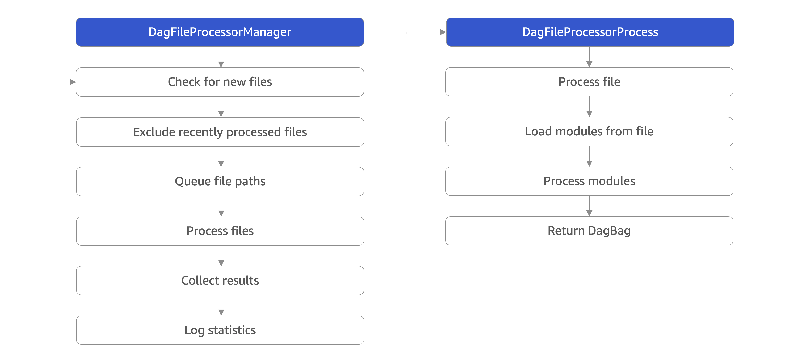

# Scheduler (调度器)
Airflow 调度程序监控所有任务和 DAG，然后在它们的依赖关系完成后触发任务实例。
要启动调度程序，只需运行以下命令：
```
airflow scheduler
```
* 调度程序在开始日期之后的一个 schedule_interval 时间间隔结束时运行您的作业。

## DAG 文件处理
Airflow Scheduler 负责将 DAGs 文件夹中包含的 Python 文件转换为包含待调度任务的 DAG 对象。DAG 文件处理涉及两个主要组件。
* DagFileProcessorManager 是一个执行无限循环的进程，它确定需要处理哪些文件。
  * 检查新文件
  * 排除最近处理的文件
  * 队列化文件路径
  * 处理文件
  * 收集结果
  * 日志统计
* DagFileProcessorProcess 是一个单独的进程，它启动后将单个文件转换为一个或多个 DAG 对象。
  * 处理文件
  * 加载 Python 模块
  * 在 Python 模块中查找 DAG 对象
  * 向 DagFileProcessorManager 提供已发现的 DAG 对象的列表


## 使用未来日期触发 DAG
如果您想使用 “外部触发器” 来运行未来日期的数据间隔，请在 airflow.cfg 的调度程序部分中设置 allow_trigger_in_future = True。这仅在您的 DAG 没有 schedule_interval 时才有效。

## 运行多个调度程序
Airflow 支持同时运行多个调度程序——出于性能原因和弹性考虑。
### 概述
### 数据库要求

## 微调您的调度程序性能
调度器负责两个操作：这两个任务由调度程序并行执行，并在不同进程中彼此独立运行。
* 不断解析 DAG 文件并与数据库中的 DAG 同步
* 连续调度任务执行
### 什么影响调度程序的性能
* 可调配类型: 
  * 文件系统类型（影响连续读取 DAG 的性能）
  * 文件系统快慢
  * 内存
  * CPU
  * 网络吞吐量
* DAG 结构:
  * 有多少 DAG 文件
  * 一个文件中有多少 DAG
  * DAG 文件有多大
  * 它们有多复杂
  * 解析 DAG 文件是否涉及导入大量库或在顶层进行繁重的处理
* 调度器配置:
  * 有多少调度器
  * 调度程序中有多少个解析进程
  * 调度程序在重新解析同一个 DAG 之间等待多少时间
  * 一个循环中调度程序处理多少个任务实例
  * 每个循环应该创建/安排多少新的 DAG 运行
  * 调度程序应该多久执行一次清理
### 如何接近 Scheduler 的微调
### 哪些资源可能会限制调度程序的性能
### 你能做什么来提高调度程序的性能
### 调度程序配置选项