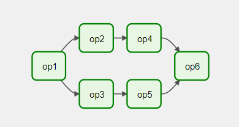

# DAGs
DAG （有向无环图）是 Airflow 的核心概念，将任务收集在一起，按照依赖关系和关系进行组织，以说明它们应该如何运行。DAG 本身并不关心任务内部发生了什么；它只关心如何执行任务, 运行任务的顺序、重试任务的次数、任务是否超时等等。

## 声明 DAG
可以通过三种方式声明 DAG:
1. 使用上下文管理器, 将 DAG 隐式添加。
```
with DAG(
    "my_dag_name",
    start_date=pendulum.datetime(2021, 1, 1, tz="UTC"),
    schedule_interval="@daily",
    catchup=False
) as dag:
    op = DummyOperator(task_id="task")
```
2. 使用标准构造函数，将 dag 传递给您使用的任何 operators。
```
my_dag = DAG(
    "my_dag_name",
    start_date=pendulum.datetime(2021, 1, 1, tz="UTC"),
    schedule_interval="@daily",
    catchup=False
)
op = DummyOperator(task_id="task", dag=my_dag)
```
3. 使用@dag装饰器将函数转换为 DAG 生成器。
```
@dag(
    tart_date=pendulum.datetime(2021, 1, 1, tz="UTC"),
    schedule_interval="@daily",
    catchup=False
)
def generate_dag():
    op = DummyOperator(task_id="task")

dag = generate_dag()
```
---
任务依赖: Task / Operator 通常不会独自存在；它依赖于其他任务（它的上游），而其他任务依赖于它（它的下游）。声明任务之间的这些依赖关系构成了 DAG 结构（有向无环图的边）。
1. 使用 >> and << 运算符：
```
first_task >> [second_task, third_task]
third_task << fourth_task
```
2. 使用更明确的set_upstream和set_downstream方法：
```
first_task.set_downstream(second_task, third_task)
third_task.set_upstream(fourth_task)
```
  
3. 如果你想让两个任务列表相互依赖，你需要使用cross_downstream：
```
from airflow.models.baseoperator import cross_downstream

# Replaces
# [op1, op2] >> op3
# [op1, op2] >> op4
cross_downstream([op1, op2], [op3, op4])
```
  
4. 想将依赖链接在一起，你可以使用chain：
```
from airflow.models.baseoperator import chain

# Replaces op1 >> op2 >> op3 >> op4
chain(op1, op2, op3, op4)

# You can also do it dynamically
chain(*[DummyOperator(task_id='op' + i) for i in range(1, 6)])
```
  
5. Chain 还可以对相同大小的列表进行成对依赖（这与 !所做的交叉依赖cross_downstream不同）：
```
from airflow.models.baseoperator import chain

# Replaces
# op1 >> op2 >> op4 >> op6
# op1 >> op3 >> op5 >> op6
chain(op1, [op2, op3], [op4, op5], op6)
```
  

## 加载 DAG
Airflow 从 Python 源文件（DAG_FOLDER）加载 DAG，获取每个文件，执行，然后从该文件加载 DAG 对象。
* 每个 Python 文件可以定义多个 DAG，甚至可以使用导入将一个非常复杂的 DAG 分布到多个 Python 文件中。
* 但请注意，当 Airflow 从 Python 文件加载 DAG 时，它只会拉取顶层的对象。
* 发现 DAG 时，默认会忽略文件中不包含字符串 “DAG” 和 “airflow” 的文件。
* 您还可以在您的 DAG_FOLDER 或其任何子文件夹中提供一个 .airflowignore 文件，该文件描述加载程序要忽略的文件。

## 运行 DAG
DAG 将以以下两种方式之一运行：
* 当它们被手动或通过 API 触发时。
* 在定义的时间表上。

## DAG 赋值
## 默认参数
通常，DAG 中的许多 Operator/Task 需要相同的一组默认参数（例如它们的retries）。不必为每个 Operator/Task 单独指定，您可以在创建 DAG 时将 default_args 传递给 DAG，DAG 会自动将它们应用到与其绑定的任何 Operator/Task。

## DAG 装饰器
除了使用传统 上下文管理器 或 构造函数 DAG() 声明 DAG 的方式外，您还可以使用 @dag 修饰函数以将其转换为 DAG 生成器。
* Airflow 只会加载出现在 DAG 文件顶层的 DAG。这意味着您不能只声明一个函数 @dag 您还必须在 DAG 文件中至少调用一次并将其分配给顶级对象，

## 控制流
默认情况下，DAG 任务只有在它依赖的所有任务都成功时才会运行。但是，有几种修改方法：

## 动态 DAG
## DAG 可视化
## DAG 和 TASK 文档
## SubDAGs
## TaskGroups vs SubDAGs
## 打包 DAG
## .airflowignore
## DAG 依赖项