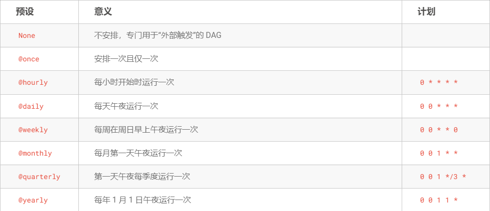
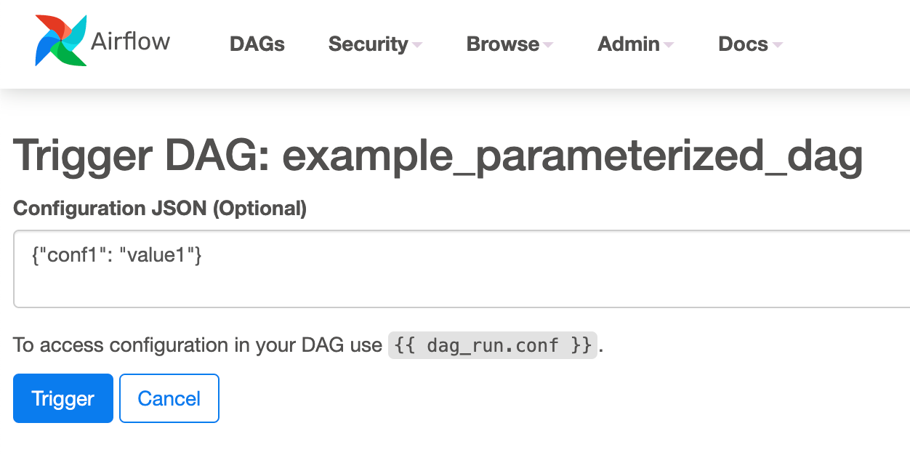

# DAG Runs
DAG Run 是一个代表 DAG 及时实例化的对象。每当执行 DAG 时，都会创建 DAG Run 并执行其中的所有任务。DAG 运行的状态取决于任务状态。每个 DAG Run 都独立运行，这意味着您可以同时运行 DAG 多次。

## DAG 运行状态
DAG 运行状态在 DAG 执行完成时确定。DAG 的执行取决于其包含的任务及其依赖关系。当所有任务都处于其中一个终端状态（即，如果没有可能转换到另一个状态）时，状态将分配给 DAG Run，例如success，failed 或 skipped。DAG Run 的状态是根据所谓的 “叶节点” 或简称为 “叶子” 分配的。叶节点是没有孩子的任务。
### DAG 运行有两种可能的终止状态：
* success: 如果所有叶节点状态都是 success 或 skipped。
* failed: 如果任何叶节点状态是 failed 或 upstream_failed。

## Cron 预设
每个 DAG 可能有也可能没有时间表，该时间表告知 DAG 如何创建运行。schedule_interval 被定义为 DAG 参数，可以将其作为 [cron](https://crontab.guru/) 表达式, datetime.timedelta 对象或以下 cron “预设” 之一传递。


### 数据间隔
在 Airflow 中运行的每个 DAG 都有一个指定的“数据间隔”，代表它运行的时间范围。DAG 运行通常安排在其关联的数据间隔结束后，以确保运行能够收集该时间段内的所有数据。换句话说，覆盖2020-01-01数据周期的运行一般要到2020-01-01结束，即2020-01-02 00:00:00之后才开始运行。
* Airflow 中的所有日期都以某种方式与数据间隔概念相关联。例如，DAG 运行的 “逻辑日期”（在 2.2 之前的 Airflow 版本中也称为 execution_date）表示数据间隔的开始，而不是 DAG 实际执行的时间。
* start_date 标志着 DAG 的第一个数据间隔的开始，而不是 DAG 中的任务开始运行的时间。换句话说，DAG 运行只会安排在 start_date 之后一个时间间隔。

## 重新运行 DAG
### Catchup
默认情况下，调度程序将为自上一个数据间隔（或已清除）以来未运行的任何数据间隔启动 DAG 运行。这个概念称为追赶。
* 想要关闭 catchup。这可以通过设置 DAG 构造参数 catchup = False 或在配置文件中设置 catchup_by_default = False 来完成。关闭时，调度程序仅为最近的时间间隔创建 DAG 运行。

### Backfill
在某些情况下，您可能希望在指定的历史时期内运行 DAG. 
```
airflow dags backfill \
    --start-date START_DATE \
    --end-date END_DATE \
    dag_id
```
backfill 命令将在开始日期和结束日期内的所有时间间隔内重新运行 dag_id 的所有实例

### 重新运行任务
某些任务可能会在计划运行期间失败。在查看日志后修复错误后，您可以通过在计划日期清除它们来重新运行任务。清除任务实例不会删除任务实例记录。单击 树视图 或 图形视图 中的失败任务，然后单击清除。执行者将重新运行它。  
您可以选择多个选项来重新运行
* Past: 在 DAG 的最近数据间隔之前运行的所有任务实例
* Future: 在 DAG 的最近数据间隔之后运行的所有任务实例
* Upstream: 当前 DAG 中的上游任务
* Downstream: 当前 DAG 中的下游任务
* Recursive: 子 DAG 和父 DAG 中的所有任务
* Failed: 只有 DAG 最近运行中失败的任务
您还可以使用以下命令通过 CLI 清除任务：
```
airflow tasks clear dag_id \
    --task-regex task_regex \
    --start-date START_DATE \
    --end-date END_DATE
```
对于指定的 dag_id 和 时间间隔，该命令会清除与正则表达式匹配的所有任务实例。

## 外部触发
请注意，也可以通过 CLI 手动创建 DAG 运行。只需运行命令:
```
airflow dags trigger --exec-date logical_date run_id
```
您还可以使用 Web UI 手动触发 DAG Run(tab DAGs -> column Links -> button Trigger Dag)
### 触发 dags 时传递参数
* 使用 CLI
```
airflow dags trigger --conf '{"conf1": "value1"}' example_parameterized_dag
```
* 使用界面


## 要牢记
* 可以通过 UI 将任务实例标记为失败。这可用于停止运行的任务实例。
* 可以通过 UI 将任务实例标记为成功。