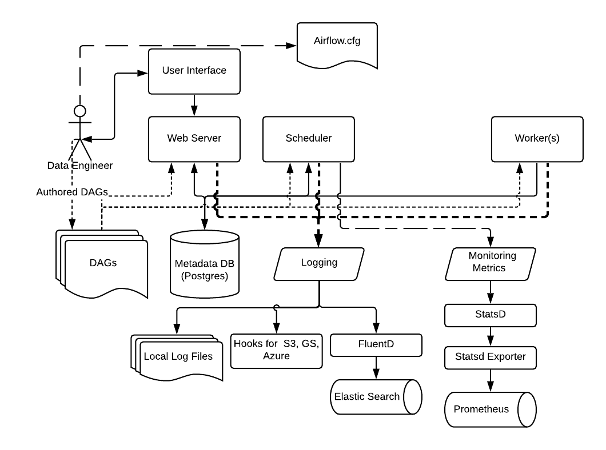

# 记录和监控
由于数据管道通常在没有任何人工监督的情况下运行，因此可观察性至关重要。

## 日志记录和监控架构

## 记录任务
Airflow 允许您在 Airflow UI 中分别查看每个任务的日志。Core Airflow 也实现了在本地写入日志。您也可以通过社区提供商将日志写入远程服务，或者编写您自己的记录器。
### 本地写入日志
* 您可以使用 base_log_folder 指定在 airflow.cfg 中放置日志文件的目录。 默认情况下，日志放在 AIRFLOW_HOME 目录中。
* 命名日志时遵循以下约定：{dag_id}/{task_id}/{logical_date}/{try_number}.log
* 此外，您可以提供一个远程位置来存储当前日志和备份。在 Airflow UI 中，当启用远程日志记录时，远程日志优先于本地日志。如果无法找到或访问远程日志，将显示本地日志。
请注意，只有在任务完成（包括失败）后，日志才会发送到远程存储。
### 故障排除
* 如果要检查日志当前设置了哪个任务处理程序，可以使用 airflow info 命令。
* 您还可以运行 airflow config list 来检查日志记录配置选项是否具有有效值。
### 高级配置
并非所有配置选项都可从 airflow.cfg 文件中获得。一些配置选项可以通过日志配置类进行覆盖。这可以通过 airflow.cfg 文件中的 logging_config_class 选项来完成。
### 外部链接
### 服务工人的日志
大多数任务处理程序在任务完成时发送日志。

## 指标
Airflow 可以设置向 StatsD 发送指标数据。
### 设置
### 计数器
### 仪表
### 定时器

## 回调
日志记录和监控的一个重要组成部分是使用任务回调来根据给定任务或给定 DAG 中所有任务的状态变化采取行动。
### 回调类型, 有五种类型的任务事件可以触发回调处理：
|  Name   | Description  |
|  ----  | ----  |
| on_success_callback  | 任务成功时调用 |
| on_failure_callback  | 任务失败时调用 |
| sla_miss_callback  | 当任务未达到其定义的SLA时调用 |
| on_retry_callback  | 当任务重试时调用 |
| on_execute_callback  | 在任务开始执行之前调用 |

## 检查气流健康状态
Airflow 有两种检查组件健康状况的方法——HTTP 检查和 CLI 检查。所有可用的检查都可以通过 CLI 访问，但由于被检查组件的角色和用于监视部署的工具，只有一些检查可以通过 HTTP 访问。
### 健康检查端点
要检查您的 Airflow 实例的健康状态，您只需访问端点即可 /health。
### CLI 检查调度程序
### CLI 检查数据库
要验证数据库是否正常工作，您可以使用 airflow db check 命令。失败时，该命令将以非零错误代码退出。
### Celery 集群的 HTTP 监控
### CLI 检查芹菜工人

## 错误追踪
Airflow 可以设置为向Sentry发送错误。
### 设置
### 标签
### 面包屑
### Sentry 对传递给 Subprocess Hook 的环境变量的影响

## 跟踪用户活动
您可以配置 Airflow 以将匿名数据路由到 Google Analytics、 Segment或Metarouter。