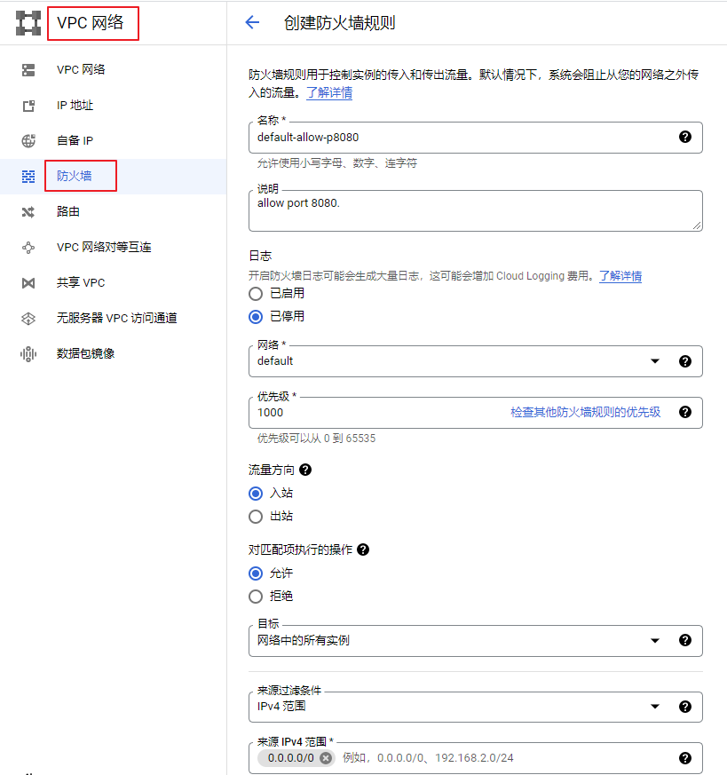
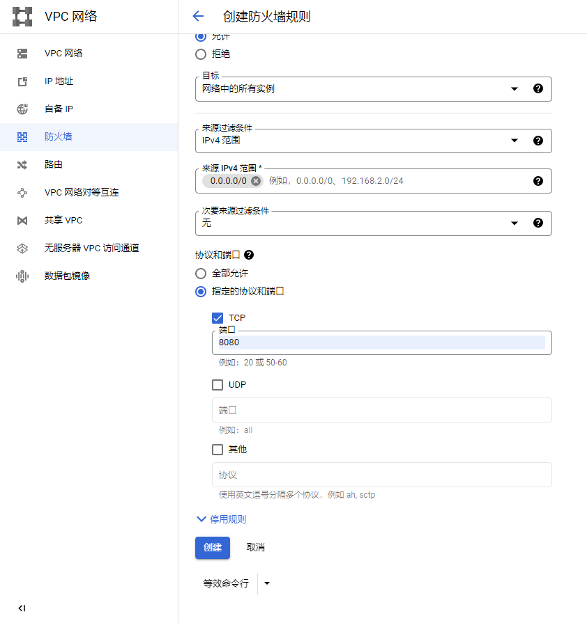

# 在本地运行airflow
AriFlow要运行在Linux上。利用 GCE 创建一台Linux。
[Running Airflow locally](https://airflow.apache.org/docs/apache-airflow/stable/start/local.html)

* sudo apt-get install python3-pip 安装pip
* export AIRFLOW_HOME=~/airflow 定义 airflow 环境变量

* AIRFLOW_VERSION=2.2.5
* PYTHON_VERSION="$(python3 --version | cut -d " " -f 2 | cut -d "." -f 1-2)"
* CONSTRAINT_URL="https://raw.githubusercontent.com/apache/airflow/constraints-${AIRFLOW_VERSION}/constraints-${PYTHON_VERSION}.txt"

* sudo pip install "apache-airflow==${AIRFLOW_VERSION}" --constraint "${CONSTRAINT_URL}" 安装 AirFlow

* airflow db init 初始化数据库
* 创建用户
```
airflow users create \
     --username admin \
     --firstname hao \
     --lastname zh \
     --role Admin \
     --email haozhenhua674@gmail.com
```
* pw -> 123456
* airflow webserver --port 8080 -D 以后台模式启动airflow的webserver。
* airflow scheduler -D 以后台模式启动scheduler

* 注意点: 这里要注意，需要创建一个新的防火墙规则，允许所有IP地址可以访问网络中的所有实例的8080端口
  
  

* echo "export AIRFLOW_HOME=/home/xxx/airflow" >> ~/.bashrc 配置 ariflow 永久环境变量

* shutdown airflow
  - ps aux | grep airflow
  - ps aux | grep airflow-webserver
  - kill -9 7943 master的id