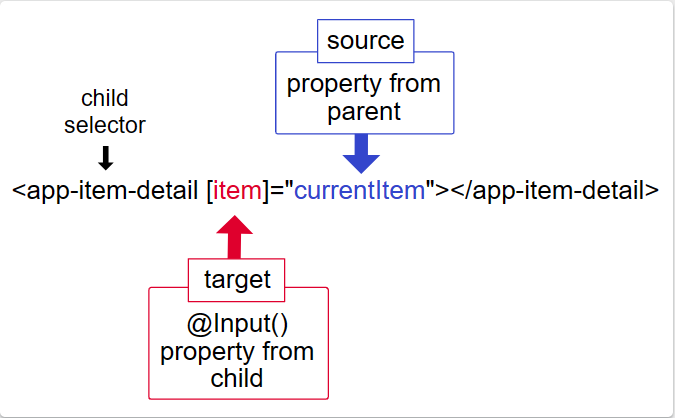
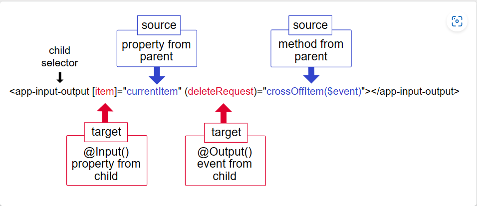

# Overview 概述
组件是 Angular 应用程序的主要构建块。每个组件包括：
* 声明页面上呈现内容的 HTML 模板
* 定义行为的 TypeScript 类
* 定义如何在模板中使用组件的 CSS 选择器
* （可选）应用于模板的 CSS 样式

## 先决条件
略

## 创建组件
创建组件的最佳方法是使用 Angular CLI。您也可以手动创建组件。  
### 使用 Angular CLI 创建组件
要使用 Angular CLI 创建组件：要使用 Angular CLI 创建组件：运行 ng generate component *component-name* 命令，其中 *component-name* 是新组件的名称。
### 手动创建组件
略

## 指定组件的 CSS 选择器
略

## 定义组件的模板
略

## 声明组件的样式
略

# Component lifecycle 组件生命周期
Angular 组件的生命周期是指在组件从创建到销毁的整个过程中，Angular 框架提供的一系列钩子函数，允许你在不同的时机插入自定义代码。这些钩子函数可以用于执行各种任务，如初始化、数据加载、DOM 操作、清理等。  
## 先决条件
略

## 响应生命周期事件
### 生命周期事件序列
在您的应用程序通过调用其构造函数来实例化组件或指令后，Angular 会调用您在该实例生命周期中的适当点实现的钩子方法。  
### ngOnChanges
ngOnChanges() 是 Angular 组件生命周期中的一个钩子函数，子组件用于监测每个输入属性（@Input）（也就是父组件的属性）的变化。它会在子组件的输入属性发生变化时被触发，允许你在属性变化时在子组件中执行相应的操作。  

### ngOnInit
ngOnInit() 是 Angular 组件生命周期中的一个钩子函数，它在组件初始化完成后被调用。在该钩子函数中，你可以执行初始化数据、订阅数据、进行一次性的 DOM 操作等。  

### ngDoCheck
Angular 的变更检测机制关注于组件属性、输入属性、模板表达式、Observable 和异步操作等与数据相关的对象，以及通过 ngDoCheck() 钩子函数实现的自定义检测逻辑。这些对象共同构成了 Angular 变更检测的范围。  
ngDoCheck() 是 Angular 组件生命周期中的一个钩子函数，它在每次变更检测周期中被调用。它允许你监测和响应组件的数据变化，以及手动触发变更检测。在第一次运行 ngOnInit() 之后也会立即调用。ngDoCheck() 钩子函数通常用于执行一些高级的、自定义的变更检测逻辑。  

### ngAfterContentInit
内容投影（Content Projection），也称为内容插槽（Content Slots）或内容分发（Content Distribution），是 Angular 中一种强大的特性，允许你在一个组件中嵌入外部的内容，以及在父组件中定义子组件的布局结构。内容投影通过 *ng-content* 标签来实现，它允许父组件将内容传递到子组件中，从而在子组件的特定位置显示这些内容。  
ngAfterContentInit() 是 Angular 组件生命周期中的一个钩子函数，它在组件的内容投影（Content Projection）初始化完成后被调用。内容投影是一种将父组件的内容嵌入到子组件中的技术，通常使用 *ng-content* 标签实现。

### ngAfterContentChecked
ngAfterContentChecked() 是 Angular 组件生命周期中的一个钩子函数，用于在内容投影的变更检测后执行操作。通过合理地使用 ngAfterContentChecked()，你可以在内容投影变更检测后执行相应的逻辑，以满足组件的需求。  

### ngAfterViewInit
ngAfterViewInit() 是 Angular 组件生命周期中的一个钩子函数，它在组件的视图初始化完成后被调用。在这个阶段，组件的视图已经初始化，但还没有添加到 DOM 中。这个钩子函数通常用于执行一次性的初始化操作，比如与视图相关的 DOM 操作、订阅事件等。

### ngAfterViewChecked
ngAfterViewChecked() 是 Angular 组件生命周期中的一个钩子函数，它在每次视图变更检测周期中，检测和更新视图后被调用。视图变更检测是 Angular 中用于检测组件数据的变化并更新视图的机制。  

### ngOnDestroy
ngOnDestroy() 是 Angular 组件生命周期中的一个钩子函数，它在组件即将被销毁时被调用。这个钩子函数允许你在组件被销毁前执行一些清理操作，比如取消订阅、释放资源等。

# 视图封装
在 Angular 中，组件的样式可以封装在组件的宿主元素中，这样它们就不会影响应用程序的其余部分。  
Component 装饰器提供 encapsulation 选项，可用于控制如何在每个组件的基础上应用封装。  
从以下模式中选择：
## ViewEncapsulation.ShadowDom
Angular 使用浏览器内置的 Shadow DOM API 将组件的视图包含在 ShadowRoot 内，用作组件的宿主元素，并以隔离的方式应用提供的样式。  
组件的样式仅添加到影子 DOM 宿主中，确保它们仅影响各自组件视图内的元素。

## ViewEncapsulation.Emulated
Angular 修改组件的 CSS 选择器，以便它们仅应用于组件的视图，不会影响应用程序中的其他元素，从而模拟 Shadow DOM 行为。有关更多详细信息，请参阅检查生成的 CSS。  
组件的样式被添加到文档的 *head* 中，使它们在整个应用程序中可用，但它们是带有“作用域”的样式。它们的选择器仅影响其各自组件模板内的元素。  
使用模拟视图封装的组件的元素附加了一些额外的属性，这些属性存在两种：
* _nghost：添加到包含组件视图的元素中，这些元素将是本机 Shadow DOM 封装中的 ShadowRoots。组件的宿主元素通常就是这种情况。
* _ngcontent：添加到组件视图内的子元素，它们用于将元素与其各自的模拟 ShadowRoot（具有匹配 _nghost 属性的宿主元素）进行匹配。

## ViewEncapsulation.None
Angular 不应用任何类型的视图封装，这意味着为组件指定的任何样式实际上都是全局应用的，并且可以影响应用程序中存在的任何 HTML 元素。此模式本质上与将样式包含到 HTML 本身中相同。  
组件的样式被添加到文档的 *head* 中，使它们在整个应用程序中可用，因此是完全全局的并影响文档中的任何匹配元素。  
Angular 还会将这些样式添加到所有 shadow DOM 宿主。因此，样式在整个应用程序中都可用。

    ViewEncapsulation.Emulated 和 ViewEncapsulation.None 组件的样式也会添加到每个 ViewEncapsulation.ShadowDom 组件的影子 DOM 宿主中。这意味着带有 ViewEncapsulation.None 的组件的样式会影响影子 DOM 中的匹配元素。

# 组件交互
本文包含了常见的组件通讯场景，也就是让两个或多个组件之间共享信息的方法。  

## 通过输入型绑定（@Input 装饰器）把数据从父组件传到子组件 
略

## 通过 setter 截听输入属性值的变化
略

## 通过 ngOnChanges() 来截听输入属性值的变化
略

## 父组件监听子组件的事件 
子组件暴露一个 EventEmitter 属性，当事件发生时，子组件利用该属性 emits(向上弹射)事件。父组件绑定到这个事件属性，并在事件发生时作出回应。  
子组件的 EventEmitter 属性是一个输出属性，通常带有 @Output 装饰器。  

## 父组件与子组件通过本地变量互动
父组件不能使用数据绑定来读取子组件的属性或调用子组件的方法。但可以在父组件模板里，新建一个本地变量来代表子组件，然后利用这个变量来读取子组件的属性和调用子组件的方法。

## 父组件调用 @ViewChild()
这个本地变量方法是个简单便利的方法。但是它也有局限性，因为父组件-子组件的连接必须全部在父组件的模板中进行。父组件本身的代码对子组件没有访问权。  
如果父组件的类需要读取子组件的属性值或调用子组件的方法，就不能使用本地变量方法。  
当父组件类需要这种访问时，可以把子组件作为 ViewChild，注入到父组件里面。

## 父组件和子组件通过服务来通讯
父组件和它的子组件共享同一个服务，利用该服务在组件家族内部实现双向通讯。  
该服务实例的作用域被限制在父组件和其子组件内。这个组件子树之外的组件将无法访问该服务或者与它们通讯。

# 组件样式
Angular 应用使用标准的 CSS 来设置样式。

## 使用组件样式
对你编写的每个 Angular 组件来说，除了定义 HTML 模板之外，还要定义用于模板的 CSS 样式、 指定任意的选择器、规则和媒体查询。  
实现方式之一，是在组件的元数据中设置 styles 属性。styles 属性可以接受一个包含 CSS 代码的字符串数组。

## 组件样式最佳实践
你应该将组件的样式视为该组件的私有实现细节。虽然 Angular 的默认样式封装可防止组件样式影响其他组件，但全局样式会影响页面上的所有组件。这包括 ::ng-deep，它会将组件样式提升为全局样式。

### 创作支持自定义样式的组件
1. 使用 CSS 自定义属性（推荐）  
    CSS 自定义属性（也称为 CSS 变量）是一种允许你在 CSS 中定义自己的变量，并在样式规则中引用这些变量的方法。自定义属性可以存储各种值，例如颜色、尺寸、字体等，使得样式表更具可维护性和灵活性。它们在不同选择器、规则和媒体查询中都可以使用，使得样式的调整变得更加方便。
2. 使用 @mixin 声明全局 CSS  
    @mixin 是一种在预处理器（如Sass或Less）中声明可重用样式块的方法，它类似于函数。
3. 使用 CSS ::part 自定义  
    ::part 是一个用于自定义 Shadow DOM 元素内部样式的伪元素选择器。
4. 提供 TypeScript API  
    要通过 TypeScript API 支持自定义样式的组件，你可以借助 Angular 的 Renderer2 服务来操作 DOM 元素并应用样式。

## 特殊的选择器
组件样式中有一些从影子（Shadow） DOM 样式范围领域引入的特殊选择器：

### :host
:host 代表当前组件的唯一属性标识。

### :host-context
用法不明

### 已弃用 /deep/、>>> 和 ::ng-deep
任何前面带有 ::ng-deep 的样式都会变成全局样式。

## 把样式加载进组件中
有几种方式把样式加入组件：
* 设置 styles 或 styleUrls 元数据
* 内联在模板的 HTML 中
* 通过 CSS 文件导入

### 元数据中的样式
给 @Component 装饰器添加一个 styles 数组型属性。

### 组件元数据中的样式文件
把外部 CSS 文件添加到 @Component 的 styleUrls 属性中以加载外部样式。

### 模板内联样式
可以直接在组件的 HTML 模板中写 <style> 标签来内嵌 CSS 样式。

### 模板中的 link 标签
你也可以在组件的 HTML 模板中写 <link> 标签。

### CSS @imports 语法
可以利用标准的 CSS @import 规则来把其它 CSS 文件导入到 CSS 文件中。URL 是相对于你正在导入的 CSS 文件的。

### 外部以及全局样式文件
angular.json 文件中的 styles 数组负责管理外部样式表。

### 非 CSS 样式文件
如果使用 CLI 进行构建，那么你可以用 sass 或 less 来编写样式，并使用相应的扩展名（.scss、.less）把它们指定到 @Component.styleUrls 元数据中。

# 在子指令和父指令和组件之间共享数据
## 把数据发送到子组件  

### 配置子组件
略

### 配置父组件
略

### 监视 @Input() 的变更
略

## 把数据发送到父组件
略

### 配置子组件
略

### 配置子组件的模板
略

### 配置父组件
略

### 配置父组件的模板
略

## 同时使用 @Input() 和 @Output()

# 内容投影
## 单插槽内容投影
略

## 多插槽内容投影
略

## 有条件的内容投影
用法不明

## 在更复杂的环境中投影内容
用法不明

# 动态组件
用法不明

## 动态组件加载
## 指令
## 加载组件
## 解析组件
## 公共的 AdComponent 接口
## 最终的广告栏

# Angular 元素
用法不明

## 使用自定义元素
### 工作原理
## 把组件转换成自定义元素
### 映射
## 自定义元素的浏览器支持
## 范例：弹窗服务
## 为自定义元素添加类型支持