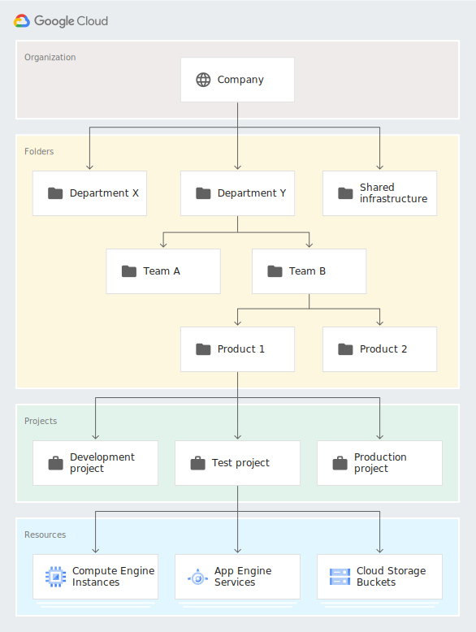
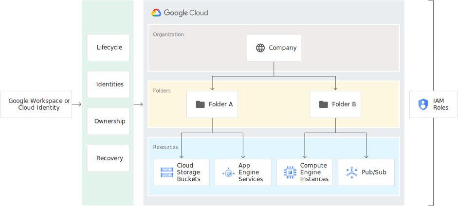

# 管理您的 Google Cloud 资源
# 快速入门
## 快速入门：使用组织
## 快速入门：实施限制

# 方法指南
## Resource Manager
### 管理项目
* 创建和管理项目。使用 Resource Manager API 和 Google Cloud Console 创建和管理 Google Cloud 项目。
* 项目名称未被任何 Google API 使用。您可以在项目创建期间或之后随时修改项目名称。项目名称不必是唯一的。
* 项目 ID 是一个唯一的字符串，用于区分您的项目与 Google Cloud 中的所有其他项目。您可以使用 Cloud Console 生成项目 ID，也可以选择自己的 ID。您只能在创建项目时修改项目 ID。
* 项目编号：系统为您的项目自动生成的唯一标识符。
* IAM 角色包含允许用户对 Google Cloud 资源执行特定操作的权限。
* 您可以为项目添加安全锁，以防止项目被删除，直到您移除该安全锁。

### 移动项目
暂时不会接触到，跳过

### 管理文件夹
暂时不会接触到，跳过

# 概念
## 资源层次结构
* Google Cloud 资源层次结构与传统操作系统中的文件系统类似，能够以分层方式组织和管理实体。
* 除层次结构中最高资源之外的所有资源只有一个父级。
* 下图显示了完整的 Google Cloud 资源层次结构示例：
* 下图显示了 Google Workspace 帐号、Cloud Identity 和 Google Cloud 资源层次结构之间的关联。 
* 组织资源代表一个组织（例如公司），并且是 GCP 资源层次结构中的根节点（如果存在）。
* 与组织资源关联的账户不可能创建不与组织资源关联的项目资源。
* 文件夹资源: 文件夹资源可以选择性地在项目之间提供额外的分组机制和隔离边界。它们可以被视为组织资源中的子组织。
* 项目资源是基础级层的组织实体。
* IAM 政策继承: IAM 允许您通过在资源上设置 IAM 政策来控制谁（用户）对哪些资源具有什么访问权限（角色）。

## 标记
* 标记提供了一种在资源层次结构内进行精细控制。
* 标签是一种单独的工具，可让您为资源创建注解。

## 组织政策服务
概念有些枯燥难懂先放一放