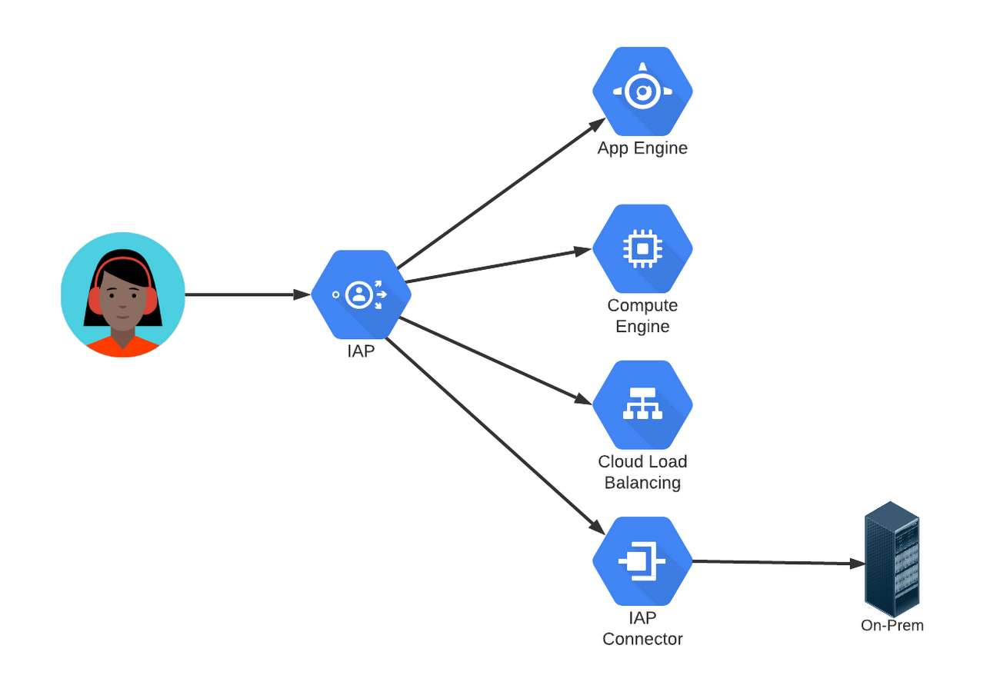

## [在 BigQuery 按需定价和统一费率定价之间进行选择](https://cloud.google.com/blog/products/data-analytics/choosing-bigquery-pricing?hl=en)

BigQuery 是 Google Cloud 完全托管的企业数据仓库。我们将存储和计算解耦，因此存储和计算的成本也解耦了。我们将在本文中仅讨论计算成本。  
您可以使用纯粹的即用即付模型，您只需为用于查询数据的计算付费。在这种即用即付模型（也称为按需定价）中，您需要根据查询扫描的字节数进行计费。在固定费率模式中，您每月为 BigQuery 服务中的专用资源支付固定金额，并且可以扫描任意数量的数据。  
借助 BigQuery 沙盒，您可以在迁移数据仓库之前免费尝试查询、测试性能或尝试标准 SQL。  
BigQuery 的按需模型为每个 Google Cloud 项目提供多达 2,000 个插槽，并且在容量可用时能够突破这一限制。槽是 BigQuery 的计算能力单位，它们会在查询执行时动态调度。如上所述，当您的查询执行时，它们将扫描数据。您将根据在按需计费模型中扫描的字节数进行计费。BigQuery 槽是 BigQuery 执行 SQL 查询的虚拟 CPU。  
在固定费率模型中，您可以决定要预留多少个插槽，并且每月为这些资源支付固定费用。您可以选择是预留一分钟的时段，还是按月预留，或者承诺一年。在此模型中，您不再根据扫描的字节数付费。可以将其视为一个无限查询计划。  

## [将您的组织与 Google Cloud Platform 资源层次结构进行映射](https://cloud.google.com/blog/products/gcp/mapping-your-organization-with-the-Google-Cloud-Platform-resource-hierarchy/?hl=en)

组织、项目和文件夹构成了 GCP 资源层次结构。您可以将层次结构视为传统操作系统中的文件系统。它提供所有权，因为每个 GCP 资源都有一个控制其生命周期的父资源。它提供分组功能，因为可以将资源组装到逻辑上代表服务、应用程序或组织实体（例如组织中的部门和团队）的项目和文件夹中。此外，它还提供了访问控制和配置策略的“脚手架”，您可以将其附加到任何节点并沿层次结构传播，从而简化管理并提高安全性。  
下图显示了 GCP 资源层次结构的示例:  
  
项目是第一级所有权、分组和政策附加点。另一方面，组织包含属于公司的所有资源，并提供集中可见性和控制的高级范围。在组织级别定义的策略由层次结构中的所有资源继承。在中间，文件夹可以包含项目或其他文件夹，并提供根据隔离要求组织和创建边界的灵活性。  
GCP 中组织资源时需要考虑以下一些标准：
* 隔离：您希望在哪里建立信任边界：在部门和团队级别，在应用程序或服务级别，还是在生产、测试​​和开发环境之间？使用文件夹及其嵌套层次结构和项目在云资源之间创建隔离。在层次结构的不同级别设置 IAM 策略，以确定谁有权访问哪些资源。
* 授权：如何平衡自治与集中控制？文件夹和 IAM 可帮助您建立分区，让开发人员能够更自由地进行创建和实验，并保留具有更严格控制的区域。
* 继承：继承如何优化策略管理？正如我们提到的，您可以在层次结构的每个节点定义策略并将其向下传播。 IAM 策略是累加性的。
* 共享资源：是否有需要在整个组织内共享的资源，例如网络、VM 映像、服务帐户？使用项目和文件夹为共享资源构建中央存储库，并将这些资源的管理权限仅限于选定的用户。使用最小权限原则允许其他用户访问。

## [Compute Engine 解释：选择正确的机器系列和类型](https://cloud.google.com/blog/products/compute/choose-the-right-google-compute-engine-machine-type-for-you?hl=en)

对于想要在 Google Cloud 中运行虚拟机 (VM) 的组织，Compute Engine 提供了多个机器系列可供选择，每个机器系列都适合特定的工作负载和应用程序。每个机器系列中都有一组机器类型，它们提供规定的处理器和内存配置组合。  
* 通用 (E2, N2, N2D) - 这些机器平衡了价格和性能，适合大多数工作负载，包括数据库、开发和测试环境、Web 应用程序和移动游戏。为了灵活性，通用机器是预定义的（具有预设数量的 vCPU 和内存），或者可以配置为自定义机器类型。自定义机器类型允许您独立配置 CPU 和内存，为您的应用程序找到适当的平衡，因此您只需为您需要的部分付费。
* 计算优化 (C2) - 这些机器在 Compute Engine 上提供最高的每个核心性能，并针对计算密集型工作负载进行了优化，例如高性能计算 (HPC)、游戏服务器和延迟敏感的 API 服务。
* 内存优化 (M1, M2) - 这些机器在我们的 VM 系列中提供最高的内存配置，单个实例高达 12 TB。它们非常适合内存密集型工作负载，例如 SAP HANA 等大型内存数据库和内存数据分析工作负载。
* 加速器优化 (A2) - 这些机器基于 NVIDIA Ampere A100 Tensor Core GPU。这些机器在单个虚拟机中拥有多达 16 个 GPU，适用于要求苛刻的工作负载，例如支持 CUDA 的机器学习 (ML) 训练和推理以及 HPC。

## [Google Cloud 推出 Vertex AI，一个平台，满足您所需的每一款机器学习工具](https://cloud.google.com/blog/products/ai-machine-learning/google-cloud-launches-vertex-ai-unified-platform-for-mlops?hl=en)

Vertex AI，这是一个托管机器学习 (ML) 平台，可帮助公司加速人工智能 (AI) 模型的部署和维护。Vertex AI 将 Google Cloud 服务整合在一起，在一个统一的 UI 和 API 下构建机器学习，以简化大规模构建、训练和部署机器学习模型的过程。Vertex AI 是一个单一平台，包含您所需的所有工具，使您能够管理数据、原型、实验、部署模型、解释模型并在生产中监控它们，而无需正式的 ML 培训。这意味着您的数据科学家不需要是机器学习工程师。借助 Vertex AI，他们有能力快速行动，但有了安全网，他们的工作始终是他们能够启动的。该平台有助于负责任的部署，并确保您更快地从测试和模型管理转向生产，并最终推动业务成果。

## [什么是顶点人工智能？开发者倡导者分享更多](https://cloud.google.com/blog/products/ai-machine-learning/vertex-ai-overview?hl=en)

Vertex AI 将 Google Cloud 现有的 ML 产品统一到一个环境中，以高效构建和管理 ML 项目的生命周期。它为不同模型类型的机器学习工作流程的每个步骤提供工具，以适应不同水平的机器学习专业知识。

## [AI 简化：使用 Vertex AI 管理 ML 数据集](https://cloud.google.com/blog/products/ai-machine-learning/vertex-ai-how-to-create-and-manage-data-sets?hl=en)

数据集是机器学习生命周期的第一步——开始时您需要数据，而且是大量数据。 Vertex AI 目前支持四种数据类型的托管数据集：图像、表格、文本和视频。  
图像数据集可让您执行以下操作：
* 图像分类——识别图像中的项目。
* 物体检测——识别图像中物体的位置。
* 图像分割——为图像中的像素级区域分配标签。

表格数据集使您能够执行以下操作：
* 回归——预测数值。
* 分类——预测与特定示例相关的类别。
* 预测——预测突发事件或需求的可能性。

使用文本数据集，您可以执行以下操作：
* 分类—为整个文档分配一个或多个标签。
* 实体提取 - 识别文档中的自定义文本实体，例如“太贵”或“很有价值”。
* 情绪分析——识别一段文本中表达的整体情绪，例如，客户是高兴、不安还是沮丧。

视频数据集可以：
* 分类 - 标记整个视频、镜头或帧。
* 动作识别 - 识别发生特定动作的视频剪辑。
* 对象跟踪 - 跟踪视频中的特定对象。

## [Google Cloud 上的 DevOps 和 CI/CD 说明](https://cloud.google.com/blog/topics/developers-practitioners/devops-and-cicd-google-cloud-explained?hl=en)

持续集成（CI）的核心是尽早且经常地获得反馈，这使得可以在开发过程的早期发现并纠正问题。通过 CI，您可以频繁地集成您的工作，通常是一天多次，而不是等待稍后进行大型集成。每个集成都通过自动构建进行验证，这使您能够尽快检测集成问题并减少下游问题。  
CD 是关于打包和准备软件，其目标是向用户提供增量更改。  
您的 CI/CD 管道应该支持：
* 打包源码
* 自动化单元和集成测试
* 一致的构建环境
* 部署到生产之前获得批准
* 蓝色/绿色和金丝雀推出

Cloud Build 是一个完全托管的 CI/CD 平台，可让您跨混合云和多云环境（包括虚拟机、无服务器、Kubernetes 和 Firebase）进行构建、测试和部署。 Cloud Build 可以从 Cloud Storage、Cloud Source Repositories、GitHub 或 Bitbucket 导入源代码；根据您的规范执行构建；并生成 Docker 容器映像或 Java 档案等工件。  
如果您完全在云原生环境中工作，那么您将需要使用 Cloud Code 来启动 CI/CD 管道。在您的 IDE 中使用 Cloud Code；它附带的工具可帮助您快速轻松地编写、运行和调试云原生应用程序。然后将您的代码推送到 Cloud Build 进行构建过程，将其打包到 Artifact Registry 中，并在 GKE 或 Cloud Run 上运行。  
​​Google Cloud Deploy（预览版）是一项托管的、固执己见的持续交付服务，使向 GKE 的持续交付变得更容易、更快、更可靠。它内置了安全控制，可以与您现有的 DevOps 生态系统集成。  
Cloud Shell Editor 由 Eclipse Theia IDE 平台提供支持，通过在线预配置的云开发环境扩展了 Cloud Shell，其中包括：
* 适用于 Kubernetes 和无服务器的本地模拟器
* 用于使用云原生应用程序的命令行工具

## [了解 Compute Engine 的新托管实例组更新程序](https://cloud.google.com/blog/products/gcp/meet-compute-engines-new-managed-instance-group-updater/?hl=en)

Google Compute Engine 的一个关键功能是托管实例组，它允许您将相同实例的集合作为一个单元进行管理，以快速部署新虚拟机并确保它们配置一致。使您可以比以往更轻松地更新实例上的软件、修补和更新它们以及推出分阶段和测试部署。  
具体来说，新的托管实例组更新程序允许您：
* 以编程方式将您的实例从一个实例模板更新为另一个实例模板
* 指定一次更新多少个实例：一个、多个或全部
* （临时）部署额外实例以在更换旧实例时维持容量
* 重新启动或重新创建托管实例组中的所有实例而不更改模板
* 通过配置实例更新之间的暂停来控制部署速率

## [Bigtable 与 BigQuery：有什么区别？](https://cloud.google.com/blog/topics/developers-practitioners/bigtable-vs-bigquery-whats-difference?hl=en)

从较高的层面来看，Bigtable 是一个 NoSQL 宽列数据库，针对大量读取和写入进行了优化。Bigtable 是一个 NoSQL 宽列数据库。它针对低延迟、大量读取和写入以及大规模保持性能进行了优化。 Bigtable 用例具有一定的规模或吞吐量，具有严格的延迟要求，例如 IoT、AdTech、FinTech 等。  
BigQuery 是一个用于存储大量关系结构化数据的企业数据仓库。BigQuery 是一个用于大量关系结构化数据的企业数据仓库。它针对大规模、基于 SQL 的临时分析和报告进行了优化，这使得它最适合获得组织洞察力。

## [Cloud Functions 与 Cloud Run：何时使用其中之一](https://cloud.google.com/blog/products/serverless/cloud-run-vs-cloud-functions-for-serverless?hl=en)

我们发现无服务器工作负载往往属于两类之一：连接平台或运行服务。连接平台通常涉及编写执行单个任务并受益于简单性的离散代码段。另一方面，运行服务受益于自定义服务器配置的灵活性和执行多个任务的能力。  
我们利用 Cloud Functions 处理由 Cloud Storage、Eventarc 或 PubSub 等其他系统触发的短暂的、基于事件的操作，例如用于数据管道自动化。  
Cloud Functions 的例子：
* 转换数据并将其加载到 BigQuery 中。
* 创建由第三方（即 GitHub）调用的 Webhook。
* 使用 ML API 分析添加到数据库或存储桶的数据。

当需要进一步定制时，例如，当需要嵌入人工智能模型或需要更长时间地服务多个接口时，Cloud Run 就会发挥作用。  
许多应用程序示例可供您选择 Cloud Run：
* 任何基于 Web 的工作负载。
* 适用于移动应用或游戏的 REST 或 gRPC API。
* 内部自定义后台应用程序。

## [Google Cloud Identity 与 Identity Platform](https://www.goldyarora.com/google-cloud-identity-vs-identity-platform/)

如果您是一名为客户开发应用程序的开发人员，并且您不想投入时间构建自己的身份模块，那么您可以即插即用 Google Identity platform。  
如果您想使用集中式身份提供商，它可以帮助您的员工（包括全职兼职员工和承包商）能够无缝访问不同的应用程序，而无需将其凭据放入所有这些应用程序中，那么您应该去Google Cloud Identity。  

## [使用身份感知代理控制对您网站的访问](https://cloud.google.com/blog/topics/developers-practitioners/control-access-your-web-sites-identity-aware-proxy?hl=en)

IAP 是一种拦截对网站的请求、对发出请求的用户进行身份验证并仅允许授权用户的请求到达该网站的服务。 IAP 可用于保护在许多平台上运行的网站，包括 App Engine、Compute Engine 以及 Google Cloud Load Balancer 背后的其他服务。但它不仅限于 Google Cloud：您也可以将其与 IAP Connector 结合使用来保护您自己的本地应用程序。  
  
身份感知代理的核心步骤：
* 通过指定仅允许使用公司电子邮件地址进行身份验证的用户访问，创建仅限员工或“内部网”的服务器。 IAP 可以对 Gmail 或 Google Workspace 地址、公司 Active Directory 或通过 Google Cloud Directory Sync 的其他 LDAP 目录中的地址或其他常见身份提供商支持的地址进行身份验证。
* 对于公共但经过身份验证的访问，请指定 IAP 应允许“allAuthenticatedUsers”。任何愿意并能够进行身份验证的人都将有权访问该网站。 IAP 的第二个主要功能是向每个请求添加带有用户身份信息的标头，以便接收站点可​​以使用该信息，而无需执行自己的身份验证。
* 通过指定组电子邮件地址而不是单个电子邮件地址，可以将访问权限限制为任何组或组的组合。 IAP 可以比仅基于身份的访问更进一步。组织可以设置组成员必须遵循的设备策略才能获得访问权限。这些策略可能要求特定的操作系统版本、在浏览器或移动设备上使用公司配置文件，甚至仅使用公司拥有的设备。

## [关于云存储您需要了解的一切](https://cloud.google.com/blog/topics/developers-practitioners/all-you-need-know-about-cloud-storage?hl=en)

云存储是一个全局、安全且可扩展的对象存储，用于存储图像、文本、视频和其他文件格式等不可变数据。您可以根据应用程序的需要随时向其中添加数据或从中检索数据。存储的对象具有 ID、元数据、属性和实际数据。元数据可以包含各种内容，包括文件的安全分类、可以访问该文件的应用程序以及类似信息。 ID、元数据和属性使对象存储成为从 Web 服务到数据分析等各种应用程序的有吸引力的存储选择。  
  
您将对象存储在与项目关联的存储桶中，这些存储桶又分组在组织下。根据预算、可用性和访问频率，有四种存储类别：
* 标准存储桶可实现高性能、频繁访问和最高可用性
  * 区域或双区域位置，满足频繁访问的数据或高吞吐量需求
  * 多区域在全球范围内提供内容
* Nearline 用于每月访问次数少于一次的数据
* Coldline 用于大约每季度访问次数少于一次的数据
* 归档您想要保存多年的数据（每年访问次数少于一次）

Cloud Storage 允许您将数据存储在三种类型的位置：
* 区域：所有数据都冗余存储在单个区域中。区域存储桶通常提供最低的每月存储价格，适用于各种用例，包括高性能分析，其中将计算和存储放在同一区域非常重要。
* 多区域：您的所有数据都在一个大陆上冗余存储，但不可见您的数据位于哪个特定区域。可用性高于区域，因为您的数据可以从多个区域提供服务。多区域的成本比单区域高一点，但对于向 Internet 提供内容来说是不错的选择。
* 双区域：您的所有数据都存储在两个特定区域。双区域提供区域和多区域的优点 — 为您提供高可用性和针对区域故障的保护，同时还为您提供区域存储的高性能特征。业务关键型工作负载通常最好在双区域之上实施。对于用于流式传输以及大数据和机器学习项目的数据批量上传的数据湖来说，双区域也是一个不错的选择。

如何使用云存储：您可以使用控制台或 gsutil 命令、Storage Transfer Service、Transfer Appliance 或在线传输将对象上传到存储桶并从存储桶下载对象。存储数据后，只需对所有存储类进行一次 API 调用即可轻松访问数据。

Security 安全：默认情况下，Cloud Storage 中的数据在静态和传输过程中会 100% 自动加密，无需客户进行配置。您可以向特定成员和团队授予权限，或将对象完全公开以用于网站等用例。

## [如何使用 Data Studio 和 BigQuery 创建 BI 仪表板](https://cloud.google.com/blog/ja/products/gcp/how-to-build-a-bi-dashboard-using-google-data-studio-and-bigquery?hl=ja)

在这篇文章中，我将向您展示如何使用 Data Studio 作为前端、BigQuery 作为后端引擎（借助 Google App Engine 的一些帮助来提高效率）构建 BI 仪表板。  
### 用例和解决方案概述
第 1 步：利用在 BigQuery 中存储的聚合的数据创建报告数据集。
第 2 步：创建一个 App Engine 应用程序，用于查询数据集并将结果加载到报告数据集中。
第 3 步：创建在仪表板中显示的数据的视图报告数据集。
第 4 步：在 Data Studio 中创建新的数据源。
第 5 步：在 Data Studio 中创建新报告。

## [通往着陆区的高速公路：Google Cloud 迁移变得轻松](https://cloud.google.com/blog/topics/developers-practitioners/google-cloud-migration-made-easy?hl=en)

### 从哪里开始？
### 您应该迁移到 Google Cloud 吗？
### 哪种迁移路径适合您？
1. 迁移到 Google Cloud 托管服务
2. 迁移到 Google Kubernetes Engine (GKE) 或 Anthos 上的容器
3. 迁移到 GCE（Google 计算引擎）上的虚拟机（“直接迁移”）
4. 迁移到 Google Cloud VMware Engine
5. 迁移到 Google Cloud 裸机解决方案

## [终极 App Engine 备忘单](https://cloud.google.com/blog/topics/developers-practitioners/ultimate-app-engine-cheat-sheet?hl=en)

App Engine 是 Google Cloud 中完全托管的无服务器计算选项，您可以使用它来构建和部署低延迟、高度可扩展的应用程序。 App Engine 使您可以轻松托管和运行应用程序。它将它们从零扩展到全球规模，而无需您管理基础设施。建议将 App Engine 用于各种应用程序，包括需要低延迟响应的 Web 流量、支持路由、HTTP 方法和 API 的 Web 框架。  
App Engine 提供两种环境；以下是如何为您的应用选择一种方案：
* App Engine 标准 - 支持应用程序在沙箱中运行的特定运行时环境。它非常适合流量突然激增的应用程序，因为它可以根据需要从零扩展到多个请求。应用程序在几秒钟内即可部署。如果您所需的运行时受支持并且它是 HTTP 应用程序，那么 App Engine Standard 就是您的最佳选择。
* App Engine Flex - 开放且灵活，并且支持自定义运行时，因为应用程序实例在 Compute Engine 上的 Docker 容器内运行。它非常适合具有稳定流量和定期波动的应用程序，因为实例可以从一个扩展到多个。除了 HTTP 应用程序之外，它还支持需要 WebSocket 的应用程序。最大请求超时为 60 分钟。

### 它是如何工作的
无论您选择哪种 App Engine 环境，应用程序创建和部署过程都是相同的。首先编写代码，然后指定具有运行时配置的 app.yaml 文件，最后使用单个命令将应用程序部署到 App Engine 上：gcloud app deploy。

### 显着特点
* 开发人员友好 - 完全托管的环境让您可以在 App Engine 管理基础设施的同时专注于代码。
* 快速响应 - App Engine 与 Memorystore for Redis 无缝集成，为您的应用程序提供分布式内存数据缓存。
* 强大的应用程序诊断 - 云监控和云日志记录可帮助监控应用程序的运行状况和性能，云调试器和错误报告可帮助快速诊断和修复错误。
* 应用程序版本控制 - 轻松托管应用程序的不同版本，并轻松创建开发、测试、登台和生产环境。
* 流量分割 - 将传入请求路由到不同的应用程序版本，以进行 A/B 测试增量功能部署和类似用例。
* 应用程序安全性 - 通过使用 App Engine 防火墙定义访问规则并在自定义域上默认使用托管 SSL/TLS 证书，帮助保护您的应用程序，无需额外费用。

### 结论
无论您需要构建现代 Web 应用程序还是可扩展的移动后端，App Engine 都能满足您的需求。

## [维护窗口如何影响您的错误预算 - SRE 技巧](https://cloud.google.com/blog/products/management-tools/sre-error-budgets-and-maintenance-windows?hl=en)

### 错误预算
简而言之，错误预算是您的服务在用户开始不满意之前在一定时间内可以累积的错误量。您可以将其视为用户的痛苦容忍度，但应用于服务的某个维度：可用性、延迟等。

## [谷歌云安全概述](https://cloud.google.com/blog/topics/developers-practitioners/google-cloud-security-overview?hl=en)

### 责任共担、命运共担
### 基础设施安全
谷歌的堆栈通过渐进层构建安全性，提供真正的大规模纵深防御。谷歌的硬件基础设施是定制设计的“从芯片到冷却器”，以精确满足特定要求。它的软件和操作系统是 Linux 的精简、强化版本。 Titan 专用芯片有助于建立硬件信任根。这种端到端的来源和证明有助于谷歌大大减少“中间供应商问题”。

### 网络安全
网络安全部分由云提供商负责，部分由您负责。提供商致力于确保流量安全和加密，以及与公共互联网上其他服务的通信安全。它们还提供针对网络攻击的强大基线保护。  
您负责定义和实施应用程序边界、在团队和组织之间划分项目、管理员工的远程访问以及实施额外的 DoS 防御。  
* Google Cloud 虚拟私有云 (VPC) 可在多个区域之间提供私有连接，而无需通过公共互联网进行通信。您可以将单个 VPC 用于整个组织，并在项目内进行隔离。
* VPC 流日志捕获有关进出网络接口的 IP 流量的信息，并帮助进行网络监控、取证、实时安全分析和费用优化。
* 共享 VPC 有助于配置 VPC 网络以在组织中的多个项目之间共享。集中管理关联的连接路由和防火墙。您还可以使用全球分布式防火墙对网络进行分段，以限制对实例的访问。
* VPC 服务控制通过阻止未经授权的网络访问来扩展外围安全性以管理 Google Cloud 服务。
* Cloud IDS：云入侵检测系统提供针对恶意软件、间谍软件、命令和控制攻击的托管云原生网络威胁检测

### 应用安全
在云上构建应用程序或 API 时，您负责应用程序的安全性，包括扫描和测试。采用以下做法：
* 根据用户的身份验证和授权允许和拒绝流量。
* 使用或实施服务来阻止机器人和欺诈用户访问您的网站。

您可以使用 Web 应用程序和 API 保护 (WAAP) 解决方案来保护面向互联网的应用程序免受攻击。该解决方案是以下各项的组合：  
* 云负载均衡(Cloud Load Balancing)：提供对第 3 层和第 4 层 DDoS 攻击的自动防御。
* Cloud Armor：按地理位置或请求标头、cookie 或查询字符串等大量 L7 参数过滤传入的 Web 请求
* reCAPTCHA Enterprise：提供针对机器人和欺诈用户的保护。
* Apigee API 网关：通过限制 API 流量免受 DDoS 攻击来保护 API 后端，并通过 OAuth、API 密钥验证和其他威胁防护功能控制对 API 的访问。

### 软件供应链安全
保护您的软件需要建立、验证和维护信任链，通过在整个软件开发和部署过程中生成和检查的证明来建立代码的出处或起源轨迹。软件工件的开源 SLSA 供应链级别是供应链完整性的端到端框架，您可以逐步采用该框架来提高安全状况。  
* 代码：使用 Open Source Insights 识别开源代码之间的依赖关系、安全建议和许可证。
* 构建：Cloud Build 捕获另一组证明（测试运行、使用的构建工具等），以添加到您的信任链中。
* 测试和扫描：存储在 Artifact Registry 中的完整构建会自动扫描是否存在漏洞。
* 部署和运行：验证二进制授权(Binary Authorization)的真实性，并在证明满足组织策略时进行部署。它甚至在部署后持续验证策略的一致性。

### 数据安全
数据安全是您和云提供商之间的共同责任。云提供商提供了一些内置于基础设施中的功能，例如静态和传输中的数据加密，而您则负责应用程序的数据安全。这包括密钥和机密管理、查找敏感数据、实施控制、防止泄露和数据丢失等功能。  
Google Cloud 提供静态和传输中的数据加密，并可选择使用机密计算对使用中的数据进行加密。如果您需要通过自己的密钥对数据进行加密，您可以携带自己的密钥 (CSEK)、使用 Google 的托管密钥管理服务 (KMS)、使用硬件安全模块 (HSM) 或外部密钥管理器 (EKM)。数据丢失防护 (Cloud DLP) 有助于发现、分类和保护敏感数据。  

### 身份和访问管理
这需要安全地管理用户生命周期和应用程序访问，包括用户身份验证和这些用户对适当服务的授权。  
在 Google Cloud 中，Cloud Identity 是提供身份验证选项的 IdP。它存储和管理云使用的数字身份，还提供两步验证以及与第三方身份提供商（例如 Okata、Ping、ADFS 或 Azure AD）的 SSO 集成。  
经过身份验证后，Cloud IAM 通过提供细粒度的访问控制和可见性来集中管理云资源，从而提供授权 - “谁可以在 Google Cloud 上做什么、在哪里”。 IAM 政策管理对 Google Cloud 资源的访问控制，IAM 角色帮助设置细粒度的权限。  
BeyondCorp Enterprise 制定了零信任模型来访问您的应用程序和资源。除非满足每资源访问策略中规定的所有规则和条件，否则任何人都无法访问您的资源。

### 端点安全
端点安全对于保护用户和访问至关重要。您需要确保应用补丁、防止泄露并管理用户设备，包括定义哪些设备有权访问您的应用或项目中的哪些资源的政策。  
安全浏览或网络风险 API：让客户端应用程序根据 Google 不断更新的不安全网络资源列表检查 URL。通过安全浏览，您可以：  
* 根据平台和威胁类型对照我们的安全浏览列表检查页面。
* 在用户点击您网站中可能导致受感染页面的链接之前向用户发出警告。
* 防止用户从您的网站发布指向已知受感染页面的链接。

### 安全监控和运营
从安全运营 (SecOps) 的角度来看，您需要检测、响应和修复云中的威胁。  
* 安全指挥中心(Security Command Center)：持续监控您的 Google Cloud 环境是否存在配置错误、检测威胁、恶意活动并帮助保持合规性。
* 审核日志(Audit Logs)：Cloud Logging 提供审核日志，记录您的 Google Cloud 资源中的管理活动和访问情况。审核日志可帮助您回答“谁在何时何地做了什么？”
* Siemplify 安全编排、自动化和响应 (SOAR)(Siemplify Security Orchestration, Automation and Response (SOAR))：通过将剧本自动化、案例管理和集成威胁情报结合到一种云原生直观体验中，实现对网络威胁的现代、快速和有效响应。

### 治理、风险和合规性
包括了解安全风险、定义和执行策略、通过获得认证来证明合规性以及保持良好的安全态势。  
