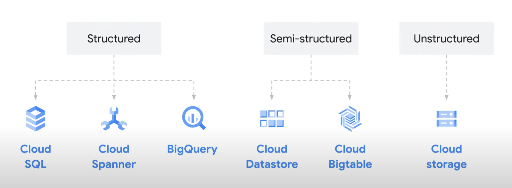

# 利用数据和 Google Cloud 进行创新
    云技术本身只能为企业提供真正价值的一小部分；当与大量数据结合时，它有能力真正释放价值并为客户创造新体验。
    在本课程中，您将了解什么是数据、公司使用它做出决策的历史方式，以及为什么它对机器学习如此重要。
    本课程还向学习者介绍结构化和非结构化数据等技术概念。数据库、数据仓库和数据湖。
    然后介绍了围绕数据最常见和增长最快的 Google Cloud 产品。

# 课程信息
## 目标
* 描述数据在数字化转型中的作用以及数据驱动文化的重要性。
* 确定用于数据管理的常见 Google Cloud 解决方案
* 确定用于智能分析的常见 Google Cloud 解决方案
* 确定 Google Cloud 的机器学习和 AI 解决方案

# 课程介绍
## 课程介绍
* 我们将探讨企业如何在其数字化转型之旅中更好地使用数据。
* 在模块 1 中，我将定义数据及其在数字化转型中的作用。
* 在模块 2 中，我将研究数据库、数据仓库和数据湖之间的异同。
* 在模块 3 中，我将探讨机器学习和人工智能。

## 学生幻灯片
略

# 数据的价值
    数据是数字化转型的关键。事实上，捕获、管理和利用数据是重新定义客户体验和在几乎每个行业创造新价值的核心。
    本模块首先探讨数据对于实现数字化转型的价值，然后细分不同类型的数据以及使用云技术时收集、存储和处理数据的注意事项。

## 简介
* 什么是数据，它在您的业务数字化转型中扮演什么角色？
* 如何在您的组织中利用数据。
* 细分数据类型。
* 为每个使用云中数据的企业介绍一些重要的数据注意事项。

## 数据在数字化转型中的作用
* 数据是对组织有用的任何信息。包括内部信息、组织内部的数据以及外部信息、客户和行业数据。
* 捕获并利用这些数据来释放业务价值是数字化转型的核心。及时且经济高效地从历史数据和新数据中获取见解。

## 利用组织中的数据
* 数据地图是端到端业务流程中使用的所有数据的图表。也称之为数据集。数据集构成数据桶。
* 通过研究数据集之间的交叉点，使您的数据具有可操作性。
* 拿一张纸，写用户数据、企业数据、行业数据。想想你在每个数据集中有什么数据。然后考虑如何组合不同的数据集以创造有价值的见解。

## 了解数据类型
* 我们可以将数据分为两种主要类型：结构化和非结构化。
* 结构化数据是高度组织的。示例包括由姓名、地址、信用卡号码和其他定量数据组成的客户记录。结构化数据可以很容易地在数据库中存储和管理。
* 非结构化数据没有组织，往往是定性的。非结构化数据的示例包括文字处理文档、音频文件、图像和视频。此数据可以存储为对象。对象由数据本身、可变数量的元数据、和一个全球唯一的标识符。

## 重要数据注意事项
* 首先要考虑数据的来源、收集方式以及存储位置。
* 另一个考虑是是否所有数据是相关的和适当的。

# 数据整合和分析
    本模块介绍与数据管理相关的关键术语，并强调将数据迁移到云端的好处。
    它提供了多个客户用例以及相关的 Google Cloud 数据管理解决方案。
    最后回顾了 BigQuery 和 Looker 等关键产品，这些产品使用户能够从他们的数据中汲取见解。

## 简介
* 我将首先考虑数据现在的位置以及将数据迁移到云端的好处。
* 然后我将定义与数据存储相关的关键术语，包括数据库、数据仓库和数据湖。

## 将数据迁移到云端
* 大量数据仍然存储在本地或隐藏在个人计算机上。将数据存储在本地孤岛中很难提取数据的价值。而且，如果您的组织中某处有数据未被跟踪，则它很容易受到用户攻击并且效率低下。
* 将数据迁移到云端，意味着您可以轻松找到数据，并能够在保护数据免受外部威胁的同时使用它。
* 将数据迁移到云端，意味着您的数据存储和计算能力是有弹性的。它可以随着您获取的数据的增加或减少而放大或缩小。
* 将数据迁移到云端，意味着您可以提高摄取和使用数据的速度，特别是分析和使用不同格式数据的速度。

## 云数据库
* 数据库是有组织的数据集合，通常存储在表格中并可从计算机系统以电子方式访问。
* 数据完整性或事务完整性是指存储在数据库中的数据的准确性和一致性。
* Cloud SQL 是一种完全托管的关系数据库管理服务 (RDBMS)。
* Cloud Spanner 是另一种完全托管的数据库服务，专为全球规模而设计。使用 Cloud Spanner，数据会自动且即时地跨区域复制。这种复制意味着如果一个区域脱机，组织的数据仍然可以从另一个区域提供服务。

## 云数据仓库
* 云中的数据存储系统：数据仓库。数据库以在线方式存储事务数据，而数据仓库则汇集来自多个来源（包括数据库）的数据。建立和优化数据库从许多不同的来源摄取大量数据。但是，构建数据仓库是为了能够快速分析大型和多维数据集。
*  BigQuery 是一个完全托管的数据仓库，具有免费停机升级和维护以及无缝缩放功能。
*  BigQuery 是无服务器的。这并不意味着没有服务器。这意味着计算能力等资源会根据运行查询的需要在幕后自动配置。
*  Pub/Sub 是一种实时摄取数据的服务，而 Dataflow 是一种用于大规模数据处理的服务。Pub/Sub 和 Dataflow 可以协同工作，将非结构化数据带入云端并将其转换为半结构化数据。

## 云数据湖
* 数据湖是一个存储库，旨在存储、处理和保护大量结构化、半结构化和非结构化数据。它可以以其本机格式存储大量数据并处理任何类型的数据而忽略大小限制。数据仓库的主要目的是通过转换和整合数据来实现轻松的数据分析。数据湖天生具有灵活性，这是数据仓库的最大局限之一。
* 云存储是一种服务，可让您存储和提供二进制大型对象或 blob 数据，blob 通常是图像、音频或其他媒体对象。
* 对于访问频率较低的数据，云存储提供近线(Nearline)、冷线(Coldline)和存档存储类别。
* 此流程图根据存储的是结构化、半结构化还是非结构化数据显示了相应的 Google 云存储产品。  

## 商业智能解决方案
* Looker 是一种 Google Cloud 商业智能解决方案。简而言之，它是一个位于分析数据库之上并使其变得简单的数据平台。

# 机器学习与创新
    从历史上看，数据分析是关于了解过去已经发生的事情。
    随着云技术的进步和数字设备的可用性，我们每天都会产生大量数据。
    本模块探索机器学习的能力以及使用大量数据可以实现的功能。
    它建立在前面的模块之上，解释了机器可以学习如何根据大量数据进行预测、分类和推荐。
    在整个模块中，您将发现使用机器学习为其客户带来创新解决方案的客户示例。

## 简介
* 略

## 什么是机器学习
* 人工智能(AI)是一个广泛的领域或术语，它描述了任何一种能够完成通常需要人类智能才能完成的任务的机器，例如视觉感知、语音识别、决策制定或语言之间的翻译。
* 机器学习(ML)是人工智能领域的一个分支。具体来说，机器学习指的是可以从数据中学习并做出预测或决策而无需明确编程的计算机。这是使用算法或模型来分析数据来完成的。这些算法使用历史数据作为输入来预测新的输出值。
* 机器学习(ML)是一种使用标准算法或标准模型来分析数据的方法。为了获得预测性见解并大规模重复决策。简而言之，它是一种通过向计算机提供正确答案示例来教计算机如何解决问题的方法。通常这些问题是关于预测某事的。

## 数据质量
* 最好的数据具有三个品质。第一，它有覆盖面。第二，它是干净的或一致的。第三，它是完整的。
* 数据覆盖是指问题域的范围以及它可以解释的所有可能场景。换句话说，所有可能的输入和输出数据。
* 优质数据的第二个品质是其清洁度。这有时称为数据一致性。数据不一致的最简单形式是数据格式。
* 良好数据的另一个品质是完整性。这是指有足够的关于世界的数据来替代人类知识。
* 如果你打算使用它，要问自己您是否需要提高覆盖率、提高清洁度（一致性）或提高完整性？请记住——数据是 ML 的核心。

## 使用 Google Cloud 进行人工智能和机器学习
* 首先，你有没有自己的训练数据。
* 如果没有，您需要使用 Google 的一些预训练 API 来解决您的问题。如果您确实拥有自己的训练数据，那么您将使用 Vertex AI 中的服务，一个统一的托管平台，用于使用 Google Cloud 构建 ML。
* 要确定您将构建哪种类型的模型，您需要提出另一个问题。您或您的团队是自己编写模型代码吗？如果不是，那么您将使用自己的数据训练现有的 ML 模型。如果是，您将构建自定义 ML 模型并使用您自己的数据对其进行训练。
* 如果您没有自己的训练数据，您将使用 Google Cloud 预训练 API。这些预训练的 API 可以分为四类；视觉、语言、对话和结构化数据。例如：Vision API，Natural Language API 等。
* 使用 Vertex AI 使用您自己的数据训练模型，以管理和构建您的 ML 项目。Vertex AI 汇集了Google 云服务，用于在一个统一的用户界面下构建 ML。在 Vertex AI 中工作时，您可以使用数据来训练现有的 ML 模型或构建自定义 ML 模型。当您将自己的数据应用于预先存在的 Google ML 模型，您将使用 Vertex AI 上的 AutoML 来训练、测试和部署机器学习模型，而无需代码。例如：AutoML Natural Language 等。
* Vertex AI 是一个用于创建自定义端到端 AI 模型的平台，提供一套产品，在 ML 工作流程的每个阶段为您提供帮助，从收集数据到特征工程，再到构建、部署和监控模型。
* 我们还有 Google Cloud AI Hub，它拥有一个存储库，一个即插即用的 AI 组件，供开发人员和数据科学家在他们的项目中使用。
* 谷歌云还提供了一套完整的人工智能解决方案，旨在解决特定的业务需求。

## 机器学习的真实用例
* 四个常见的业务机器学习场景是替换或简化基于规则的系统、自动化流程、理解非结构化数据以及创建个性化的客户体验。

# 课程总结
## 课程总结
* 数据是对企业有用的任何信息，从电子表格上的数字到员工头脑中的想法。利用这些数据对企业进行数字化转型对于在云时代蓬勃发展至关重要。
* 组织现在可以以前所未有的速度和规模摄取、分析和使用这些数据。这对于不同类型的数据、非结构化和结构化数据都是可能的。
* 您还了解了数据库、数据仓库和数据湖作为存储、处理和管理数据的关键概念和解决方案。
* 了解了正在使用 ML 并通过替换基于规则的系统、自动化流程、理解非结构化数据以及为用户创建更加个性化的体验来颠覆其行业的企业。