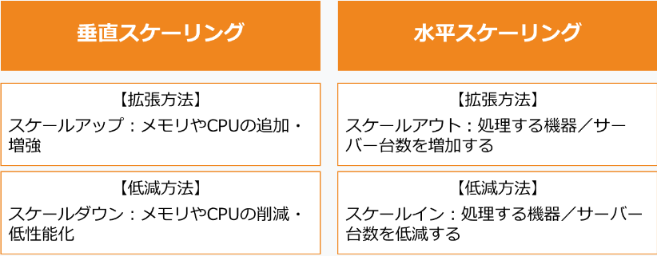

## 常考知识点

---

关于有效机器学习的讨论中会反复提到以下术语：
* 实例（Instance）（インスタンス）：要对其进行预测的内容。例如，实例可能是您要归类为“关于猫”或“不是关于猫”的网页。
* 标签（Label）（ラベル）：预测任务的答案，它可以是由机器学习系统生成的答案，也可以是训练数据中提供的正确答案。例如，网页的标签可能是“关于猫”。
* 特征（Feature）（特徴）：预测任务中使用的实例的属性。例如，某个网页可能具有“包含字词‘猫’”这一特征。
* 特征列（Feature Column）（特徴列）：一组相关特征，例如用户可能居住的所有国家/地区的集合。样本的特征列中可能包含一个或多个特征。“特征列”是 Google 专用的术语。特征列在 Yahoo/Microsoft 使用的 VW 系统中称为“命名空间”，也称为字段。
* 示例（Example）（例）：一个实例（及其特征）和一个标签。
* 模型（Model）（モデル）：预测任务的统计表示法。您使用样本训练模型，然后使用该模型进行预测。
* 指标（Metric）（指標）：您关心的一个数值。不一定会直接优化。
* 目标（Objective）（目標）：算法尝试优化的指标。
* 流水线（Pipeline）（パイプライン）：围绕机器学习算法的基础架构。包括从前端收集数据、将数据放入训练数据文件、训练一个或多个模型，以及将模型导出到生产环境。
* 点击率（Click-through Rate）（クリック率）：点击广告中的链接的网页访问者所占的百分比。

---

迁移策略简介：
* 棕地（ブラウンフィールド）迁移允许您迁移应用程序并使其现代化，同时保持旧应用程序运行。棕地迁移是一种在开发和部署新软件系统的同时利用现有（遗留）软件应用程序/系统的迁移方法。
* Lift and shift （リフト＆シフト）是指迁移到云端时，将云中可以使用的部分原样迁移（lift），将应该更改为云服务的功能根据云进行更改，而不需要对云进行大的改造。传统系统。它是一种（shift）迁移方法。
* 移动和改进（Move＆Improve（移行して改良））是一种在迁移时改进云原生基础设施的方法。需要进行改进，因此过渡需要时间。
* 绿地（グリーンフィールド）迁移是一种新的迁移，这意味着退役旧应用程序并迁移到新应用程序。

---

SLA是（Service LevelAgreement）的缩写，是服务提供商和用户之间的合同。 它表明服务提供商向用户保证的服务质量水平。 在此基础上，用户与服务提供商就服务提供商所保证的服务质量水平以及未达到服务质量水平时如何解决达成一致。 云服务 SLA 是根据服务能否继续正常使用来计算的。 而可用性是通过服务的利用率来计算的。

---

云服务等供应商设定了自己的服务质量目标，这些目标称为服务级别目标（SLO（Service Level Objective））。

---

Looker是一款用于分析大量数据的BI（商业智能）工具。 Looker 利用 LookML（一种基于 SQL 的强大建模语言）来创建机器学习模型。 这使您可以对运营数据执行高级分析。

---

Cloud Spanner 是完全托管的关系数据库，具有无限扩展、强一致性和高达 99.999% 的可用性。
Cloud Spanner 是一种分布式关系数据库，默认情况下它跨一个区域的多个可用区进行集群。 此外，全球协作方便，数据可以在多个区域分布和同步。

---

Cloud Bigtable 是一种 NoSQL 数据库服务，可实现毫秒级延迟、无限可扩展性和 99.999% 的可用性。
可用于物联网数据等按时间序列增加的数据的高速分析工作负载。
Bigtable 是一个 NoSQL 宽列数据库。它针对低延迟、大量读取和写入以及大规模保持性能进行了优化。
Bigtable 用例具有一定的规模或吞吐量，具有严格的延迟要求，例如 IoT、AdTech、FinTech 等。
您可以使用 Bigtable 作为大规模、低延迟应用程序以及吞吐量密集型数据处理和分析的存储引擎。非常适合机器学习预测。

---

BigQuery 是一个具有高可扩展性和处理能力的托管数据仓库。 当您以按需、按量付费的方式使用 BigQuery 时，您只需为用于查询数据的计算付费。
BigQuery 是用于存储大量关系结构化数据的企业数据仓库。 它针对基于 SQL 的大规模临时分析和报告进行了优化，非常适合获得组织洞察。 您还可以使用 BigQuery 来分析您的 Cloud Bigtable 数据。
BigQuery 是一个 PB 级数据仓库，旨在轻松提取、存储、分析和可视化数据。通常，您将从数据库和其他第三方系统收集大量数据来回答特定问题。
典型的 BigQuery 用例包括大规模存储和分析或在线分析处理 (OLAP)。

---

Filestore 是高性能、完全托管的文件存储。 Filestore 支持高达 100 TB 的容量、25 GB/s 的吞吐量和 920K IOPS，并与虚拟机配合以实现快速数据处理。

---

Cloud Storage 是基于对象的存储，允许无限存储任何类型的数据。

---

Cloud Natural Language API 是一种 AI 服务，可以分析文档等自然语言，量化字符串的情感，返回结构和含义，并对其进行分类。

---

外部 SSL 代理负载均衡器概览：
外部 SSL 代理负载均衡器是一种反向代理负载均衡器，它将来自互联网的 SSL 流量分配到您的 Google Cloud VPC 网络中的虚拟机实例。

---

Anthos 是一项通过将 Google Cloud 与其他公有云和本地环境链接来支持混合云和多云环境的构建和运营的功能。跨多个环境一致地开发、部署和操作基于容器的应用程序。

---

Identity Platform 是一个客户身份和访问管理 (CIAM) 平台，提供身份和访问管理功能。 您可以在应用程序中构建和实施身份功能，以保护用户帐户并在 Google Cloud 上可靠地扩展。

---

Cloud Identity 是一个集成的身份、访问、应用和端点管理 (IAM/EMM) 平台，负责 Google Cloud 用户和资源的身份验证管理。  
Cloud Identity 是一种身份即服务 (IDaaS) 和企业移动管理 (EMM) 产品。它在 Google Workspace 中以独立的产品形式向用户提供身份认证和端点管理服务。作为管理员，您可以使用 Cloud Identity 在同一个地方（即 Google 管理控制台）管理用户、应用和设备。

---

Cloud Trace 从 Google Cloud 上的资源和应用程序收集延迟数据，并将其显示在 Google Cloud 控制台中。 借助 Cloud Trace，您可以分析应用程序的每个请求的详细延迟信息，以快速查明瓶颈发生的位置并确定其根本原因。

---

Cloud Monitoring 是一项监控服务，可自动从 Google Cloud 资源收集指标以显示性能数据和警报通知。 在 Google Cloud 虚拟机上部署 Ops Agent，从您的应用程序和 Google Cloud 资源收集详细指标和日志

---

Cloud Profiler(云分析器) 是一个低开销的统计性能剖析器，可从生产应用中持续收集有关 CPU 使用率和内存分配情况的信息。该性能剖析器会将获得的信息归因于应用的源代码，从而帮助您找出应用中资源耗用量最大的部分，还可以阐明代码的性能特征。  
 Cloud Profiler 通过收集 CPU 使用情况和内存分配信息来帮助分析应用程序性能。

---

Cloud Logging 是一种收集、存储和管理 Google Cloud 资源生成的各种日志的机制。

---

Cloud Audit Logs 服务会写入审核日志，这些日志用于记录 Google Cloud 资源中的管理活动和访问。审核日志可帮助您了解回答“哪些用户何时在何处对 Google Cloud 资源执行过哪些操作？”，透明度与本地环境相同。启用审核日志有助于安全、审核和合规性实体监控 Google Cloud 数据和系统，检查是否存在可能的漏洞或外部数据滥用。

Cloud Debugger 是一种代码验证服务，可让您在不停止或减慢正在运行的应用程序的情况下检查应用程序的代码。

---

Cloud Functions 是一个无服务器应用程序平台，允许您在无需服务器管理的情况下运行代码。 您可以轻松创建由事件触发的事件驱动应用程序。  
Google Cloud Functions 是一个用于构建和连接云服务的无服务器代码执行环境。 Cloud Functions 允许您编写与云基础设施和服务发出的事件相关联的简单、单一用途的函数。 当监控的事件发生时，该函数被触发。 并且这个函数处理会根据需求自动缩放。

---

App Engine 是一个 PaaS 解决方案，为 Web 应用程序提供开发环境和托管。 我们使用 Node.js、Java、Ruby、C#、Go、Python 或 PHP 提供托管应用程序开发环境。  
App Engine 是 Google Cloud 中完全托管的无服务器计算选项，您可以使用它来构建和部署低延迟、高度可扩展的应用程序。  
App Engine 使您可以轻松托管和运行应用程序。它将它们从零扩展到全球规模，而无需您管理基础设施。  
建议将 App Engine 用于各种应用程序，包括需要低延迟响应的 Web 流量、HTTP 方法和 APIs。  
App Engine 提供两种环境：App Engine Standard，它非常适合流量突然激增的应用程序。App Engine Flex，它非常适合具有稳定流量和定期波动的应用程序。

---

Cloud Run 是一个完全托管的无服务器平台，可让您构建和部署以任何语言（Go、Python、Java、Node.js、.NET、Ruby）编写的可扩展容器化应用程序。

---

通过使用裸机解决方案，您可以将无法使用 Compute Engine 虚拟机迁移到 Google Cloud 的特殊、任务关键型、复杂工作负载和许可迁移到 Google Cloud。 例如，需要用户控制物理服务器才能运行的工作负载无法使用虚拟机实现，但可以使用裸机解决方案进行处理。  
裸机解决方案是一种通过云提供物理服务器的服务，为用户提供详细的控制。 借助裸机解决方案，您可以将难以迁移到虚拟机的软件和任务关键型工作负载迁移到云端。 用户专用硬件位于 Google Cloud 数据中心，可实现低延迟连接。

---

Compute Engine 是一项在云上提供虚拟机的服务。

---

Google Kubernetes Engine (GKE) 是一项由开源 Kubernetes 提供支持的容器编排服务。 GKE 提供了一个可以高效部署、管理和扩展的容器式应用程序构建环境。

---

Apigee 是一项 API 管理服务，用于构建、管理和保护 API。 支持 API 扩展、安全性和自动化。 Apigee 还能够监控、分析和报告 API 使用情况。

---

Google Cloud 允许您使用 Firebase 作为后端来构建移动应用程序。Firebase 是一个开发平台，可以快速开发 iOS/Android 应用程序和 Web 应用程序。

---

云采用成熟度的阶段如下：  
■ 战术 Tactical (戦術的な段階)
尽管团队和个人都在努力使用云，但组织并没有一致的反应。

■ 战略性 Strategic (戦略的な段階)
在整个组织中规划未来的云使用情况，并且各个计划由团队管理的状态。 此外，必要的利益相关者的参与已经实现，IT 团队正在取得成果。

■ 转型（灵活/转型阶段）Transformational (柔軟/変革的な段階) 
云运营运行顺利，并且利用云上的数据获得新的见解。 IT 部门或同等团队能够创新。

---

---

身份和访问管理 (IAM) 允许您仅向授权用户授予对特定资源执行操作的权限。 Cloud IAM 采用从组织资源向下流动的分层方法。 使用 IAM，您可以对所有资源进行分组，并将权限分层组织到资源容器（例如组织、文件夹和项目）中。  
在较高级别设置 IAM 权限也适用于较低级别。 作为 GCP 资源层次结构中的根节点，组织资源提供对 GCP 资源的集中可见性和控制。 对组织资源授予的权限会传递到其下的所有文件夹和项目。

---

云型数据仓库是一种可以实时摄取和分析大规模结构化数据的关系数据库。 数据分析是通过从公司内的多个业务系统按时间顺序积累大量数据来进行的。 您可以管理结构化数据，然后分析数据以提取见解。

---

通过单租户，您可以独占访问单租户节点。 单租户节点是专用于托管项目虚拟机的 Compute Engine 物理服务器。 单租户节点允许您的虚拟机与其他项目中的虚拟机物理隔离。 您还可以将同一主机硬件上的虚拟机分组。

---

要跟踪您的 Google Cloud 服务使用成本并尽早发现成本超支，请在 Cloud Billing 中设置等于典型本地成本的预算。 并根据预算阈值设置警报通知，以便您可以实时跟踪预算消耗。

---

在实现DevOps时，我们衡量系统可靠性和交付速度作为指标。 DevOps 是一种开发系统和举措，通过与运营团队和开发团队一起无缝开发应用程序来提高速度和可靠性。 这是一项组织和文化努力，旨在提高软件交付速度、服务可靠性以及软件利益相关者之间的共识。 既然是提高软件交付的速度、稳定性、可用性和安全性的机制，那么系统的可靠性和交付速度是重要的指标。

---

机器学习模型可用于构建基于用户行为数据训练的预测模型。 通过这个预测模型，您可以构建一种机制来优化网站内容的显示顺序。  

通过使用网站内可以获得的数据（例如用户行为数据）作为变量构建机器学习预测模型，可以单独定制网站内容的显示顺序。 机器学习是人工智能（AI）技术之一。 通过反复学习大量数据，可以发现称为特征的模式和规则，并构建算法和模型。 最简单的机器学习是线性回归模型。

---

Vertex AI 是 Google Cloud 的集成 AI 开发环境。 预测模型等机器学习内容可以由各个团队共享和开发。 Vertex AI 集成并利用多个 Google Cloud AI 服务，通过完全托管的机器学习 (ML) 工具加速构建、部署和扩展 ML 模型，以增加用例。

---

Web App and API Protection (WAAP) 来限制机器人的访问。 Web 应用和 API 保护 (WAAP) 可保护 Google Cloud 资源和 API 免受外部威胁和滥用，以确保可用性和合规性。 DDoS 防护、反机器人功能有助于防范新的和现有的威胁，同时保持应用程序和 API 的合规性和持续可用性。

---

您可以利用 Cloud Pub/Sub 的消息传递功能在独立组件之间发送和接收消息，以协调应用程序处理。  
Cloud Pub/Sub 是一项服务，使发布者（消息发送者）能够正确地将消息发送给订阅者（消息接收者），从而实现组件之间的消息处理。  
Cloud Pub/Sub 允许订阅者同时接收多条消息，发布者同时将消息传递给多个订阅者。

---

Cloud Tasks：异步执行任务。Cloud Tasks 是一项全代管式服务，您可利用它管理大量分布式任务的执行、分派和送达。

---

您可以使用 Cloud Asset Inventory 获取虚拟机清单。 Cloud Asset Inventory 是一项元数据库存服务，可让您列出、查看、监控和分析项目和服务中使用的 Google Cloud 和 Anthos 资产。 您可以使用它导出整个库存的快照以供查看。  
Cloud Asset Inventory 提供对资源使用历史记录和详细信息的深入了解。 它具有强大的过滤和搜索功能，允许您在迁移资产的同时进行自动化分析。

---

Cloud Access Transparency：云访问透明度是一项通过管理管理员访问日志和授权来控制云提供商访问的服务。 这使我们能够通过使访问透明来验证云提供商的访问。

---

Confidential Computing（机密计算）：利用机密虚拟机、机密 GKE、机密 Dataflow、机密 Dataproc 和 Confidential Space 保护使用中的数据。

---

Binary Authorization（二进制授权）：为容器和无服务器环境仅部署可信工作负载。一种身份验证机制，用于仅将受信任的容器映像部署到 Google Kubernetes Engine (GKE) 和 Cloud Run。

---

DataFlow 是一种数据处理服务，用于执行流式数据处理和批量数据处理。 借助 Dataflow，您可以配置快速且简化的流数据管道，并且数据传输延迟较低。

---

LookML 简介：LookML 表示 Looker Modeling Language，它是 Looker 中用于创建语义数据模型的语言。您可以使用 LookML 来说明 SQL 数据库中的各种维度、汇总、计算和数据关系。Looker 使用以 LookML 编写的模型，针对特定数据库构建 SQL 查询。

---

使用 Titan 安全密钥为用户组设置双因素身份验证可确保身份验证期间的最高安全级别。  
Titan 安全密钥包含 Google 设计的硬件芯片和内置固件，可验证密钥的完整性。 这确保了密钥没有被物理篡改。  
Titan 安全密钥还使用公钥加密技术来验证用户身份和登录页面 URL。 即使用户被诱骗输入用户名和密码，攻击者也无法访问该帐户。

---

本地 SSD：用于虚拟机实例的本地固态硬盘存储。  
高性能临时存储：本地 SSD 以物理方式挂接到托管虚拟机实例的服务器。与其他块存储选项相比，这种紧密耦合可提供卓越的性能、极高的每秒输入/输出操作次数 (IOPS)，以及极短的延迟时间。本地 SSD 专为临时存储使用场景（例如用作缓存或临时处理空间）而设计，因此适用于媒体渲染、数据分析或高性能计算等工作负载。

---

专用 Google 访问通道：仅具有内部 IP 地址（无外部 IP 地址）的虚拟机实例可以使用专用 Google 访问通道，从而可以访问 Google API 和服务的外部 IP 地址。

---

Cloud Key Management：在 Google Cloud 上管理加密密钥。

---

Cloud Data Loss Prevention：可以帮助您发现、分类和保护最敏感数据的全代管式服务。数据丢失防护是一项完全托管的服务，用于发现、分类和保护最敏感的数据，确保正确使用敏感信息进行数据分析。

---

Security Command Center：Google Cloud 的内置安全和风险管理解决方案。发现错误配置和漏洞，识别网络风险并确定补救措施的优先级，检测您的 Google Cloud 资源所面临的威胁，监控和管理法规遵从。

---

合规性资源中心 (Compliance resource center) (コンプライアンス リソース センター)：Google Cloud 提供行业领先的认证、文档和第三方审核，旨在帮助您满足合规性要求。

---

Cloud Security Scanner：Web Security Scanner 可识别 App Engine、Google Kubernetes Engine（GKE）和 Compute Engine Web 应用中的安全漏洞。它会抓取您的应用，跟踪起始网址范围内的所有链接，并尝试执行尽可能多的用户输入和事件处理程序。

---

Document AI for lending：通过自动处理抵押贷款文件，改善借款方和贷款方的房贷体验。缩短处理时间并简化数据捕获流程，同时符合法规和合规性要求。

---

Google Cloud Armor：帮助保护您的应用和网站免遭拒绝服务攻击和 Web 攻击。

---

Database Migration Service：简化迁移到云的过程。现可用于 MySQL 和 PostgreSQL，并提供 Oracle 迁移的预览版。

---

Chronicle 概览：Chronicle 是一种云服务，作为核心 Google 基础架构之上的专用层构建，旨在让企业以私密方式保留、分析和搜索它们生成的海量安全和网络遥测数据。Chronicle 对数据进行归一化、编入索引、关联和分析数据，以提供即时分析和背景信息。  
借助 Chronicle，您可以检查企业过去几个月或更长时间的汇总安全信息。使用 Chronicle 在您的企业内部访问的所有网域中执行搜索。您可以将搜索范围缩小到任何特定的资产、网域或 IP 地址，以确定是否发生了任何入侵。

---

Terraform 可让您以安全、可预测的方式创建、更改和改进基础架构。它是一个开源工具，可将 API 编码为声明式配置文件。您可以将这些文件分享给同事，将它们作为代码进行处理、修改、审核和版本控制。

---

Google Cloud Deployment Manager 是一种基础架构部署服务，可以自动创建和管理 Google Cloud 资源。您可以编写灵活的模板和配置文件，并使用它们创建包含各种 Google Cloud 服务（例如 Cloud Storage、Compute Engine 和 Cloud SQL）的部署，使其通过配置协同工作。

---

Cloud Data Fusion：可适应任何规模的全代管式云原生数据集成服务。云数据融合使没有开发技能的分析团队能够开发应用程序。 数据融合允许您使用拖放界面创建数据管道。 数据融合非常直观，具有拖放功能、现成的连接器以及用于无代码数据集成的自助服务模型。

---

Google Cloud Assured Workload（Google Cloud 有保障的工作负载）：帮助您更快在 Google Cloud 上运行更安全、合规的工作负载。

---

借助 Google Cloud Directory Sync，管理员可以将 Active Directory/LDAP 用户与 Google Cloud 网域目录用户同步。  
BeyondCorp 是 Google 为增强安全性而实施的零信任模型。它与用户身份验证无关。  
Identity-Aware Proxy 是调解用户和应用程序之间通信的代理。身份感知代理使用身份和上下文来保护对应用程序和虚拟机的访问。  
Cloud Identity 是一个集成的身份、访问、应用和端点管理 (IAM/EMM) 平台，负责 Google Cloud 用户和资源的身份验证管理。  

---

Cloud Firestore：在全球范围内存储和同步应用数据。  
为全球级应用打造的 NoSQL 数据库，Cloud Firestore 是一款 NoSQL 文档数据库，它使您可以在全球范围内轻松存储、同步和查询您的移动应用及 Web 应用的数据。  
以您偏好的方式查询数据及设计数据结构  
构建真正的无服务器应用  
跨设备同步数据，在线或离线皆可  
可适应全球级规模的扩容能力  
基于用户的强健安全机制  

---

Jupyter Notebooks：通过使用 Jupyter Notebooks 编写和测试各种机器学习模型的代码，您可以比较结果并选择最佳的机器学习模型。 Jupyter Notebooks 是一项托管服务，为数据科学家和机器学习开发人员提供用于实验、开发和部署模型的集成环境。

---

AutoML：借助 AutoML，即使机器学习专业知识有限，您也可以训练满足您业务需求的高质量模型。 然而，仅适用于某些类型的数据，例如图像、表格文本、翻译和视频。

---

产品发布阶段：
* 预览版(Preview)(プレビュー)：在预览版阶段，产品或功能已准备好接受客户测试。预览版产品通常会公开发布，但功能不一定完整，不提供服务等级协议 (SLA)，也没有技术支持义务。除非 Google 另有说明，否则预览版产品仅适用于测试环境。预览版阶段平均持续约六个月。
* 正式版(General Availability)(一般提供)：正式版产品和功能面向所有客户开放，已准备好在生产环境中使用，并已纳入 Google Cloud 服务等级协议 (SLA) 的涵盖范围（如适用）。Google 通常会通过 API、CLI 和 Google Cloud 控制台支持正式版产品和功能，除非在特殊情况下，在特定产品或功能的背景下无法合理提供上述一项或多项支持服务。
* 已弃用(Deprecated)(非推奨)：已弃用的功能会被安排关停和移除。如需了解详情，请参阅 Google Cloud Platform 服务条款的“服务停用”部分。
* [旧版] 抢先体验版、Alpha 版、Beta 版：
  * 抢先体验版(Early access)(早期アクセス)：抢先体验版功能仅仅提供给一组封闭测试人员，对数量有限的发布进行测试。测试仅限受邀人员参与，并且可能要求签署正式发布前测试协议，包括保密条款。这些功能可能不稳定，可能会以不向后兼容的方式进行更改，并且不能保证肯定会发布。我们不提供服务等级协议 (SLA)，也没有技术支持义务。抢先体验版很少见，侧重于验证产品的原型设计。
  * Alpha(アルファ版) 版：Alpha 版是相应版本获准在更广范围内发布之前进行的限量测试。Alpha 版测试的重点是在数量有限的一组客户中对功能进行验证，并收集反馈。一般而言，客户通过受邀方式参与 Alpha 版测试，并且应遵守正式发布前测试条款。Alpha 版不一定会提供完整的功能，不提供服务等级协议 (SLA)，也没有技术支持义务。不过，Alpha 版通常适合在测试环境中使用。Alpha 版阶段通常持续六个月。
  * Beta(ベータ版) 版：在 Beta 版阶段，产品或功能已准备好接受更广泛的客户测试和使用。测试版通常会公开发布。除非产品条款或特定 Beta 版计划的条款另有规定，否则 Beta 版没有服务等级协议 (SLA) 或技术支持义务。Beta 版阶段平均约持续六个月。

---

Natural Language AI：利用 Google 的机器学习技术，从非结构化文本中提取实用信息。

---

Cloud Run for Anthos：通过 Google 管理且支持的 Knative 开发者平台 Cloud Run for Anthos，将 Kubernetes 与无服务器技术结合在一起。  
将无服务器技术引入 Anthos：Cloud Run for Anthos 与 Anthos 集成，可为混合环境和多云环境提供灵活的无服务器开发平台。Cloud Run for Anthos 是 Google 管理的且完全支持的 Knative 产品，是在 Kubernetes 上实现无服务器工作负载的开源项目。Cloud Run 也可用作 Google Cloud 上的全代管式无服务器平台，而无需 Kubernetes 平台。

---

复原力（回復性）是指应用程序遇到问题时容忍停机的能力。发生故障时服务的连续性取决于云的弹性。例如，所有支持区域的 Google Cloud 区域都有多个单独的地区以确保弹性。这使得服务变得冗余并在发生故障时便于恢复。  
敏捷性（機敏性）是指快速响应业务环境变化的能力。这是表达云本质的指标之一。在云中，可以根据业务需求的变化或功能的增加，立即更改应用程序、增减服务器。这就是所谓的敏捷性。  
可扩展性（拡張性）是指增加或减少服务器数量以及按需调整性能的能力。弹性是根据负载自动扩展的能力，可扩展性是随意手动扩展的能力。  
冗余（冗長性）是系统运行可以继续的状态，例如通过复制系统。  
弹性（弾力性）是根据负载自动调整性能和功能的能力。 通过使用云自动缩放功能，可以根据负载增加虚拟服务器等的容量。

---

通过标记资源，您可以对每个团队的项目使用的资源进行分类。 标签是键值对，可帮助您整理 Google Cloud 资源。 您可以为每个资源设置标签，并根据该标签过滤资源。 通过根据一致的约定标记资源，您可以按项目对资源进行分类，并使重构变得更加容易。

标签是一种键值对，可帮助您组织 Google Cloud 资源。您可以将标签附加到各项资源，然后根据其标签对资源进行过滤。标签的相关信息会传递到结算系统，因此您可以按标签来细分结算费用。

标签 (Labels) 可用作资源可查询的注释，但不能用于设置政策的条件。标记 (Labels) 提供了一种根据资源是否有特定标记，有条件地允许或拒绝政策的方法。标记是一个单独的工具，用于提供对政策的精细控制。

---

永久磁盘 (Persistent Disk) 用于虚拟机实例的可靠、高性能块存储服务。企业级规模、无限灵活性、高性价比。  
* 适用于任何工作负载的高性能块存储服务
* 可确保业务持续运行的耐用性和可用性
* 自动安全和加密功能
* 确保业务连续性的数据保护

本地 SSD 物理连接到托管 VM 实例的服务器。 与其他块存储选项相比，这种紧密耦合提供了卓越的性能、非常高的每秒输入/输出操作数 (IOPS) 和非常低的延迟。  

---

Google Cloud Platform (GCP) 产品传统上经历了四个发布阶段: 抢先体验 (Early Access)、Alpha、Beta 和正式版 (General Availability) (GA)，而今天，我们将其简化为两个阶段：预览版和正式版。  
所有新的 GCP 产品都将以预览版或正式版 (GA) 形式推出。在预览时，产品或功能已准备好供您测试和评估。  

---

通过设置 deletionProtection 标志，可以防止意外删除虚拟机实例。如果用户尝试删除您已为其设置 deletionProtection 标志的虚拟机实例，则请求会失败。只有已被授予具有 compute.instances.create 权限的角色的用户才能重置该标志以允许删除资源。

---

| 标准支持服务 | 增强型支持服务 | 高级支持服务 |
|---|---|---|
| 建议用于正在开发的工作负载，依托可无限获取的技术支持，开启您的上云之旅。 排查问题、测试和探索。 | 专为生产环境中的工作负载而设计，具有快速的响应速度和附加服务，通过优质可靠的支持来优化您的体验。 | 专为具有关键工作负载的企业而设计，响应速度最快，提供客制化支持服务及专属技术客户经理。 |
| P2 支持请求：4 小时   P3 支持请求：8 小时   P4 支持请求：8 小时 | P1 支持请求：1 小时   P2 支持请求：4 小时   P3 支持请求：8 小时   P4 支持请求：8 小时 | P1 支持请求：15 分钟   P2 支持请求：2 小时   P3 支持请求：4 小时   P4 支持请求：8 小时 |

---

Google Cloud Marketplace：寻找与 Google Cloud 集成的热门解决方案，加快您的数字化转型进程。通过在线探索、灵活购买并获取企业级云解决方案，提升贵组织的采购能力并简化采购流程。

---

Memorystore：借助适用于 Redis 和 Memcached 且具备可伸缩性、安全性和高可用性的内存中服务，缩短延迟时间。  
* 构建可实现亚毫秒级数据访问的应用缓存
* 与开源 Redis 和 Memcached 完全兼容
* 将缓存层迁移至云端，而无需更改任何代码

---

Google 的内容分发网络（Cloud CDN 和媒体 CDN）全面扩展，可将内容分发到更靠近全球受众的位置。

---