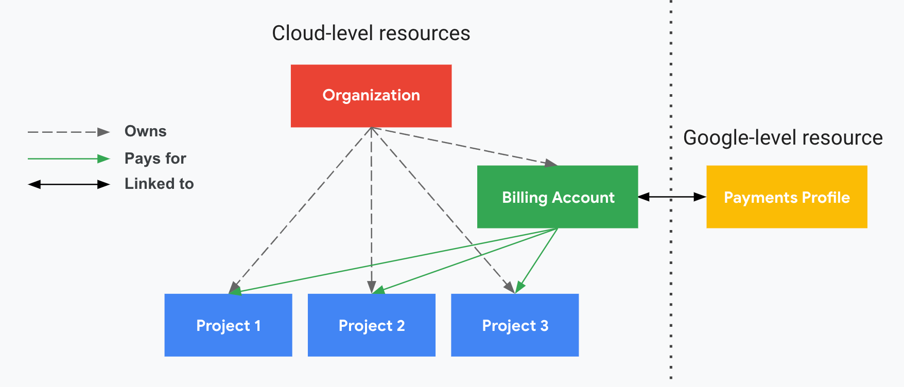
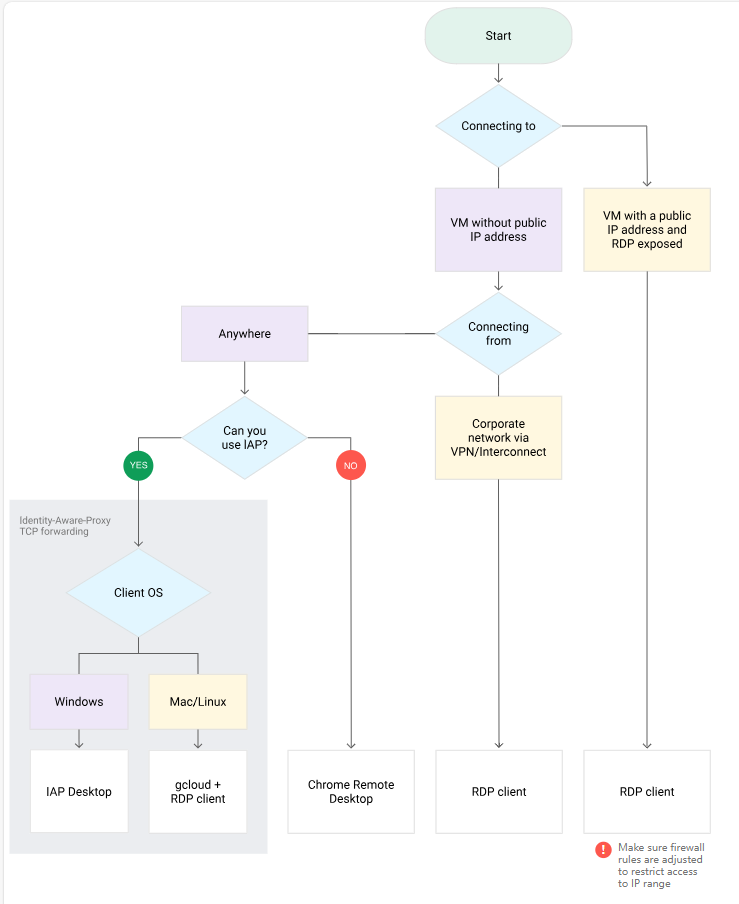
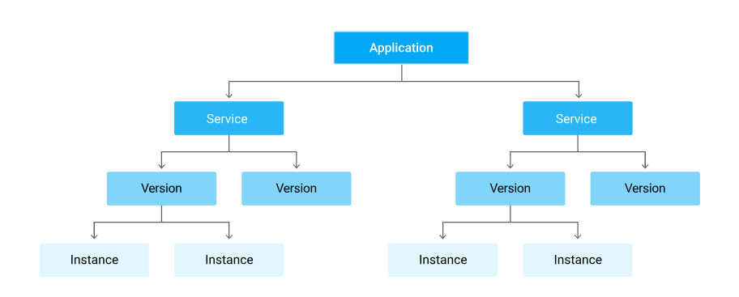

## 项目相关

项目名称由用户在创建时设置。 它不必是唯一的。 它可以在创建时间后更改。

---

组织位于 Google Cloud 资源层次结构的顶部。 这可以分为文件夹，这是可选的。 接下来是您定义的项目。 最后，在项目下创建资源。由较低级别策略实施的 IAM 策略可以覆盖在较高级别定义的策略。

---

## IAM
gcloud iam roles copy 是 Google Cloud SDK (gcloud) 中的一个命令，用于复制一个现有的自定义 Identity and Access Management (IAM) 角色。这个命令可以将一个已有角色的权限配置复制到一个新的自定义角色中，从而简化了创建自定义角色的过程。

--- 

在一个项目中创建一个服务帐户，然后在其他项目中应用它。

---

在 IAM 中，不会直接向最终用户授予资源访问权限，而是将权限分组为多个角色，然后将这些角色授予经过身份验证的主帐号。

---

权限以 service.resource.verb 的形式表示 (compute.addresses.get)  
角色以 roles/service.roleName 格式指定 (roles/compute.admin)  

---

A Policy 是 的 bindings 集合。A binding 将一个或多个 members 主体绑定到单个 role .主体可以是用户帐号、服务帐号、Google 群组和网域（例如 G Suite）。A role 是命名的权限列表;每个角色 role 可以是 IAM 预定义角色或用户创建的自定义角色。

> 自定义角色只能应用于项目级别或组织级别。它们不能应用于文件夹级别。

---

```
# 列出组织或项目的预定义角色或自定义角色
gcloud iam roles list
```

---

## 网络相关
### VPC
要创建具有单个子网的自定义 VPC。子网的范围最大可能为 10.0.0.0/8。

---

您可以 ping 通所有虚拟机实例的外部 IP 地址，即使它们位于其他可用区或 VPC 网络中也是如此。这就证明了对这些实例的公共访问权限仅由您先前建立的 ICMP 防火墙规则控制。

---

您无法 ping 通位于不同的 VPC 网络中的内部 IP 地址，尽管它们全部位于同一区域（Region）中。  
默认情况下，VPC 网络是隔离的专用网络网域。但是，除非您设置 VPC 对等互连或 VPN 等机制，否则无法在网络之间使用内部 IP 地址通信。

---

VPC 网络中的每个实例都有默认网络接口。您可以创建连接到您的虚拟机的其他网络接口。通过使用多个网络接口，您可以创建将某个实例直接连接到多个 VPC 网络的配置。

---

在具有多个接口的实例中，每个接口对于其所在子网都有一个路由。此外，该实例会有一个与主要接口 eth0 相关联的默认路由。除非手动配置，否则从某个实例流向任何目的地（直接关联的子网除外）的所有流量都将通过 eth0 上的默认路由传出该实例。

---

VPC 网络具有内部 DNS 服务，允许您按 DNS 名称（而非内部 IP 地址）对实例进行寻址。内部 DNS 查询由实例主机名构成，会解析为实例的主要接口 (nic0)。

---

[IP 地址](https://cloud.google.com/vpc/docs/ip-addresses?hl=zh-cn)

---

## 产品相关
### Cloud Billing

一个项目一次只能链接到一个计费帐户。一个计费帐户可以链接到一个或多个项目。

---

组织、项目、Cloud Billing 帐号和 Google 付款资料之间的 IAM 关系


---

Cloud Billing 帐号不支付 Google Workspace 帐号的费用。 Google Workspace 客户需要单独的 Google Workspace 结算信息。  
重要提示：未链接到有效 Cloud Billing 帐号的项目无法使用 Google Cloud 或 Google Maps Platform 服务。即使您只使用免费服务也是如此。  
无法删除 Cloud Billing 帐号。

---

[将 Cloud Billing 数据导出到 BigQuery](https://cloud.google.com/billing/docs/how-to/export-data-bigquery?hl=zh-cn)

---

### Cloud Monitoring
您最多可以设置 5 个 Cloud Monitoring 渠道来定义将接收预算提醒的电子邮件收件人。

---

### Cloud Logging
接收器控制 Cloud Logging 路由日志的方式。通过接收器，您可以将部分或全部日志路由到支持的目标位置。

---

### Google Cloud 运维套件

[Google Cloud 运维套件代理](https://cloud.google.com/logging/docs/agent?hl=zh-cn)

---

### Cloud Shell
Cloud Shell 提供容器化命令行界面，允许您运行命令并使用脚本自动执行这些命令。

---

### Cloud SDK

[初始化 gcloud CLI](https://cloud.google.com/sdk/docs/initializing?hl=zh-cn)

---

### Cloud Storage
签名网址，该网址提供了对特定 Cloud Storage 资源的限时访问权限。

---

gsutil 并行复合上传可用于拆分大文件并并行上传。

---

[并行复合上传](https://cloud.google.com/storage/docs/parallel-composite-uploads?hl=zh-cn)

[存储类别](https://cloud.google.com/storage/docs/storage-classes?hl=zh-cn)

[对象生命周期管理](https://cloud.google.com/storage/docs/lifecycle?hl=zh-cn)

[Cloud Storage 最佳做法](https://cloud.google.com/storage/docs/best-practices?hl=zh-cn)

---

### Cloud SQL
借助时间点恢复，您可以将实例恢复到特定的时间点。可以通过在二进制日志文件中提供特定的二进制日志位置来执行时间点恢复。亦可以使用时间戳执行时间点恢复。

---

Cloud SQL 不支持在要迁移的数据库中使用的用户定义函数。

---

### BigQuery
BigQuery 提供两种类型的价格模式：按需价格和基于容量的价格。  
按需价格：您需要为查询扫描的数据付费。  
对于希望每月支付稳定的查询费用，而不是根据处理的数据量（TB 数）支付按需计费价格的客户，BigQuery 为其提供了统一费率价格方案。

---

BigQuery 传输服务是在 Cloud Storage 和 BigQuery 之间设置传输的最简单流程。它包含在一个命令中。它也是免费的。

---

BigQuery 价格包含两个主要组成部分：
* 分析价格是处理查询的费用，其中包括 SQL 查询、用户定义的函数、脚本，以及可扫描表的某些数据操纵语言 (DML) 和数据定义语言 (DDL) 语句。
* 存储价格是存储您加载到 BigQuery 中的数据的费用。

---

没有 bigquery.tables.read 的权限。

---

### Bigtable

[使用 IAM 控制访问权限](https://cloud.google.com/bigtable/docs/access-control?hl=zh-cn)

---

### Compute Engine
使用 RDP 连接到 Windows 虚拟机  


---

> 您必须启用二进制日志记录才能使用时间点恢复。

> 对于单租户节点，只有来自同一项目的虚拟机在该节点上运行。 通过设置单租户节点，您可以在物理上将您的虚拟机与其他项目中的虚拟机分开。

---

[OS Login 简介](https://cloud.google.com/compute/docs/oslogin?hl=zh-cn)

[增加永久性磁盘的大小](https://cloud.google.com/compute/docs/disks/resize-persistent-disk?hl=zh-cn)

---

### GKE
* gcloud container clusters get-credentials 用于获取 Google Kubernetes Engine（GKE）集群的凭据并配置 kubectl 工具，以便与 GKE 集群进行交互。
* kubectl config view 命令用于查看当前用户的 Kubernetes 配置文件的内容。输出结果通常以 YAML 或 JSON 格式显示，包括配置文件中定义的上下文、集群、用户和命名空间等信息。
* kubectl cluster-info 命令用于查看当前连接的 Kubernetes 集群的信息。输出结果包括 Kubernetes 控制平面的地址、服务和 API 服务器的地址等信息。这个命令通常用于获取有关集群的基本信息，以确保你正在与正确的集群进行交互。
* kubectl config current-context 命令用于查看当前活动的 Kubernetes 上下文的名称。输出结果是当前活动上下文的名称，它确定了你与哪个集群和命名空间进行交互。这个命令通常用于确认当前工作环境。
* kubectl config get-contexts 命令用于获取和列出 Kubernetes 配置文件中定义的上下文的列表。输出结果是一个表格，包含了上下文的名称、关联的集群、用户、命名空间以及上下文的状态（活动或非活动）。这个命令通常用于查看可用的上下文，并确定当前正在使用的上下文。你可以通过切换上下文来更改工作环境，以便与不同的集群或命名空间进行交互。
* kubectl config use-context CONTEXT_NAME 命令用于切换当前活动的 Kubernetes 上下文。CONTEXT_NAME 是要切换到的上下文的名称。运行此命令后，当前上下文将更改为指定的上下文，你将在该上下文中执行后续的 kubectl 命令。这允许你切换工作环境以便与不同的集群或命名空间进行交互。
* kubectl top nodes 命令用于查看 Kubernetes 集群中各个节点的性能指标。输出结果包括每个节点的 CPU 和内存使用情况，以及节点的名称。这个命令通常用于监视集群节点的性能，以识别潜在的性能问题或瓶颈。

---

Kubernetes（K8s）中的 DaemonSet 对象是一种控制器，用于确保在集群中的每个节点上运行一个或多个副本（Pod）。DaemonSet 主要用于在集群中的每个节点上运行系统级别的守护进程、日志收集器、监控代理等基础设施组件，以确保这些组件在每个节点上都能正常运行。

---

在自动导航模式下创建的集群是区域性的 (Regional), 具有控制平面的多个副本，在给定区域 (region) 内的多个区域 (zone) 中运行。

---

[将工作负载迁移到其他机器类型](https://cloud.google.com/kubernetes-engine/docs/tutorials/migrating-node-pool?hl=zh-cn#step_4_migrate_the_workloads)

---

### APP Engine


在配置 Google Cloud Platform（GCP）的 App Engine 时，min_idle_instances 是一个与自动缩放相关的配置参数。这个参数用于指定 App Engine 实例的最小闲置数量，也就是在没有请求时仍然保持运行状态的实例数量。

---

重要提示：
* 每个 Cloud 项目只能包含一个 App Engine 应用；创建此应用后，您将无法更改其位置。
* App Engine 灵活环境不会扩展到零。
* App Engine 标准环境不允许自定义包。

---

Roles/appengine.deployer 具有以下执行权限。

- 列出所有服务/版本/实例
- 查看应用程序/服务/版本/实例的所有设置
- 查看运行时指标，例如资源使用情况/负载信息/错误信息
- 删除版本

---

[授予 App Engine 访问权限的角色](https://cloud.google.com/appengine/docs/standard/java-gen2/roles?hl=zh-cn)


### Cloud Functions
Cloud Functions 是 GCP 中的一项无服务器计算服务，它使开发人员能够编写、部署和运行事件驱动的小型计算函数，而无需管理底层的服务器基础设施。Cloud Functions 可以响应各种云事件和外部事件，并以高度可伸缩的方式运行，以满足不同的应用场景。

---

Cloud Function 是一个无服务器计算服务，用于编写、部署和运行事件驱动的小型计算函数。它的主要目的是响应和处理事件，例如 HTTP 请求、Cloud Storage 存储桶中的文件上传、Pub/Sub 主题中的消息等。Cloud Function 的代码通常包含特定的业务逻辑，用于处理特定类型的事件。

---

当写入 Cloud Storage 完成时 - 完成事件触发器被触发。
```
-- trigger-event google.storage.object.finalize
```

---

Cloud Functions 是一项服务，允许您创建基于事件执行的无服务器应用程序。 Cloud Functions 支持 Cloud Storage、HTTP、Cloud Pub/Sub、Firebase、CloudLogging 等事件。

---

[Cloud Functions 触发器](https://cloud.google.com/functions/docs/calling?hl=zh-cn#2nd-gen-triggers)

---

### Cloud Pub/Sub
Cloud Pub/Sub 是 Google Cloud 的一项完全托管的消息传递服务，用于构建分布式、可扩展和高度可靠的应用程序，以处理实时数据流和事件驱动的架构。它允许不同组件、服务或系统之间以异步方式进行通信，以实现松耦合的应用程序架构。

---

Cloud Pub/Sub 是一项消息传递服务，用于可靠地传递消息和事件。它用于解耦应用程序组件、构建事件驱动的架构、实现异步通信等。Cloud Pub/Sub 负责消息的发布和订阅，以及确保消息的可靠传递。

---

## 其他

使用 gsutil 通过 Cloud SDK 与 Cloud Storage 交互。

---

标签（label）是用户定义的键值格式的字符串，用于组织资源，并且可以通过计费进行传播。  
标签（tags）是用户定义的字符串，仅应用于实例，主要用于网络，例如应用防火墙规则。  

标签（label）是一种可以分配给 Google Cloud 实例的键值对。它们可帮助您以所需的粒度组织这些资源并大规模管理费用。您可以将标签附加到各项资源，然后根据其标签对资源进行过滤。标签的相关信息将转发到结算系统，以便您按标签细分结算费用。借助内置的结算报告，您可以按资源标签对费用进行过滤和分组。您还可以使用标签来查询结算数据导出。  

标记（tags）提供了一种为资源创建注解的方法，并且在某些情况下，您可以根据资源是否具有特定的标记有条件地允许或拒绝政策。您可以使用标记并有条件地执行政策，以便在资源层次结构内进行精细控制。  

---

批量折扣（也称为持续使用折扣）会自动应用并包含在计算器估算值中。

---

gcloud auth activate-service-account  
授权使用服务帐户访问 Google Cloud。  
要允许 gcloud （以及 Google Cloud CLI 中的其他工具）使用服务帐号凭据发出请求，请使用此命令从包含私有授权密钥的文件导入这些凭据，并激活它们。  
gcloud auth activate-service-account 提供与 gcloud auth login 相同的功能，但使用服务帐户而不是 Google 用户凭据。

---

gcloud config configurations create  
创建新的命名配置  

---

gcloud config configurations activate  
激活现有的命名配置  

---

gcloud iam roles copy  
从现有角色创建角色  

---

gcloud app services set-traffic  
此命令设置跨服务或项目的版本流量分配。  

---

## 博客
### [计算引擎说明：选择正确的机器系列和类型](https://cloud.google.com/blog/products/compute/choose-the-right-google-compute-engine-machine-type-for-you?hl=en)

### [如何构建事件驱动型应用](https://cloud.google.com/blog/products/serverless/learn-about-cloud-functions-events-and-triggers)
