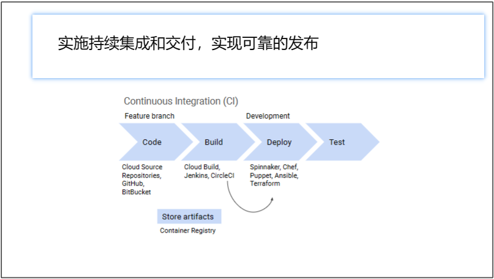
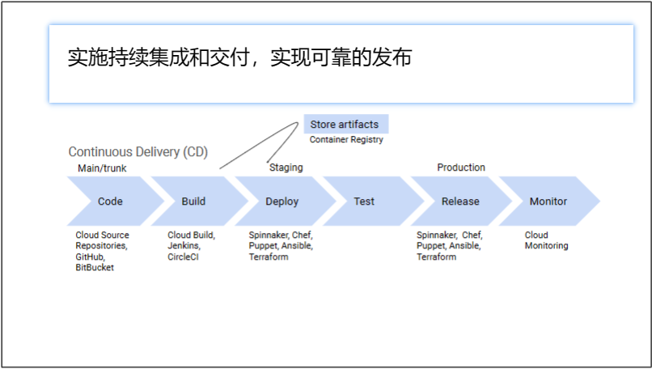
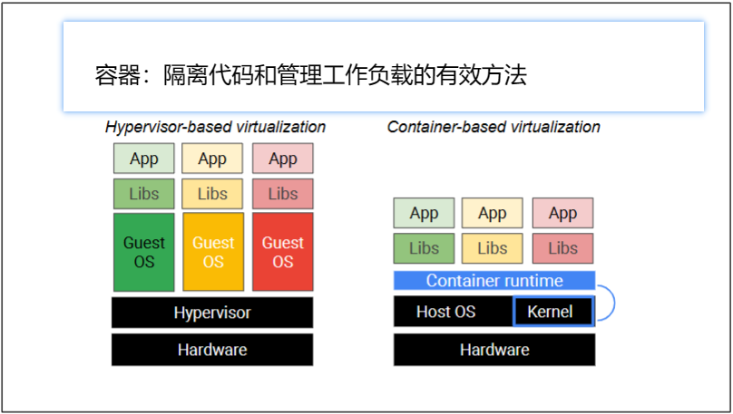
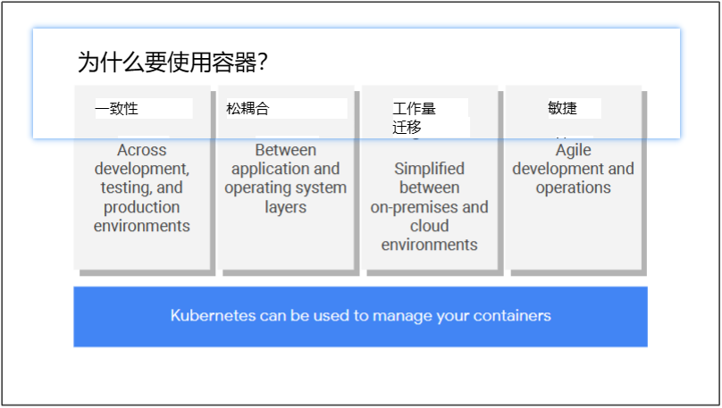
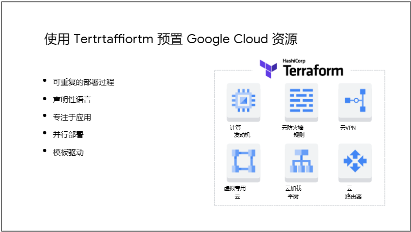
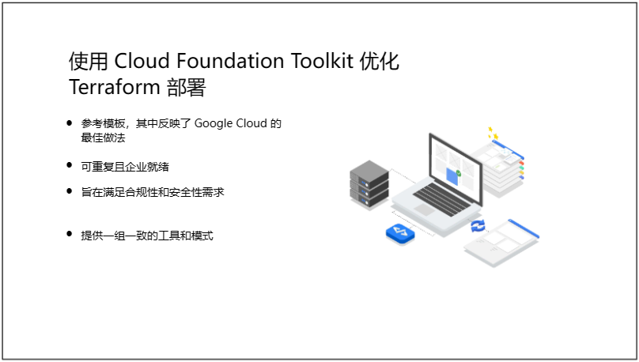
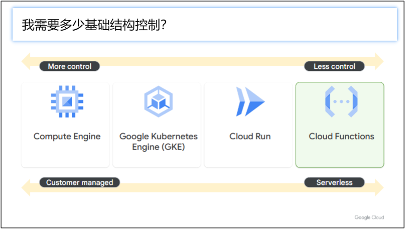
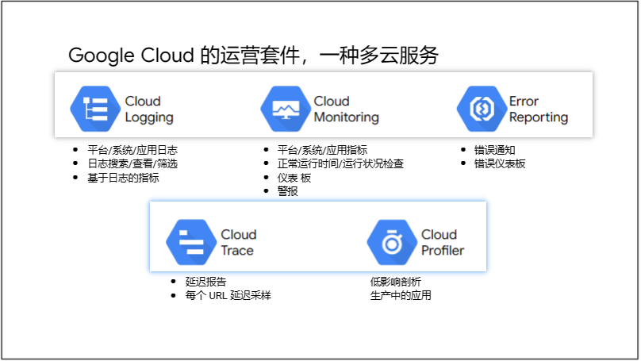

# 课程介绍
* 您将学习如何通过将基础设施视为代码来创建可重复且可靠的部署。
* 我们向您介绍持续集成和交付的原则。
* 您将了解如何使用 Cloud Build、Container Registry 和 Terraform 在标准 Google Cloud 基础架构中自动创建应用程序映像。
* 我们将深入探讨 Google Cloud 的运营套件，这是一项多云服务，可帮助您调试开发和生产中的问题。
* 您将学习如何捕获和流式传输日志、跨服务跟踪请求以及监控应用程序的性能。
* 我们非常高兴向您介绍站点可靠性工程（SRE）的原理。SRE 原则让您可以一睹 Google 如何监控自己的应用程序以确保可靠性。

# 部署应用程序
若要运行可靠的服务，必须具有可靠的发布过程。当有许多工程师构建应用程序的组件时，他们能够快速运行单元测试、集成测试和其他测试至关重要。

对于大多数面向用户的软件，团队通常希望发布通常具有新功能和错误修复的软件。为了实现高发布速度，必须尽可能自动化构建、测试和发布过程。在部署应用程序模块中，您将了解持续集成和交付管道的组件。您还将了解如何使用 Cloud Build 为应用程序构建容器映像，并将映像推送到 Container Registry。

## 使用 Cloud Build、容器注册表和 Terraform 部署应用程序
  
持续集成是一种开发人员工作流，在这种工作流中，开发人员经常从主分支中提取，并将其更改提交到源代码存储库（如 Cloud Source Repositories 或 GitHub）中的功能分支中。这些提交触发器内置于 Jenkins 或 CircleCI 等构建系统中。

构建过程使用 Cloud Build 创建新的应用程序映像，并将其存储在项目存储库（例如容器注册表）中。部署系统（如 Spinnaker）在云环境中部署工件。

可以使用 Terraform 为应用程序所需的托管服务提供资源。

在开发环境中部署应用程序后，可以自动运行测试来验证代码。如果所有测试都通过，则可以将更改从功能分支推送到主分支。

  
持续交付是在将更改推送到存储库中的主分支时触发的工作流。生成系统生成代码并创建应用程序映像。部署系统将应用程序映像部署到暂存环境，并运行集成测试、性能测试等。如果所有测试都通过，则该版本将被标记为候选发布版本。您可以手动批准候选发布版本。此批准可以触发以金丝雀或蓝绿版本的形式部署到生产环境。

您可以通过云监控等监控服务来监控应用在生产环境中的性能。如果新部署以最佳方式运行，则可以将整个流量切换到此新版本。但是，如果发现问题，也可以快速回滚到上一个稳定版本。

## 为什么要使用容器进行部署？
  
基于容器的虚拟化是传统虚拟机中使用的硬件虚拟化的替代方法。虚拟机之间部分是相互隔离的，方法是让每个虚拟机都有自己的操作系统实例。但是操作系统的启动速度可能很慢，并且可能占用大量资源。容器通过使用现代操作系统的内置功能将环境彼此隔离来应对这些问题。

进程是一个正在运行的程序。在 Linux 和 Windows 中，正在运行的进程的内存地址空间长期以来一直相互隔离。软件容器的流行实现建立在这种隔离之上。它们利用其他操作系统功能，使进程能够拥有自己的命名空间，并使主管进程能够限制其他进程对资源的访问。

容器的启动速度比虚拟机快得多，并且使用的资源更少，因为每个容器都没有自己的操作系统实例。相反，开发人员使用一组最少的软件库来配置每个容器来完成这项工作。轻量级容器运行时执行允许该容器启动和运行所需的管道作业，并根据需要调用内核。容器运行时还确定映像格式。

### 为什么要使用容器？
  

### 为什么要使用 Kubernetes？
Kubernetes 是一个管理容器编排的开源工具。优势包括：
* 自动化：Kubernetes 可自动执行容器化应用程序的部署、扩展、负载均衡、日志记录、监控和其他管理功能。
* 效率：通过指定容器的 CPU 和内存需求，Kubernetes 可以高效地将容器打包在节点上，从而高效地使用计算节点。
* 声明式配置：您可以配置要实现的所需状态，而不是发出一系列命令来实现该所需状态。Kubernetes 将使您的系统符合该期望状态。这大大降低了大型系统的操作复杂性。
* 自我修复：Kubernetes 可以自动替换已失败或未通过健康检查的容器。这导致操作人员的半夜页面大大减少。

Google Kubernetes Engine （简称 GKE） 是 Google Cloud 用于运行容器的完全托管式解决方案。GKE 可扩展、修复和管理运行 Kubernetes 管理的容器的计算节点集群。

## 使用 Cloud Build 和 Terraform 构建管道

### 使用 Cloud Build 和 Container Registry 创建应用镜像
Cloud Build 是一项完全托管的服务，可让您设置构建管道，为您的应用创建 Docker 容器映像，并将该映像推送到 Google Cloud 容器注册表。无需将所有生成工具和容器映像下载到生成计算机，也无需管理自己的生成基础结构。

通过使用容器注册表和 Cloud Build，您可以创建在将代码提交到存储库时自动触发的生成管道。在容器注册表中，可以创建基于触发器类型执行的生成触发器。触发器类型指定是否应根据对存储库中特定分支的提交或包含特定标记的提交来触发生成。

### 使用 Terraform 预置 Google Cloud 资源
  
借助 Terraform，您可以使用声明式配置文件配置 Google Cloud 资源，例如虚拟机、容器、存储和网络。您只需以声明性格式指定应用程序所需的所有资源，然后部署您的配置。HashiCorp 配置语言 （HCL） 允许使用块、参数和表达式对资源进行简明描述。

### Terraform 语言
Terraform 语言是用于声明资源的用户界面。资源是基础架构对象，例如 Compute Engine 虚拟机、存储桶、容器或网络。Terraform 配置是 Terraform 语言中的完整文档，它告诉 Terraform 如何管理给定的基础结构集合。一个配置可以由多个文件和目录组成。

### Terraform 可用于多个公有云和私有云

### 使用 Cloud Foundation Toolkit 优化 Terraform 部署

## 应用程序开发 - 将应用程序部署到 Kubernetes Engine：Java
* 创建 Dockerfile 以打包 Quiz 应用程序前端和后端代码以进行部署
* 利用 Cloud Build 生成 Docker 映像配置 GKE 集群以托管 Quiz 应用程序
* 使用 Kubernetes 部署将复制的 Pod 置备到 GKE 中
* 利用 Kubernetes 服务为 Quiz 前端预配负载均衡器

# 适合您的应用程序的计算选项
Google Cloud 提供了一系列计算选项，可用于运行应用。您可以选择符合应用程序需求的平台，包括基础结构所需的控制级别。对基础设施的更多控制通常会导致更大的运营负担。

## 为您的应用程序计算选项
Google Cloud 提供了广泛的平台来运行您的应用程序。
* 借助 Compute Engine，您可以创建虚拟机，以模拟您在传统数据中心中使用的服务器。虚拟机非常灵活：它们允许您运行与物理硬件上运行的应用程序相同的各种应用程序，但现在可以在 Google 的基础架构上运行。
* Google Kubernetes Engine （简称 GKE） 是 Google Cloud 的托管服务，用于运行容器并管理用于运行容器的虚拟机。使用 GKE，可以创建一个虚拟机集群来运行容器化应用。当您将应用部署到集群时，GKE 可以管理集群和应用的扩展性和安全性，从而降低运行应用的运营成本。
* Cloud Run 是一个完全托管的无服务器平台，还可以运行容器化应用。与 GKE 不同的是，Cloud Run 的所有基础架构管理都是抽象的。Cloud Run 会自动从零开始扩展和缩减几乎是瞬间的，取决于流量。您只需在代码运行时付费。
* 借助 Cloud Functions，您还可以在云中运行代码，而无需服务器或容器的管理。编写事件驱动型代码，Google Cloud 将管理一切，从零扩展到全球规模。

## Compute Engine
借助 Compute Engine 在高性能虚拟机上运行应用：
* Compute Engine 支持针对常用配置使用预定义的机器类型，但也允许您创建自定义机器类型，以便为虚拟机和工作负载自定义 CPU 和内存。
* 借助 Compute Engine，您可以创建和附加永久性磁盘和本地 SSD。这些磁盘可以像桌面或服务器中的物理磁盘一样进行访问。与典型的物理磁盘不同，Compute Engine 磁盘在运行时可以增加大小。永久性磁盘的性能和吞吐量会随着大小的增加而增加。
* Compute Engine 提供抢占式虚拟机，非常适合大型计算和批处理作业。如果必须回收容量，Google Cloud 可以终止抢占式虚拟机。对于可以处理这些中断的应用程序，与标准 VM 相比，抢占式 VM 可享受至少 60% 的折扣。
* 可以在 VM 上运行所选的操作系统，包括 Debian、CentOS、Ubuntu 以及各种其他风格的 Linux 或 Windows。您还可以使用来自 Google Cloud 社区的共享映像或自带操作系统。

### 使用 Compute Engine 实现全面的基础架构控制
* 借助 Compute Engine，您可以为具有独特计算或操作系统要求的专用应用创建高度自定义的虚拟机。
* 可以安装和修补 VM 上运行的软件。
* 您可以基于实例模板创建虚拟机的托管实例组，并配置托管实例组的全局负载均衡和自动缩放。Compute Engine 可以执行运行状况检查并替换实例组中运行状况不佳的实例。Compute Engine 还可以根据特定区域的流量自动扩展实例数量。

### 使用 Compute Engine 实现最大的灵活性
* 您可以在 Compute Engine 上安装和运行任何第三方许可的软件。
* 您可以将图形处理单元 （GPU） 和张量处理单元 （TPU） 附加到 Compute Engine 虚拟机，以加速并行处理和机器学习工作负载。
* 您可以将 Compute Engine 用于需要 HTTP 或 HTTPS 以外的 TCP 网络协议的应用。

### 使用 Compute Engine 进行直接迁移
Compute Engine 是直接迁移的理想选择。您可以将虚拟机从本地数据中心或其他云提供商迁移到 Google Cloud，而无需更改应用。

## Google Kubernetes Engine
Google Kubernetes Engine。Kubernetes 是用于部署、扩展和操作容器的领先开源平台。Kubernetes 最初是由 Google 开发的，现在是一个云原生计算基金会项目，拥有庞大而活跃的社区。

### Kubernetes 是一个用于部署、扩展和操作容器的开源平台
Kubernetes 为您提供了一个框架，可以弹性地大规模运行分布式容器化系统。它管理许多操作任务，例如扩展应用程序组件、提供稳定的网络抽象、编排故障转移、推出部署、存储编排以及机密和配置管理。

Kubernetes 集群包含控制平面和工作节点。群集中的节点是运行应用程序的计算机（虚拟或物理）。Kubernetes 控制平面管理集群中的工作节点和 Pod。Pod 是一组容器，它们在节点上共享网络和存储资源。

### GKE 是 Kubernetes 的托管服务
GKE 通过消除创建和管理 Kubernetes 集群所需的许多基础架构任务，自动为您处理大部分运维工作。借助 GKE，Google 可以管理您的大部分集群任务。Google 负责管理控制平面、Pod 的扩展、节点修补和升级，以及集群的监控、可用性和可靠性。  
默认情况下，您可以管理基础节点和节点池，包括预配、维护和生命周期管理。您还负责为集群选择安全和网络配置。此管理级别是 GKE 的标准模式。

GKE Autopilot 是一种操作模式，在这种模式下，可以为你管理整个集群的基础架构，包括控制平面、节点池和节点。  
通过管理群集基础结构，Autopilot 有助于降低运营和维护成本，同时提高资源利用率。Autopilot 是一种完全托管的 Kubernetes 体验，可让你专注于工作负载，而不是管理群集的基础结构。  
Autopilot 会自动实施 GKE 强化指南以及安全和网络最佳做法，并阻止安全性较低的做法。

GKE 标准模式为客户提供了针对集群基础架构的高级配置灵活性，而 GKE Autopilot 模式则允许 Google 配置和管理整个集群和底层基础架构。

### GKE 功能
* GKE 是完全托管的，这意味着您不必配置底层资源。
* GKE 使用容器优化的操作系统来运行您的工作负载。Google 维护此操作系统，该操作系统经过优化，可以最小的资源占用快速扩展。
* 使用 GKE 时，首先要指示服务为您实例化 Kubernetes 集群。启用 GKE 的自动升级功能后，可确保您的集群始终使用最新稳定版本的 Kubernetes 自动升级。在 GKE 集群中托管容器的虚拟机称为节点。自动修复可以自动修复运行状况不佳的节点。它会在集群的每个节点上执行定期运行状况检查。如果某个节点被确定为运行状况不佳且需要修复，GKE 将耗尽该节点，从而允许工作负载正常退出。然后，它将重新创建节点。
* GKE 和 Kubernetes 都支持集群内工作负载的扩展。GKE 还支持集群本身的扩展。
* GKE 使用 Cloud Monitoring 和 Cloud Logging 来帮助您监控和了解应用程序的性能和行为。
* GKE 与 Google Cloud 的许多部分无缝集成。借助 Cloud Build，您可以使用安全存储在 Artifact Registry 中的专用容器映像来自动部署工作负载。Identity and Access Management 允许您使用帐户和角色权限来控制访问。GKE 与 Virtual Private Cloud （VPC） 集成，可让您使用 Google Cloud 的网络功能。最后，Google Cloud Console 提供了对 GKE 集群及其资源的洞察，从而允许您查看、检查和删除这些集群中的资源。

### 将 GKE 用于复杂的便携式应用程序
* GKE 支持任何可以打包为 Docker 映像的应用运行时。GKE 非常适合容器化应用，包括第三方容器化软件。
* 您可以在混合云或多云环境中的 Kubernetes 上运行容器映像。当应用程序的某些部分在本地运行而其他部分在云中运行时，此功能特别有用。
* 您可以使用 GKE 运行使用 HTTP 和 HTTPS 以外的网络协议的容器化应用。

### GKE 简化了应用的基础架构服务配置
* 借助 GKE，当您创建 Kubernetes 永久性卷时，系统会自动配置 Google Cloud 永久性磁盘，以便为有状态应用提供存储空间。
* 当您部署 Kubernetes 网络负载均衡器服务时，GKE 还会自动配置 Google Cloud 网络负载均衡器，并在配置 Kubernetes Ingress 资源时预置 Google Cloud HTTP 和 HTTP（S） 负载均衡器。此自动配置功能消除了手动配置和管理这些资源的需要。
* GKE 支持 Google Cloud 的运维套件，该套件提供与用于故障排除以及应用和服务监控的工具的集成。

### 使用 GKE 可以更好地控制如何为应用部署资源
GKE 简化了集群部署和扩展。您可以描述要在应用程序所需的所有容器中可用的计算、内存、网络和存储资源。GKE 会自动配置和管理底层 Google Cloud 资源。您可以部署固定大小的集群，也可以将集群配置为自动缩放，从而添加或删除计算实例，以响应集群内运行的容器的资源要求的变化。

### 使用标准 Kubernetes 工具部署应用程序
尽管可以使用 kubectl 命令直接部署临时资源，但建议的最佳做法是使用 YAML 清单文件来定义配置。这些文件定义用于应用程序中组件的容器的属性。清单文件还可以定义网络服务、安全策略和其他 Kubernetes 对象，用于交付可复原、可扩展的容器化应用程序。

### 将 GKE 用作 CI/CD 管道的一部分
作为持续集成和交付 （CI/CD） 管道的一部分，可以为每个代码提交生成新的 Docker 映像。CI/CD 管道可以自动将映像部署到开发、测试和生产环境。Cloud Build、Artifact Registry 和 GKE 可用于创建强大的 CI/CD 系统。

## Cloud Run
接下来是 Cloud Run。Cloud Run 是一个完全托管的计算平台，可让您运行请求或事件驱动的无状态工作负载，而无需担心服务器问题。

### Cloud Run 可让您专注于开发
它抽象化了所有基础结构管理，例如预配、配置和管理服务器，因此您可以专注于编写代码。它几乎可以立即根据流量自动从零开始向上和向下扩展，因此您永远不必担心缩放配置。Cloud Run 还仅针对您使用的资源收费，四舍五入到最接近的 100 毫秒，因此您无需为此付费过度预配的资源。

### Cloud Run 不会限制您的编码方式
借助 Cloud Run，您可以轻松部署任何无状态容器，以侦听通过 HTTP 传送的请求或事件，从而按照自己的方式编写代码。容器提供了工作负载的灵活性和可移植性。借助 Cloud Run，您可以使用所需的任何框架和工具，以任何语言构建应用，并在几秒钟内完成部署。

### 使用单个命令部署容器化应用程序
您可以使用单个命令来部署容器化应用程序。之后，Cloud Run 会自动水平扩展您的容器映像以处理收到的请求，然后在需求减少时将其缩减。您只需为请求处理过程中消耗的 CPU、内存和网络付费。

### Cloud Run 开发工作流程分为三个步骤
* 首先，使用您喜欢的编程语言来编写应用程序。此应用程序应侦听 Web 请求。
* 其次，生成应用程序并将其打包到容器映像中。
* 最后，将容器映像部署到 Cloud Run。

部署容器映像时，将获得唯一的 HTTP（S） URL。Cloud Run 会按需启动容器以处理请求，并动态添加和移除容器，以确保能够处理所有传入请求。

### Cloud Run 还具有基于源代码的工作流
使用基于源代码的方法时，将部署源代码而不是容器映像。然后，Cloud Run 会自动构建您的源代码，并将应用打包到一个安全的容器映像中。

Cloud Run 使用 buildpack 来执行此操作。Buildpack 将您的应用程序源代码转换为可在任何云上运行的容器映像。Google Cloud 构建包还用于 Cloud Functions 和 App Engine 的内部构建系统。

### 构建基于 Web 和事件的应用程序
* Cloud Run 是数据处理应用的绝佳选择。由于您按使用量（而不是预置资源）付费，因此您只需在处理数据时付费。
* Cloud Run 还可以托管小型或大型 Web 应用和 Web API;它在必要时向上扩展，在不使用时向下缩放到零。
* 必须运行以响应 Pub/Sub 或 Eventarc 事件的作业非常适合 Cloud Run。

## Cloud Functions
借助 Cloud Functions，您可以开发事件驱动、无服务器且高度可扩展的应用。

### 使用 Cloud Functions 开发事件驱动型、无服务器、高度可扩展的微服务
每个函数都是一个轻量级的微服务，可用于集成应用程序组件和数据源。Cloud Functions 非常适合需要一小段代码来快速处理数据以响应事件的微服务。

Cloud Functions 的定价取决于函数的运行时间、调用次数以及您为函数预置的资源。

### 支持事件驱动型处理或开发轻量级微服务
* 您可以使用 Cloud Functions 执行轻量级提取-转换-加载（ETL）操作，或处理发布到 Pub/Sub 主题的消息。
* Cloud Functions 还可以用作 Webhook 的目标，Webhook 允许应用或服务进行直接 HTTP 调用，以调用使用 Cloud Functions 实现的微服务。
* 为响应事件而运行的任何轻量级功能都是 Cloud Functions 的候选功能。

### 专注于代码：云客户端库
* Cloud Functions 服务会在运行代码之前自动安装所有依赖项。
* 您可以使用 Cloud Client Libraries 以编程方式与其他 Google Cloud 服务进行交互。
* Cloud Functions 目前支持 Node.js、Python、Go、Java、.NET、Ruby 和 PHP。

## 比较
### 我需要多少基础结构控制？
  
* 如果您想将现有的旧系统直接迁移到云端，或者如果您有取决于硬件的特定许可要求，则可能需要使用 Compute Engine。
* 如果您可以在多个云或数据中心上运行容器并拥有混合系统，或者您的应用不是基于 HTTP 的，那么 Google Kubernetes Engine 可能是正确的选择。
* 如果您想运行无状态容器，但根本不要管理基础架构，Cloud Run 可能是最佳选择。
* 如果你只需要编写事件驱动的函数来连接云服务，Cloud Functions 可能是正确的选择。

### 我的团队是如何组织的？
* 如果您的团队主要以开发人员为中心，那么 Cloud Run 和 Cloud Functions 可能最适合您。如果您同时拥有开发者团队和运营团队，则在适当的时候仍可使用 Cloud Run 和 Cloud Functions。
* 您可能还会决定使用 Google Kubernetes Engine 与您的混合系统集成，并更好地控制您的工作负载。GKE 还允许您使用 GPU、TPU 和非 HTTP 网络协议，这些协议不适用于 Cloud Run 和 Cloud Functions。
* 如果您要逐步对应用进行现代化改造，则可能需要管理从本地数据中心迁移的 Compute Engine 虚拟机。运营团队必须能够管理这些虚拟机的运行状况和安全性。

### 我想要什么定价模式？
* Compute Engine 和 Google Kubernetes Engine 的费用基于专用虚拟机的使用情况。费用是可预测的，当您的应用程序需要一致的容量时，这些平台可能是理想的选择。
* Cloud Run 和 Cloud Functions 是按使用量付费的，这可以节省大量成本，尤其是在流量模式不一致的情况下。

### [我应该在哪里运行我的东西？](https://cloud.google.com/blog/topics/developers-practitioners/where-should-i-run-my-stuff-choosing-google-cloud-compute-option)

## App Engine
App Engine 是一个完全托管的无服务器计算选项，用于构建和部署低延迟、高度可扩展的 Web 应用。

App Engine 支持两种环境：标准环境和灵活环境。  
App Engine 标准环境在沙盒中运行您的代码，不需要您构建容器。但是，应用程序必须使用受支持语言的特定版本编写。  
标准环境通过在几秒钟内纵向扩展并在 15 分钟不活动后缩减到零来很好地响应流量峰值。  
您可以根据运行应用程序的计算实例付费，但不需要管理这些实例。当您的应用程序缩减到零时，您无需支付任何费用。  
对于流量激增的非容器化应用程序，标准环境是一个合理的选择。  
App Engine 灵活环境要求您为应用创建容器，但这样做可以获得灵活性。  
可以使用任何语言和库编写代码。  
灵活环境更适合具有持续流量的应用程序，因为它的扩展和缩减速度比标准环境慢得多，并且无法扩展到零。  
应用程序将始终需要在至少一个实例中运行。  
与标准环境一样，您需要为灵活环境使用的所有计算实例付费。

# 监控和性能调优
Google Cloud 的运维套件结合了指标、日志和元数据，无论您是在 Google Cloud、Amazon Web Services、本地基础架构还是混合云上运行。您可以从环境的单一全面视图快速了解服务行为和问题，并在需要时采取措施。

## Google Cloud 的运营套件，一种多云服务
  

### 借助 Cloud Monitoring，您可以提高应用的可靠性
Cloud Monitoring 让用户能够监控 Google Cloud 和多云环境，从而识别趋势并预防问题，从而帮助提高可靠性。借助 Cloud Monitoring，您可以减少监控开销并提高信噪比，从而更快地检测和修复问题。

### APM 包括高级工具，可帮助开发人员减少每个应用程序的延迟和成本
作为开发人员，您如何使您的应用程序更快、更可靠？通过详细了解它们在生产中的行为方式。APM 使用一些与 Google 自己的站点可靠性工程 （SRE） 团队相同的工具，让您深入了解代码的运行方式。这样，无论使用何种云，都可以采取措施来优化代码并修复问题。

### Cloud Trace - 面向所有人的分布式跟踪
Cloud Trace 是一种分布式跟踪系统，可从您的应用中收集延迟数据并将其显示在 Google Cloud Console 中。您可以跟踪请求在应用程序中的传播方式，并获得详细的近乎实时的性能见解。Cloud Trace 会自动分析应用的所有跟踪，以生成深入的延迟报告，从而发现性能下降的情况。Cloud Trace 可以从您的所有虚拟机、容器和 App Engine 项目中捕获跟踪。

使用 Trace，您可以检查单个请求的详细延迟信息，或查看整个应用程序的聚合延迟。使用提供的各种工具和过滤器，您可以快速找到瓶颈发生的位置，并更快地确定其根本原因。Cloud Trace 基于用于保持 Google 服务以极大规模运行的工具。

跟踪持续收集和分析项目中的跟踪数据，以自动识别应用程序性能的最新更改。这些延迟分布可通过“分析报告”功能提供，可以随时间或版本进行比较，如果 Cloud Trace 检测到应用的延迟情况发生重大变化，它会自动提醒您。

Cloud Trace 的专用语言 SDK 可以分析在虚拟机上运行的项目，甚至包括那些不在 Google Cloud 中运行的项目。跟踪 SDK 目前可用于 Java、Node.js、Ruby 和 Go，跟踪 API 可用于从任何源提交和检索跟踪数据。此外，还提供 Zipkin 收集器，允许 Zipkin 跟踪器将数据提交到 Cloud Trace。系统会自动捕获在 App Engine 上运行的项目的跟踪。

Cloud Trace 可以帮助回答问题：
* 我的应用程序需要多长时间来处理给定的请求？
* 为什么我的申请需要这么长时间才能处理请求？
* 为什么我的某些请求比其他请求花费的时间更长？
* 对应用程序的请求的总体延迟是多少？
* 应用程序的延迟是否随时间推移而增加或减少？
* 如何减少应用程序延迟？
* 我的应用程序的依赖项是什么？

概述、跟踪列表和分析报告。Cloud Trace 代理收集跟踪数据后，您可以在 Cloud Trace 界面中近乎实时地查看和分析该数据。

## Cloud Profiler - 持续分析以提高性能并降低成本
Cloud Profiler 监控 CPU 和堆，以帮助您使用交互式图形工具识别延迟和效率低下，从而改善应用程序瓶颈并减少资源消耗。

### Cloud Profiler 可帮助您识别和消除潜在的性能问题。
Cloud Profiler 使用统计技术和跨所有生产应用实例运行的低影响检测，在不降低应用性能的情况下提供应用性能的完整图景。

### Cloud Profiler UI 提供了火焰图，用于将统计信息与应用程序区域和组件相关联
要使用 Cloud Profiler，请在运行应用程序的虚拟机上安装性能分析代理。代理通常以库的形式提供，在运行应用程序时将其附加到应用程序。代理在应用运行时收集分析数据。Cloud Profiler 是一个统计性能分析器，因此代理并不总是处于活动状态。

在代理收集了一些分析数据后，您可以使用 Profiler 界面查看 CPU 和内存使用情况的统计信息如何与应用程序区域相关联。

## 在开发和生产中调试应用程序
使用错误报告，您可以在开发中调试应用程序，还可以对生产中的错误进行故障排除。

Error Reporting 显示应用程序中发生的错误。您可以查看堆栈跟踪以确定错误发生的位置。

## 安装 Cloud Logging 代理以捕获日志
您可以在 Compute Engine 和 Amazon EC2 实例上安装 Cloud Logging 代理，以便将第三方应用的日志流式传输到 Cloud Logging。日志记录代理是基于 Fluentd 的应用程序。当您将日志写入现有日志文件（例如虚拟机实例上的 syslog）时，日志记录代理会将日志发送到 Cloud Logging。

### Cloud Logging 已在其他计算环境中进行预配置
Dataflow、Cloud Functions 和 App Engine 内置了对日志记录的支持。在设置容器集群时，您只需在 Cloud Console 中启用复选框，即可在 Google Kubernetes Engine 上启用日志记录功能。

### 设置基于日志的指标和警报
在 Cloud Logging 中，您可以查看日志并搜索特定类型的消息。您可以创建基于日志的自定义指标，并基于这些指标创建警报。  
基于日志的指标是一项非常强大的功能，因为它们会提醒您注意问题，以便您可以在问题成为主要问题之前做出反应。

### 监控以分析长期趋势
在监视应用程序并收集指标时，可以改进应用程序的设计、提高可靠性、检测和修复安全问题，并根据使用模式降低使用成本。  
* 监控以比较一段时间内或实验配置之间的结果
* 监控以在损坏或即将损坏时发出警报
* 监视器以执行临时回顾性分析
* 确定要监视的 API 和资源

### 确定服务级别指标和目标
服务水平指标 （SLI） 是对服务某些方面的定量度量。服务级别指示器可以是预定义的指标，也可以是自定义指标，例如基于日志的指标。  
服务级别目标 （SLO） 是服务级别的目标值或值范围。

### 创建包含四个黄金信号的仪表板
* 延迟：延迟是处理请求所需的时间。确保区分成功请求和不成功请求的延迟。
* 流量：是衡量系统需求量的指标。它是作为特定于系统的指标来衡量的。
* 错误：表示失败的请求数。
* 饱和度：表示应用程序的满载程度，或者哪些资源正在扩展并达到目标容量。

## 监视开发和生产中的性能
### 开发中：将性能测试添加到测试套件
在“开发”中，将性能测试添加到测试套件中，以确保在修复 bug、添加新功能或更改基础软件时应用程序的性能不会降低。

### 开发中：检查与传入请求相关的性能观察点
在“开发”中，检查与传入请求相关的性能观察点。观察点是配置或应用程序代码的潜在区域，可能指示性能问题。  
性能问题可能是由多个观察点引起的。查看与传入请求相关的指标，并检查此处显示的区域。  

### 开发中：查看应用程序代码和日志
检查日志中是否存在应用程序错误，例如 HTTP 错误和异常。  
检查运行时代码生成。面向方面的编程实践有时会导致应用程序性能降低。请考虑使用编译时代码生成。  
不要从应用程序提供静态资源。相反，请使用内容分发网络，例如带有 Google Cloud Storage 的 Cloud CDN。  
请考虑缓存从数据库中检索到的经常访问的值，或者需要大量计算资源来重新计算的值。您还可以缓存生成的 HTML 片段以供以后使用。  
查找从具有多个串行请求的数据库或服务中检索数据的区域。将这些单独的请求替换为单个批处理请求，或并行发送请求。  
不要在出现错误时不断重试。相反，请使用指数退避重试。实施断路器以在一定次数的故障后停止重试。请注意，只有在出现某些错误（例如连接超时或请求过多）时，才应重试。如果出现 5xx 错误和格式错误的 URL 错误等错误，请不要重试。  

### 在生产环境中：检查与生产环境中的传入请求相关的性能观察点
外部用户负载：分析最频繁的请求和最慢的请求。确认这些请求是预期的。  
周期性负载：分析较长时间段内的流量，以确定哪些时间段的使用率更高。  
恶意负载：确认所有负载都是预期的且合法的。  

### 在生产环境中：查看部署设置
缩放：确保已根据应用程序的流量设置负载均衡和自动缩放策略。保守地设置目标利用率级别，以确保应用程序在新 VM 实例联机时继续处理流量。  
区域：确定大部分流量的来源。在适当的区域部署资源以减少延迟。  
cron 作业：确保正确调度 cron 作业。