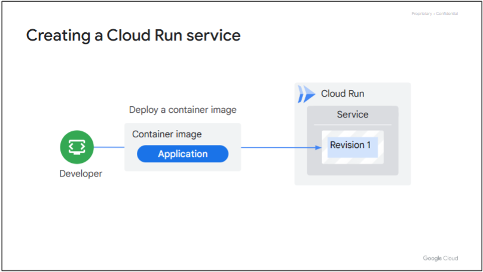
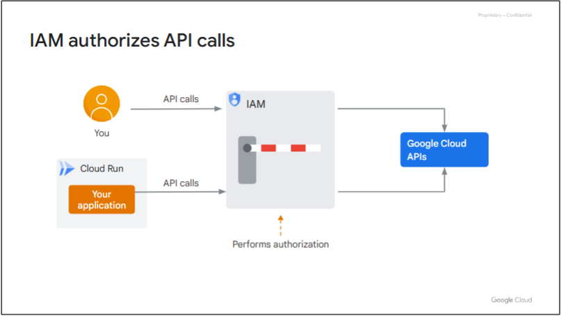

# 课程介绍
## 本课程专为希望使用 Cloud Run 开发应用的应用开发者而设计
* 学习目标 #01：了解 Cloud Run 的基础知识，包括资源模型、容器生命周期和自动缩放。
* 学习目标 #02：在部署到 Cloud Run 之前，先在本地开发和测试应用。
* 学习目标 #03：将服务身份和 IAM 与 Cloud Run 结合使用。
* 学习目标 #04：将 Cloud Run 应用与 Google Cloud 服务集成。

# Cloud Run 基础知识
了解 Cloud Run 的基础知识，包括其资源模型和容器生命周期。了解自动缩放的工作原理以及如何控制对 Cloud Run 服务的访问。

## 概述
### 什么是 Cloud Run
Cloud Run 是一个完全托管的计算平台，可让您直接在 Google 基础架构上部署和运行容器。

如果您可以构建以任何语言编写的应用代码的容器映像，则可以在 Cloud Run 上部署该应用。

Cloud Run 可与 Google Cloud 上的其他服务配合使用。您可以构建功能齐全的应用，而无需花费太多时间来操作、配置和扩展 Cloud Run 服务。

### 服务和工作
在 Cloud Run 上，您的代码既可以作为服务持续运行，也可以作为作业持续运行。服务和作业在同一环境中运行，并且可以与 Google Cloud 上的其他服务使用相同的集成。

### Cloud Run 支持 HTTPS

Cloud Run 服务为您提供了运行可靠的 HTTPS 端点所需的基础架构。你的责任是确保你的代码侦听 TCP 端口并处理 HTTP 请求。

Cloud Run 支持向您的应用发出安全的 HTTPS 请求，并且：
* 预配有效的 TLS 证书和 HTTPS 终结点以支持 HTTPS 请求。终结点位于 *.run.app 域的唯一子域上。如有必要，可以为服务配置自定义域。
* 处理传入的请求，解密这些请求，并将其转发到应用程序。
* 支持 WebSockets、HTTP/2 和 gRPC。

### Cloud Run 作业

如果您的代码执行工作，然后停止（脚本就是一个很好的例子），则可以使用 Cloud Run 将代码作为作业运行。

您可以使用 gcloud CLI 从命令行执行作业、安排重复作业或将其作为工作流的一部分运行。

一个作业可以启动单个容器实例或多个容器实例来运行应用程序代码或作业脚本。通过多个容器实例并行运行，作业可以更快地完成任务。运行多个相同容器实例的作业称为数组作业。

### 运行容器

要使您的服务或作业部署到 Cloud Run，您必须将其打包到容器映像中。

运行容器是 Cloud Run 的一大优势。这意味着，您可以使用任何编程语言开发应用并在 Cloud Run 上运行它们，只要它们可以编译为 64 位 Linux 二进制文件并打包到容器映像中即可。

### Cloud Run 的功能和优势
Cloud Run 支持多种功能，包括：
* 每个 Cloud Run 服务都会在 *.run.app 域的唯一子域上提供一个 HTTPS 端点。您也可以配置自定义域。
* Cloud Run 旨在快速横向扩展以处理所有传入请求。一个服务可以快速扩展到 1000 个容器实例。如果需求减少，Cloud Run 会移除闲置容器。
* 每个部署都会创建一个新的不可变修订版本。您可以将传入流量路由到最新版本或回滚到以前的修订版本。要执行逐步部署，您还可以同时在多个修订版本之间拆分流量。
* 可以从 Internet 访问 Cloud Run 服务，也可以限制访问。
* Cloud Run 容器实例可以通过无服务器 VPC 访问连接器访问 Virtual Private Cloud （VPC） 网络中的资源。
* Cloud Run 与更广泛的 Google Cloud 生态系统集成，使您能够构建功能齐全的应用。您可以使用：
  * 数据存储服务，例如 Cloud SQL、Cloud Storage、Firestore 等。
  * 用于日志摄取和错误报告的 Cloud Logging。
  * 用于服务标识和身份验证的身份和访问管理 （IAM）。
* Cloud Run 是无服务器的，因此您不必担心基础架构的配置和管理。
* Cloud Run 支持与 GitHub、Bitbucket 或 Cloud Source Repositories 等源代码代码库的持续集成和交付。
* 服务按使用量付费。

### 调用 Cloud Run
* 发送 HTTPS 请求以触发 Cloud Run 服务。
* 使用 gRPC 连接 Cloud Run 服务与其他服务。
* 使用 WebSockets
* 从 Pub/Sub 推送消息
* 使用 Cloud Scheduler 按计划运行 Cloud Run 服务。
* 使用云任务
* 使用 Eventarc 中的事件触发 Cloud Run 服务。

### 记得
1. Cloud Run 可按需运行容器并自动缩放容器。
2. 基于容器的应用程序处理 Web 请求。
3. Cloud Run 负责处理向应用提供 HTTPS 请求的过程。
4. Cloud Run 将应用作为服务或作业运行。

## 资源模型
### Cloud Run 服务

### Cloud Run 修订版
  
每次将应用容器映像部署到 Cloud Run 时，都会创建一个服务修订版本。修订版由特定的容器映像以及环境变量、内存限制或并发值等环境设置组成。  
修订是不可变的。修订版本一经创建，便无法修改。  
对应用程序的请求会尽快自动路由到最新的正常运行的服务修订版。

接收请求的每个服务修订版都会根据处理所有这些请求所需的容器实例数自动缩放。  
一个容器实例可以同时接收多个请求。使用并发设置，您可以设置可以并行发送到给定容器实例的最大请求数。

### Cloud Run 作业
  
每个作业都位于特定的 Google Cloud 区域中。  
作业由一个或多个独立任务组成，这些任务在给定的作业执行中并行执行。每个任务运行一个容器实例。  
执行作业时，将创建一个作业执行，其中启动了所有作业任务。作业执行中的所有任务必须成功完成，作业执行才能成功。  
要处理任务失败，您可以设置任务超时并指定重试次数。

### 区域和可用区
  
Cloud Run 是一项区域性服务，可让您选择部署容器的区域。区域是托管 Google Cloud 资源的特定地理位置。  
一个区域由三个或更多可用区组成。可用区和区域是一个或多个数据中心中提供的底层物理资源的逻辑抽象。  
可用区是地域内云资源的部署区域。可用区被视为区域中的单个故障域。  
为了实现高可用性，Cloud Run 会将您的容器分布在一个区域中的多个可用区中，从而使您的应用能够灵活应对某个可用区的故障。

### 记得
* Cloud Run 中的主要资源是服务。
* 服务由一个或多个修订版本组成。服务修订是不可变的。
* 服务修订由特定的容器映像和配置（如环境变量或并发值）组成。
* 容器实例处理对服务修订的请求。
* 在 Cloud Run 上，您还可以将代码作为作业运行，该作业执行工作并在完成后退出。

## 容器生命周期
### 创建 Cloud Run 服务
  
当您首次将容器映像部署到 Cloud Run 时，系统会创建一个服务及其第一个修订版本。  
您可以从 Google Cloud 控制台、gcloud CLI 或 YAML 配置文件部署容器映像。  
每个服务都有一个唯一且永久的 HTTPS 终结点 URL，该 URL 不会随时间而更改。  
在 Cloud Run 中，您主要与服务资源进行交互，以执行部署新容器映像、回滚到之前部署的修订以及更改配置设置（例如环境变量和缩放）等任务。

### 处理对服务的请求
  
服务 HTTPS 终结点位于 run.app 域的子域上。  
为了处理发送到服务端点网址的请求，Cloud Run 会启动一个容器，并将请求转发到该容器。

### 容器生命周期
  
容器的相关状态包括：
* 开始：启动状态是指 Cloud Run 具体化容器映像并启动应用。
* 服务请求：这是容器处理 Web 请求的时候。
* Idle：容器在不处理 Web 请求时处于空闲状态。
* 关闭：如果您处理关闭挂钩，Cloud Run 可让您正常停止应用。
* 停止：生命周期中的最终状态是容器停止时。

### 容器生命周期 - 处理请求
  
启动容器需要四个步骤：
1. Cloud Run 通过具体化容器映像来创建容器的根文件系统。
2. 容器文件系统准备就绪后，Cloud Run 会运行容器（您的应用）的入口点程序。
3. 在应用启动时，Cloud Run 会持续探测端口 8080，以检查应用是否已准备就绪。（如果需要，可以更改端口号）。
   1. 您可以配置 HTTP、TCP 和 gRPC 启动健康检查和使用 YAML 文件对新的和现有的 Cloud Run 服务进行活动探测。
   2. 启动探测可用于确定容器何时启动并准备好接受流量。
4. 应用开始接受 TCP 连接后，Cloud Run 会将传入的 Web 请求转发到您的容器。确保应用程序仅在准备好处理请求时打开端口。

### 容器映像从何而来？
  
当您部署新的容器映像时，Cloud Run 会从 Artifact Registry 中提取并复制容器映像。然后，Cloud Run 将映像存储在其内部存储中，每次启动新容器时，它都会从那里提取容器映像。

### 容器生命周期 - 空闲
只要容器处理 Web 请求，它就处于“服务请求”状态。  
如果容器在 100 毫秒内未处理任何请求，则容器将转换为空闲状态。
闲置容器：不处理请求，不产生费用，其 CPU 被限制到几乎为零，可随时关闭。

### 容器生命周期 - 空闲到处理请求
容器可以从空闲状态转到处理请求状态，然后再返回多次。  
当容器在空闲后处理请求时，容器会从空闲状态变为处理请求。在此状态转换期间，Cloud Run 将取消限制容器的 CPU，并立即恢复对容器的完全访问权限。您的应用程序和用户不会注意到任何延迟。  
为了应对流量高峰并最大程度地减少冷启动，Cloud Run 可能会使某些实例最多闲置 15 分钟。最小实例数设置可确保 Cloud Run 始终保持一定数量的容器实例随时可以处理请求。

### 容器生命周期 - 关闭
如果您的容器处于空闲状态，Cloud Run 可以决定停止它。默认情况下，容器在关闭时会消失。  
但是，您可以构建应用程序来处理 SIGTERM 信号。SIGTERM 信号警告您的应用程序即将关闭。这样，应用程序就可以在删除容器之前有 10 秒的时间来清理内容，例如关闭数据库连接或使用数据刷新缓冲区。  
如果您的应用未处理 SIGTERM 信号，Cloud Run 会立即停止容器。在这种情况下，该过程只是停止并消失。

### 记得
* Cloud Run 会保留容器映像的副本，以便快速启动容器。
* 容器在 Cloud Run 上的相关状态分别是：正在启动、处理请求、空闲、关闭和已停止。
* Cloud Run 在侦听 TCP 连接时会将请求转发到您的应用。
* 若要正常关闭应用程序，请在应用程序代码中处理 SIGTERM 信号。
* 应用程序崩溃和内存限制会强制停止容器。

### 正常关机
1. 关闭文件描述符或数据库连接。
2. 使用批处理数据刷新缓冲区。
3. 编写日志条目以帮助进行调试。

## 自动缩放
### 使用 Cloud Run 自动扩展
  
为了保持处理传入服务请求的能力，Cloud Run 会在必要时自动增加服务修订版的容器实例数量。此功能称为自动缩放。  
如果没有传入对服务的请求，则即使是最后一个剩余的容器实例也将关闭。这通常称为缩放到零。  

### 请求队列
  
在服务缩放到零后传入的前几个请求将在第一个容器实例启动时排队。这被称为“冷启动”。  
为了降低服务的延迟，您可以将 Cloud Run 配置为保持最少数量的容器实例处于空闲状态。这些实例在收到请求时将准备好处理请求。  

### 最小实例数
  
若要更改默认的“缩放到零”行为，请指定要保持温暖并准备好处理请求的容器实例的最小数量。  
设置最小实例数后，Cloud Run 至少会保持运行的最小实例数，即使它们没有为请求提供服务（空闲）。  
当您的服务收到请求时，活动实例的数量可能会增加，空闲实例的数量可能会减少。  
使用最小实例数功能保持运行的空闲实例会产生计费费用。

### 最大实例数
  
如果您的 Cloud Run 服务在短时间内扩展到多个容器实例，您的下游系统可能无法处理额外的流量负载。在配置 Cloud Run 服务时，您需要了解这些下游系统的吞吐能力。  
若要出于成本控制原因或为了更好地与服务使用的其他资源兼容，限制可启动的容器实例总数，请使用服务修订版的最大容器实例数设置。

### 最大并发数
  
每个服务修订都会自动缩放到处理所有传入请求所需的容器实例数。当更多的容器实例处理请求时，会使用更多的 CPU 和内存，从而导致更高的成本。  
为了让您更好地控制，Cloud Run 提供了每个实例的最大并发请求数设置，用于指定给定容器实例可以同时处理的最大请求数。Cloud Run 会自动将并发调整到配置的最大值。

### 记得
* 如果没有可用于处理请求的容器，则请求会暂时排队。
* 使用最小实例数设置可防止 Cloud Run 扩展到零个容器实例。
* 使用最大实例数设置管理下游服务的流量负载。
* 为了降低 CPU、内存使用率和相关成本，请使用并发设置来控制容器实例处理的请求数。

## 使用 IAM 进行访问控制
### Google Cloud 使用 API
  
了解 Google Cloud 的一种方式是，它是一组 API，可让您创建和管理虚拟资源。  
要意识到的关键是，Google Cloud 是 API 的集合，可让您创建虚拟资源。

### 部署容器映像是一个 API 调用
  
当您使用 gcloud CLI 在本地计算机上运行 gcloud run deploy 命令时，系统会对 run.googleapis.com 上的 Cloud Run 服务进行 API 调用，以部署容器映像。

### IAM 授权 API 调用
  
Identity and Access Management （IAM） 是一项 Google Cloud 服务，可让您创建和管理 Google Cloud 资源的权限。  
IAM 验证调用方的身份，并检查其是否具有执行 API 调用的权限。如果该检查失败，它将拒绝调用。  
请务必注意，无论您要部署的是 Cloud Run 应用的新修订版（API 调用），还是您的应用代码使用 Google Cloud API 向 Pub/Sub 发布消息，IAM 的工作方式都是一样的。

### IAM 使用策略
  
为了检查您是否有权对 Google Cloud 资源执行某些操作，IAM 会使用政策。  
如果该策略具有允许您发布消息的绑定，则 IAM 将允许调用通过。

### IAM 策略
  
IAM 策略是策略绑定的列表。策略绑定将成员（身份）绑定到单个角色。  
一个成员可以在一个 IAM 策略中具有多个策略绑定，使该成员能够拥有多个角色。  

### 公开 Cloud Run 服务
  

### 控制网络访问
  

### 连接到VPC网络
* 将Cloud Run服务或作业连接到VPC网络。
* 使用内部 DNS 和内部 IP 地址向 VPC 网络发送请求和接收响应。
* 防止对内部资源的请求和响应通过 Internet 进行。

### 配置 Serverless VPC 接入
1. 启用 Serverless VPC Access API。
2. 在您的 Google Cloud 项目中创建无服务器 VPC 访问连接器。
3. 将连接器附加到 VPC 网络和区域。
4. 配置 Cloud Run 服务或作业以使用连接器。

### 记得
* 借助 IAM，您可以创建和管理 Google Cloud 资源的角色和权限。
* 为了授权 API 调用，IAM 使用附加到资源的策略。
* 要控制对各个 Cloud Run 服务的访问，请添加具有所需角色的委托人。
* 配置入口网络设置，使 Cloud Run 服务成为公共服务或内部服务。
* 使用 Serverless VPC Access 将 Cloud Run 服务连接到内部资源。

## 模块回顾
在本模块中，我们首先介绍了 Cloud Run，并概述了如何将 Cloud Run 用于服务和作业。我们还讨论了将 Cloud Run 用于应用工作负载的一些功能和优势。

然后，我们讨论了 Cloud Run 中用于服务和作业的资源模型。服务由服务修订组成，其中每个修订版本都使用多个容器实例进行缩放，以处理发送到服务的请求。作业由一个或多个独立任务组成，这些任务在给定的作业执行中并行执行。每个任务运行一个容器实例。

讨论了容器生命周期中的各个阶段，然后是 Cloud Run 自动扩展。该模块还讨论了如何防止使用最小实例配置扩展到零实例，并讨论了如何设置最大实例和最大并发的配置。

最后，我们讨论了如何使用 IAM 和网络入口设置控制对 Cloud Run 服务或作业的访问，以及如何使用无服务器 VPC 访问访问内部资源。

# 服务标识和身份验证
了解服务帐号如何提供 Cloud Run 服务身份，以及如何控制访问权限通过实施最小权限原则来获取 Google API。此外，了解如何使用机密和环境变量，这些变量在 Cloud Run 上运行的应用。

## 服务帐户和身份
### 来自应用程序的示例 API 调用

### 发布消息需要授权

### 策略绑定
  
一个成员可以附加到 IAM 策略中的多个策略绑定，从而使该成员能够拥有多个角色。

### 服务帐户
* 服务帐户是一种特殊类型的标识，旨在由计算机使用。
* 服务帐号没有密码，无法使用浏览器登录服务帐户。

### Cloud Run 中的服务帐号
* 每个 Cloud Run 服务或作业都链接到一个服务帐户，称为服务标识。
* 对每项服务使用每个服务帐户。
* 向每个服务帐户授予最低限度的选择性权限。

### Cloud Run 上的服务标识

### 服务到服务通信

### 记得
* IAM 策略包含将成员绑定到角色的策略绑定列表。为了授权 API 和服务调用，IAM 会读取附加到资源的 IAM 策略。
* 服务帐户是计算机、应用程序或服务使用的一种成员标识。
* 每个 Cloud Run 服务或作业都关联到一个服务帐号。
* 为每项 Cloud Run 服务使用一个用户管理的服务帐号，并设置一组最低权限。

## 资源层次结构
### 资源层次结构

### 资源权限

### 策略绑定继承
  
将策略绑定添加到更高级别的资源，则该绑定将由较低级别的资源继承。

### 有效的 IAM 策略
  
当 IAM 评估对资源的访问时，它也会评估来自父资源（及其父资源）的策略绑定。资源上的有效 IAM 策略包括授予父级的绑定，您无法取消这些绑定。

### 记得
* Google Cloud 资源按层次结构进行组织。
* 项目是用于组织资源的基本级别实体。
* 资源从其所有祖先继承策略绑定。
* 在层次结构中较高级别授予的权限不能在较低级别取消。

## 最小特权原则
### Cloud Run 中的默认服务帐号
  
如果您部署了 Cloud Run 服务，但未指定服务帐号，则会使用默认服务帐号。  
使用的默认服务帐号是 Compute Engine 服务帐号，该帐号对项目具有广泛的编辑者角色。  

### 使用最小特权原则
1. 为 Cloud Run 服务创建新的服务帐号。
2. 将服务帐号配置为 Cloud Run 服务的身份。
3. 在服务需要访问的资源上添加具有预定义或自定义角色的此标识的策略绑定。

### 添加具有预定义角色的策略绑定
  

### 记得
* Cloud Run 服务有权访问默认服务帐号。
* Google 客户端库使用默认服务帐号调用 Google Cloud API。
* 默认服务帐户具有“编辑者”基本角色，该角色在所有服务中具有广泛的权限。
* 在生产环境中，必须将默认服务帐户替换为具有预定义角色的用户管理的每服务帐户。

## 在 Cloud Run 中实现最低特权 IAM 策略绑定
略

## 秘密和环境变量
### Cloud Run 中的环境变量
环境变量是键值对，服务的应用程序代码可以使用它们来控制功能。  
当您在 Cloud Run 中设置环境变量时，这些变量会注入到您的应用容器中，并可供您的代码访问。  
某些保留的环境变量无法设置。这些变量的列表记录在容器运行时协定中。  
您可以在创建或更新服务或作业时，或者在部署新的服务修订时设置环境变量。  
您可以使用 Dockerfile 中的 ENV 语句在容器中设置默认环境变量。在 Cloud Run 服务或作业上设置的同名环境变量会覆盖默认变量中设置的值。

### 在 Cloud Run 中使用密钥
Secret Manager 是一项 Google Cloud 服务，可让您存储、管理和访问密钥。

### 记得
* 环境变量设置为键值对，并注入到应用程序容器中，以便服务或作业可以访问它们。
* 部署服务时，可以覆盖容器的 Dockerfile 中设置的环境变量的默认值。
* 使用密钥来存储和访问 Cloud Run 服务或作业中的敏感信息。
* 若要访问密钥，请将其挂载为卷，或将其作为服务或作业的环境变量提供。

## 模块回顾
在本模块中，我们讨论了什么是服务帐号，以及如何通过创建和设置用户管理的服务帐号来为 Cloud Run 服务提供自己的身份。我们讨论了服务帐号在访问 Google Cloud API 时的角色，以及如何使用它们进行服务间通信。

我们回顾了 Google Cloud 中的资源是如何按层次结构组织的。您了解了策略绑定、资源如何从其父级继承策略绑定，以及如何使用策略绑定来允许或拒绝对资源的访问。

我们还讨论了在向成员（包括服务帐户）授予角色和权限时应遵循的最小特权原则。

最后，我们讨论了如何向 Cloud Run 服务或作业提供对环境变量和密钥的访问权限。

# 应用程序开发、测试和集成
了解如何开发和测试可在 Cloud Run 上运行的应用。在 Cloud Run 上管理服务部署和修订，并了解如何将您的 Cloud Run 服务与 Google Cloud 中的其他服务集成。

## 开发与测试

## 管理服务部署和修订

## 与 Google Cloud 服务集成

## 将 Cloud PubSub 与 Cloud Run 结合使用

## 模块回顾

# 课程回顾