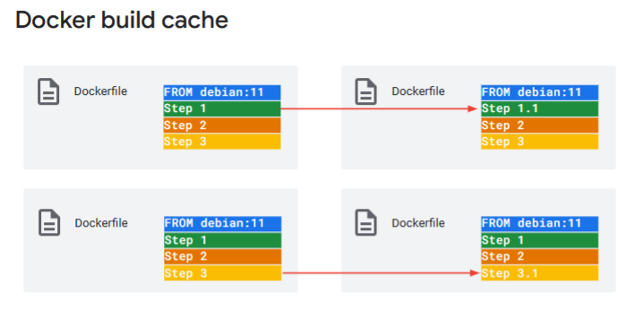

# 课程介绍
* 定义容器和容器映像。
* 生成应用程序并将其打包到容器映像中。
* 确定用于创建、测试和保护容器的最佳做法。
* 了解 Cloud Run 和 Google Kubernetes Engine 的基础知识。

## 容器和镜像
### 什么是容器？
容器是以下组件的包：应用程序代码，依赖关系，编程语言运行时，软件库。

### 容器镜像
容器映像表示一个模板，该模板定义如何在运行时实现容器实例。容器映像将应用程序与应用程序运行所需的所有内容打包在一起。

### 以下是一些需要记住的事项
* 容器映像是包含文件的存档：它包括可执行文件、系统库、数据文件等。
* 容器映像是自包含的。应用程序需要运行的所有内容都在容器映像中。例如，如果应用程序是 Node.js 应用程序，则源文件与 Node.js 运行时一起位于映像中。
* 容器是容器映像的运行时实例，表示容器的运行进程。

### 运行容器
将应用程序打包到容器映像后，可以在任何位置运行它。在 Google Cloud 上，您可以在虚拟机的 Compute Engine 上运行容器，也可以在 Kubernetes 集群上运行容器，也可以在 Cloud Run 上运行容器。在本地计算机上，可以使用 Docker 或 Podman 容器运行时。

Docker 是一个开放平台，用于开发和运行基于容器的应用程序。

Podman 是一种开源 Linux 工具，用于使用基于开放容器计划 （OCI） 的容器构建和运行应用程序。

### 容器配置
  
1. 容器映像包含应用程序以及应用程序运行所需的所有内容。
2. 最小容器映像只有一个程序文件和一个运行它的命令。
3. 某些编程语言需要运行时（Java，Python，Node.js）。
4. 应用程序可能需要其他系统依赖项才能工作。

## 使用 Docker 构建容器映像
  

  
Docker 是一个开放平台，可用于在容器中打包和运行应用程序。它提供了用于管理容器生命周期（从开发和打包到部署）的工具。

Docker 允许您使用称为 Dockerfile 的脚本来表达应用程序构建过程。Dockerfile 提供了一种低级方法，以复杂性为代价提供了灵活性。

Dockerfile 是一个清单，详细说明了如何将源代码转换为容器镜像。

Buildpack 是构建容器映像的另一种方法。它们与 Docker 不同，它们提供了一种使用启发式方法生成和打包源代码来生成容器映像的便捷方法。

### 以下是关于 Dockerfile 指令的重要事项：
首先将容器映像放在舞台上，每个 Dockerfile 指令都会更改该暂存的容器映像。  
* FROM 指令下载要从中开始的基础映像。例如，基础映像可以是“golang”，并包含构建和运行软件所需的工具。
* COPY 指令从生成上下文（通常是包含 Dockerfile 的目录）中提取文件。
* RUN 指令允许您从容器映像运行程序，以更改映像中的文件。
* 其他指令会更改容器配置，该配置会指出要启动的程序文件以及如何启动。

## 使用 Buildpack 创建容器映像
  
Buildpack 是一种无需编写 Dockerfile 即可将源代码转换为容器映像的方法。  
Buildpacks 为开发人员提供了一种使用容器映像的便捷方式，而无需考虑构建它们所带来的复杂性。  
您可以创建自己的 Buildpack，也可以使用多个供应商提供的 Buildpack。  
构建包内置于 Cloud Run 中，用于支持基于源代码的部署工作流。

### Builders
  
构建包在称为构建器的 OCI 映像中分发和执行。每个构建器可以有一个或多个构建包。  
生成器将源代码转换为容器映像。buildpack 执行生成和打包容器映像的实际工作。  
如果构建器开始处理源目录，它将执行构建包的两个阶段：检测阶段，检测阶段。

  
在构建器运行检测阶段后，合适的构建包会激活并执行构建，而其他构建包则不会。

  
使用命令行工具“pack”，您可以使用构建器将源代码转换为容器映像。

### Builders 的选择
Paketo Buildpacks：这是一个 Cloud Foundry Foundation 项目，致力于维护供应商中立的治理。  
Heroku Buildpacks：Heroku 是一个众所周知的平台即服务产品，可以轻松构建云原生应用程序。  
Google Cloud 的 buildpack 内置于 Cloud Run 中。

### Google Cloud 的构建包
App Engine、Cloud Functions 和 Cloud Run 在内部使用 Google Cloud 的构建包。  
Google Cloud 的构建包构建器支持用 Go、Java、Node.js、Python 和 .NET Core 编写的应用程序。  
您可以将源代码和容器映像部署到 Cloud Run。Cloud Run 使用 Google Cloud 的 buildpack 构建源代码。  

### 记得
* Buildpack 是一种无需编写 Dockerfile 即可从源代码创建容器映像的方法。
* 构建包在称为构建器的 OCI 映像中分发和执行。每个构建器可以有一个或多个构建包。
* 构建器可以支持以多种语言编写的源代码。
* 将命令行工具包与构建器结合使用，将源代码转换为容器映像。

## 持续集成和交付 （CI/CD） 的工具
### Skaffold
* 用于编排应用程序代码的持续开发、持续集成 （CI） 和持续交付 （CD） 的工具。
* 提供用于创建 CI/CD 管道的构建基块
* 使用可移植的声明性配置

### Artifact Registry
* 一种 Google Cloud 服务，用于存储和管理容器映像等软件工件。
* 与 Cloud Build 集成。

### Cloud Build
* 在 Google Cloud 上执行的服务。
* 从各种存储库或云存储空间导入源代码。
* 生成 Docker 容器或 Java 存档等工件。
* 使用构建配置可以：
  * 获取依赖项。
  * 运行单元和集成测试。
  * 执行静态分析。
  * 使用构建工具创建工件。

#### 构建过程
* 构建容器映像的过程是完全自动的，不需要你直接输入。
* 必须为您的项目启用 Cloud Build API。
* 构建过程中使用的所有资源都会在您自己的用户项目中执行，并且您可以通过 Cloud Logging 访问所有构建日志。

#### Cloud Build 的功能
* 使用任何编程语言编写代码。
* 使用构建配置文件。
* 与不同的源代码存储库集成。
* 自动生成、测试和部署代码。
* 将构建项目存储在不同的注册表和存储系统中。
* 部署到热门平台。

#### 云构建步骤
* 说明是作为一组步骤编写的。每个步骤都必须包含一个名称字段，该字段指定云构建器，云构建器是运行常用工具的容器映像。
* 步骤的 args 字段采用参数列表并将其传递给构建器。args 列表中的值用于访问构建器的入口点。如果生成器没有入口点，则 args 列表中的第一个元素将用作入口点。

#### 使用 Cloud Build 运行构建
1. 将您的应用代码和当前目录中的其他文件上传到 Cloud Storage。
2. 在指定区域中启动生成。
3. 使用指定名称标记图像。
4. 将生成的映像推送到 Artifact Registry。

#### Cloud Build 触发器
* 使用 Cloud Build 触发器自动运行构建。
* 可以在以下位置对源代码进行更改： ○ 云源存储库 ○ GitHub ○ Bitbucket
* 需要 Dockerfile 或 Cloud Build 配置文件。

#### 创建 Cloud Build 触发器
* 触发器名称、描述和云区域
* 触发事件
* 源存储库和分支
* 构建配置
* 服务帐户电子邮件

#### 其他类型的 Cloud Build 触发器
* 手动触发器
* Pub/Sub 触发器
* Webhook 触发器

## 构建和保护容器时的一些最佳实践
### 容器映像大小
  
  
该映像包含构建软件所需的系统包。甚至包括 Debian 软件包管理器 apt-get，因此您可以安装更多的系统软件包。  
此基础映像更适合于构建，而不是运行软件。在生产环境中，出于安全原因，映像越小越好。其他系统软件包中可能存在安全漏洞。

### 使用 Distroless 提高安全性和图像大小
  
我们使用 Distroless 项目中的映像来查看此过程，该映像针对运行应用程序进行了优化，因为它仅包含应用程序及其运行时（而不是生成时）依赖项。

  
FROM 指令后跟 COPY 指令，该指令将应用程序从先前暂存的映像拉取到活动阶段。

  
使用多阶段生成创建最小容器映像。

### 记得
* 基础映像中充斥着运行应用程序不需要的包。
* Distroless 是一个提供最小运行时容器映像的项目。
* 如果重复 FROM 指令，则会创建多阶段生成。
* 若要完成生成，请将应用程序及其依赖项复制到最后阶段。

### 进程和信号处理
* 使用 Dockerfile 中的 CMD 或 ENTRYPOINT 指令启动容器应用程序进程。
  * 允许进程接收信号。
  * 启用应用程序在终止时正常关闭。
* 在应用程序代码中注册和实现信号处理程序。

### Docker 构建缓存
  
生成容器映像时，Docker 会逐步执行 Dockerfile 中的指令，按指定顺序执行这些指令。每条指令都会在生成的图像中创建一个图层。对于每条指令，Docker 都会在其缓存中查找可重用的现有映像层。

只有当之前的所有构建步骤都使用了该缓存时，Docker 才能将其构建缓存用于映像。通过将涉及频繁更改的生成步骤放置在 Dockerfile 的底部，可以利用 Docker 生成缓存实现更快的生成。

由于通常会为源代码的每个新版本生成新的 Docker 映像，因此请尽可能晚地在 Dockerfile 中将源代码添加到映像中。

在此示例中，如果 STEP 1 涉及更改，Docker 只能重用 FROM debian：11 步骤中的层。如果 STEP 3 涉及更改，Docker 还可以重用 STEP 1 和 STEP 2 的层。

### 更多最佳实践
* 应尽可能少地保留容器映像中的内容，最好只保留应用，并删除任何不必要的工具或实用工具。这样可以减少应用的攻击面，并保护应用免受攻击者的潜在伤害。
* 若要防止攻击者使用包管理器（如 apt-get）修改容器映像中 root 拥有的文件，请避免在容器内以 root 用户身份运行应用。您还必须禁用或卸载 sudo 命令。此外，请考虑以只读模式启动容器。
* 构建较小的图像以减少图像上传和下载时间。映像越小，节点下载它的速度就越快。通过在 Dockerfile 的 FROM 指令中引用较小的基础映像，可以控制生成的容器映像的整体大小。
* 只需下载一次每个基础映像，即可为组织内的开发人员提供一组通用的标准基础映像。初始下载后，只需要使每个容器映像唯一的层，从而减少构建开发人员容器映像所需的时间。

### 漏洞扫描
  
容器分析是一项服务，可为 Google Cloud 上的容器提供漏洞扫描和元数据存储服务。扫描服务对 Artifact Registry 中的映像执行漏洞扫描，然后存储生成的元数据，并使其可通过 API 使用。

启用后，此服务可以自动扫描容器映像，并在将新映像推送到 Artifact Registry 时触发。使用按需扫描 API，您还可以对存储在这些注册表中或本地存储的容器映像启用手动扫描。

### 自动修补
* 将映像存储在 Artifact Registry 中并启用漏洞扫描。
* 配置作业或使用 Pub/Sub 获取漏洞通知。
* 使用可用的修复程序触发映像的重建。
* 使用持续部署过程，将重新生成的映像部署到过渡环境。
* 测试映像，并触发将映像部署到生产环境。

### 按需扫描
* 授予默认的 Cloud Build 服务帐户 On-Demand Scanning 管理员 IAM 角色。
* 要扫描映像中的漏洞，运行 gcloud artifacts docker images scan 命令。
* 如果发现具有指定严重性级别的漏洞，请退出生成。

# Cloud Run 和 Google Kubernetes Engine 简介
本模块介绍 Cloud Run、其功能以及开发和运行容器化应用程序的用例。它还介绍了 Google Kubernetes Engine。

## 云跑简介
### 什么是 Cloud Run？
* 托管计算平台
* 在 Google 的基础设施上运行
* 支持基于源代码的部署，可为您构建容器
* 使用其他 Google Cloud 服务构建功能齐全的应用

### Cloud Run 开发者工作流程
1. 首先，使用自己喜欢的编程语言编写应用程序。此应用程序应启动侦听 Web 请求的服务器。
2. 其次，生成应用程序并将其打包到容器映像中。
3. 最后，将容器映像部署到 Cloud Run。

### Cloud Run 基于源代码的工作流
如果使用基于源代码的方法，则部署的是源代码，而不是容器映像。然后，Cloud Run 会使用 Buildpack 构建您的源代码，并将应用及其依赖项打包到容器映像中。

### Cloud Run 支持 HTTPS
Cloud Run 支持向应用发出安全的 HTTPS 请求。在 Cloud Run 上，您的应用既可以作为服务持续运行，也可以作为作业持续运行。Cloud Run 服务会响应 Web 请求或事件，而作业会执行工作，并在工作完成后退出。

> 预配有效的 TLS 证书和其他配置以支持 HTTPS 请求。
> 处理传入的请求，解密这些请求，并将其转发到应用程序。

### Cloud Run 上的应用必须处理 Web 请求
略

### 记得
* Cloud Run 可按需运行容器并自动缩放容器
* 基于容器的应用程序处理 Web 请求
* 您可以使用基于源代码或基于容器的工作流
* Cloud Run 负责处理向应用提供 HTTPS 请求的过程
* 即用即付定价模式

## 在 Cloud Run 上部署容器化应用程序

## Cloud Run 的功能和用例
### 使用 Cloud Run 提供 REST API

### Cloud Run 上的电子商务网站
  

### Cloud Run 上的微服务

### Cloud Run 上的事件处理

### 使用 Cloud Scheduler 调度 Cloud Run 服务

### 使用 Cloud Run 设计 HA 应用
1. 增量应用程序更新，通过轻松回滚逐步切换流量。
2. 自动缩放数量，容器来处理所有传入的请求。
3. 跨可用区和区域的负载均衡。

### 使用服务修订进行增量应用程序更新

### 使用 Cloud Run 自动扩展

### 区域和可用区
  
Cloud Run 是一项区域性服务，可让您选择部署容器的区域。区域是托管 Google Cloud 资源的特定地理位置。  
一个区域由三个或更多可用区组成。区域和可用区是一个或多个数据中心中提供的底层物理资源的逻辑抽象。  
可用区是地域内云资源的部署隔离。可用区被视为区域中的单个故障域。  
为了实现高可用性，Cloud Run 会将您的容器分布在一个区域中的多个可用区中，从而使您的应用能够灵活应对某个可用区的故障。

### 全局负载均衡
  
Cloud Run 与 Google Cloud 外部 HTTP（S） 全局负载均衡器 （GLB） 集成，可让您在多个区域性 Cloud Run 服务之前公开单个全局 IP 地址。  
全局负载均衡器将请求从客户端路由到离客户端最近的区域。除了提高应用程序可用性外，GLB 还减少了全球客户端的延迟。

### 应用程序可移植性
* 容器映像包含应用程序以及应用程序运行所需的所有内容。
* 容器本质上是可移植的，可以在任何基于容器的环境中运行。
* Cloud Run 平台与 Knative 兼容，后者实现了与 Cloud Run 相同的容器运行时合约。

### 使用 Cloud Run 时的注意事项
* 自动缩放成本
* 与下游系统的扩展不匹配
* 工作负载迁移

### 记得
* Cloud Run 会按需运行和自动扩展您的应用。
* 将 Cloud Run 用于处理 Web 请求的应用，包括微服务、事件处理工作流以及计划任务或作业。
* 自动扩展、增量应用程序更新和内置负载均衡可帮助您构建高度可用的应用程序。
* Cloud Run 旨在提高开发人员的工作效率。

## Google Kubernetes Engine 简介
### 谷歌 Kubernetes 引擎 （GKE）
Google Kubernetes Engine （GKE） 是一项完全托管的 Kubernetes 服务。Kubernetes 是一个开源容器编排系统，用于自动化软件部署、扩展和管理。该项目最初由谷歌设计，现在由云原生计算基金会（CNCF）维护。  
Google Kubernetes Engine 提供了一个托管环境，用于在 Google 基础架构上部署、管理和扩展容器化应用。  
GKE 环境由多台计算机或节点（具体而言是 Compute Engine 实例）组成，这些计算机或节点组合在一起形成一个集群。

### Google Kubernetes Engine （GKE） 的优势
管理像 Kubernetes 这样的容器编排系统需要做很多工作，从安装和配置到升级、扩展和满足服务级别协议 （SLA）。  
借助 Google Kubernetes Engine，您可以享受高级集群管理功能的优势，其中包括：
* 轻松创建和管理集群。
* 负载均衡。
* 自动缩放。
* 自动升级群集节点软件。
* 自动修复以保持节点运行状况和可用性。
* 使用 Google Cloud 的运营套件进行日志记录和监控，以实现集群可见性。

### GKE 集群架构 - 控制平面

GKE 集群由一个或多个控制平面和称为节点的工作机器组成。控制平面和节点构成了 Kubernetes 集群编排系统。GKE 负责管理集群的整个底层基础架构，包括控制平面、节点和所有系统组件。

控制平面管理在集群的所有节点上运行的所有内容。控制平面计划容器工作负载并管理工作负载的生命周期、扩展和升级。控制平面还管理这些工作负载的网络和存储资源。控制平面和节点使用 Kubernetes API 相互通信。

控制平面是集群的统一端点，运行 Kubernetes API 服务器进程 （kube-apiserver） 来处理 API 请求。要与控制平面交互，您可以使用以下命令进行 Kubernetes API 调用：
* HTTP/gRPC 请求。
* 命令行客户端，例如 kubectl 或 Google Cloud 控制台。

API 服务器进程是集群所有通信的中心。所有内部集群组件（如节点、系统进程和应用程序控制器）都充当 API 服务器的客户端。

### GKE 集群架构 - 节点

 节点是运行容器化应用和其他工作负载的 Compute Engine 虚拟机 （VM）。

 节点运行必要的服务，以支持构成集群工作负载的容器。其中包括运行时和 Kubernetes 节点代理 （kubelet），它与控制平面通信，并负责启动和运行在节点上调度的容器。

 Pod 是可以在 Kubernetes 中创建和管理的最小可部署计算单元。Pod 是一组由一个或多个容器组成的容器，具有共享的存储和网络资源，以及有关如何运行容器的规范。

 Pod 通常不是直接创建的，而是使用 Kubernetes 工作负载资源（如部署或作业）创建的。

 Pod 是短暂的一次性实体。创建 Pod 时，它被安排在集群中的节点上运行。Pod 将保留在该节点上，直到它完成执行、Pod 对象被删除、Pod 因资源不足而被逐出或节点失败。

### Kubernetes 部署

使用 Kubernetes，您可以发出 API 请求，为集群中的对象指定所需的状态。Kubernetes 尝试持续保持该状态。

Kubernetes 允许您以命令式或声明式方式在 API 中配置对象。

部署是在 Kubernetes 中创建和管理 Pod 的声明性方式。它定义了一个 ReplicaSet，用于指定所需的 Pod 副本数。ReplicaSet 的目的是维护一组稳定的副本 Pod 在任何给定时间运行。

Kubernetes 中的部署控制器以受控的速率将部署的实际状态更改为所需状态。

部署是使用 YAML 文件定义的，该文件指定所需的 Pod 数量，并使用选择器标签来标识要包含在部署中的 Pod。它还包括一个规范，用于标识将在 Pod 中运行的容器。

### Kubernetes 服务

在 Kubernetes 中，服务是一种网络抽象，它定义了一组逻辑 Pod 以及用于访问它们的策略。

服务所针对的 Pod 集通常由选择器确定。

服务具有固定的 IP 地址，该地址在服务的生命周期内持续存在，即使其成员 Pod 的 IP 地址发生变化也是如此。

由于 Pod 是临时的，因此其 IP 地址会随着删除和重新创建而更改。因此，直接使用 Pod IP 地址是没有意义的。

客户端改为调用服务 IP 地址，并且其请求在作为服务成员的 Pod 之间进行负载均衡。

该示例显示了在 Kubernetes 集群上运行的应用程序的前端服务和后端服务。前端服务的成员 Pod 使用其固定 IP 地址与后端服务中的 Pod 进行通信。

### Kubernetes 服务清单

### Kubernetes 卷

Kubernetes 卷是 Pod 中所有容器都可以访问的目录。要使用卷，Pod 需要指定要为 Pod 提供哪些卷，以及将这些卷挂载到容器中的位置。挂载卷后，Pod 中的容器将联机，其余的 Pod 初始化完成。

Kubernetes 中有许多不同类型的卷。ConfigMap 和 Secret 是与 Pod 的生命周期耦合的卷类型，当 Pod 不复存在时，它们将不复存在。或者，PersistentVolume 有自己的生命周期，独立于 Pod。

### 用 GKE 开发应用程序

### 开发和部署工作流

### 记得
* Google Kubernetes Engine 提供了一个托管环境，用于部署、管理和扩展容器化应用。
* GKE 集群由一个或多个控制平面和称为节点的工作机器组成。
* 控制平面调度容器工作负载，并管理节点上工作负载的生命周期。
* Pod 是一组一个或多个容器，是 Kubernetes 中最小的可部署计算单元。
* 在 Kubernetes 中，您可以命令式或声明式地在 API 中配置各种对象。

## 容器优化的操作系统
### 容器优化操作系统
除了 Cloud Run 和 Google Kubernetes Engine 之外，Google Cloud 还提供容器优化操作系统，这是一种可用于运行容器化应用的操作系统。

容器优化型操作系统是针对 Compute Engine 虚拟机的映像，针对运行 Docker 容器进行了优化。

容器优化操作系统由 Google 维护，基于开源 Chromium OS 项目。借助容器优化操作系统，您可以在 Google Cloud 上快速启动 Docker 容器，并高效、安全地运行它们。

### 容器优化操作系统 - 优点和局限性

### 何时使用容器优化操作系统

# 课程回顾
略