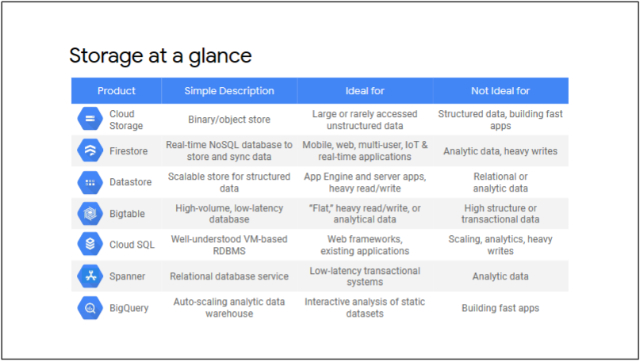

# 欢迎 - 使用 Google Cloud 开发应用程序
本模块介绍课程系列和课程结构。

## 欢迎来到课程系列
此路径专为负责设计、开发、部署和维护云中应用程序的 IT 专业人员（例如云开发人员和云 DevOps 工程师）而设计。

您将首先学习一些应用程序开发的最佳实践。然后，您将了解如何实施使用 Google Cloud 服务进行数据存储、应用程序组件之间的集成、安全性和可靠性的应用程序。如果您不确定是否在 Compute Engine、Google Kubernetes Engine、Cloud Run 中运行应用程序，或其他环境，我们有正确的信息来帮助您做出选择。

## 系列课程涵盖的主题
使用 Google Cloud 开发应用程序分为三门课程。  
1. 应用程序开发入门。
2. 保护和集成应用程序组件
3. 应用程序部署、调试和性能。

## 欢迎来到课程
略

## 课程信息
略

# 应用程序开发的最佳实践
本模块介绍应用程序开发的最佳实践。

## 松耦合微服务和 API 网关
### 云中运行的应用程序
* 全球影响力：您的应用程序应该能够响应并可供世界各地的用户访问。
* 可扩展性和高可用性：您的应用程序应该能够可靠地处理高流量。应用程序架构应利用底层云平台的功能来弹性扩展以响应负载的变化。
* 安全性：您的应用程序和底层基础设施应该实施安全最佳实践。根据使用案例，出于安全和合规性原因，您可能需要隔离特定区域中的用户数据。

### 管理应用程序的代码和环境
  
* 将应用程序的代码存储在版本控制系统（例如 Git 或 Subversion）的代码存储库中。这将使您能够跟踪源代码的更改并设置持续集成和交付的系统。
* 不要在代码存储库中存储外部依赖项，例如 JAR 文件或外部包。相反，根据您的应用程序平台，显式声明您的依赖项及其版本，并使用依赖项管理器安装它们。例如，对于 Node.js 应用程序，您可以在 package.json 文件中声明应用程序依赖项，然后使用 npm install 命令安装它们。
* 将应用程序的配置设置与代码分开。不要将配置设置存储为源代码中的常量。相反，请将配置设置指定为环境变量。这使您能够轻松修改开发、测试和生产环境之间的设置。

### 考虑实施微服务
不要实现单一应用程序，而是考虑将应用程序实现或重构为一组微服务。服务边界匹配业务边界，代码库是模块化的，每个服务都可以独立更新、部署和扩展

### 执行异步操作
远程操作的响应时间可能无法预测，并且可能使您的应用程序看起来很慢。尽量减少用户线程中的操作。异步执行后端操作。

尽可能使用事件驱动的处理。例如，如果您的应用程序处理用户上传的图片，您可以使用 Cloud Storage 存储分区来存储上传的图片。然后，您可以实现一个云函数，每当上传新图像时就会触发该函数。云功能处理图像并将结果上传到不同的云存储位置。

### 松耦合设计
设计应用程序组件，以便它们在运行时松散耦合。紧密耦合的组件可能会降低应用程序对故障、流量峰值和服务更改的弹性。

中间组件（如消息队列）可用于实现松耦合、执行异步处理以及在流量激增时缓冲请求。您可以将 Pub/Sub 主题用作消息队列。发布者可以向主题发布消息，订阅者可以订阅来自该主题的消息。

在 HTTP API 有效负载的上下文中，HTTP API 的使用者应与 API 的发布者松散绑定。

### 实现无状态组件以实现可伸缩性
实现应用程序组件，以便它们不会在内部存储状态或访问共享状态。访问共享状态是可伸缩性的常见瓶颈。设计每个应用程序组件，使其仅专注于计算任务。此方法使您能够使用 Worker 模式来添加或删除组件的其他实例，以实现可伸缩性。应用程序组件应快速启动以实现高效扩展，并在收到终止信号时正常关闭。

### 缓存内容
缓存内容可以提高应用程序性能并降低网络延迟。

### 实施 API 网关，使后端功能可供使用者应用程序使用
  
* 您可以使用 Cloud Endpoints 根据 OpenAPI 规范开发、部署、保护和监控 API。
* 使用 Apigee API 平台，您可以为传统后端设计、保护、分析和扩展 API。

## 安全性、可靠性和迁移
### 使用联合身份管理
将用户身份验证委托给外部身份提供商，例如 Google、Facebook、Twitter 或 GitHub。这将最大程度地减少用户管理的工作量。使用联合身份管理，您无需实施、保护和扩展专有解决方案来对用户进行身份验证。

### 实施运行状况检查终结点
请务必监视应用程序和服务的状态，以确保它们始终可用并以最佳方式执行。监控数据可用于在系统开始出现故障时立即自动向运营团队发出警报。然后，运营团队可以及时诊断和解决问题。

### 设置日志记录并监视应用程序的性能
将日志视为事件流。日志构成一个连续的事件流，只要应用程序正在运行，这些事件就会不断发生。不要管理应用程序中的日志文件。相反，写入事件流（如 stdout），并让底层基础结构整理所有事件，以便以后进行分析和存储。使用此方法，您可以设置基于日志的指标，并跨应用程序中的不同服务跟踪请求。

借助 Google Cloud 的运维套件，您可以调试应用、设置错误报告、设置基于日志记录和日志的指标、跨服务跟踪请求，以及监控在多云环境中运行的应用。

### 优雅地处理暂时性和长期性错误
在访问分布式系统中的服务和资源时，应用程序需要能够灵活应对临时和长期的错误。  
由于暂时性网络错误，资源有时会变得不可用。在这种情况下，应用程序应实现具有指数退避的重试逻辑，如果错误仍然存在，则正常失败。云客户端库会自动重试失败的请求。  
当错误持续时间更长时，应用程序不应浪费 CPU 周期尝试重试请求。在这种情况下，应用程序应实现断路器并正常处理故障。  
对于传播回用户的错误，请考虑正常降级应用程序，而不是显式显示错误消息。例如，如果推荐引擎已关闭，请考虑隐藏页面上的产品推荐区域，而不是在每次显示页面时都显示错误消息。

### 考虑数据主权和合规性要求
一些地区和行业部门对数据保护和消费者隐私有严格的合规要求。

### 执行高可用性测试并制定灾难恢复计划
除了执行功能和性能测试外，还要执行高可用性测试。此类测试将使您能够制定可靠的灾难恢复计划，并定期执行灾难恢复练习。

### 实施持续集成和持续交付管道
通过自动化实施强大的 DevOps 模型，以实现持续集成和交付 （CI/CD）。自动化可帮助您提高发布速度和可靠性。借助强大的 CI/CD 管道，您可以以增量方式测试和推出更改，而不是通过多个更改进行大规模发布。此方法使你能够降低回归风险，快速调试问题，并在必要时回滚到上一个稳定版本。

在持续集成系统中，开发人员将代码提交到代码存储库（如 Git）中。构建系统（如 Jenkins）会自动检测对存储库的提交、触发构建并运行单元测试。生成系统为所有必需的运行时环境生成部署工件。

在持续交付系统中，部署系统（如 Spinnaker）会自动触发将构建部署到测试环境。您可以自动执行集成、安全和性能测试，然后将成功的构建部署到生产环境。将内部版本部署到生产环境时，请考虑执行金丝雀测试或蓝/绿部署，以确保任何意外问题都不会影响大量用户。

### 使用扼杀者模式重新构建应用程序
在重新构建和迁移大型应用程序时，请考虑使用 Strangler 模式。在迁移的早期阶段，您可能会将旧应用程序的较小组件替换为较新的应用程序组件或服务。您可以逐步将原始应用程序的更多功能替换为新服务。

## 练习测验：应用程序开发的最佳实践
略

## 最终测验：应用程序开发的最佳实践
略

# Google 云开发入门
本模块介绍了用于托管应用程序的不同 Google Cloud 平台。

## Google Cloud 开发入门
在本模块中，您将学习如何为您的应用和脚本访问这些服务。您将了解 Cloud API 和 Google Cloud SDK，它们允许您以编程方式将这些功能包含在您的应用中。 云客户端库通过使用每种受支持语言的自然约定和样式来提供优化的开发人员体验。您还将了解 Cloud Code，这将帮助您在集成开发环境中开发 Google Cloud 应用。

### Cloud API 为 Google Cloud 服务提供编程接口
Cloud API 为 Google Cloud 服务提供编程接口。您可以通过调用相应的 Cloud API 在应用中使用 Google Cloud 资源或服务。

### 将 Google Cloud SDK 与 Google Cloud 结合使用
Google Cloud SDK 用于与 Google Cloud 产品和服务进行交互。  
* SDK 功能分为两类：命令行工具和特定于语言的云客户端库。
* 这些工具和库使用 Cloud API 与 Google Cloud 进行通信。

### 使用 Google Cloud CLI （gcloud CLI）
* 提供用于管理大多数 Google Cloud 服务的工具。
* 在命令行或自动脚本中使用。
* 工具包装了 Cloud API

#### 借助 gcloud CLI 工具，您可以在 Google Cloud 上执行最常见的任务
#### 使用命令行工具 gcloud storage 管理 Cloud Storage
#### bq 是 BigQuery 的命令行工具

### 云客户端库
* 比直接 API 调用更易于使用。
* 是从应用发出 Cloud API 请求的推荐方法。
* 提供优化的开发人员体验。
* 使用每种语言的自然惯例和风格。
* 从 gRPC API 获得性能优势。

### Cloud Shell
Cloud Shell 是一台免费的管理计算机，可通过 Google Cloud Console 进行基于浏览器的命令行访问。  
* 基于浏览器访问临时虚拟机
  * 5 GB的永久性磁盘存储
  * 预装了 Google Cloud SDK
* 对 Google Cloud Console 项目和资源的内置授权
* 内置代码编辑器

### 使用 Cloud Code 在您喜欢的 IDE 中开发云应用程序
* 借助 IDE 插件，可以更轻松地创建、部署和调试云原生应用程序。
* 适用于 VSCode、JetBrains IDE（包括 IntelliJ）和 Cloud Shell 编辑器。
* IDE 简化了常见的工作流程。
* 与 Secret Manager 集成以安全地存储敏感数据。
* 管理云 API 和云客户端库。

### 借助 Cloud Code for Kubernetes，您可以在 IDE 中开发 Kubernetes 应用
* 在本地集群或 Google Kubernetes Engine （GKE） 上运行和调试 Kubernetes 应用程序。
* 使用 Kubernetes Explorer 可视化和管理 Kubernetes 资源。
* YAML 创作帮助为 Kubernetes 配置文件提供自动完成和内联文档。

### Cloud Code 也适用于 Cloud Run
* 使用 Cloud Run Emulator 在本地运行服务并进行调试。
* 从 IDE 将应用部署到 Cloud Run。
* 使用 Cloud Run Explorer 管理 Cloud Run 服务。

### 将模拟器用于 Google Cloud 服务
* 使用 gcloud beta emulators 安装和管理模拟器。
* 从使用本地模拟器切换到使用 Google Cloud emulators 服务，而无需更改应用代码。
* 在不消耗项目资源的情况下开发应用程序。

## 练习测验：Google Cloud 开发入门
略

## Lab 搭建开发环境
略

## 应用程序开发 - 设置开发环境：Java
略

## 最终测验：Google Cloud 开发入门
略

## 模块复习
* Google Cloud API 为 Google Cloud 服务提供编程接口。
* 在脚本或命令行中使用时，Google Cloud SDK 提供了更简单的界面。
* 当您准备好编写应用程序时，请使用您选择的编程语言的 Cloud 客户端库来与 Google Cloud 服务交互。
* Cloud Shell 提供免费的虚拟机，可用于管理您的 Google Cloud 项目和资源。
* 使用 Cloud Code 在您最喜欢的 IDE 中开发应用程序。

# 数据存储选项概述
本模块介绍了 Google Cloud 中应用程序可用的各种数据存储选项。

## Cloud Storage, Datastore, Cloud Bigtable, Cloud SQL, and Cloud Spanner
### Cloud Storage
Cloud Storage 是面向开发人员和企业的统一对象存储，可让您提供、分析和归档数据。对象通过 HTTP 请求访问，包括用于检索部分数据的范围 GET。唯一的键是对象名称。有对象元数据，但对象本身被视为没有结构的字节。该系统的规模允许提供静态内容或接受用户上传的内容，如照片和视频。

Cloud Storage 专为可用性、持久性、可扩展性和一致性而构建。它是存储图像和视频、对象和 blob 以及任何非结构化数据的理想解决方案。

### Firestore
Firestore 是一个快速、完全托管的无服务器 NoSQL 文档数据库，专为自动扩展、高性能和易于应用程序开发而构建。

### Datastore
数据存储模式下的 Firestore（通常称为数据存储）是适用于应用程序的高度可扩展的 NoSQL 数据库。数据存储会自动处理分片和复制，为您提供一个高度可用且持久的数据库，该数据库可自动扩展以处理应用程序的负载。数据存储提供了无数的功能，例如 ACID 事务、类似 SQL 的查询、索引等等。数据存储可随数据无缝自动扩展，使应用程序在接收更多流量时保持高性能。

### Cloud Bigtable
Bigtable 是一种高性能的 NoSQL 数据库服务。这是一个稀疏填充的表，可以扩展到数十亿行和数千列。Bigtable 可以存储 TB 到 PB 的数据。Bigtable 专为在定义的键范围内快速键值查找和扫描而构建。它类似于电子表格，通过仅搜索第一列（键）中的值，您可以访问连续行中的任何一组列。对单个行的更新是原子的。由于 Bigtable 的快速查找和写入速度，它非常适合用户行为。

### Cloud SQL
Cloud SQL 是 Google Cloud 的关系数据库服务。这是一项托管服务，可让 Google 管理数据库的复制、故障转移和备份，以便您可以专注于 MySQL、PostgreSQL 或 SQL Server 兼容应用。借助 Cloud SQL，您可以轻松配置复制和备份，以保护您的数据。您可以将主实例复制到一个或多个只读副本。只读副本是主实例的副本，它几乎实时地反映对主实例的更改。您可以启用自动故障转移，使数据库具有高可用性。借助备份，您可以还原 Cloud SQL 实例，以恢复丢失的数据或从实例问题中恢复。您可以为包含需要防止丢失或损坏的数据的任何实例启用自动备份。

Cloud SQL Proxy 的工作原理是在本地环境中运行一个称为代理的本地客户端。应用程序使用数据库使用的标准数据库协议与代理进行通信。代理使用安全隧道与服务器上运行的配套进程进行通信。借助 Cloud SQL Proxy，您可以安全地访问 Cloud SQL 第二代实例，而无需允许 IP 地址或配置 SSL。代理使用 Cloud SQL API 向 Google Cloud 进行身份验证。您必须在使用代理之前启用 API，并且必须为代理提供有效的用户帐户。

### Cloud Spanner
Cloud Spanner 是 Google Cloud 的完全托管式关系数据库服务，提供强大的一致性和水平可扩展性。它专为任务关键型 OLTP 应用程序而设计。Cloud Spanner 提供自动同步复制以实现高可用性。Spanner 专为多区域复制而构建，提供业界最高的 SLA 之一：99.999%。

Spanner 非常适合具有关系、结构化和半结构化数据的应用程序，这些应用程序需要高可用性、强一致性和事务性读写。

与 Cloud SQL 不同，Spanner 要求每个表都有一个主键。另一个区别是 Spanner 还支持交错表，其中子行插入到与父行相邻的表中。这样可以提高在父级和子级之间完成联接时的查询性能。

## BigQuery, Microsoft SQL Server images on Google Cloud, and Firebase Storage Options
### BigQuery
BigQuery 是一种用于分析的低成本企业数据仓库。这是一项完全托管的服务，这意味着您无需担心数据仓库的管理。BigQuery 可以在几秒钟内扫描 TB 级数据，在几分钟内扫描 PB 级数据。

### 在 Google Cloud 上运行 Microsoft SQL Server
您可以在 Google Cloud 上运行 Microsoft SQL Server 部署。计算引擎虚拟机预装了 SQL Server，并自动包含来自 Microsoft 的许可。

支持的版本包括 SQL Server Standard、SQL Server Web 和 SQL Server Enterprise。

Google Cloud 上的 Microsoft SQL Server 不是像 Cloud SQL 或 Spanner 那样的托管服务。

### 适用于移动设备的存储选项
Firebase 是一个移动和 Web 应用开发平台，其中包含一些存储选项，可用于使用 Google Cloud 进行 Web 和移动开发。

Cloud Storage for Firebase 将用户生成的数据和文件存储到 Google Cloud Storage 中。适用于 Cloud Storage 的 Firebase SDK 为开发者提供了简单直观的身份验证。理想的用例包括从您的移动或 Web 应用程序保存用户生成的图像、图片、视频、对象和博客。

Firebase Realtime Database 允许您使用 Firebase 的 NoSQL 云数据库存储和同步数据。数据在所有客户端之间实时同步，以便在应用离线时保持可用。对于需要离线响应能力的移动和 Web 应用程序来说，它是一种理想的存储解决方案。Firebase 实时数据库是 Firebase 的原始数据库。对于大多数开始新项目的开发人员来说，现在建议使用 Firestore，而不是 Firebase Realtime Database。

Firebase 托管是一种快速、安全地为您的网络应用托管静态资源的方式。它是 URL 重写、原子发布管理和 Web 或移动应用程序的 Firebase 集成的理想选择。

### 缓存应用程序数据
您在 Google Cloud 上运行的应用可以通过利用 Redis 或 Memcached 来实现高水平的性能，而无需管理复杂的部署。Memorystore 支持这两个高度可扩展、可用且安全的开源缓存引擎，并且与每个引擎完全协议兼容。

Memorystore 是可扩展的 Web 应用程序、游戏和流处理的理想选择，在这些应用程序中，分布式内存数据存储允许快速、实时地处理数据。

作为一项完全托管的服务，预配、复制、故障转移和修补都是自动化的。您还可以使用 Cloud Monitoring 监控实例并设置警报。

通过使用 VPC 网络和私有 IP 地址，可以保护 Memorystore 免受 Internet 的侵害。Memorystore 还集成了 Cloud Identity and Access Management。

### 存储一目了然

## 演示：安全连接到 Cloud SQL 数据库
1. 创建 Cloud SQL 实例
2. 使用 gcloud sql 从 Cloud Shell 连接到 Cloud SQL
3. 创建 Compute Engine 实例
4. 使用 Cloud SQL 代理连接到 Cloud SQL

## 最终测验：数据存储选项
略

## 模块复习
* 将文件存储在 Cloud Storage 中。
* Cloud Datastore（一个 NoSQL 数据库）很容易上手，用它来存储结构化应用程序数据。
* Bigtable 是一个高性能宽列、NoSQL 数据库。Bigtable 非常适合处理大量平面数据，例如传感器读数以及来自物联网或 IoT 设备的数据。
* Cloud SQL 是 MySQL 和 PostgreSQL 的托管服务。您可以使用 Cloud SQL 代理轻松、安全地连接您的 Cloud SQL 实例。
* 如果您应用程序的关系数据将超出 Cloud SQL 中可以最佳处理的容量，或者您需要覆盖全球，请使用 Spanner。Spanner 是一种完全托管的关系数据库服务，提供强一致性和水平可扩展性。Spanner支持低延迟的全局自动同步复制。
* BigQuery 是一个完全托管的数据仓库解决方案。使用 BigQuery 进行分析工作负载。

# 使用数据存储的最佳实践
本模块涵盖使用数据存储的最佳实践。
## 数据存储概念和索引
假设您要存储应用程序数据。数据是结构化的或半结构化的，但不是关系型的。  
您希望快速启动并运行。但是，您希望确保所选的数据库选项具有高度可伸缩性，并满足应用程序的需求。  
数据存储是此用例的理想解决方案。数据存储可以从每秒零扩展到数百万个请求，而无需更改配置或向集群添加节点。  
在本模块“使用 Datastore 的最佳实践”中，您将了解有关数据对象的关键概念，例如种类、实体、键和属性。您将学习并应用与查询、内置索引和复合索引、插入和删除数据、事务和错误处理相关的最佳实践。

### 数据存储 = 数据存储模式下的 Firestore
* 与原始 Datastore 完全向后兼容，但使用 Firestore 改进的存储层。
* “数据存储”页面用于管理数据库。
* 一个项目只能具有 Firestore 本机模式数据库或数据存储模式数据库，但不能同时具有两者。
* 如何决定：
  * 在创建新的服务器应用程序时选择数据存储模式。
    * 自动扩展到每秒数百万次写入。
  * 为新的移动和 Web 应用程序或需要实时和离线功能时选择本机模式。
    * 自动扩展到数百万个并发客户端。

> 数据存储模式通常应用于服务器应用程序。本机模式应用于新的移动和 Web 应用，或者需要实时和离线功能时。

### 数据存储概念

数据存储中的数据对象称为实体，它们由一个或多个属性组成。属性可以有一个或多个值。  
每个实体都有一个唯一标识它的键，该键由命名空间、实体的种类、标识符和可选的祖先路径组成。  
对一个或多个实体的操作称为事务，并且是原子的。

### 您可以指定实体的祖先
创建实体时，可以指定另一个实体作为其父实体。没有父级的实体是根实体。  
实体的父级、父级的父级等是实体的祖先。实体的子项、子项的子项等。是实体的后代。  
从根实体到特定实体的实体序列构成了祖先路径。

### 数据存储有两种类型的索引
内置索引: 
* 自动预定义: 每个属性的索引, 每个实体类型
* 适用于简单型查询

复合索引:
* 为索引实体的多个属性值编制索引
* 支持复杂查询
* 被定义在索引配置文件中

## 创建和删除复合索引
* 在名为 index.yaml 的配置文件中定义
* 要创建复合索引，请执行以下操作：
  * 在 index.yaml 中添加索引定义
  * 运行 gcloud datastore indexes create
* 要删除复合索引，请执行以下操作：
  * 从 index.yaml 删除不再需要的索引
  * 运行 gcloud datastore indexes cleanup

## 数据存储与关系数据库的比较
数据存储：
* 旨在自动扩展到非常大的数据集。
* 不支持联接操作、对多个属性进行不等式筛选，也不支持根据子查询结果对数据进行筛选。
* 不要求相同类型的实体具有一致的属性集。

## 演示探索云数据存储
1. 创建 App Engine 应用
2. 创建数据存储实体
3. 查询数据存储
4. 使用 GQL 查询数据存储

## 设计考虑因素和分片
使用 Cloud Datastore 设计应用时，请牢记以下注意事项。始终将 UTF-8 字符用于命名空间名称、种类名称、属性名称和自定义键名称。使用这些名称的非 UTF-8 字符可能会干扰 Cloud Datastore 的功能。

请勿在种类名称或自定义键名称中使用正斜杠 （/）。这些名称中的正斜杠可能会干扰将来的功能。

### 使用分片提高写入速率
分片将实体分解成更小的部分。数据存储将自动对实体进行分片，从而分发数据。

### 分片计数器，以避免与高写入发生争用
* 通过构建分片计数器来减少争用，将计数器分解为 N 个实体中的 N 个不同的计数器。
* 要递增，请随机选择一个分片并递增其计数器。
* 若要检索计数，请读取所有分片实体并对其各个计数求和。

### 使用复制读取密钥范围的一部分
如果需要以高于数据存储允许的速率读取密钥范围的一部分，则可以使用复制。使用此策略，您将存储同一实体的 N 个副本，从而允许比单个实体支持的读取速率高 N 倍。

## 复制、查询类型、事务和处理错误

## 演示从 Cloud Storage 批量加载 Datastore 数据

## 应用程序开发 - 在云数据存储中存储应用程序数据：Java

## 练习测验：使用数据存储的最佳实践

## 最终测验：使用数据存储的最佳实践

## 模块复习

# 使用云存储的最佳实践
本模块涵盖使用云存储的最佳实践。