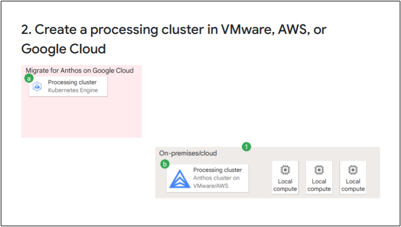
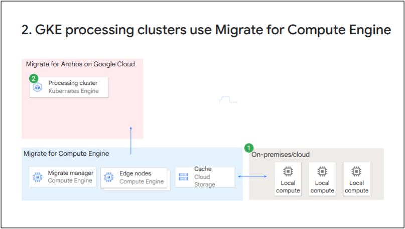
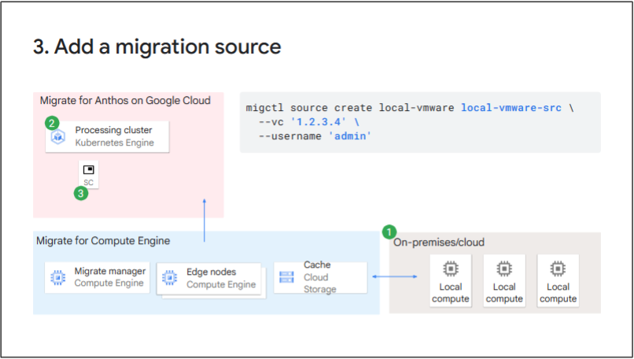
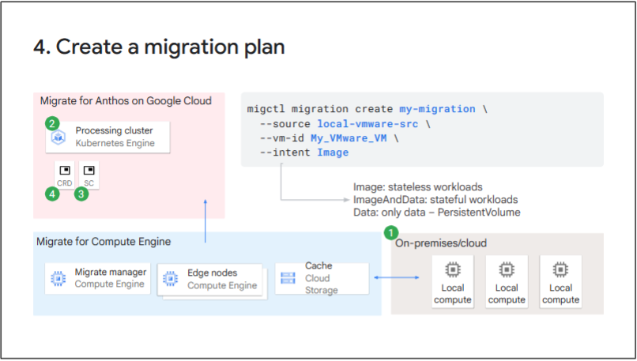
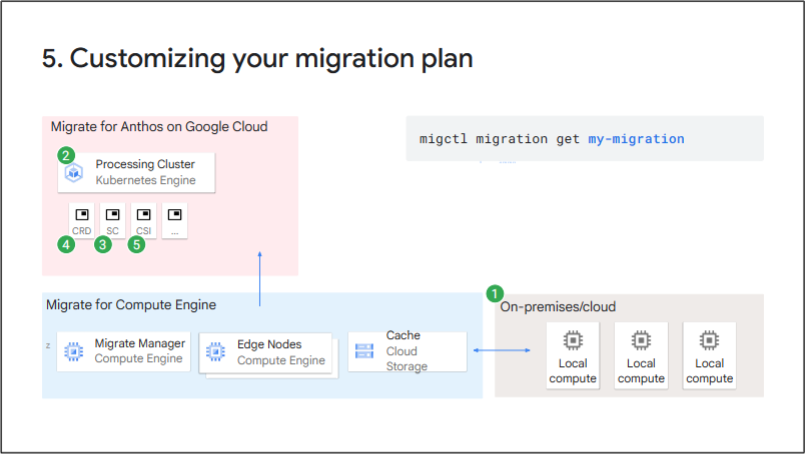
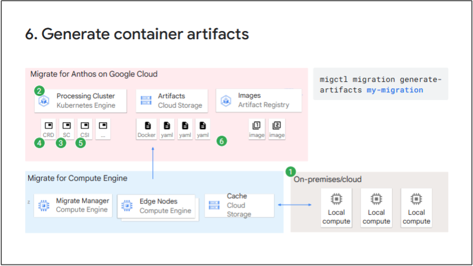
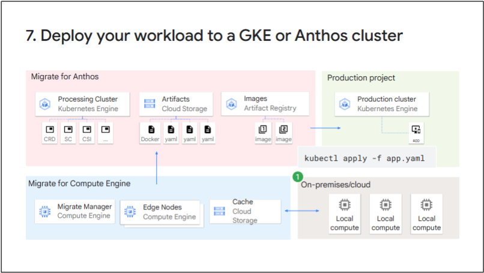
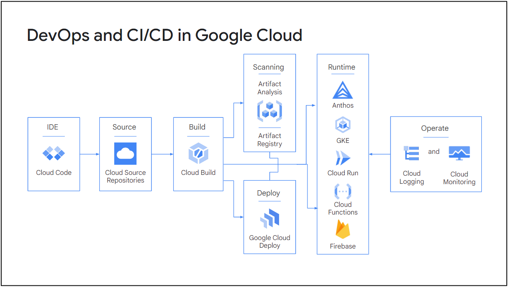
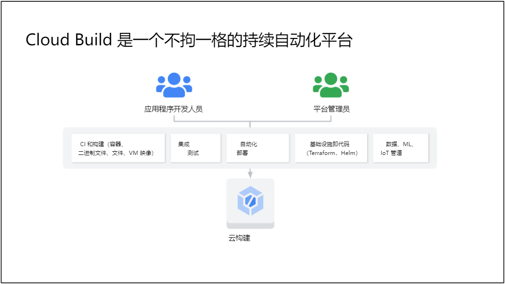
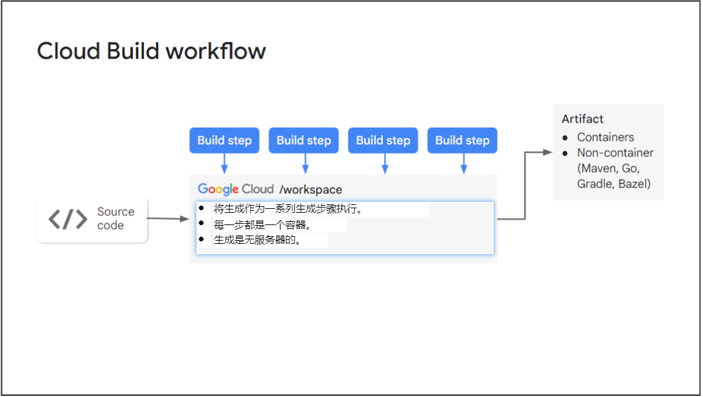

# 介绍
## 使用 Anthos 进行应用程序迁移
使用 Anthos 进行应用程序迁移 - 概述了应用程序迁移和现代化过程，包括策略、工作负载发现以及将应用程序迁移到容器。

## 适用于 Anthos 的现代 CI/CD
现代 CI/CD - 介绍了创建在 Google Cloud 和其他环境中运行的现代、无服务器、持续集成和持续交付或 CI/CD 管道的好处。本模块还介绍了如何实施 CI/CD、保护软件供应链，以及利用 Google Cloud Marketplace 中受信任的第三方软件在 Anthos 基础架构中运行。

## Anthos 上的无服务器
Anthos 上的无服务器 - 介绍了在 Google Cloud 和 Anthos 集群上使用无服务器的优势，以便您可以在任何地方加速创新。它还包括在 Google Cloud 和 Anthos 集群上部署 Cloud Run 应用，配置 Cloud Run 应用以实现基础架构自动化，以及使用 Google 的 Eventarc 服务与应用、云服务、协议和事件源进行通信。

# 使用 Anthos 进行应用程序迁移
## 学习目标
* 了解现代化的路径及其优势，以便您可以为您的用例选择合适的工具和服务。
* 了解如何以手动和自动方式评估和发现最适合容器化和迁移的工作负载。
* 使用 Migrate for Anthos 和 GKE 解决方案将无状态和有状态工作负载从虚拟机迁移到容器和 Kubernetes。
* 优化迁移的工作负载，以便您可以使用与绿地软件相同的方法维护、改进和继续开发它们。

## 现代化愿景
在规划应用程序现代化时，必须考虑三个想法：
* 基础架构现代化是指实施可按需扩展的软件定义的计算、存储和网络资源。
* 代码现代化包括使用云原生概念（如容器、微服务和 API 驱动的自动化）来重构旧工作负载。
* 流程现代化是引入 DevOps 方法，包括新软件的持续集成和持续交付 （CI/CD）。

### 实现现代基础设施的收益
* 加快开发速度，缩短上市时间。
* 提高可靠性和服务质量。
* 降低成本，同时提高安全性并降低风险。
* 考虑其他因素，例如员工满意度。

### 迁移策略和目标

### 容器化和 Kubernetes 的业务驱动因素
* 节省基础设施成本
  * 更高的密度（60-80%）：单个节点中有多个容器
  * 操作系统更新和内核补丁
* 运营效率：减少停机时间和 IT 管理
  * 自动化和编码的“期望状态”管理
  * 自动缩放、自我修复、监控、安全等。
* 开发人员工作效率：更快的上市时间、敏捷性
  * 使用 CI/CD 流水线进行现代应用生命周期管理
  * 快速部署，“一次编写，随处运行”

### Migrate for Anthos 和 GKE 可自动实现容器化
* 消除应用重写开发成本。
* 生成特定于应用程序的 CI/CD 项目，例如 Docker 映像、Dockerfile 和部署 yaml。
* 将存储重构为支持 Kubernetes 的 PVC。
* 省略与 VM 相关的文件和组件，这些文件和组件对 Kubernetes 环境中的应用程序不是必需的。
* 移植后的应用可以在任何 Anthos 或 GKE 集群上运行，而不受 Migrate for Anthos 部署的影响。
* 支持的来源：VMware、AWS、Azure、Compute Engine
* 处理环境：GKE、AWS 上的 Anthos、VMware 上的 Anthos
* 支持的工作负载操作系统类型：Linux 和 Windows 发行版
* 可用的用户界面：Google Cloud Console、Google Cloud CLI、API

## 工作负载发现和迁移评估
### Migrate for Anthos 和 GKE 支持特定的操作系统和 GKE 版本
如前所述，Migrate for Anthos 和 GKE 可自动执行工作负载的容器化和执行，并支持特定的操作系统和 GKE 版本。其中包括 CentOS、Debian、RHEL、SUSE、Ubuntu 和 Windows 操作系统。用于处理迁移的 GKE 集群必须使用 Ubuntu 容器优化操作系统，并且必须是 1.13 或更高版本。

### 适合 Migrate for Anthos 的工作负载
通常，如果支持容器化使用，并且提供了没有太多复杂性的容器化路径，则工作负载非常适合 Migrate for Anthos。某些工作负载是特别好的候选者。例如：
* Web/应用程序服务器
* 无状态 Web 前端
* 业务逻辑中间件（如 Tomcat、J2EE 和 COTS）
* 多虚拟机、多层堆栈（如 LAMP 和 WordPress）
* 中小型数据库（如MySQL、PostgreSQL等）

如果这些应用程序具有以下特征，则它们特别适合：
* 低占空比和突发工作负载
* 开发、测试和培训实验室环境
* 始终在线的低负载服务
* 可灵活应对重启和横向扩展
* 兼容许可（与操作系统、硬件、虚拟机管理程序无关）
* 兼容的第三方供应商支持合同

### 不适合 Migrate for Anthos 的工作负载
* 具有特殊内核驱动程序（例如内核模式 NFS）的 VM
* 对特定硬件的依赖关系
* 具有与某些硬件 ID 注册绑定的许可证的软件
* 不适合 Cloud SQL 的始终在线数据库虚拟机
* 特定于硬件的许可证限制（例如每个 CPU）
* 32 位操作系统
* 文件服务器
* 需要整个节点容量的基于 VM 的工作负载，例如高性能、高内存数据库（如 SAP HANA）
* 依靠 Compute Engine 实时迁移来满足高可用性要求的单实例工作负载

### 使用 StratoZone 和适合性评估工具自动发现和评估工作负载
略

### StrataZone 收集数据
略

### 适合性评估工具可验证容器化的适用性
略

### 使用适合性评估工具评估工作负载的步骤
略

### 以 CSV、JSON 和 HTML 格式提供的适合性评估报告
略

### 适合评估报告，使工作负载符合迁移条件
略

## 将应用程序迁移到容器
### 设置和规划
1. 确定迁移的来源 让我们逐步了解迁移过程步骤。第一步是确定迁移的来源;也就是说，确定是要迁移 Linux 还是 Windows VM，以及源提供程序，例如 VMware、AWS、Azure 或 Compute Engine。源提供程序是要迁移到 GKE 或 Anthos 的虚拟机所在的位置。
2. 在 VMware、AWS 或 Google Cloud 中创建处理集群 如果您的迁移源是 VMware 或 AWS，则可以使用同一位置的本地 Anthos 集群来迁移工作负载。如果您的目标是 Google Cloud，或者您是从其他来源迁移的，则必须在 Google Cloud 中设置 GKE 集群才能处理迁移。
2. GKE 处理集群使用 Migrate for Compute Engine Migrate for Compute Engine 对于 VMware、AWS 和 Azure，当目标是 Google Cloud 时，需要安装 Migrate for Compute Engine 来促进工作负载传输到 Google Cloud。
3. 添加迁移源 Migrate for Compute Engine 通过运行 migctl source create 命令或使用 Google Cloud Console 来定义要从中迁移的迁移源。此过程将添加从您指定的源迁移所需的详细信息：VMware、AWS、Azure、Compute Engine 或本地。
4. 创建迁移计划 Migrate for Compute Engine 迁移计划是执行迁移操作以及使用 migctl 和 Google Cloud Console 监控迁移活动和状态的中心对象。迁移对象作为 Kubernetes 自定义资源定义 （CRD） 实现，并与其他资源（如 Kubernetes PersistentVolumeClaim）一起包含在迁移计划中。

### 迁移和现代化
5. 自定义迁移计划 Migrate for Compute Engine 使用 migctl migration get 命令获取迁移文件，以便在继续执行之前查看和自定义它们。迁移计划的详细信息用于从源 VM 中提取工作负载的容器项目，并生成可用于将容器映像部署到其他群集（例如生产群集）的 Kubernetes 部署文件。
6. 生成容器工件 Migrate for Compute Engine 
7. 将工作负载部署到 GKE 或 Anthos 集群 Migrate for Compute Engine

### 优化
在此阶段，您可以使用 Istio 添加访问策略、加密和身份验证，并使用 Cloud Logging 和 Cloud Monitoring 进行监控和记录，所有这些都是通过更改配置而不是重新构建应用程序来实现的。您还可以使用 Cloud Build 等工具与 CI/CD 管道集成，以便实施第 2 天维护过程，例如软件包和版本更新。

此类维护操作利用生成的 Dockerfile 和捕获的系统映像层。当这些文件与 Migrate for Anthos 和 GKE 运行时层结合使用时，可以将这些文件构建到可执行容器映像中。

此外，您还可以更改源代码。进行所需的更新后，必须创建应用程序二进制文件（在本例中，它是一个新的 jar 文件，因为它是一个 Java 应用程序），并将它们添加到 Dockerfile 的末尾。

您还可以重新构建容器平台，并在 GKE Autopilot 或 Cloud Run 等无服务器产品中运行它，只需稍作更改。例如，将迁移的容器部署到 Cloud Run 时，只需将环境变量 HC_V2K_SERVICE_MANAGER设置为 true。

# 适用于 Anthos 的现代 CI/CD
## 学习目标
* 了解创建在混合环境中工作的现代、无服务器、持续集成和持续交付 （CI/CD） 管道的好处。
* 了解实施 CI/CD 管道所需的托管服务，并将其部署到 Google Cloud 和 Anthos 集群上。
* 保护您的软件供应链，确保仅构建可信、经过测试和验证的软件并将其部署到您的基础架构中。
* 利用 Google Cloud Marketplace 中值得信赖的第三方软件在您的 Anthos 基础架构中运行。

## Google Cloud 中的 CI/CD
### 应用现代化：应用程序交付 CI/CD
1. 通过现代应用程序堆栈、基础架构和流程释放公司的业务敏捷性。
2. 完全托管、可扩展的基础架构，可帮助您专注于核心业务。
3. 提供企业控制，例如正确执行 Kubernetes、提供适当的安全性等。

### CI/CD 之旅中的挑战
* 基础结构成本：CI/CD 听起来不错，但创建生产、暂存、开发等的固定副本的成本通常很高。
* 目标环境之间的差异：任何环境都不会是生产的完美副本，因此变化会导致分歧和管道复杂性增加。
* 大规模可见性：当您拥有数十个或数百个管道时，如何全面了解这些管道的运行状况或活动？
* 开发人员入职：随着环境配置变得越来越复杂，开发人员入职会受到影响。
* 职责和关注点的分离：当您需要根据角色拆分访问权限以符合合规性时，单个 CI/CD 工具会存在问题。
* 可观测性集成：将 Ops 与日志记录和监控相结合，可以增加协调和依赖关系，这反过来又会导致更长的平均恢复时间和更困难的根本原因分析。

### Google Cloud 中的 DevOps 和 CI/CD

* Cloud Code 是一个用于集成代码环境（或 IDE）的插件，例如 Visual Studio Code 和 IntelliJ，可用于编写、调试和部署 Kubernetes 应用程序。它还具有预配置的示例，因此您可以在几秒钟内开始运行代码。
* Cloud Source Repositories 是一项完全托管的 Git 服务，可用于存储代码并将触发器配置到 CI/CD 管道。
* Cloud Build 是一个完全无服务器的 CI/CD 平台。在云中以任何规模构建、测试和部署应用程序。
* Artifact Registry 存储、管理、扫描和保护容器映像和包。
* Google Cloud Deploy 是一个声明性持续交付系统。
* 最后，在您选择的平台上生产代码后，您可以使用 Cloud Logging 和 Cloud Monitoring 来观察您的应用。

### Cloud Build 是一个不拘一格的持续自动化平台

## 专用网络中的 CI/CD

## 本地和多云环境中的 CI/CD

## 保护软件供应链

## 部署第三方软件

# Anthos 上的无服务器

# 