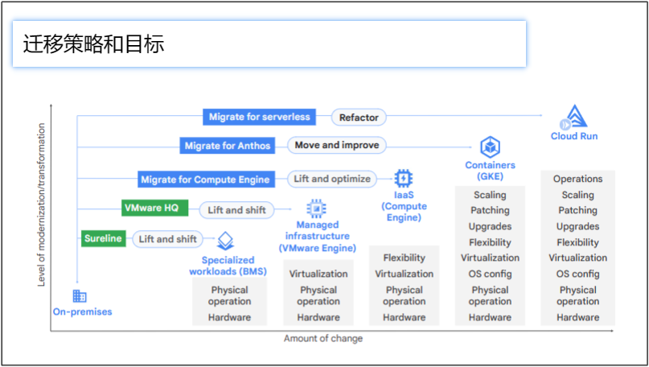

# 介绍
## 使用 Anthos 进行应用程序迁移
使用 Anthos 进行应用程序迁移 - 概述了应用程序迁移和现代化过程，包括策略、工作负载发现以及将应用程序迁移到容器。

## 适用于 Anthos 的现代 CI/CD
现代 CI/CD - 介绍了创建在 Google Cloud 和其他环境中运行的现代、无服务器、持续集成和持续交付或 CI/CD 管道的好处。本模块还介绍了如何实施 CI/CD、保护软件供应链，以及利用 Google Cloud Marketplace 中受信任的第三方软件在 Anthos 基础架构中运行。

## Anthos 上的无服务器
Anthos 上的无服务器 - 介绍了在 Google Cloud 和 Anthos 集群上使用无服务器的优势，以便您可以在任何地方加速创新。它还包括在 Google Cloud 和 Anthos 集群上部署 Cloud Run 应用，配置 Cloud Run 应用以实现基础架构自动化，以及使用 Google 的 Eventarc 服务与应用、云服务、协议和事件源进行通信。

# 使用 Anthos 进行应用程序迁移
## 学习目标
* 了解现代化的路径及其优势，以便您可以为您的用例选择合适的工具和服务。
* 了解如何以手动和自动方式评估和发现最适合容器化和迁移的工作负载。
* 使用 Migrate for Anthos 和 GKE 解决方案将无状态和有状态工作负载从虚拟机迁移到容器和 Kubernetes。
* 优化迁移的工作负载，以便您可以使用与绿地软件相同的方法维护、改进和继续开发它们。

## 现代化愿景
在规划应用程序现代化时，必须考虑三个想法：
* 基础架构现代化是指实施可按需扩展的软件定义的计算、存储和网络资源。
* 代码现代化包括使用云原生概念（如容器、微服务和 API 驱动的自动化）来重构旧工作负载。
* 流程现代化是引入 DevOps 方法，包括新软件的持续集成和持续交付 （CI/CD）。

## 实现现代基础设施的收益
* 加快开发速度，缩短上市时间。
* 提高可靠性和服务质量。
* 降低成本，同时提高安全性并降低风险。
* 考虑其他因素，例如员工满意度。

## 迁移策略和目标

## 容器化和 Kubernetes 的业务驱动因素
* 节省基础设施成本
  * 更高的密度（60-80%）：单个节点中有多个容器
  * 操作系统更新和内核补丁
* 运营效率：减少停机时间和 IT 管理
  * 自动化和编码的“期望状态”管理
  * 自动缩放、自我修复、监控、安全等。
* 开发人员工作效率：更快的上市时间、敏捷性
  * 使用 CI/CD 流水线进行现代应用生命周期管理
  * 快速部署，“一次编写，随处运行”

## Migrate for Anthos 和 GKE 可自动实现容器化
* 消除应用重写开发成本。
* 生成特定于应用程序的 CI/CD 项目，例如 Docker 映像、Dockerfile 和部署 yaml。
* 将存储重构为支持 Kubernetes 的 PVC。
* 省略与 VM 相关的文件和组件，这些文件和组件对 Kubernetes 环境中的应用程序不是必需的。
* 移植后的应用可以在任何 Anthos 或 GKE 集群上运行，而不受 Migrate for Anthos 部署的影响。
* 支持的来源：VMware、AWS、Azure、Compute Engine
* 处理环境：GKE、AWS 上的 Anthos、VMware 上的 Anthos
* 支持的工作负载操作系统类型：Linux 和 Windows 发行版
* 可用的用户界面：Google Cloud Console、Google Cloud CLI、API

## Migrate for Anthos 和 GKE 支持特定的操作系统和 GKE 版本
如前所述，Migrate for Anthos 和 GKE 可自动执行工作负载的容器化和执行，并支持特定的操作系统和 GKE 版本。其中包括 CentOS、Debian、RHEL、SUSE、Ubuntu 和 Windows 操作系统。用于处理迁移的 GKE 集群必须使用 Ubuntu 容器优化操作系统，并且必须是 1.13 或更高版本。

## 适合 Migrate for Anthos 的工作负载
通常，如果支持容器化使用，并且提供了没有太多复杂性的容器化路径，则工作负载非常适合 Migrate for Anthos。某些工作负载是特别好的候选者。例如：
* Web/应用程序服务器
* 无状态 Web 前端
* 业务逻辑中间件（如 Tomcat、J2EE 和 COTS）
* 多虚拟机、多层堆栈（如 LAMP 和 WordPress）
* 中小型数据库（如MySQL、PostgreSQL等）

如果这些应用程序具有以下特征，则它们特别适合：
* 低占空比和突发工作负载
* 开发、测试和培训实验室环境
* 始终在线的低负载服务
* 可灵活应对重启和横向扩展
* 兼容许可（与操作系统、硬件、虚拟机管理程序无关）
* 兼容的第三方供应商支持合同

## 不适合 Migrate for Anthos 的工作负载
* 具有特殊内核驱动程序（例如内核模式 NFS）的 VM
* 对特定硬件的依赖关系
* 具有与某些硬件 ID 注册绑定的许可证的软件
* 不适合 Cloud SQL 的始终在线数据库虚拟机
* 特定于硬件的许可证限制（例如每个 CPU）
* 32 位操作系统
* 文件服务器
* 需要整个节点容量的基于 VM 的工作负载，例如高性能、高内存数据库（如 SAP HANA）
* 依靠 Compute Engine 实时迁移来满足高可用性要求的单实例工作负载

## 使用 StratoZone 和适合性评估工具自动发现和评估工作负载
略

## 

# 适用于 Anthos 的现代 CI/CD

# Anthos 上的无服务器

# 