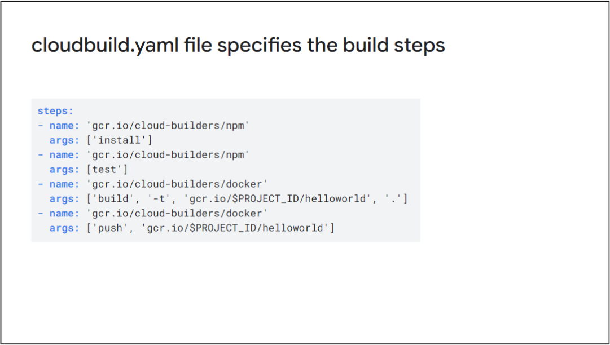
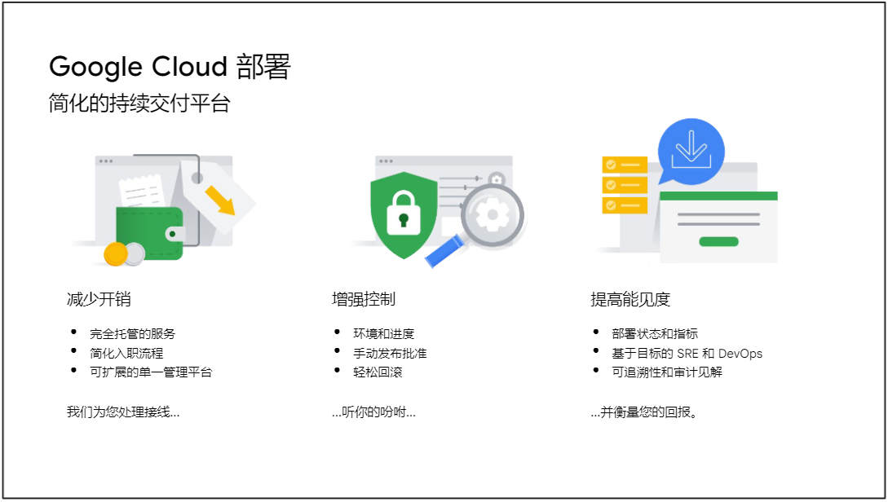
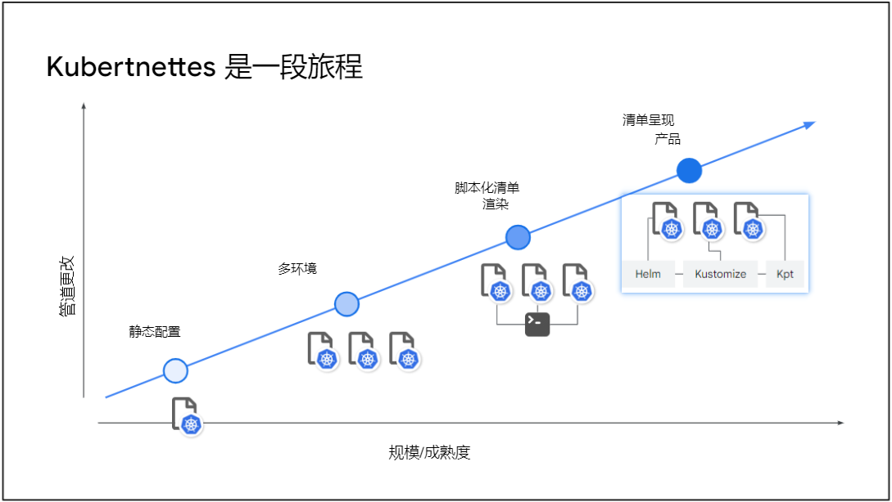
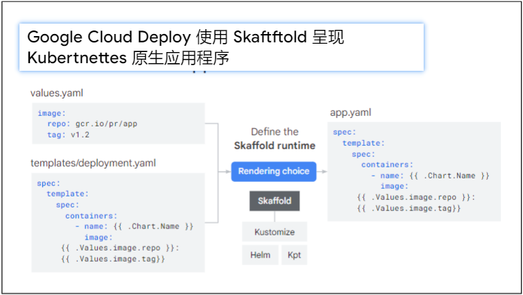
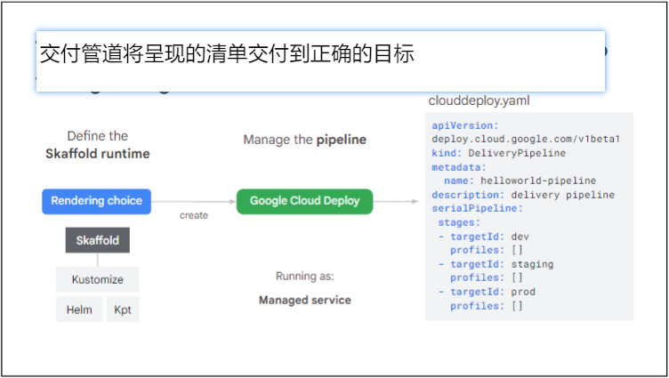
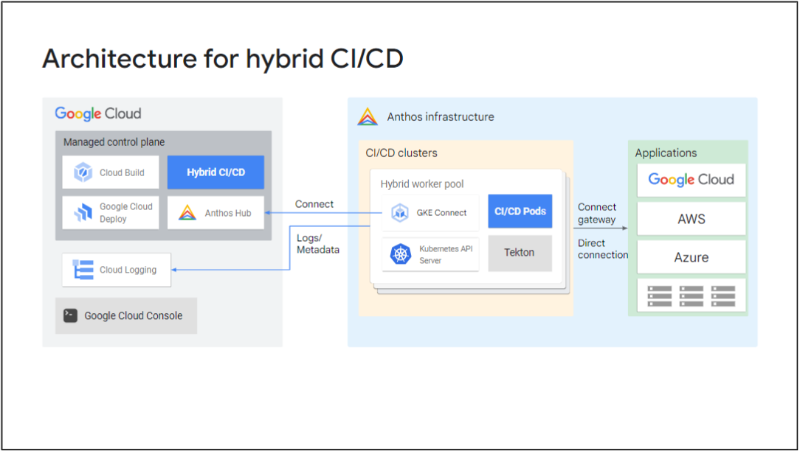
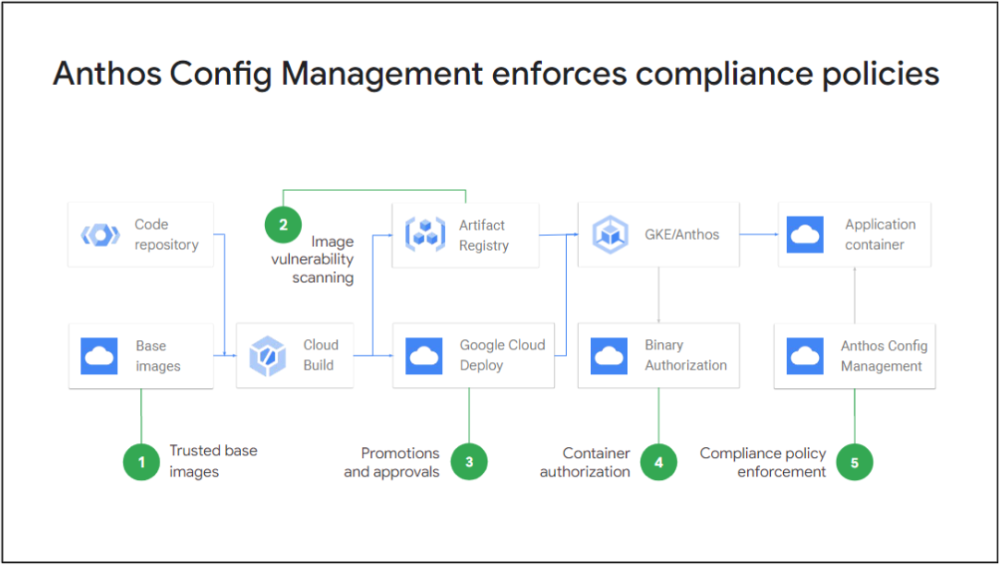
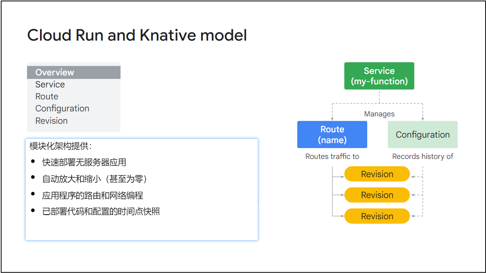
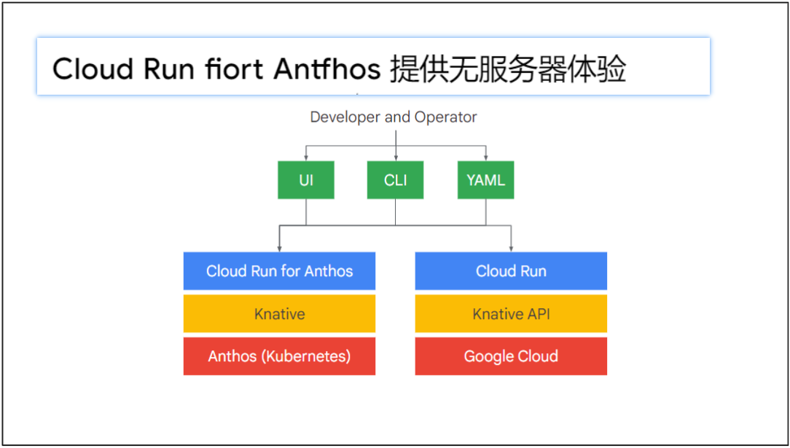

# 介绍
## 使用 Anthos 进行应用程序迁移
使用 Anthos 进行应用程序迁移 - 概述了应用程序迁移和现代化过程，包括策略、工作负载发现以及将应用程序迁移到容器。

## 适用于 Anthos 的现代 CI/CD
现代 CI/CD - 介绍了创建在 Google Cloud 和其他环境中运行的现代、无服务器、持续集成和持续交付或 CI/CD 管道的好处。本模块还介绍了如何实施 CI/CD、保护软件供应链，以及利用 Google Cloud Marketplace 中受信任的第三方软件在 Anthos 基础架构中运行。

## Anthos 上的无服务器
Anthos 上的无服务器 - 介绍了在 Google Cloud 和 Anthos 集群上使用无服务器的优势，以便您可以在任何地方加速创新。它还包括在 Google Cloud 和 Anthos 集群上部署 Cloud Run 应用，配置 Cloud Run 应用以实现基础架构自动化，以及使用 Google 的 Eventarc 服务与应用、云服务、协议和事件源进行通信。

# 使用 Anthos 进行应用程序迁移
## 学习目标
* 了解现代化的路径及其优势，以便您可以为您的用例选择合适的工具和服务。
* 了解如何以手动和自动方式评估和发现最适合容器化和迁移的工作负载。
* 使用 Migrate for Anthos 和 GKE 解决方案将无状态和有状态工作负载从虚拟机迁移到容器和 Kubernetes。
* 优化迁移的工作负载，以便您可以使用与绿地软件相同的方法维护、改进和继续开发它们。

## 现代化愿景
在规划应用程序现代化时，必须考虑三个想法：
* 基础架构现代化是指实施可按需扩展的软件定义的计算、存储和网络资源。
* 代码现代化包括使用云原生概念（如容器、微服务和 API 驱动的自动化）来重构旧工作负载。
* 流程现代化是引入 DevOps 方法，包括新软件的持续集成和持续交付 （CI/CD）。

### 实现现代基础设施的收益
* 加快开发速度，缩短上市时间。
* 提高可靠性和服务质量。
* 降低成本，同时提高安全性并降低风险。
* 考虑其他因素，例如员工满意度。

### 迁移策略和目标

### 容器化和 Kubernetes 的业务驱动因素
* 节省基础设施成本
  * 更高的密度（60-80%）：单个节点中有多个容器
  * 操作系统更新和内核补丁
* 运营效率：减少停机时间和 IT 管理
  * 自动化和编码的“期望状态”管理
  * 自动缩放、自我修复、监控、安全等。
* 开发人员工作效率：更快的上市时间、敏捷性
  * 使用 CI/CD 流水线进行现代应用生命周期管理
  * 快速部署，“一次编写，随处运行”

### Migrate for Anthos 和 GKE 可自动实现容器化
* 消除应用重写开发成本。
* 生成特定于应用程序的 CI/CD 项目，例如 Docker 映像、Dockerfile 和部署 yaml。
* 将存储重构为支持 Kubernetes 的 PVC。
* 省略与 VM 相关的文件和组件，这些文件和组件对 Kubernetes 环境中的应用程序不是必需的。
* 移植后的应用可以在任何 Anthos 或 GKE 集群上运行，而不受 Migrate for Anthos 部署的影响。
* 支持的来源：VMware、AWS、Azure、Compute Engine
* 处理环境：GKE、AWS 上的 Anthos、VMware 上的 Anthos
* 支持的工作负载操作系统类型：Linux 和 Windows 发行版
* 可用的用户界面：Google Cloud Console、Google Cloud CLI、API

## 工作负载发现和迁移评估
### Migrate for Anthos 和 GKE 支持特定的操作系统和 GKE 版本
如前所述，Migrate for Anthos 和 GKE 可自动执行工作负载的容器化和执行，并支持特定的操作系统和 GKE 版本。其中包括 CentOS、Debian、RHEL、SUSE、Ubuntu 和 Windows 操作系统。用于处理迁移的 GKE 集群必须使用 Ubuntu 容器优化操作系统，并且必须是 1.13 或更高版本。

### 适合 Migrate for Anthos 的工作负载
通常，如果支持容器化使用，并且提供了没有太多复杂性的容器化路径，则工作负载非常适合 Migrate for Anthos。某些工作负载是特别好的候选者。例如：
* Web/应用程序服务器
* 无状态 Web 前端
* 业务逻辑中间件（如 Tomcat、J2EE 和 COTS）
* 多虚拟机、多层堆栈（如 LAMP 和 WordPress）
* 中小型数据库（如MySQL、PostgreSQL等）

如果这些应用程序具有以下特征，则它们特别适合：
* 低占空比和突发工作负载
* 开发、测试和培训实验室环境
* 始终在线的低负载服务
* 可灵活应对重启和横向扩展
* 兼容许可（与操作系统、硬件、虚拟机管理程序无关）
* 兼容的第三方供应商支持合同

### 不适合 Migrate for Anthos 的工作负载
* 具有特殊内核驱动程序（例如内核模式 NFS）的 VM
* 对特定硬件的依赖关系
* 具有与某些硬件 ID 注册绑定的许可证的软件
* 不适合 Cloud SQL 的始终在线数据库虚拟机
* 特定于硬件的许可证限制（例如每个 CPU）
* 32 位操作系统
* 文件服务器
* 需要整个节点容量的基于 VM 的工作负载，例如高性能、高内存数据库（如 SAP HANA）
* 依靠 Compute Engine 实时迁移来满足高可用性要求的单实例工作负载

### 使用 StratoZone 和适合性评估工具自动发现和评估工作负载
略

### StrataZone 收集数据
略

### 适合性评估工具可验证容器化的适用性
略

### 使用适合性评估工具评估工作负载的步骤
略

### 以 CSV、JSON 和 HTML 格式提供的适合性评估报告
略

### 适合评估报告，使工作负载符合迁移条件
略

## 将应用程序迁移到容器
### 设置和规划
1. 确定迁移的来源 让我们逐步了解迁移过程步骤。第一步是确定迁移的来源;也就是说，确定是要迁移 Linux 还是 Windows VM，以及源提供程序，例如 VMware、AWS、Azure 或 Compute Engine。源提供程序是要迁移到 GKE 或 Anthos 的虚拟机所在的位置。
2. 在 VMware、AWS 或 Google Cloud 中创建处理集群 如果您的迁移源是 VMware 或 AWS，则可以使用同一位置的本地 Anthos 集群来迁移工作负载。如果您的目标是 Google Cloud，或者您是从其他来源迁移的，则必须在 Google Cloud 中设置 GKE 集群才能处理迁移。
2. GKE 处理集群使用 Migrate for Compute Engine Migrate for Compute Engine 对于 VMware、AWS 和 Azure，当目标是 Google Cloud 时，需要安装 Migrate for Compute Engine 来促进工作负载传输到 Google Cloud。
3. 添加迁移源 Migrate for Compute Engine 通过运行 migctl source create 命令或使用 Google Cloud Console 来定义要从中迁移的迁移源。此过程将添加从您指定的源迁移所需的详细信息：VMware、AWS、Azure、Compute Engine 或本地。
4. 创建迁移计划 Migrate for Compute Engine 迁移计划是执行迁移操作以及使用 migctl 和 Google Cloud Console 监控迁移活动和状态的中心对象。迁移对象作为 Kubernetes 自定义资源定义 （CRD） 实现，并与其他资源（如 Kubernetes PersistentVolumeClaim）一起包含在迁移计划中。

### 迁移和现代化
5. 自定义迁移计划 Migrate for Compute Engine 使用 migctl migration get 命令获取迁移文件，以便在继续执行之前查看和自定义它们。迁移计划的详细信息用于从源 VM 中提取工作负载的容器项目，并生成可用于将容器映像部署到其他群集（例如生产群集）的 Kubernetes 部署文件。
6. 生成容器工件 Migrate for Compute Engine 
7. 将工作负载部署到 GKE 或 Anthos 集群 Migrate for Compute Engine

### 优化
在此阶段，您可以使用 Istio 添加访问策略、加密和身份验证，并使用 Cloud Logging 和 Cloud Monitoring 进行监控和记录，所有这些都是通过更改配置而不是重新构建应用程序来实现的。您还可以使用 Cloud Build 等工具与 CI/CD 管道集成，以便实施第 2 天维护过程，例如软件包和版本更新。

此类维护操作利用生成的 Dockerfile 和捕获的系统映像层。当这些文件与 Migrate for Anthos 和 GKE 运行时层结合使用时，可以将这些文件构建到可执行容器映像中。

此外，您还可以更改源代码。进行所需的更新后，必须创建应用程序二进制文件（在本例中，它是一个新的 jar 文件，因为它是一个 Java 应用程序），并将它们添加到 Dockerfile 的末尾。

您还可以重新构建容器平台，并在 GKE Autopilot 或 Cloud Run 等无服务器产品中运行它，只需稍作更改。例如，将迁移的容器部署到 Cloud Run 时，只需将环境变量 HC_V2K_SERVICE_MANAGER设置为 true。

# 适用于 Anthos 的现代 CI/CD
## 学习目标
* 了解创建在混合环境中工作的现代、无服务器、持续集成和持续交付 （CI/CD） 管道的好处。
* 了解实施 CI/CD 管道所需的托管服务，并将其部署到 Google Cloud 和 Anthos 集群上。
* 保护您的软件供应链，确保仅构建可信、经过测试和验证的软件并将其部署到您的基础架构中。
* 利用 Google Cloud Marketplace 中值得信赖的第三方软件在您的 Anthos 基础架构中运行。

## Google Cloud 中的 CI/CD
### 应用现代化：应用程序交付 CI/CD
1. 通过现代应用程序堆栈、基础架构和流程释放公司的业务敏捷性。
2. 完全托管、可扩展的基础架构，可帮助您专注于核心业务。
3. 提供企业控制，例如正确执行 Kubernetes、提供适当的安全性等。

### CI/CD 之旅中的挑战
* 基础结构成本：CI/CD 听起来不错，但创建生产、暂存、开发等的固定副本的成本通常很高。
* 目标环境之间的差异：任何环境都不会是生产的完美副本，因此变化会导致分歧和管道复杂性增加。
* 大规模可见性：当您拥有数十个或数百个管道时，如何全面了解这些管道的运行状况或活动？
* 开发人员入职：随着环境配置变得越来越复杂，开发人员入职会受到影响。
* 职责和关注点的分离：当您需要根据角色拆分访问权限以符合合规性时，单个 CI/CD 工具会存在问题。
* 可观测性集成：将 Ops 与日志记录和监控相结合，可以增加协调和依赖关系，这反过来又会导致更长的平均恢复时间和更困难的根本原因分析。

### Google Cloud 中的 DevOps 和 CI/CD

* Cloud Code 是一个用于集成代码环境（或 IDE）的插件，例如 Visual Studio Code 和 IntelliJ，可用于编写、调试和部署 Kubernetes 应用程序。它还具有预配置的示例，因此您可以在几秒钟内开始运行代码。
* Cloud Source Repositories 是一项完全托管的 Git 服务，可用于存储代码并将触发器配置到 CI/CD 管道。
* Cloud Build 是一个完全无服务器的 CI/CD 平台。在云中以任何规模构建、测试和部署应用程序。
* Artifact Registry 存储、管理、扫描和保护容器映像和包。
* Google Cloud Deploy 是一个声明性持续交付系统。
* 最后，在您选择的平台上生产代码后，您可以使用 Cloud Logging 和 Cloud Monitoring 来观察您的应用。

### Cloud Build 是一个不拘一格的持续自动化平台

Cloud Build 是一个不带主见的持续自动化平台。您可以使用 Git 存储库、存储桶和 Pub/Sub 通知中的触发器来设置持续集成工作流，以启动项目生成过程，该过程可以创建容器、二进制文件、文件或 VM 映像。然后，Cloud Build 还用于运行单元和集成测试，并在所有先前任务都成功时部署应用程序。此外，它还用于运行基础结构即代码解决方案，例如 Terraform 和 Helm，并可用于协调多种类型的服务，从数据到 IoT 管道。

Cloud Build 将工作流定义为一组可以按顺序或并行执行的构建步骤。每个步骤都由容器执行，并以无服务器的自动化方式进行。工作流通常由代码存储库中的更改触发，并生成容器或二进制文件等项目。

Cloud Build 步骤在配置文件中定义，默认情况下，该文件名为 cloudbuild.yaml。在这里，您可以看到我们正在使用 NPM 容器构建器来安装和测试应用程序，并使用 Docker 容器构建器来构建应用程序容器并将其推送到容器注册表。

### Google Cloud 部署

### Kubernetes 配置是一段旅程

### Google Cloud Deploy 使用 Skaffold 呈现 Kubernetes 原生应用程序

### Google Cloud Deploy 是模块化的，可以很好地与现有的工具链（例如 Jenkins for CI）集成
### 监控您的交付管道
### 包括审批处理前部署

## 专用网络中的 CI/CD
大多数企业的资源都在专用网络中运行，无论是在 VPC、本地还是其他云提供商上。Cloud Build 在防火墙后面运行，除非在防火墙中创建访问权限，否则无法安全地访问这些资源。

企业通过两种方式解决这个问题：
* 选项 1：在自己的服务器上自行托管开源 CI/CD 解决方案。这通常是 Jenkins 的模型。
* 选项 2：自带运行器架构，在本地服务器或集群上运行代理。这就是 GitLab、GitHub Actions、Azure DevOps Pipelines、CircleCI 等所做的。

## 本地和多云环境中的 CI/CD
混合池提供了最高的灵活性，因为您可以在任何 Anthos 环境中运行 CI/CD 管道，无论您是在 Google Cloud、Azure 或 AWS 的云环境中，还是在 VMware 或裸机上运行自己的本地。Cloud Build 在后台使用开源 Tekton 项目，混合池允许 Anthos 客户在 Kubernetes 中运行 Tekton CI/CD 管道。这些管道与 Cloud Build 和 Google Cloud Deploy 100% 兼容，因此您不必根据运行位置更改代码，并且可以在跨环境使用统一的管道。

## 保护软件供应链
当我们谈论保护软件供应链时，我们指的是保护供应、保护构建和保护部署。
* 确保供应是指保护源代码的工具和技术、静态应用程序安全测试（或 SAST）、linting、依赖项验证和验收以及适当的源代码管理。
* 保护供应意味着确保生成过程涉及对生成工具和输出项目的信任。验证依赖项来源、构建映像、常见漏洞和暴露（或 CVE）、容器结构测试、基础映像、项目存储库和映像构建。
* 保护部署描述了用于安全地部署到任何环境的可重复过程：跨多个阶段的项目提升，例如开发或生产、这些启动的批准以及环境中部署的软件的策略管理。

1. 仅部署受信任的基础映像。有多种方法可以为您的图像建立信任。例如，Google 提供了您可以使用的托管基础映像。或者，您可以使用分发图片，也可以根据这些分发图片或 Google 的图片创建自己的图片。
2. 开启容器镜像服务中的漏洞扫描功能，防范基于CVE源的漏洞。
3. 可以为构件的启动者和审批者添加不同的 IAM 权限。为发起人设置 IAM 权限，以便他们可以说他们已准备好进行部署。为审批者设置 IAM 权限，审批者可以决定何时启动更改。
4. 使用二进制授权来证明生成已完成管道的所有阶段。
5. Anthos Config Management 强制执行合规性策略。它在集群内使用准入控制器，最终允许在集群中部署应用程序和配置。

## 部署第三方软件
### Google Cloud Marketplace 对客户和合作伙伴来说都是一个绝佳的机会
Google Cloud Marketplace 是一个包含第三方精选产品的在线存储库，可帮助客户发现、购买和实现企业级云解决方案。Cloud Marketplace 可帮助客户提供对内部应用的控制，并在单个账单中支付第三方产品费用，并帮助合作伙伴打包、销售、管理和升级其应用程序和服务。

### 在 Google Cloud Marketplace 上提供您的应用
1. 开放云市场，注册为卖家。
2. 为应用程序资源创建公共 Git 存储库。
3. 为容器映像创建项目注册表。
4. 设置一个 Google Cloud 项目供 Google 工程师进行测试。
5. 将环境注册到 Cloud Marketplace。
6. 选择定价方案。
7. 创建应用程序包。
8. 将应用提交到 Cloud Marketplace。
9. 利润。最后，将应用程序提交到 Cloud Marketplace - 您可以将其出售给其他人。

# Anthos 上的无服务器
* 了解无服务器在 Google Cloud 和 Anthos 集群上的优势，以便随时随地加速创新。
* 了解如何在 Google Cloud 和 Anthos 集群上部署 Cloud Run 应用，并了解其背后的开源技术。
* 配置 Cloud Run 应用，以便您能够灵活地使用最高级别的基础架构自动化服务配置。
* 与应用程序、云服务、协议和事件源进行通信，而不会被 Google 的 Eventarc 服务所束缚。

## 01 对无服务器的需求
### 运行生产级Kubernetes 应用很复杂
将应用程序容器化后，必须决定如何部署和升级应用程序，如何使用水平或垂直自动缩放程序设置自动缩放，以及如何使用活动和就绪探测配置自我修复应用程序。此外，您必须使用服务和入口资源配置网络层，并添加复杂的工作流，以防您想要使用高级部署策略，例如 Canary 部署或执行 A/B 测试。

### 开发人员希望专注于应用程序开发而不是基础设施
开发人员希望专注于应用程序开发，而不是基础设施。当开发人员在 Google Cloud 中使用无服务器解决方案（例如 Cloud Functions）时，他们可以专注于开发代码并在部署应用程序后监控应用程序，而 Google 则负责其余工作，例如扩展、网络、安全性、软件补丁和升级。

### Cloud Run 是一种无服务器产品，用于在 Google Cloud 和 Anthos 集群上部署容器化应用
该解决方案就是 Cloud Run，这是一种用于在 Google Cloud 和 Anthos 集群上部署容器化应用程序的无服务器产品。Cloud Run 通过处理您的容器化解决方案并根据传入请求自动扩展实例数量来简化应用程序管理。将新版本部署到生产环境时，您无需将流量从一个版本转移到另一个版本，因为 Cloud Run 会为您管理流量，并且您可以指定如何在版本之间拆分流量。您可以将一小部分流量发送到新版本，以查看是否出现任何问题，从而最大限度地减少客户中断。您可以毫不费力地平衡在不同区域和可用区上运行的 Cloud Run 应用的负载，从而轻松扩展，同时为客户保持低延迟。

## Cloud Run 和 Knative 模型
### Cloud Run 基于 Knative Serving，这使得应用程序具有可移植性
Cloud Run 和 Knative 模型:  

* Knative 模型中的服务组件管理工作负载的生命周期，并控制路由和修订的创建。使用服务，您可以配置可在内部和外部访问的应用程序。
* 路由组件将服务 URL 映射到特定修订版本。可以根据指向特定修订版的名称路由或基于权重（定义流向特定目的地的请求百分比）来引导流量。
* 配置指定服务的所需状态。它提供了代码和配置数据之间的分离。修改配置数据将自动创建新修订版本。
* 修订是服务的时间点快照

## 适用于 Anthos 的 Cloud Run
Cloud Run 是一个适用于混合云和多云环境的无服务器开发平台。
* 通过部署侦听请求或事件的任何代码或容器来编写代码。使用您喜欢的语言、您喜欢的依赖项和工具构建应用程序，并在几秒钟内部署它们。
* Cloud Run 消除了底层基础架构的复杂性，因此您可以轻松地在本地进行开发，并在任何地方构建和部署应用。
* Cloud Run 提供了一个稳定的 HTTPS 端点，可为您处理 TLS 终止，并可选择将您的服务映射到您自己的域。
* Cloud Run 通过根据流量几乎即时自动从零开始扩展和缩减，从而抽象出所有基础架构管理。Cloud Run 仅按您使用的确切资源向您收费。

### 使用 Cloud Run 进行本地开发和部署
借助 Cloud Run，您可以获得集成的端到端体验，从在本地开发和测试应用程序到在云中部署应用程序。Cloud Run 提供了一个模拟器，可通过 gcloud、Cloud Code for Visual Studio Code 和 IntelliJ 以及 Cloud Shell 编辑器获得，因此您可以在没有互联网连接的情况下在本地运行应用。

此外，gcloud 还提供单个命令来构建、推送和部署您的应用程序。命令“gcloud run deploy”使用 Dockerfile 或 buildpack 作为源来构建容器，使用 Cloud Build 执行实际的构建执行，并使用 Artifact Registry 来存储容器映像。然后，它会将容器映像部署到 Cloud Run 中。

### 部署到 Cloud Run 时保护 CI/CD 管道
* 您可以使用 Cloud Build 构建应用程序并创建二进制授权证明，以证明容器是在此处构建的。
* 二进制授权通过签名验证来断言映像的来源，因此只允许部署经过验证的映像。
* 将密钥存储在 Secret Manager 中，并将其提供给直接在 Cloud Run 中运行的应用程序。

### 使用自定义域提供 Web 流量
* 服务响应发送到服务 URL 的 HTTP 和 HTTPS 请求。
* Cloud Run 会自动生成 SSL 证书。
* 默认域示例：https://gateway-12345-uc.a.run.app
* 对于自定义域，请使用：
  * 全局外部 HTTP（S） 负载均衡器
  * Firebase 托管
  * Cloud Run 域映射（可用性有限）

### Cloud Run 服务访问控制
* 默认情况下，您的 Cloud Run 服务处于不可访问状态。您必须通过 Identity and Access Management（或 IAM）授予用户或服务访问权限。
* Cloud Run Invoker 角色决定了哪些成员可以访问该服务。
* 为了在内部使用 Cloud Run 时提高安全性，请使用 VPC Service Controls。将您的 Cloud Run 实例添加到 VPC Service Control，这是一项 Google Cloud 功能，可让您设置安全边界以防止数据外泄。
* 对于匿名访问，请将 allUsers 成员添加到 Cloud Run Invoker 角色。
* 此外，您还可以定义允许的对 Cloud Run 服务的入口源访问权限;定义是要访问所有流量、仅访问来自 Cloud Load Balancer 的流量，还是仅访问来自同一 VPC 的内部流量。

### Cloud Run 支持您全局部署
* 借助 Cloud Run，您可以在全球范围内进行部署。
* 启动服务时，该服务将按区域部署并跨区域复制。
* 如果您想扩展到多个区域，可以部署多个 Cloud Run 服务，并将 Google 负载平衡与指向 Cloud Run 服务的无服务器网络端点组结合使用。
* Google Load Balancing 与其他服务集成，例如 Google Cloud Armor、Cloud DNS 和 Cloud CDN

### 借助 Cloud Run，您可以进行扩展
* 借助 Cloud Run，您可以进行扩展
* Cloud Run 提供并发功能：
  * 一个实例最多可以同时处理 1000 个请求。
  * 将非线程安全代码的并发性降低到 1。
  * 较低的并发可能会影响性能并增加成本。

### 集成监控、日志记录、跟踪和错误报告
借助集成的监控、日志记录、跟踪和错误报告功能，您可以直接从 Cloud Run 信息中心管理和监控 Cloud Run 应用，其中包含已为您过滤和整理的所有信息。

## 无服务器事件
### Cloud Run for Anthos 提供无服务器体验
  
Cloud Run for Anthos 提供与 Cloud Run 相同的无服务器体验。无论是在 Google 云、混合云还是其他云环境中，您在 Google 基础架构上部署和管理基于容器的无服务器工作负载的方式也可以在您自己的基础架构上完成。不同之处在于，您现在处于责任共担模式，因为根据您选择的 Anthos 平台，您或合作伙伴拥有底层硬件基础设施，您必须确保这些基础设施可用且运行。

### Cloud Run 和 Cloud Run for Anthos 之间存在一些差异。
在 Cloud Run 中，由于它运行在 Google Cloud 基础架构上，并且您按使用量付费，因此您只能使用提供的 CPU 和内存配置，并且可以运行的实例数量也受到限制。在 Cloud Run for Anthos 中，没有额外的成本，因为它运行在您自己的基础架构上，您可以利用您的硬件并从更大的灵活性中受益，例如使用具有更高 CPU 和内存的计算机，甚至使用 GPU（如果可用），实例数量将取决于 Anthos 集群的大小。

在安全性和联网方面，Cloud Run 受 Identity and Access Management 和其他 Google Cloud 服务（例如 VPC Service Controls 或 Serverless VPC Access）的约束。Cloud Run for Anthos 可与 RBAC 控件和 Istio 网络策略配合使用，并且可以将访问权限配置为允许与 Internet、集群或 VPC 中的通信。此外，由于 Cloud Run 服务是 Anthos Service Mesh 的一部分，因此可以采用类似的方式控制与其他网格服务的通信。

最后，Cloud Run 提供的其他功能（例如自定义域、SSL 证书或使用 gVisor 沙盒实现严格的容器隔离）必须在基于 Kubernetes 的 Anthos 集群中手动配置。

### 要安装 Cloud Run for Anthos，请按以下步骤操作。
1. 将 Kubernetes 集群配置为具有至少 4 个 vCPU 的机器类型，例如 e2-standard-4。
2. 注册 Anthos 集群并确保它是队列的一部分。
3. 在 Anthos 集群上安装 Anthos Service Mesh。
4. 如果您在 Google Cloud 之外运行集群，则必须执行我们在下一张幻灯片中看到的其他步骤。
   1. 确保在 Anthos 集群中启用了 Cloud Monitoring。
   2. 创建具有所需监控指标编写器角色 （monitoring.metricsWriter） 的服务帐户。
   3. 创建 Knative Serving 命名空间并在其中安装服务帐户。
   4. 部署您的 Cloud Run 自定义资源，该资源指向您的项目 ID、集群所在的区域、集群的名称以及具有您之前创建的 Cloud Monitoring 权限的服务帐号的密钥名称和密钥。
5. 最后，通过运行“gcloud container hub cloudrun enable”命令或通过 Google Cloud Console 在集群中启用 Cloud Run for Anthos。

### Knative Eventing 提供不可知的消息传递
Knative Eventing 是另一个与基础设施无关、开源、基于 Kubernetes 的解决方案，专注于为松散耦合的事件驱动服务提供消息。它提供了不同的交付方法和事件源，从几个事件扩展到实时流，并且与 CloudEvents 一致，CloudEvents 是一种以通用方式描述事件数据的规范。

Knative Eventing 在服务之间发送事件消息，可以以简单的直接形式运行，也可以在类似于消息队列的更复杂的扇出场景中运行。

### 使用代理和触发器进行 Knative 事件处理
* 处理是通过代理和触发器完成的。
* 代理确保生成的每个事件都能找到正确的使用者。
* 代理使用触发器来决定哪个使用者服务获取特定事件。

### Knative Eventing 与频道配合使用
通道是事件转发和持久层。当事件到达通道时，可以将其传送到服务或其他通道。使用订阅进行交付。当事件到达频道时，订阅可用于将其传送到服务或其他频道。  
频道类似于 Pub/Sub Topics。  
频道和订阅控制事件消息的传递方式。  
订阅的示例包括其他服务或其他消息传递平台，例如 Apache Kafka。

### Eventarc 是 Knative Eventing 的托管服务
Eventarc 是 Knative Eventing 的托管服务。Eventarc 与 90 多种 Google Cloud 服务集成，并通过 HTTP 将消息传送到 Cloud Run 和 Cloud Run on Anthos，采用相同的 CloudEvents 格式。

### 使用 Eventarc 的 Cloud Run 事件
Eventarc 允许您构建事件驱动的架构，而无需实施、自定义或维护底层基础架构。