# 处理身份验证和授权
本模块涵盖在 Google Cloud 上的应用程序中处理身份验证和授权。

## 课程介绍
在应用程序中从头开始实现用户身份验证和授权可能有些令人生畏。借助 Cloud Identity and Access Management（简称 Cloud IAM）和 Identity Platform 身份验证，您现在无需承担构建此类系统的负担。

在处理身份验证和授权模块中，您将学习如何创建 IAM 成员、指定他们有权访问哪些资源以及他们可以对这些资源执行哪些操作。

您将了解如何使用服务帐号来允许应用进行身份验证并授权自己调用 Google Cloud API。我们将讨论如何使用身份感知代理来控制对应用程序的访问。

借助 Firebase SDK，您可以非常轻松地实现联合身份管理。您将了解如何使用 Firebase SDK 根据存储在 Identity Platform（Google Cloud 的企业级身份和访问管理平台）中的凭据验证用户。

## 课程信息
略

## IAM 概念
### 云身份和访问管理
借助 Cloud IAM，您可以通过定义谁（成员）对哪个资源拥有哪些访问权限（角色）来管理访问控制。您可以使用最低权限的安全原则授予对 Google Cloud 资源的更精细访问权限，即仅授予对必要资源的访问权限。

### 指定谁有权访问 IAM 成员
您可以指定谁有权访问 IAM 成员的资源。会员可以属于以下类型：Google 帐号、服务帐号、Google 群组、Google Workspace 网域或 Cloud Identity 网域。

* Google Cloud 帐号代表开发者、管理员或与 Google Cloud 互动的人员。与 Google 帐户关联的电子邮件地址（例如 gmail.com 地址）可以是身份。
* 服务帐户属于应用程序，而不是属于单个最终用户。
* Google 群组是 Google 帐号和服务帐号的命名集合。每个组都有一个与该组关联的唯一电子邮件地址。Google 网上论坛是将访问政策应用于一组用户的便捷方式。Google 网上论坛没有登录凭据，因此您无法使用它们来建立身份以发出访问资源的请求。
* Google Workspace 网域代表单位中所有成员的虚拟群组。Google Workspace 客户可以将其电子邮件帐号与互联网域名相关联。执行此操作时，每个电子邮件帐户都采用 username@yourdomain.com 形式。您可以使用与 Google Workspace 帐号关联的任何互联网域名来指定身份。与组一样，域不能用于建立身份，但它们可以方便地进行权限管理。
* Cloud Identity 网域代表单位中所有成员的虚拟群组，但不提供对 Google Workspace 应用和功能的访问权限。

### 指定成员有权访问的资源
您可以向用户授予对 Google Cloud 资源的访问权限。资源的一些示例包括项目、Compute Engine 实例和 Cloud Storage 存储分区。

### 指定允许对资源执行哪些操作
权限决定了允许对资源执行哪些操作。

### 使用角色分配权限：基本、预定义或自定义
角色是权限的集合。不能直接向用户分配权限;相反，您授予他们一个角色。当您向用户授予角色时，您将授予他们该角色包含的所有权限。使用 Cloud IAM 时，Cloud API 方法要求发出 API 请求的身份具有使用资源的相应权限。您可以通过向用户、组或服务帐户授予角色来授予权限。

有三种类型的角色：基本角色、预定义角色和自定义角色。

* 在项目级别应用基本角色：可以使用 Cloud Console、API 和 gcloud 命令行工具在项目级别应用基本角色。
* 应用预定义角色，实现对 Google Cloud 资源的精细访问：Cloud IAM 提供了预定义的角色，这些角色可以精细访问特定的 Google Cloud 资源，并防止对其他资源进行不必要的访问。
* IAM 自定义角色允许您定义一组精确的权限：这是自定义角色所允许的。许多公司使用“最小特权”模型，在这种模型中，组织中的每个人都拥有完成其工作所需的最低权限。其次，自定义角色只能在项目或组织级别使用。它们不能在文件夹级别使用。

### 使用策略定义谁拥有哪种类型的访问权限
策略附加到资源，用于在访问该资源时强制实施访问控制。  
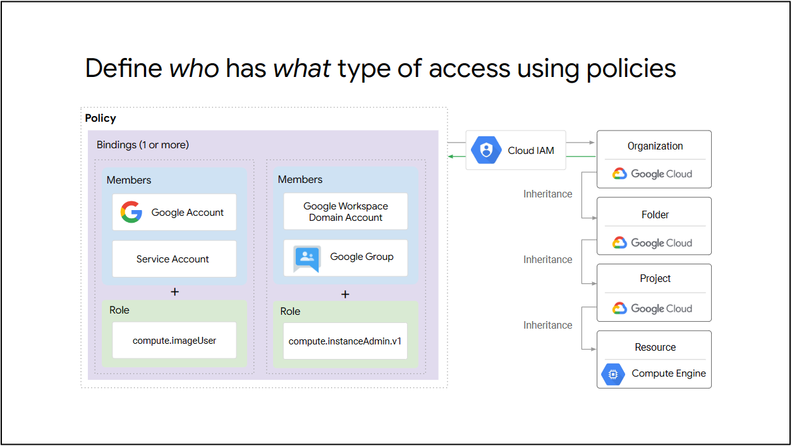

Cloud IAM 策略由 Policy 对象表示。策略由绑定列表组成。绑定将成员列表绑定到角色。  
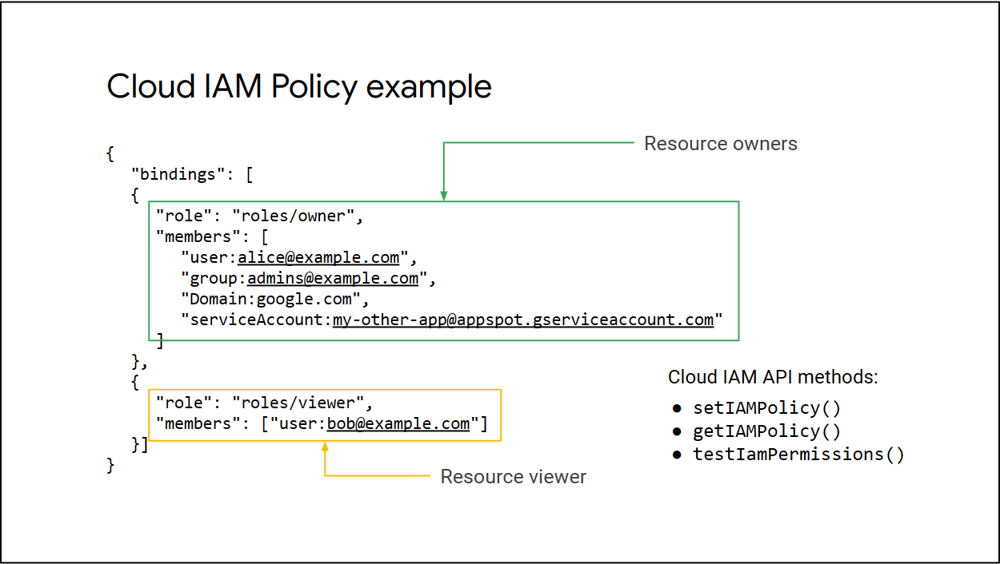

### 在调用 Google APis 时，使用服务帐号对应用进行身份验证
服务帐户属于应用程序或 VM 实例，而不是单个用户。您的应用使用它们来调用 Google API 或服务，以便用户不直接参与身份验证过程。每个服务帐户都由其唯一的电子邮件地址标识。服务帐号与一个密钥对相关联，最多可以关联 10 个密钥对，以便于密钥轮换，轮换由 Google 管理，每天完成一次。服务账户启用身份验证和授权，因为您可以将特定的 IAM 角色分配给服务账户。

### 使用外部密钥在 Google Cloud 外部使用
您可以创建要在 Google Cloud 外部使用的外部密钥。它们要求您管理私钥的安全性并执行密钥轮换等管理操作。外部密钥可通过 Cloud IAM API、gcloud 工具和 Cloud Console 进行管理。

### 您可以在一个项目中定义多个服务帐户
  
您可以在一个项目中定义许多非默认服务帐户。该图显示了一个用例，通过让每个微服务由其自己的服务帐户表示，在单个云项目中管理多个微服务。  
粒度是通过指定允许哪些服务帐户调用哪些其他服务来使用的。

### 在应用程序中使用服务帐户的步骤
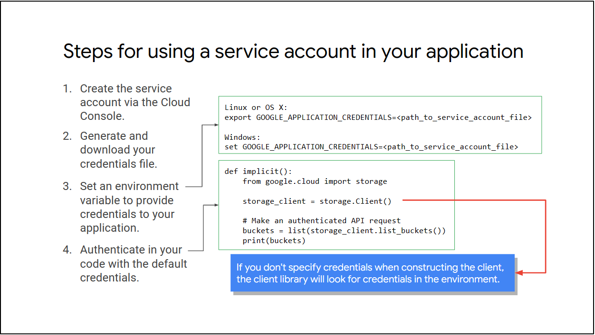  
要在应用程序中使用服务帐户，请首先通过控制台创建服务帐户。然后，生成并下载凭证文件，然后可以使用下载的凭证路径设置环境变量。该示例显示了在 Linux/OS X 和 Windows 中设置环境变量的命令。然后，您可以在代码中发出经过身份验证的 API 请求。示例代码是用 Python 编写的，它显示如果在构造客户端时未显式指定凭据，则客户端库将在环境中查找凭据。

### 使用应用程序默认凭据 （ADC） 在应用程序之间进行身份验证
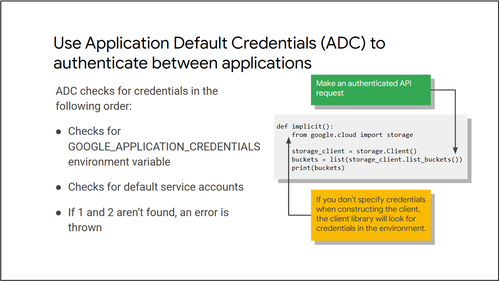  
Google Cloud 客户端库使用应用默认凭据 ADC 来查找应用的凭据。按以下顺序检查凭据： ADC 将检查GOOGLE_APPLICATION_CREDENTIALS环境变量。如果设置了环境变量，ADC 将使用该变量指向的服务帐户文件。如果未设置环境变量，ADC 将使用 Compute Engine、Google Kubernetes Engine （GKE）、App Engine 和 Cloud Functions 提供的默认服务帐号，前提是您的应用在这些服务上运行。如果找不到环境变量和默认服务帐户，则会发生错误。

## IAM 最佳实践
### 遵循最小权限原则
### 定期轮换服务帐户密钥并实施流程
### 不要将服务帐户密钥签入源代码
### 使用 Cloud Audit Logs 定期审核对 IAM 政策的更改，并将日志导出到 Cloud Storage
### 设置组织级 IAM 策略以授予对组织中所有项目的访问权限，以及尽可能将角色授予 Google 群组，而不是单个用户

## OAuth2.0、IAP 和 Firebase 身份验证
### 使用 0Auth 2.0 代表用户访问资源
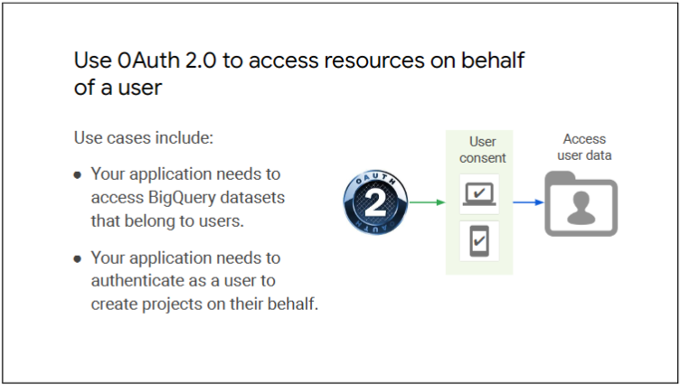  
您可以使用 OAuth 2.0 协议代表用户访问资源。应用程序将请求访问资源，系统将提示用户同意，如果提供同意，则应用程序可以从授权服务器请求凭据。然后，应用程序可以使用这些凭据代表用户访问资源。

### 身份感知代理 （IAP）
* 控制对在 Google Cloud 上运行的云应用的访问。
* 验证用户的身份。
* 确定该用户是否应该被允许访问应用程序。

IAP允许您为通过HTTPS访问的应用程序建立中央授权层。IAP 允许您采用应用程序级访问控制模型，而不是依赖网络级防火墙。

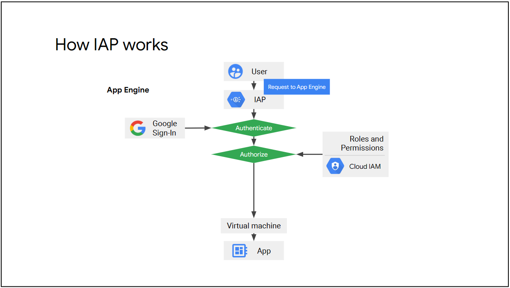  
受 IAP 保护的应用和资源只能由具有正确 Cloud IAM 角色的组中的用户通过代理访问。当您通过 IAP 授予用户访问应用程序或资源的权限时，他们将受到使用中的产品实施的细粒度访问控制，而无需 VPN。当用户尝试访问受 IAP 保护的资源时，IAP 会执行身份验证和授权检查。

使用 IAP 时请遵循以下注意事项
* 配置防火墙和负载均衡器，以防止不是来自服务基础结构的流量。
* 使用已签名的标头或 App Engine 标准环境用户 API。

### Identity Platform 提供身份验证即服务
Identity Platform 是一个客户身份和访问管理平台，用于向应用程序添加身份和访问管理。它以服务形式提供身份验证，开发人员可以通过一组 SDK 进行访问。

### Identity Platform 和 Firebase 身份验证之间的差异
Identity Platform 和 Firebase Authentication 提供类似的功能。两者都允许你通过提供后端服务、SDK 和 UI 库来轻松将用户登录到你的应用。

但是，Identity Platform 提供了专为企业客户设计的附加功能，例如 OpenID Connect 和 SAML 身份验证、多租户支持、身份感知代理集成以及 99.95% 的正常运行时间 SLA。

## 实验室：向您的应用程序添加用户身份验证

## 应用程序开发 - 向您的应用程序添加用户身份验证：Java 

## 练习测验

## 处理身份验证和授权测验

## 总结
您可以通过创建具有适当权限的 IAM 成员来控制用户对应用程序中资源的访问。应用程序对 Google Cloud API 的访问由服务帐号控制。您的应用会采用服务帐号的身份来调用 Google Cloud API。您可以创建一个或多个服务帐户来限制对应用程序中不同资源的访问。

身份感知代理（简称 IAP）使您能够控制对应用程序的访问。它验证用户的身份，并检查是否应允许该用户访问应用程序。最终用户只需使用可通过 Internet 访问的 URL 即可访问受 IAP 保护的应用程序。不再有VPN！

借助 Identity Platform，您可以轻松地将广泛采用、用户友好且可自定义的身份验证服务添加到您的 Web 和移动应用程序中，以便您可以专注于构建您的应用程序或服务。

# 使用 Pub/Sub 集成应用程序的组件
Pub/Sub 是一种完全托管的消息传递体系结构，可用于构建可异步通信的松散耦合微服务。您可以使用 Pub/Sub 来集成应用程序的组件。Pub/Sub 还使您能够在开放的多云或混合架构上构建应用程序。您可以使用适用于常用编程语言的客户端库、开放式 REST/HTTP 和 gRPC 服务 API 以及开源 Apache Kafka 连接器来发送和接收 Pub/Sub 消息。

Pub/Sub 非常适合实时游戏应用、点击流数据摄取和处理、医疗保健和制造业的设备或传感器数据处理以及金融应用中的各种数据源等用例。

Pub/Sub 是 Google Cloud 流数据管道的关键组成部分。Pub/Sub 可以快速提取大量数据，并将数据可靠地传送到 Dataflow 和 BigQuery 进行数据处理和分析。

Pub/Sub 会根据消息量自动扩展，使您能够安全地集成分布式系统。

## 为什么要发布/订阅？
### 在各行各业中，一个常见的情况是组织必须快速摄取、转换和分析大量数据。
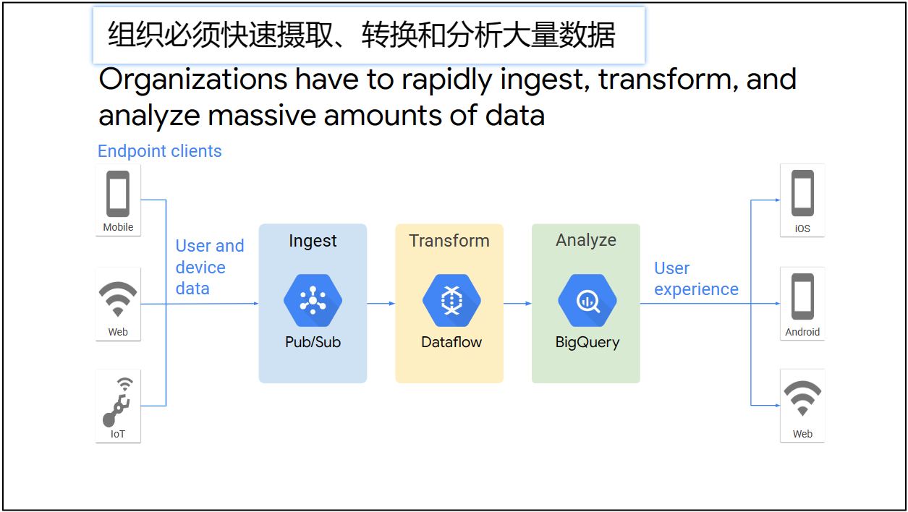

### 组织通常具有复杂的业务流程，需要许多应用程序相互交互。
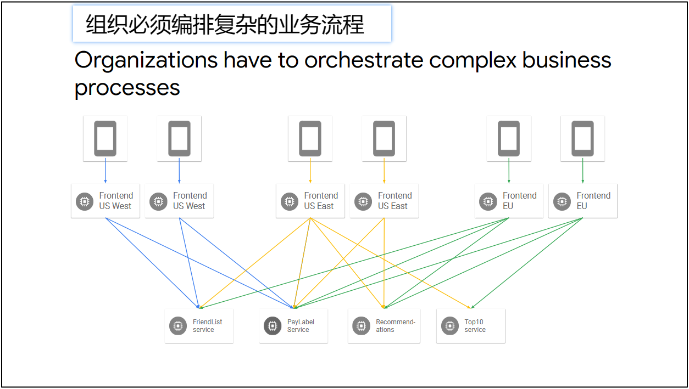  

## Pub/Sub 概念
### Pub/Sub 是一种完全托管的实时消息传递架构。
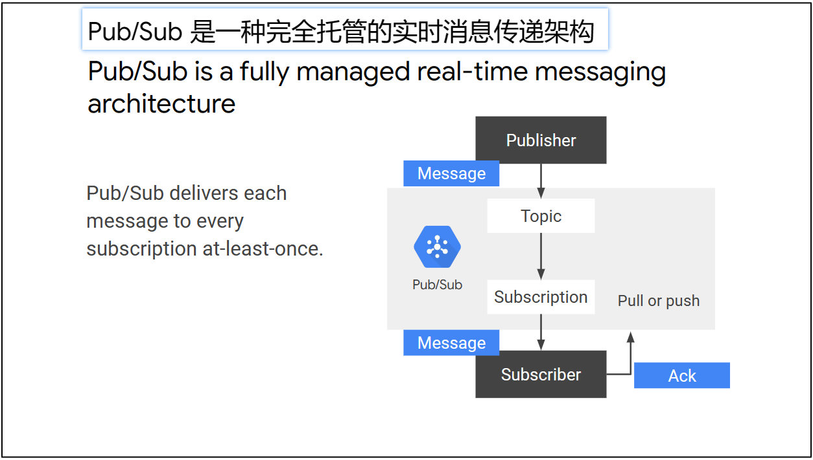  
Pub/Sub 是一种完全托管的实时消息传递架构。  
发布消息的应用程序称为发布者。发布者创建消息并将其发布到主题。为了接收消息，订阅者应用程序会创建对主题的订阅。订阅可以使用推送或拉取方法进行消息传递。订阅者仅接收在创建订阅后发布的消息。  
在接收并处理每条待处理消息后，订阅者将确认发送回 Pub/Sub 服务。Pub/Sub 从订阅的消息队列中删除已确认的消息。如果订阅者在确认截止日期之前未确认消息，Pub/Sub 将向订阅者重新发送消息。Pub/Sub 将每条消息至少传送到每个订阅一次。  
Pub/Sub 支持应用程序组件之间的松散耦合集成，充当缓冲区以处理数据量峰值，还支持其他用例。

### Pub/Sub 支持拉取和推送订阅
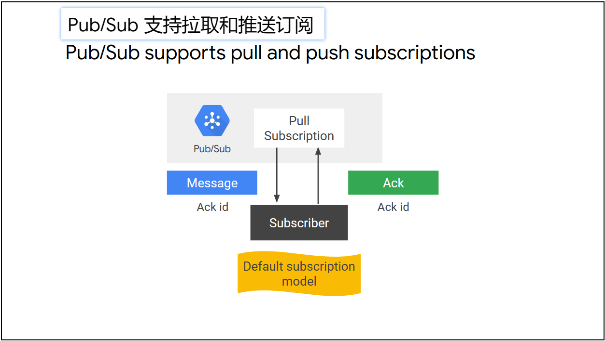  
Pub/Sub 支持拉取和推送订阅。在请求订阅中，订阅者显式调用 pull 方法来请求传递消息。Pub/Sub 返回一条消息和一个确认 ID。若要确认接收，订阅者使用确认 ID 调用已确认的方法。这是默认的订阅模式。  
在请求订阅模型中，订阅者可以是 Dataflow，也可以是使用云客户端库检索消息的任何应用程序。订阅者控制交付速率。订阅者可以修改确认截止时间，以便有更多时间处理消息。若要快速处理消息，多个订阅者可以从同一订阅中拉取消息。拉取订阅模型支持批量交付和确认以及大规模并行使用。  
当需要以高吞吐量处理大量消息时，请使用请求订阅模型。

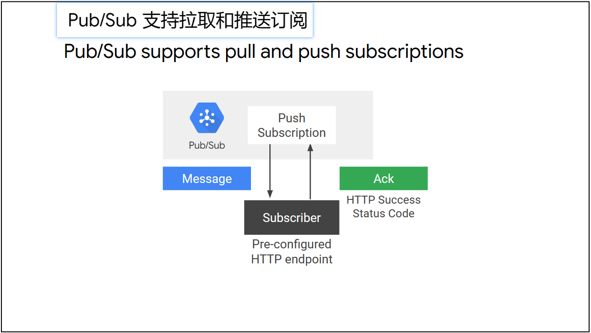  
推送订阅者无需实现 Google Cloud 客户端库方法来检索和处理消息。

在推送订阅模型中，Pub/Sub 将每条消息作为 HTTP 请求发送到预配置的 HTTP 端点上的订阅者。推送端点可以是负载均衡器，也可以是 App Engine 标准应用。终结点通过返回 HTTP 成功状态代码来确认消息。失败响应指示应再次发送消息。Pub/Sub 根据其收到成功响应的速率动态调整推送请求的速率。

您可以为推送订阅配置默认确认截止时间。如果您的代码未在截止日期前确认消息，则 Pub/Sub 将重新发送消息。

在无法配置 Google Cloud 依赖项（例如凭据和客户端库）或必须由同一 Webhook 处理多个主题的环境中，请使用推送订阅模式。当 Pub/Sub 和其他应用程序将调用 HTTP 端点时，推送订阅也是理想的选择。在此方案中，推送订阅者应该能够处理来自 Pub/Sub 和其他调用方的消息有效负载。您可以为订阅者选择执行环境。

## Pub/Sub 用例
### 您可以为订阅者选择执行环境
* 使用 Cloud Functions 或 Dataflow 开发高度可扩展的订阅者。
* 在 Compute Engine、Google Kubernetes Engine 或 App Engine 柔性环境中部署订阅者。基于 Cloud Monitoring 指标的自动缩放。

### 使用 Pub/Sub 进行异步处理和松耦合
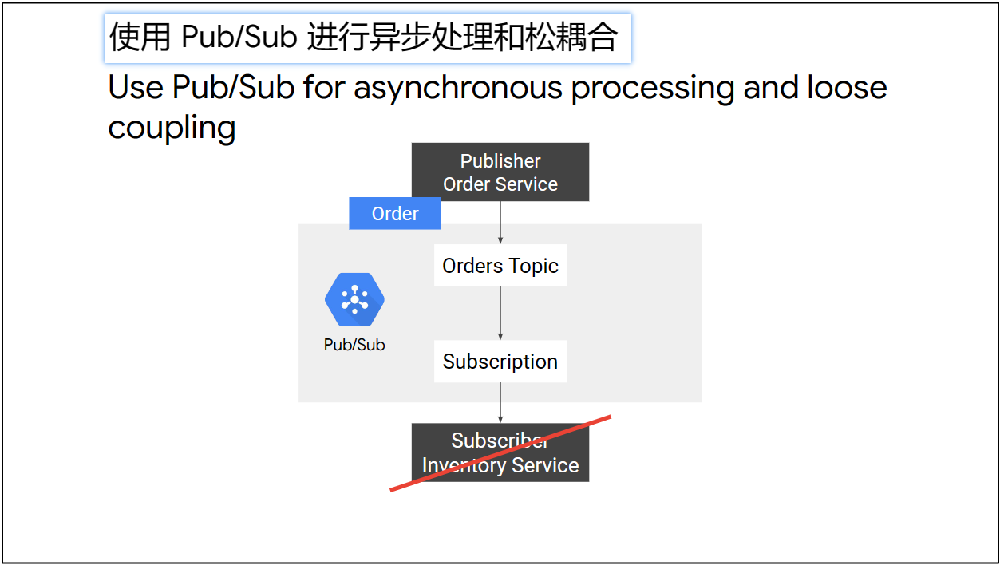  
Pub/Sub 使应用程序能够异步执行操作。传统上，应用程序的一个服务或组件必须直接调用另一个组件来执行操作。调用是同步的，因此调用方必须等待整个操作完成。应用程序组件是紧密耦合的，因为两者必须同时运行。

使用 Pub/Sub，您可以将服务设计为进行异步调用并实现松散耦合。例如，在关系图中，Order 服务充当发布者。它将包含订单信息的消息发布到 orders 主题并立即返回。Inventory 服务充当订阅者。当发布者发送消息时，它甚至可能关闭。订阅者可以稍后开始运行并处理它订阅的消息。

### 使用 Pub/Sub 缓冲传入数据
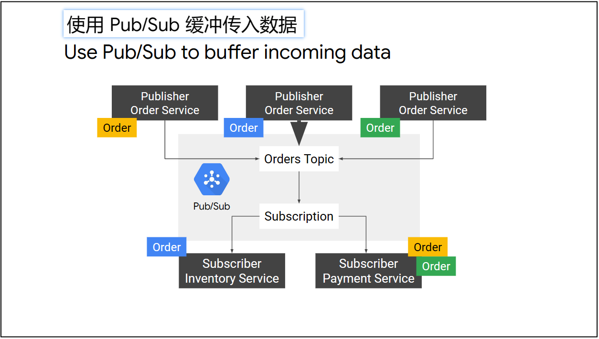  
Pub/Sub 使您能够使用主题作为缓冲区来保存快速传入的数据。例如，您可能有多个服务实例生成大量数据。需要处理此数据的下游服务可能会被高速和大量数据淹没。

为了解决此问题，数据生成服务的实例可以充当发布者，并将数据发布到 Pub/Sub 主题。Pub/Sub 可以可靠地接收和存储大量快速传入的数据。然后，下游服务可以充当订阅者，并以合理的速度使用数据。应用程序甚至可以自动扩展订阅服务器的实例数，以处理增加的数据量。

### 使用 Pub/Sub 扇出消息
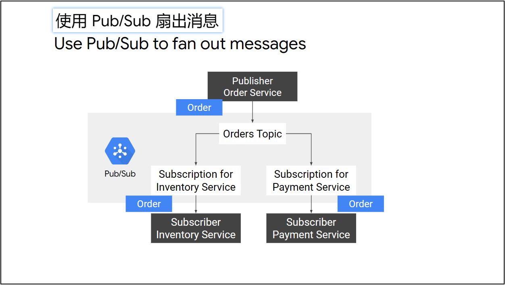  
使用 Pub/Sub，应用程序可以将消息从一个发布者扇出到多个订阅者。发布者可以向集中式发布/订阅主题推送消息，而不是了解可能对特定数据感兴趣的所有服务，并与所有服务建立脆弱的点对点连接。对信息感兴趣的服务只需订阅该主题即可。

### 处理重复消息
Pub/Sub 至少传递每条消息一次。这意味着订阅者有时可以看到重复的消息。以应用程序可以执行幂等操作的方式实现发布者和订阅者。

发布者可以发布具有唯一 ID 的消息。您的订阅者可以使用 Datastore、Firestore 或 Cloud Bigtable 来存储有关已处理消息的信息。使用唯一 ID 作为密钥。每当收到消息时，订阅者都可以检查以前保存的消息，以查看传入的消息是否为新消息并需要处理。如果消息已被处理，则订阅者可以丢弃重复的消息。

### 为了实现可伸缩性，请减少或消除对消息排序的依赖性
Pub/Sub 提供高度可扩展的消息传递体系结构。可伸缩性需要权衡：不能保证消息排序。在可能的情况下，将应用程序设计为减少甚至消除对消息排序的依赖关系。

### 处理事务数据的消息排序
在第一种情况下，订阅者知道必须处理消息的顺序。发布者可以发布具有唯一 ID 的消息。  
在第二种情况下，订阅者会检查 Cloud 监控指标中最早的未确认消息。订阅者可以将所有消息存储在持久数据存储中。

## 实验室开发后端服务
略

## 应用程序开发 - 开发后端服务：Java

## 练习测验：使用 Pub/Sub 集成应用程序的组件

## 最终测验：使用 Pub/Sub 集成应用程序的组件

## 总结
通常，应避免应用程序之间的点对点通信。这种集成会使您的整个系统变得脆弱且难以管理。使用 Pub/Sub 简化可扩展分布式系统之间的集成。当应用程序的组件松散耦合并异步通信时，您可以构建更具可扩展性和弹性的体系结构。

使用 Pub/Sub 可以快速可靠地摄取大量传入数据，并将消息扇出到多个订阅者。

您可以在任何执行环境（例如 Compute Engine、GKE 或 App Engine）中运行订阅者应用。您还可以使用 Cloud Functions 对 Pub/Sub 消息执行事件驱动处理。

借助 Pub/Sub，您可以构建高度可扩展且具有弹性的架构。

# 为您的应用程序添加智能
## 使用预先训练的机器学习 （ML） 模型为您的应用程序添加智能
Google Cloud 提供了多个预先训练的机器学习 （ML） 模型，您可以使用这些模型为您的应用添加智能功能。  
* 借助 Vision API，您可以执行复杂的图像检测。
* 语音转文本和文本转语音 API 使开发人员能够将音频转换为文本，将文本转换为音频。它处理 110 种语言和变体，以支持您的全球用户群。您可以转录用户对应用程序麦克风的听写文本、通过语音启用命令和控制、转录音频文件等。
* 借助 Cloud Translation API，您可以将任意字符串翻译成任何受支持的语言。Cloud Translation API 的响应速度非常快。网站和应用可以使用 Cloud Translation API 将文本从源语言快速、动态地翻译成目标语言，例如从日语翻译成英语。
* 借助 Cloud Natural Language API，您可以提取有关文本文档、新闻文章或博客文章中提及的实体（例如人物、地点和事件）的信息。您可以使用 API 在社交媒体上了解有关您的产品的情绪或解析客户对话中的意图。
* Video Intelligence API 使您能够搜索每个视频文件的每一刻，以提取和理解视频的镜头、帧或视频级别的实体。该 API 会对存储在 Google Cloud Storage 中的视频进行注释，并帮助您识别视频中的关键名词实体以及它们在视频中出现的时间。
* AutoML 是一套 ML 产品，使 ML 专业知识有限的用户能够训练特定于其业务需求的高质量模型。AutoML 利用 10 多年的专有 Google Research 技术，帮助用户的 ML 模型实现更快的性能和更准确的预测。
* 您还可以使用 TensorFlow 和 Vertex AI 使用自己的数据来构建和训练自己的 ML 模型。

## 调用 REST API 以使用机器学习 API;无需机器学习知识
调用 REST API 在应用程序中实现机器学习非常容易，无需 ML 知识。

# 使用云函数进行事件驱动处理
## 将 Cloud Functions 用于事件驱动处理
借助 Cloud Functions，可以运行完全无服务器的环境，在该环境中，可以按需执行逻辑并响应事件。Cloud Functions 可以充当不同应用之间的粘合剂。借助 Cloud Functions，您可以构建高度可扩展的无服务器微服务架构。您可以专注于代码，而不必担心设置服务器来运行该代码。

在本模块中，使用 Cloud Functions 进行事件驱动处理：
* 您将了解 Cloud Functions 触发器。
* 您将了解如何执行 Cloud Functions 以响应异步事件和同步 HTTP 调用。
* 您将开发和部署 Cloud Functions 以执行事件驱动的处理。
* 您将了解如何处理 Cloud Functions 的日志记录、错误报告和监控。

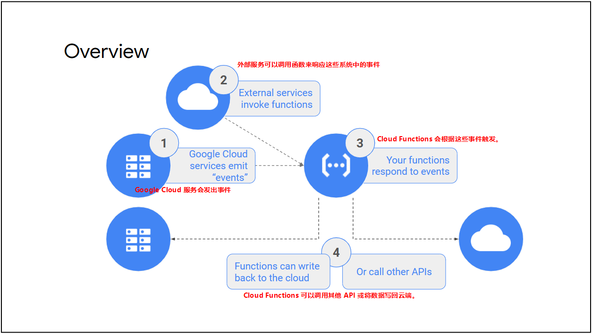

## Cloud Functions 支持事件驱动型、无服务器、高度可扩展的微服务
借助 Cloud Functions，您可以开发事件驱动、无服务器且高度可扩展的应用。每个函数都是一个轻量级的微服务，可用于集成应用程序组件和数据源。Cloud Functions 非常适合需要一小段代码来快速处理与事件相关的数据的微服务。Cloud Functions 的定价取决于函数的运行时间、调用次数以及您为函数预置的资源。

## Cloud Functions 使用场景
* Cloud Functions 可以用作 Webhook。
* 您可以使用 Cloud Functions 执行轻量级提取-转换-加载 （ETL） 操作。
* 您还可以使用 Cloud Functions 处理发布到 Pub/Sub 主题的 IoT 流数据或其他应用消息。

## Cloud Functions 功能
* 随用随付
* 无需配置、管理或升级服务器
* 高度可扩展，根据负载自动扩展
* 为函数的执行时间付费，在空闲时无需支付任何费用
* 用 Node.js、Python、Go 或 Java 编写函数。

## Cloud Functions 可以有异步触发器和同步触发器
* 可以异步触发云函数，以响应 Cloud Storage、Pub/Sub 或 Firebase 中的事件。异步触发的函数称为后台函数。
* Cloud Functions 也可以通过直接 HTTP 请求响应同步调用。以这种方式调用的函数称为 HTTP 函数。请记住，云函数的默认超时值为 60 秒。确保函数在超时之前完成执行。对于 HTTP 函数，请务必将执行时间保持在最低限度，以避免负面的用户体验。

## 部署 Cloud Function
您可以使用 Cloud Console 或 gcloud 命令从本地计算机部署函数。gcloud 命令会自动压缩您的代码，并将其上传到您指定的 Cloud Storage 暂存存储分区。

您还可以直接从独立的 Google Cloud 源存储库或与 Github 或 Bitbucket 存储库自动同步的云源存储库部署代码。

## Cloud Functions 支持日志记录、错误报告和监控
* 您可以在 Cloud Logging 中查看 console.log 和 console.error 消息的输出。
* 在 Cloud Console 中，您可以查看与调用次数、执行时间和内存使用情况相关的函数指标。

# 使用 Cloud Endpoints 管理 API
假设您有一些功能希望作为 API 公开给消费者。自行部署和管理该 API 可能具有挑战性。借助 Cloud Endpoints，您可以在 Google Cloud 上部署和管理 API。在使用 Cloud Endpoints 管理 API 模块中，您将了解如何为 REST API 开发 OpenAPI 配置。您将学习保护和限制对 API 的访问、部署新版本的 API 以及将 API 部署到测试和生产环境的技术。您还将了解如何监控 API 的指标。

## 云端点概念
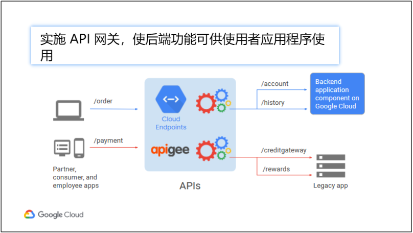  
API 网关使客户端能够通过单个请求从多个服务中检索数据。API 网关创建一个抽象层，并将客户端与分区为微服务的应用程序的详细信息隔离开来。  
您可以使用 Cloud Endpoints 实现 API 网关。此外，应用的 API 可以在后端运行，例如 App Engine、Google Kubernetes Engine （GKE） 或 Compute Engine。  
如果您的旧应用程序无法重构并迁移到云中，请考虑将 API 实现为适配器层或外观。然后，每个使用者都可以调用这些现代 API，而不是使用旧协议和不同的接口调用过时的 API。  
使用 Apigee API 平台，您可以设计、保护、分析和扩展 API，同时无缝利用您的传统后端。  

### 借助 Cloud Endpoints，您可以更轻松地部署和管理 API
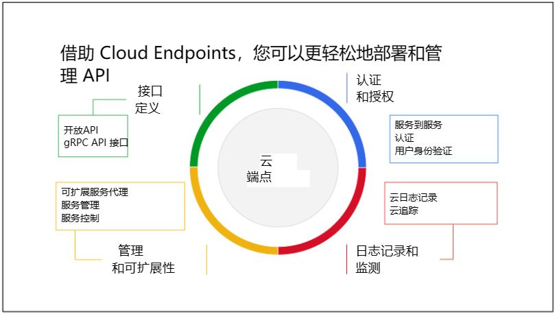  
Cloud Endpoints 提供部署和管理强大、安全且可扩展的 API 所需的基础架构支持。  
Cloud Endpoints 支持 OpenAPI 规范和 gRPC API 规范。  
Cloud Endpoints 支持使用 Firebase、Auth0 和 Google 身份验证进行服务到服务身份验证和用户身份验证。  
可扩展服务代理、服务管理和服务控制 API 共同验证请求、记录数据和处理大量流量。  
借助 Cloud Endpoints、Cloud Logging 和 Cloud Trace，您可以查看与流量、延迟、请求和响应大小以及错误相关的详细日志、跟踪列表和指标。

### Cloud Endpoints 支持 REST API 和 gRPC API
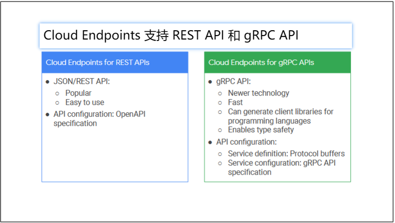  
基于 JSON HTTP 1.1 的 REST API 很受欢迎且易于使用。要为 REST API 启用 Cloud Endpoints，请根据 OpenAPI 规范在 YAML 文件中创建 API 配置。  
gRPC 是一种更新、更快的技术。您可以为各种编程语言生成客户端库。然后，应用程序可以进行类型安全的远程服务器调用，就好像它们是本地调用一样。若要为 gRPC API 启用云端点，请使用协议缓冲区创建服务定义，然后使用 gRPC API 规范创建服务配置。  
Cloud Endpoints 支持将 HTTP JSON 调用转码为 gRPC。客户端可以在使用普通的旧 HTTP JSON 调用时访问 gRPC API。

## REST API 的云端点
### 开发和部署 API 配置和 API 后端
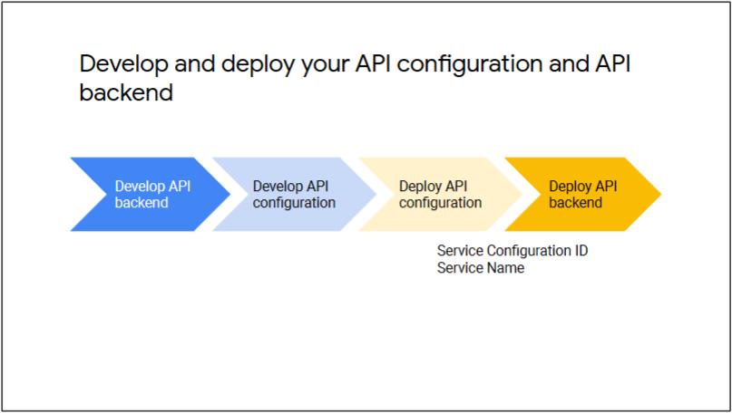  
开发 REST API 后端后，请创建一个描述 Cloud Endpoints API 的 API 配置文件。  
使用“gcloud service management deploy”命令部署 API 配置。gcloud 命令返回服务配置 ID 和服务名称。在 API 的后端配置文件（例如 App Engine 灵活环境部署的“app.yaml”文件）中指定此服务配置 ID 和服务名称。  
最后，部署 API 后端。

### 使用 OpenAPI 规范作为接口定义语言
创建描述云终结点 API 的 API 配置文件。API 配置是一个 YAML 文件，用于使用 OpenAPI 规范描述 API。OpenAPI 规范及其扩展使您能够描述 API 的表面和安全定义。您可以为用户身份验证和服务到服务身份验证指定安全定义。

有各种工具可帮助您创建和管理 OpenAPI 规范。有关更多信息，请参阅有关 Swagger 编辑器、Swagger 工具和集成以及面向 API 开发人员的 OpenAPI Swagger 资源列表的文档。

### 服务管理 API、服务控制 API 和可扩展服务代理构成了 Cloud Endpoints 的核心
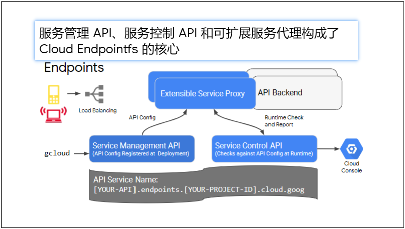  
部署 API 配置时，它将注册到服务管理 API，并与可扩展服务代理共享。  
在运行时，Cloud Endpoints 可以接收来自任何来源的调用，例如移动应用程序、Web 应用程序和其他服务。  
调用将进行负载平衡并路由到可扩展服务代理。可扩展服务代理与服务控制 API 配合使用，根据 API 配置检查请求，并验证请求是否可以传递到后端。  
如果请求进行身份验证成功，可扩展服务代理会将其传递给 API 后端。  
服务控制 API 记录有关传入请求的信息。可以使用 Cloud Console 查看这些日志消息和指标。

### 启用用户身份验证和服务到服务身份验证
借助 Cloud Endpoints API，您可以对尝试调用前端 API 的用户进行身份验证。Cloud Endpoints 支持使用 Firebase、Auth0 [auth zero]、Google 身份验证和其他自定义身份验证方法进行用户身份验证。用户登录后，身份验证提供商会向 Cloud Endpoints 发送已签名的 JSON Web 令牌（或 JWT，发音为“jot”）。Cloud Endpoints 会检查 JWT 是否由您在 API 配置中指定的提供商签名。

### 您可以限制 API 访问
要限制对 Cloud Endpoints API 的访问，您可以将身份和访问管理角色分配给特定用户。您可以授予对特定 API 或整个 Cloud 项目的访问权限。

要使用户能够在自己的云项目中启用您的服务并调用其 API，请为他们分配服务使用者角色。这是最常见的用例。您可以分配“服务控制者”、“查看者”、“编辑者”或“所有者”角色，以授予用户查看和管理服务配置和项目的更大权限。

### 您可以在生产环境中部署多个版本的 API
您可以对 API 后端进行一些小的更改、错误修复和性能增强。这些更改通常是向后兼容的。在这种情况下，最好在 Cloud Endpoints API 配置中递增 version 属性，然后重新部署 API 配置和 API 后端。

如果您所做的更改不向后兼容，并且会破坏 API 使用者的功能，请为每个版本创建单独的 API 配置，从而部署两个版本的 Cloud Endpoints API。“gcloud service management deploy”命令将为每个版本返回不同的服务配置 ID。使用对应的服务配置 ID 更新每个版本的 API 后端配置。

### 您可以在多个环境中部署 API
在开发和部署 API 时，您将拥有单独的环境来开发和暂存有限版本（例如私有 alpha 版本）和生产环境。

您可以为每个环境创建单独的项目，并为使用者部署具有单独端点的 Cloud Endpoints API 和后端。

### 可以从 Cloud Endpoints 仪表板查看错误日志和指标
在 Cloud Endpoints 信息中心中，您可以查看与请求、4xx 和 5xx 错误以及延迟相关的指标。您还可以在 Cloud Logging 中查看日志，详细了解每个 API 的请求。

### 您可以允许用户使用 Endpoint Developer Portal 测试和浏览您的 API
您可以使用 Cloud Endpoints Portal 创建开发人员门户，即 Cloud Endpoints API 用户可以访问的网站，以探索和测试您的 API。在您的门户上，在自己的代码中使用您的 API 的开发人员可以找到您的 API 的 SmartDocs API 参考文档。

SmartDocs 使用 Cloud Endpoints Frameworks 创建的 OpenAPI 文档来生成 API 参考文档。SmartDocs 包括一个“试用此 API”面板，因此开发人员可以在不离开文档的情况下与您的 API 进行交互。

### 让我们看一下选择 Cloud Endpoints 的一些原因。
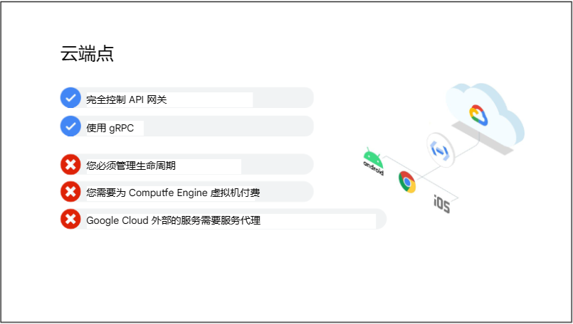

### 为什么选择 API Gateway？
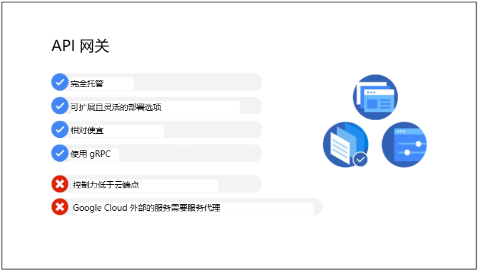

### Apigee API 平台
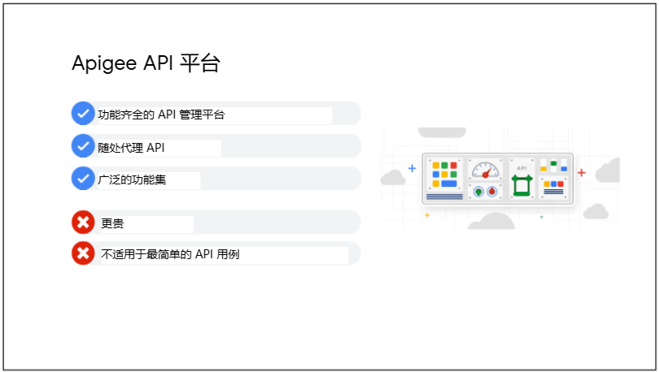

## 实验室概述
略

## 应用程序开发 - 为测验应用程序部署 API
略

## 最终测验：使用云端点管理 API
略

## 总结
略

## 课程回顾
略