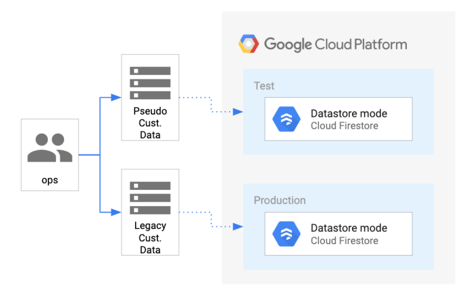
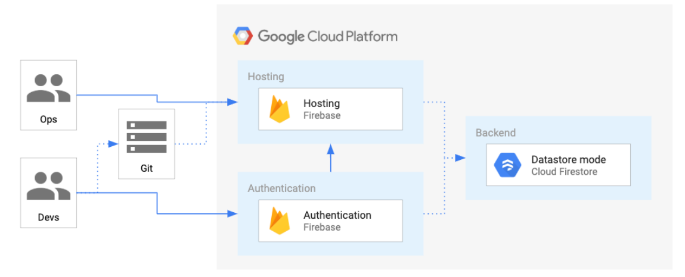
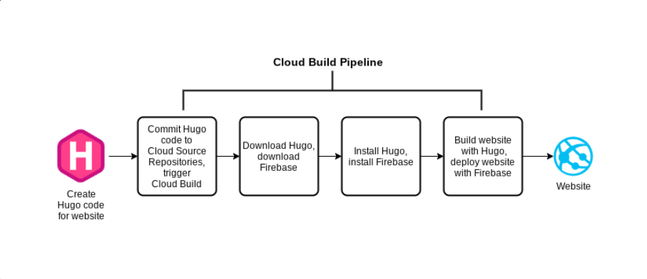
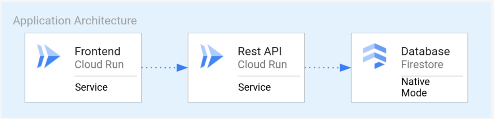
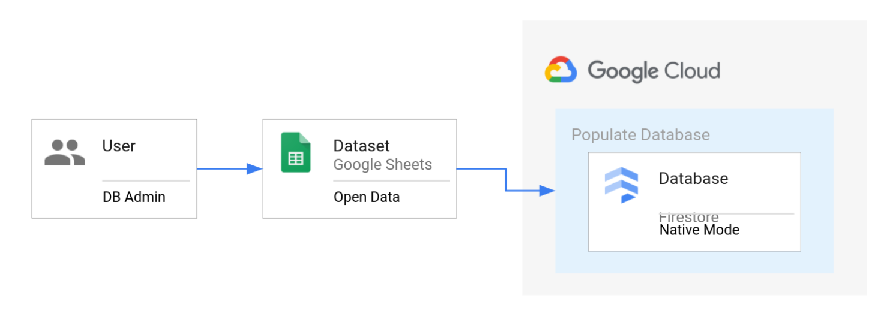
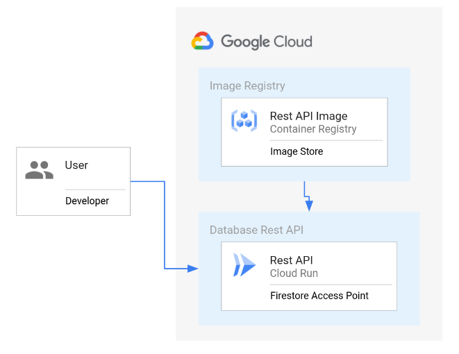

# [将数据导入 Firestore 数据库](https://www.cloudskillsboost.google/course_sessions/11793742/labs/451332)

在本实验中，您将学习如何:
* 在 Google Cloud 中设置 Firestore。
* 编写数据库导入代码。
* 生成用于测试的客户数据集合。
* 将测试客户数据导入 Firestore。

[实验代码](https://github.com/rosera/pet-theory/tree/main/lab01)

[实验代码解析](https://github.com/kakusinnka/gcp-firestore-lab001)

# [使用 Firebase 构建无服务器 Web 应用](https://www.cloudskillsboost.google/course_sessions/11793742/labs/451333)

在本实验中，您将学习如何：
* 在 Google Cloud 项目中启用 Firebase API。
* 创建和配置 Firebase 项目。
* 配置 Firestore Security 以自动执行服务器端身份验证和授权。
* 将 Google 登录添加到您的 Web 应用。
* 配置数据库，以便用户可以添加其联系人信息。
* 浏览和部署允许用户安排约会的代码。
* 在您的 Web 应用中探索 Firebase 的实时更新。

[实验代码](https://github.com/rosera/pet-theory/tree/main/lab02)

# [使用 Cloud Build 和 Firebase Pipeline 部署 Hugo 网站](https://www.cloudskillsboost.google/course_sessions/11793742/labs/451334)

在本实验中，你将创建一个管道，用于基于静态网站构建器 Hugo 部署网站。您需要将网站内容存储在 Cloud Source Repositories 中，并使用 Firebase 部署网站，然后使用 Cloud Build 创建管道，以自动部署提交到存储库的新内容。

在本实验中，您将学习以下内容：
* 静态网站概述
* 使用 Hugo 建立网站
* 将网站内容存储在 Cloud Source Repositories 中
* 使用 Firebase 部署网站
* 使用 Cloud Build 创建构建管道以自动执行部署

# [无服务器 Firebase 开发：挑战实验室](https://www.cloudskillsboost.google/course_sessions/11793742/labs/451335)
在本实验中，您将使用 Rest API 和 Firestore 数据库创建前端解决方案。Cloud Firestore 是一个 NoSQL 文档数据库，是 Firebase 平台的一部分，您可以在其中大规模存储、同步和查询移动应用和 Web 应用的数据。实验室内容基于通过使用 Google Cloud 无服务器基础架构解决真实场景。

您将构建以下体系结构：  

## 任务 1.创建 Firestore 数据库
使用 Cloud Console 创建

## 任务 2.填充数据库

### index.js
[node index.js netflix_titles_original.csv](https://github.com/rosera/pet-theory/blob/main/lab06/firebase-import-csv/solution/index.js)

## 任务 3.创建 REST API

