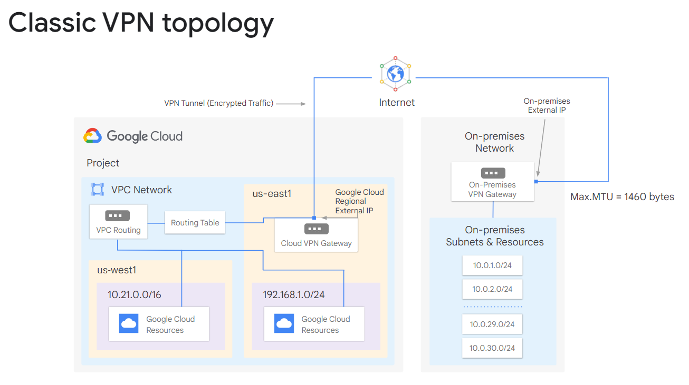
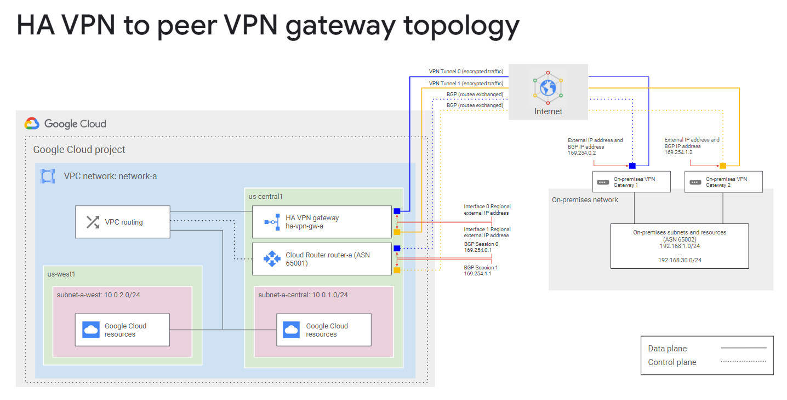
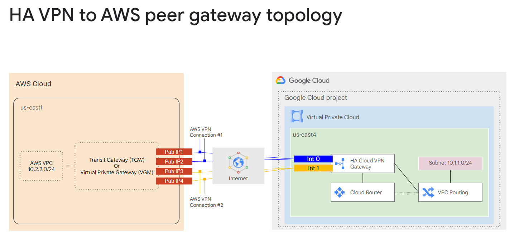
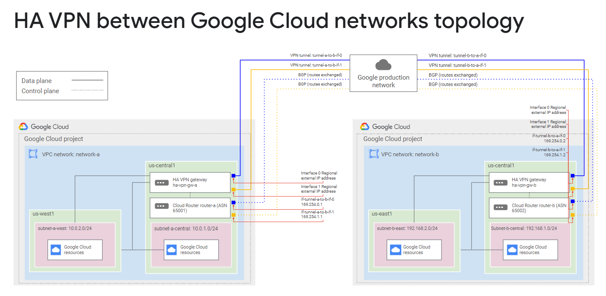
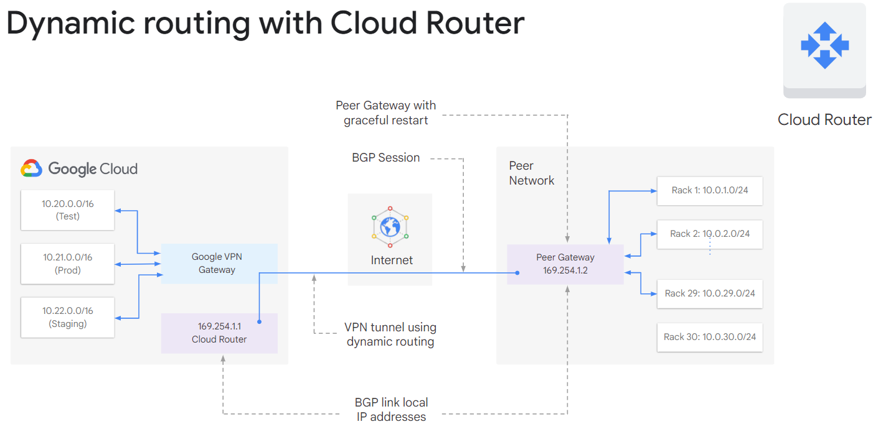

# 弹性 Google Cloud 基础设施：扩展和自动化
此加速点播课程向参与者介绍 Google Cloud 提供的全面且灵活的基础设施和平台服务。 通过视频讲座、演示和实践实验室的结合，参与者探索和部署解决方案元素，包括安全互连网络、负载平衡、自动扩展、基础设施自动化和托管服务。

# 课程信息
## 目标
* 将您的基础架构连接到 Google Cloud。
* 为虚拟机实例配置负载均衡器和自动缩放。
* 自动部署 Google Cloud 基础架构服务。
* 利用 Google Cloud 中的托管服务。

# 介绍
## 课程介绍
在本课程中，我们会先了解在网络之间建立互联的各种不同方案，让您可以将自己的基础架构连接到 Google Cloud。然后，我们将介绍 Google Cloud 的负载均衡和自动扩缩服务，您可以直接上手探索。接下来，我们会介绍 Terraform 等基础架构自动化服务，以便您自动部署 Google Cloud 基础架构服务。最后，让我们谈谈您可能需要使用的其他 Google Cloud 代管式服务。以下是本课程的各个单元：
1. 在网络之间建立互联
2. 负载均衡和自动扩缩
3. 基础架构自动化
4. 代管式服务

# 在网络之间建立互联
## 模块概览
在本单元中，我们将重点介绍 GCP 的混合连接产品，即 Cloud VPN、Cloud Interconnect 和 Peering。我们还将研究在 GCP 内共享 VPC 网络的选项。

## Cloud VPN
## Cloud VPN 将您的本地网络安全地连接到 Google Cloud VPC 网络
Cloud VPN 通过 IPsec VPN 隧道将您的本地网络安全地连接到 Google Cloud VPC 网络。两个网络之间传输的流量由一个 VPN 网关加密，然后由另一个 VPN 网关解密。这可以在您的数据通过公共互联网传输时对其进行保护，这就是 Cloud VPN 对于低容量数据连接非常有用的原因。

作为一项托管服务，Cloud VPN 提供 99.9% 服务可用性的 SLA，并支持站点到站点 VPN、静态和动态路由以及 IKEv1 和 IKEv2 密码。 Cloud VPN 不支持客户端计算机需要使用客户端 VPN 软件“拨入”VPN 的用例。此外，动态路由是通过 Cloud Router 配置的。

### 经典 VPN 拓扑
为了在两个 VPN 网关之间创建连接，您必须建立两个 VPN 隧道。每个隧道从其网关的角度定义连接，只有当隧道对建立后，流量才能通过。

> 使用 Cloud VPN 时要记住的一件事是，本地 VPN 网关的最大传输单元 (MTU) 不能大于 1460 字节。

### 高可用性 VPN
高可用性 VPN 到对等 VPN 网关拓扑

高可用性 VPN 到 AWS 对等网关拓扑

Google Cloud 网络拓扑之间的高可用性 VPN

要使用动态路由，您需要配置云端路由器。 Cloud Router 可以使用边界网关协议 (BGP) 管理 Cloud VPN 隧道的路由。这种路由方法允许在不更改隧道配置的情况下更新和交换路由。

## 实验室介绍：配置 Google Cloud 高可用性 VPN
略

## 