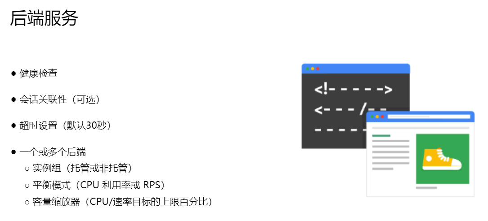

# 弹性 Google Cloud 基础设施：扩展和自动化
此加速点播课程向参与者介绍 Google Cloud 提供的全面且灵活的基础设施和平台服务。 通过视频讲座、演示和实践实验室的结合，参与者探索和部署解决方案元素，包括安全互连网络、负载平衡、自动扩展、基础设施自动化和托管服务。

# 课程信息
## 目标
* 将您的基础架构连接到 Google Cloud。
* 为虚拟机实例配置负载均衡器和自动缩放。
* 自动部署 Google Cloud 基础架构服务。
* 利用 Google Cloud 中的托管服务。

# 介绍
## 课程介绍
在本课程中，我们会先了解在网络之间建立互联的各种不同方案，让您可以将自己的基础架构连接到 Google Cloud。然后，我们将介绍 Google Cloud 的负载均衡和自动扩缩服务，您可以直接上手探索。接下来，我们会介绍 Terraform 等基础架构自动化服务，以便您自动部署 Google Cloud 基础架构服务。最后，让我们谈谈您可能需要使用的其他 Google Cloud 代管式服务。以下是本课程的各个单元：
1. 在网络之间建立互联
2. 负载均衡和自动扩缩
3. 基础架构自动化
4. 代管式服务

# 在网络之间建立互联
## 模块概览
在本单元中，我们将重点介绍 GCP 的混合连接产品，即 Cloud VPN、Cloud Interconnect 和 Peering。我们还将研究在 GCP 内共享 VPC 网络的选项。

## Cloud VPN
## Cloud VPN 将您的本地网络安全地连接到 Google Cloud VPC 网络
Cloud VPN 通过 IPsec VPN 隧道将您的本地网络安全地连接到 Google Cloud VPC 网络。两个网络之间传输的流量由一个 VPN 网关加密，然后由另一个 VPN 网关解密。这可以在您的数据通过公共互联网传输时对其进行保护，这就是 Cloud VPN 对于低容量数据连接非常有用的原因。

作为一项托管服务，Cloud VPN 提供 99.9% 服务可用性的 SLA，并支持站点到站点 VPN、静态和动态路由以及 IKEv1 和 IKEv2 密码。 Cloud VPN 不支持客户端计算机需要使用客户端 VPN 软件“拨入”VPN 的用例。此外，动态路由是通过 Cloud Router 配置的。

### 经典 VPN 拓扑
为了在两个 VPN 网关之间创建连接，您必须建立两个 VPN 隧道。每个隧道从其网关的角度定义连接，只有当隧道对建立后，流量才能通过。

> 使用 Cloud VPN 时要记住的一件事是，本地 VPN 网关的最大传输单元 (MTU) 不能大于 1460 字节。

### 高可用性 VPN
高可用性 VPN 是一种高可用性云 VPN 解决方案，可让您通过单个区域中的 IPsec VPN 连接将本地网络安全地连接到虚拟私有云 (VPC) 网络。高可用性 VPN 提供 99.99% 服务可用性的 SLA。为了保证高可用性 VPN 连接的 99.99% 可用性 SLA，您必须正确配置从高可用性 VPN 网关到对等 VPN 网关或另一个高可用性 VPN 网关的两个或四个隧道。

---

高可用性 VPN 到对等 VPN 网关拓扑

高可用性 VPN 到 AWS 对等网关拓扑

Google Cloud 网络拓扑之间的高可用性 VPN

要使用动态路由，您需要配置云端路由器。 Cloud Router 可以使用边界网关协议 (BGP) 管理 Cloud VPN 隧道的路由。这种路由方法允许在不更改隧道配置的情况下更新和交换路由。

## 实验室介绍：配置 Google Cloud 高可用性 VPN
略

## 配置 Google Cloud 高可用性 VPN
### 概览
高可用性 VPN 是一种高可用性 (HA) Cloud VPN 解决方案，可让您在单个区域中通过 IPsec VPN 连接将您的本地网络安全地连接到 VPC 网络。高可用性 VPN 提供服务可用性达 99.99% 的服务等级协议 (SLA)。

高可用性 VPN 是一种可为各个 VPC 网络添加的区域级 VPN 解决方案。高可用性 VPN 网关有两个接口，每个接口都有自己的公共 IP 地址。创建高可用性 VPN 网关时，系统会自动从不同的地址池中选择两个公共 IP 地址。在为高可用性 VPN 配置两个隧道后，Cloud VPN 可以提供服务可用性达 99.99% 的正常运行时间。

在本实验中，您将创建一个名为 vpc-demo 的全局性 VPC，其中包含位于 us-east1 和 us-central1 两个区域的两个自定义子网。在此 VPC 中，您将在每个区域添加一个 Compute Engine 实例。然后创建名为 on-prem 的第二个 VPC 来模拟客户的本地数据中心。在第二个 VPC 中，您将在 us-central1 区域中添加一个子网和一个在该区域运行的 Compute Engine 实例。最后，您将在每个 VPC 中添加一个高可用性 VPN 和一个 Cloud Router 路由器，并从每个高可用性 VPN 网关运行两个隧道，然后再测试该配置能否达到服务等级协议 (SLA) 承诺的 99.99% 的可用性。

### 目标
在本实验中，您将学习如何执行以下任务：
* 创建两个 VPC 网络和多个实例。
* 配置高可用性 VPN 网关。
* 使用 VPN 隧道配置动态路由。
* 配置全局动态路由模式。
* 验证并测试高可用性 VPN 网关的配置。

### 设置和要求
略

### 任务 1. 设置全局 VPC 环境
* 设置一个全局 VPC 和自定义子网并创建防火墙规则。
* 配置虚拟机

### 任务 2. 设置模拟的本地环境
* 设置一个全局 VPC 和自定义子网并创建防火墙规则。
* 配置虚拟机

### 任务 3. 设置高可用性 VPN 网关
* 创建高可用性 VPN 网关
* 创建 Cloud Router 路由器

### 任务 4. 创建两个 VPN 隧道
* 在 Cloud VPN 网关上创建高可用性 VPN 隧道

### 任务 5. 为每个隧道创建边界网关协议 (BGP) 对等互联
略

### 任务 6. 验证路由器配置
* 验证两个 VPC 中的路由器配置。配置防火墙规则以允许各个 VPC 之间传递流量，并验证隧道的状态。您还要验证各个 VPC 之间的 VPN 专用连接，并为 VPC 启用全局路由模式。

### 任务 7. 验证并测试高可用性 VPN 隧道的配置
略

### 任务 8. （可选）清理实验环境
略

### 任务 9. 回顾
在本实验中，您配置了高可用性 VPN 网关。您还使用 VPN 隧道配置了动态路由，并配置了全局动态路由模式。最后，您通过验证确认了高可用性 VPN 已配置且运行正常。

## 云互连和对等互连
有不同的云互连和对等服务可用于将您的基础设施连接到 Google 网络。这些服务可以分为专用连接与共享连接以及第 2 层连接与第 3 层连接。这些服务包括直接对等互连、运营商对等互连、专用互连和合作伙伴互连。

专用连接提供与 Google 网络的直接连接，但共享连接通过合作伙伴提供与 Google 网络的连接。第 2 层连接使用直接连接到 GCP 环境的 VLAN，提供与 RFC 1918 地址空间中的内部 IP 地址的连接。第 3 层连接允许使用公共 IP 地址访问 Google Workspace 服务、YouTube 和 Google Cloud API。

现在，正如我之前解释的那样，Google 还提供自己的虚拟专用网络服务，称为 Cloud VPN。该服务使用公共互联网，但流量经过加密并提供对内部 IP 地址的访问。这就是为什么 Cloud VPN 是直接对等互连和运营商对等互连的有用补充。

## 专用互连
专用互连在您的本地网络和 Google 网络之间提供直接物理连接。这使您能够在网络之间传输大量数据，这比通过公共互联网购买额外的带宽更具成本效益。

为了使用专用互连，您需要在通用主机托管设施中在 Google 网络和您自己的路由器之间配置交叉连接，如下图所示。要在网络之间交换路由，您可以通过 Cloud Router 和本地路由器之间的互连配置 BGP 会话。这将允许来自本地网络的用户流量到达 VPC 网络上的 GCP 资源，反之亦然。

> 为了使用专用互连，您的网络必须在受支持的托管设施中与 Google 网络进行物理连接。“我根本不靠近这些地点之一”这时您就需要考虑合作伙伴互连。

### 合作伙伴互连

### 互连选项比较

## 对等互联

## 选择连接

## 共享 VPC 网络
### 共享 VPC，它允许您在 GCP 组织中的多个项目之间共享网络
共享 VPC 允许组织将多个项目的资源连接到公共 VPC 网络。这允许资源使用来自该网络的内部 IP 安全有效地相互通信。  
当您使用共享 VPC 时，您可以将一个项目指定为宿主项目，并将一个或多个其他服务项目附加到该项目。

### VPC 网络对等互连，它允许您在相同或不同组织中的项目之间配置私有通信
VPC 网络对等互连允许跨两个 VPC 网络进行私有 RFC 1918 连接，无论它们是否属于同一项目或同一组织。而且每个 VPC 网络都将具有防火墙规则，用于定义网络之间允许或拒绝哪些流量。  
VPC 网络对等互连是一种去中心化或分布式的多项目网络方法，因为每个 VPC 网络可能仍处于单独管理员组的控制之下，并维护自己的全局防火墙和路由表。  
VPC 网络对等互连不会产生使用外部 IP 地址或 VPN 时存在的网络延迟、安全性和成本缺陷。

### 共享 VPC 与 VPC 对等互连
如果您想在不同组织的 VPC 网络之间配置私有通信，则必须使用 VPC 网络对等互连。共享 VPC 仅在同一组织内工作。  

两种配置之间最大的区别在于网络管理模型。共享 VPC 是多项目网络的集中式方法，因为安全和网络策略发生在单个指定的 VPC 网络中。相比之下，VPC 网络对等互连是一种去中心化方法，因为每个 VPC 网络都可以处于单独管理员组的控制之下，并维护自己的全局防火墙和路由表。

## 模块回顾
在本模块中，我们研究了将基础设施连接到 GCP 的五种不同方式，它们是专用互连、合作伙伴互连、云 VPN、直接对等互连和运营商对等互连。我还为您提供了一些有关如何在不同服务之间进行选择的指导。  
我还简要概述了共享 VPC 和 VPC 网络对等互连，这是跨 GCP 项目共享 VPC 网络的两种配置。

# 负载均衡和自动缩放
为虚拟机实例配置负载均衡器和自动缩放

## 模块概览
Cloud Load Balancing 使您能够在单个或多个区域中分配负载平衡的计算资源，以满足您的高可用性要求，将您的资源置于单个任播 IP 地址后面，并通过智能自动扩展来扩展或缩减您的资源。  
Cloud Load Balancing 是一种完全分布式、软件定义的托管服务。它不是基于实例或基于设备的，因此您不需要管理物理负载平衡基础设施。

---

Google Cloud 提供不同类型的负载均衡器，可分为两类：全球负载均衡器和区域负载均衡器。
* 全局负载均衡器包括 HTTP(S)、SSL 代理和 TCP 代理负载均衡器。这些负载均衡器利用 Google 前端，这是软件定义的分布式系统，位于 Google 的存在点并分布在全球范围内。
* 区域负载均衡器是外部和内部 HTTP(S) 以及 TCP 代理。还有内部 TCP/UDP 和外部 TCP/UDP 网络负载均衡器。内部和网络负载均衡器将流量分配到单个 Google Cloud 区域中的实例。

> HTTP(S) 流量的内部负载均衡器是基于代理的区域第 7 层负载均衡器，使您能够在私有负载均衡 IP 地址后面运行和扩展服务，该地址只能在 VPC 网络中的负载均衡器区域中访问。

## 托管实例组
托管实例组是您使用实例模板将其作为单个实体进行控制的相同 VM 实例的集合。您可以通过在滚动更新中指定新模板来轻松更新组中的所有实例。此外，当您的应用程序需要额外的计算资源时，托管实例组可以自动扩展组中的实例数量。  
托管实例组可以与负载平衡服务配合使用，将网络流量分配到组中的所有实例。如果组中的实例停止、崩溃或被实例组命令以外的操作删除，托管实例组会自动重新创建该实例，以便它可以恢复其处理任务。重新创建的实例使用与之前的实例相同的名称和相同的实例模板。托管实例组可以自动识别并重新创建组中不健康的实例，以确保所有实例都以最佳状态运行。  
通常建议使用区域托管实例组而不是区域托管实例组，因为区域托管实例组允许您将应用程序负载分散到多个区域，而不是将应用程序限制在单个区域，或者您必须跨不同区域管理多个实例组。此复制可以防止区域故障和单个区域中的整个实例组发生故障的不可预见的情况。如果发生这种情况，您的应用程序可以继续为同一区域的另一个区域中运行的实例提供流量。  

为了创建托管实例组，您首先需要创建实例模板。接下来，您将创建一个由 n 个指定实例组成的托管实例组。然后，实例组管理器会根据实例模板自动填充实例组。

* 首先，决定您要创建哪种类型的托管实例组。您可以将托管实例组用于无状态服务或批量工作负载（例如网站前端或队列中的图像处理），或者用于有状态应用程序（例如数据库或旧应用程序）。
* 其次提供实例组的名称。
* 第三，决定实例组是单区域还是多区域，以及这些位置的位置。您可以选择提供端口名称映射详细信息。
* 第四，选择您要使用的实例模板。
* 第五，决定是否要自动缩放以及在什么情况下进行。
* 最后，考虑创建运行状况检查以确定哪些实例运行状况良好并且应该接收流量。

## 自动扩缩和健康检查
托管实例组提供自动扩展功能，允许您根据负载的增加或减少自动在托管实例组中添加或删除实例。自动缩放可帮助您的应用程序优雅地处理流量的增加，并在资源需求较低时降低成本。  
您只需定义自动伸缩策略，自动伸缩器就会根据测量到的负载执行自动伸缩。适用的自动扩展策略包括基于 CPU 利用率、负载平衡容量或监控指标的扩展，或者基于 Cloud Pub/Sub 等基于队列的工作负载的扩展。

### 创建健康检查
健康标准定义了检查实例是否健康的频率（即检查间隔）；等待响应的时间（即超时）；有多少成功的尝试是决定性的（这是健康的阈值）；以及有多少失败的尝试是决定性的（这是不健康的阈值）。

## HTTP load balancing 概览
HTTP(S) 负载平衡，它作用于 OSI 模型的第 7 层。这是应用程序层，它处理每条消息的实际内容，允许根据 URL 做出路由决策。  

GCP 的 HTTP(S) 负载平衡为发往您的实例的 HTTP(S) 请求提供全局负载平衡。这意味着您的客户可以通过单个任播 IP 地址使用您的应用程序，从而简化您的 DNS 设置。 HTTP(S) 负载均衡可跨多个后端实例和跨多个区域平衡 HTTP 和 HTTPS 流量。  
HTTP 请求在端口 80 或 8080 上进行负载均衡，HTTPS 请求在端口 443 上进行负载均衡。  
该负载均衡器支持 IPv4 和 IPv6 客户端，具有可扩展性，无需预热，并支持基于内容的跨区域负载均衡。  
您可以配置 URL 映射，将某些 URL 路由到一组实例，并将其他 URL 路由到其他实例。请求通常会路由到距离用户最近的实例组。如果最近的实例组没有足够的容量，则请求将发送到下一个最近且有容量的实例组。

* 全局转发规则将来自 Internet 的传入请求定向到目标 HTTP 代理。
* 目标 HTTP 代理根据 URL 映射检查每个请求，以确定该请求的适当后端服务。
* 后端服务根据其附加后端的服务容量、区域和实例运行状况将每个请求定向到适当的后端。

后端服务包含健康检查、会话亲和性、超时设置以及一个或多个后端。

## 举例：HTTP load balancer

* 首先，全局转发规则将传入请求定向到目标 HTTP 代理。代理检查 URL 映射以确定适合该请求的后端服务。
* 当用户请求传入时，负载平衡服务会根据源 IP 地址确定请求的大致来源。负载均衡服务还知道后端服务拥有的实例的位置、它们的总体容量以及它们的总体当前使用情况。因此，如果最接近用户的实例具有可用容量，则请求将转发到最接近的一组实例。
* 如果给定区域中没有具有可用容量的健康实例，负载均衡器会将请求发送到下一个最近的具有可用容量的区域。这称为跨区域负载均衡。

HTTP 负载均衡器的另一个示例是基于内容的负载均衡器。负载均衡器根据 URL 映射中指定的 URL 标头分割流量。

## HTTPS load balancing
HTTP(S) 负载均衡器与 HTTP 负载均衡器具有相同的基本结构，但在以下方面有所不同：
* HTTP(S) 负载均衡器使用目标 HTTPS 代理而不是目标 HTTP 代理。
* HTTP(S) 负载均衡器需要在负载均衡器的目标 HTTPS 代理上安装至少一个签名的 SSL 证书。
* 客户端 SSL 会话在负载均衡器处终止。
* HTTP(S) 负载均衡器支持 QUIC 传输层协议。
> QUIC 是一种传输层协议，它允许更快的客户端连接启动，消除多路复用流中的队头阻塞，并支持客户端 IP 地址更改时的连接迁移

外部 HTTP(S) 负载均衡器使用 URL 映射将流量从指定 URL 定向到后端服务或后端存储桶。

---

网络端点组 (NEG) 是指定一组后端端点或服务的配置对象。此配置的一个常见用例是在容器中部署服务。您还可以以精细的方式将流量分配到后端实例上运行的应用程序。
* 可用区 NEG 包含一个或多个端点，这些端点可以是 Compute Engine 虚拟机或在虚拟机上运行的服务。每个端点由 IP 地址或 IP:端口组合指定。
* 互联网 NEG 包含托管在 Google Cloud 外部的单个端点。该端点由主机名 FQDN:port 或 IP:port 指定。
* 混合连接 NEG 指向在 Google Cloud 外部运行的 Traffic Director 服务。
* 无服务器 NEG 指向与 NEG 位于同一区域的 Cloud Run、App Engine、Cloud Functions 服务。

## 实验室介绍：配置具有自动缩放功能的 HTTP 负载均衡器

## 实验：配置可自动扩缩的 HTTP 负载均衡器
### 概览
Google Cloud HTTP(S) 负载均衡是在全球 Google 接入点 (POP) 的 Google 网络边缘处实施的。定向到 HTTP(S) 负载均衡器的用户流量会进入距离用户最近的 POP，然后在 Google 全球网络上进行负载均衡，传输到具有足够可用容量的最近后端。

### 任务 1. 配置健康检查防火墙规则
> 健康检查可确定负载均衡器的哪些实例能接收新的连接。在 HTTP 负载均衡的过程中，对负载均衡实例的健康检查探测来自于 130.211.0.0/22 和 35.191.0.0/16 范围内的地址。您的防火墙规则必须允许这些连接。

### 任务 2. 使用 Cloud Router 创建 NAT 配置
设置 Cloud NAT 服务让虚拟机实例仅通过 Cloud NAT 发送出站流量，并通过负载均衡器接收入站流量。

### 任务 3. 为 Web 服务器创建一个自定义映像
为负载均衡器的后端创建一个自定义 Web 服务器映像。
* 创建虚拟机
* 自定义虚拟机
* 将 Apache 服务设置为在虚拟机启动时启动
* 准备磁盘以创建自定义映像
* 创建自定义映像

### 任务 4. 配置实例模板并创建实例组
代管式实例组可使用实例模板来创建一组相同的实例。您可以使用这些实例来创建 HTTP 负载均衡器的后端。
* 配置实例模板
* 为代管式实例组创建健康检查
* 创建代管式实例组

### 任务 5. 配置 HTTP 负载均衡器
* 配置前端
* 配置后端
* 检查并创建 HTTP 负载均衡器

> HTTP(S) 负载均衡支持使用 IPv4 和 IPv6 地址来路由客户端流量。客户端 IPv6 请求会在全球负载均衡层终止，然后通过 IPv4 代理传输到您的后端。

### 任务 6. 对 HTTP 负载均衡器进行压力测试
略

### 任务 7. 回顾
略

## Cloud CDN
Cloud CDN（Content Delivery Network）（内容分发网络）使用 Google 的全球分布式边缘存在点来缓存靠近用户的 HTTP(S) 负载平衡内容。  
Cloud CDN 在 Google 网络边缘缓存内容，可以更快地向用户交付内容，同时降低服务成本。  
在设置 HTTP(S) 负载均衡器的后端服务时，您可以通过简单的复选框启用 Cloud CDN。

可用的缓存模式有 USE_ORIGIN_HEADERS、CACHE_ALL_STATIC 和 FORCE_CACHE_ALL。
* USE_ORIGIN_HEADERS 模式需要源响应来设置有效的缓存指令和有效的缓存标头。
* CACHE_ALL_STATIC 模式自动缓存没有 no-store、private 或 no-cache 指令的静态内容。设置有效缓存指令的源响应也会被缓存。
* FORCE_CACHE_ALL 模式无条件缓存响应，覆盖源设置的任何缓存指令。如果使用配置了此模式的共享后端，您应该确保不要缓存私有的、每用户的内容（例如动态 HTML 或 API 响应）。

## SSL Proxy/TCP Proxy Load Balancing
SSL 代理是针对加密的非 HTTP 流量的全局负载平衡服务。此负载均衡器在负载均衡层终止用户 SSL 连接，然后使用 SSL 或 TCP 协议平衡实例之间的连接。这些实例可以位于多个区域，负载均衡器会自动将流量定向到具有容量的最近区域。

TCP 代理是针对未加密的非 HTTP 流量的全局负载平衡服务。此负载均衡器在负载均衡层终止客户的 TCP 会话，然后使用 TCP 或 SSL 将流量转发到您的虚拟机实例。这些实例可以位于多个区域，负载均衡器会自动将流量定向到具有容量的最近区域。

## Network Load Balancing
网络负载均衡是一种区域性、非代理负载均衡服务。换句话说，所有流量都通过负载均衡器传递，而不是被代理，并且流量只能在同一区域中的虚拟机实例之间进行平衡，这与全局负载均衡器不同。

此负载平衡服务根据传入的 IP 协议数据（例如地址、端口和协议类型）使用转发规则来平衡系统上的负载。您可以使用它对 UDP 流量进行负载平衡，并在 TCP 代理和 SSL 代理负载平衡器不支持的端口上对 TCP 和 SSL 流量进行负载平衡。

网络负载均衡器的架构取决于您使用的是基于后端服务的网络负载均衡器还是基于目标池的网络负载均衡器。
* 可以使用区域后端服务创建新的网络负载均衡器，该服务定义负载均衡器的行为以及它如何将流量分配到其后端实例组。
* 目标池资源定义一组从转发规则接收传入流量的实例。当转发规则将流量定向到目标池时，负载均衡器会根据源 IP 和端口以及目标 IP 和端口的哈希值从这些目标池中选择一个实例。这些目标池只能与处理 TCP 和 UDP 流量的转发规则一起使用。

## Internal Load Balancing
内部 TCP/UDP 负载平衡器是针对基于 TCP 和 UDP 的流量的区域专用负载平衡服务。换句话说，此负载均衡器使您能够在私有负载均衡 IP 地址后面运行和扩展服务。这意味着它只能通过同一区域中的虚拟机实例的内部 IP 地址进行访问。

> Google Cloud 内部负载平衡不基于设备或虚拟机实例。相反，它是一个软件定义的、完全分布式的负载平衡解决方案。

> 内部负载平衡使您能够支持传统的 3 层 Web 服务

## 实验简介：配置内部负载均衡器
在本实验中，您将在同一区域中创建两个托管实例组。然后，您使用实例组作为后端来配置和测试内部负载均衡器。

## 实验：配置内部负载均衡器
### 概览
Google Cloud 为基于 TCP/UDP 的流量提供内部负载均衡功能。借助内部负载均衡功能，您可以通过一个专用负载均衡 IP 地址（只能由内部虚拟机实例访问）运行和扩缩您的服务。

在本实验中，您将学习如何执行以下任务：
* 创建内部流量和健康检查防火墙规则。
* 使用 Cloud Router 创建 NAT 配置。
* 配置两个实例模板。
* 创建两个代管式实例组。
* 配置和测试内部负载均衡器。

### 设置和要求
略

### 任务 1. 配置内部流量和健康检查防火墙规则
配置防火墙规则以允许来自 10.10.0.0/16 范围内来源的内部流量连接。此规则允许来自该子网的任何客户端的传入流量。

健康检查可确定负载均衡器的哪些实例能接收新连接。在 HTTP 负载均衡的过程中，对负载均衡实例的健康检查探测来自于 130.211.0.0/22 和 35.191.0.0/16 范围内的地址。您的防火墙规则必须允许这些连接。

### 任务 2. 使用 Cloud Router 创建 NAT 配置
略

### 任务 3：配置实例模板并创建实例组
略

### 任务 4：配置内部负载均衡器
* 开始配置
* 配置区域级后端服务
* 配置前端

### 任务 5：测试内部负载均衡器
* 多次访问内部负载均衡器

## 实验回顾：配置内部负载均衡器
略

## IPv6 终止于负载平衡

不同 Google Cloud 负载均衡器之间的区别之一是对 IPv6 客户端的支持。仅HTTP(S)、SSL代理和TCP代理负载均衡服务支持IPv6客户端。这些负载均衡器的 IPv6 终止使您能够处理来自用户的 IPv6 请求，并通过 IPv4 将它们代理到后端。  
在反向路径上，负载均衡器从后端接收 IPv4 响应，并将其放入返回原始客户端的 IPv6 连接中。

## 回顾：负载均衡和自动缩放
略