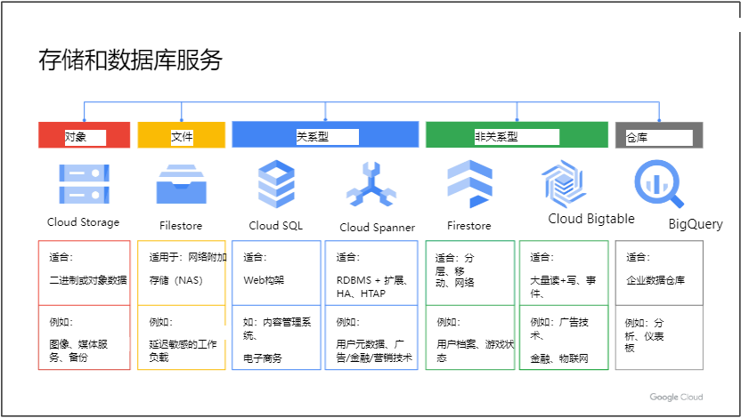
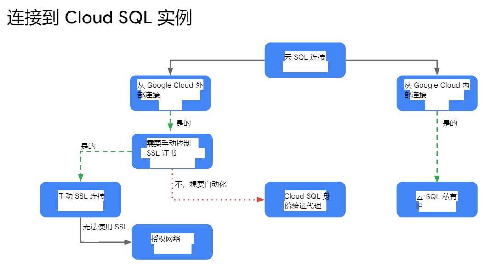

# 基本的 Google Cloud 基础设施：核心服务
此加速点播课程向参与者介绍 Google Cloud 提供的全面且灵活的基础设施和平台服务，重点是 Compute Engine。 通过视频讲座、演示和实践实验室的结合，参与者探索和部署解决方案元素，包括网络、系统和应用服务等基础设施组件。 本课程还涵盖部署实用解决方案，包括客户提供的加密密钥、安全和访问管理、配额和计费以及资源监控。

# 课程信息
## 目标
* 管理资源的身份和访问管理。
* 在 Google Cloud 中实施数据存储服务
* 管理和检查 Google Cloud 资源的计费。
* 使用 Google Cloud 操作套件监控资源

# 介绍
在本模块中，我们将介绍“使用 Google Compute Engine 进行架构设计”课程系列。 本课程系列专为云解决方案架构师、DevOps 工程师以及任何有兴趣使用 Google Cloud 创建新解决方案或集成现有系统、应用程序环境和基础设施（重点关注 Compute Engine）的人员而设计。

## 课程介绍
本课程以“基本云基础架构：基础知识”课程为基础，带您进一步了解 Compute Engine 架构设计。在此课程中，我们会先介绍 Identity and Access Management (IAM)，您将通过 IAM 管理资源。  
然后，我们将介绍 Google Cloud 的各种数据存储服务，您将使用其中一些服务。接下来，我们会介绍资源管理，您将学习管理和检查 Google Cloud 资源的结算。最后，我们来学习资源监控，您将使用 Google Cloud 的运维套件监控 Google Cloud 资源。以下是本课程的各个单元：
1. Identity and Access Management (IAM)
2. 数据存储服务
3. 资源管理
4. 资源监控

# 身份和访问管理 (IAM)
管理资源的身份和访问管理

## 模块概述
在本模块中，我们将介绍云身份和访问管理或云 IAM。我首先从高层次的角度介绍一下Cloud IAM。然后，我们将深入探讨 Cloud IAM 中的每个组件，即组织、角色、成员和服务帐户。我还将介绍一些最佳实践，帮助您在日常工作中应用这些概念。最后，您将通过实验室获得 Cloud IAM 的第一手经验。

## 身份和访问管理
那么什么是身份访问管理呢？它是一种识别谁可以在哪个资源上执行什么操作的方法。谁可以是个人、团体或应用程序。 “什么”指的是特定权限或操作，资源可以是任何 Google Cloud 服务。

组织节点是此层次结构中的根节点，文件夹是组织的子节点，项目是文件夹的子节点，各个资源是项目的子节点。每个资源只有一个父资源。  
组织资源代表您的公司。在此级别授予的 IAM 角色将由组织下的所有资源继承。文件夹资源可以代表您的部门。在此级别授予的 IAM 角色将由该文件夹包含的所有资源继承。  
项目代表了公司内部的信任边界。同一项目内的服务具有相同的默认信任级别。

## 组织
组织资源是 GCP 资源层次结构中的根节点。

当拥有 Workspace 或 Cloud Identity 帐号的用户创建 Google Cloud 项目时，系统会自动为其配置组织资源。然后，Google Cloud 会将其可用性传达给 Workspace 或 Cloud Identity 超级管理员

文件夹提供了额外的分组机制和项目之间的隔离边界。文件夹可用于对公司内不同的法人实体、部门和团队进行建模。

策略是从上到下继承的。

## 角色
Cloud IAM 中的角色分为三种类型：基本角色、预定义角色和自定义角色。  
基本角色是 Cloud Console 中提供的原始角色，但范围很广。您将它们应用到 Google Cloud 项目，它们会影响该项目中的所有资源。

---

IAM 基本角色提供固定的、粗粒度的访问级别。
基本角色是所有者、编辑者和查看者角色。
* 所有者拥有完全的管理访问权限。这包括添加和删除成员以及删除项目的能力。
* 编辑者角色具有修改和删除权限。这允许开发人员部署应用程序并修改或配置其资源。
* 查看者角色具有只读访问权限。

所有这些角色都是同心的；即Owner角色包含Editor角色的权限，Editor角色包含Viewer角色的权限。  
还有一个计费管理员角色，用于管理计费以及添加或删除管理员，而无权更改项目中的资源。

---

GCP 服务提供自己的一组预定义角色，并定义可以应用这些角色的位置。这为成员提供了对特定 GCP 资源的精细访问权限，并防止对其他资源进行不必要的访问。

---

这就是自定义角色所允许的。许多公司使用“最小权限”模型，在该模型中，组织中的每个人都被授予完成其工作所需的最小权限。

## 实例: 创建自定义角色
略

## 成员
有五种不同类型的成员：Google 帐号、服务帐号、Google 群组、Google Workspace 网域和 Cloud Identity 网域。  
* Google 帐户代表开发者、管理员或与 Google Cloud 交互的任何其他人。与 Google 帐户关联的任何电子邮件地址都可以是一个身份，包括 gmail.com 或其他域。
* 服务帐户是属于您的应用程序而不是单个最终用户的帐户。当您运行 Google Cloud 上托管的代码时，您可以指定运行该代码所使用的帐号。您可以根据需要创建任意数量的服务帐户来表示应用程序的不同逻辑组件。
* Google 群组是 Google 帐户和服务帐户的命名集合。每个组都有一个与该组关联的唯一电子邮件地址。 Google 群组是将访问策略应用于一组用户的便捷方式。您可以一次授予和更改整个组的访问控制，而不是一次为单个用户或服务帐户授予或更改访问控制。
* Workspace 域代表在组织的 Workspace 帐户中创建的所有 Google 帐户的虚拟组。 Workspace 域代表您组织的互联网域名，例如 example.com，当您将用户添加到 Workspace 域时，系统会为该用户创建一个新的 Google 帐户。
* 非 Workspace 客户的 Google Cloud 客户可以通过 Cloud Identity 获得这些相同的功能。 Cloud Identity 允许您使用 Google 管理控制台管理用户和群组，但您无需付费或接收 Workspace 协作产品，例如 Gmail、文档、云端硬盘和日历。
* 您无法使用 IAM 来创建或管理您的用户或组。相反，您可以使用 Cloud Identity 或 Workspace 来创建和管理用户。

---

策略由绑定列表组成。绑定将成员列表绑定到角色，角色是由 IAM 定义的命名权限列表。

---

您可以使用附加到资源的允许政策（也称为身份和访问管理 (IAM) 政策）授予对 GCP 资源的访问权限。  
允许策略控制对资源本身以及继承允许策略的该资源的任何后代的访问。  
允许策略将一个或多个委托人（也称为成员或身份）与单个 IAM 角色以及更改授予角色的方式和时间的任何特定于上下文的条件关联或绑定。

---

当委托人被拒绝授予权限时，无论他们被授予什么 IAM 角色，他们都无法执行任何需要该权限的操作。这是因为 IAM 始终在检查相关允许策略之前检查相关拒绝策略。

---

IAM 条件允许您为 GCP 资源定义和实施基于属性的条件访问控制。

---

组织策略是限制的配置，通过使用该组织所需的限制配置约束来定义。组织策略可以应用于组织节点以及该节点内的所有文件夹或项目。目标资源层次结构节点的后代继承已应用于其父代的组织策略。这些策略可以例外，但只能由具有组织策略管理员角色的用户执行。

---

如果您已经有不同的公司目录怎么办？如何让您的用户和群组加入 Google Cloud？  
通过 Google Cloud Directory Sync，您的管理员可以使用他们已使用的相同用户名和密码登录并管理 Google Cloud 资源。此工具可将现有 Active Directory 或 LDAP 系统中的用户和群组与 Cloud Identity 网域中的用户和群组同步。  
同步仅是单向的；这意味着您的 Active Directory 或 LDAP 映射中的任何信息都不会被修改。 Google Cloud Directory Sync 旨在在设置同步规则后无需监督即可运行计划同步。

---

Google Cloud 还提供单点登录身份验证。  
如果您有自己的身份系统，则可以继续使用配置了 SSO 的自己的系统和流程。当需要用户身份验证时，Google 将重定向到您的系统。如果用户在您的系统中通过身份验证，则将获得对 Google Cloud 的访问权限；否则，系统会提示用户登录。

> 如果您想使用 Google 帐户但对通过 Gmail 接收邮件不感兴趣，您仍然可以创建一个不使用 Gmail 的帐户。

如果您想使用 Google 帐户但对通过 Gmail 接收邮件不感兴趣，您仍然可以创建一个不使用 Gmail 的帐户。

## 服务账号
服务帐户是属于您的应用程序而不是单个最终用户的帐户。这提供了在项目中执行服务器到服务器交互的身份，而无需提供用户凭据。

服务帐户分为三种类型：用户创建或自定义、内置和 Google API 服务帐户。
* 所有项目都附带内置的 Compute Engine 默认服务帐号。
* 所有项目都附带一个 Google Cloud API 服务帐户。
* 您也可以使用自定义服务帐户启动实例。自定义服务帐户比默认服务帐户提供更大的灵活性，但需要您进行更多管理。您可以根据需要创建任意数量的自定义服务账户，为其分配任意访问范围或 IAM 角色，并将服务账户分配给任何虚拟机实例。

## IAM 最佳实践
首先，利用并理解资源层次结构。
* 使用项目对共享相同信任边界的资源进行分组。
* 检查授予每个资源的策略并确保您识别继承。
* 由于继承的原因，在授予角色时使用“最小权限原则”。
* 最后，使用 Cloud Audit Logs 审核策略并审核策略中使用的组的成员资格。

将角色授予 Google 群组而不是个人。
* 这允许您更新组成员身份，而不是更改 IAM 策略。
* 审核策略中使用的组的成员身份。
* 控制IAM 策略中使用的Google 群组的所有权。

以下是使用服务帐户的一些最佳实践：
* 授予服务帐户用户角色时要非常小心，因为它提供对服务帐户有权访问的所有资源的访问权限。
* 当您创建服务帐户时，请为其指定一个清楚标识其用途的显示名称，最好使用已建立的命名约定。
* 对于密钥，建立密钥轮换策略和方法。

最后，我建议使用身份感知代理（IAP）。 IAP 允许您为通过 HTTPS 访问的应用程序建立中央授权层，因此您可以使用应用程序级访问控制模型，而不是依赖网络级防火墙。

## 实验室简介：探索 IAM
略

## 实验：探索 Google Cloud IAM
### 概览
略

### 目标
在本实验中，您将学习如何执行以下任务：
* 使用 IAM 实现访问权限控制
* 限制对特定功能或资源的访问权限
* 使用 Service Account User 角色

### 任务 1. 设置两位用户
略

### 任务 2. 浏览 IAM 控制台
略

### 任务 3. 准备资源以进行访问权限测试
略

### 任务 4. 移除项目访问权限
略

### 任务 5. 添加存储访问权限
略

### 任务 6. 设置 Service Account User 角色
您将为该用户授予 Service Account User 角色，这样该用户便可在自己有权访问的虚拟机中使用服务帐号。您可以为特定用户、组或网域执行此活动。

### 任务 7. 探索 Service Account User 角色
略

### 任务 8. 回顾
略

# 存储和数据库服务
在 Google Cloud 中实施数据存储服务

## 模块概述
此表显示存储和数据库服务，并突出显示存储服务类型（对象、文件、关系、非关系和数据仓库）、每个服务的用途以及预期用途。

---

这里有一个决策树可以帮助您确定最适合您的应用程序的解决方案。

## Cloud Storage
### 云存储主要功能
Cloud Storage 是 Google Cloud 的对象存储服务，它允许在全球范围内随时存储和检索任意数量的数据。您可以将云存储用于多种场景，包括提供网站内容、存储数据以进行归档和灾难恢复，或者通过直接下载向用户分发大型数据对象。

云存储有几个主要功能：
* 可扩展至 EB 级数据
* 第一个字节的时间以毫秒为单位
* 它在所有存储类别中都具有非常高的可用性
* 它有一个跨这些存储类别的 API

有些人喜欢将云存储视为文件系统中的文件，但它并不是真正的文件系统。相反，Cloud Storage 是您将对象放入其中的存储桶的集合。可以这么说，您可以创建目录，但实际上目录只是指向存储桶中不同对象的另一个对象。您将无法像在文件系统中那样轻松地索引所有这些文件。您只需拥有一个特定的 URL 即可访问对象。

### 存储类别概述
云存储有四种存储类别：标准、近线、冷线和存档，每个存储类别提供 3 种位置类型：
* 多区域是一个大的地理区域，例如美国，包含两个或多个地理位置。
* 双区域是一对特定的区域，例如芬兰和荷兰。
* 区域是一个特定的地理位置，例如伦敦。

> 存储在多区域或双区域中的对象具有地理冗余。

### 更改默认存储类别
当您将对象上传到存储桶时，除非您为该对象指定存储类别，否则该对象将被分配该存储桶的存储类别。您可以更改存储桶的默认存储类别，但无法将位置类型从区域更改为多区域/双区域，反之亦然。

您还可以更改存储桶中已存在的对象的存储类别，而无需将对象移动到其他存储桶或更改对象的 URL。设置每个对象的存储类别非常有用，例如，如果您想要保留存储桶中的对象，但不希望频繁访问该对象。在这种情况下，您可以通过将这些特定对象的存储类别更改为近线、冷线或存档存储来最大限度地降低成本。

### 访问控制
我们可以在项目中使用 IAM 来控制哪些单个用户或服务帐户可以查看存储桶、列出存储桶中的对象、查看存储桶中的对象名称或创建新存储桶。对于大多数用途，IAM 就足够了，并且角色可以从项目继承到存储桶再到对象。

访问控制列表或 ACL 提供更精细的控制。

为了进行更详细的控制，签名 URL 提供了一个加密密钥，可以对存储桶或对象进行限时访问。

最后，签名的策略文档通过确定具有签名 URL 的人可以上传什么类型的文件来进一步细化控制。

### ACL 访问控制列表
ACL 是一种机制，您可以使用它来定义谁有权访问您的存储桶和对象，以及他们拥有什么级别的访问权限。您可以为存储桶或对象创建的 ACL 条目的最大数量为 100。

每个 ACL 由一个或多个条目组成，这些条目由两条信息组成：
* 范围，定义谁可以执行指定的操作（例如，特定用户或用户组）。
* 权限，它定义可以执行哪些操作（例如，读取或写入）。

### 签名 URL
对于某些应用程序，授予任何用户都可以使用的限时访问令牌比使用基于帐户的身份验证来控制资源访问更容易、更高效。 （例如，当您不想要求用户拥有 Google 帐户时）。

签名 URL 允许您对 Cloud Storage 执行此操作。您创建一个 URL，授予对特定 Cloud Storage 资源的读取或写入访问权限，并指定访问权限何时到期。该 URL 使用与服务帐户关联的私钥进行签名。收到请求后，Cloud Storage 可以验证授予访问权限的 URL 是否是代表受信任的安全主体（在本例中为服务帐户）发出的，并将对该帐户的信任委托给 URL 的持有者。

## 云存储功能
* 客户提供的加密密钥(CSEK)，使用您自己的密钥而不是 Google 管理的密钥。
* 对象生命周期管理，自动删除或归档对象。
* 对象版本控制，维护对象的多个版本。
* 目录同步，将虚拟机目录与存储桶同步。
* 可以使用 Pub/Sub 为 Cloud Storage 配置对象更改通知。

> 在 Cloud Storage 中，对象是不可变的，这意味着上传的对象在其存储生命周期内不能更改。为了支持检索已删除或覆盖的对象，Cloud Storage 提供了对象版本控制功能。

### 对象生命周期管理策略指定要对满足特定规则的对象执行的操作
您可以为存储桶分配生命周期管理配置。配置是一组适用于存储桶中所有对象的规则。因此，当对象满足其中一项规则的条件时，Cloud Storage 会自动对该对象执行指定的操作。

> 对象检查以异步批次进行，因此可能不会立即应用规则。此外，生命周期配置的更新最多可能需要 24 小时才能生效。这意味着当您更改生命周期配置时，对象生命周期管理仍可能根据旧配置执行操作长达 24 小时。所以记住这一点。

### 数据导入服务
Cloud Console 允许您将单个文件上传到您的存储桶。但是，如果您必须上传 TB 甚至 PB 的数据怎么办？有三种服务可以解决此问题：Transfer Appliance、Storage Transfer Service 和 Offline Media Import。
* Transfer Appliance 是一种硬件设备，可用于将大量数据（从数百 TB 到 1 PB）安全迁移到 Google Cloud，而不会中断业务运营。这张幻灯片上的图像是传输设备。
* Storage Transfer Service 可实现在线数据的高性能导入。该数据源可以是另一个 Cloud Storage 存储桶、Amazon S3 存储桶或 HTTP/HTTPS 位置。
* Offline Media Import 是一项第三方服务，其中物理媒体（例如存储阵列、硬盘驱动器、磁带和 USB 闪存驱动器）被发送给上传数据的提供商。

### 云存储提供强大的全局一致性

## 选择存储类别

您还需要考虑位置类型：
* 使用区域可以帮助优化分组在同一区域中的数据使用者（例如分析管道）的延迟和网络带宽。
* 当您想要与区域类似的性能优势，但又希望通过异地冗余获得更高的可用性时，请使用双区域。
* 当您想要向 Google 网络之外且分布在较大地理区域的数据使用者提供内容时，请使用多区域。

## Firestore
### Filestore 是应用程序的托管文件存储服务
Filestore 是一种托管文件存储服务，适用于需要文件系统接口和共享数据文件系统的应用程序。

Filestore 为用户提供了简单、原生的体验，让他们能够通过 Compute Engine 和 Google Kubernetes Engine 实例建立托管网络附加存储 (NAS)。

### 文件存储有很多用例
* 使用 Filestore，您可以加快企业应用程序的迁移。许多本地应用程序需要数据的文件系统接口。随着这些应用程序不断迁移到云，Filestore 可以支持需要共享文件系统的各种企业应用程序。
* 对于媒体渲染，您可以轻松地将 Filestore 文件共享挂载到 Compute Engine 实例上，从而能够在同一文件共享上进行协作。
* 电子设计自动化 (EDA) 就是数据管理。它需要能够跨数千个核心批量处理工作负载，并且需要大量内存。 Filestore 提供必要的容量和规模，以满足进行密集型 EDA 的制造客户的需求，并确保文件可供普遍访问。
* 数据分析工作负载包括计算复杂的财务模型或环境数据分析。
* 分析需要速度、可扩展性和安全性。Filestore 满足进行科学研究的公司和研究机构的需求，同时还提供可预测的性能价格。
* Web 开发人员和大型托管提供商也依赖 Filestore 来管理和提供 Web 内容，包括 WordPress 托管等需求。

## 实验室简介: 云存储
在本实验中，您将创建存储桶并执行 Cloud Storage 中提供的许多高级选项。
* 您将设置访问控制列表来限制谁可以访问您的数据以及他们可以使用这些数据执行哪些操作。
* 您将使用提供和管理自己的加密密钥的功能来提高安全性。
* 您将启用对象版本控制来跟踪数据更改，并配置生命周期管理，以便在指定时间段后自动存档或删除对象。
* 最后，您将使用我提到的目录同步功能，并使用 Cloud IAM 在项目之间共享您的存储桶。

## 实验：云存储
### 概览
略

### 目标
在本实验中，您将学习如何执行以下任务：
* 创建并使用存储桶
* 设置访问控制列表来限制访问权限
* 使用您自己的加密密钥
* 实现版本控制
* 使用目录同步功能
* 使用 IAM 在各个项目之间共享存储桶

### 任务 1. 准备工作
略

### 任务 2. 访问控制列表 (ACL)
略

### 任务 3. 客户提供的加密密钥 (CSEK)
略

### 任务 4. 轮替 CSEK 密钥
略

### 任务 5. 启用生命周期管理
略

### 任务 6. 启用版本控制
略

### 任务 7. 将目录同步到存储桶
略

### 任务 8. 跨项目共享
略

### 任务 9. 回顾
在本实验中，您学习了如何创建并使用存储桶和对象，并了解了以下 Cloud Storage 功能：
* CSEK：客户提供的加密密钥
* 使用您自己的加密密钥
* 轮替密钥
* ACL：访问控制列表
* 将一个 ACL 设置为不公开，然后修改为公开
* 生命周期管理
* 将一个政策设置为在 31 天后删除对象
* 版本控制
* 创建版本以及恢复先前的版本
* 目录同步
* 将虚拟机目录以递归方式同步到存储桶
* 使用 IAM 跨项目共享资源
* 使用 IAM 实现跨项目访问资源

## 实验回顾：云存储
略

## Cloud SQL
Cloud SQL 是 MySQL、PostgreSQL 或 Microsoft SQL Server 数据库的完全托管服务。  
这意味着补丁和更新会自动应用，但您仍然必须使用这些数据库附带的本机身份验证工具来管理 MySQL 用户。  
Cloud SQL 提供高性能和可扩展性，每个实例高达 64 TB 的存储容量、60,000 IOPS 和 624 GB RAM。您可以轻松扩展到 96 个处理器核心，并通过只读副本进行横向扩展。

---

在 HA 配置中，在区域实例内，配置由主实例和备用实例组成。通过同步复制到每个区域的永久磁盘，在事务报告为已提交之前，对主实例进行的所有写入都会复制到两个区域中的磁盘。如果实例或区域发生故障，永久磁盘将连接到备用实例，并成为新的主实例。然后，用户将被重新路由到新的主节点。此过程称为故障转移。  
Cloud SQL 还提供具有时间点恢复功能的自动化按需备份。  
您可以使用 mysqldump 导入和导出数据库，或者导入和导出 CSV 文件。  

---
选择 Cloud SQL 实例的连接类型将影响其安全性、性能和自动化程度。如果您要连接的应用程序与您的 Cloud SQL 实例托管在同一 Google Cloud 项目中，并且位于同一区域，则选择私有 IP 连接将为您提供使用私有连接的最高效、最安全的连接。换句话说，流量永远不会暴露在公共互联网上。请注意，从同一区域中的虚拟机连接到 Cloud SQL 专用 IP 地址只是基于性能的建议，而不是要求。  
如果应用托管在其他区域或项目中，或者您尝试从 Google Cloud 外部连接到 Cloud SQL 实例，则有 3 个选项。在这种情况下，我建议使用 Cloud SQL Auth 代理，它为您处理身份验证、加密和密钥轮换。如果您需要手动控制 SSL 连接，您可以自行生成并定期轮换证书。否则，您可以通过授权特定 IP 地址通过其外部 IP 地址连接到 SQL Server 来使用未加密的连接。

---
Memorystore 为需要微秒响应时间或流量高峰的工作负载（如游戏环境和实时分析中所见）提供完全托管的内存数据存储服务。  
如果您不需要内存数据存储，但您的用例是主要用于分析的关系数据，那么 BigQuery 最好支持这些工作负载。  
但是，如果您的关系数据工作负载不是分析，则可以在 Cloud Spanner 和 Cloud SQL 之间进行选择。  
如果您不需要水平扩展或全球可用的系统，Cloud SQL 是一种经济高效的解决方案。  
如果 Cloud SQL 作为托管服务比使用或重新实现现有 MySQL 解决方案更好，请参阅此解决方案以了解如何从 MySQL 迁移到 Cloud SQL。

## 实验室简介：Cloud SQL
略

## 实验：Cloud SQL

# 资源管理
管理和检查 Google Cloud 资源的结算

# 资源监控
使用 Google Cloud 操作套件监控资源

# 课程资源
所有模块的 PDF 链接