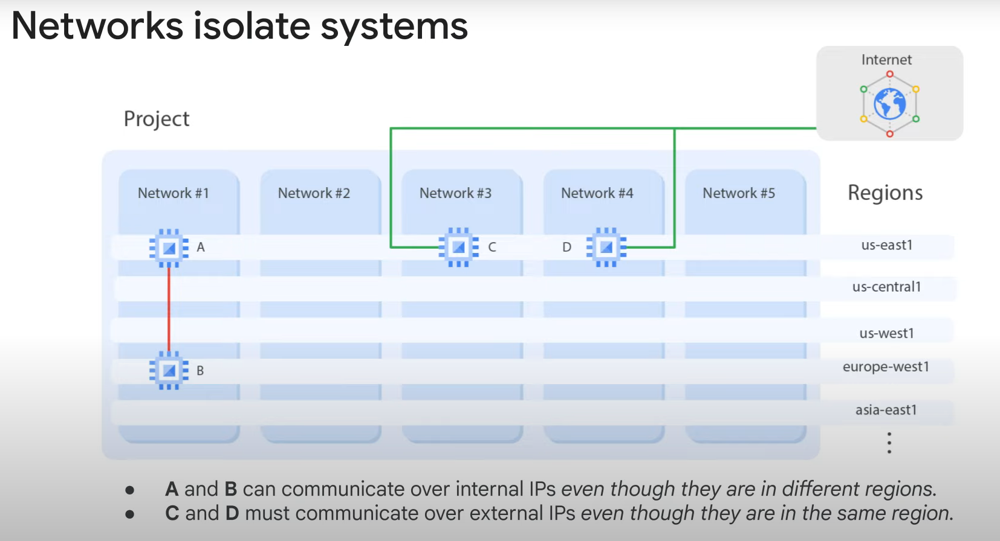
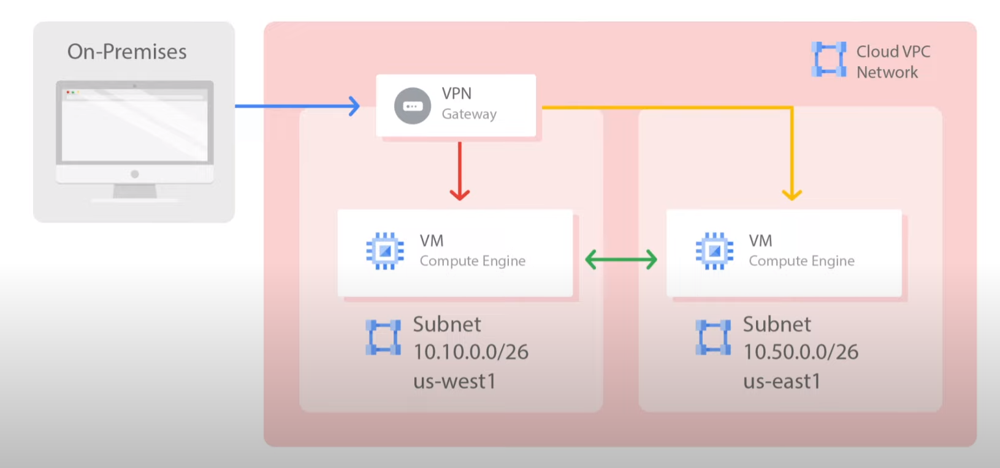
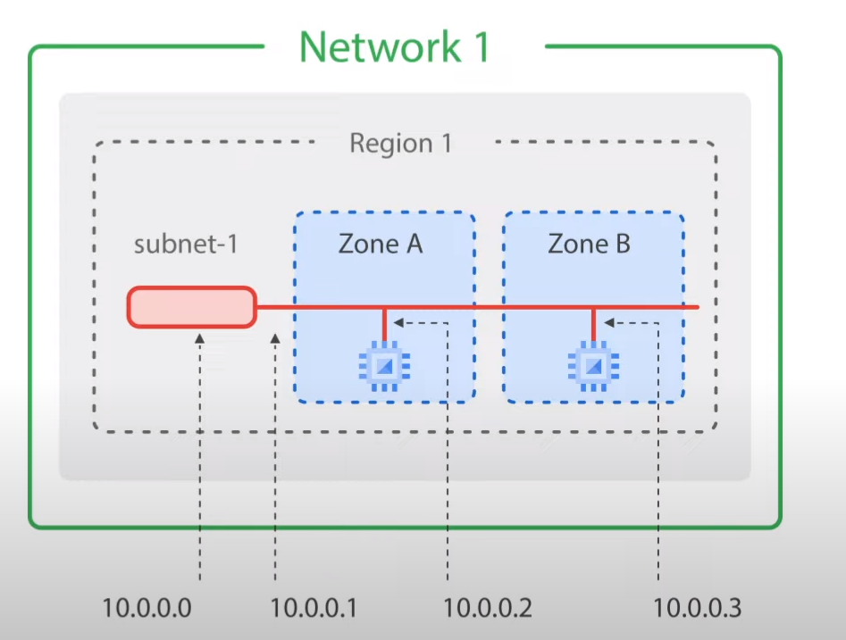
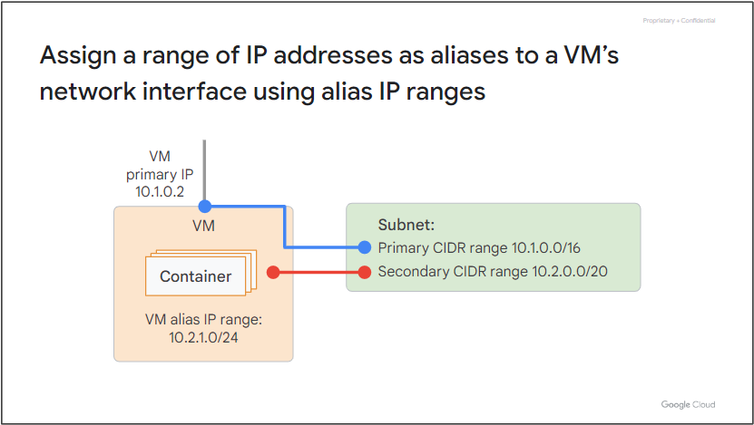
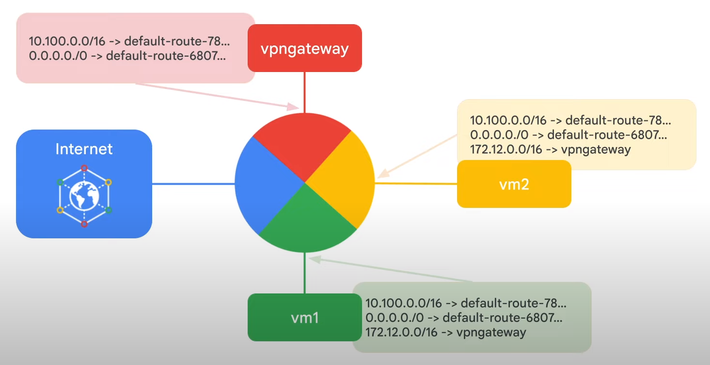
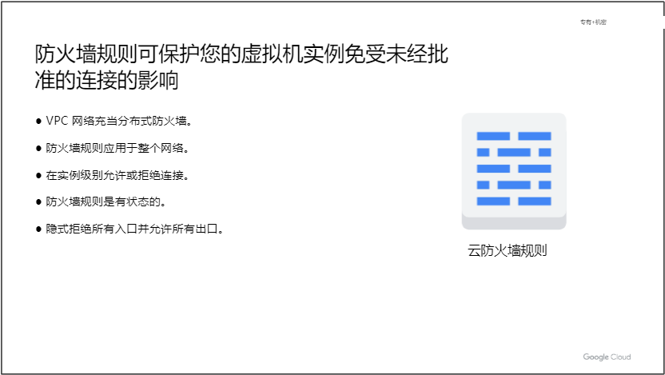

# 基本的 Google Cloud 基础设施：基础
此加速点播课程向参与者介绍 Google Cloud 提供的全面且灵活的基础设施和平台服务，重点是 Compute Engine。 通过视频讲座、演示和实践实验室的结合，参与者探索和部署解决方案元素，包括网络、虚拟机和应用程序服务等基础设施组件。 您将了解如何通过控制台和 Cloud Shell 使用 Google Cloud。 您还将了解云架构师的角色、基础设施设计方法以及虚拟私有云 (VPC) 的虚拟网络配置、项目、网络、子网、IP 地址、路由和防火墙规则。

# 课程信息
## 目标
* 与 Google Cloud 控制台和 Cloud Shell 交互
* 使用 Google Cloud Marketplace 部署解决方案
* 实施VPC网络和防火墙规则
* 使用 Compute Engine 创建和自定义虚拟机实例

# 介绍
略

# 与 Google Cloud 交互
## 模块概述
略

## 使用谷歌云
通过四种方式与 GCP 交互，其中包括 Google Cloud Platform 控制台或 GCP 控制台、Cloud Shell 和 Cloud SDK、API 和 Cloud 移动应用。

## 实验室简介：使用 Google Cloud Console 和 Cloud Shell
略

## 复视：GCP 和 Qwiklabs 入门
略

## 实验：使用 Google Cloud 控制台和 Cloud Shell
### 概览
您将熟悉 Google Cloud 基于网络的界面。其中有两个集成环境：GUI（图形界面）环境，称为 Cloud 控制台；CLI（命令行界面），称为 Cloud Shell。

### 目标
在本实验中，您将学习如何执行以下任务：
* 获取 Google Cloud 的访问权限。
* 使用 Cloud 控制台创建一个 Cloud Storage 存储桶。
* 使用 Cloud Shell 创建一个 Cloud Storage 存储桶。
* 熟悉 Cloud Shell 的特性。

### 任务 1.使用 Cloud 控制台创建一个存储桶
略

### 任务 2.访问 Cloud Shell
略

### 任务 3.使用 Cloud Shell 创建一个 Cloud Storage 存储桶
略

### 任务 4.探索更多 Cloud Shell 特性
介绍了如何上次文件

### 任务 5.在 Cloud Shell 中创建持久状态
接受了使用 *source* 命令和配置 *./profile* 文件

### 任务 6.查看 Google Cloud 界面
略

## 实验室回顾：使用 Google Cloud Console 和 Cloud Shell
略

## 实验室简介：基础设施预览
在本实验室中，您将通过使用 GCP 市场设置完整的 Jenkins 持续集成环境来体验 GCP Automation 的强大功能。

## Google Cloud 础架构预览
### 概览
在本实验中，您将使用 Marketplace 在几分钟内构建一个复杂的部署。

### 目标
在本实验中，您将学习如何执行以下任务：
* 使用 Marketplace 构建一个 Jenkins 持续集成环境。
* 验证您能否从 Jenkins 界面管理服务。
* 通过 SSH 从虚拟机主机管理该服务。

### 任务 1. 使用 Marketplace 构建部署
Google Cloud Deployment Manager 是一种基础架构部署服务，可以自动创建和管理 Google Cloud 资源。您可以编写灵活的模板和配置文件，并使用它们创建包含各种 Google Cloud 服务（例如 Cloud Storage、Compute Engine 和 Cloud SQL）的部署，使其通过配置协同工作。

### 任务 2. 检查部署
略

### 任务 3. 管理服务
略

### 任务 4. 回顾
您只需几分钟就能启动完整的持续集成解决方案。您证明了可以通过 Jenkins 界面获得用户访问权限，并通过使用 SSH 连接到托管服务的虚拟机以及停止然后重新启动服务，证明了您拥有 Jenkins 的管理控制权限。

## 实验室回顾：基础设施预览
略

## 演示：项目
Cloud Shell 属于一个自然账户下，你可以操作多个项目。

## 测验：与 Google Cloud 交互
略

## 模块回顾
略

# 虚拟网络
创建 VPC 网络和其他网络对象

## 模块概述
在本模块中，我们首先介绍适用于 Euro Cloud Platform 资源的虚拟私有云或 VPC，这是 Google 的托管网络功能。然后，我们将网络剖析为其基本组成部分。其中包括项目、网络、子网、IP 地址、路由和防火墙规则以及网络定价。接下来，您将在实验室中通过创建多种不同类型的网络并探索它们之间的网络关系来探索 Google Cloud 的网络结构。之后，我们将了解常见的网络设计。

## 虚拟私有云
借助 GCP，您可以在虚拟私有云中配置 GCP 资源、将它们相互连接并相互隔离。您还可以在 GCP 内以及 GCP 与本地或其他公共云之间定义细粒度的网络和策略。本质上，VPC 是一组全面的 Google 管理的网络对象。

---

项目将涵盖您使用的每一项服务，包括网络。  
网络具有三种不同的风格：默认、自动模式和自定义模式。子网允许您划分或隔离您的环境。  
地区中的区域代表 Google 的数据中心，它们提供持续的数据保护和高可用性。  
VPC 提供供内部和外部使用的 IP 地址以及精细的 IP 地址范围选择。  

## 项目、网络和子网
项目是 Google Cloud 中基础设施资源的主要组织者。项目将对象和服务与计费相关联。项目实际上包含整个网络是独一无二的。

Google Cloud 的网络是全球性的，跨越世界各地的所有可用区域。在网络内部，您可以将资源与区域子网隔离。
* 每个项目都提供默认的 VPC 网络，并具有预设的子网和防火墙规则。具体来说，为每个区域分配一个子网，其中包含不重叠的 CIDR 块和防火墙规则，允许来自任何地方的 ICMP、RDP 和 SSH 流量的入口流量，以及来自所有协议和端口的默认网络内的入口流量。
* 在自动模式网络中，会在其中自动创建每个区域的一个子网。默认网络实际上是自动模式网络。
* 自定义模式网络不会自动创建子网。这种类型的网络使您可以完全控制其子网和 IP 范围。

因为虚拟机 A 和 B 位于同一网络（网络 1），即使位于不同区域，也可以使用其内部 IP 地址进行通信。从本质上讲，您的虚拟机即使位于世界各地的不同位置，也可以利用 Google 的全球光纤网络。当涉及到网络配置协议时，这些虚拟机看起来就像位于同一个机架中。  
VM C 和 D 不在同一网络中。因此，默认情况下，这些虚拟机必须使用其外部 IP 地址进行通信，即使它们位于同一区域也是如此。虚拟机 C 和 D 之间的流量实际上并未接触公共互联网，而是通过 Google Edge 路由器。  

由于 VPC 网络中的虚拟机实例可以在全球范围内进行私密通信，因此单个VPN 可以将您的本地网络安全地连接到 Google Cloud 网络，如此图所示。

子网在区域范围内工作。由于一个区域包含多个可用区，因此子网可以跨可用区。子网只是一个 IP 地址范围，您可以使用该范围内的 IP 地址。每个子网在其主要 IP 范围内都有四个保留的 IP 地址。这意味着单个防火墙规则可以应用于两个虚拟机，即使它们位于不同的区域。

Google Cloud VPC 可让您增加任何子网的 IP 地址空间，而无需关闭任何工作负载或停机。

## 演示：扩展子网
在 GCP 中扩展子网无需任何工作负载关闭或停机。

## IP 地址
在 Google Cloud 中，每个虚拟机可以分配两个 IP 地址。其中之一是内部 IP 地址，将通过 DHCP 内部分配。  
当您在 Google Cloud 中创建虚拟机时，其符号名称会注册到内部 DNS 服务，该服务会将名称转换为内部 IP 地址。  
DNS 的作用域为网络，因此它可以转换同一网络中主机的 Web URL 和虚拟机名称，但无法转换不同网络中虚拟机的主机名。  

    DHCP 是在局域网中广泛使用的协议，它极大地简化了网络设备的配置和管理，提高了网络的灵活性和效率。

另一个IP 地址是外部IP 地址，但这一个是可选的。如果您的设备或机器面向外部，您可以分配外部 IP 地址。该外部 IP 地址可以从池中分配，使其成为临时地址，也可以从保留的外部 IP 地址分配，使其成为静态地址。

## 演示：内部和外部 IP
每个虚拟机都需要一个内部 IP 地址，但外部 IP 地址是可选的，并且默认情况下是临时的。

## 映射 IP 地址
无论您使用临时 IP 地址还是静态 IP 地址，虚拟机的操作系统都无法识别外部地址。外部IP地址通过VPC透明映射到虚拟机的内部地址。  
每个实例都有一个可以解析为内部 IP 地址的主机名。该主机名与实例名称相同。  
还有一个内部完全限定域名 (FQDN)。FQDN 为 主机名.区域.c.项目ID.internal 示例：my-server.us-central1-a.c.guestbook-151617.internal。  
每个实例都有一个元数据服务器，该服务器还充当该实例的 DNS 解析器。元数据服务器处理本地网络资源的所有 DNS 查询，并将所有其他查询路由到 Google 的公共 DNS 服务器以进行公共名称解析。我之前提到过，实例不知道分配给它的任何外部 IP 地址。相反，网络存储一个查找表，将外部 IP 地址与相关实例的内部 IP 地址进行匹配。  

    FQDN（Fully Qualified Domain Name）是一个用于唯一标识互联网上特定主机的域名。FQDN 包含了从顶级域名一直到主机名的所有标签，以完整的层级结构描述了主机在域名系统（DNS）中的位置。

具有外部 IP 地址的实例可以允许来自项目外部主机的连接。用户可以直接使用外部 IP 地址来执行此操作。指向实例的公共 DNS 记录不会自动发布；但是，管理员可以使用现有的 DNS 服务器发布这些内容。域名服务器可以使用 Cloud DNS 托管在 Google Cloud 上。  

别名 IP 范围允许您将内部 IP 地址范围分配为虚拟机网络接口的别名。如果您有多个服务在虚拟机上运行，​​并且您希望为每个服务分配不同的 IP 地址，则这非常有用。

## 默认域的 IP 地址
略

## 路由和防火墙规则
默认情况下，每个网络都有路由，允许网络中的实例直接相互发送流量，甚至跨子网。此外，每个网络都有一条默认路由，将数据包定向到网络外部的目的地。  
尽管这些路由满足了您的大部分正常路由需求，但您也可以创建覆盖这些路由的特殊路由。  
创建网络时会创建路由，从而实现从“任何地方”传送流量。此外，创建子网时也会创建路由。这使得同一网络上的虚拟机能够进行通信。  

Routes 集合中的每条路由都可以应用于一个或多个实例。如果网络和实例标记匹配，则路由适用于实例。如果网络匹配并且没有指定实例标签，则该路由适用于该网络中的所有实例。然后，Compute Engine 使用路由集合为每个实例创建单独的只读路由表。  
该图显示了每个网络核心的可大规模扩展的虚拟路由器。网络中的每个虚拟机实例都直接连接到该路由器，所有离开虚拟机实例的数据包首先在该层进行处理，然后再转发到下一跳。虚拟网络路由器通过查询该实例的路由表来选择数据包的下一跳。  

* Google Cloud 防火墙规则可保护您的虚拟机实例免受未经批准的入站和出站连接（分别称为入口和出口）的影响。本质上，每个 VPC 网络都充当分布式防火墙。
* 尽管防火墙规则作为一个整体应用于网络，但连接是在实例级别允许或拒绝的。您可以认为防火墙不仅存在于您的实例和其他网络之间，还存在于同一网络内的各个实例之间。
* Google Cloud 防火墙规则是有状态的。这意味着，如果允许源与目标或目标与目的地之间的连接，则任一方向上的所有后续流量都将被允许。换句话说，一旦建立会话，防火墙规则就允许双向通信。
* 此外，如果由于某种原因删除了网络中的所有防火墙规则，则该网络仍然存在隐含的“拒绝所有”入口规则和隐含的“允许所有”出口规则。

您可以将所需的防火墙配置表示为一组防火墙规则。从概念上讲，防火墙规则由以下参数组成：
* 规则的方向。入站连接仅与入口规则匹配，出站连接仅与出口规则匹配。
* 入口数据包的连接源，或出口数据包的连接目的地。
* 连接的协议和端口，其中任何规则都可以限制为仅适用于特定协议或仅适用于协议和端口的特定组合。
* 规则的操作，即允许或拒绝与规则的方向、协议、端口、源或目标匹配的数据包。
* 规则的优先级，它控制规则的评估顺序。应用第一个匹配规则。
* 规则分配。默认情况下，所有规则都会分配给所有实例，但您可以仅将某些规则分配给某些实例。

## 定价
略

## 实验室简介：VPC 网络
您将创建一个具有防火墙规则和虚拟机实例的自动模式 VPC 网络。  
然后，将自动模式网络转换为自定义模式网络，并创建其他自定义模式网络，如此网络图所示。  
您还将探索跨网络的连接性。

## 实验:VPC 网络 - VPC Networking
### 概览
Google Cloud Virtual Private Cloud (VPC) 可为 Compute Engine 虚拟机 (VM) 实例、Kubernetes Engine 容器和 App Engine 柔性环境提供联网功能。换而言之，如果没有 VPC 网络，您就无法创建虚拟机实例、容器和 App Engine 应用。因此，每个 Google Cloud 项目都有一个默认网络供您开始您的工作。

VPC 网络类似于物理网络，区别是前者在 Google Cloud 中进行了虚拟化。VPC 网络是一种全球性资源，它由数据中心内的一系列区域级虚拟子网组成，所有子网通过全球广域网 (WAN) 连接。在 Google Cloud 中，VPC 网络在逻辑上彼此隔离。

### 任务 1. 探索默认网络
略

### 任务 2. 创建自动模式网络
略

### 任务 3. 创建自定义模式网络
略

### 任务 4. 探索网络间的连接情况
略

### 任务 5. 回顾
在本实验中，您探索了默认网络，并确定了没有 VPC 网络就无法创建虚拟机实例。因此，您创建了一个具有子网、路由、防火墙规则和两个虚拟机实例的新自动模式 VPC 网络，并测试了这两个虚拟机实例的连接情况。由于不建议在生产环境中使用自动模式网络，您将自动模式网络转换成了自定义模式网络。

接着，您又使用 Cloud 控制台和 gcloud 命令行创建了另外两个自定义模式 VPC 网络，它们都具有防火墙规则和虚拟机实例。然后，您测试了 VPC 网络间的连接，结果为：ping 外部 IP 地址时可以 ping 通；但 ping 内部 IP 地址时无法 ping 通。

默认情况下，VPC 网络是隔离的专用网络网域。因此，除非您设置 VPC 对等互连或 VPN 等机制，否则无法在网络之间使用内部 IP 地址通信。

## 实验室回顾：VPC 网络

## 常见网络设计

## 实验室简介：实施私有 Google 访问和 Cloud NAT

## 实验：实现专用 Google 访问通道和 Cloud NAT

## 实验室回顾：实施私有 Google 访问和 Cloud NAT

## 测验：虚拟网络

## 模块回顾

# 虚拟机
使用 Compute Engine 创建虚拟机

# 