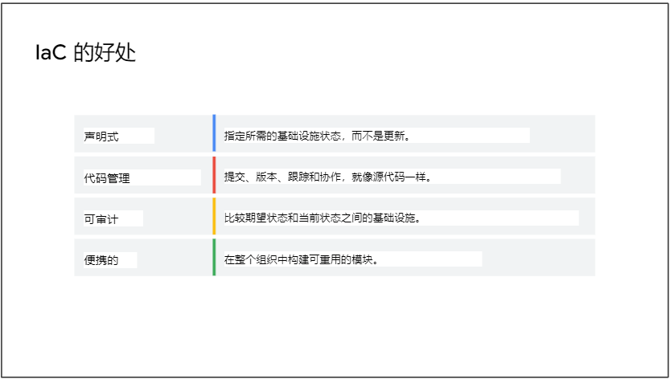
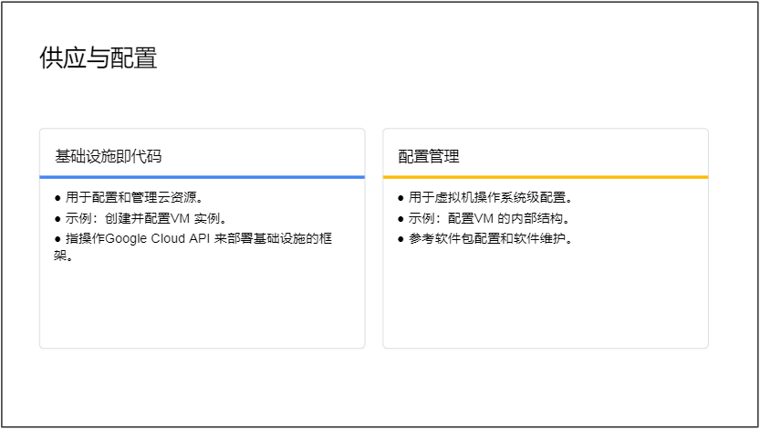
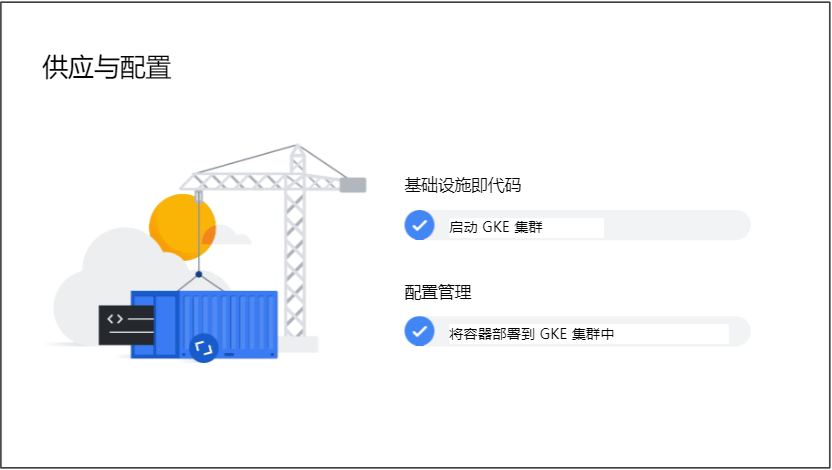
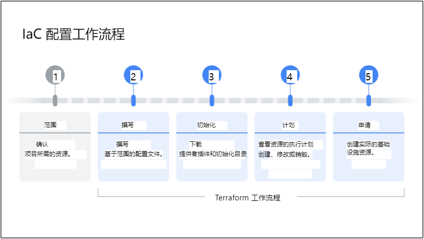
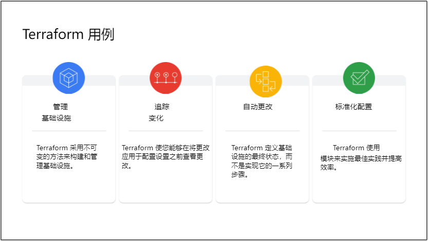
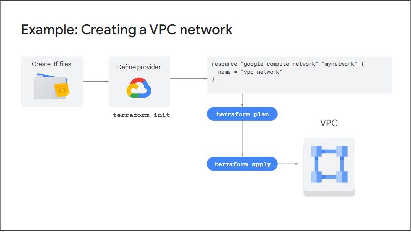
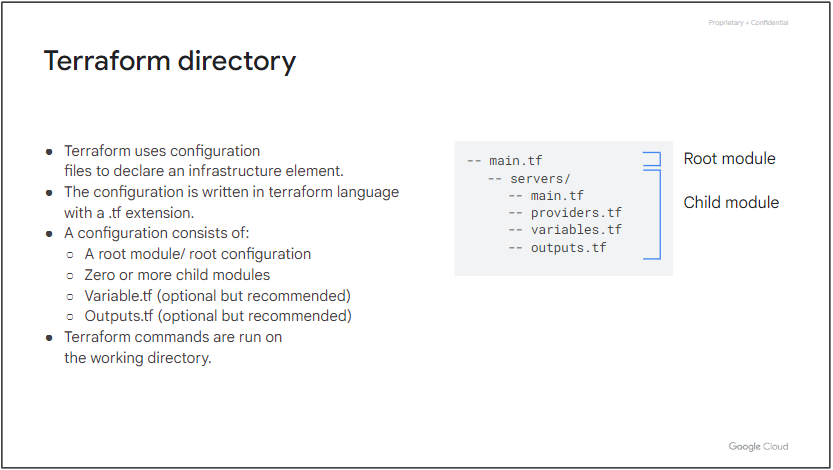
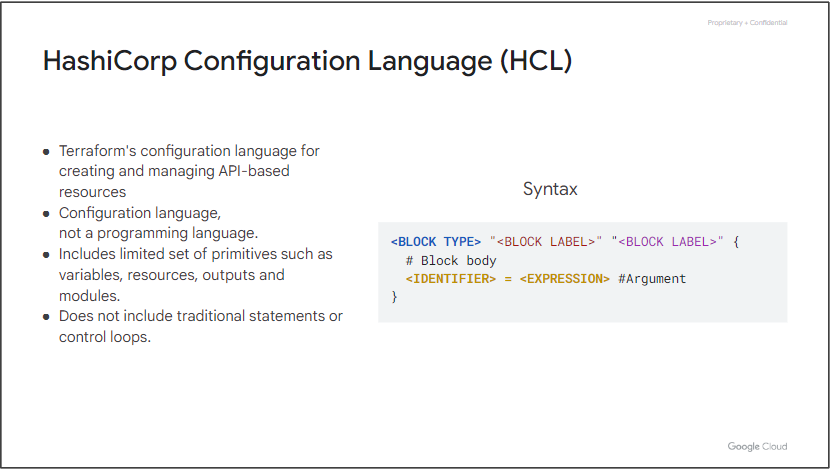
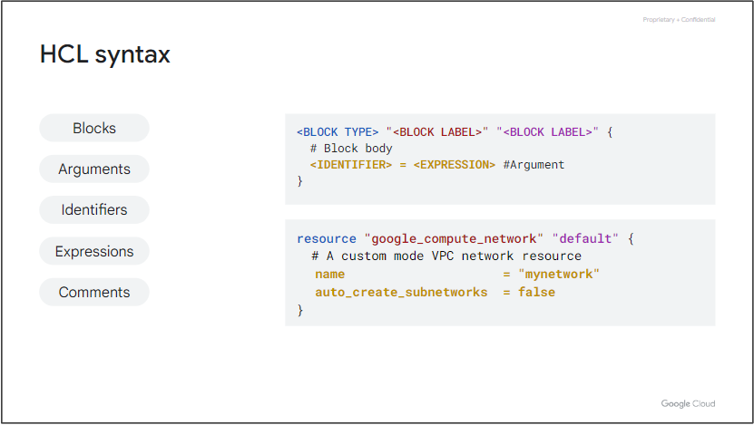
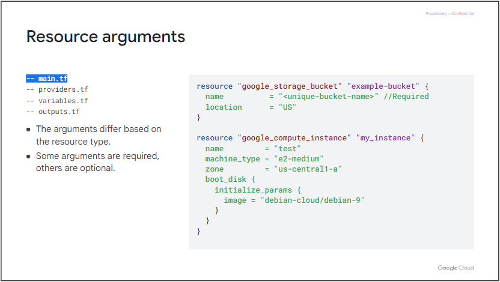

# 适用于 Google Cloud 的 Terraform 入门
本课程介绍如何使用 Terraform for Google Cloud。它使学习者能够描述如何使用 Terraform 来实现基础设施即代码，并应用其一些关键特性和功能来创建和管理 Google Cloud 基础设施。学习者将获得使用 Terraform 构建和管理 Google Cloud 资源的实践练习。

# 课程信息
## 目标
* 定义基础设施即代码的业务需求以及在您的环境中使用它的好处。
* 解释 Terraform 的特性和功能。
* 使用 Terraform 资源、变量和输出值创建 Google Cloud 基础架构资源。
* 使用 Terraform 模块构建可重用的配置。
* 解释 Terraform 状态及其重要性。

# 课程介绍
本部分欢迎学员学习 Google Cloud 基础知识：核心基础设施课程，并概述课程结构和目标。

## 课程介绍
这是一个介绍性模块，涵盖 Terraform 的业务需求。我们将从基础知识开始，概述基础设施即代码 (IaC)，这是 Terraform 的基本概念。我们将探讨如何将 Terraform 用作 Google Cloud 上的 IaC 工具，并介绍其功能和优点。然后我们将了解 Terraform 如何将代码行转换为 Google Cloud 上的真实基础设施。

# Google Cloud 的 Terraform 简介
这是一个介绍性模块，涵盖 Terraform 的业务需求。
* 我们将从基础知识开始，概述基础设施即代码 (IaC)，这是 Terraform 的基本概念。
* 我们将探讨如何将 Terraform 用作 Google Cloud 上的 IaC 工具，并介绍其功能和优点。
* 然后我们将了解 Terraform 如何将代码行转换为 Google Cloud 上的真实基础设施。

## 模块概览
略

## 基础设施即代码
### 什么是基础设施即代码 (IaC)？
借助 IaC，您可以在文件中编写代码来定义、配置和管理您的基础设施，而无需单击 Web UI 或使用 SSH 连接到服务器并手动执行命令。

### IaC 的好处

### 供应与配置

## Terraform 概览
Terraform 是由 HashiCorp 创建的开源基础设施即代码工具，可让您使用声明性配置文件配置 Google Cloud 资源，例如虚拟机、容器、存储和网络。  
Terraform 允许基础设施以一种简单的、人类可读的语言（称为 HashiCorp 配置语言 (HCL)）表达为代码。  
它读取配置文件并提供更改的执行计划，可以对其进行安全审查，然后应用和配置。在较高级别上，Terraform 允许操作员在 Google Cloud 提供商上编写包含所需资源定义的文件，并在应用步骤时自动创建这些资源。

### Terraform 特征
* 多云和多 API：支持所有主要云提供商，包括 Google Cloud 和许多其他通过 API 公开的服务（例如 GitHub 和 Kubernetes）。
* 具有企业支持的开放核心：三个不同的版本，范围从自托管到具有企业级支持的完全托管。
* 大型社区：Terraform 注册表中公开提供了数千个可重用模块，用于 Google Cloud 部署。
* 基础设施配置：Terraform 专注于配置基础设施，而不是配置它。

### 适用于 Google Cloud 的 Terraform
* 配置资源：这意味着您可以使用资源块来定义基础架构元素，例如虚拟机、网络、防火墙资源。
* 创建资源依赖关系：您可以在资源之间创建显式依赖关系，以便只能在创建另一个资源之后才能创建给定资源。
* 标准化配置：您可以通过创建可重用模块来标准化给定资源的创建方式。
* 验证资源参数的输入：您可以使用 Terraform 中的验证规则来限制用户可以为给定资源参数提供的值。

### IaC 配置工作流程

### Terraform 用例

## 使用 Terraform
### 如何使用 Terraform 来创建、更新或销毁基础设施资源？
1. Terraform 识别以 .tf 文件编写的配置文件：为了使用 Terraform，您必须将基础架构编写为配置文件中的代码。 这些配置文件向 Terraform 描述您想要配置的资源。
2. Terraform 生成执行计划：Terraform 生成一个执行计划，描述它将执行哪些操作来达到所需状态，然后执行该计划来构建所描述的基础设施。
3. Terraform 使用此计划来创建基础设施：Terraform 创建了这个基础设施并保存了状态。
4. Terraform 确定更改并创建增量执行计划：当配置发生变化时，Terraform 可以确定发生了什么变化并创建可应用的增量执行计划。

## [测验](https://www.cloudskillsboost.google/course_sessions/4940601/quizzes/357041)

## 模块回顾
本模块涵盖了 Terraform 和基础设施即代码的基础知识。我们将基础设施定义为代码并涵盖了 IaC 的业务案例。我们解释了使用 Terraform 的功能和优点。我们还讨论了常见用例、如何使用 Terraform 以及 Terraform 的消费模型。

# 术语和概念
在本模块中，我们将向您介绍 HashiCorp 语言，并讨论创作 Terraform 配置所涉及的术语和概念。我们还探讨了一些涉及管理 terraform 配置的重要 Terraform 命令。完成本模块后，您将能够解释每个代码块的含义，在 Terraform 中创建基本配置文件，并能够解释一些重要的 terraform 命令的用途，我们还将探索什么是验证器工具。

## 模块概览
* 解释 Terraform 工作流程。
* 在 Terraform 中创建基本配置文件。
* 解释一些 Terraform 命令的用途。
* 描述 Terraform Validator 工具。
* 使用 Terraform 创建、更新和销毁 Google Cloud 资源。

## Terraform 配置和 Hashicorp 语言
### Terraform 目录

* Terraform 使用配置文件来声明基础设施元素
* 配置是用 terraform 语言编写的，扩展名为 .tf。
* 一个配置包括：
  * 根模块/根配置
  * 零个或多个子模块
  * Variable.tf（可选但推荐）
  * Outputs.tf（可选但推荐）
* Terraform 命令在工作目录上运行。

### HashiCorp 配置语言 (HCL)

* Terraform 用于创建和管理基于 API 的资源的配置语言
* 配置语言，不是编程语言
* 包括有限的原语集，例如变量、资源、输出和模块
* 不包括传统语句或控制循环

### HCL语法

* Blocks 块，是属于某种类型的代码行。 块的一些示例是资源、变量和输出。 块可以是简单的，也可以是嵌套的以包含另一种块类型。
* Arguments 参数用于为名称分配值。 它们是一个块的一部分。有些块具有强制参数和一些可选参数。 参数定义了块类型中定义的对象的一些属性。
* Expressions 表达式可用于表示分配给代码块内标识符的值。
* Identifiers 标识符是参数、块类型或任何 Terraform 特定构造的名称。 标识符的命名约定是可以包含字母、下划线、连字符和数字，但不能以数字开头。
* 与任何编程语言一样，注释可用于提高代码的可读性。 注释的语法是：
  * 单行注释以 # 开头和结尾。
  * 使用 // 作为单行注释。
  * 使用 /* 和 */ 进行多行注释。
> 请记住，Terraform 语言本质上是声明性的，这意味着您定义基础设施的最终状态；因此，块或文件的顺序并不重要。

## 常见阶段术语和概念
### Resource 资源

* 资源是定义基础设施组件的代码块，示例：云存储桶。

# 为 Google Cloud 编写基础架构代码
在本模块中，您将探索有关资源、变量和输出资源的更多信息。
* 我们将首先探索如何使用资源创建基础设施组件，然后探索 Terraform 如何处理资源内的依赖关系。
* 虽然我们一直在介绍如何使用硬编码资源参数创建资源，但我们将探讨如何使用变量对给定配置进行参数化。我们将探索在您的配置中声明、定义和使用它们的语法。
* 然后，我们将讨论如何使用输出值将资源属性导出到资源声明之外。
* 然后，我们将通过发现如何使用 Terraform 注册表和 Cloud Foundation Toolkit 简化代码创作来总结该模块。

# 使用 Terraform 模块组织和重用配置
您将探索什么是模块、如何从公共注册表使用它们、如何使用模块重用配置以及使用输入变量参数化配置。您还将探索如何使用输出值来访问模块外部的资源属性。

# Terraform 状态简介
该模块首先介绍 Terraform 状态。然后，您将了解存储 Terraform 状态的不同方法。在本模块的后面部分，您将探索将状态文件存储在远程位置的好处。虽然您可以在许多远程位置存储状态文件，但本模块描述了如何将其存储在 Google 云存储桶中。您将通过学习使用状态文件的最佳实践来结束本模块。