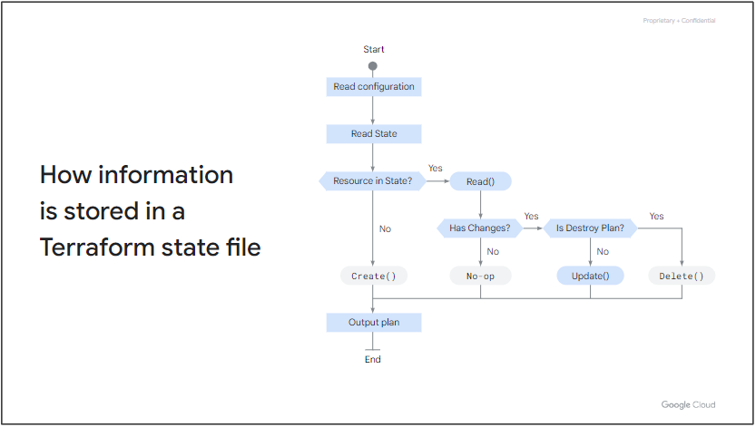

# 适用于 Google Cloud 的 Terraform 入门
本课程介绍如何使用 Terraform for Google Cloud。它使学习者能够描述如何使用 Terraform 来实现基础设施即代码，并应用其一些关键特性和功能来创建和管理 Google Cloud 基础设施。学习者将获得使用 Terraform 构建和管理 Google Cloud 资源的实践练习。

# 课程信息
## 目标
* 定义基础设施即代码的业务需求以及在您的环境中使用它的好处。
* 解释 Terraform 的特性和功能。
* 使用 Terraform 资源、变量和输出值创建 Google Cloud 基础架构资源。
* 使用 Terraform 模块构建可重用的配置。
* 解释 Terraform 状态及其重要性。

# 课程介绍
本部分欢迎学员学习 Google Cloud 基础知识：核心基础设施课程，并概述课程结构和目标。

## 课程介绍
这是一个介绍性模块，涵盖 Terraform 的业务需求。我们将从基础知识开始，概述基础设施即代码 (IaC)，这是 Terraform 的基本概念。我们将探讨如何将 Terraform 用作 Google Cloud 上的 IaC 工具，并介绍其功能和优点。然后我们将了解 Terraform 如何将代码行转换为 Google Cloud 上的真实基础设施。

# Google Cloud 的 Terraform 简介
这是一个介绍性模块，涵盖 Terraform 的业务需求。
* 我们将从基础知识开始，概述基础设施即代码 (IaC)，这是 Terraform 的基本概念。
* 我们将探讨如何将 Terraform 用作 Google Cloud 上的 IaC 工具，并介绍其功能和优点。
* 然后我们将了解 Terraform 如何将代码行转换为 Google Cloud 上的真实基础设施。

## 模块概览
略

## 基础设施即代码
### 什么是基础设施即代码 (IaC)？
借助 IaC，您可以在文件中编写代码来定义、配置和管理您的基础设施，而无需单击 Web UI 或使用 SSH 连接到服务器并手动执行命令。

### IaC 的好处


### 供应与配置


## Terraform 概览
Terraform 是由 HashiCorp 创建的开源基础设施即代码工具，可让您使用声明性配置文件配置 Google Cloud 资源，例如虚拟机、容器、存储和网络。  
Terraform 允许基础设施以一种简单的、人类可读的语言（称为 HashiCorp 配置语言 (HCL)）表达为代码。  
它读取配置文件并提供更改的执行计划，可以对其进行安全审查，然后应用和配置。在较高级别上，Terraform 允许操作员在 Google Cloud 提供商上编写包含所需资源定义的文件，并在应用步骤时自动创建这些资源。

### Terraform 特征
* 多云和多 API：支持所有主要云提供商，包括 Google Cloud 和许多其他通过 API 公开的服务（例如 GitHub 和 Kubernetes）。
* 具有企业支持的开放核心：三个不同的版本，范围从自托管到具有企业级支持的完全托管。
* 大型社区：Terraform 注册表中公开提供了数千个可重用模块，用于 Google Cloud 部署。
* 基础设施配置：Terraform 专注于配置基础设施，而不是配置它。

### 适用于 Google Cloud 的 Terraform
* 配置资源：这意味着您可以使用资源块来定义基础架构元素，例如虚拟机、网络、防火墙资源。
* 创建资源依赖关系：您可以在资源之间创建显式依赖关系，以便只能在创建另一个资源之后才能创建给定资源。
* 标准化配置：您可以通过创建可重用模块来标准化给定资源的创建方式。
* 验证资源参数的输入：您可以使用 Terraform 中的验证规则来限制用户可以为给定资源参数提供的值。

### IaC 配置工作流程


### Terraform 用例


## 使用 Terraform
### 如何使用 Terraform 来创建、更新或销毁基础设施资源？
1. Terraform 识别以 .tf 文件编写的配置文件：为了使用 Terraform，您必须将基础架构编写为配置文件中的代码。 这些配置文件向 Terraform 描述您想要配置的资源。
2. Terraform 生成执行计划：Terraform 生成一个执行计划，描述它将执行哪些操作来达到所需状态，然后执行该计划来构建所描述的基础设施。
3. Terraform 使用此计划来创建基础设施：Terraform 创建了这个基础设施并保存了状态。
4. Terraform 确定更改并创建增量执行计划：当配置发生变化时，Terraform 可以确定发生了什么变化并创建可应用的增量执行计划。


## [测验](https://www.cloudskillsboost.google/course_sessions/4940601/quizzes/357041)

## 模块回顾
本模块涵盖了 Terraform 和基础设施即代码的基础知识。我们将基础设施定义为代码并涵盖了 IaC 的业务案例。我们解释了使用 Terraform 的功能和优点。我们还讨论了常见用例、如何使用 Terraform 以及 Terraform 的消费模型。

# 术语和概念
在本模块中，我们将向您介绍 HashiCorp 语言，并讨论创作 Terraform 配置所涉及的术语和概念。我们还探讨了一些涉及管理 terraform 配置的重要 Terraform 命令。完成本模块后，您将能够解释每个代码块的含义，在 Terraform 中创建基本配置文件，并能够解释一些重要的 terraform 命令的用途，我们还将探索什么是验证器工具。

## 模块概览
* 解释 Terraform 工作流程。
* 在 Terraform 中创建基本配置文件。
* 解释一些 Terraform 命令的用途。
* 描述 Terraform Validator 工具。
* 使用 Terraform 创建、更新和销毁 Google Cloud 资源。

## Terraform 配置和 Hashicorp 语言
### Terraform 目录

* Terraform 使用配置文件来声明基础设施元素
* 配置是用 terraform 语言编写的，扩展名为 .tf。
* 一个配置包括：
  * 根模块/根配置
  * 零个或多个子模块
  * Variable.tf（可选但推荐）
  * Outputs.tf（可选但推荐）
* Terraform 命令在工作目录上运行。

### HashiCorp 配置语言 (HCL)

* Terraform 用于创建和管理基于 API 的资源的配置语言
* 配置语言，不是编程语言
* 包括有限的原语集，例如变量、资源、输出和模块
* 不包括传统语句或控制循环

### HCL语法

* Blocks 块，是属于某种类型的代码行。 块的一些示例是资源、变量和输出。 块可以是简单的，也可以是嵌套的以包含另一种块类型。
* Arguments 参数用于为名称分配值。 它们是一个块的一部分。有些块具有强制参数和一些可选参数。 参数定义了块类型中定义的对象的一些属性。
* Expressions 表达式可用于表示分配给代码块内标识符的值。
* Identifiers 标识符是参数、块类型或任何 Terraform 特定构造的名称。 标识符的命名约定是可以包含字母、下划线、连字符和数字，但不能以数字开头。
* 与任何编程语言一样，注释可用于提高代码的可读性。 注释的语法是：
  * 单行注释以 # 开头和结尾。
  * 使用 // 作为单行注释。
  * 使用 /* 和 */ 进行多行注释。
> 请记住，Terraform 语言本质上是声明性的，这意味着您定义基础设施的最终状态；因此，块或文件的顺序并不重要。

## 常见阶段术语和概念
### Resource 资源

* 资源是定义基础设施组件的代码块，示例：云存储桶。
* Terraform 使用资源类型和资源名称来标识基础设施元素。
* 参数因资源类型而异。
* 有些参数是必需的，其他参数是可选的。

### 提供者
每个资源类型都由提供者实现；如果没有提供者，Terraform 就无法管理任何类型的基础设施。  
在providers.tf 文件中，您指定包含您将使用的提供程序定义的 Terraform 块。建议使用 Terraform {} 块，以便 Terraform 知道从 Terraform 注册表下载哪个提供程序。  

* source 参数提供您要使用的提供程序的全局源地址。
* 名称 google 是要配置的提供程序的本地名称。为了确保正确配置本地名称，该提供程序必须包含在所需的提供程序块中。诸如项目和区域之类的参数可以在提供者块中声明，并且特定于谷歌提供者。
* 您还可以为 required_providers 块中定义的每个提供程序分配一个版本。版本参数是可选的，但建议使用。它用于将提供程序限制为特定版本或一系列版本，以防止下载可能包含重大更改的新提供程序。如果未指定版本，Terraform 将在初始化期间自动下载最新的提供程序。

### 变量

* 参数化资源参数以消除对其值的硬编码。
* 在运行时或集中在扩展名为 .tfvars 的文件中定义资源属性。

### 输出值

* 输出值存储在outputs.tf 文件中。
* 输出值公开资源属性的值。

### 状态

* Terraform 将其管理的资源状态保存在状态文件中。
* 状态文件可以存储：
  * 本地（默认）
  * 远程在共享位置
> 您不修改此文件

### 模块

* Terraform 模块是单个目录中的一组 Terraform 配置文件
* 它是 Terraform 中代码重用的主要方法。
* 有2种来源：
  * 本地：您目录中的源
  * 远程：目录之外的源

## Terraform 命令

* terraform init 命令将自动下载并安装任何提供程序二进制文件，供提供程序在配置中使用，在本例中为 Google 提供程序。执行 terraform init 后，会在当前工作目录下创建一个名为 .terraform 的隐藏目录。运行该命令时，您将看到一条“正在初始化提供程序插件”消息，这表明 Terraform 将从 URL 中查找最新的插件并下载关联的文件。在此命令的输出中，您还可以看到 Terraform 已安装的提供程序版本。
* terraform plan 命令实际上并不创建或更改任何基础架构资源，而是为您提供了在应用基础架构之前预览对基础架构所做的更改的机会。例如，您可能会在提交版本控制更改之前运行此命令，以确保其按预期运行。
* Terraform apply 执行 Terraform plan 中建议的操作、创建资源并建立依赖关系。
* Terraform fmt - 自动更新配置以提高可读性和一致性。在模块和代码上运行 terraform fmt 会自动应用所有格式规则和推荐的样式。
* terraform destroy 命令销毁资源，该命令与 terraform apply 类似，但其行为就像所有资源已从配置中删除一样。

## Terraform 验证器

在 Terraform 计划阶段之后，您可以选择包含一个验证阶段，该阶段根据组织策略运行部署前检查。 Terraform 验证器是一种用于强制策略合规性的工具，作为基础设施 CI/CD 管道的一部分。这在基础设施即代码环境中非常有用，因为它有助于减少可能导致安全和治理违规的配置错误。 terraform 验证器通过执行 gcloud beta terraform vet 命令来运行。

> 请注意，该工具与命令“terraform validate”完全不同。我们在本课程中尚未介绍此命令。命令“terraform validate”用于测试配置的语法和结构，而无需部署任何资源。但 gcloud beta terraform vet 命令用于确保配置遵守一组约束。这些约束自动执行组织策略。

### Terraform 验证器使用
1. 平台团队可以向基础设施 CI/CD 管道添加护栏，以确保所有更改都得到验证。
2. 应用程序团队和开发人员可以使用组织的中央策略库验证 Terraform 配置。
3. 安全团队可以创建一个集中的策略库来识别并防止违反政策的行为。

## 演示 Terraform 工作流程
此演示将帮助您熟悉用于创建 Compute Engine 实例的 Terraform 配置。我们将向您展示如何创建配置文件并使用 Terraform CLI 执行一些 Terraform 命令，例如 terraform init、terraform plan、terraform apply 和 terraform destroy。

## 实验室简介：使用 Terraform 进行基础设施即代码
在本实验中，您将使用 Terraform 创建、更新和销毁 Google Cloud 资源。  
* 您首先将 Google Cloud 定义为提供商。
* 然后，您将创建一个不提及网络的虚拟机实例，以查看 terraform 如何解析配置代码。
* 然后，您将编辑代码以添加网络并在 Google Cloud 上创建虚拟机实例。您将探索如何更新虚拟机实例。
* 您将编辑现有配置以添加标签，然后编辑机器类型。
* 然后，您将执行 terraform 命令来销毁创建的资源。

## 实验：使用 Terraform 进行基础设施即代码
### 概述
略

### 目标
在本实验中，您将学习如何执行以下任务：
* 验证 Terraform 安装
* 将 Google Cloud 定义为提供商
* 使用 Terraform 创建、更改和销毁 Google Cloud 资源

### 任务 1. 登录 Cloud Console
略

### 任务 2. 检查 Terraform 安装
略

### 任务 3. 添加 Google Cloud 提供商
略

### 任务 4. 建设基础设施
略

### 任务 5. 改变基础设施
略

### 任务 6. 摧毁基础设施
略

## 模块回顾
该模块描述了与 Terraform 工作流程每个阶段相关的术语和概念。  
您学习了如何在 Terraform 中创建基本配置文件，以及如何描述 Terraform 提供程序。  
该模块还解释了一些重要的 Terraform 命令的用途。  
此外，您还了解了 Terraform 工作流程中称为验证的可选阶段。  
您还了解了如何创建、更新和销毁 Google Cloud 资源。  
查看下一个模块，了解有关编写基础设施代码的更多信息。

# 为 Google Cloud 编写基础架构代码
在本模块中，您将探索有关资源、变量和输出资源的更多信息。
* 我们将首先探索如何使用资源创建基础设施组件，然后探索 Terraform 如何处理资源内的依赖关系。
* 虽然我们一直在介绍如何使用硬编码资源参数创建资源，但我们将探讨如何使用变量对给定配置进行参数化。我们将探索在您的配置中声明、定义和使用它们的语法。
* 然后，我们将讨论如何使用输出值将资源属性导出到资源声明之外。
* 然后，我们将通过发现如何使用 Terraform 注册表和 Cloud Foundation Toolkit 简化代码创作来总结该模块。

## 模块概览
略

## 介绍资源
### 什么是资源？
* 资源是您可以使用Terraform 配置的基础设施元素。
* Terraform 使用每个Google Cloud 服务的底层API 来部署您的资源。

### 声明资源的语法

* 资源在 .tf 文件中定义。
* 资源块代表单个基础设施对象。
* 资源类型标识正在创建的资源类型。
* 资源类型取决于 terraform 模块中声明的提供者。
* 并非所有资源参数都必须定义。


您可以在同一个 Terraform 配置文件中包含相同类型的多个资源或不同资源类型的多个资源。这些资源甚至可以跨越多个提供商。


每当您必须从另一个资源块访问资源属性时，请使用格式 <resource_type>.<resource_name>.<attribute> 。
> 请注意，仅当资源在同一根配置中定义时才能使用此方法。

### 定义资源块的注意事项
* 给定资源类型的资源名称在模块内必须是唯一的。
* 资源类型不是用户定义的，而是基于提供者。
* 所有配置参数必须包含在资源块内。
* 必须定义所有必需的资源参数。

## 资源的元参数


## 资源依赖

在构建基础设施时，您可能更喜欢以可视化方式表示基础设施如何连接和相互依赖。 Terraform 有一个称为依赖图的功能，可以满足这个确切的目的。它添加了一个层来在实际部署之前了解您的基础设施的外观。 Terraform 从 Terraform 配置构建依赖关系图，并遍历该图以生成计划和刷新状态。属性在运行时进行插值，变量、输出值和提供程序等基元在依赖树中连接。执行操作时，Terraform 会创建依赖图来确定正确的操作顺序。在具有多个资源的更复杂的情况下，Terraform 将在安全的情况下并行执行操作。


Terraform 可以处理其管理的资源之间的两种依赖关系。它们是隐式依赖和显式依赖。  
简而言之，隐式依赖是 Terraform 已知的依赖，而显式依赖是 Terraform 未知的依赖。


执行terraform apply命令时可以查看资源创建的顺序。默认情况下，Terraform 知道资源的创建顺序。由于隐式依赖关系，Terraform 能够推断依赖关系并知道它必须在创建实例之前创建网络。


资源之间存在 Terraform 不可见的依赖关系。可以使用 dependent_on 参数强制执行此序列。

## 变量
### 变量概述
* 变量参数化您的配置而不改变源代码。
* 变量允许您在运行时为资源属性分配值。
* 变量将源代码与赋值分开。
> 可以通过不同的方式在运行时设置其值：环境变量、CLI 选项或键值文件。

### 声明输入变量的语法

* 您必须在变量块中声明变量。建议将所有变量声明保存在名为 Variables.tf 的单独文件中。
* 关键字“变量”旁边的标签为变量提供了名称。其他语言中也常见的命名变量所涉及的两条规则是：
  * 变量的名称在模块内必须是唯一的
  * 变量名不能是关键字
> 变量没有必需的参数；因此，变量块甚至可以是空的。类型和默认值不是强制性的，Terraform 可以自动从分配给变量的默认值中推断出类型。

“type”参数指定变量接受的值类型。Terraform 支持以下原始变量类型：
* Bool 用于二进制值，例如不带双引号的 true 或 false。
* Number 用于数字变量。
* 字符串用于表示unicode 字符序列。


default 是另一个元参数，用于为属性分配默认值。当没有为变量设置值时，将使用默认参数中提到的值。  
要访问模块内声明的变量的值，可以使用表达式 var.<variable_name> .


描述用于记录变量的用途。当没有为变量分配值时，将在 Terraform 应用期间显示描述。描述应简明地解释变量的用途以及预期的值。


敏感，顾名思义，是一个可变参数，用于保护敏感信息不显示在命令输出或日志文件中。  
运行 terraform plan 或 apply 时，观察输出通过将变量标记为 sensitive 来避免显示变量的值。

### 引用变量并为其赋值的语法
给变量赋值的多种方式:
* tfvars 文件：可用于在变量集之间快速切换并对其进行版本控制。
* CLI 选项：在简单文件上运行快速示例时很有用。
* 环境变量：在脚本和管道中有用。
* CLI 提示：如果尚未通过上述方式之一设置所需的变量。


完全命名为 terraform.tfvars、terraform.tfvars.json、.auto.tfvars 或 .auto.tfvars.json 的文件，Terraform 就会自动从此文件加载变量定义。  
.tfvars 文件中提供的定义会覆盖默认参数和环境变量中的定义。


如果要在命令行上单独指定变量的值，可以使用 -var 选项，此方法通常在自动化运行时使用，其中 -var 源自另一个环境变量。  
如果您使用 .tf 扩展名以不同方式命名文件，则必须在命令行上使用 -var-file 选项指定文件名。文件中设置的变量可以在部署时覆盖。这使您可以重用变量文件，同时仍然能够在部署时自定义配置。  
> 此方法比所有其他分配变量值的方法具有最高优先级。换句话说，当使用多种方法为变量赋值时，使用 -var 选项定义的值就是分配给变量的值。


如果尚未使用前面描述的任何方法设置所需的变量，Terraform 会在 CLI 上提示您。


您甚至可以通过在变量块中包含验证子块来验证分配给变量的值。验证块包括为其分配验证规则的条件参数。

## 变量最佳实践
### 仅在必要时进行参数化
* 仅参数化对于每个实例或环境必须不同的值。
* 更改具有默认值的变量是向后兼容的。
* 删除变量不向后兼容。

### 在 .tfvars 文件中提供值
对于根模块，使用 .tfvars 变量文件为变量提供值。为了保持一致性，将变量文件命名为 terraform.tfvars。  
> 不要通过在 var 文件或 var='key=val' 命令行选项之间交替来指定变量。
> 命令行选项是短暂的并且很容易被忘记。它们无法签入源代码管理。使用默认变量文件更容易预测。

### 为变量提供描述性名称

### 提供有意义的描述

## 输出值概览
输出值是用于查看有关在命令行上创建的基础架构资源的信息的代码构造。您可以将输出值视为类似于编程语言中的返回值。它们是向 Terraform 配置的用户公开有关资源的信息的一种方式。


> 您可以使用 terraform output 命令查询项目中使用的所有输出值。该命令的输出列出了所有使用的输出值。您甚至可以使用 terraform output 命令按名称查询各个输出。

### 输出最佳实践
* 输出有用信息
* 提供有意义的描述
* 组织您的代码以将所有输出值包含在名为 output.tf 的文件中
* 标记敏感输出

## Terraform 注册表和 Cloud Foundation 工具包
### Terraform 注册表
Terraform 注册表是一个交互式资源，用于发现与 Terraform 一起使用的各种集成（提供程序）和配置包（模块）。该注册表包括 HashiCorp、第三方供应商和 Terraform 社区开发的解决方案。

该注册表提供了用于管理任何基础设施 API 的插件、用于快速配置通用基础设施组件的预制模块以及如何编写高质量 Terraform 代码的示例。

### 云基础工具包 (CFT)
* CFT 为Terraform 提供了一系列反映Google Cloud 最佳实践的参考模块。
* CFT模块无需修改即可快速使用，在 Google Cloud 中构建可重复的企业级基础。
* CFT 模块也称为Terraform 蓝图。

## 实验室简介：创建资源依赖关系
在本实验中，您将在默认网络中创建两个虚拟机。  
您将使用变量在运行时定义虚拟机的属性，并使用输出值打印一些资源属性。  
然后，您将向第一个虚拟机添加静态 IP 地址，以检查 terraform 如何处理隐式依赖关系。  
最后，您将通过提及对虚拟机的显式依赖关系来创建 Google Cloud Storage 存储桶，以检查 terraform 如何处理显式依赖关系。  

## 实验：创建资源依赖关系
### 概述
略

### 目标
在本实验中，您将学习如何执行以下任务：
* 使用变量和输出值
* 观察隐式依赖
* 创建显式资源依赖

### 任务 1. 登录 Cloud Console
略

### 任务 2. 初始化 Terraform
略

### 任务 3.查看隐式资源依赖关系
略

### 任务 4. 创建显式依赖项
略

### 任务 6. 查看依赖关系图
```
terraform graph | dot -Tsvg > graph.svg
```

## 模块回顾
在本模块中，您学习了如何声明资源：可以使用 Terraform 配置的基础设施元素。  
此外，您还检查了资源块。  
您还学习了如何指定资源依赖性，以及如何以及为何在配置中使用变量和输出值。  
本模块还介绍了 Terraform Registry 和 Cloud Foundation Toolkit，这两个工具用于简化代码编写过程。

# 使用 Terraform 模块组织和重用配置
您将探索什么是模块、如何从公共注册表使用它们、如何使用模块重用配置以及使用输入变量参数化配置。您还将探索如何使用输出值来访问模块外部的资源属性。

## 模块概览
略

## 介绍 Terraform 模块
略

## 模块用例和好处
略

## 重用模块配置

source 是一个元参数，其值提供配置代码的路径。
* 该值可以是本地或远程路径。
* 支持多种远程源类型，例如 Terraform Registry、GitHub、Bitbucket、HTTP URL 和 Cloud Storage 存储桶

## 使用变量来参数化模块

> 请记住运行 terraform init 命令来下载配置中引用的任何模块。
> 请注意，与根配置不同，您无法在运行时将值传递给模块的变量。

## 使用输出值
如果我们想要将参数从一个模块中的资源传递到另一个模块，您必须在 Terraform 中显式配置该参数作为输出值。

> 每次实例化模块时，都必须执行 terraform init 。

## 模块最佳实践
每个 Terraform 从业者都应该遵循以下最佳实践来使用模块：
1. 不要过度使用模块。
2. 仅当模块对最终用户更改有意义时，才可以智能地对模块进行参数化。
3. 使用本地模块来组织和封装您的代码。
4. 使用公共 Terraform 注册表查找有用的模块。
5. 与您的团队发布和共享模块。

## 实验室简介：使用 Terraform 自动化基础设施部署
略

## 实验：使用 Terraform 自动化基础设施部署
### 概览
Terraform 可让您以安全、可预测的方式创建、更改和改进基础架构。它是一个开源工具，可将 API 编码为声明式配置文件。您可以将这些文件分享给团队成员，将它们作为代码进行处理、修改、审核和版本控制。

在本实验中，您将创建一项包含自动部署 Google Cloud 基础架构的模块的 Terraform 配置。具体而言，您需要部署一个设有防火墙规则的自动模式网络和两个虚拟机实例，如下图所示：


### 目标
在本实验中，您将学习如何执行以下任务：
* 为自动模式网络创建配置
* 为防火墙规则创建配置
* 为虚拟机实例创建模块
* 创建和部署配置
* 验证配置的部署情况

### 任务 1. 设置 Terraform 和 Cloud Shell
略

### 任务 2. 创建 mynetwork 及其资源
略

### 任务 3. 验证您的部署
略

### 任务 4. 回顾
略

## 模块回顾
* 您了解了模块的定义，查看了一些示例，并了解了如何使用它们来重用配置。
* 此外，您还学习了如何使用输入变量来参数化配置，以及如何使用输出值来访问模块外部的资源属性。

# Terraform 状态简介
该模块首先介绍 Terraform 状态。然后，您将了解存储 Terraform 状态的不同方法。在本模块的后面部分，您将探索将状态文件存储在远程位置的好处。虽然您可以在许多远程位置存储状态文件，但本模块描述了如何将其存储在 Google 云存储桶中。您将通过学习使用状态文件的最佳实践来结束本模块。

## 模块概览
略

## Terraform 状态概述
* 状态是基础设施配置的元数据存储库。
* 状态文件默认存储在名为 terraform.tfstate 的本地文件中。
* Terraform 状态存储远程系统中的对象与资源实例之间的绑定。
* 状态文件记录实例的身份并更新或删除以响应配置更改。


## 存储状态文件的不同方式
### 本地存储 Terraform 状态的问题
* 没有共享访问权限：对于基础设施的任何更新，团队的每个成员都需要访问相同的状态文件。
* 无锁定：当团队成员同时运行 Terraform 时，他们会遇到访问冲突，从而导致数据损坏和数据丢失。
* 没有保密性：状态文件暴露了所有敏感数据，例如数据库的用户名和密码。

### 将状态文件存储在远程位置的好处
* 自动更新：远程状态支持状态文件的自动更新。
* 锁定：Cloud Storage 存储桶本身支持状态锁定。
* 安全访问：Google Cloud Storage 存储桶支持加密和 IAM 策略。

### 将 Terraform 状态远程存储在 Cloud Storage 存储桶中


## Terraform 状态最佳实践
* 团队工作时使用远程状态：远程状态支持锁定和版本控制。
* 加密状态：使用客户提供的加密密钥来添加一层保护。
* 不要将机密存储在状态文件中：避免以状态存储秘密，因为 Terraform 以明文形式存储秘密值。
* 不要手动修改状态：当您需要修改状态时，请使用 terraform state 命令。

## 实验：创建远程后端
### 概述
在本实验中，您将创建一个本地后端，然后创建一个 Cloud Storage 存储桶以将状态迁移到远程后端

### 目标
在本实验中，您将学习如何执行以下任务：
* 创建本地后端。
* 创建云存储后端。
* 刷新您的 Terraform 状态。

### 任务 1. 登录 Cloud Console
略

### 任务 2. 验证 Terraform 是否已安装
略

### 任务 3. 添加本地后端
main.tf
```terraform
terraform {
  backend "local" {
    path = "terraform/state/terraform.tfstate"
  }
}
```
### 任务 4. 添加 Cloud Storage 后端
main.tf
```teffaform
terraform {
  backend "gcs" {
    bucket  = "Project ID"
    prefix  = "terraform/state"
  }
}
```

执行 Terraform 项目的初始化，并在必要时执行状态的迁移。
```terrafform
terraform init -migrate-state
```

### 任务 5. 刷新状态
terraform refresh 命令的主要目的是从实际的云服务提供商或基础设施平台中获取最新的资源状态，并将这些信息更新到 Terraform 的状态文件中。
```terraform
terraform refresh
```

### 任务 6. 清理工作区
```terraform
terraform destroy
```

## 模块回顾
这个简短的模块涵盖了 Terraform 状态，并列出了将状态存储在远程位置（包括 Google 云存储桶中）的好处。  
