# Google Kubernetes Engine 入门
欢迎来到 Google Kubernetes Engine 入门课程。 如果您对 Kubernetes（位于应用程序和硬件基础设施之间的软件层）感兴趣，那么您来对地方了！ Google Kubernetes Engine 为您提供 Kubernetes 作为 Google Cloud 上的托管服务。

本课程的目标是介绍 Google Kubernetes Engine（通常称为 GKE）的基础知识，以及如何将应用程序容器化并在 Google Cloud 中运行。 本课程首先对 Google Cloud 进行基本介绍，然后概述容器和 Kubernetes、Kubernetes 架构和 Kubernetes 操作。

# 课程信息
## 目标
* 讨论 Google Cloud 计算平台之间的差异。
* 讨论 Kubernetes 的组件和架构。
* 了解 Google 如何管理 Kubernetes 编排。
* 使用 Google Cloud 控制台和 gcloud/kubectl 命令创建和管理 Google Kubernetes Engine 集群。

# 课程介绍
课程简介解释了课程目标并预览了每个部分。

## 欢迎和入门指南
什么是 Kubernetes？  
Kubernetes 是一个软件容器的编排框架。 容器是一种比虚拟机更高效的打包和运行代码的方式。 Kubernetes 提供了在生产环境中大规模运行容器化应用程序所需的工具。

什么是谷歌 Kubernetes 引擎？  
Google Kubernetes Engine (GKE) 是 Kubernetes 的托管服务。

## 课程介绍
本课程的目标是介绍通常所说的 GKE 基础知识，以及如何将应用程序容器化并在 Google Cloud 中运行。  
介绍 Google Cloud，然后概述容器和 Kubernetes、Kubernetes 架构和 Kubernetes 操作。

# 谷歌云介绍
本课程的第一部分介绍云计算概念。 学习者将探索基本术语、Google Cloud 网络、Google Cloud 资源如何按层次结构进行管理以及可用于连接到 Google Cloud 以分配、更改和释放资源的工具。

## 介绍
在本课程的第一部分中，您将探索：云计算的定义。
* Google Cloud 为架构师和开发人员提供构建解决方案的服务。
* Google 强大的全球网络如何为 Google Cloud 服务提供支持。
* Google Cloud 资源的结构和管理方式。
* 确保您的组织不会意外面临巨额 Google Cloud 账单的工具。
* 以及与 Google Cloud 交互的四种不同方式来开始工作。

## 云计算和谷歌云
云计算是一种使用信息技术（IT）的方式，它具有这五个同样重要的特征。
* 首先，客户获得按需和自助服务的计算资源。通过 Web 界面，用户无需人工干预即可获得所需的处理能力、存储和网络。
* 其次，客户可以从任何有连接的地方通过互联网访问这些资源。
* 第三，云提供商拥有大量这些资源，并将它们分配给该池中的用户。这使得提供商可以批量购买并将节省的费用转嫁给客户。客户不必知道或关心这些资源的确切物理位置。
* 第四，资源具有弹性——这意味着它们是灵活的，如果他们需要更多资源，他们可以更快地获得更多资源。如果他们需要更少，他们可以缩减规模。
* 最后，客户只需按使用量付费，或按使用量预订。如果他们停止使用资源，他们就会停止付费。

## Google Cloud 计算产品
### Compute Engine
Compute Engine 是一种 IaaS 产品或基础设施即服务，它提供与物理数据中心类似的虚拟计算、存储和网络。  
Compute Engine 提供对预定义和自定义虚拟机配置的访问。

### GKE
GKE 在云环境中运行容器化应用程序，容器代表与其所有依赖项一起打包的代码。

### App Engine
App Engine 是一种完全托管的 PaaS 产品或平台即服务。PaaS 产品将代码绑定到库，提供对基础设施应用程序需求的访问。

### Cloud Functions
Cloud Functions 是一种轻量级、基于事件的异步计算解决方案，用于创建响应云事件的小型单一用途函数，而无需管理服务器或运行时环境。云函数通常称为函数即服务。

### Cloud Run
Cloud Run 是一个托管计算平台，可通过 Web 请求或 Pub/Sub 事件运行无状态容器。它基于 Knative 构建，Knative 是一个基于 Kubernetes 构建的开放 API 和运行时环境，可让您自由地在不同环境和平台之间移动工作负载。

## 谷歌网络
* 谷歌网络通过使用全球 100 多个内容缓存节点，为客户的应用程序提供尽可能高的吞吐量和尽可能低的延迟。
* 多个服务位置来提高可用性、耐用性和延迟等质量。每个位置都分为几个不同的区域和单区域。区域代表独立的地理区域，由单区域组成。单区域是部署 Google Cloud 资源的区域。您还可以在不同区域运行资源。这对于拉近应用程序与世界各地用户的距离非常有用，并且还可以在整个单区域发生问题（例如自然灾害）时提供保护。

## 资源管理
您使用的每个 Google Cloud 资源都必须属于一个项目。项目是所有 Google Cloud 资源的容器。它提供了一种组织资源、管理计费和控制访问的方法。

Google Cloud 的资源层次结构包含四个级别，从下往上依次为：资源、项目、文件夹和组织节点。  
资源处于第一级。它们代表容器、虚拟机、BigQuery 中的表或 Google Cloud 中的任何其他内容。  
资源被组织成位于第二层的项目。  
项目可以组织到文件夹甚至子文件夹中。这些位于第三层。  
然后顶层是组织节点，其中包含组织中的所有项目、文件夹和资源。  

可以在项目、文件夹和组织节点级别定义策略。某些 Google Cloud 服务也允许将策略应用于单个资源。政策是向下继承的。

项目是启用和使用 Google Cloud 服务的基础，例如管理 API、启用计费、添加和删除协作者以及启用其他 Google 服务。  
每个项目都是组织节点下的一个独立实体，每个资源都属于一个项目。  
项目可以有不同的所有者和用户，因为它们是单独计费和管理的。  
每个 Google Cloud 项目都具有三个标识属性：项目 ID、项目名称和项目编号。  
项目ID是Google分配的全球唯一标识符，创建后无法更改。它们就是我们所说的不可变的。项目 ID 在不同的上下文中使用，以告知 Google Cloud 要使用的确切项目。  
项目名称是用户创建的。它们不必是唯一的，并且可以随时更改，因此它们不是一成不变的。  
Google Cloud 还为每个项目分配一个唯一的项目编号。它们主要由 Google Cloud 在内部使用来跟踪资源。

您可以使用文件夹将项目按层次结构分组到组织下。文件夹允许您按部门对这些资源进行分组。

借助 IAM，管理员可以应用策略来定义谁可以执行什么操作以及对哪些资源执行操作。  
IAM 政策的“谁”部分可以是 Google 帐号、Google 群组、服务帐号或 Cloud Identity 域名。  
IAM 策略的“可以做什么”部分由角色定义。IAM 角色是权限的集合。当您将角色授予主体时，您将授予该角色包含的所有权限。

当您将角色授予主体时，您将授予该角色包含的所有权限。

## 结算
结算是在 Google Cloud 资源层次结构的项目级别建立的。  
一个结算帐号可以关联到零个或多个项目，但未关联到结算帐号的项目只能使用免费的 Google Cloud 服务。  
计费子账户可用于按项目单独计费。一些转售 Google Cloud 服务的 Google Cloud 客户为其自己的每个客户使用子帐号。

* 您可以在计费帐户级别或项目级别定义预算。
* 要在成本接近您的预算限额时收到通知，您可以创建警报。
* 报告是 Google Cloud 控制台中的一个可视化工具，可让您根据项目或服务监控支出。
* Google Cloud 还实现了配额，旨在防止由于错误或恶意攻击而过度消耗资源。

配额有两种类型：费率配额和分配配额。费率配额会在特定时间后重置。分配配额控制您的项目中可以拥有的资源数量。

## 与 Google Cloud 交互
您可以使用四种 Google 产品来访问 Google Cloud 并与之交互。Google Cloud 控制台、Cloud SDK 和 Cloud Shell、API 以及 Google Cloud 应用。  
* 首先是Google Cloud Console，这是Google Cloud的图形用户界面或 GUI，它可以帮助您在一个简单的基于 Web 的界面中部署、扩展和诊断生产问题。
* 第二个产品是 Cloud SDK 和 Cloud Shell。
  * Cloud SDK 是一组可用于管理 Google Cloud 上托管的资源和应用的工具。
  * Cloud Shell 提供直接从浏览器对云资源的命令行访问。
* 访问 Google Cloud 的第三种方式是通过应用程序编程接口 (API)。Cloud Console 包含一个名为 Google API Explorer 的工具，该工具显示哪些 API 可用以及哪些版本可用。
* 最后，访问 Google Cloud 并与之交互的第四种方式是使用 Google Cloud 应用程序，该应用程序可以用于启动、停止和使用 SSH 连接到 Compute Engine 实例并查看每个实例的日志。它还允许您停止和启动 Cloud SQL 实例。此外，您还可以通过查看错误、回滚部署和更改流量分配来管理 App Engine 上部署的应用程序。

## GCP 和 Qwiklabs 入门
略

## 实验：[访问 Google Cloud 控制台和 Cloud Shell](../labs/403470.md)

# 容器和 Kubernetes 简介
本课程的第二部分研究软件容器及其为应用程序部署带来的好处。 学习者探索容器和容器映像、Cloud Build、Kubernetes 和 Google Kubernetes Engine。

## 介绍
略

## 容器
不久前，部署应用程序的常见方式是在本地计算机上。要设置一台，您需要物理空间、电力、冷却和网络连接。然后您需要安装操作系统、任何软件依赖项，最后是应用程序。当您需要更多处理能力、冗余、安全性或可扩展性时，您需要添加更多计算机。每台计算机都有一个单一用途是很常见的，例如数据库、Web 服务器或内容交付。这种做法浪费了资源，并且需要花费大量时间来部署、维护和扩展。

然后是虚拟化，这是创建物理资源（例如服务器、存储设备或网络）的虚拟版本的过程。虚拟化使得在一台本地计算机上运行多个虚拟服务器和操作系统成为可能。打破操作系统对底层硬件的依赖并允许多个虚拟机共享该硬件的软件层称为虚拟机管理程序。

您不必虚拟化整个机器，甚至整个操作系统，只需虚拟化用户空间即可。用户空间是驻留在内核之上的所有代码，它包括应用程序及其依赖项。这就是创建容器的意义。

## 容器镜像
应用程序及其依赖项称为映像，而容器只是映像的运行实例。通过将软件构建到容器映像中，开发人员可以打包和发布应用程序，而无需担心它将运行的系统。但要构建和运行容器映像，您需要软件。

容器具有隔离工作负载的能力，这种能力来自多种 Linux 技术的组合。
* 首先是Linux进程的基础。每个Linux进程都有自己的虚拟内存地址空间，与所有其他进程分开，并且Linux进程可以快速创建和销毁。
* 下一个技术是 Linux 命名空间。容器使用 Linux 命名空间来控制应用程序可以看到的内容，例如进程 ID 号、目录树、IP 地址等。
* 第三种技术是Linux cgroups。Linux cgroup 控制应用程序可以使用的内容，例如 CPU 时间、内存、I/O 带宽和其他资源的最大消耗。
* 最后，容器使用联合文件系统将所需的所有内容捆绑到一个整洁的包中。

容器镜像是分层结构的，用于构建镜像的工具从称为容器清单的文件中读取指令。每个层都是只读的，但是当容器从该映像运行时，它还将有一个可写的、临时的最顶层。当您编写 Dockerfile 时，应从最不可能更改的层开始，将最可能更改的层放在底部。

当从镜像启动新容器时，容器运行时会在底层之上添加一个新的可写层。该层称为容器层。对正在运行的容器所做的所有更改，例如写入新文件、修改现有文件和删除文件，都会写入这个薄的可写容器层。它们是短暂的，这意味着当删除容器时，该可写层的内容将永远丢失。多个容器可以共享对同一底层映像的访问，同时仍然维护自己的数据状态。

Google 提供了一项用于构建容器的托管服务，称为 Cloud Build。配置构建步骤来获取依赖项、编译源代码、运行集成测试或使用 Docker、Gradle 和 Maven 等工具。Cloud Build 中的每个构建步骤都在 Docker 容器中运行。从那里，Cloud Build 可以将新构建的映像交付到各种执行环境，包括 Google Kubernetes Engine、App Engine 和 Cloud Functions。

## 实验：[使用 Cloud Build](../labs/403476.md)

## Kubernetes
Kubernetes 是一个用于管理容器化工作负载和服务的开源平台。它可以轻松地在许多主机上编排许多容器，将它们扩展为微服务，并轻松部署部署和回滚。在最高级别上，Kubernetes 是一组 API，可用于在一组称为集群的节点上部署容器。该系统分为一组作为控制平面运行的主要组件和一组运行容器的节点。在 Kubernetes 中，节点代表一个计算实例，就像一台机器。Kubernetes 支持声明式配置。Kubernetes 还允许命令式配置。

Kubernetes 支持不同的工作负载类型。它支持无状态应用程序，例如 Nginx 或 Apache Web 服务器，以及可以持久存储用户和会话数据的有状态应用程序。它还支持批处理作业和守护程序任务。Kubernetes 可以根据资源利用率自动扩展和扩展容器化应用程序。Kubernetes 允许用户指定工作负载的资源请求级别和资源限制。

## Google Kubernetes Engine
GKE 旨在帮助部署、管理和扩展容器化应用程序的 Kubernetes 环境。GKE 是完全托管的，这意味着无需配置底层资源，并且使用容器优化的操作系统来运行工作负载。GKE 自动升级功能可确保集群始终升级到最新稳定版本的 Kubernetes。

# GKE 架构
本课程的第三部分探讨 Kubernetes 集群的组件以及它们如何协同工作。 学习者使用 Google Kubernetes Engine 部署 Kubernetes 集群，将 Pod 部署到 GKE 集群，并查看和管理不同的 Kubernetes 对象。

## 介绍
您将探索： Kubernetes 概念，例如 Kubernetes 对象模型和声明式管理的原理。Kubernetes 组件列表。Google Kubernetes Engine 概念，包括 Autopilot 和标准操作模式。以及 Kubernetes 对象管理。

## Kubernetes 概念
要了解 Kubernetes 的工作原理，了解两个相关概念非常重要。  
第一个概念是 Kubernetes 对象模型。Kubernetes 管理的每个项目都由一个对象表示，您可以查看和更改这些对象的属性和状态。  
第二个概念是声明式管理原则。Kubernetes 需要被告知如何管理对象，并且它将努力实现和维护所需的状态。这是通过“监视循环”完成的。

Kubernetes 对象被定义为一个持久实体，表示集群中运行的事物的状态：其所需状态和当前状态。  
Kubernetes 对象有两个重要元素。第一个是正在创建的每个对象的对象规范。在这里，对象的所需状态由您定义。  
第二个是对象状态，它表示 Kubernetes 控制平面提供的对象的当前状态。

Pod 是标准 Kubernetes 模型的基础构建块，它们是最小的可部署 Kubernetes 对象。Kubernetes 系统中每个正在运行的容器都在一个 Pod 中。Pod 创建容器所在的环境，该环境可以容纳一个或多个容器。  
如果一个 Pod 中有多个容器，它们就会紧密耦合并共享资源，例如网络和存储。Kubernetes 为每个 Pod 分配一个唯一的 IP 地址，Pod 中的每个容器共享网络命名空间，包括 IP 地址和网络端口。同一 Pod 内的容器可以通过 localhost 127.0.0.1 进行通信。Pod 还可以指定一组将在其容器之间共享的存储卷。  
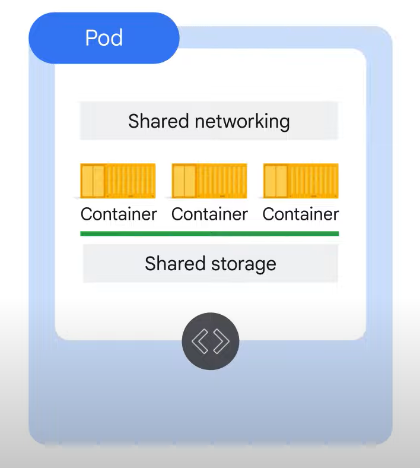

## Kubernetes 组件
Kubernetes 控制面板是使 Kubernetes 集群工作的一组协作进程。首先，集群需要计算机，而这些计算机通常是虚拟机。它们始终位于 GKE 中，但它们也可以是物理计算机。一台计算机称为控制平面，其他计算机称为节点。节点的工作是运行 Pod，控制平面的工作是协调整个集群。  
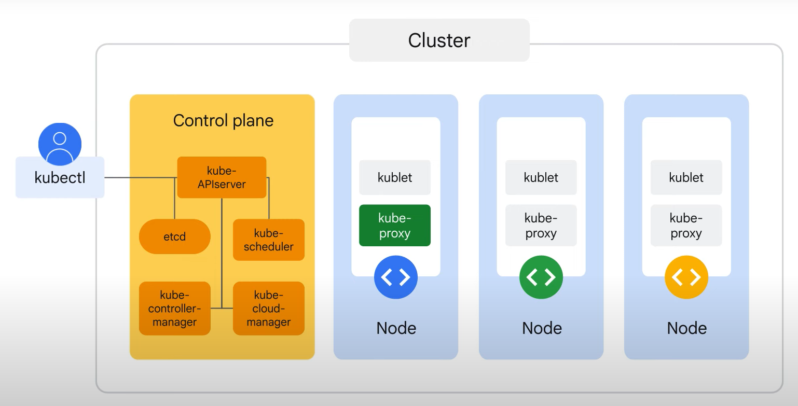

几个关键的 Kubernetes 组件在控制平面上运行。  
首先是 kube-apiserver 组件，它是您将直接与之交互的唯一组件。该组件的工作是接受查看或更改集群状态的命令。这包括启动 Pod。  
接下来是 kubectl 命令。kubectl 命令的作用是连接到 kube-apiserver 并使用 Kubernetes API 与其进行通信。kube-apiserver 还对传入请求进行身份验证，确定它们是否经过授权且有效，并管理准入控制。但与 kube-apiserver 对话的不仅仅是 kubectl。事实上，对集群状态的任何查询或更改都必须发送给 kube-apiserver。  
etcd 组件，它是集群的数据库。它的工作是可靠地存储集群的状态。这包括所有集群配置数据，以及更多动态信息，例如哪些节点是集群的一部分，哪些 Pod 应该运行，以及它们应该运行在哪里。您永远不会直接与 etcd 交互，而是 kube-apiserver 代表系统的其余部分与数据库交互。  
接下来是 kube-scheduler，它负责将 Pod 调度到节点上。Kube-scheduler 评估每个单独 Pod 的需求并选择最合适的节点。但是，它并不执行在节点上实际启动 Pod 的工作（由另一个组件完成）。相反，每当它发现尚未分配节点的 pod 对象时，它就会选择一个节点并将该节点的名称写入 Pod 对象。它知道所有节点的状态，并且还遵守您定义的有关 Pod 可以运行的位置的约束，同时考虑硬件、软件和策略详细信息。  
kube-controller-manager 组件有更广泛的工作——它通过 kube-apiserver 持续监控集群的状态。每当集群的当前状态与所需状态不匹配时，kube-controller-manager 将尝试进行更改以达到所需状态。它被称为控制器管理器，因为许多 Kubernetes 对象是由称为控制器的代码循环维护的，这些代码处理修复过程。  
kube-cloud-manager 组件管理与底层云提供商交互的控制器。

每个节点都运行一个称为 kubelet 的控制平面组件小系列。您可以将 kubelet 视为每个节点上的 Kubernetes 代理。当 kube-apiserver 想要在节点上启动 pod 时，它会连接到该节点的 kubelet。Kubelet 使用容器运行时来启动 pod 并监控其生命周期，包括就绪性和活动性探测，并向 kube-apiserver 报告。  
kube-proxy 组件，它维护集群中 Pod 之间的网络连接。

GKE 为我们管理所有控制平面组件。GKE 负责配置和管理其背后的所有控制平面基础设施。  
节点配置和管理取决于您使用的 GKE 模式类型。使用推荐的 Autopilot 模式，GKE 可以管理底层基础设施，例如节点配置、自动扩展、自动升级、基线安全配置和基线网络配置。使用标准模式，您可以管理底层基础设施，包括配置各个节点。

> Kubernetes 提供了多种容器运行时选择，但 GKE 用于其节点的 Linux 发行版启动了使用 Docker 运行时组件 containerd 的容器。

## GEK 自动驾驶模式和标准模式
两种可用的操作模式：自动驾驶模式和标准模式。  
从较高的层面来看，Autopilot 模式优化了 Kubernetes 的管理，提供了不干涉的体验。借助 Autopilot GKE，您只需按使用量付费。  
标准模式允许以多种不同的方式配置 Kubernetes 管理基础设施。这需要更多的管理开销，但会产生细粒度控制的环境。使用 GKE 标准，您可以为所有配置的基础设施付费，无论使用了多少基础设施。

GKE 标准模式具有与 Autopilot 相同的功能，但您负责集群的配置、管理和优化。除非您需要 GKE 标准提供的特定级别的配置控制，否则建议您使用 Autopilot 模式。

## 对象管理
所有 Kubernetes 对象都是通过唯一名称和唯一标识符来标识的。  
您可以使用清单文件定义希望 Kubernetes 创建和维护的对象。这些是可以用 YAML 或 JSON 编写的普通文本文件。  
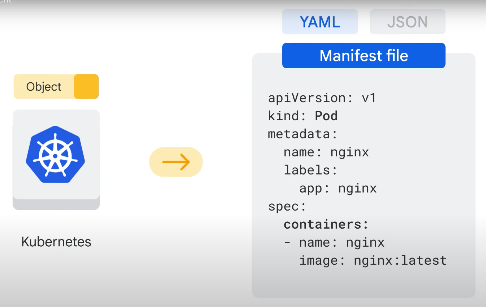
此清单文件定义了 Pod 的所需状态：其名称和要运行的特定容器映像。必填字段包括：
* apiversion，表示用于创建对象的 Kubernetes API 版本.
* kind，表示对象类型.
* 所有对象都通过名称来标识。在同一个 Kubernetes 命名空间中，只有一个对象可以同时具有特定名称。
* 集群生命周期中创建的每个对象都有一个由 Kubernetes 生成的唯一标识符或 UID。
* 标签是在对象创建期间或之后标记对象的键值对。标签有助于识别和组织对象。

> 我们强烈建议将 YAML 文件保存在版本控制存储库中，以便更轻松地跟踪和管理更改并在必要时撤消这些更改。重新创建或恢复集群时它也很有帮助。

为了保持应用程序的高可用性，您需要一种比指定单个 Pod 更好的方法在 Kubernetes 中管理它。一种选择是声明一个控制器对象。控制器对象的工作是管理 Pod 的状态。由于 Pod 被设计为短暂且一次性的，因此它们不会自我修复或修复，并且不会永远运行。
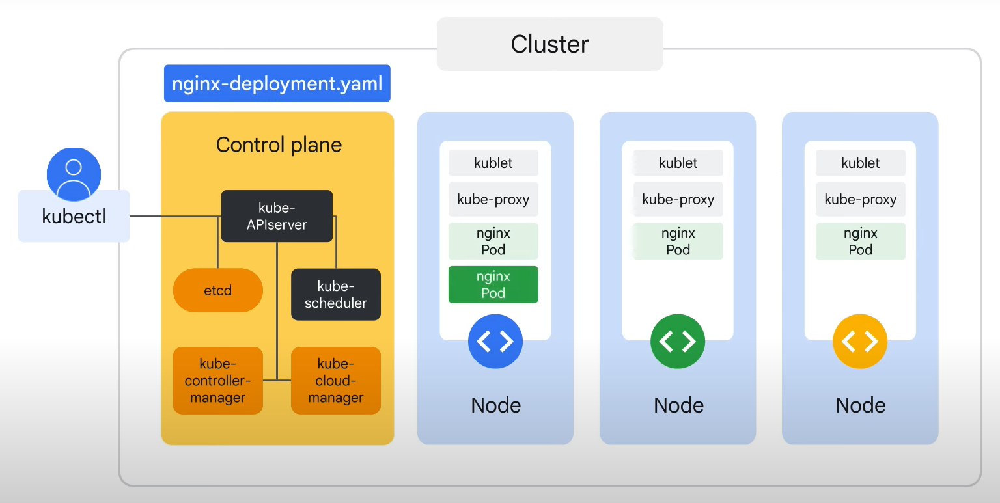
在我们的示例中，Deployment 控制器的实际作用是监控和维护三个 nginx Pod。当 kube-scheduler 为 Deployment 调度 Pod 时，它会通知 kube-apiserver。Deployment 控制器创建一个子对象（ReplicaSet）来启动所需的 Pod。

## 实验：[部署 GKE Autopilot 集群](../labs/403486.md)

# Kubernetes 运营
本课程的最后一部分介绍 kubectl 命令，它是用于与 Kubernetes 集群内的资源交互和管理资源的命令行实用程序。 向学员介绍内省的概念，然后练习从 Cloud Shell 部署 Google Kubernetes Engine 集群。

## 介绍
kubectl 是一个与 GKE 集群交互的命令行工具。因为它允许您从命令行管理 Kubernetes 资源，所以可以轻松自动化任务和解决问题。  
您将探索 kubectl 以及如何配置它，内省的含义以及如何使用它来排除集群故障。您还将练习从 Cloud Shell 部署 Google Kubernetes Engine 集群。

## kubectl 命令行
kubectl 是管理员用来控制 Kubernetes 集群的实用程序。它用于与控制平面上的 Kube API 服务器进行通信。  
在选定的 Kubernetes 集群中，kubectl 将命令行条目转换为 API 调用，并将它们发送到 Kube API 服务器。

在使用 kubectl 配置集群之前，必须先对其进行配置。kubectl 将其配置存储在主目录中名为 的隐藏文件夹中的文件中。  
kube，并包含集群列表以及将附加到每个集群的凭据。GKE 通过 gcloud 命令提供它们。要查看配置，请打开配置文件或使用 kubectl 命令：“config view”。

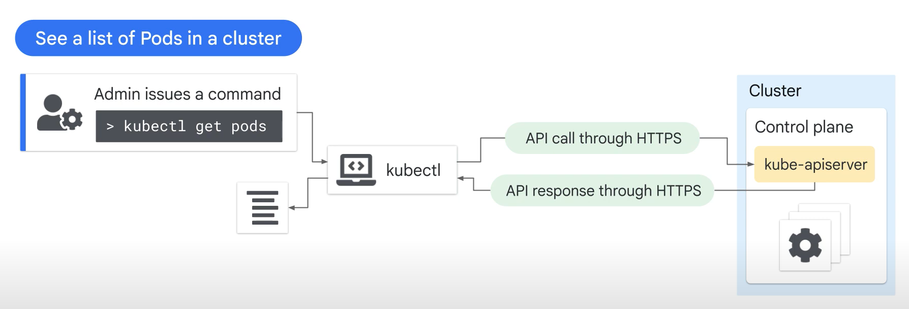

gcloud“get-credentials”命令会提供连接 GKE 集群所需的凭据。 
尽管 kubectl 是管理现有集群内部状态的工具，但它无法创建新集群或更改现有集群的形状。这是通过 GKE 控制平面完成的，gcloud 命令和 Google Cloud 控制台连接到该控制平面。

kubectl 的语法由四部分组成：命令、类型、名称和可选标志。
* 命令指定您要执行的操作，例如 get、describe、logs 或 exec。
* TYPE 定义了“命令”所作用的 Kubernetes 对象，例如 Pod、部署、节点或其他对象，包括集群本身。
* NAME 指定在 TYPE 中定义的对象。
* 末尾附加标志，您可以将其视为提出特殊请求的一种方式。  
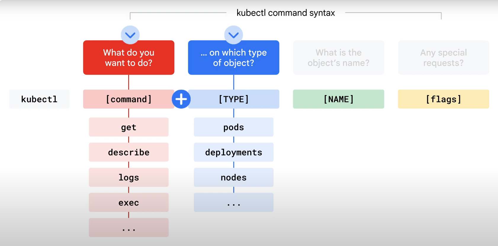  
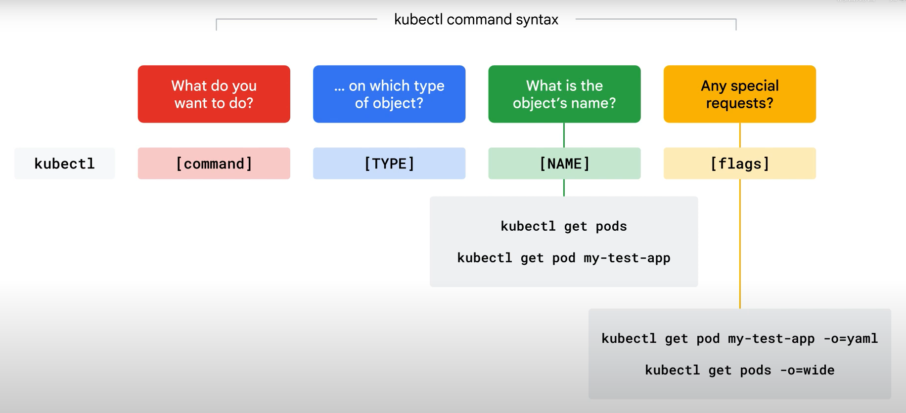

## 内省 (introspection)
我们将从四个命令开始，用于收集有关您的应用程序的信息：get、describe、exec 和 log。  
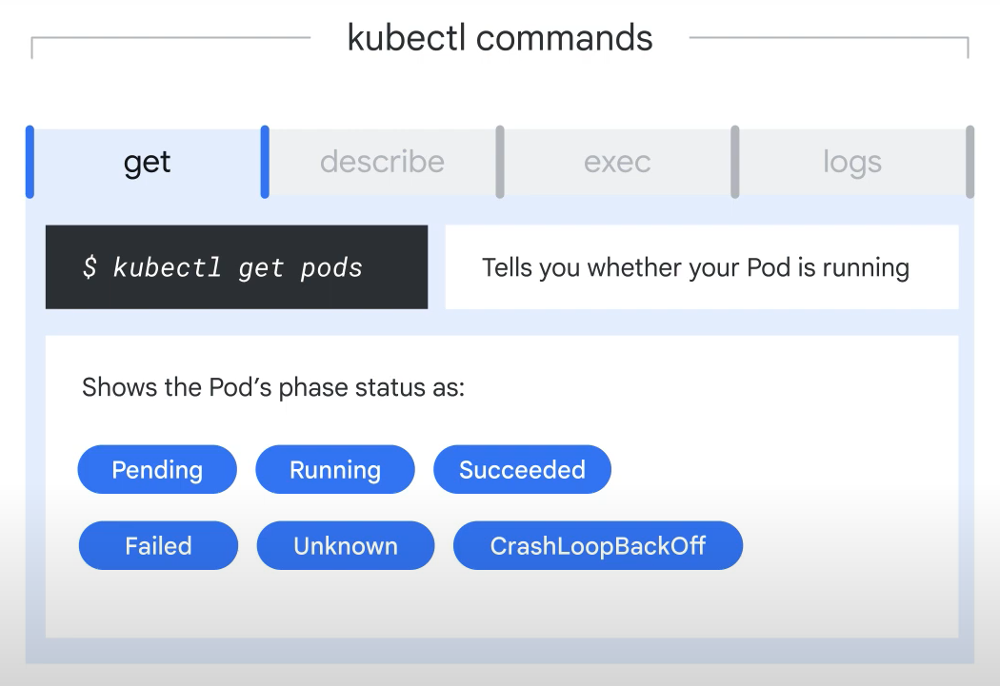  
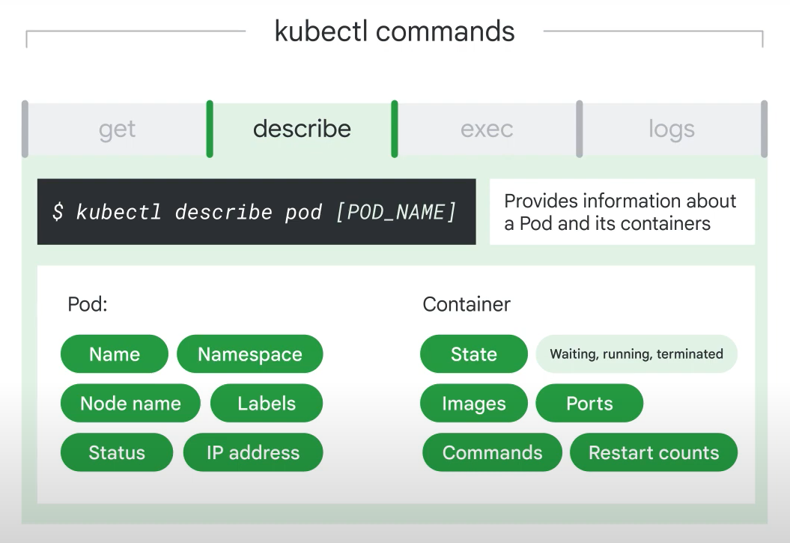  
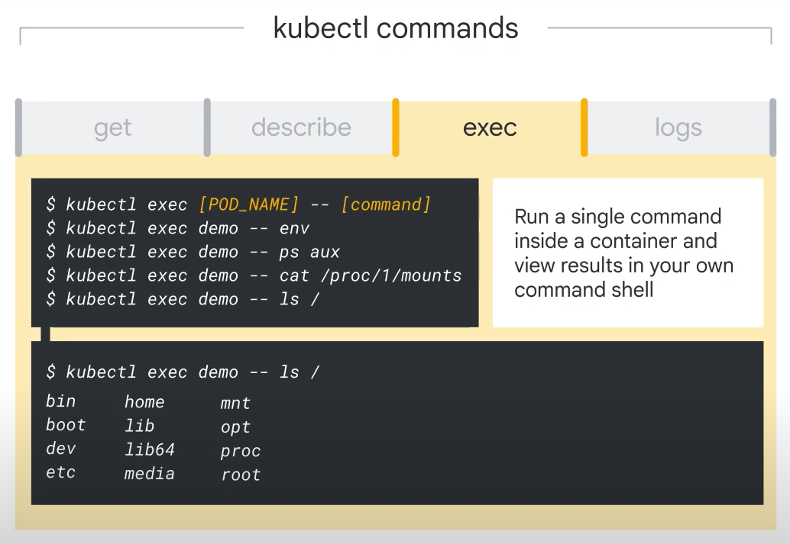  
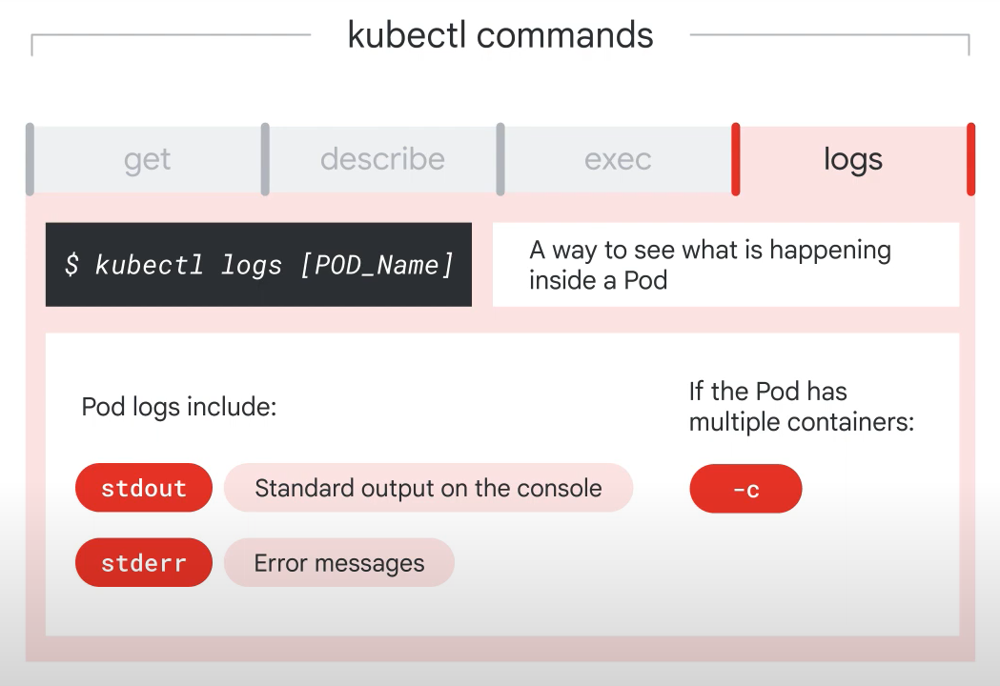  
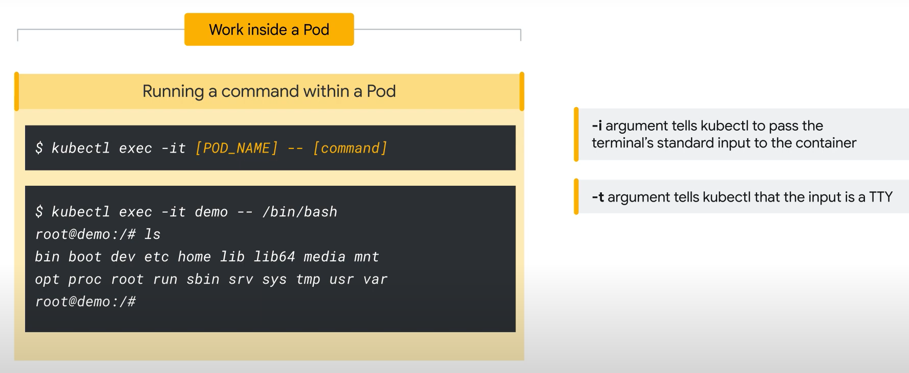  

> 现在需要注意的是，将软件直接安装到容器中并不是最佳实践，因为容器对其文件系统所做的更改通常是短暂的。相反，请考虑构建包含您所需软件的容器映像，而不是在运行时临时修复它们。

## 实验：[从 Cloud Shell 部署 GKE Autopilot 集群](../labs/403492.md)

# 课程总结
在课程的第一部分中，您探索了：云计算的定义、Google Cloud 为架构师和开发人员构建解决方案提供的服务、Google 强大的全球网络如何为 Google Cloud 服务提供支持、Google Cloud 资源的结构和管理方式、用于构建解决方案的工具、 确保您的组织不会意外地支付巨额 Google Cloud 账单，以及与 Google Cloud 交互的四种不同方式来开始工作。

在第二部分中，您了解了：容器、容器镜像、Kubernetes 和 Google Kubernetes Engine。

在课程的第三部分中，您将了解：Kubernetes 概念（例如 Kubernetes 对象模型和声明式管理原理）、Kubernetes 组件列表、Google Kubernetes Engine 概念（包括 Autopilot 和标准操作模式）以及 Kubernetes 对象管理。

最后您研究了：kubectl 以及如何配置它，内省的含义以及如何使用它来排除集群故障。