# [Google Cloud 基础知识：核心基础设施](https://www.cloudskillsboost.google/paths/19/course_templates/60)
Google Cloud 基础知识：核心基础设施介绍了使用 Google Cloud 的重要概念和术语。 本课程通过视频和动手实验，展示并比较了许多 Google Cloud 的计算和存储服务，以及重要的资源和策略管理工具。

# 课程信息
## 目标
* 确定 Google Cloud 产品和服务的目的和价值。
* 与 Google Cloud 服务交互。
* 选择并使用 Google Cloud 上的应用程序部署环境：App Engine、Google Kubernetes Engine 和 Compute Engine。
* 选择并使用 Google Cloud 的存储选项：Cloud Storage、Cloud SQL、Cloud Bigtable 和 Firestore。

# 课程介绍
本部分欢迎学员学习 Google Cloud 基础知识：核心基础设施课程，并概述课程结构和目标。

## 课程简介
Google Cloud 产品系列可以大致分为 计算、存储、大数据、机器学习和应用服务。  
实现五个关键学习目标：
* 认识到 Google Cloud 产品和服务的目的和价值。
* 选择和使用 Google Cloud 上的多种应用环境。
* 选择和使用 Google Cloud 存储方案。
* 与 Google Cloud 服务交互。
* 描述客户使用 Google Cloud 的各种方式。

# 谷歌云简介
本部分介绍了使用 Google Cloud 的一些主要优势。 在这里，我们介绍了 Google 网络基础设施的组件，并探讨了基础设施即服务 (IaaS) 和平台即服务 (PaaS) 之间的差异。

## 云计算概览
“云计算” 具有五个同等重要的特征：
* 客户可以获得按需、自助式的计算资源。
* 客户可以从可联网的任何位置，通过互联网访问这些资源。
* 云服务提供商拥有庞大的资源池，并将池中的资源分配给用户。
* 资源具有弹性，也就是说资源是灵活的。
* 客户只需为实际使用的资源付费。

回顾一下历史：
* 第一波浪潮称为主机托管，主机托管为用户提供了财务效率方面的优势，因为用户可以租用实体空间而不必投资数据中心不动产。
* 虚拟化数据中心是该趋势的第二波浪潮。
* Google改为采用一种基于容器的架构 一种全自动化、有弹性的第三波云架构。

## IaaS 和 PaaS
IaaS 产品提供原始计算、存储和网络功能、并通过虚拟方式将其组织为与实体数据中心相似的资源。  
PaaS 产品将代码与库绑定在一起，这些库支持访问应用所需的基础架构。  
在 IaaS 模式中，客户为提前分配好的资源付费。在 PaaS 模式中客户为其实际使用的资源付费。

## Google Cloud 网络
Google Cloud 在 Google 自己的全球网络上运行。该网络旨在通过利用全球 100 多个内容缓存节点，为客户的应用程序提供尽可能高的吞吐量和尽可能低的延迟。这些位置缓存了高需求内容以便更快地访问，从而允许应用程序响应来自提供最快响应时间的位置的用户请求。  

---

regions 代表独立的地理位置，由 zones 组成。  
zones 是部署 Google Cloud 资源的区域。  
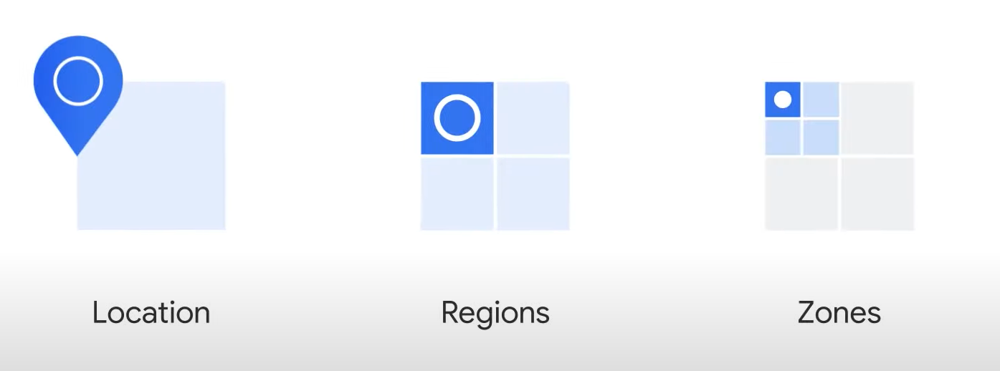
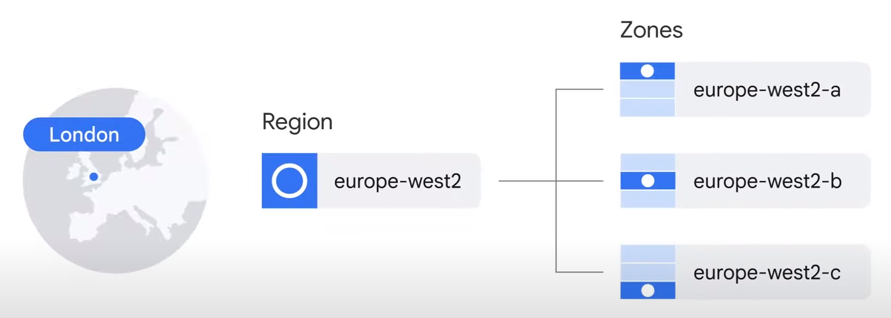

## 对环境造成的影响
略

## 安全
* 硬件基础架构层安全包含三项关键安全特性：
  * 硬件设计和来源
  * 安全启动堆栈
  * 现场安全
* 服务部署层安全：服务间通信加密。
* 用户身份层安全：集中身份服务。
* 存储服务层安全：数据加密。
* 内部通信层安全：Google Front End，拒绝服务攻击(DoS)防护。
* Google的运维安全层的四项安全特性：
  * 入侵检测。
  * 降低内部人员攻击风险。
  * 员工 U2F 的使用。
  * 严格的软件开发实践。

## 开源生态系统
Google 利用开源许可公布了关键技术元素，以便打造丰富的生态系统，为客户提供除 Google 以外的更多选择。

## 价格和结算
在线价格计算器可帮你估算费用。  
我们提供的一些工具可以助你一臂之力：预算，提醒，报告，配额。

## 测验：Google Cloud 简介
略

# 云中的资源和访问
本节探讨如何通过项目组织资源，以及如何通过名为身份和访问管理 (IAM) 的工具与适当的员工共享对这些资源的访问权限。 也在本节中，我们确定了与 Google Cloud 交互的不同方式。

## Google Cloud 资源层次结构
Google Cloud 的资源层次结构包含四个级别自下而上分别是：资源，项目，文件夹以及一个组织节点。  
资源层次结构直接关系到你在使用 Google Cloud 时管理和应用政策的方式。定义政策时，可以在项目，文件夹以及组织节点级别进行，部分 Google Cloud 服务还允许 向单个资源应用政策。政策会向下继承，也就是说，如果向某个文件夹应用了政策，该政策也会应用于这个文件夹内的所有项目。  
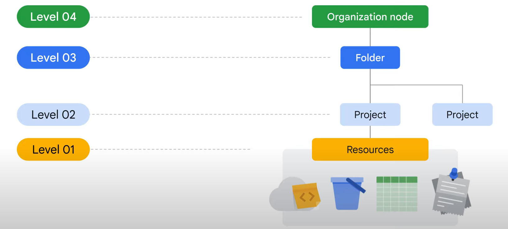
* 项目是启用和使用 Google Cloud 服务的基础，每个项目都是组织节点下的一个独立实体，每个资源都属于一个项目，项目可以有不同的所有者和用户，因为项目是分开结算和管理的。每个Google Cloud 项目具有三个标识特性：项目ID、项目名称以及项目编号。
* 利用文件夹你可以按照自己选择的粒度级别为资源指定政策。一个文件夹内的资源会继承分配给该文件夹的政策和权限，文件夹可以包含项目和或其他文件夹。使用文件夹可以以层次结构的形式整理组织名下的多个项目。
* 组织节点是 Google Cloud 层次结构中最高级别的资源，与帐号关联的其他所有资源都位于这个节点之下，包括文件夹，项目和其他资源。

## Identity and Access Management (IAM)
借助 IAM，管理员可以应用策略来定义谁可以执行什么操作以及对哪些资源执行操作。  
IAM 政策的“谁”部分可以是 Google 帐号、Google 群组、服务帐号或 Cloud Identity 域名。  
IAM 策略的“可以做什么”部分由角色定义。IAM 角色是权限的集合。当您将角色授予主体时，您将授予该角色包含的所有权限。  
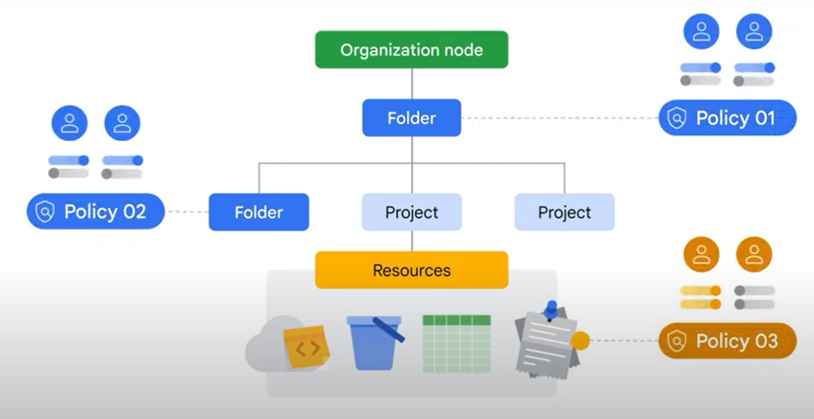  
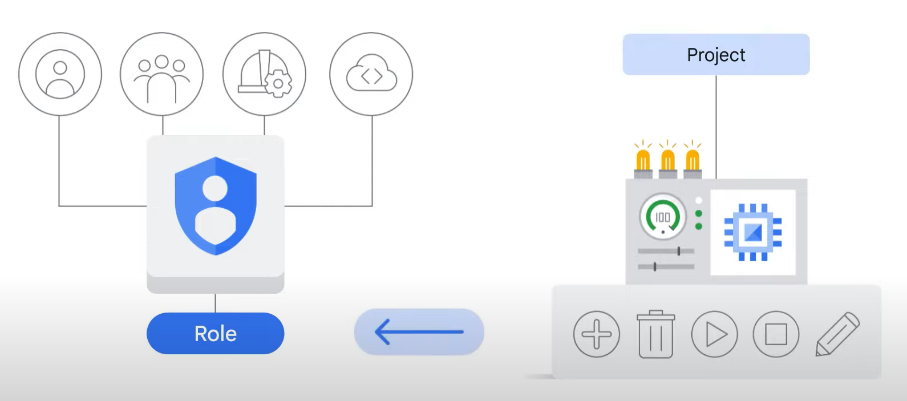  

---

IAM 中有三种角色：基本角色、预定义角色和自定义角色。  
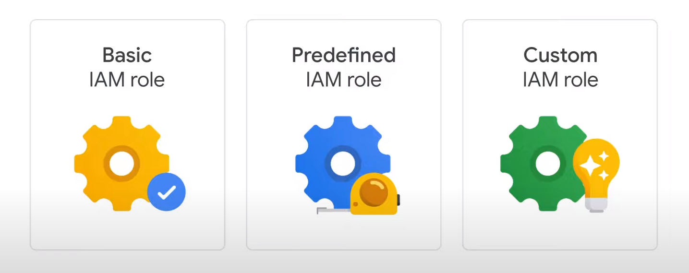

第一种角色类型是基本角色。基本角色的范围相当广泛。当应用于 Google Cloud 项目时，它们会影响该项目中的所有资源。  
基本角色包括所有者、编辑者、查看者和计费管理员。  
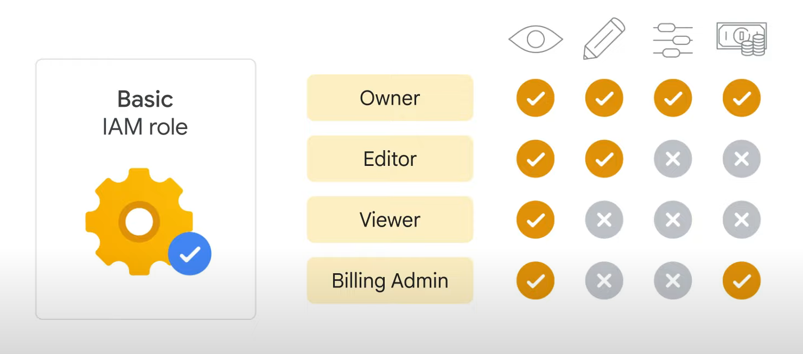

第二种角色，即预定义角色。特定的 Google Cloud 服务提供了一组预定义的角色，甚至定义了可以应用这些角色的位置。任何拥有这些角色的人都可以执行一组特定的预定义操作。  
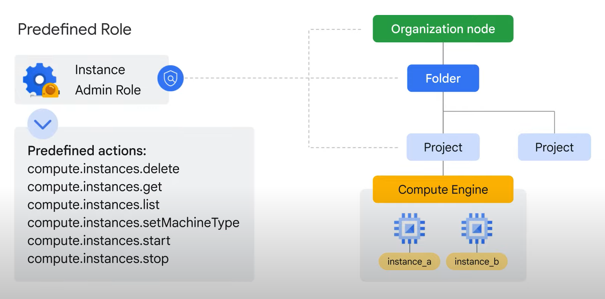

许多公司使用“最小权限”模型，在该模型中，组织中的每个人都被授予完成其工作所需的最小权限。这就是您使用自定义角色的时候。  
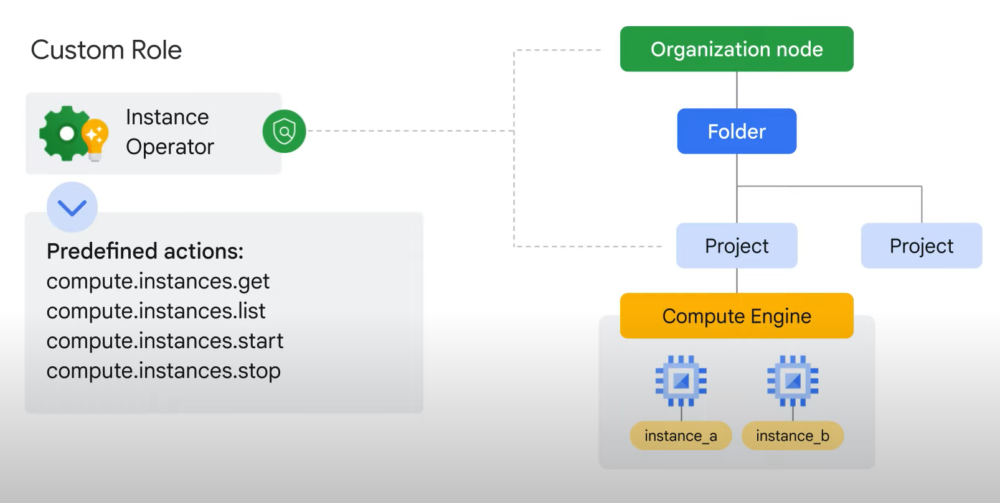
在开始创建自定义角色之前，请注意两个重要细节：
* 首先，您需要管理定义您创建的自定义角色的权限。
* 其次，自定义角色只能应用于项目级别或组织级别。它们不能应用于文件夹级别。

## 服务帐号
您可以将服务帐号关联到某个 Compute Engine 实例，以便在该实例上运行的应用可以使用该服务帐号证明其身份。然后，您可以向服务帐号授予 IAM 角色，让该服务帐号（以及实例上的应用）可以访问相应的 Google Cloud 资源。

## Cloud Identity
统一的身份、访问权限、应用和端点管理 (IAM/EMM) 平台。  
借助名为 Cloud Identity 的工具，组织可以使用 Google 管理控制台定义政策并管理其用户和群组。  
管理员可以使用在现有 Active Directory 或 LDAP 系统中使用的用户名和密码登录和管理 Google Cloud 资源。  
使用 Cloud Identity 还意味着，当有人离开组织时，管理员可以使用 Google 管理控制台禁用其帐户并将其从群组中删除。  

## 与 Google Cloud 交互
有四种方式可以访问 Google Cloud 并与之交互。Cloud Console、Cloud SDK 和 Cloud Shell、API 以及 Cloud Console 移动应用。
* 首先是 Google Cloud Console，它是 Google Cloud 的图形用户界面 GUI，可帮助您在简单的基于 Web 的界面中部署、扩展和诊断生产问题。
* 其次是通过 Cloud SDK 和 Cloud Shell。Cloud SDK 是一组工具，可用于管理 Google Cloud 上托管的资源和应用。Cloud Shell 提供直接从浏览器对云资源的命令行访问。
* 访问 Google Cloud 的第三种方式是通过应用程序编程接口 (API)。以便您编写的代码可以控制它们。
* 最后，访问 Google Cloud 并与之交互的第四种方式是使用 Cloud Console 移动应用程序，该应用程序可用于执行一些简单的任务。

## 实验：[Google Cloud 基础知识：Cloud Marketplace 使用入门](../labs/384327.md)

## 测验：Google Cloud 中的资源和访问

# 云中的虚拟机和网络
本课程的这一部分将探讨 Google Compute Engine 的工作原理，重点是虚拟网络。

## 虚拟私有云网络
虚拟私有云(VPC) 是一种安全、独立且不公开的云计算模型。它托管在 Google Cloud 这样的公有云内。在VPC中，客户可以运行代码、存储数据、托管网站并且执行可在普通私有云内执行的任何操作。只是这种私有云由公有云提供商远程托管。也就是说、VPC 结合了公有云计算的可伸缩性和便利性以及私有云计算的数据隔离。VPC 网络将 Google Cloud 资源彼此连接并将它们连接到互联网。这包括使用防火墙规则、进行网络分段。从而限制对实例的访问、并创建静态路由以将数据流量转发到特定目的地。

## Compute Engine
借助 Compute Engine，用户可以在 Google 基础设施上创建和运行虚拟机。虚拟机的配置方式与物理服务器非常相似：通过指定所需的 CPU 功率和内存数量、所需的存储量和类型以及操作系统。  
开始使用 Google Cloud 的一种快速方法是通过 Cloud Marketplace，该市场提供来自 Google 和第三方供应商的解决方案。  
对于虚拟机的使用，Compute Engine 按秒计费，最少为一分钟，并且随着虚拟机运行时间的延长，持续使用折扣开始自动应用于虚拟机。  
* 对于每个月运行时间超过 25% 的虚拟机，Compute Engine 会自动为每增加一分钟应用折扣。
* Compute Engine 还提供承诺使用折扣。
* 然后还有抢占式虚拟机和 Spot 虚拟机。

在存储方面，Compute Engine 不需要特定的选项或机器类型即可在处理磁盘和永久性磁盘之间获得高吞吐量。

## 扩缩虚拟机
我们了解到通过 Compute Engine 你可以为自己的实例选择最合适的机器属性，比如虚拟 CPU 数量和内存量。方法是从一组预定义的机器类型中选择或是创建自定义机器类型。为此，Compute Engine 提供 一种叫做自动扩缩的功能。它支持根据负载指标为应用增加或减少虚拟机数量。实现这一机制的另一部分是：在虚拟机之间实现传入数据流量的均衡。Google 的虚拟私有云(VPC) 支持多种不同类型的负载均衡。

## 重要的 VPC 兼容性
与物理网络非常相似，VPC 也有路由表。VPC 路由表是内置的，因此您无需配置或管理路由器。  
您无需为 Google Cloud 配置或管理的另一件事是防火墙。可以通过Compute Engine实例上的网络标签来定义防火墙规则。  
通过 VPC 对等互连，可以在两个 VPC 之间建立关系以交换流量。  
或者，要使用身份访问管理 (IAM) 的全部功能来控制一个项目中的人员和内容可以与另一个项目中的 VPC 进行交互，您可以配置共享 VPC。  

## Cloud Load Balancing
通过 Cloud Load Balancing 实现的负载均衡器的任务就是将用户数据流量分布到一个应用的多个实例上，通过分散负载，使负载均衡。能降低应用发生性能问题的风险。Cloud Load Balancing 是一种完全分布式的软件定义的代管式服务。可处理所有数据流量，负载均衡器并不运行在需要由你管理的虚拟机内，你也不必为其扩缩或管理而费心，你可以使用Cloud Load Balancing 来处理自己的所有数据流量 HTTP 或 HTTPS，其他TCP，和SSL数据流量以及UDP数据流量。  
VPC提供了负载均衡套件：
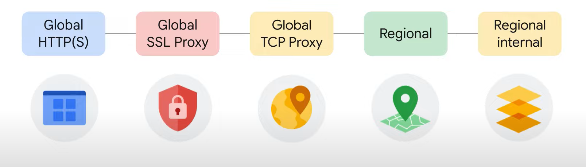
* 如果需要为某个Web应用实现跨区域负载均衡，可使用全局 HTTP 负载均衡。
* 对于安全套接字层数据流量，也就是并非使用 HTTP 协议的数据流量，可使用全局 SSL 代理负载均衡器。
* 对于并非使用 SSL 协议的其他 TCP 数据流量，可使用 TCP 代理负载均衡器。
* 如果你想为 UDP 数据流量或任意端口号上的数据流量实现负载均衡，那么可以使用区域负载均衡器。
* 如果你想为项目内的数据流量实现负载均衡，可以使用区域级内部负载均衡器，它能接收传送到某个 Google Cloud 内部 IP 地址的数据流量，并在 Compute Engine 虚拟机之间为其实现负载均衡。

## Cloud DNS and Cloud CDN
DNS 负责将互联网主机名转换为地址，正如您可能想象的那样，Google 拥有高度发达的 DNS 基础设施。  
Google Cloud 提供 Cloud DNS 来帮助全世界找到它们。它是一项托管 DNS 服务，与 Google 运行在同一基础设施上。它具有低延迟和高可用性，是一种经济高效的方式，可以让您的用户可以使用您的应用程序和服务。您发布的 DNS 信息由世界各地的冗余位置提供。云 DNS 也是可编程的。您可以使用 Cloud Console、命令行界面或 API 发布和管理数百万个 DNS 区域和记录。  
谷歌还拥有一个全球边缘缓存系统。边缘缓存是指使用缓存服务器来存储更靠近最终用户的内容。您可以使用此系统通过 Cloud CDN（内容分发网络）加速应用程序中的内容分发。

## 将网络连接至 Google VPC
许多 Google Cloud 客户都希望将其 Google 虚拟私有云连接到其系统中的其他网络，例如本地网络或其他云平台中的网络。可通过多种有效的方法来实现这一目标：

* 一种方案是从互联网上的虚拟专用网连接开始，然后使用 IPSec VPN 协议创建隧道连接。（通过协议构建一条加密通道）
* 第二种方案就是考虑使用与 Google 之间的直接对等互连(Direct Peering)。对等互连是指在 Google 入网点所在的公共数据中心内放置一台路由器，用它来在网络之间交换数据流量。（通过 Google Cloud 网络大院的保安进行传输）
* 运营商对等互连可以通过服务提供商的网络从本地网络直接访问 Google Workspace 以及可通过一个或多个公共 IP 地址予以公开的 Google Cloud 产品。（通过运营商的网络进行传输）
* 专用互连是不错的解决方案。这种方案支持与 Google 建立一条或多条不公开的直接连接通道。（建立直通地铁隧道）
* 合作伙伴互连是通过受支持的服务提供商实现本地网络与 VPC 网络之间的连接。（通过运营商的网络进行传输）

## 实验：[VPC 网络和 Google Compute Engine 使用入门](../labs/384336.md)

## Quiz: 云中的虚拟机和网络
略

# 云端存储
本课程的这一部分展示了五种核心 Google Cloud 存储产品：Cloud Storage、Cloud Bigtable、Cloud SQL、Cloud Spanner 和 Firestore。

## Google Cloud 存储方案
每个应用都需要存储数据，例如要流式传输的媒体内容或者是来自设备的传感器数据。而不同的应用和工作负载需要采用不同的存储数据库解决方案。 Google Cloud 提供了多种存储方案来存储结构化数据，非结构化数据，事务型数据，以及关系型数据。我们将探索 Google Cloud 的五种存储产品 Cloud Storage, Cloud SQL, Cloud Spanner, Firestore 以及 Cloud Bigtable。

## Cloud Storage
什么是对象存储呢？对象存储是一种计算机数据存储架构。它将数据作为对象进行管理，而不像文件存储那样将数据作为文件和文件夹层次结构进行管理，也不像块存储那样将数据作为磁盘中的块进行管理。  
这些对象以打包的格式存储，其中包含实际数据本身的二进制形式以及与其关联的元数据。例如创建日期、作者、资源类型和权限以及一个全局唯一标识符。这些唯一键采用的是网址形式，因此对象存储能够很好地与 Web 技术进行交互。

---

存储对象是不可变的。也就是说在每次执行更改时你所执行的操作并不是修改原有对象，而是创建一个新版本。管理员可以选择让各个新版本完全覆盖旧版本，也可以选择在一个存储桶内启用版本控制，从而跟踪一个特定对象内的每一项更改，如果选择使用版本控制 Cloud Storage 会保留详尽的修改历史记录。

---

有一些选项可用于控制用户对于对象和存储桶的访问权限。对于大多数用途而言，IAM 足以满足需求。角色会从项目继承到存储桶，再继承到对象。如果需要更精细的控制，可以创建访问控制列表，每个访问控制列表均包含两部分信息：第一部分是范围，定义了谁能访问和执行操作，这可以是某个特定用户，也可以是用户组。第二部分是权限，定义了可以执行哪些操作。例如读取或写入。由于存储和检索大量对象数据可能会导致费用飞速增长。Cloud Storage 还提供了生命周期管理政策。例如，可以指示 Cloud Storage 删除存储时间超过365天的对象，或者删除在 2013 年 1 月 1 日之前创建的对象，或者在启用了版本控制的存储桶内仅保留每个对象最近的三个版本。

## Cloud Storage: 存储类别和数据传输
Cloud Storage 中有四种主要存储类别。
* 第一个是标准存储。标准存储被认为最适合频繁访问或“热”数据。它也非常适合仅存储短暂时间的数据。
* 第二个存储类别是近线存储。这最适合存储不经常访问的数据，例如平均每月一次或更短时间读取或修改数据。
* 第三种存储类别是 Coldline 存储。这也是存储不经常访问的数据的低成本选项。与近线存储相比，冷线存储最多每 90 天读取或修改一次数据。
* 第四种存储类别是归档存储。这是成本最低的选项，非常适合数据归档、在线备份和灾难恢复。对于您计划每年访问次数少于一次的数据来说，这是最佳选择，因为它的数据访问和操作成本较高，并且最短存储期限为 365 天。

---

几个特征适用于所有这些存储类别。
* 无最小对象大小要求的无限存储、全球可访问性和位置、低延迟和高耐用性、统一的体验以及地理冗余。
* 云存储没有最低费用，因为您只需为使用的内容付费，并且不需要预先配置容量。
* 从安全角度来看，云存储始终在将数据写入磁盘之前在服务器端对其进行加密，无需额外付费。
* 客户设备和 Google 之间传输的数据使用 HTTPS/TLS（传输层安全性）进行加密。

---

可以通过多种方式将数据导入 Cloud Storage。
* 使用 gcloud storage（来自 Cloud SDK 的 Cloud Storage 命令）进行自己的在线传输。
* 通过 Google Chrome 网络浏览器访问，还可以使用 Cloud Console 中的拖放选项移入数据。
* 存储传输服务 (Storage Transfer Service) 使您能够快速、经济高效地将大量在线数据导入云存储。
* Transfer Appliance，它是您从 Google Cloud 租用的可机架式大容量存储服务器。您将其连接到网络，加载数据，然后将其发送到上传设施，数据将上传到云存储。

## Cloud SQL
Cloud SQL 提供全代管式关系型数据库,包括 MySQL,PostgreSQL和SQL Server。借助该工具你可以将乏味但必要且往往耗时的任务交由 Google 来完成，比如应用补丁和更新，管理备份和配置，Cloud SQL不需要任何软件安装或维护。  
它能纵向扩容到 64 个处理器核心，超过400 GB的RAM 以及30 TB的存储空间。它支持自动复制情景，例如从一个 Cloud SQL 主实例复制，从一个外部主实例复制以及从多个外部 MySQL 实例复制。Cloud SQL支持代管式备份，因此备份的数据可安全存储并且可以在需要恢复时进行访问。  
Cloud SQL 会对 Google 内部网络中的客户数据以及数据库表、临时文件和备份中存储的客户数据进行加密，它包含网络防火墙，可控制对每个数据库实例的网络访问。Cloud SQL实例的另一大优势是可以通过其他 Google Cloud 服务，甚至是外部服务访问 Cloud SQL。

## Cloud Spanner
Cloud Spanner 是一种完全托管的关系数据库服务，可水平扩展、高度一致并使用 SQL。Cloud Spanner 特别适合需要以下功能的应用程序：具有联接和二级索引的 SQL 关系数据库管理系统，内置高可用性，强大的全局一致性以及每秒大量的输入和输出操作。

## Firestore
Firestore 是一款灵活且可横向扩容的 NoSQL 云端数据库，适合用于移动、Web 和服务器开发。  
使用 Firestore 时，数据会存储在文档中，随后整理为集合, 文档还可包含复杂的嵌套对象。Firestore 的 NoSQL 查询可用于检索各个特定文档，或者用于检索集合中与查询参数匹配的所有文档。查询可以包括多个过滤条件，并支持结合使用过滤和排序选项。默认情况下，它们还会编入索引，因此查询性能与结果集的大小成正比，而不是与数据集的大小成正比。  
Firestore 使用数据同步来更新所连接的任何设备中的数据。不过，它还可用来高效地执行简单、一次性的获取查询。  
它会缓存应用当前使用的数据，这样即使在设备离线的情况下，应用也能写入、读取、监听和查询数据。当设备恢复为在线状态时， Firestore 会将所有本地更改同步回 Firestore。  
Firestore 利用 Google Cloud 强大的基础架构，具备以下特点：自动多机房和数据复制，强大的一致性保证，原子批量操作以及真正的事务支持。

## Cloud Bigtable
Cloud Bigtable是Google的NoSQL大数据数据库服务。  
Bigtable 可处理海量工作负载，同时确保始终如一的低延迟和较高的吞吐量。因此，不论对于运营应用还是分析应用，它都是非常理想的选择。这其中包括物联网、用户分析和财务数据分析。  
客户选择 Bigtable 的情景通常有：他们要处理超过 1TB 的半结构化或结构化数据。数据传输速率快、吞吐量高或者数据快速变化。他们要处理 NoSQL 数据，这通常是指事务不需要较强的关系语义。数据属于时间序列型或者具有自然语义顺序。他们要处理大数据，对数据运行异步批处理或者同步实时处理。或者他们要对数据运行机器学习算法。  
利用数据服务层从 Cloud Bigtable 中读取数据或向其写入数据。这通常用来向应用信息中心和数据服务传送数据。数据还可以通过各种常见的流处理框架流式传入。还可以通过批处理流程从 Cloud Bigtable 读取数据或向其写入数据。

## Comparing storage options
略

## 实验：[Google Cloud 基础知识：Cloud Storage 和 Cloud SQL 使用入门](../labs/384346.md)

## 测验：云中的存储
略

# 云中的容器
本课程的这一部分将探讨容器以及如何使用 Kubernetes 和 Google Kubernetes Engine 管理容器。

## 容器简介
略

## Kubernetes
Kubernetes 是一个用于管理容器化工作负载和服务的开源平台。  
通过使用一个或多个容器的包装器在节点上部署容器，这就是 Pod 的定义。Pod 是您创建或部署的 Kubernetes 中的最小单元。  
Deployment 代表同一 Pod 的一组副本，即使运行的节点发生故障，Pod 仍能保持运行。  
服务是一个抽象，它定义了一组逻辑 Pod 以及访问它们的策略。

## Google Kubernetes Engine
GKE 是 Google 在云中托管的托管 Kubernetes 服务。

## 混合云和多云
利用混合架构或多云架构，你可以将部分系统基础架构保留在本地，同时将其他部分迁移到云端。从而创建能够满足公司独特需求的环境。

## Anthos
Anthos 是一个混合和多云解决方案。Anthos 框架建立在 Kubernetes 和 GKE On-Prem 的基础上,这为完全集成的架构提供了基础,并对一个中央控制平面进行集中管理.该控制平面支持跨混合和多云环境的，基于政策的应用生命周期交付。Anthos 还提供一组丰富的工具用于监控和维护应用，在所有网络中的一致性，无论是在本地、云端还是多云环境中。
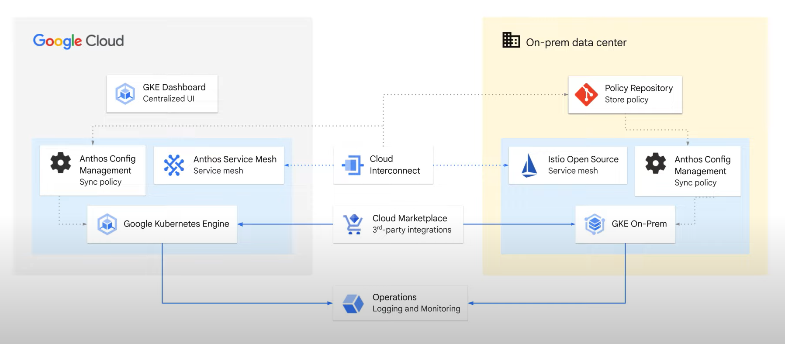

## 实验：[Google Cloud 基础知识：GKE 使用入门](../labs/384353.md)

## 测验: 云中的容器
略

# 云中的应用程序
本课程这一部分的重点是在云中开发应用程序。 我们将在这里探索 App Engine、两个 API 管理工具（Apigee Edge 和 Cloud Endpoints）以及 Cloud Run。

## App Engine
App Engine 是一个全代管式的无服务器平台，用于大规模开发和托管 Web 应用。  
借助 App Engine 你可以自由选择各种热门的编码语言，代码库和框架。使用熟悉的工具开发应用，然后根据需求自动预配服务器和扩缩应用实例。  
App Engine 提供多种内置服务和API：例如 NoSQL 数据存储、内存缓存、负载均衡、健康检查、应用日志记录和用户身份验证 API。  
App Engine 还提供软件开发套件，也称SDK，帮助你开发，部署和管理本地计算机上的应用。  
可以使用 Security Command Center 自动扫描和检测Web应用的常见安全漏洞。

## App Engine 环境
App Engine 环境有两种类型标准环境和柔性环境。  

## Google Cloud API 管理工具
应用程序开发人员构建他们编写的软件，以便提供一个干净、定义良好的界面，隐藏不必要的细节，然后他们记录该界面。这是一个应用程序编程接口。  
Google Cloud 提供了三种 API 管理工具：Cloud Endpoints、API Gateway 和 Apigee API Management。
* Cloud Endpoints 是一个分布式 API 管理系统，它使用分布式可扩展服务代理，该代理是在自己的 Docker 容器中运行的服务代理。目标是帮助您创建和维护低延迟和高性能的最苛刻的 API。Cloud Endpoints 提供 API 控制台、托管、日志记录、监控和其他功能，帮助您创建、共享、维护和保护 API。
* API网关是另一个API管理工具。API Gateway 使您能够通过定义明确的 REST API 提供对后端服务的安全访问，无论服务实现如何，该 API 在所有服务中都是一致的。
* 另一个可用于开发和管理 API 代理的 Google Cloud 平台是 Apigee API Management。与 Cloud Endpoints 不同，Apigee API Management 特别关注业务问题，例如速率限制、配额和分析。

## Cloud Run
Cloud Run 这是一个代管式计算平台，让你可以通过 Web 请求或 Pub/Sub 事件运行无状态容器。Cloud Run 是无服务器的，因此无需任何基础架构管理任务，你可以专注于开发应用。  
Cloud Run 开发者工作流 是一个简单直接的三步流程：
* 首先，使用你喜欢的编程语言编写应用，这个应用需要启动一个监听 Web 请求的服务器
* 其次，构建应用并将其打包到容器映像中
* 第三，容器映像被推送到 Artifact Registry
* 最后，将映像部署到 Cloud Run

## 实验：[Hello Cloud Run (CBL333)](../labs/CBL333.md)

# 在云中开发和部署
本部分探讨在云中进行开发的 Google Cloud 方法，其中包括 Cloud Source Repositories、Cloud Functions 和 Terraform。 本节还探讨了基础设施即代码的部署。

## 云端开发
Cloud Source Repositories 提供托管在 Google Cloud 上的功能齐全的 Git 存储库，支持任何应用程序或服务的协作开发，包括在 App Engine 和 Compute Engine 上运行的应用程序或服务。

---

Cloud Functions 是一种轻量级、基于事件的异步计算解决方案，允许您创建响应云事件的小型单一用途函数，而无需管理服务器或运行时环境。

## 部署：基础架构即代码
使用模板会更加高效，使用模板可以像编写配置文件一样为应用环境编写规范，然后你可以将模板部署在规模较大的环境中，以便根据需要快速创建任意多个相同的应用环境，你可以通过 Terraform 来实现。你可以在 Cloud Source Repositories 中存储 Terraform 模板，并控制其版本。

## 实验：[使用 Terraform 自动部署基础架构](../labs/384363.md)

## 测验：在云中开发和部署
略

# 云端记录和监控
本节强调监控与产品可靠性相关的性能的重要性，然后继续定义服务级别指标 (SLI)、服务级别目标 (SLO) 和服务级别协议 (SLA)。 它还检查了集成监视、日志记录、警报和调试的目的。

## 监控的重要性
略

## 衡量性能和可靠性
有四个衡量系统性能和可靠性的黄金信号：分别是延迟时间，流量，饱和度和错误。

## 理解 SLI、SLO 和 SLA
SLI、SLO和SLA 这些都是目标集优先的黄金信号指标系统。

## 集成的可观测性工具
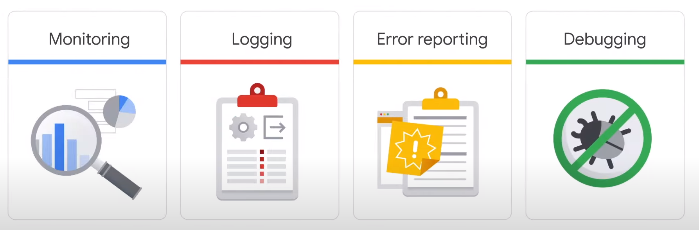

## 监控工具
Cloud Monitoring:直观了解您的应用和基础架构的性能、可用性和健康状况。

## 日志记录工具
Cloud Logging:全代管式实时日志管理功能，提供 EB 级的存储、搜索、分析和提醒服务。

## 错误报告和调试工具
Cloud Trace：找出生产环境中的性能瓶颈。  
Cloud Profiler 是一个低开销的统计性能剖析器，可从生产应用中持续收集有关 CPU 使用率和内存分配情况的信息。  
Error Reporting：识别和了解应用错误。

## 测验：云中的日志记录和监控
略